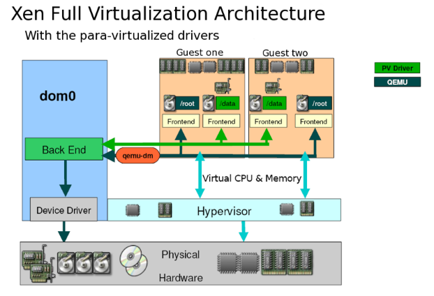

- [2. 历史](#2-历史)
- [3. 架构](#3-架构)
  - [3.2. 开源协议](#32-开源协议)
  - [3.3. Domain 0](#33-domain-0)
  - [3.4. Domain U](#34-domain-u)
  - [3.5. Xen 半虚拟化](#35-xen-半虚拟化)
  - [3.6. Xen 完全虚拟化](#36-xen-完全虚拟化)
- [4. Xen 前景](#4-xen-前景)

# 2. 历史

早在 20 世纪 90 年代, 伦敦剑桥大学的 Ian Pratt 和 Keir Fraser 在一个叫做 Xenoserver 的研究项目中, 开发了 Xen 虚拟机. 作为 Xenoserver 的核心, Xen 虚拟机负责管理和分配系统资源, 并提供必要的统计功能. 在那个年代, X86 的处理器还不具备对虚拟化技术的硬件支持, 所以 Xen 从一开始是作为一个准虚拟化的解决方案出现的. 因此, 为了支持多个虚拟机, **内核必须针对 Xen 做出特殊的修改才可以运行**.

为了吸引更多开发人员参与, 2002 年 Xen 正式被开源. 在先后推出了 1.0 和 2.0 版本之后, Xen 开始被诸如 Redhat, Novell 和 Sun 的 Linux 发行版集成, 作为其中的虚拟化解决方案.

2004 年, Intel 的工程师开始为 Xen 添加硬件虚拟化的支持, 从而为即将上市的新款处理器做必需的软件准备.

在他们的努力下, 2005 年发布的 Xen 3.0, 开始正式支持 Intel 的 VT 技术和 IA64 架构, 从而 Xen 虚拟机可以运行完全没有修改的操作系统.

2007 年 10 月, 思杰公司出资 5 亿美金收购了 XenSource, 变成了 Xen 虚拟机项目的东家.

与 Xen 在功能开发上的快速进展形成对比的是, Xen 在将它对内核的修改集成进入内核社区方面进展不大. 有部分重要的内核开发人员不喜欢 Xen 的架构和实现, 多位内核维护人员公开声明不欢迎 Xen. 这样的形势一直持续到 2010 年, 在基于内核的 PVOPS 对 Xen 做了大量重写之后, 内核社区才勉强接纳了 Xen. 当然, 目前从 Linux 3.0 版本开始的内核主干对 Xen 的支持还是越来越好了.

# 3. 架构

## 3.2. 开源协议

Xen 主要采用 GNU General Public License v2(GPLv2)开源协议,同时部分代码使用了 BSD 许可证.

* GPLv2 协议:这是一种具有传染性的开源许可证.它赋予用户运行,修改和重新分发软件的自由,但要求基于该软件的衍生作品也必须以 GPLv2 许可发布其源代码.也就是说,如果对采用 GPLv2 许可的 Xen 代码进行修改并分发修改后的版本,那么**修改后的版本也需要开源**.

* BSD 许可证:相对较为宽松,允许在保留版权声明和许可声明的前提下,自由地使用,修改和重新分发软件,包括将其用于商业产品,且**不必公开衍生作品的源代码**.不过 Xen 中使用 BSD 许可的部分占比相对较小.

Linux 和 QEMU 也都是 GPLv2 协议

## 3.3. Domain 0

Domain 0 是经过修改的 Linux 内核, 是运行在 Xen Hypervisor 之上独一无二的虚拟机, 拥有访问物理 I/O 资源的特权, 并且可以与其他运行在 Xen Hypervisor 之上的其他虚拟机进行交互. 所有的 Xen 虚拟环境都需要先运行 Domain 0, 然后才能运行其他的虚拟虚拟机.

Domain 0 在 Xen 中担任管理员的角色, 它负责管理其他虚拟虚拟机.

在 Domain 0 中包含两个驱动程序, 用于支持其他客户虚拟机对于网络和硬盘的访问请求. 这两个驱动分别是 Network Backend Driver 和 Block Backend Driver.

## 3.4. Domain U

Domain U 客户虚拟机没有直接访问物理硬件的权限. 所有在 Xen Hypervisor 上运行的半虚拟化客户虚拟机 (简称: Domain U PV Guests) 都是被修改过的基于 Linux 的操作系统, Solaris,FreeBSD 和其他基于 UNIX 的操作系统. 所有完全虚拟化客户虚拟机 (简 称: Domain U HVM Guests) 则是标准的 Windows 和其他任何一种未被修改过的操作系统.

无论是半虚拟化 Domain U 还是完全虚拟化 Domain U, 作为客户虚拟机系统, Domain U 在 Xen Hypervisor 上运行并行的存在多个, 他们之间相互独立, 每个 Domain U 都拥有自己所能操作的虚拟资源(如: 内存, 磁盘等). 而且允许单独一个 Domain U 进行重启和关机操作而不影响其他 Domain U.

## 3.5. Xen 半虚拟化

半虚拟化 (Paravirtualization) 有些资料称为 "超虚拟化", 简称为 PV, 是 Xen 主导的虚拟化技术. 这种技术允许虚拟机操作系统感知到 自己运行在 Xen Hypervisor 上而不是直接运行在硬件上, 同时也可以识别出其他运行在相同环境中的客户虚拟机.

在 Xen Hypervisor 上运行的半虚拟化的操作系统, 为了调用系统管理程序(Xen Hypervisor), 要有选择地修改操作系统, 然而却不需要修改操作系统上运行的应用程序. 由于 Xen 需要修改操作系统内核, 所以您不能直接让当前的 Linux 内核在 Xen 系统管理程序中运行, 除非它已经移植到了 Xen 架构. 不过, 如果当前系统可以使用新的已经移植到 Xen 架构的 Linux 内核, 那么您就可以不加修改地运行现有的系统.

## 3.6. Xen 完全虚拟化

完全虚拟化 (Hardware Virtual Machine) 又称 "硬件虚拟化", 简称 HVM, 是指运行在虚拟环境上的虚拟机在运行过程中始终感觉自己是直接运行在硬件之上的, 并且感知不到在相同硬件环境下运行着其他虚拟机的虚拟技术.

在 Xen Hypervisor 运行的完全虚拟化虚拟机, 所运行的操作系统都是标准的操作系统, 即: 无需任何修改的操作系统版本. 同时也需要提供特殊的硬件设备. 值的注意的是, **在 Xen 上虚拟的 Windows 虚拟机必须采用完全虚拟化技术**.

# 4. Xen 前景

Xen hypervisor 是一个专门为虚拟机开发的微内核, 所有其资源管理和调度策略完全是针对虚拟机的特性而开发的.

Xen 微内核直接运行于真实物理硬件只上, 开发和调试都比基于操作系统的虚拟化困难.

微内核架构和 Linux 宏内核架构本身冲突, 所以内核社区对 Xen 比较抵制. 与 KVM 形成对比.
