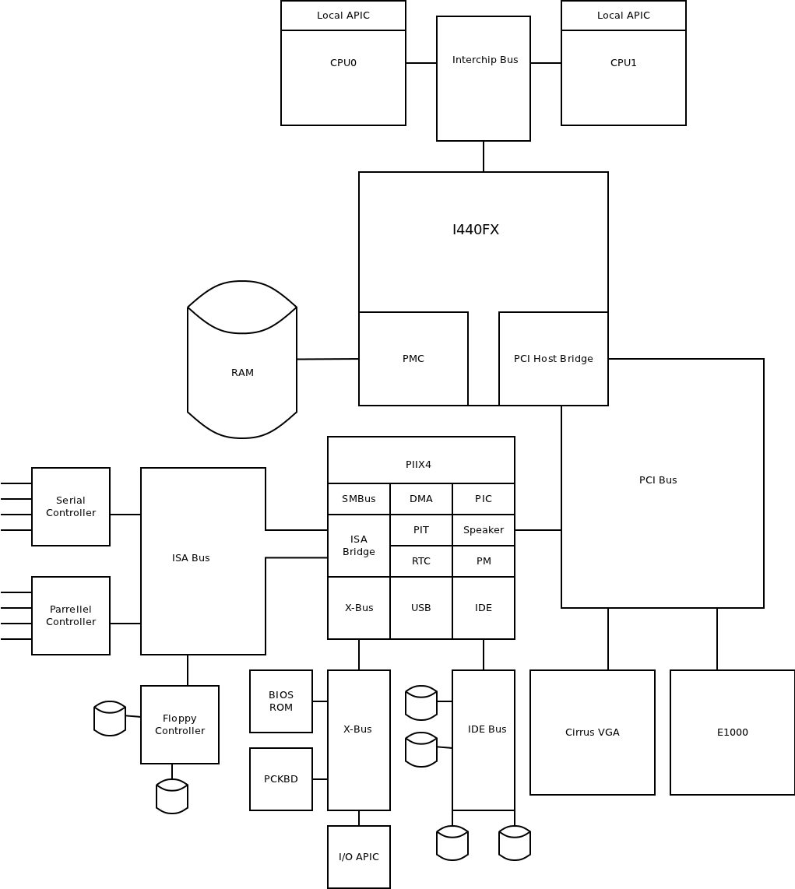
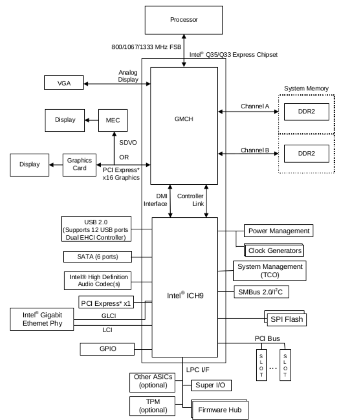
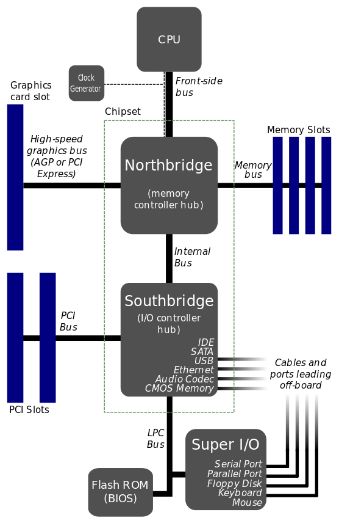

<!-- @import "[TOC]" {cmd="toc" depthFrom=1 depthTo=6 orderedList=false} -->

<!-- code_chunk_output -->

- [1. X86 架构的 Machine Type](#1-x86-架构的-machine-type)
- [2. Q35 vs. I440FX](#2-q35-vs-i440fx)
- [3. i440fx 与 piix3 架构](#3-i440fx-与-piix3-架构)
  - [4. QEMU模拟](#4-qemu模拟)
- [5. Q35 架构](#5-q35-架构)

<!-- /code_chunk_output -->

# 1. X86 架构的 Machine Type

QEMU 支持的 X86 架构非常少, 在 Q35 出现之前, 就只有诞生于 1996 年的 i440FX + PIIX 一个架构. 一方面是 Intel 不断推出新的芯片组,  加入了 **PCIe**、**AHCI** 等等. i440FX 已经无法满足需求, 为此在 KVM Forum 2012 上 Jason Baron 带来了 A New Chipset For Qemu - Intel's Q35, 见附件: `2012-forum-Q35.pdf`.

# 2. Q35 vs. I440FX

Q35是Intel在2007年9月推出的芯片组, 与I440FX/PIIX差别在于:

* Q35 has IOMMU
* Q35 has PCIe
* Q35 has Super I/O chip with LPC interconnect
* Q35 has 12 USB ports
* Q35 SATA vs. PATA

Irq routing

* Q35 PIRQ has 8 pins - PIRQ A-H
* Q35 has two PIC modes – legacy PIC vs I/O APIC
* Q35 runs in I/O APIC mode
* Slots 0-24 are mapped to PIRQ E-H round robin
* PCIe Bus to PIRQ mappings can be programmed
  * Slots 25-31
* Q35 has 8 PCI IRQ vectors available, I440FX/PIIX4 only 2

I440FX/PIIX4 vs. Q35 devices

* AHCI vs. Legacy IDE
* PCI addresses
* Populate slots using flags
* Default slots

# 3. i440fx 与 piix3 架构

> CPU <-> 北桥 <-> 南桥

Intel 440FX(i440fx) 是 Intel 在 1996 年发布的用来支持 Pentium II 的主板芯片, 距今已有 20 多年的历史, 是一代比较经典的架构. 虽然 QEMU 已经能够支持更先进的 q35 架构的模拟, 但是目前 QEMU 依然**默认**使用 **i440fx** 架构. 本节对物理芯片和实际的 QEMU 模拟架构进行总体介绍, 后面的章节会对 QEMU 整个芯片进行介绍.

以 **i440fx** 为**北桥**、**piix3** 为**南桥**的芯片组结构如图所示:


其中, **i440fx 北桥**包括 **PMC**(`PCI Bridge and Memory Controller`)以及 **DBX**(`Data Bus Accelerator`), **北桥芯片**用于**连接主板上的高速设备**, 向上提供了连接处理器的Host总线接口, 可以连接多个处理器, 向下则主要提供了连接内存DRAM的接口和连接PCI总线系统的PCI总线接口,  通过该 PCI root port 扩展出整个PCI设备树, 包括 PIIX 南桥芯片.

**piix3 南桥**主要用来**连接主板上的低速设备**, 包括 IDE 控制器、USB 控制器, DMA控制器等, 各种慢速设备可以通过**控制器**连接到系统, 如硬盘、USB 设备等. 南桥还会连接 PCI-ISA bridge, 传统的 ISA 设备可以借此连接到系统, 比如键盘、鼠标、BIOS ROM等.

这里面还有一个**需要注意**的地方, 即**中断控制器** `I/O APIC` 是**直接连接到处理器**, **设备的中断**可以通过 `I/O APIC` 路由到处理器.

## 4. QEMU模拟

从 QEMU **官网**可以看到下图所示的 QEMU 主板模拟图, 对比上面图, 可以发现基本架构是一致的.

QEMU模拟的Intel 440FX架构:



> 注意 IO APIC 的位置

在 monitor 中输入 "`info qtree`", 可以看到 QEMU 虚拟机的设备结构, 下面是经过简化的版本.

```
(qemu) info qtree
info qtree
bus: main-system-bus        // 起点, 系统总线
  type System
  dev: ps2-mouse, id ""
  dev: ps2-kbd, id ""
  dev: hpet, id ""          // HPET
  dev: kvm-ioapic, id ""    //
  dev: fw_cfg_io, id ""
  dev: i440FX-pcihost, id ""// 北桥 设备
    bus: pci.0              // pci 根总线
      type PCI
      dev: virtio-net-pci, id ""            // virtio-net-pci 代理设备
        bus: virtio-bus         // virtio 总线
          type virtio-pci-bus
          dev: virtio-net-device, id ""    // virtio-net-device 设备
      dev: rtl8139, id "net0" // net 设备
      dev: virtio-blk-pci, id "virtio-disk0" // virtio-blk-pci 代理设备
        bus: virtio-bus     // virtio 总线
          type virtio-pci-bus
          dev: virtio-blk-device, id "" // virtio-blk 设备
      dev: VGA, id ""       // VGA 设备
      dev: PIIX4_PM, id ""  // 电源管理设备
      dev: piix3-ide, id "" // IDE 控制器
        bus: ide.1          // IDE 总线
          type IDE
          dev: ide-cd, id ""
            drive = "ide1-cd0"
      dev: PIIX3, id ""     // PCI转ISA桥
        bus: isa.0          // ISA 总线
          type ISA
          dev: port92, id ""// ISA 设备
          dev: kvm-pit, id ""
          dev: kvm-i8259, id ""
          dev: mc146818rtc, id ""
      dev: i440FX, id ""    // 北桥自身

```

设备的起点是 `main-system-bus` 系统总线, 上面挂了 hpet 和 kvmioapic 等设备, 当然, 最重要是的**北桥** `I440FX-pcihost`, **北桥**通过**系统总线**连接到 **CPU**.

北桥的下面连了一条 **PCI 根总线** `pci.0`, 大量的设备都挂在了 `pci.0` 总线下面. 如 `PIIX4_PM` 设备用于**电源管理**, `piix3-ide` 设备是 **IDE** 设备的**控制器**, 下面可以挂 **IDE 总线**, IDE 总线下面可以挂 IDE 设备, 如硬盘等. **PCI 根总线**当然也可以直接挂 PCI 设备, 如 e1000、VGA 等.

PIIX3 是 PCI 转 ISA 桥, 下面挂了 ISA 总线, 总线下面挂了很多 ISA 设备.

i440FX 则表示**北桥自身**在 PCI 总线这一侧的抽象.

从上面的结构可以看到, 总线和设备是交替的, 设备只能挂在总线下面, 而**总线本身**也**属于一个设备**.

上面介绍的整个 PC 的系统结构, 包括 CPU、内存、设备、中断等, 后续都会一一介绍.

# 5. Q35 架构

> CPU <-> MCH <-> ICH

北桥为 MCH(Memory Controller Hub), 南桥为 ICH9(I/O Controller Hub). CPU 通过前端总线(FSB)连接到北桥(MCH), MCH链接内存, 显卡,  高速 PCIe 接口等, 南桥芯片则为 USB, 低速 PCIe / SATA 等提供接入.






