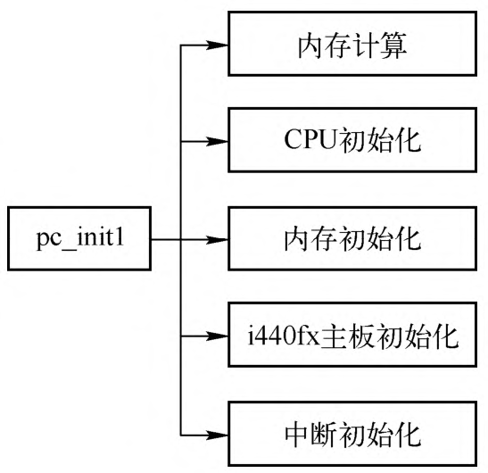
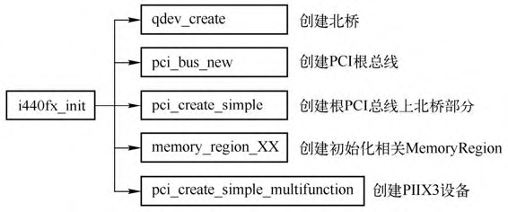
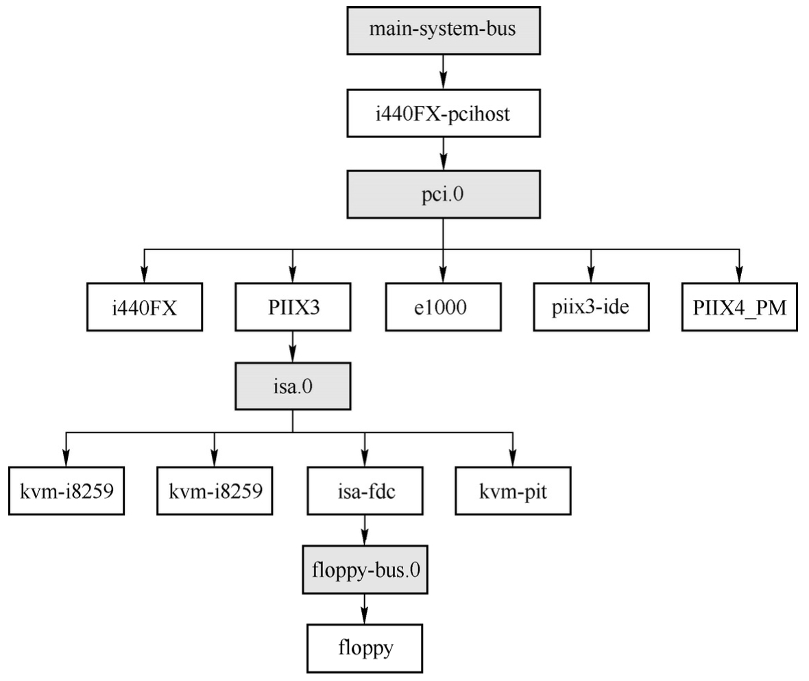

# 主板类型定义

QEMU **主板**模拟对应的**类型**是 **MachineClass**, Machine 在这里表明了主板在虚拟机模拟中的地位, 这里只考虑 `i440FX+piix3` 的主板.

**机器类型的定义**是通过 `DEFINE_I440FX_MACHINE` 宏完成的, **每一个新版本**都会定义一种**新的机器类型**.

```cpp
// hw/i386/pc_piix.c
#define DEFINE_I440FX_MACHINE(suffix, name, compatfn, optionfn) \
    // pci_init_XXX 函数
    static void pc_init_##suffix(MachineState *machine) \
    { \
        void (*compat)(MachineState *m) = (compatfn); \
        if (compat) { \
            compat(machine); \
        } \
        pc_init1(machine, TYPE_I440FX_PCI_DEVICE); \
    } \
    // 宏定义
    DEFINE_PC_MACHINE(suffix, name, pc_init_##suffix, optionfn)

// include/hw/i386/pc.h
#define DEFINE_PC_MACHINE(suffix, namestr, initfn, optsfn) \
    static void pc_machine_##suffix##_class_init(ObjectClass *oc, void *data) \
    { \
        MachineClass *mc = MACHINE_CLASS(oc); \
        optsfn(mc); \
        mc->init = initfn; \
    } \
    static const TypeInfo pc_machine_type_##suffix = { \
        .name       = namestr TYPE_MACHINE_SUFFIX, \
        .parent     = TYPE_PC_MACHINE, \
        .class_init = pc_machine_##suffix##_class_init, \
    }; \
    static void pc_machine_init_##suffix(void) \
    { \
        type_register(&pc_machine_type_##suffix); \
    } \
    type_init(pc_machine_init_##suffix)
```

`DEFINE_I440FX_MACHINE` 的定义比较简单, 包括**一个函数**以及另一个宏 `DEFINE_PC_MACHINE`.

下面以 `pc-i440fx-9.0` 为例, 定义为:

```cpp
// hw/i386/pc_piix.c
static void pc_i440fx_9_0_machine_options(MachineClass *m)
{
    pc_i440fx_machine_options(m);
    m->alias = "pc";
    m->is_default = true;
}

DEFINE_I440FX_MACHINE(v9_0, "pc-i440fx-9.0", NULL,
                      pc_i440fx_9_0_machine_options);
```

完整展开后如下:

```cpp
static void pc_init_v9_0(MachineState *machine)
{
    void (*compat)(MachineState *m) = (NULL);
    if (compat) {
        compat(machine);
    }
    pc_init1(machine, TYPE_I440FX_PCI_DEVICE);
}
static void pc_machine_v9_0_class_init(ObjectClass *oc, void *data)
{
    MachineClass *mc = MACHINE_CLASS(oc);
    pc_i440fx_9_0_machine_options(mc);
    mc->init = pc_init_v9_0;
}
static const TypeInfo pc_machine_type_v9_0 = {
    .name       = namestr TYPE_MACHINE_SUFFIX,
    // parent 是 TYPE_PC_MACHINE
    .parent     = TYPE_PC_MACHINE,
    .class_init = pc_machine_v9_0_class_init,
};
static void pc_machine_init_v9_0(void)
{
    type_register(&pc_machine_type_v9_0);
}
type_init(pc_machine_init_v9_0)

#define type_init(function) module_init(function, MODULE_INIT_QOM)
```

可以看到, `DEFINE_I440FX_MACHINE` 宏**直接完成**了**定义一个新类型**的全部工作, 以此为例, 它定义了 `"pc-i440fx-9.0-machine"` 这个**新的 TypeInfo**, 所以**所有的机器类型**都会被加入到 **QOM 类型链表**中, 并且在 main 函数中初始化.

# 虚拟机初始化

```cpp
main()
 ├─ qemu_init()
 │   ├─ qemu_create_machine() // 创建主板机器实例
 │   │   ├─ MachineClass *machine_class = select_machine(qdict, &error_fatal); // 选择一个MachineClass
 │   │   ├─ current_machine = MACHINE(object_new_with_class(OBJECT_CLASS(machine_class))); // 创建machine实例,全局变量类型MachineState
 │   │   │   ├─ object_init_with_type(Object, TypeImpl)
 │   │   │   │   ├─ object_init_with_type(obj, type_get_parent(ti)); // 先调用父类的实例化instance_init函数, TYPE_PC_MACHINE对应pc_machine_initfn
 │   │   │   │   └─ TypeImpl->instance_init(Object) // 实例化
 │   ├─ qmp_x_exit_preconfig();
 │   │   ├─ machine_run_board_init(current_machine, ...) // 主板机器初始化
 │   │   │   ├─ MachineClass *machine_class = MACHINE_GET_CLASS(machine); // 获取current_machine的MachineClass
 │   │   │   ├─ machine_class->init(machine); // 对应pc_init_v9_0,里面调用pc_init1(machine, TYPE_I440FX_PCI_DEVICE)
```

## 选择主板机器类型

> select_machine()

main 函数会调用 `select_machine`, 选择一个 **MachineClass**, 其可能由**用户指定**, 也有可能由**系统默认**.

QEMU **最新版本号**对应的**机器类型**为**默认设置**, 这里 QEMU 的版本是 9.0.0, 所以机器类型是 `pc-i440fx-9.0-machine`.

```
QEMU 版本
# /home/haiwei/workspace/codes/qemu/build/qemu-system-x86_64 --version
QEMU emulator version 8.2.91 (v9.0.0-rc1)
Copyright (c) 2003-2024 Fabrice Bellard and the QEMU Project developers

机器类型
# /home/haiwei/workspace/codes/qemu/build/qemu-system-x86_64 -machine ?
Supported machines are:
microvm              microvm (i386)
pc                   Standard PC (i440FX + PIIX, 1996) (alias of pc-i440fx-9.0)
pc-i440fx-9.0        Standard PC (i440FX + PIIX, 1996) (default)
...
q35                  Standard PC (Q35 + ICH9, 2009) (alias of pc-q35-9.0)
pc-q35-9.0           Standard PC (Q35 + ICH9, 2009)
```

## 创建主板机器实例

> qemu_create_machine

main 中还会通过 `object_new_with_class` **创建 machine 的实例**, 这会创建一个 `MachineState` 类型实例 `current_machine`, 并且调用 parent `TYPE_PC_MACHINE` 的实例初始化函数(`instance_init`) `pc_machine_initfn`, 这个函数的作用就是设置一些初始值. 如下:

```cpp
// system/main.c
main() -> qemu_init() -> qemu_create_machine(machine_opts_dict);

// system/vl.c
OBJECT_DECLARE_TYPE(MachineState, MachineClass, MACHINE)
MachineState *current_machine;
static void qemu_create_machine(QDict *qdict)
{
    MachineClass *machine_class = select_machine(qdict, &error_fatal);
    ...
    // MACHINE()表明是 MachineState 类型
    current_machine = MACHINE(object_new_with_class(OBJECT_CLASS(machine_class)));
    ...
}

object_new_with_class(ObjectClass) ->
object_new_with_type(Type) ->
object_init_with_type(Object, TypeImpl)

static void object_init_with_type(Object *obj, TypeImpl *ti)
{
    // 获取 parent
    if (type_has_parent(ti)) {
        object_init_with_type(obj, type_get_parent(ti));
    }
    // 所以从 parent 往下, 逐层调用
    if (ti->instance_init) {
        ti->instance_init(obj);
    }
}

static const TypeInfo pc_machine_info = {
    .name = TYPE_PC_MACHINE,
    .parent = TYPE_X86_MACHINE,
    ...
    .instance_init = pc_machine_initfn,
    ...
};
```

## 主板机器初始化

> machine_run_board_init

main 函数在对 `current_machine` 的一些结构进行初始化之后, 会调用 `machine_class->init`, 并且参数为 `current_machine`.

```cpp
// system/vl.c
main() -> qemu_init() -> qmp_x_exit_preconfig() -> qemu_init_board() -> machine_run_board_init(current_machine, mem_path, &error_fatal);

// hw/core/machine.c
// 传入了 current_machine
void machine_run_board_init(MachineState *machine, const char *mem_path, Error **errp)
{
    MachineClass *machine_class = MACHINE_GET_CLASS(machine);
    ...
    machine_class->init(machine);
    ...
}
```

这个 init 函数就是通过 `DEFINE_I440FX_MACHINE` 宏定义的 `pc_init_v9_0`, 其核心工作就是调用 `pc_init1(machine, TYPE_I440FX_PCI_DEVICE)`.

`pc_init1` 是**主板**或者说**整个机器初始化**最核心的函数, 它的功能如下图所示.

`pc_init1` 初始化功能:



`pc_init1` 是整个虚拟机初始化的**最核心**函数, 对各个子系统进行了初始化, 构建起虚拟机的基本支持框架.

* **内存计算**部分计算出计算机的高端内存和低端内存的分割点, 主要是因为需要在低于 4GB 左右的物理地址空间中保留一部分给 PCI 设备使用;

* **CPU 初始化**则会根据命令行提供的 CPU 个数等信息创建对应的 VCPU 线程;

* **内存初始化**在 QEMU 虚拟机地址空间中分配虚拟机物理内存;

* **i440fx 主板初始化**则会完成创建 PCI 根总线以及 PIIX3 控制器的初始化等功能;

* **中断初始化**会初始化 `Intel 8259` 和 `I/O APIC` **中断控制器**, 建立相关的中断路由关系.

下面对 `pc_init1` 进行简要介绍, 各个部分的详细功能会在后续具体章节中分析.

`pc_init1` 首先根据**内存的配置**计算**低于 4GB** 和**高于 4GB** 的内存大小, 低于 4GB 的内存部分最大默认是 3.5GB, 因为需要留一部分给地址给诸如 PCI 设备的 MMIO 或者 BIOS 等其他固件, 所以会空一些空间.

紧接着会调用 `pc_cpus_init` 对虚拟机的 VCPU 进行初始化, 最终会调用 `qemu_kvm_start_vcpu` 为每个 VCPU 创建对应的线程, 这部分将在 CPU 虚拟化部分进行详细介绍.

`pc_init1` 初始化虚拟机内存时会创建一个 `UINT64_MAX` 大小的内存空间 `pci_memory`, 表示 PCI 所在的内存区域. 然后会调用 `pc_memory_init()` 进行初始化, 这个函数主要用于分配虚拟机的内存(虚拟机的物理内存对应的是 QEMU 的虚拟内存)、进行 BIOS 和其他 ROM 的加载等, 后面将会详述内存虚拟化.

`pc_init1` 在进行中断初始化的时候会初始化中断设备以及中断路由关系, 创建一个 `qemu_irq` 数组并且复制到 PCMachineState 的 gsi 成员中作为中断路由的起始点. 中断设备可以部分在 QEMU 空间, 也可以都在 KVM 空间, 所以这里含有 `if (kvm_ioapic_in_kernel())`, 关于中断设备的初始化和路由将在中断虚拟化相关章节中进行介绍.

```cpp
pc_init1() -> pc_gsi_create(&x86ms->gsi, pcmc->pci_enabled)
//
GSIState *pc_gsi_create(qemu_irq **irqs, bool pci_enabled)
{
    GSIState *s;

    s = g_new0(GSIState, 1);
    if (kvm_ioapic_in_kernel()) {
        kvm_pc_setup_irq_routing(pci_enabled);
    }
    *irqs = qemu_allocate_irqs(gsi_handler, s, IOAPIC_NUM_PINS);

    return s;
}
```

无论中断控制器由内核 KVM 创建还是由 QEMU 创建, 设备的中断起始函数都是 `gsi_handler`.

# i440fx 初始化

`pc_init1` 会调用 `i440fx_init` 函数对主板进行初始化, 本节将对 i440fx 主板的初始化进行详细解析. `i440fx_init` 调用的主要函数及对应的功能如图所示.



首先创建最重要的**北桥芯片**, 也叫**主桥**. 与主桥有关的**设备**有两个:

* `TYPE_I440FX_PCI_HOST_BRIDGE`, 表示的是**主桥**的**设备类型名字**;

* `TYPE_I440FX_PCI_DEVICE`, 指定了**主桥**对应在 **PCI 根总线**上的**设备名字**.

```cpp
// hw/pci-host/i440fx.c
// 对应在PCI根总线上的主桥设备名字
#define TYPE_I440FX_PCI_DEVICE "i440FX"
static const TypeInfo i440fx_info = {
    .name          = TYPE_I440FX_PCI_DEVICE,
    .parent        = TYPE_PCI_DEVICE,
    .instance_size = sizeof(PCII440FXState),
    .class_init    = i440fx_class_init,
    .interfaces = (InterfaceInfo[]) {
        { INTERFACE_CONVENTIONAL_PCI_DEVICE },
        { },
    },
};

OBJECT_DECLARE_SIMPLE_TYPE(I440FXState, I440FX_PCI_HOST_BRIDGE)
// 主桥设备类型的名字
#define TYPE_I440FX_PCI_HOST_BRIDGE "i440FX-pcihost"
static const TypeInfo i440fx_pcihost_info = {
    .name          = TYPE_I440FX_PCI_HOST_BRIDGE,
    .parent        = TYPE_PCI_HOST_BRIDGE,
    .instance_size = sizeof(I440FXState),
    .instance_init = i440fx_pcihost_initfn,
    .class_init    = i440fx_pcihost_class_init,
};

static void i440fx_register_types(void)
{
    type_register_static(&i440fx_info);
    type_register_static(&i440fx_pcihost_info);
}

type_init(i440fx_register_types)
```

之所以会创建**两个设备**, 是因为**北桥本身**有一部分也是 **PCI 设备**, 挂在 PCI 根总线的**第 0 号插槽**上面. 所以 i440fx_init 中有两个需要注意区分的变量, 一个是类型为 PCII440FXState 的f, 这个变量会指向 i440fx 主桥的 PCI 设备部分, 另一个是类型为 I440FXState 的 i440fx, 这个是主桥对应的设备.

该函数的两个参数是由 `pc_init1` 传过来的.

```cpp
// hw/i386/pc_piix.c
pc_init1(machine, TYPE_I440FX_PCI_DEVICE);
```

相关的代码如下.

```cpp
// hw/i386/pc_piix.c
static void pc_init1(MachineState *machine, const char *pci_type)
{
    Object *phb = NULL;
    ...
    pci_memory = g_new(MemoryRegion, 1);
    memory_region_init(pci_memory, NULL, "pci", UINT64_MAX);
    rom_memory = pci_memory;
    // 第一. 创建一个主桥设备
    phb = OBJECT(qdev_new(TYPE_I440FX_PCI_HOST_BRIDGE));
    // 第二. 将主桥设备作为子节点加到machine对象上
    object_property_add_child(OBJECT(machine), "i440fx", phb);
    object_property_set_link(phb, PCI_HOST_PROP_RAM_MEM,
                                OBJECT(ram_memory), &error_fatal);
    object_property_set_link(phb, PCI_HOST_PROP_PCI_MEM,
                                OBJECT(pci_memory), &error_fatal);
    object_property_set_link(phb, PCI_HOST_PROP_SYSTEM_MEM,
                                OBJECT(system_memory), &error_fatal);
    object_property_set_link(phb, PCI_HOST_PROP_IO_MEM,
                                OBJECT(system_io), &error_fatal);
    object_property_set_uint(phb, PCI_HOST_BELOW_4G_MEM_SIZE,
                                x86ms->below_4g_mem_size, &error_fatal);
    object_property_set_uint(phb, PCI_HOST_ABOVE_4G_MEM_SIZE,
                                x86ms->above_4g_mem_size, &error_fatal);
    object_property_set_str(phb, I440FX_HOST_PROP_PCI_TYPE, pci_type,
                            &error_fatal);
    // 第三
    sysbus_realize_and_unref(SYS_BUS_DEVICE(phb), &error_fatal);

    pcms->pcibus = PCI_BUS(qdev_get_child_bus(DEVICE(phb), "pci.0"));
    pci_bus_map_irqs(pcms->pcibus,
                        xen_enabled() ? xen_pci_slot_get_pirq
                                    : pc_pci_slot_get_pirq);

    hole64_size = object_property_get_uint(phb,
                                            PCI_HOST_PROP_PCI_HOLE64_SIZE,
                                            &error_abort);
```

第一. 首先调用 `qdev_new` **创建一个主桥设备**.


设置设备具现化是通过函数qdev_init_nofail实
现的. pci_bus_new 函数在主桥设备上创建了一条PCI总线, 这就是PCI 根总线, 其他设备可以挂在这条PCI总线上面.

第二. `object_property_add_child` 函数将**主桥**作为**子节点**加到 machine 对象上.

`SYS_BUS_DEVICE(phb)` 用于将 phb 对象转换成 `SysBusDevice` 类型

```cpp
#define TYPE_SYS_BUS_DEVICE "sys-bus-device"
OBJECT_DECLARE_TYPE(SysBusDevice, SysBusDeviceClass, SYS_BUS_DEVICE)
```

第三.


最后一行对dev进行具现化, 将设备的realized设置为true


下面分析主桥设备的具现化函数i440fx_pcihost_realize, 其代码如下.

```cpp

```

i440fx_pcihost_realize初始化了主桥的两个寄存器, 即配置地址寄存器和配置数据寄存器. 配置地址寄存器的端口为从0xcf8开始的4个端口(0xcf8 ~ 0xcfb), 配置数据寄存器的端口为从0xcfc开始的4个端口(0xcfc ~ 0xcff). 配置地址寄存器是用来选择指定PCI设备, 配置数据寄存器则用来向选定的PCI配置空间读写数据.

回到i440fx_init函数, 创建并初始化好了主桥和根总线之后, 就会创建主桥的PCI设备部分, 代码如下.

```cpp

```

调用pci_create_simple创建主桥的PCI设备部分d, 其中pci_type为TYPE_I440FX_PCI_DEVICE, d会被复制到输出参数pi440fx_state中, 并设置几个Memory Region成员, 如系统内存system_memory、PCI地址空间的pci_address_space、RAM内存ram_memory等. 在内存虚拟化相关内容中会详细介绍MemoryRegion, 这里将其理解为一个虚拟机一段内存空间即可.

i440fx_init 接下来调用了一系列的 memory_region_XX 函数, 作用都是创建并初始化相关的MemoryRegion, 毕竟北桥的一个重要功能就是连接内存, 从PCII440FXState定义也可以看出, MemoryRegion占了大部分.

```cpp

```

i440fx_init接下来调用pci_create_simple_multifunction在主桥的PCI根总线上创建一个piix3设备, pci_bus_irqs函数设置PCI总线上设备的中断路由函数. piix3->pic=pic将pc_init1中创建中断路由的起点赋值给piix3->pic.

```cpp

```

piix3设备在具现化的时候会创建一条ISA总线, 其代码如下. 这条ISA是全局性的, 所以会赋值到输出参数isa_bus指向的空间中.

```cpp

```

在i440x_init的最后, 调用了i440fx_update_memory_mappings, 将内存变化通知到KVM. i440fx_init执行完成后, 可以看到主板的基本组件就都有了.

# 中断和其他设备的初始化

回到pc_init1, i440fx_init调用完成之后, 函数接着设置ISA总线的中断路由起点, 然后创建中断控制器, 代码如下.

```cpp

```

如果pic中断控制器由内核KVM创建, 则调用kvm_i8259_init, 否则调用i8259_init. 如果PCI使能, 还要调用ioapic_init_gsi初始化I/O APIC.

最后, pc_init1将进行基本设备的初始化. 调用pc_vga_init进行vga的初始化, 调用pc_basic_device_init进行hpet和时钟的创建等;pc_nic_init用于创建网卡设备, 接着在piix3上创建一个ide控制器, 之后是piix4的pm初始化等.

下图展示了以主桥初始化为根的设备和总线初始化, 从中也可以看出, 总线和设备是交替出现的. 当然, 限于篇幅, 初始化创建的设备并没有完全展示出来.


