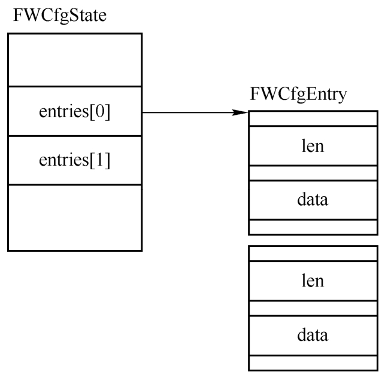
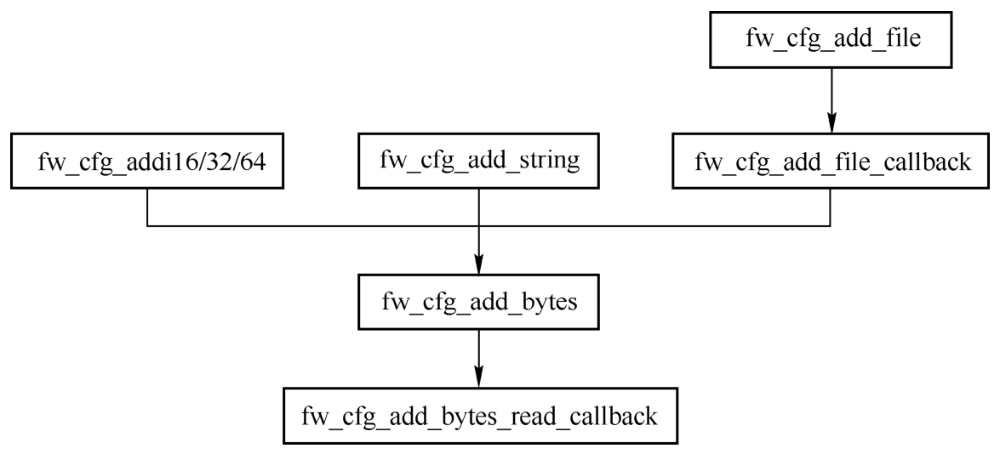
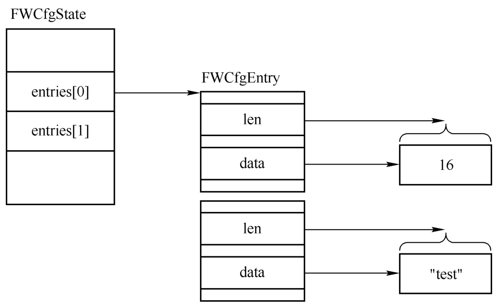
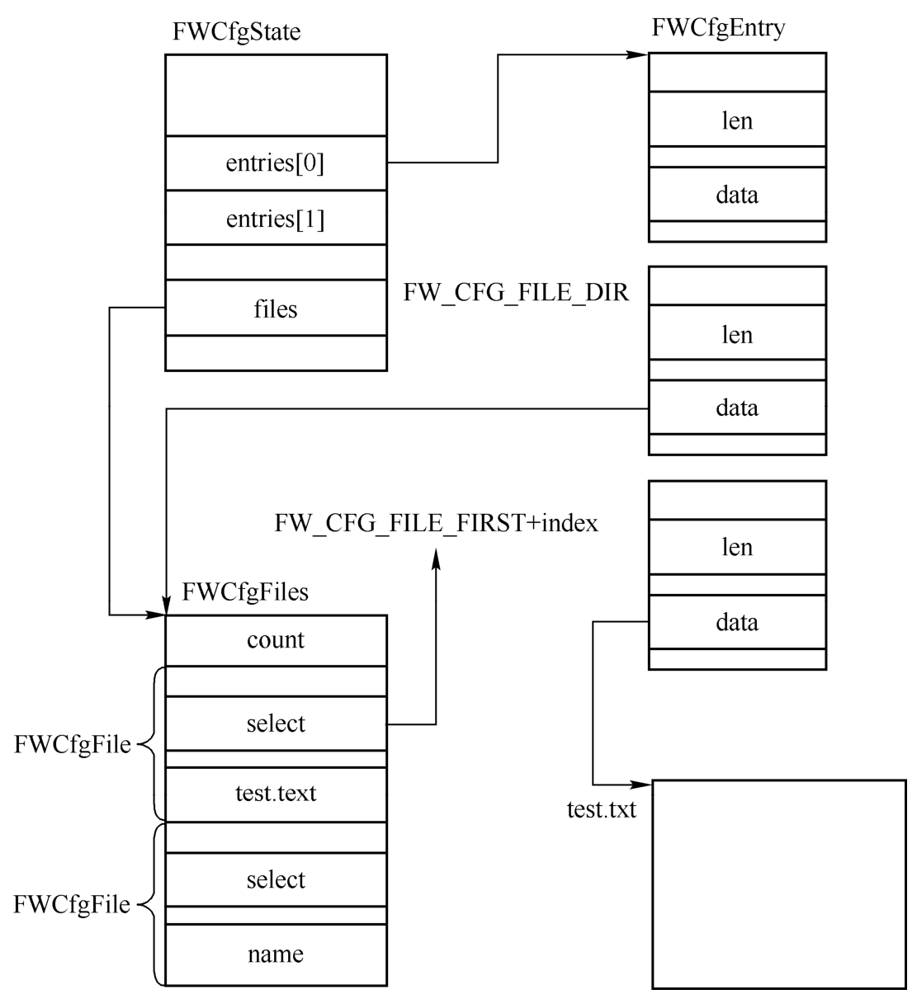

<!-- @import "[TOC]" {cmd="toc" depthFrom=1 depthTo=6 orderedList=false} -->

<!-- code_chunk_output -->

- [1. 背景](#1-背景)
- [2. 规范](#2-规范)
  - [2.1. 接口](#21-接口)
  - [2.2. 数据结构](#22-数据结构)
- [3. fw_cfg 设备初始化](#3-fw_cfg-设备初始化)
- [向fw_cfg设备添加数据](#向fw_cfg设备添加数据)
- [添加用户自定义数据](#添加用户自定义数据)
- [数据的读取](#数据的读取)
- [4. Linux guest 使用](#4-linux-guest-使用)
  - [4.1. sysfs 的结构](#41-sysfs-的结构)
- [5. seabios 使用](#5-seabios-使用)
  - [5.1. 基础工作](#51-基础工作)
  - [5.2. linker/loader](#52-linkerloader)
    - [5.2.1. Qemu 的 BIOSLinker](#521-qemu-的-bioslinker)
    - [5.2.2. Seabios 的 romfile_loader_entry_s](#522-seabios-的-romfile_loader_entry_s)

<!-- /code_chunk_output -->

# 1. 背景

很多时候 **QEMU** 需要将一些**数据传递给虚拟机**, 比如虚拟机的**启动引导顺序**、**ACPI** 和 **SMBIOS** 表、**SMP** 和 **NUMA 信息**等. **虚拟机**的 **Firmware**(如 `SeaBIOS`)可以根据这些数据进行相应的**配置**.

QEMU 提供了所谓的 `Firmware Configuration` (`fw_cfg`) **Device** 机制来完成这项工作.

> FW_CFG 为 guest 提供了一种获得额外信息的方式

现在能看到的分别有两个使用者:

* linux 虚拟机

* SeaBios

本节将首先对 `fw_cfg` 的基本机制进行介绍, 然后会简单介绍如何配置自定义的 fw_cfg 数据, 最后以一个实例来分析如何从虚拟机中读取 fw_cfg 数据.

# 2. 规范

在 Qemu 代码中有对 FW_CFG 的规范, 见 `docs/specs/fw_cfg.rst`.

讲清楚两个东西就可以理解这个规范:

  * 接口
  * 数据结构

## 2.1. 接口

在文档的开头就描述了两个东西:

  * Selector (Control) Register
  * Data Register

说白了就是有两个寄存器/通道, 分别对应了控制面和数据面.

直白的解释就是:

> 用户使用时, 先通过 Selector Register 选定需要访问的单元, 再通过 Data Register 来获取实际的数据.

好了, 接口这部分其实就这么些, 没多大花头.

在规范中还定义了这两个接口的地址.

```
  === x86, x86_64 Register Locations ===

  Selector Register IOport: 0x510
  Data Register IOport:     0x511
  DMA Address IOport:       0x514

  === ARM Register Locations ===

  Selector Register address: Base + 8 (2 bytes)
  Data Register address:     Base + 0 (8 bytes)
  DMA Address address:       Base + 16 (8 bytes)
```

## 2.2. 数据结构

好了, 这里要上一个巨大的数据结构了. 嗯, 其实呢和某些结构相比也不算大, 主要是这里面有数组, 所以显得大了.

```
                 FWCfgIoState
                 +------------------------------------------+
                 |machine_ready                             |
                 |   notify                                 | = fw_cfg_machine_ready
                 +------------------------------------------+
                 |dma_iomem                                 |
                 |   (MemoryRegion)                         |
                 |   +--------------------------------------+
                 |   |addr                                  |  = FW_CFG_IO_BASE + 4(0x514)
                 |   |name                                  |  = "fwcfg.dma"
                 |   |ops                                   |  fw_cfg_dma_mem_ops
                 |   |opaque                                |  FWCfgState itself
                 |   |size                                  |  = 8
                 +---+--------------------------------------+
                 |comb_iomem                                |
                 |   (MemoryRegion)                         |
                 |   +--------------------------------------+
                 |   |addr                                  |  = FW_CFG_IO_BASE(0x510)
                 |   |name                                  |  = "fwcfg"
                 |   |ops                                   |  fw_cfg_comb_mem_ops
                 |   |opaque                                |  FWCfgState itself
                 |   |size                                  |  = 0x02
                 +---+--------------------------------------+
                 |cur_entry                                 | fw_cfg_select(key)
                 |cur_offset                                |
                 |   (uint)                                 |
                 +------------------------------------------+
                 |file_slots                                |
                 |   (uint16)                               |
                 +------------------------------------------+
                 |files                                     |
                 |   (FWCfgFiles)                           |
                 |   +--------------------------------------+
                 |   |count                                 |
                 |   |   (uint32_t)                         |
                 |   +--------------------------------------+
                 |   |f[]                                   |                                                                                             etc/acpi/tables                                         etc/table-loader
                 |   |   (FWCfgFile)                        | ------------------------------------------------------------------------------------------->+------------------------------+----------------------->+------------------------------+
                 |   |   +----------------------------------+                                                                                             |name                          |                        |name                          |
                 |   |   |name                              |                                                                                             | (char [FW_CFG_MAX_FILE_PATH])|                        | (char [FW_CFG_MAX_FILE_PATH])|
                 |   |   |   (char [FW_CFG_MAX_FILE_PATH])  |                                                                                             |size                          |                        |size                          |
                 |   |   |size                              |                                                                                             |select                        |                        |select                        |
                 |   |   |select                            |                                                                                             |reserved                      |                        |reserved                      |
                 |   |   |reserved                          |                                                                                             +------------------------------+                        +------------------------------+
                 +---+---+----------------------------------+                                                                                                   ^                                                       ^
                 |entry_order                               | [FW_CFG_FILE_FIRST + file_slots]                                                                  |                                                       |
                 |   (int*)                                 |                                                                                                   |                                                       |
                 +------------------------------------------+                                                                                                   |                                                       |
                 |entries[0]                                | [FW_CFG_FILE_FIRST + file_slots]                                                                  |                                                       |
                 |   (FWCfgEntry*)                          |                                                                                                   |                                                       |
                 |                                          |                                                                                                   |                                                       |
                 |                                          |                                                                                                   v                                                       v
                 |                                          |     [FW_CFG_SIGNATURE]                         [FW_CFG_FILE_DIR]                            [FW_CFG_FILE_FIRST+1]                                   [FW_CFG_FILE_FIRST+2]
                 |                                          |     +-------------------+                      +-----------------+                          +------------------+                                    +------------------+
                 |                                          |     |data               | = "QEMU"             |data             | = s->files               |data              | = AcpiBuildTables.table_data       |data              | = AcpiBuildTables.linker->cmd_blob
                 |                                          |     |   (uint8_t *)     |                      |   (uint8_t *)   |                          |   (uint8_t *)    |                                    |   (uint8_t *)    |
                 |                                          |     |len                | = 4                  |len              | = size of s->files       |len               | = sizeof (table_data)              |len               | = sizeof (cmd_blob)
                 |                                          |     |   (uint32_t)      |            . . .     |   (uint32_t)    |                          |   (uint32_t)     |                                    |   (uint32_t)     |
                 |                                          |     |callback_opaque    | = NULL               |callback_opaque  | = NULL                   |callback_opaque   | = AcpiBuildState                   |callback_opaque   | = AcpiBuildState
                 |                                          |     |   (void*)         |                      |   (void*)       |                          |   (void*)        |                                    |   (void*)        |
                 |                                          |     |select_cb          | = NULL               |select_cb        | = NULL                   |select_cb         | = acpi_build_update                |select_cb         | = acpi_build_update
                 |                                          |     |write_cb           | = NULL               |write_cb         | = NULL                   |write_cb          | = NULL                             |write_cb          | = NULL
                 |                                          |     +-------------------+                      +-----------------+                          +------------------+                                    +------------------+
                 |                                          |
                 |                                          |     [FW_CFG_SIGNATURE...FW_CFG_FILE_DIR] static key                                         [FW_CFG_FILE_FIRST... ] related to f[]
                 |                                          |
                 |                                          |
                 +------------------------------------------+
                 |entries[1]                                | [FW_CFG_FILE_FIRST + file_slots]
                 |   (FWCfgEntry*)                          |
                 |   +--------------------------------------+
                 |   |data                                  |
                 |   |   (uint8_t *)                        |
                 |   |callback_opaque                       |
                 |   |   (void*)                            |
                 |   |select_cb                             |
                 |   |write_cb                              |
                 +---+--------------------------------------+
```

让偶来稍做解释, 估计你可以看懂一些:

* comb_iomem: 这个就是规范中定义的接口. 看这个地址FW_CFG_IO_BASE就是0x510

* entries: 这是整个数据的核心. fw_cfg用编号(key)作为关键字访问各种配置. 而每个配置都有一个FWCfgEntry数据结构表示, 并保存在entries数组上.

* files: fw_cfg的配置可以是简单的数据类型, 如int, double. 也可以是一个文件. 所以在entries上可以看到分成了两端. 从FW_CFG_FILE_FIRST开始保存的是文件信息. 而且都有一个对应的FWCfgFile记录文件信息, 并保存在files数组上.

* cur_entry/offset:   因为接口简单, 在每次访问配置之前先要指定访问的是哪个entry, 且每次读写的位移取决于上一次的操作. 所以这两个分别保存了当前的entry和偏移.

好了, 其实展开就这么点内容了.

# 3. fw_cfg 设备初始化

在哪里创建的.

```cpp
pc_memory_init
    bochs_bios_init
        fw_cfg_init_io_dma
        qdev_create(NULL, TYPE_FW_CFG_IO);
        qdev_init_nofail(dev);
            fw_cfg_io_realize
            fw_cfg_common_realize
    rom_set_fw();
```

创建完了之后, 分别有两大类添加配置的方式:

  * fw_cfg_add_bytes()
  * fw_cfg_add_file_callback()

前者就是添加普通配置的, 而后者就是添加带有文件的配置的.


fw_cfg 是虚拟机用来获取 QEMU 提供数据的一个接口. 通过 fw_cfg 能够将 QEMU 的数据透明地传递到虚拟机的内存地址空间中. 最开始 `fw_cfg` 是用来**加载固件**的, 如 **BIOS**、**ACPI** 和 **SMBIOS** 表, 后来逐渐成为一个通用的接口, 比如可以用它来设置 **SMP** 和 **NUMA** 信息以及**虚拟机的 UUID**, 当然, 用户也可以在 QEMU 的命令行通过指定 `-fw_cfg` 参数来将数据传递到虚拟机.

fw_cfg 是通过模拟设备实现的, 涉及的设备有3个, 如下所示.

```cpp
// include/hw/nvram/fw_cfg.h
#define TYPE_FW_CFG     "fw_cfg"
#define TYPE_FW_CFG_IO  "fw_cfg_io"
#define TYPE_FW_CFG_MEM "fw_cfg_mem"

OBJECT_DECLARE_SIMPLE_TYPE(FWCfgState, FW_CFG)
OBJECT_DECLARE_SIMPLE_TYPE(FWCfgIoState, FW_CFG_IO)
OBJECT_DECLARE_SIMPLE_TYPE(FWCfgMemState, FW_CFG_MEM)
```

其中

* `TYPE_FW_CFG` 是一个抽象类型, 作为 `TYPE_FW_CFG_IO` 和 `TYPE_FW_CFG_MEM` 的父类型;

* `TYPE_FW_CFG_MEM` 表示虚拟机使用MMIO与fw_cfg设备进行通信, 如 ARM架构就使用这种方式;

* `TYPE_FW_CFG_IO` 表示虚拟机使用I/O端口与fw_cfg设备进行通信, 如 x86 架构就使用这种方式, 这里只考虑x86的情况.

`fw_cfg` 设备是在 `fw_cfg_arch_create` 函数调用的 `fw_cfg_init_io_dma` 函数中进行**初始化**的, `fw_cfg_arch_create` 本身则是通过 `pc_init1->pc_memory_init->fw_cfg_arch_create` 被调用的.

```cpp
// hw/i386/fw_cfg.h
#define FW_CFG_IO_BASE     0x510

// hw/i386/fw_cfg.c
FWCfgState *fw_cfg_arch_create(MachineState *ms,
                                      uint16_t boot_cpus,
                                      uint16_t apic_id_limit)
{
    ...
    // 第一, 0x510 ~ 0x514
    fw_cfg = fw_cfg_init_io_dma(FW_CFG_IO_BASE, FW_CFG_IO_BASE + 4,
                                &address_space_memory);
    // 将 guest 使用的 cpus 数目添加到 fw_cfg 中
    fw_cfg_add_i16(fw_cfg, FW_CFG_NB_CPUS, boot_cpus);

    fw_cfg_add_i16(fw_cfg, FW_CFG_MAX_CPUS, apic_id_limit);
    // memory size
    fw_cfg_add_i64(fw_cfg, FW_CFG_RAM_SIZE, ms->ram_size);
#ifdef CONFIG_ACPI
    // acpi 表
    fw_cfg_add_bytes(fw_cfg, FW_CFG_ACPI_TABLES,
                     acpi_tables, acpi_tables_len);
#endif
    fw_cfg_add_i32(fw_cfg, FW_CFG_IRQ0_OVERRIDE, 1);
    // e820 表
    fw_cfg_add_file(fw_cfg, "etc/e820", e820_table,
                    sizeof(struct e820_entry) * e820_get_num_entries());

    fw_cfg_add_bytes(fw_cfg, FW_CFG_HPET, &hpet_cfg, sizeof(hpet_cfg));
    /* allocate memory for the NUMA channel: one (64bit) word for the number
     * of nodes, one word for each VCPU->node and one word for each node to
     * hold the amount of memory.
     */
    numa_fw_cfg = g_new0(uint64_t, 1 + apic_id_limit + nb_numa_nodes);
    numa_fw_cfg[0] = cpu_to_le64(nb_numa_nodes);
    for (i = 0; i < cpus->len; i++) {
        unsigned int apic_id = cpus->cpus[i].arch_id;
        assert(apic_id < apic_id_limit);
        numa_fw_cfg[apic_id + 1] = cpu_to_le64(cpus->cpus[i].props.node_id);
    }
    for (i = 0; i < nb_numa_nodes; i++) {
        numa_fw_cfg[apic_id_limit + 1 + i] =
            cpu_to_le64(ms->numa_state->nodes[i].node_mem);
    }
    fw_cfg_add_bytes(fw_cfg, FW_CFG_NUMA, numa_fw_cfg,
                     (1 + apic_id_limit + nb_numa_nodes) *
                     sizeof(*numa_fw_cfg));

    return fw_cfg;
}
```

`fw_cfg` 使用的 I/O 端口为从 0x510 开始的若干端口, 其中 `0x510 ~ 0x511` **两个端口**用于 `fw_cfg` 的**普通控制**, `0x514 ~ 0x51b` 八个端口用于 **DMA 控制**.

第一. `fw_cfg_init_io_dma` 函数代码如下:

* `iobase` 表示 `fw_cfg` 的**控制起始端口**;

* `dam_iobase` 表示 **DMA 的起始端口**;

* `dma_as` 表示整个虚拟机的地址空间.

```cpp
// hw/nvram/fw_cfg.c
FWCfgState *fw_cfg_init_io_dma(uint32_t iobase, uint32_t dma_iobase,
                                AddressSpace *dma_as)
{
    DeviceState *dev;
    SysBusDevice *sbd;
    FWCfgIoState *ios;
    FWCfgState *s;
    MemoryRegion *iomem = get_system_io();
    bool dma_requested = dma_iobase && dma_as;
    // 第一
    dev = qdev_new(TYPE_FW_CFG_IO);
    if (!dma_requested) {
        qdev_prop_set_bit(dev, "dma_enabled", false);
    }

    object_property_add_child(OBJECT(qdev_get_machine()), TYPE_FW_CFG,
                              OBJECT(dev));

    sbd = SYS_BUS_DEVICE(dev);
    sysbus_realize_and_unref(sbd, &error_fatal);
    ios = FW_CFG_IO(dev);
    memory_region_add_subregion(iomem, iobase, &ios->comb_iomem);

    s = FW_CFG(dev);

    if (s->dma_enabled) {
        /* 64 bits for the address field */
        s->dma_as = dma_as;
        s->dma_addr = 0;
        memory_region_add_subregion(iomem, dma_iobase, &s->dma_iomem);
    }

    return s;
}
```

第一. 首先通过 `qdev_new` 创建一个 `TYPE_FW_CFG_IO` 设备, 这里没有指定设备所属的总线, 所以该设备会被挂在系统总线上, 然后设置该设备的一些属性(如基址 iobase 和 dma 的相关数据), 接着调用 `fw_cfg_init1` 函数, 在该函数中会调用 qdev_init_nofail 对设备进行具现化, 最后通过 `fw_cfg_init_io_dma` 函数将 fw_cfg 的版本信息添加到 fw_cfg 中, 虚拟机的 Firmware 或者 OS 可以借此知道 fw_cfg 的版本.

对应的设备是:

```
# ll /sys/devices/pci0000\:00/QEMU0002\:00/
total 0
drwxr-xr-x  3 root root    0 Apr 10 14:32 ./
drwxr-xr-x 14 root root    0 Apr 10 14:32 ../
-rw-r--r--  1 root root 4096 Apr 10 14:32 driver_override
lrwxrwxrwx  1 root root    0 Apr 10 14:32 firmware_node -> ../../LNXSYSTM:00/LNXSYBUS:00/PNP0A03:00/QEMU0002:00/
-r--r--r--  1 root root 4096 Apr 10 14:32 modalias
drwxr-xr-x  2 root root    0 Apr 10 14:32 power/
lrwxrwxrwx  1 root root    0 Apr 10 14:32 subsystem -> ../../../bus/platform/
-rw-r--r--  1 root root 4096 Apr 10 14:32 uevent
-r--r--r--  1 root root 4096 Apr 10 14:32 waiting_for_supplier
```

通过 `/proc/ioports` 可以看到

```
# cat /proc/ioports
  0510-051b : QEMU0002:00
```

`TYPE_FW_CFG_IO` 的 realize 函数为 `fw_cfg_io_realize`, 该函数代码如下.

```cpp
// include/standard-headers/linux/qemu_fw_cfg.h
/* width in bytes of fw_cfg control register */
#define FW_CFG_CTL_SIZE		0x02

// hw/nvram/fw_cfg.c
static void fw_cfg_io_realize(DeviceState *dev, Error **errp)
{
    ERRP_GUARD();
    FWCfgIoState *s = FW_CFG_IO(dev);

    fw_cfg_file_slots_allocate(FW_CFG(s), errp);
    if (*errp) {
        return;
    }

    // 第一
    memory_region_init_io(&s->comb_iomem, OBJECT(s), &fw_cfg_comb_mem_ops,
                          FW_CFG(s), "fwcfg", FW_CFG_CTL_SIZE);
    // 第二, 实现了 DMA 功能
    if (FW_CFG(s)->dma_enabled) {
        memory_region_init_io(&FW_CFG(s)->dma_iomem, OBJECT(s),
                              &fw_cfg_dma_mem_ops, FW_CFG(s), "fwcfg.dma",
                              sizeof(dma_addr_t));
    }

    fw_cfg_common_realize(dev, errp);
}

static void fw_cfg_common_realize(DeviceState *dev, Error **errp)
{
    FWCfgState *s = FW_CFG(dev);
    MachineState *machine = MACHINE(qdev_get_machine());
    uint32_t version = FW_CFG_VERSION;

    if (!fw_cfg_find()) {
        error_setg(errp, "at most one %s device is permitted", TYPE_FW_CFG);
        return;
    }

    fw_cfg_add_bytes(s, FW_CFG_SIGNATURE, (char *)"QEMU", 4);
    fw_cfg_add_bytes(s, FW_CFG_UUID, &qemu_uuid, 16);
    fw_cfg_add_i16(s, FW_CFG_NOGRAPHIC, (uint16_t)!machine->enable_graphics);
    fw_cfg_add_i16(s, FW_CFG_BOOT_MENU, (uint16_t)(machine->boot_config.has_menu && machine->boot_config.menu));
    fw_cfg_bootsplash(s);
    fw_cfg_reboot(s);

    if (s->dma_enabled) {
        version |= FW_CFG_VERSION_DMA;
    }
    // 将版本信息添加到 fw_cfg 中
    fw_cfg_add_i32(s, FW_CFG_ID, version);

    s->machine_ready.notify = fw_cfg_machine_ready;
    qemu_add_machine_init_done_notifier(&s->machine_ready);
}
```

第一. 调用 `memory_region_init_io` 来**分配** `FW_CFG_CTL_SIZE` **两个端口**并将其加入到系统中;


第二. 如果 `fw_cfg` 实现了 DMA 功能, 还会**分配和添加 DMA 对应的端口**. 从 `fw_cfg_init_io_dma` 里面可以知道, 由于 `fw_cfg` 的基端口为 0x510, 所以 fwcfg 这个 MemoryRegion 的端口范围就是 `0x510 ~ 0x511`. 如果开启了 DMA, 那还会添加 DMA 对应的端口, DMA 使用的端口范围是 `0x514 ~ 0x51b`.

# 向fw_cfg设备添加数据

fw_cfg设备使用FWCfgState结构体表示, 其中有一个二维数组entries成员用来保存数据. entries的第一维有两个元素, 分别表示与架构相关的数据和通用数据.

fw_cfg的每一项数据使用FWCfgEntry表示, 其定义如下.

```cpp

```

这里的data用来保存数据地址, len是长度. FWCfgState与FWcfgEntry的关系如下图所示.



fw_cfg_add_bytes_read_callback是用来向fw_cfg添加数据的最终函数.

```cpp

```

函数比较简单, 首先根据key的值(也就是需要读取的数据)在数组的index来判断是否与架构相关, 根据arch的值放到相应的entries数组中.

fw_cfg_add_bytes_read_callback是数据添加的最终函数, 所有添加数据的操作都会调用这个函数, 其调用关系如下图所示.

向fw_cfg添加数据的函数:



比如下面代码的fw_cfg_add_string和fw_cfg_add_i16只是做了简单的封装, 然后调用fw_cfg_add_bytes.

```cpp

```

下图展示了添加一个数字16和一个字符串"test"之后的情况.

向fw_cfg设备添加数据:



对于约定好的数字、字符串等简单的数据, 直接添加到entries中即可, 可以通过约定好的索引对其进行访问. 函数fw_cfg_init1使用了一些约定的索引, 如第FW_CFG_SIGNATURE个项是一个标记字符串, 第FW_CFG_UUID个项存的是虚拟机uuid. 这些约定的索引可以使得SeaBIOS或者虚拟机内的操作系统方便地读取这些数据.

```cpp

```

但是对于其他数据, 通常是自定义的数据, 即需要提供名字来访问的数据, 则需要更复杂的处理, 这类数据被称为文件. FWCfgState结构中有一些域专门用来处理文件的添加, 其中类型为FWCfgFiles、名为files的成员用来保存fw_cfg中的文件. FWCfgFiles的count成员表示文件项的大小, f表示所有的文件项, 其类型为FWCfgFile. FWCfgFile中的size表示文件大小, select表示其在FWCfgState的entries中的索引, name表示文件名字.

```cpp

```

fw_cfg_add_file用来向fw_cfg设备中添加文件, 这个函数只是fw_cfg_add_file_callback的包装器. 首次调用fw_cfg_add_file_callback会分配files, 并且会把这个files作为一项放在entries中, 这个files本质上相当于一个目录.

```cpp

```

fw_cfg_add_file_callback接着查找文件应该插入的位置, 这里如果是legacy模式, 则按照预定顺序, 否则按照文件名进行排列, 为此需要查找当前待插入文件的位置. 文件会按照文件名排序放入s->files->f数组中, 每次新插入一个文件可能会导致移动操作, 因此还会判断文件名是否重合.

fw_cfg_add_file_callback最后调用fw_cfg_add_bytes_read_callback将实际的文件内容放入到entries中, 最后更新s->files->f中的文件信息.

```cpp

```

向fw_cfg设备中添加文件之后各个结构体关系如下图所示. 这样, 首先通过文件FW_CFG_FILE_DIR这个约定的数据项就可以得到所有FWCfgFiles数据, 该结构体扮演一个目录的角色, 里面存放了所有加入到fw_cfg设备的FWCfgFile文件. 通过比较文件名可以得到对应的FWCfgFile结构, 再通过FWCfgFile结构中的select可以找到在FWCfgState中对应的entries, 从而最终得到文件的所有数据.

向fw_cfg设备添加文件:



# 添加用户自定义数据

前面介绍了向fw_cfg设备添加相关数据的接口, 本节对在QEMU命令行中添加fw_cfg数据的过程进行分析. 在QEMU中, 向fw_cfg设备中添加数据的命令为:-fw_cfg name=opt/xxx,string|file=yyyy.

main函数会对所有fw_cfg参数项进行解析, 每个-fw_cfg选项都会调用parse_fw_cfg函数, 代码如下.

```cpp

```

函数首先检查参数格式是否有误, 如果name没有以opt/开头则会出现警告. buf用来保存字符串数据或者是文件的内容, 得到数据存放在buf之后, 最终还是会调用fw_cfg_add_file将用户指定的数据添加到fw_cfg设备中. 可以看出, 无论是字符串还是文件, 最终都会添加一个文件到fw_cfg设备中.

# 数据的读取

从初始化的代码可以看到, fw_cfg注册了两个I/O端口, 即0x510和0x511, 虚拟机的数据读取即通过这两个端口进行. 其中0x510叫作选择寄存器, 用来指定所读数据在entries中的index, 0x511叫作数据寄存器, 用来读取选择寄存器指定index的数据.

fw_cfg设备I/O的读写函数在fw_cfg_comb_mem_ops中, 其定义如下.

```cpp

```

fw_cfg设备地址空间写请求的处理函数是fw_cfg_comb_write, 当写的长度单位size为2时, 会调用fw_cfg_select函数设置FWCfgState的cur_entry成员的值, 也就是FWCfgEntry中entries数据项的索引. 由于fw_cfg设备仅有两个端口, 只有写0x510端口时才可能使size为2.

选择好数据项之后就可以用读取端口的数据了, 处理函数是fw_cfg_data_read, 代码如下. 函数从对应的s->cur_entry得到FWCfgEntry, 然后返回相应字节的s->data数据.

```cpp

```

本节最后展示一下如何从虚拟机内部读取fw_cfg设备的数据.

首先介绍几个约定的数据项.

* Signature(key是0x0000, FW_CFG_SIGNATURE): 用来检测fw_cfg接口是否存在, 如果存在, 读取这个数据项会返回字符串"QEMU".

* Revision/feature bitmap(key是0x0001, FW_CFG_ID): 返回一个无符号整数, 检测fw_cfg的使能特性, 目前仅包括DMA.

* File Directory(key是0x0019, FW_CFG_FILE_DIR): 所有通过file接口添加的数据都会在这个数据项中留下记录, 它就像一个目录一样, 记录了所有的文件. 虚拟机可以通过这个目录获取所有的file数据项.

file项的存储是从FW_CFG_FILE_FIRST(0x20)开始的.

下面使用一个例子来展示如何读取fw_cfg设备数据. 首先在宿主机上创建一个文件fwtest, 然后写入内容.

```

```

QEMU启动虚拟机.

```

```

在虚拟机中创建下列文件.

```cpp

```

编译并执行, 可以得到opt/test的内容, 如下图所示.


在高版本的Linux上, /sys/firmware下面有一个qemu_fw_cfg文件夹, 里面有所有的fw_cfg数据项信息, 直接从这里也可以得到数据信息, 如下图所示.


# 4. Linux guest 使用

FW_CFG 的一个用户就是 linux 中的 `qemu_fw_cfg` 模块了.

这个模块很简单, 只有一个文件 `drivers/firmware/qemu_fw_cfg.c`. 其主要工作就是读取 `fw_cfg` 中的entry, 并给每个 entry 创建一个sysfs. 这样最终用户就可以通过 sysfs 来获取相关信息了.

## 4.1. sysfs 的结构

先来看一下模块加载后sysfs的样子.

一共有两个子目录:

  * 按照id区分的
  * 按照名字区分的

每个文件下面有

  * name
  * size
  * raw

前两个文件的含义比较明显, raw就是直接能读到fw的内容.

```
  /sys/firmware/qemu_fw_cfg/
      |
      +--rev
      |
      +--by_id
      |      |
      |      +-- 0
      |      |   |
      |      |   +--name
      |      |   |
      |      |   +--size
      |      |   |
      |      |   +--raw
      |      |
      |      +-- 1
      |          |
      |          +--name
      |          |
      |          +--size
      |          |
      |          +--raw
      |
      +--by_name
```

# 5. seabios 使用

第二个用户是 seabios, 就现在了解, seabios 所做的工作比 linux 上的 `qemu_fw_cfg` 做的工作要多些.

## 5.1. 基础工作

所谓基础工作就是和 linux qemu_fw_cfg 模块所做的工作类似

> 读取 fw_cfg 相关的内容

说白了就是按照规范把文件的读写接口给实现了.

这些实现都在文件 `src/fw/paravirt.c` 中.

* qemu_cfg_select
* qemu_cfg_read_file
* qemu_cfg_write_file

等.

## 5.2. linker/loader

接下来要讲的这个东西就有点意思了, 说实话研究 fw_cfg 的目的就是想了解一下这个东西.

一切还得从qemu说起.

### 5.2.1. Qemu 的 BIOSLinker

在Qemu的代码中有一个神奇的结构名字叫BIOSLinker. 而且貌似它有一个作用是能够动态填写某些地址.

比如在 [nvdimm][1] 小节中留下的最后疑问, MEMA地址的动态绑定好像就是这个家伙完成的.

那究竟是怎么绑定的呢?  开始我们的探索之旅吧~

先来看看这个结构的样子.

```
    AcpiBuildTables
    +-------------------------------------------+
    |table_data                                 |
    |     (GArray*)                             |
    |     +-------------------------------------+ ------------  facs
    |     |AcpiFacsDescriptorRev1               |
    |     |   signature                         | = "FACS"
    |     |                                     |               64bytes
    |     |                                     |
    |     |                                     |
    |     +-------------------------------------+ ------------  dsdt
    |     |AcpiTableHeader                      |
    |     |   signature                         | = "DSDT"
    |     |                                     |
    |     |                                     |
    |     |                                     |
    |     |                                     |
    |     +-------------------------------------+ ------------
    |                                           |
    +-------------------------------------------+
    |linker                                     |
    |     (BIOSLinker*)                         |
    |     +-------------------------------------+
    |     |cmd_blob                             | list of BiosLinkerLoaderEntry
    |     |    (GArray*)                        |
    |     |    +--------------------------------+
    |     |    |command                         | = BIOS_LINKER_LOADER_COMMAND_ALLOCATE
    |     |    |   alloc.file                   | = "etc/acpi/tables"
    |     |    |   alloc.align                  |
    |     |    |   alloc.zone                   |
    |     |    |                                |
    |     |    +--------------------------------+
    |     |    |command                         | = BIOS_LINKER_LOADER_COMMAND_ALLOCATE
    |     |    |   alloc.file                   | = "etc/acpi/nvdimm-mem"
    |     |    |   alloc.align                  |
    |     |    |   alloc.zone                   |
    |     |    |                                |
    |     |    +--------------------------------+
    |     |    |command                         | = BIOS_LINKER_LOADER_COMMAND_ADD_CHECKSUM
    |     |    |   file                         | = "etc/acpi/tables"
    |     |    |   offset                       |
    |     |    |   start_offset                 |
    |     |    |                                |
    |     |    +--------------------------------+
    |     |    |command                         | = BIOS_LINKER_LOADER_COMMAND_ADD_POINTER
    |     |    |   dest_file                    | = "etc/acpi/tables"
    |     |    |   src_file                     | = "etc/acpi/nvdimm-mem"
    |     |    |   offset                       | = mem_addr_offset
    |     |    |   size                         | = 4
    |     |    +--------------------------------+
    |     |                                     |
    |     |file_list                            | list of BiosLinkerFileEntry
    |     |    (GArray*)                        |
    |     |    +--------------------------------+
    |     |    |name                            | = "etc/acpi/tables"
    |     |    |bolb                            | = table_data
    |     |    +--------------------------------+
    |     |    |name                            | = "etc/acpi/nvdimm-mem"
    |     |    |bolb                            | = AcpiNVDIMMState.dsm_mem
    |     |    +--------------------------------+
    |     |    |                                |
    |     |    |                                |
    +-----+----+--------------------------------+
```

在这里我把 AcpiBuildTables 这个结构也列出, 以便看清结构中和 acpi table 的对应关系.

这个结构展开其中就两个重要的部分:

* cmd_blob
* file_list

file_list 是一个"文件"列表, 其实是这个结构以文件名字的方式组织了对应的内存.

cmd_blob 则是定义了"命令"列表.

怎么样, 看到命令是不是感觉有点意思了?

定义命令的结构体叫做BiosLinkerLoaderEntry, 它太大了我们就不在这里展开. 不过我们可以看看一共有几种命令.

```cpp
enum {
    BIOS_LINKER_LOADER_COMMAND_ALLOCATE          = 0x1,
    BIOS_LINKER_LOADER_COMMAND_ADD_POINTER       = 0x2,
    BIOS_LINKER_LOADER_COMMAND_ADD_CHECKSUM      = 0x3,
    BIOS_LINKER_LOADER_COMMAND_WRITE_POINTER     = 0x4,
};
```

也就四种, 不算太多.

### 5.2.2. Seabios 的 romfile_loader_entry_s

Seabios 中好像没有找到 BIOSLinker 对应的结构, 但是能找到 `BiosLinkerLoaderEntry` 对应的是 `romfile_loader_entry_s`.

而且可以看到Seabios中定义的命令类型是:

```cpp
enum {
    ROMFILE_LOADER_COMMAND_ALLOCATE      = 0x1,
    ROMFILE_LOADER_COMMAND_ADD_POINTER   = 0x2,
    ROMFILE_LOADER_COMMAND_ADD_CHECKSUM  = 0x3,
    ROMFILE_LOADER_COMMAND_WRITE_POINTER = 0x4,
};
```

这样正好好qemu中的命令对上.

好了, 到了这里我想你基本已经知道他们之间的关系以及是如何运作的了.

最后我只用提示一点, 那就是[nvdimm][1]中那个存疑的MEMA地址是通过COMMAND_ADD_POINTER来实现的.

[1]: /device_model/pc_dimm/05-nvdimm.md
