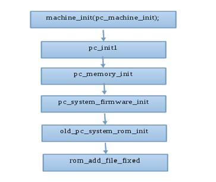
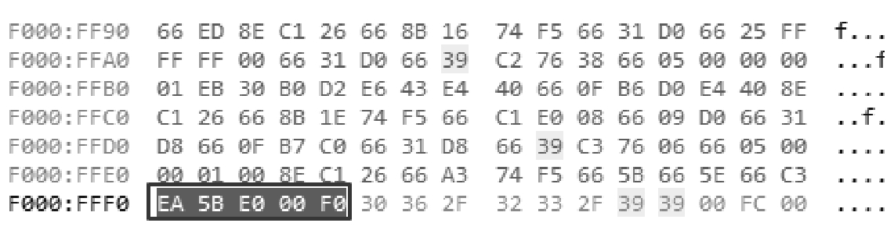
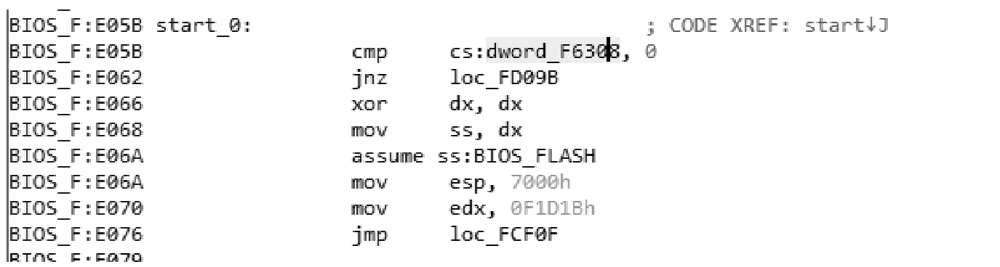
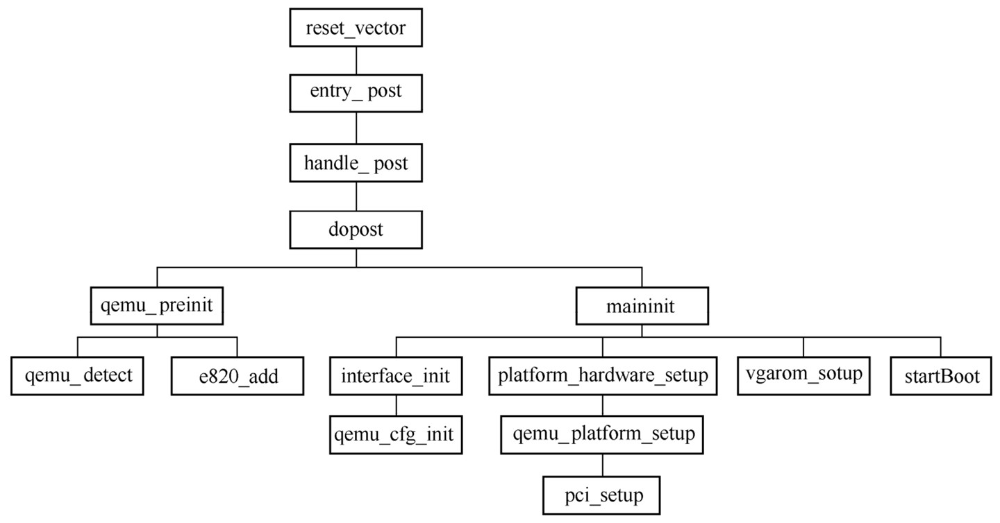

<!-- @import "[TOC]" {cmd="toc" depthFrom=1 depthTo=6 orderedList=false} -->

<!-- code_chunk_output -->

- [1. BIOS 简介](#1-bios-简介)
- [2. QEMU 中的 BIOS](#2-qemu-中的-bios)
  - [2.1. BIOS 二进制文件](#21-bios-二进制文件)
  - [2.2. BIOS 子模块源码](#22-bios-子模块源码)
  - [2.3. Makefile 中关于 BIOS 的拷贝操作](#23-makefile-中关于-bios-的拷贝操作)
- [3. QEMU 加载 BIOS 过程分析](#3-qemu-加载-bios-过程分析)
  - [3.1. x86_64 QEMU 中支持的类型](#31-x86_64-qemu-中支持的类型)
  - [3.2. QEMU 中 MemoryRegion 结构体](#32-qemu-中-memoryregion-结构体)
  - [3.3. old_pc_system_rom_init 函数中将 BIOS 映射到物理内存空间的代码:](#33-old_pc_system_rom_init-函数中将-bios-映射到物理内存空间的代码)
- [4. 小结](#4-小结)
- [5. SeaBIOS](#5-seabios)
- [6. QEMU 加载 SeaBIOS](#6-qemu-加载-seabios)
- [SeaBIOS 源码结构](#seabios-源码结构)
- [reference](#reference)

<!-- /code_chunk_output -->

本文将介绍 QEMU 代码中使用到的 BIOS, 通过分析 QEMU 代码, 讲解 BIOS 是如何加载到虚拟机的物理内存.

# 1. BIOS 简介

基本输入输出系统(`Basic InputOutput System`, BIOS)是计算机启动后运行的第一个软件. BIOS 的主要作用是初始化一些硬件, 为操作系统的运行做准备, 从而引导设备启动操作系统.

BIOS完成的主要任务如下.

1) **上电自检**(Power On Self Test, POST), 指的是 BIOS 针对**计算器硬件**(如CPU、主板、存储器等)进行**检测**.

2) POST 之后**初始化**与启动相关的**硬件**(磁盘、键盘控制器等).

3) 为操作系统创建一些参数, 比如 **ACPI 表**.

4) **选择引导设备**, 从设备中加载 bootloader, 进而启动操作系统.

# 2. QEMU 中的 BIOS

QEMU 使用的是一些开源的项目, 如 `edk2-*`, `SeaBIOS`, `Bochs`, `openBIOS`, `ipxe` 等.

QEMU 中使用到的 BIOS 以及固件:

* 一部分以**二进制文件的形式**保存在**源码树的 pc-bios 目录下**. QEMU 支持多种启动方式, 比如说 **efi**、**pxe** 等, 都包含在该目录下, 这些都需要特定 BIOS 的支持.

* 还有一些 BIOS 以 **git 源代码子模块**的形式**保存在 QEMU 的源码仓库**中, 当编译 QEMU 程序的时候, 也**同时编译**出这些 BIOS 或者固件的二进制文件.

## 2.1. BIOS 二进制文件

```
# ls pc-bios/
bamboo.dtb                      efi-e1000.rom                           optionrom                 README
bamboo.dts                      efi-eepro100.rom                        palcode-clipper           s390-ccw
bios-256k.bin                   efi-ne2k_pci.rom                        petalogix-ml605.dtb       s390-ccw.img
bios.bin                        efi-pcnet.rom                           petalogix-ml605.dts       s390-netboot.img
bios-microvm.bin                efi-rtl8139.rom                         petalogix-s3adsp1800.dtb  skiboot.lid
canyonlands.dtb                 efi-virtio.rom                          petalogix-s3adsp1800.dts  slof.bin
canyonlands.dts                 efi-vmxnet3.rom                         pvh.bin                   u-boot.e500
descriptors                     hppa-firmware.img                       pxe-e1000.rom             u-boot-sam460-20100605.bin
edk2-aarch64-code.fd.bz2        keymaps                                 pxe-eepro100.rom          vgabios-ati.bin
edk2-arm-code.fd.bz2            kvmvapic.bin                            pxe-ne2k_pci.rom          vgabios.bin
edk2-arm-vars.fd.bz2            linuxboot.bin                           pxe-pcnet.rom             vgabios-bochs-display.bin
edk2-i386-code.fd.bz2           linuxboot_dma.bin                       pxe-rtl8139.rom           vgabios-cirrus.bin
edk2-i386-secure-code.fd.bz2    meson.build                             pxe-virtio.rom            vgabios-qxl.bin
edk2-i386-vars.fd.bz2           multiboot.bin                           qboot.rom                 vgabios-ramfb.bin
edk2-licenses.txt               multiboot_dma.bin                       QEMU,cgthree.bin          vgabios-stdvga.bin
edk2-riscv-code.fd.bz2          npcm7xx_bootrom.bin                     qemu_logo.svg             vgabios-virtio.bin
edk2-riscv-vars.fd.bz2          openbios-ppc                            qemu-nsis.bmp             vgabios-vmware.bin
edk2-x86_64-code.fd.bz2         openbios-sparc32                        qemu-nsis.ico             vof
edk2-x86_64-microvm.fd.bz2      openbios-sparc64                        qemu.rsrc                 vof.bin
edk2-x86_64-secure-code.fd.bz2  opensbi-riscv32-generic-fw_dynamic.bin  QEMU,tcx.bin              vof-nvram.bin
efi-e1000e.rom                  opensbi-riscv64-generic-fw_dynamic.bin  qemu_vga.ndrv
```

当源代码编译 QEMU 时候, QEMU 的 Makefile 会将**这些二进制文件**拷贝到 QEMU 的数据文件目录中.

## 2.2. BIOS 子模块源码

```
$ cat .gitmodules
[submodule "roms/seabios"]
        path = roms/seabios
        url = https://gitlab.com/qemu-project/seabios.git/
[submodule "roms/SLOF"]
        path = roms/SLOF
        url = https://gitlab.com/qemu-project/SLOF.git
[submodule "roms/ipxe"]
        path = roms/ipxe
        url = https://gitlab.com/qemu-project/ipxe.git
[submodule "roms/openbios"]
        path = roms/openbios
        url = https://gitlab.com/qemu-project/openbios.git
[submodule "roms/qemu-palcode"]
        path = roms/qemu-palcode
        url = https://gitlab.com/qemu-project/qemu-palcode.git
[submodule "roms/u-boot"]
        path = roms/u-boot
        url = https://gitlab.com/qemu-project/u-boot.git
[submodule "roms/skiboot"]
        path = roms/skiboot
        url = https://gitlab.com/qemu-project/skiboot.git
[submodule "roms/QemuMacDrivers"]
        path = roms/QemuMacDrivers
        url = https://gitlab.com/qemu-project/QemuMacDrivers.git
[submodule "roms/seabios-hppa"]
        path = roms/seabios-hppa
        url = https://gitlab.com/qemu-project/seabios-hppa.git
[submodule "roms/u-boot-sam460ex"]
        path = roms/u-boot-sam460ex
        url = https://gitlab.com/qemu-project/u-boot-sam460ex.git
[submodule "roms/edk2"]
        path = roms/edk2
        url = https://gitlab.com/qemu-project/edk2.git
[submodule "roms/opensbi"]
        path = roms/opensbi
        url =   https://gitlab.com/qemu-project/opensbi.git
[submodule "roms/qboot"]
        path = roms/qboot
        url = https://gitlab.com/qemu-project/qboot.git
[submodule "roms/vbootrom"]
        path = roms/vbootrom
        url = https://gitlab.com/qemu-project/vbootrom.git
[submodule "tests/lcitool/libvirt-ci"]
        path = tests/lcitool/libvirt-ci
        url = https://gitlab.com/libvirt/libvirt-ci.git
```

## 2.3. Makefile 中关于 BIOS 的拷贝操作

```
ifneq ($(BLOBS),)
    set -e; for x in $(BLOBS); do \
        $(INSTALL_DATA) $(SRC_PATH)/pc-bios/$$x "$(DESTDIR)$(qemu_datadir)"; \
    done
endif
```

# 3. QEMU 加载 BIOS 过程分析

当 QEMU 用户空间进程开始启动时, QEMU 进程会根据所**传递的参数**以及当前**宿主机平台类型(host 类型)**, 自动加载适当的 BIOS 固件.

QEMU 进程启动初始阶段, 会通过 `module_call_init` 函数调用 `qemu_register_machine` 注册**该平台支持的全部机器类型**, 接着调用 `find_default_machine` **选择一个默认的机型**进行初始化.  以 QEMU 代码(1.7.0)的 `x86_64` 平台为例, 支持的机器类型有:

## 3.1. x86_64 QEMU 中支持的类型

```
pc-q35-1.7 pc-q35-1.6 pc-q35-1.5 pc-q35-1.4 pc-i440fx-1.7 pc-i440fx-1.6 pc-i440fx-1.5
pc-i440fx-1.4 pc-1.3 pc-1.2 pc-1.1 pc-1.0 pc-0.15 pc-0.14
pc-0.13    pc-0.12    pc-0.11    pc-0.10    isapc
```

代码中使用的默认机型为 pc-i440fx-1.7, 使用的 BIOS 文件为:

```
pc-bios/bios.bin
Default machine name : pc-i440fx-1.7
bios_name = bios.bin
```

pc-i440fx-1.7 解释为 QEMU 模拟的是 INTEL 的 i440fx 硬件芯片组, 1.7 为 QEMU 的版本号. **找到默认机器之后, 为其初始化物理内存**, QEMU 首先**申请一块内存空间用于模拟虚拟机的物理内存空间**, 申请完好内存之后, 根据不同平台或者启动 QEMU 进程的参数, 为虚拟机的**物理内存初始化**. 具体函数调用过程见图 1.

图 1. QEMU 硬件初始化函数调用流程图:



在 QEMU 中, 整个物理内存以一个结构体 struct MemoryRegion 表示, 具体定义见清单 5.

## 3.2. QEMU 中 MemoryRegion 结构体

```
struct MemoryRegion {
    /* All fields are private - violators will be prosecuted */
    const MemoryRegionOps *ops;
    const MemoryRegionIOMMUOps *iommu_ops;
    void *opaque;
    struct Object *owner;
    MemoryRegion *parent;
    Int128 size;
    hwaddr addr;
    void (*destructor)(MemoryRegion *mr);
    ram_addr_t ram_addr;
    bool subpage;
    bool terminates;
    bool romd_mode;
    bool ram;
    bool readonly; /* For RAM regions */
    bool enabled;
    bool rom_device;
    bool warning_printed; /* For reservations */
    bool flush_coalesced_mmio;
    MemoryRegion *alias;
    hwaddr alias_offset;
    unsigned priority;
    bool may_overlap;
    QTAILQ_HEAD(subregions, MemoryRegion) subregions;
    QTAILQ_ENTRY(MemoryRegion) subregions_link;
    QTAILQ_HEAD(coalesced_ranges, CoalescedMemoryRange) subregions_link;
    const char *name;
    uint8_t dirty_log_mask;
    unsigned ioeventfd_nb;
    MemoryRegionIoeventfd *ioeventfds;
    NotifierList iommu_notify;
};
```

**每一个 MemoryRegion 代表一块内存区域**. 仔细观察 MemoryRegion 的成员函数, 它包含一个 Object 的成员函数用于指向它的所有者, 以及一个 MemoryRegion 成员用于指向他的父节点(有点类似链表). 另外还有三个尾队列(QTAILQ) subregions, subregions\_link, subregions\_link. 也就是说, 一个 MemoryRegion 可以包含多个内存区, 根据不同的参数区分该内存域的功能.  在使用 MemoryRegion 之前要先为其分配内存空间并调用 memory\_region\_init 做必要的初始化. BIOS 也是通过一个 MemoryRegion 结构指示的. 它的 MemoryRegion.name 被设置为"pc.bios",  size 设置为 BIOS 文件的大小(65536 的整数倍). 接着调用 rom\_add\_file\_fixed 将其 BIOS 文件加载到一个全局的 rom 队列中.

最后, 回到 `old_pc_system_rom_init` 函数中, 将 BIOS 映射到内存的最上方的地址空间.

## 3.3. old_pc_system_rom_init 函数中将 BIOS 映射到物理内存空间的代码:

```cpp
hw/i386/pc_sysfw.c

    /* map all the bios at the top of memory */
    memory_region_add_subregion(rom_memory,
                                (uint32_t)(-bios_size),
                                bios);
```

`(uint32_t)(-bios_size)` 是一个 32 位无符号数字, 所以`-bios_size` 对应的地址就是 FFFFFFFF 减掉 bios\_size 的大小.  bios size 大小为 `./pc-bios/bios.bin = 131072 (128KB)` 字节, 十六进制表示为 0x20000, 所以 bios 在内存中的位置为 bios position = fffe0000, bios 在内存中的位置就是 0xfffdffff~0xffffffff 现在 BIOS 已经加在到虚拟机的物理内存地址空间中了.

最后 QEMU 调用 CPU 重置函数重置 VCPU 的寄存器值 IP=0x0000fff0, CS=0xf000, CS.BASE= 0xffff0000,CS.LIMIT=0xffff. 指令从 0xfffffff0 开始执行, 正好是 ROM 程序的开始位置. 虚拟机就找到了 BIOS 的入口.

# 4. 小结

通过阅读 QEMU 程序的源代码, 详细介绍了 QEMU 中使用到的 BIOS 文件, QEMU 中物理内存的表示方法, 以及 QEMU 是如何一步步将 BIOS 的二进制载入到通过 QEMU 创建的虚拟机中的内存的过程.

# 5. SeaBIOS

SeaBIOS 是开源的 16 位 x86 BIOS 的实现. SeaBIOS 能够运行在模拟器中或者在使用 coreboot 的情况下运行在物理 x86 硬件上, 是 QEMU/KVM 虚拟化方案的默认 BIOS. 从 QEMU 让 CPU 开始运行到实际的虚拟机操作内核开始运行, 中间有一个很重要的任务就是执行 SeaBIOS 的代码.

相比于实际的物理 BIOS, SeaBIOS 的功能简单很多, 因为虚拟化环境中并不存在实际的物理硬件, 很多硬件配置可以省略, SeaBIOS 只需要关注一些功能接口即可. SeaBIOS 是 QEMU 运行虚拟机的第一部分代码, 理解 SeaBIOS 的工作原理, 对于理解 QEMU 和 KVM 虚拟化方案以及排查一些疑难问题都非常有帮助. 本节后面会首先介绍 QEMU 对 SeaBIOS 的加载, 之后会对 SeaBIOS 的代码流程进行简单讲解.

# 6. QEMU 加载 SeaBIOS

`pc_i440fx_machine_options` 会设置 QEMU 的 firmware 为 `biso-256k.bin`, 代码如下.

```cpp
// hw/i386/pc_piix.c
static void pc_i440fx_machine_options(MachineClass *m)
{
    PCMachineClass *pcmc = PC_MACHINE_CLASS(m);
    ObjectClass *oc = OBJECT_CLASS(m);
    pcmc->default_south_bridge = TYPE_PIIX3_DEVICE;
    pcmc->pci_root_uid = 0;
    pcmc->default_cpu_version = 1;

    m->family = "pc_piix";
    m->desc = "Standard PC (i440FX + PIIX, 1996)";
    // 设置
    m->default_machine_opts = "firmware=bios-256k.bin";
    m->default_display = "std";
    m->default_nic = "e1000";
    m->no_parallel = !module_object_class_by_name(TYPE_ISA_PARALLEL);
    machine_class_allow_dynamic_sysbus_dev(m, TYPE_RAMFB_DEVICE);
    machine_class_allow_dynamic_sysbus_dev(m, TYPE_VMBUS_BRIDGE);

    object_class_property_add_enum(oc, "x-south-bridge", "PCSouthBridgeOption",
                                   &PCSouthBridgeOption_lookup,
                                   pc_get_south_bridge,
                                   pc_set_south_bridge);
    object_class_property_set_description(oc, "x-south-bridge",
                                     "Use a different south bridge than PIIX3");
}
```

`pc_i440fx_machine_options` 会在虚拟机**注册** QEMU 虚拟机**机器类型**的时候调用, 这是由宏 `DEFINE_PC_MACHINE` 指定的.

```cpp
// hw/i386/pc_piix.c
static void pc_i440fx_9_0_machine_options(MachineClass *m)
{
    pc_i440fx_machine_options(m);
    m->alias = "pc";
    m->is_default = true;
}

DEFINE_I440FX_MACHINE(v9_0, "pc-i440fx-9.0", NULL,
                      pc_i440fx_9_0_machine_options);

#define DEFINE_I440FX_MACHINE(suffix, name, compatfn, optionfn) \
    static void pc_init_##suffix(MachineState *machine) \
    { \
        void (*compat)(MachineState *m) = (compatfn); \
        if (compat) { \
            compat(machine); \
        } \
        pc_init1(machine, TYPE_I440FX_PCI_DEVICE); \
    } \
    DEFINE_PC_MACHINE(suffix, name, pc_init_##suffix, optionfn)

```

`main()` 函数首先会将这个 `default_machine_opts` 挂到 `current_machine` 的 option lists 上, 之后从这个 option lists 上把 firmware 的值赋值到 `bios_name`, 由上可知 `bios_name` 为 `bios-256k.bin`.

```cpp
// system/vl.c
main() -> qemu_init() -> qemu_create_machine()

static void qemu_create_machine(QDict *qdict)
{
    ...
    if (machine_class->default_machine_opts) {
        // 解析 "firmware=bios-256k.bin"
        // 得到 key-value
        QDict *default_opts =
            keyval_parse(machine_class->default_machine_opts, NULL, NULL,
                         &error_abort);
        // 设置 key-value, 最终在 default_opts 中
        qemu_apply_legacy_machine_options(default_opts);
        // 挂到 current_machine 的 option lists 上
        object_set_properties_from_keyval(OBJECT(current_machine), default_opts,
                                          false, &error_abort);
        qobject_unref(default_opts);
    }
}
```

BIOS固件的加载是在函数old_pc_system_rom_init中完成的, 调用链为pc_init1->pc_memory_init->pc_system_firmware_init->old_pc_system_rom_init. 该函数主要完成三项工作:

1)打开文件, 得到文件信息, 创建一个BIOS MemoryRegion, 内存相关AddressSpace和MemoryRegion内容将在后面的内存虚拟化部分进行介绍, 这里简单知道MemoryRegion表示一段内存即可. 首先通过qemu_find_file和get_image_size得到文件的路径和大小, 大小需要是64KB的整数倍, 然后调用memory_region_init_ram初始化一个名为bios的MemoryRegion, 注意这里memory_region_init_ram会实际地在QEMU的地址空间分配bios_size, 也就是256KB大小的虚拟地址空间, 作为虚拟机的物理地址.

```cpp

```

2)通过宏rom_add_file_fixed调用rom_add_file打开BIOS固件文件.

```cpp

```

rom_add_file的主要作用是分配一个Rom结构体, 记录BIOS的一些基本信息调用, rom_insert函数将新分配的Rom挂到一个链表上. Rom定义如下.

```cpp

```

romsize和datasize是一样的, 表示的是Rom的大小, data用来存放实际的数据, mr和as表示其对应的MemoryRegion和AddressSpace, addr表示固件加载的虚拟机的物理地址, 所有的Rom通过next连接起来, 链表头是roms.

3)最后一步就是将创建的bios MemoryRegion设置为rom_memory(其实就是整个PCI内存的MemoryRegion)的子Region, 其offset设置为BIOS的加载地址. QEMU使用的SeaBIOS是256KB, bios_size为0x40000, (uint32_t)-bios_size则为0xfffc0000, 所以这里是把BIOS的地址加在到了0xfffc0000处, 也就是最靠近4GB地址空间的256KB中. 在这一步中还会将创建一个isa_bios作为BIOS MemoryRegion的别名, 并且放到最靠近1MB的128KB处. memory_region_add_subregion将bios这个MemoryRegion作为子Region添加到了rom_memory上面. 回溯调用栈, 可以发现, rom_memory实际上就是pci_memory.

```cpp

```

现在已经分配了一个BIOS MemoryRegion, 并且设置了其基地址和大小, 也将BIOS的数据加载到了内存中, 但是只是在rom->data中. 下面分析QEMU如何将BIOS的数据复制到MemoryRegion中, 并将虚拟机对应的物理内存映射到QEMU的虚拟内存中.

QEMU会在main函数中调用rom_check_and_register_reset, 后者的主要工作是将rom_reset挂到reset_handlers链表上, 当虚拟机重置时会调用该链表上的每一个函数.

rom_reset最重要的任务就是把存放在rom->data中的BIOS数据复制到BIOS MemoryRegion对应的QEMU进程中分配的虚拟内存中.

```cpp

```

现在BIOS MemoryRegion对应的宿主机QEMU进程虚拟内存已经有了BIOS的数据, 并且这个MR的地址对应的是虚拟机的物理地址0xfffc0000, 在之后的内存分布拓扑更新中会调用kvm_set_user_memory_region, 对该宿主机QEMU进程的虚拟地址和虚拟机物理地址设置映射关系, 这里涉及内存虚拟化的知识, 留到后面的章节详细介绍.

CPU在启动后会初始化各个寄存器的值, 其中, CS被初始化为0xf000, EIP被初始化为0xfff0, CS的基址会被初始化为0xffff0000. 虽然此模式下的寻址方式为 `cs*16+eip`, 但是CS本身有两个值, 其中可见的部分就是能够被程序设置和读取的部分, 还有一个隐藏的部分, 就是基址部分. 所以第一次开始执行的时候, 会执行CS基址+eip处的指令, 即CPU会从0xffff000+0xfff0=0xfffffff0处开始执行指令, 所以0xfffffff0也被叫作重置向量. 当第一次修改CS的值时, 会使用 `cs*16+eip` 的方式寻址. QEMU中设置寄存器的值在函数x86_cpu_reset中, 下面的代码用来设置CS的值、CS的基地址以及eip的值.

```cpp

```

从之前的分析可知, 0xfffffff0处就是BIOS的最后16个字节开始处, 这里都是一个跳转指令, 跳转到BIOS的前面部分执行. 比如, 查看SeaBIOS编译之后的情况如下图所示.

SeaBIOS机器码:



`F000:FFF0` 中的F000表示CS段寄存器的值, FFF0表示eip的值, 最开始执行的指令是一个跳转指令, 直接跳到F000:E05B. 当执行完0xfffffff0之后的跳转指令之后, 其实我们的cs段寄存器已经改了, 所以会按照 `cs*16+eip` 的方式寻址. 此时会寻址到 `0xf000*16+0xe05b=0xfe05b`, 这个值其实是BIOS文件256KB中的后128KB部分, 由上一节分析可知, 这部分BIOS已经被映射到了 `0x100000(1MB)-0x20000(128KB)=0xe0000` 开始的地方, 范围是0xe0000 ~ 0xfffff. 其代码如图3-13所示.

SeaBIOS 0xfe05b处代码:



后面的工作就是BIOS的自检和硬件初始化等工作了, 将在下一节进行详细介绍.

# SeaBIOS 源码结构

这里对SeaBIOS的源码结构进行简单介绍.

SeaBIOS代码执行主要包括4个阶段, 即post阶段、boot阶段、main runtime阶段以及resume and reboot阶段.

1. post阶段

SeaBIOS post阶段调用的相关函数如图3-14所示.




```cpp
// hw/i386/x86.c
void x86_bios_rom_init(MachineState *ms, const char *default_firmware,
                       MemoryRegion *rom_memory, bool isapc_ram_fw)
{
    ...
    /* BIOS load */
    bios_name = ms->firmware ?: default_firmware;
    ...
}
```


# reference

https://www.linuxidc.com/Linux/2014-12/110472.htm