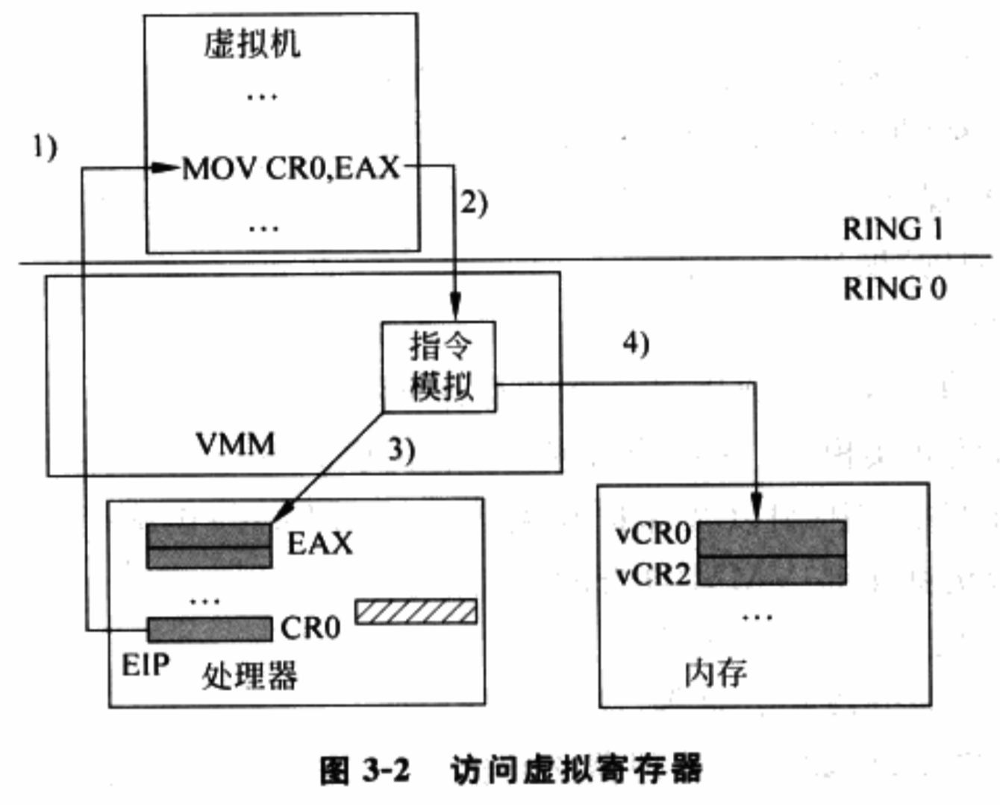
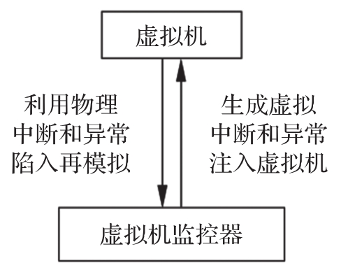
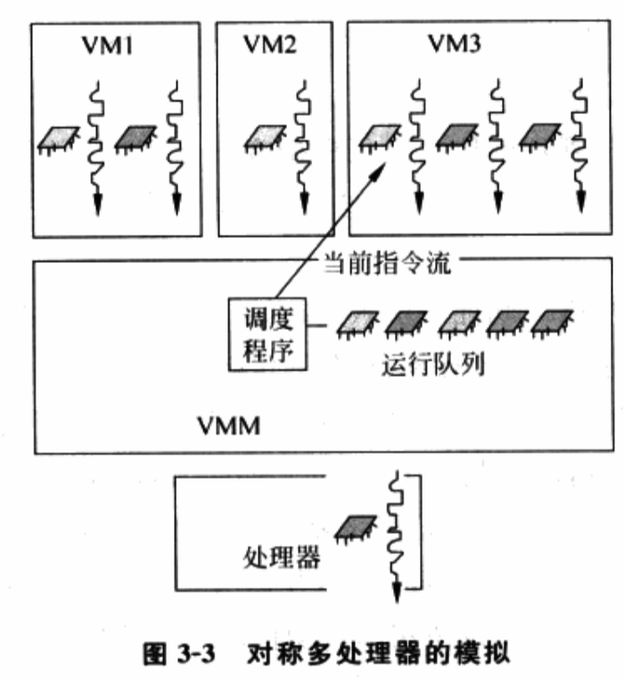

<!-- @import "[TOC]" {cmd="toc" depthFrom=1 depthTo=6 orderedList=false} -->

<!-- code_chunk_output -->

- [1. 指令的模拟](#1-指令的模拟)
  - [1.1. 虚拟寄存器](#11-虚拟寄存器)
  - [1.2. 上下文](#12-上下文)
  - [1.3. 虚拟处理器](#13-虚拟处理器)
    - [1.3.1. 客户机 OS 角度的虚拟处理器](#131-客户机-os-角度的虚拟处理器)
    - [1.3.2. VMM 角度的虚拟处理器](#132-vmm-角度的虚拟处理器)
  - [1.4. 处理器虚拟化的宗旨](#14-处理器虚拟化的宗旨)
  - [1.5. VMM 的陷入方式](#15-vmm-的陷入方式)
- [2. 中断和异常的模拟及注入](#2-中断和异常的模拟及注入)
- [3. 对称多处理器技术的模拟](#3-对称多处理器技术的模拟)

<!-- /code_chunk_output -->

处理器虚拟化是 VMM 中最核心的部分, 因为**访问内存**和**I/O 指令**本身就是**敏感指令**, 所以**内存虚拟化**和**I/O 虚拟化**都依赖于**处理器虚拟化**的正确实现.

处理器虚拟化的宗旨是让虚拟机执行的敏感指令陷入下来后, 能被 VMM 模拟, 而不直接作用于真实硬件上.

# 1. 指令的模拟

* **VMM** 运行在**最高特权级**, 可以控制**物理处理器上所有关键资源**;

* **客户机 OS** 运行在**非最高特权级**, 所以其敏感指令会陷入到 VMM 中通过软件方式进行模拟.

所以, **处理器虚拟化**的**关键！！！** 在于**正确模拟指令的行为！！！**.

介绍指令模拟之前, 我们理解三个概念: 虚拟寄存器、上下文和虚拟处理器.

## 1.1. 虚拟寄存器

从某种程度上, **物理处理器**无非包括了一些**存放数据的物理寄存器**, 并且规定了**使用这些寄存器的指令集**, 然后按照一段预先写好的**指令流**, 在给定的时间点使用给定的部分寄存器来完成某种目的.

当**客户机 OS**试图访问**关键资源！！！**的时候, 该请求并**不会真正发生在物理寄存器**上. 相反, **VMM**会通过**准确模拟物理处理器的行为**, 而**将其访问定位到**VMM 为其设计与**物理寄存器对应的"虚拟"的寄存器**上.

当然, 从 VMM 实现来说, 这样的**虚拟寄存器往往是在内存中！！！**.

图 3\-2 是一个具体的**访问控制寄存器 CR0 的例子**. 当处理器取下一条指令**MOV CR0, EAX**后, 发现**特权级不符合！！！**, 则**抛出异常**, **VMM**会**截获这个异常**之后**模拟处理器的行为**, 读取**EAX(真实物理寄存器**)的内容并放到**虚拟的 CR0**中. 由于**虚拟的 CR0**存放在 VMM 为该虚拟机设计的**内存区域**里, 因此该指令执行的结果并**不会让物理的 CR0 内容发生改变**. 等到下一次, 当虚拟机试图读 CR0 时, 处理器也会抛出异常, 然后由 VMM 从虚拟的 CR0 而不是物理的 CR0 中返回内容给虚拟机.

## 1.2. 上下文

在没有虚拟化的环境中, 操作系统直接负责物理处理器管理, 负责进程间调度和切换. 但是, VMM 接管物理处理器后, 客户机 OS 运行在**VMM**为之设计的**虚拟处理器**之上, 管理虚拟处理器, 并在**虚拟处理器**上负责该**虚拟机内进程调度和切换**. 而**调度切换**, 涉及到了上下文状态, 这里是**虚拟处理器上下文**.

而在某个时刻, **物理处理器**中的**寄存器状态**构成了**当前进程的上下文状态**.

**进程上下文！！！主要是与运算相关的寄存器状态！！！**, 例如 EIP 寄存器指向进程当前执行的指令, ESP 存放着当前进程的堆栈指针等.

**虚拟处理器上下文**比进程上下文**更为复杂**, 因为客户机 OS 本身包含很多敏感指令, 会试图访问和修改物理处理器上定义的所有寄存器, 而这种访问和修改会被 VMM 重定位到虚拟处理器上. 所以, 对于**虚拟处理器**, 其上下文包括了**更多的系统寄存器**, 例如 CR0、CR3、CR4 和各种 MSR 等. 当 VMM 在决定切换虚拟处理器的时候, 需要考虑保存和恢复的上下文也更为复杂.

## 1.3. 虚拟处理器

**虚拟处理器**可以从两个角度来理解.

### 1.3.1. 客户机 OS 角度的虚拟处理器

首先, 从**客户机 OS**角度, 其在运行的**虚拟处理器**需要具备与其"**期望"的物理处理器一样的功能和行为**, 这种"期望"的前提条件甚至可以允许客户机 OS 的修改, 例如 VMM 可以修改客户机 OS 的源码, 使客户机 OS 所"期望"的与 VMM 所呈现的功能集合一致. 典型"期望"包括:

1) 指令集合与执行效果

2) 可用寄存器集合, 包括通用寄存器以及各种系统寄存器.

3) 运行模式, 例如实模式、保护模式和 64 位长模式等.  处理器的运行模式决定了指令执行的效果、寻址宽度和限制以及保护粒度等.

4) 地址翻译系统, 例如页表级数.

5) 保护机制, 例如分页和分段等.

6) 中断/异常机制, 例如虚拟处理器必须能够正确模拟真实处理器的行为, 在错误的执行条件下, 为虚拟机注入一个虚拟的异常.

### 1.3.2. VMM 角度的虚拟处理器

从**VMM 的角度**看, **虚拟处理器**是其需要模拟完成的一组**功能集合**.

**虚拟处理器功能**可以由**物理处理器**和**VMM**共同完成.

- 对于**非敏感指令！！！**, **物理处理器直接解码处理其请求！！！**, 并将相关**效果直接反映到物理寄存器**上;
- 对于**敏感指令！！！**, VMM 负责**陷入再模拟！！！**, 从程序角度也就是一组**数据结构**与**相关处理代码**的集合.
    - **数据结构**用于存储**虚拟寄存器的内容**,
    - **相关处理代码**负责按照**物理处理器的行为**将效果反映到**虚拟寄存器**上.

VMM 已经可以为虚拟机呈现与实际物理机不一致的功能和行为.  例如, 虚拟处理器的个数, 可以与物理处理器的个数不一致.

## 1.4. 处理器虚拟化的宗旨

总之, 在**处理器虚拟化**中, 定义**虚拟寄存器**和**虚拟处理器**, 利用**上下文**进行**虚拟处理器调度切换**, **宗旨**都是让**虚拟机执行的敏感指令陷入**下来后, 能被 VMM 模拟, 而不直接作用于真实硬件上.

## 1.5. VMM 的陷入方式

当然, **模拟的前提**是**能够陷入**.

那**客户机 OS 执行**时, 是**如何通知 VMM**的, 也就是**VMM 的陷入方式**.

概括讲, VMM 陷入是利用**处理器的保护机制**, 利用**中断和异常**来完成的, 它有以下几种方式.

1)  基于**处理器保护机制触发的异常！！！**, 例如前面提到的**敏感指令**的执行. 处理器在执行敏感指令前, 检查其执行条件是否满足, 例如当前特权级、运行模式以及内存映射关系等. 一旦任一条件不满足, VMM 得到陷入然后进行处理.

2) **虚拟机主动触发异常**, 也就是常说的**陷阱**. 条件满足时, 处理器会在触发陷阱的指令执行完毕后, 再抛出一个异常. 虚拟机可以通过**陷阱指令**来**主动请求**陷入到 VMM 中. **类虚拟化技术**就是通过这种方式实现 Hypercall 的.

3) **异步中断**, 包括**处理器内部的中断源**和**外部的设备中断源**. 一旦中断信号到达处理器, 处理器会强行中断当前指令, 然后跳到 VMM 注册的中断服务程序中. 例如, **VMM**可以通过**调度算法**指定**当前虚拟机运行时的时间片长度**, 然后编程外部时钟源, 确保时间片用完时触发中断, 从而允许 VMM 进行下一次调度.

# 2. 中断和异常的模拟及注入

中断和异常机制是处理器提供给系统程序的重要功能

- **异常**保证了**系统程序对处理器关键资源的绝对控制**,

- **中断**提供了与**外设**之间有效地一种交互方式.

VMM 对于**异常的虚拟化**需要完全遵照**物理处理器**对于**各种异常条件的定义**, 再根据**虚拟处理器**当时的内容, 来判断是否需要**模拟出一个虚拟的异常**, 并**注入到虚拟环境**中.

VMM 通常会在**硬件异常处理程序**和**指令模拟代码**中进行**异常虚拟化的检查**. 无论哪条路径, VMM 需要区分两种原因: 一是**虚拟机自身**对**运行环境**和**上下文的设置**违背了**指令正确执行的条件**; 二是**虚拟机**运行在**非最高特权级别**, 由于虚拟化的原因触发的异常. 第二种情况是由于**陷入再模拟的虚拟化方式**所造成的, 并**不是虚拟机本身的行为**. 而第一种情况的检查, **VMM**实际是在**虚拟处理器的内容**上进行, 因为它反映了**虚拟机所期望的运行环境**. 错误的异常注入会导致客户 OS 做出错误反应, 后果无法预知.

**物理中断的触发**来自**特定的物理中断源**, 同样, **虚拟中断的触发**来自于**虚拟设备的模拟程序！！！**. 当**设备模拟器！！！**发现**虚拟设备状态**满足**中断产生的条件**时, 会将这个**虚拟中断！！！**通知给**中断控制器的模拟程序(！！！**), 例如**模拟 LAPIC**. 最后, **VMM**会在特定时候**检测虚拟中断控制器的状态**, 来决定是否**模拟一个中断的注入**. 而这里的**虚拟中断源**包括: **处理器内部中断源的模拟**, 例如**LAPIC 时钟**、**处理器间中断**等; **外部虚拟设备的模拟**, 例如 8254、RTC、IDE、网卡和电源管理模块等; **直接分配给虚拟机！！！**使用的**真实设备的中断！！！**, 通常来自 VMM 的中断服务程序; **自定义的中断类型**.

当**VMM**决定**向虚拟机注入一个中断或异常**时, 它需要**严格模拟物理处理器的行为！！！**来改变客户指令流的路径, 而且还要包含一些必需的上下文保护与恢复. **VMM**需要**首先判断当前虚拟机的执行环境**是否允许**接受中断或是异常的注入**, 假如客户机 OS 正好通过**RFLAGS.IF 位**禁止了中断的发生, 这时 VMM 就**只能把中断事件暂时缓存起来**, 直到某时刻客户机操作系统重新允许了中断的发生, VMM 才立即切入来模拟一个中断的注入. 而当中断事件不能被及时注入时, VMM 还要进一步考虑如下因素.

1) 该**中断类型**是否允许**丢失中断**, 如果允许, VMM 则可以将其后到达的**多个同类型中断合为一个事件**; 否则, VMM 必须要**跟踪所有后续到达的中断实例**, 在客户指令流**重新允许中断**时, 将**每一个缓存的中断**一一注入.

2) 该中断在**阻塞期间**是否被**中断源取消！！！**, 这决定了 VMM 是否会**额外注入**一个已经**被取消的假中断**.

3) 当一次阻塞的中断实例比较多, VMM 可能还要考虑客户机 OS 能否处理短期内大量同类型的中断注入, 因为这在真实系统中可能并不出现.

实际实现中, 还要考虑更多因素.

当模拟中断或异常的注入时, VMM 需要**首先判断是否涉及到运行模式的切换**. 假如虚拟机可能运行在一个**64 位兼容模式**, 而**中断/异常处理程序**运行在**64 位长模式**, 这时 VMM 就得按照处理器的规定, 将**虚拟机的运行模式**进行**软件切换！！！**, 对保存的**客户上下文进行相应的修改！！！**. 可能需要的模式切换后, VMM 还需要根据**真实处理器在该模式下的中断注入过程！！！**, 完整地进行**软件模拟**. 例如, 将**必需的处理器状态(指令地址、段选择子等**)复制压入**当前模式**下**对应中断/异常服务程序的堆栈**; 到**中断模拟逻辑**去查找发生**中断的向量号**; 根据该**向量号**来查找**相关的中断/异常服务程序的入口地址**; 最后**修改虚拟机的指令地址**为上述入口地址, 然后返回到虚拟机执行等.

总而言之, **中断/异常的虚拟化**由**中断/异常源的定义**、**中断/异常源**与**VMM 处理器虚拟化模块间**的**交互机制**以及**最终模拟注入的过程**组成. 虚拟机与VMM通过中断和异常发生的交互机制如图.

# 3. 对称多处理器技术的模拟

在没有虚拟化的环境中, 对称多处理器技术可以让 OS 拥有并控制多个物理处理器, 它通过提供并发的计算资源和运算逻辑, 允许上层 OS 同时调度多条基于不同计算目的的进程并发执行, 从而有效提高系统的吞吐率与性能.

同样, 当物理计算资源足够多时, VMM 也可以考虑为虚拟机呈现多个虚拟处理器, 即客户对称处理器虚拟化技术, 也称客户 SMP 技术. 这样, 当这些虚拟处理器同时被调度在多个物理处理器上执行时, 也可以有效提高给定虚拟机的性能.

**客户 SMP**引入, VMM 在虚拟环境的管理和责任发生变化.

首先, **VMM**必须按照**客户机操作系统期望**的那样**呈现客户 SMP**的存在, 这样客户机 OS 才不会认为其运行在单一处理器上, 才会试图初始化其它的虚拟处理器, 并在其上运行调度程序. VMM 可以是模拟一个现实中的接口, 例如通过 APIC 表来表述; 也可以是一个自定义的接口协议, 只要客户机 OS 被修改来配合 VMM 即可.

其次, SMP 的并发执行能力虽然带来了性能上提升, 但多个处理器竞争共享资源的情况也给软件带来了更多复杂性. 为保证正确性, 通常系统程序需要实现一套同步机制来协调处理器之间的步调, 从而确保任何时候只有一个处理器能对共享资源进行修改, 并且在释放修改权之前, 确保修改的效果能被每个处理器察觉到.

在客户 SMP 机制引入后, 实际上 VMM 面临**物理处理器(即主机 SMP**)以及**虚拟处理器之间(即客户 SMP**)的**同步**问题.

1) 对于发生在**VMM 自身代码之间**的同步问题, 由**VMM**负责协调**物理处理器之间的步调**来满足主机 SMP 的要求.

2) 对于发生在**同一虚拟机内部**, **多个虚拟处理器间**的同步问题, 通常**VMM 不需要参与**, 这是客户 OS 自身的职责. VMM 只需要在客户机 OS 发起某种特权操作, 例如刷新页表时, 正确地模拟其效果即可.

3) 对于**VMM 造成**的**虚拟处理器之间的同步问题**, 仍需要**VMM 来负责处理**. 例如, VMM 可能将 N 个虚拟处理器在 M(M>N)个物理处理器之间迁移, 客户机 OS 只知道自己有 N 个虚拟处理器, 所以只会在这 N 个虚拟处理器的上下文内进行同步操作, 但当 VMM 将这 N 个虚拟处理器迁移到 M 个物理处理器上运行时, VMM 就必须负责所有 M 个物理处理器上状态的同步.

最后, VMM 对虚拟机管理模块也必须根据客户 SMP 的存在做相应修改. 例如, 挂起命令要区分挂起虚拟处理器还是挂起虚拟机, 当挂起某个虚拟机就必然挂起该虚拟机内所有指令流的执行.

下面看下在客户 SMP 功能被引入后初始化过程如何模拟的

通常, 对称多处理器技术定义有标准的一套初始化过程. 在**没有虚拟化**时, **BIOS**负责**选取 BSP(主启动处理器)与 AP(应用处理器**), 把**所有处理器**都初始化到**某个状态**后, **BIOS**在**BSP**上通过**启动加载程序(Boot Loader**)跳转至**操作系统的初始化代码**, 同时**所有的 AP**处于某种**等待初始化硬件信号**的状态. 接下来, **OS！！！**会在初始化到某个时刻时, 发出某种**初始化硬件信号给所有 AP**, 并提供一段**特定的启动代码**, AP 在收到**初始化硬件信号**后, 就会跳转到 **操作系统指定的启动代码！！！** 中继续执行. 通过这样的一种方式, OS 最终就成功按自己的方式初始化了所有处理器, 最后在每个处理器上独立地运行调度程序.

那么, 虚拟环境中, 客户 SMP 功能被引入后初始化怎么做的? 注意, 此时讨论的是 VMM 已经启动运行起来, 而客户 OS 正处于初始化阶段. **VMM**选择**第一个虚拟处理器**作为**BSP**, 其它虚拟处理器作为 AP, 将**所有虚拟机处理器**都初始化到**某种状态**. 这里分两种情况: 如果**客户机 OS 不能修改**, 而它又期望看到虚拟处理器与物理处理器加电重设后一样的状态, VMM 就必须按照软件开发手册上对于处理器加电重设状态的描述, 设置虚拟处理器的寄存器状态, 包括虚拟控制寄存器和虚拟运行模式等; 如果**客户机 OS 可以修改**, VMM 可以使用一套自定义的协议而不必按照规范, 例如直接跳过实模式把虚拟处理器初始化为保护模式. 接下来, 当**启动代码初始化到某个时刻**时, AP 需要收到某种初始化信号被唤醒. 这里还是相应分为两种情况: 如果客户机 OS 不能被修改, 则 VMM 负责截获客户机 OS 发出的 INIT\-SIPI\-SIPI 序列, 唤醒其它虚拟 AP; 如果客户 OS 可以被修改, VMM 也可以自定义一套简单的唤醒机制.

