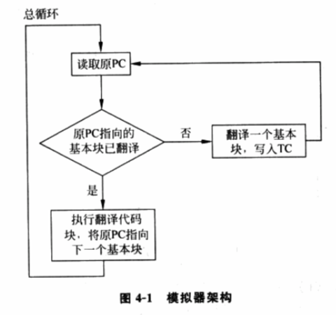
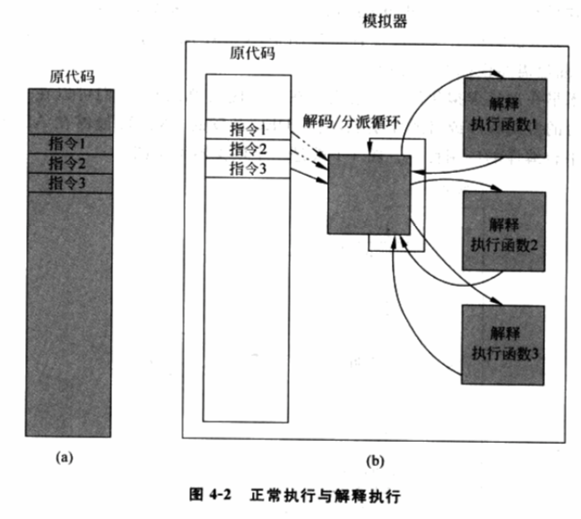
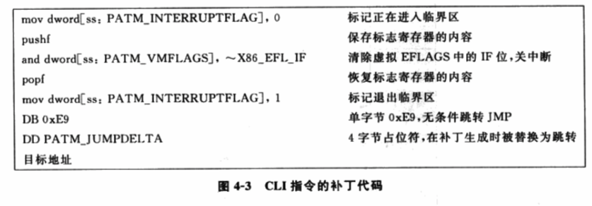
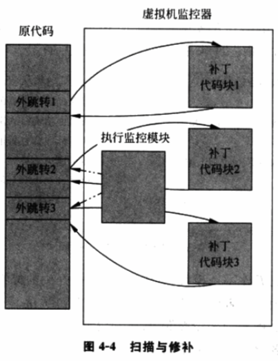
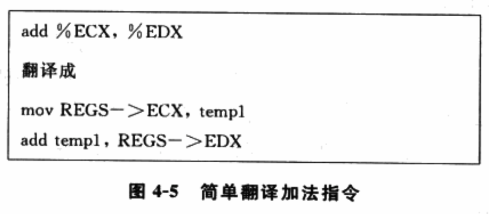
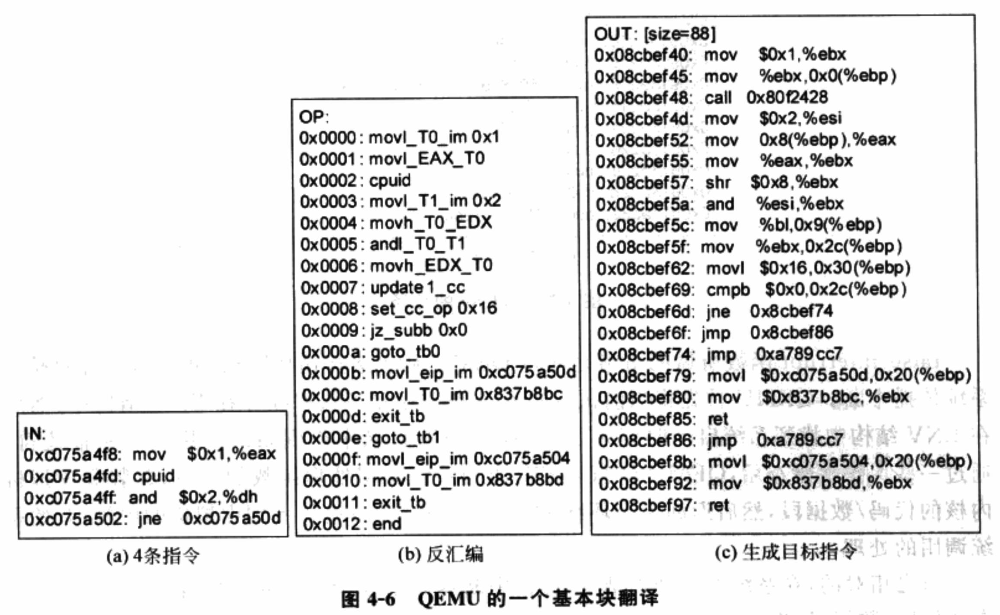
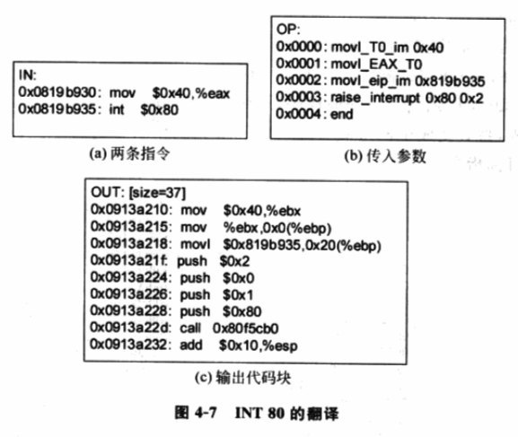
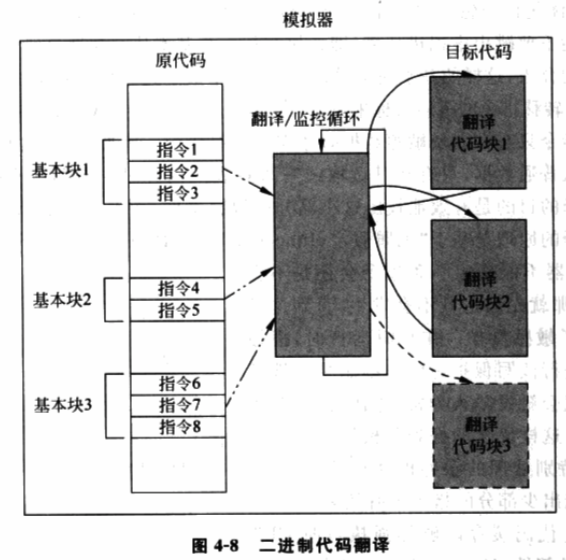

# 背景

由于**硬件体系结构**在**虚拟化方面设计的缺陷**, 导致前面说的**虚拟化漏洞**, 系统虚拟化因此**不能直接有效地实现**.

为弥补虚拟化漏洞, 在**硬件还未提供足够的支持之前**, 基于**软件的虚拟化技术**就已经先给出了两种可行的解决方案: **模拟执行**和**直接源代码改写**.

**模拟执行**对应的就是**基于软件的完全虚拟化技术**, **直接源代码改写**对应的类虚拟化技术, 将在第 6 章介绍.

我们知道, **所有的虚拟化形式**都可以**通过模拟**来实现. **解释执行**就是最简单最直接的**模拟实现方式**, 取一条指令出来, 模拟出这条指令执行的效果, 再继续取下一条指令, 从某种程度上解决了陷入再模拟, 也避免了虚拟化漏洞.

**模拟技术**通常可以用在**不同体系结构的虚拟化**中, 也就是在一种硬件体系结构上模拟另一个不同硬件体系结构的运行环境.

而在**同一个体系结构**的模拟中, 情况会变得更容易, 因为**大多数指令**是可以**不需要被模拟执行**而**直接放在真实的硬件**上执行, 于是一条指令再一条指令地解释执行在这里就没有必要了. 可以采用改进的**代码扫描与修补(Scan\-and\-patch)技术**和**二进制代码翻译技术**, 尽可能提高虚拟化的性能.

# 概述

对于传统的虚拟化漏洞, 在**硬件设计对此问题改进前**, 一些模拟技术已经先被使用来弥补这个漏洞, 提供平台虚拟化的能力. 可以说, 基于软件的 CPU 完全虚拟化, 其本质就是软件模拟. 所有的虚拟化的形式都可以用模拟来实现, 模拟的强大之处在于, VMM 可以将虚拟机的整个执行过程置于控制中, VMM 执行每一条指令都有时机进行模拟, 进而不会漏过需要模拟的敏感指令.

模拟技术早在现代虚拟化诞生之前就存在. 使用模拟器, 人们可以在一种平台上运行另一种平台的应用程序或操作系统, 例如 DEC 开发的 FX!32 能在 ALPHA 平台运行 x86 平台编译的应用程序. 图 4\-1 就是一个模拟器架构图.

模拟技术不仅能用于应用程序级模拟, 而且可以用于系统级模拟. 它既能用于不同硬件体系结构间的模拟, 更可以用于相同硬件体系结构的模拟, 只不过在相同硬件体系结构下情况更简单, 这使得产生一些改进技术以提高虚拟化的性能.

# 解释执行

在模拟技术中, 最简单最直接的模拟技术是解释执行, 即取一条指令, 模拟出这条指令执行的效果, 再继续取下一条指令, 周而复始. 由于是一条一条取指令而不会漏掉没一条指令, 在某种程度上即每条指令都"陷入"了, 所以解决了陷入再模拟的问题, 进而避免了虚拟化漏洞. 这种方法不仅适用于模拟与物理机相同体系结构的虚拟机, 而且也适用于模拟与物理机不同体系结构的虚拟机.

图 4\-2(a)所示为代码以正常执行的方式运行, 图 4\-2(b)为虚拟机的代码以解释执行的方式运行. 图中灰色部分表示会被载入物理 CPU 执行的代码, 白色部分表示不会被载入物理 CPU 执行的代码.

- **正常执行**的方式就是最常见的直接在**物理 CPU 上运行编译好的代码**;
- 而在**解释执行**中, **编译好的二进制代码**是不会被载入到物理 CPU 直接运行的, 而是由**解释器逐条解码**, 再**调用对应的函数**来**模拟对应指令的功能**.

虽然这种方法保证了所有指令执行受到 VMM 的监视控制, 然而它对每条指令不会区分对待, 最大缺点就是**性能太差**. 由于这里所说的**虚拟化前提**是模拟**与物理机相同体系结构**的虚拟机, 那么至少有**很多非敏感指令不用模拟**而可以直接在物理 CPU 上运行, 这便诞生了以下两种改进技术.

# 改进技术一: 扫描与修补 (Scan\-and\-patch)

由于解释执行有很大的性能损失, 加上虚拟机中模拟的 CPU 和物理 CPU 体系结构相同, 这样多数指令可以被映射到物理 CPU 上直接运行, 因此, CPU 虚拟化过程中可以采用更优化的模拟技术来弥补虚拟化漏洞.

扫描和修补技术通过这样的方式, 让**大多数指令直接运行在物理 CPU**上, 而把操作系统代码中的**敏感指令**替换为 **跳转指令！！！** 或 **会陷入到 VMM 中去的指令！！！**, 使其**一旦运行到敏感指令**处控制流就会**进入 VMM**中, 由**VMM 代为模拟执行**.

扫描与修补技术的流程如下.

1) **VMM**会在**虚拟机开始执行每段代码之前**对其进行**扫描**, 解析**每一条指令！！！**, 查找到**特权指令**和**敏感指令**.

2) **补丁代码！！！** 会在 VMM 中**动态生成**, 通常**每个需要修补的指令**会对应**一块补丁代码**.

3) **敏感指令**被替换成一个**外跳转(没有特权级切换！！！**), 从**虚拟机跳转到 VMM 的空间**中, 在 VMM 中执行动态生成的补丁代码.

4) 当**补丁代码执行完**后, 执行流再**跳转回虚拟机中的下一条代码**继续执行.

需要注意, 在**补丁比被修补的指令长**的时候, 需要使用更巧妙的方法来完成修补. 例如, 在 x86\-32 中, **一个外跳转指令占 5 个字节！！！**, 比有些特权或敏感指令长. 一个解决方法就是使用**更短的能够引起陷入的指令**, 例如 INT 3 指令等. 在**陷入后**, **VMM**由**陷入发生的地址查表**找出**对应的原指令**, 然后进行模拟. 与外跳转不同, 陷入会引起**特权级切换！！！**, 因而性能开销更大.

图 4\-3 是一个从 VirtualBox 的实际代码中提取出来的补丁代码例子, 它对应的是 Intel IA32 关闭中断指令 CLI, 其中一些非相关的代码已经略去.

可以将这段补丁代码看作一个模板,

扫描与修补原理示意图如图 4\-4.

在图 4\-4 中, **灰色部分**仍然表示会**被载入物理 CPU**执行的代码, **白色**表示**不会被载入物理 CPU**执行的代码. 除了**一些敏感指令**被 VMM 替换成了**外跳转**外, **其它指令都能直接被物理 CPU 载入运行**. 对于那些被打上补丁的地方, 外跳转将执行流转到了对应的补丁代码块, 从而模拟该指令的功能. **执行监控模块**负责**动态**将要执行的**原代码块进行扫描**, 找到需要打补丁的地方打补丁, 并生成相应的补丁代码块.

值得一提的是, **补丁代码块**存放在**VMM 内存空间**的**代码缓存**中. 由于缓存**容量有限,** 所以随着虚拟机的运行, **缓存会被填满**, **有些补丁代码块**可能会**被逐出缓存**. 所以 VMM 中会记录一个 PC 到补丁代码块的对应关系(下面称为**PC\-补丁代码对**). 当**补丁代码块生成**的时候, VMM 会记录下这个 PC\-补丁代码对; 当补丁代码**被逐出缓存**时, 这个 PC\-补丁代码对也会**从相应记录中删除**. 这样, VMM 只需要查找记录就能知道哪些 PC 对应的指令已经生成过补丁代码了, 并且这些补丁代码块现在还存在代码缓存中.

在扫描与修补技术中, 异常的处理也相对比较简单. 由于指令

扫描与修补技术实现相对简单, 在扫描与修补技术中, 大多数客户机操作系统和用户代码可以直接在物理 CPU 上运行, 其性能损失也相对较小. 当然, 扫描与修补技术也有其缺点.

1) 由于特权指令和敏感指令都被模拟执行, 各条指令的模拟执行时间可能会很短, 但也可能会很长.

2) 由于每个补丁都引入了额外的跳转, 这些跳转回降低代码的局部性.

3) 由于扫描与修补技术**直接在虚拟机内存中进行代码修补**, 其必须维护一份与补丁对应的**原始代码的备份**, 以便**在需要时将代码恢复原状**.

# 改进技术二: 二进制代码翻译 (BT)

为更好提升性能, 更为复杂的代码缓冲区技术也被用到了模拟技术中. **二进制代码翻译技术(BT 技术**)在**VMM**中开辟**一块代码缓存**, 将代码翻译好放在其中. 这样, **客户机 OS 代码**并**不会直接被物理 CPU 执行**, **所有要被执行的代码**都会在**代码缓存**中. 相比较而言, BT 技术最为复杂, 其在性能上同 "扫描与修补技术" 各有长短.

## 基本概念

首先, 先了解一些基本概念.

在**编译理论**中, **基本块**是一个重要的概念, 它表示**只有一个入口和一个出口的代码块**, 即在这块代码只能从头进入, 从尾退出. 既不会有外界跳转跳入到代码块中间的某个地方, 也不会有代码块中间某个地方有外界跳转跳出改代码块. 这里, 基本块可以认为是**静态基本块**.

BT 技术的**动态翻译**也是以基本块为单位的, 称为**动态基本块**.

与编译器不同的是, **编译器**在**静态能够得到的源代码信息**是**不包含在编译生成的二进制代码！！！中**的, 因而在**运行时**是**无法获得这种源代码信息**的. 例如, **源代码**中的**跳转标签**在**基本块分析**会被作为**划分基本块的分界**, 因为**标签**所在位置是一个**可能的调整入口**.

但是, 在**动态运行**时, **二进制代码中**是**不包含这种信息**的, 所以, **动态划分基本块**时能准确找到出口, 但会**遗漏一些入口！！！**. 基于这种原因, **动态基本块可能会比静态基本块要大一些**.

例如, Fedora 6 系统在**QEMU\-0.9.1**上启动时, 整个过程进行了 1 322 514 次基本块翻译, 在 VMware 上启动和关闭 64 位的 Windows XP 专业版共翻译了 259 936 个基本块.

BT 技术将**源代码**以**基本块为粒度**翻译代码, 模拟器**动态地**、**按需要**地 **读入二进制代码！！！** 进行**翻译**, 将**翻译好的目标代码**存放在**模拟器开辟**的**内存空间**中, 这块空间被称为**代码缓存(translation cache**). 这与扫描与修补技术的代码缓存概念类似. 同样, 由于代码缓存是在**模拟器的内存空间分配**的, 因此其容量是有限的, 在代码缓存用满时, 部分缓存就需要被释放出来, 因此, 一个好的管理策略是很重要的.

**源代码中的指令**与**翻译后的代码**用某种**映射关系联系起来**, 例如, 最常用的是哈希表, 即由**源代码的 PC 值**通过哈希函数计算查表得到其在代码缓存区中的位置. 如果一个 PC 没有找到对应的表项, 表示这块代码还未被翻译, 或者在释放缓存空间时已被清理.

最后, 介绍一下什么是翻译. 模拟器对于读入的二进制代码不作限制, 它们可以是应用程序代码, 也可以是操作系统内核代码. 读入的二进制代码可能包含所有的 x86 体系结构的指令, 模拟器将其翻译输出为 x86 指令的一个安全的子集, 即其中不包含特权指令和敏感指令, 能够运行在内核态.

在原体系结构和目标体系结构相同的情况下, 模拟器翻译方法大致可以分为两种: **简单翻译**和**等值翻译**. 简单翻译比较直接, 但指令数量会大大膨胀; 等值翻译相对高效, 但动态分析比前者困难. 例如, **QEMU**使用的是一种**简单指令模板！！！** 来进行翻译. 图 4\-5 给出一个例子, 其目的是用加法指令将寄存器 ECX 和 EDX 相加并存入 EDX 中.

经简单翻译后, 可以看到, REGS 结构是模拟器中为每个虚拟 CPU 维护的一个数据结构, 存有虚拟 CPU 所有寄存器的值, 即相当于包含所有虚拟寄存器. 在目标代码生成时, 上面 REGS 会被替换成这个数据结构中内存中的地址, 而 temp1 会用一个寄存器替换.

在**同硬件体系结构**的模拟中, **很多指令是可以等值翻译**的, 即**原代码和目标代码一样(！！！不修改**. 理论上, 大多数指令是可以等值翻译的, 除了以下几种例外.

1) PC 相对寻址的指令.

2) 直接控制转换.

3) 间接控制转换.

4) 特权指令.

这里再提一下, 在同体系结构下, 等值翻译的一个潜在前提是虚拟机执行的代码可能会用到所有 CPU 寄存器. 因而, 在从模拟器运行时环境和虚拟机环境之间切换时, 所有寄存器的内容都需要有一次切换. 为了让虚拟机能够从模拟环境中跳到模拟器环境中, 虚拟机需要用一个寄存器来存放跳转的目标地址, 这个寄存器可以是暂时不再被使用的寄存器, 也可以把一个寄存器的值临时保存到栈上以腾出空间.

## 基于 BT 技术的 CPU 虚拟化

以**QEMU**为例说明.

首先说明, 在 QEMU 中, 它为**每个虚拟 CPU**都维护了一个**数据结构 ENV**, 它保存的是当前虚拟 CPU 的运行环境, 包括各种寄存器的参数和值.

图 4\-6 是**QEMU 翻译一个 Linux 基本块的过程**.

- 图中的**4 条指令是一个基本块**, 是**QEMU**通过**反汇编原代码**(二进制代码), 解码得到的**x86 指令**.

- 然后, QEMU**逐条指令！！！**地**套用翻译模板！！！**, 将其变为**中间形式**.

- 在对中间形式的伪指令进行优化后, QEMU 最终将其生成目标指令.

其中, **敏感指令 CPUID**翻译后再目标代码中生成了一个**函数调用**. 这个函数是 QEMU 在**用户空间**的一个**辅助函数 helper\_cpuid**. 它所做的事情就是**根据虚拟 CPU 的配置**, **将返回信息填好**, 模拟出 CPUID 指令的执行效果. 整个过程在**用户态**就能完成.

对于如**INT \$0x80**这样的**系统调用**, 是**不能在一个 QEMU 的辅助函数**中完成模拟的, 它的翻译过程略显不同. 在**虚拟机启动**时候, **初始化 IDT 表**的方法**不会直接修改到硬件的 IDT 表**, 而是会**修改 ENV 结构中虚拟的 IDT 数据结构**. 这个数据结构会被 QEMU 用于查找虚拟机操作系统的中断或异常处理函数的入口, 以及其权限设置等.

如图 4\-7 所示, **输入代码块**中的**INT \$0x80 指令**被翻译为**两条指令**. 一条是将**发生中断的 EIP**保存在**ENV 环境变量**中, 然后调用**raise\_interrupt 函数**, 并传入**两个参数**, 前一个参数**0x80**指示的是**当前中断的中断号**, 后一个参数**0x2**表示的是**INT 指令的长度**. QEMU 能用这个值计算出**下一条指令所在的 EIP**.

在**输出代码块**中, 中间形式的**伪代码被逐条翻译成 x86 指令**, **寄存器**和**虚拟机地址**也都在这步被分配和确定.

**raise\_interrupt 函数**做的事情是使得 QEMU 从主运行循环跳出, 并**向虚拟机的 OS 传播中断**. QEMU 首先将当前执行的 EIP 和寄存器等状态保存在 ENV 结构中, 然后在 ENV 结构中找到系统启动时记录下的 IDT 表的值, 从中得到系统调用的中断描述符. 通过一些保护性检查后, **QEMU**将**当前 EIP**指向**系统调用处理函数入口**, 并**装载虚拟机的内核的代码/数据段！！！**, 然后**返回主循环继续执行**. 这样, 执行就**转入到虚拟机的内核**, 开始**系统调用的处理**.

与之相对的, 在**系统调用处理结束后**, **中断返回指令**会执行相反的操作, 即**载入用户态的代码/数据段**, 恢复用户态的寄存器的值, 返回到中断指令的下一条指令继续运行.

除了系统调用外, 其它虚拟机主动地陷入也是类似处理的, 例如 x86 的 INT 3 和 into 等.

对于异常(Fault)和外部中断的处理和系统调用比较类似. 不同在于, QEMU 从宿主机得到中断和异常的信号. 例如, 缺页异常是先由宿主机收到并处理的, 宿主机会通过发送信号将异常通知 QEMU 进程. QEMU 进程的执行被打断, 转而执行信号处理函数. 信号处理函数会用类似方法将中断或异常向上传输给客户机 OS. 另一个不同是, 在**结束外部中断或异常的处理**后, QEMU 返回到**用户态被中断的那条指令继续执行**, 而不是被中断的指令的下一条指令.

可以总结下, BT 技术在**VMM 中开辟一块代码缓存**, 将**代码翻译好放在其中**. **原始的客户机 OS 代码**并不会直接被物理 CPU 执行, 它们以**基本块的形式组织**, 模拟器**先将即将执行的基本块翻译成目标代码块**, 再**转入目标代码块执行**, 再翻译接下来要执行的原始基本块, 如图.

## BT 技术的难点

## BT 技术的优化

