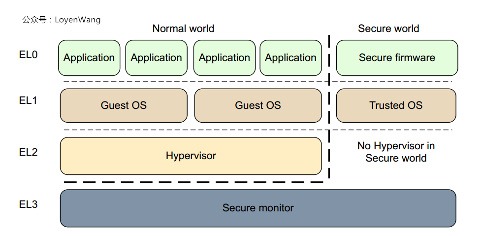

<!-- @import "[TOC]" {cmd="toc" depthFrom=1 depthTo=6 orderedList=false} -->

<!-- code_chunk_output -->

- [1. 概述](#1-概述)
  - [1.1. VT-x 两种工作模式](#11-vt-x-两种工作模式)
  - [1.2. VMCS 保存虚拟 CPU 相关状态](#12-vmcs-保存虚拟-cpu-相关状态)
  - [1.3. 新的指令](#13-新的指令)
  - [1.4. CPU 硬件以及 BIOS 设置](#14-cpu-硬件以及-bios-设置)
    - [1.4.1. VT](#141-vt)
    - [1.4.2. VT-d](#142-vt-d)
    - [1.4.3. BIOS 设置](#143-bios-设置)
    - [1.4.4. 系统检查](#144-系统检查)
- [2. VMCS](#2-vmcs)
  - [2.1. 定义](#21-定义)
  - [2.2. VMCS 的绑定与解绑](#22-vmcs-的绑定与解绑)
  - [2.3. VMCS 的迁移](#23-vmcs-的迁移)
  - [2.4. VMCS 的格式和内容](#24-vmcs-的格式和内容)
    - [2.4.1. VMCS 数据域](#241-vmcs-数据域)
      - [2.4.1.1. 客户机状态域](#2411-客户机状态域)
      - [2.4.1.2. 宿主机状态域](#2412-宿主机状态域)
- [3. VMX 操作模式开关指令](#3-vmx-操作模式开关指令)
- [4. VM-Entry](#4-vm-entry)
  - [4.1. VM-Entry 指令](#41-vm-entry-指令)
    - [4.1.1. VM-Entry 控制域](#411-vm-entry-控制域)
      - [4.1.1.1. 事件注入控制](#4111-事件注入控制)
  - [4.2. VM-Entry 的过程](#42-vm-entry-的过程)
- [5. VM-Exit](#5-vm-exit)
  - [5.1. 非根模式下的敏感指令](#51-非根模式下的敏感指令)
  - [5.2. VM-Execution 控制域](#52-vm-execution-控制域)
  - [5.3. VM-Exit 控制域](#53-vm-exit-控制域)
  - [5.4. VM-Exit 信息域](#54-vm-exit-信息域)
  - [5.5. VM-Exit 的具体过程](#55-vm-exit-的具体过程)
- [6. AMD SVM](#6-amd-svm)
  - [6.1. 两种操作模式](#61-两种操作模式)
  - [6.2. VMCB](#62-vmcb)
  - [6.3. 新的指令](#63-新的指令)
- [ARM](#arm)
  - [ARMv7 的处理器模式](#armv7-的处理器模式)
  - [ARMv8 的 EL](#armv8-的-el)

<!-- /code_chunk_output -->

# 1. 概述

Intel 平台机制名叫 `VT-x`. VT-x 基本思想如图 5-2.

## 1.1. VT-x 两种工作模式

首先, VT-x 引入了两种操作模式, 统称 VMX 操作模式.

- 根操作模式(VMX Root Operation): VMM 运行所处的模式, 简称根模式.

- 非根操作模式(VMX Non-Root Operation): 客户机运行所处的模式, 简称非根模式.


每种操作模式都有相应的特权级 0 ~ 特权级 3 特权级. 故在 VT-x 情况下, 描述程序运行在某个特权级, 必须指出当前处于根模式还是非根模式.

- **软件虚拟化**中, 指令的虚拟化是通过"陷入再模拟"的方式实现, 而 IA32 架构有 19 条敏感指令不能通过这种方式处理, 导致**虚拟化漏洞**. 最直接方式就是使这些敏感指令能够触发异常. 可惜这种方式会**改变这些指令的语义**, 导致与原有软件**不兼容**.

- **引入新模式**可以很好解决. **非根模式**下**所有敏感指令**(包括 19 条**不能被虚拟化的敏感指令**)行为都被**重新定义**, 使得它们能不经虚拟化就直接运行或通过"陷入再模拟"方式来处理; 在根模式下, 所有指令的行为和传统 IA32 一样, 没有改变.

VT-x 中, **非根模式**下**敏感指令**引起的"**陷入**"被称为 **VM-Exit**. VM-Exit 发生时, **CPU 自动！！！**从**非根模式**切换成**根模式**. 相应地, **VT-x**也定义了**VM-Entry**, 该操作由**VMM 发起**, 通常是**调度某个客户机运行**, 此时**CPU**从**根模式**切换成**非根模式**.

## 1.2. VMCS 保存虚拟 CPU 相关状态

其次, 为更好支持 CPU 虚拟化, VT-x 引入了**VMCS(Virtual-Machine Control Structure, 虚拟机控制结构**). VMCS 保存**虚拟 CPU 需要的相关状态**, 例如 CPU 在根模式和非根模式下的特权寄存器的值.

**VMCS 主要供 CPU 使用**, CPU 在发生**VM-Exit**和**VM-Entry**时都会**自动查询和更新 VMCS**.

VMM 可以**通过指令来配置 VMCS！！！**, 进而**影响 CPU 的行为！！！**.

## 1.3. 新的指令

最后, **VT-x**还引入了一组**新的指令**, 包括 **VMLAUCH/VMRESUME** 用于发起 **VM-Entry**, **VMREAD/VMWRITE** 用于配置 **VMCS** 等.

## 1.4. CPU 硬件以及 BIOS 设置

### 1.4.1. VT

首先**处理器(CPU**)要在**硬件上支持 VT**技术, 还要在**BIOS**中将其**功能打开**, KVM 才能使用到. 目前, 多数流行的服务器和部分桌面处理器的 BIOS 都默认将 VT 打开了.

在**BIOS**中, VT 的选项通过"Advanced -> Processor Configuration"来查看和设置, 它的标识通常为"**Intel(R)Virtualization Technology**"或"**Intel VT**"等类似的文字说明.

### 1.4.2. VT-d

除了支持必需的处理器虚拟化扩展以外, 如果服务器芯片还支持**VT-d(Virtualization Technology for Directed I/O**), 建议在 BIOS 中将其打开, 因为后面一些相对高级的设备的直接分配功能会需要硬件 VT-d 技术的支持. VT-d 是对设备 I/O 的虚拟化硬件支持, 在 BIOS 中的位置可能为"Advanced -> Processor Configuration"或"Advanced -> System Agent(SA)Configuration", 它在 BIOS 中的标志一般为"**Intel(R)VT for Directed I/O**"或"**Intel VT-d**".

### 1.4.3. BIOS 设置

下面以一台 Intel Haswell-UP 平台的服务器为例, 来说明在 BIOS 中的设置.

BIOS 中 Enabled 的 VT 和 VT-d 选项, 如图 3-2 所示.


对于不同平台或不同厂商的 BIOS, VT 和 VT-d 等设置的位置可能是不一样的, 需要根据实际的硬件情况和 BIOS 中的选项来灵活设置.

### 1.4.4. 系统检查

设置好了 VT 和 VT-d 的相关选项, 保存 BIOS 的设置并退出, 系统重启后生效. 在 Linux 系统中, 可以通过检查/proc/cpuinfo 文件中的 CPU 特性标志(flags)来查看 CPU 目前是否支持硬件虚拟化.

在 x86 和 x86-64 平台中, **Intel**系列**CPU 支持虚拟化**的标志为"**vmx**", **AMD**系列 CPU 的标志为"**svm**".

所以可以用以下命令行查看"vmx"或者"svm"标志:

```
[root@kvm-host ~]# grep -E "svm|vmx" /proc/cpuinfo
```

如果查找到了 vmx 表示你当前的 CPU 是支持虚拟化功能的, 但是**不代表**你现在的**VT 功能是开启**的.

# 2. VMCS

Guest Exit 的时候, 会将当前 Guest 的上下文保存到 VMCS 中, Guest entry 的时候把 VMCS 上下文恢复到 VMM. VMCS 的操作包括 VMREAD, VMWRITE, VMCLEAR.

VMCS 和软件的完全虚拟化中的虚拟寄存器概念类似, 可以看作是**虚拟寄存器概念**在硬件上的应用. 虚拟寄存器的操作和更改完全由软件执行, 但 VMCS 却主要由 CPU 操作.

## 2.1. 定义

**VMCS**是保存在**内存中的数据结构**, 包含了**虚拟 CPU 的相关寄存器的内容**和**虚拟 CPU 相关的控制信息**.

VMCS 是一个**64 位的指针**, 指向一个**真实的内存地址**, VMCS 是以**vCPU 为单位**的, 就是说当前有**多少个 vCPU**, 就有**多少个 VMCS 指针**.

**VMCS**保存**虚拟机**的**相关 CPU 状态**, **每个 VCPU**都有一个**VMCS**(内存的), **每个物理 CPU**都有**VMCS**对应的**寄存器(物理的**).

- 当 CPU 发生`VM-Entry`时, CPU 则从**VCPU 指定的内存**中**读取 VMCS**加载到**物理 CPU**上执行;

- 当发生`VM-Exit`时, CPU 则将**当前的 CPU 状态**保存到 **VCPU 指定的内存**中, 即 VMCS, 以备下次`VMRESUME`.

`VMLAUCH`指 VM 的**第一次**`VM-Entry`, `VMRESUME`则是 **VMLAUCH 之后**后续的`VM-Entry`.

## 2.2. VMCS 的绑定与解绑

**VMCS**在**使用时需要和物理 CPU 绑定！！！**. 在任意**给定时刻**, **VMCS** 与**物理 CPU** 是一对一绑定的关系(！！！一对一的！！！). **VMCS** 在**不同的时刻**可以**绑定到不同的物理 CPU！！！**, 例如在某个 VMCS 先和物理 CPU1 绑定, 并在某个时刻解除绑定关系, 并重新绑定到物理 CPU2. 这种绑定关系的变化称为 VMCS 的"迁移(Migration)".

VT-x 提供了两条指令用于**VMCS 的绑定与解绑**.

- **VMPTRLD** <VMCS 地址>: 将指定的 VMCS 与**执行该指令的物理 CPU 绑定**.
- **VMCLEAR**: 将**执行该指令的物理 CPU**与它的**VMCS 解绑**. 该指令会将**物理 CPU 缓存中的 VMCS 结构**同步到**内存**中去, 从而保证**VMCS**和**新的物理 CPU 绑定**时, 内存中的值是最新的.

## 2.3. VMCS 的迁移

**VMCS 一次迁移**过程如下.

1) 在**CPU1**上执行**VMCLEAR**, 解绑

2) 在**CPU2**上执行**VMPTRLD**, 新绑定.

## 2.4. VMCS 的格式和内容

VT-x 定义了**VMCS 的具体格式和内容**. 规定它是一个**最大不超过 4KB 的内存块**, 并要求**4KB 对齐**. 描述了 VMCS 的格式, 各域描述如下.

1) **偏移 0**是 VMCS**版本标识**, 表示 VMCS 数据格式的版本号

2) **偏移 4**是**VMX 中止指示**, **VM-Exit**执行**不成功！！！**时产生**VMX 中止**, CPU 会在此处存放**VMX 中止的原因**, 以便调试

3) **偏移 8**处是**VMCS 数据域**, 该域的格式是**CPU 相关**的, 不同型号 CPU 可能使用不同格式, 具体格式由**VMCS 版本标识确定！！！**.

VMCS 块格式如表 5-1 所示.


### 2.4.1. VMCS 数据域

VMCS 主要信息存放在"**VMCS 数据域**"中, VT-x 提供了**两条指令**用于**访问 VMCS**.

- VMREAD <索引>: 读 VMCS 中"索引"指定的域
- VMWRITE <索引> <数据>: 写 VMCS 中"索引"指定的域.

VT-x 为**VMCS 数据域**中**每个字段**也定义了**相应的"索引**", 故通过上述两条指令也可以直接访问**VMCS 数据域**中的**各个域**.

具体而言, **VMCS 数据域**包含下列**6 大类信息**.

1) **客户机状态域**: 保存**客户机运行**时, 即**非根模式时的 CPU 状态**.

- 当**VM-Exit**发生时, **CPU**自动把**当前状态**存入**客户机状态域**;
- 当**VM-Entry**发生, **CPU**自动从**客户机状态域恢复状态**.

2) **宿主机状态域**: 保存**VMM 运行**时, 即**根模式时的 CPU 状态**. 当**VM-Exit**发生, CPU 从**该域恢复 CPU 状态**.

3) **VM-Entry 控制域**: 控制**VM-Entry 的过程**.

4) **VM-Execution 控制域**: 控制处理器在**VMX 非根模式**下的行为.

5) **VM-Exit 信息域**: 提供**VM-Exit 原因**和其他信息. 这是**只读**的.

6) **VM-Exit 控制域**: 控制 VM-Exit 的过程.

先介绍客户机状态域和宿主机状态域.

#### 2.4.1.1. 客户机状态域

VMCS Guest-state区域数据:


- 当 **VM-Exit！！！** 发生时, CPU**自动**把**当前 CPU 状态**存入**客户机状态域**;

- 当 **VM-Entry！！！** 发生, CPU**自动**将**客户机状态域**保存的状态加载到**CPU**中.

客户机状态域中首先包含一些**寄存器的值**, 这些寄存器是**必须由 CPU 进行切换**的, 如段寄存器、CR3、IDTR 和 GDTR. CPU 通过**这些寄存器的切换**来实现**客户机地址空间**和**VMM 地址空间的切换(！！！**).

客户机状态域**不包含通用寄存器和浮点寄存器！！！**, 它们的**保存和恢复由 VMM 决定！！！**, 可提高效率和增强灵活性(可见 6.3.3 节关于上下文切换的三个例子).

客户机状态域包含寄存器如下.

1) 控制寄存器 CR0、CR3 和 CR4

2) 调试寄存器 DR7

3) RSP、RIP 和 RFLAGES

4) CS、SS、DS、ES、FS、GS、LDTR、TR 及影子段描述符寄存器

5) GDTR、IDTR 及影子段描述符寄存器

除了上述寄存器外, 客户机状态域中还包含了一些**MSR 内容**. 这些 MSR 既可以由**处理器进行切换！！！**, 也可以**由 VMM 进行切换！！！**. 由**谁切换**, 可以通过**VMCS 的一些控制域设定！！！**. 这些 MSR 包括**IA32\_SYSENTR\_CS**、**IA32\_SYSENTR\_ESP**和**IA32\_SYSENTR\_EIP**等.

除此, 还包含了一些非**寄存器内容**, 主要用于**精确模拟虚拟 CPU**, 例如**中断状态域等**.

#### 2.4.1.2. 宿主机状态域

保存**CPU**在**根模式**下**运行时的 CPU 状态**.

VMCS Host-state区域数据:


只在**VM-Exit 时被恢复！！！**, 在**VM-Entry 时不用保存！！！**.

因为宿主机是根模式下的 CPU 状态, 根模式下 VMM 有最大的权限, 随时可以修改; 而非根模式本身无权直接修改这个域

- **宿主机状态域内容通常几乎不需要改变！！！**, 例如 **VM-Exit 的入口 RIP！！！** 在 **VMM 整个运行期间都是不变！！！** 的.
- 当**需要改变**时, **VMM**可以直接**对该域进行修改！！！**, VMCS 是保存在内存中的.

只包含寄存器值, 具体如下.

1) 控制寄存器 CR0、CR3 和 CR4

2) 调试寄存器 DR7

3) RSP、RIP 和 EFLAGES

4) CS、SS、DS、ES、FS、GS、TR 及影子段描述符寄存器

5) GDTR、IDTR 及影子段描述符寄存器

6) IA32\_SYSENTR\_CS

7) IA32\_SYSENTR\_ESP

8) IA32\_SYSENTR\_EIP

与客户机状态域相比, **宿主机状态域没有 LDTR**, 正如 OS 内核通常不使用 LDT 一样, **VMM 只需要使用 GDT！！！** 就够了.

此外, 当**VM-Exit 发生**时, **宿主机状态域**中的**CS:RIP**指定了**VM-Exit 的入口地址！！！**, **SS**、**RSP**指定了**VMM 的栈地址！！！**.

# 3. VMX 操作模式开关指令

**默认**情况下, **VMX 操作模式是关闭**的. 当需要使用这个功能时, 可以使用 VT-x 提供的新指令来打开与关闭这个功能, 参见图 5-3.

- **VMXON**: 打开 VMX 操作模式, CPU 就处于 VMX 根模式
- **VMXOFF**: 关闭 VMX 操作模式, CPU 退出 VMX 根模式

描述了开启/关闭 VMX 的过程, 以及 VMX 开启情况, VMM 和客户软件的交互操作.

1) **VMM**执行**VMXON**指令进行到**VMX 操作模式**, CPU 处于**VMX 根操作模式**, VMM 软件开始执行.

2) **VMM**执行**VMLAUNCH**或**VMRESUME**指令产生**VM-Entry**, **客户机软件**开始执行, 此时**CPU 进入非根模式**.

3) 当**客户机执行特权指令**, 或当**客户机**运行时发生**中断或异常**, **VM-Exit 被触发**而**陷入到 VMM**, CPU 切换到**根模式**. VMM 根据**VM-Exit 的原因**做相应处理, 然后转到步骤⓶**继续运行客户机**.

4) 如果**VMM 决定退出！！！**, 则执行**VMXOFF 关闭**VMX 操作模式.

# 4. VM-Entry

**VMM**在机器加电引导后, 会进行一些初始化工作, 并在**准备就绪**时通过**VMXON 指令**进入**根模式**.

在**创建虚拟机**时, VMM 会通过**VMLAUNCH**或**VMRESUME**指令切换到**非根模式**运行客户机, 客户机引起 VM-Exit 后又切换回根模式运行 VMM

## 4.1. VM-Entry 指令

VM-Entry 是指 CPU 由根模式切换到非根模式, 从软件角度, 指**CPU**从**VMM 切换到客户机执行**. 这个操作通常由**VMM 主动发起！！！**.

**发起之前！！！**, VMM 会设置好**VMCS 相关域的内容！！！**, 例如客户机状态域、宿主机状态域等, 然后执行 VM-Entry 指令.

VT-x 为**VM-Entry**提供了**两个指令！！！**.

- **VMLAUNCH**: 用于刚执行过**VMCLEAER！！！的 VMCS**的**第一次 VM-Entry**.
- **VMRESUME**: 用于**执行过 VMLAUNCH！！！**的 VMCS 的**后续 VM-Entry**.

`VM-Entry`附带**参数主要有 3 个**:

1. guest 是否处于 64bit 模式,
2. `MSR VM-Entry`控制,
3. **注入事件**.

1 应该**只在 VMLAUCH 有意义**, 3 更多是在**VMRESUME**, 而 VMM 发起`VM-Entry`更多是因为 3, 2 主要用来**每次更新 MSR**.

第一次启动 Guest, 通过 VMLAUNCH 指令加载 Guest, 这时候一切都是新的, 比如说起始的 rip 寄存器等.  后续 Guest exit 后再 entry, 是通过 VMRESUME 指令, 此指令会将 VMCS 所指向的内容加载到当前 Guest 的上下文,  以便 Guest 继续执行.

### 4.1.1. VM-Entry 控制域

VM Entry control区域:


**VM-Entry 的具体行为！！！** 是由 **VM-Entry 控制域！！！** 规定, 该域的具体定义定义如表 5-2.


#### 4.1.1.1. 事件注入控制

VM-Entry 控制域中的"**事件注入控制**"用到了**VM-Entry Interruption-Information 字段！！！**, 表 5-3 列出了**该字段的格式**.

**每次 VM-Entry 时**, 在**切换到客户机环境后**即**执行客户机指令前！！！**, CPU 会检查这个 32 位字段的最高位(即**bit 31**).

如果为**1**, 则根据**bit[10: 8**]指定的**中断类型**和**bit 7:0**指定的**向量号**在当前的客户机中引发一个**异常、中断或 NMI**.

此外, 如果**bit 11 为 1**, 表示要注入的事件有一个错误码(如 Page Fault 事件), **错误码**由另一个**VMCS 的寄存器！！！VM-Entry exception error code**指定.

注入的事件最终是用 **客户机自己的 IDT！！！里面指定的处理函数！！！** 来处理.

这样, 在**客户机虚拟 CPU**看来, 这些事件就和没有虚拟化的环境里面对应的事件没有任何区别.


## 4.2. VM-Entry 的过程

当 CPU 执行**VMLAUNCH/VMRESUM**E 进行 VM-Entry 时, 处理器要进行下面步骤.

1) 执行**基本的检查**来确保 VM-Entry 能开始

2) 对**VMCS**中的**宿主机状态域**的有效性进行**检查**, 以确保**下一次 VM-Exit 发生时**可以正确地从**客户机**环境切换到**VMM**环境

3) 检查**VMCS**中**客户机状态域**的有效性; 根据 VMCS 中客户机状态区域来装载处理器的状态

4) 根据 VMCS 中**VM-Entry MSR-Load 区域**装载 MSR 寄存器

5) 根据 VMCS 中 VM-Entry**事件注入控制的配置**, 可能需要**注入一个事件**到客户机中

# 5. VM-Exit

指 CPU 从非根模式切换到根模式, 从**客户机切换到 VMM**的操作.

引发 VM-Exit 原因很多, 例如非根模式执行**敏感指令**、**中断**等. 处理 VM-Exit 事件是 VMM 模拟指令、虚拟特权资源的一大任务.

## 5.1. 非根模式下的敏感指令

当成功执行 VM-Entry 后, CPU 就进入非根模式. **敏感指令**运行在**VMX 非根模式**, 其**行为会发生变化**. 具体有三种可能.

1) **行为不变化**, 但**不引起 VM-Exit**: 意味着虽然是敏感指令, 但它**不需要被 VMM 截获和模拟**, 例如 SYSENTER 指令.

2) **行为变化**, 产生**VM-Exit**: 典型的需要截获并模拟的敏感指令

3) **行为变化**, 产生**VM-Exit 可控**: 这类敏感指令**是否产生 VM-Exi**t, 可以通过**VM-Execution 域控制！！！**. 出于优化目的, VMM 可以让**某些敏感指令不产生 VM-Exit！！！**, 以减少模式切换带来的**上下文开销**.

VT-x 技术实现的 VMM, 并不需要对所有敏感指令进行模拟, 大大减少了 VMM 实现的复杂性. VM-Execution 域的存在又为 VMM 的实现带来了灵活性.

根据 Intel 的官方文档, 我们这里列举部分在非根模式下会导致"VM Exit"的敏感指令和一些异常供读者朋友参考, 这对于理解 KVM 的执行机制是必要的, 因为 KVM 也必须按照 CPU 的硬件规范来实现虚拟化软件逻辑.

1) 一定会导致 VM Exit 的指令: CPUID、GETSEC、INVD、XSETBV 等, 以及 VMX 模式引入的 INVEPT、INVVPID、VMCALL、VMCLEAR、VMLAUNCH、VMPTRLD、VMPTRST、VMRESUME、VMXOFF、VMXON 等.

2) 在一定的设置条件下会导致 VM Exit 的指令: CLTS、HLT、IN、OUT、INVLPG、INVPCID、LGDT、LMSW、MONITOR、MOV from CR3、MOV to CR3、MWAIT、MWAIT、RDMSR、RWMSR、VMREAD、VMWRITE、RDRAND、RDTSC、XSAVES、XRSTORS 等. 如在处理器的虚拟机执行控制寄存器中的"HLT exiting"比特位被置为 1 时, HLT 的执行就会导致 VM Exit.

3) 可能会导致 VM Exit 的事件: 一些异常、三次故障(Triple fault)、外部中断、不可屏蔽中断(NMI)、INIT 信号、系统管理中断(SMI)等. 如在虚拟机执行控制寄存器中的"NMI exiting"比特位被置为 1 时, 不可屏蔽中断就会导致 VM Exit.

## 5.2. VM-Execution 控制域

VM-execution control区域:


用来控制**CPU**在 **非根模式运行时！！！** 的行为, 根据虚拟机的实际应用, VMM 可以通过配置 VM-Execution 控制域达到性能优化目的.

VM-Execution 控制域主要控制三个方面.

1) 控制**某条敏感指令**是否产生**VM-Exit！！！**, 如果产生 VM-Exit, 由 VMM 模拟该指令.

2) 在**某些敏感指令不产生 VM-Exit**时, **控制该指令的行为**.

3) **异常和中断**是否产生了**VM-Exit**.

表 5-4 列举了典型的 VM-Execution 控制域


## 5.3. VM-Exit 控制域

VM Exit control区域:


规定了**VM-Exit 发生时 CPU 的行为**.


## 5.4. VM-Exit 信息域

VMM 除了要通过 VM-Exit 控制域来控制 VM-Exit 的行为外, 还需要知道**VM-Exit 的相关信息(如退出原因**).

VM Exit信息区域:


VM-Exit 信息域满足了这个要求, 其**提供的信息**可分为如下四类.

(1) **基本的 VM-Exit 信息**, 包括

1) Exit Reason: 提供了 VM-Exit 的**基本原因**(如表 5-6)


2) Exit Qualification: 提供 VM-Exit 的进一步原因. 这个字段根据 VM-Exit 基本退出原因的不同而不同. 例如, 对于因为访问 CR 寄存器导致 VM-Exit, Exit Qualification 提供的信息包括: 是哪个 CR 寄存器、访问类型是读还是写、访问的内容等. 同样, VT-x 规范也完整定义了所有 VM-Exit 退出原因所对应的 Exit Qualification. 对于某些不需要额外信息的退出原因, 没有这个定义.

(2) **事件触发**导致的 VM-Exit 的信息. 事件指**外部中断**、**异常**(包括 INT3/INTO/BOUND/UD2 导致的异常)和**NMI**. 对于此类 VM-Exit, VMM 可以通过**VM-Exit interruption information**字段和 VM-Exit interruption error code 字段获取额外信息, 例如事件类型、事件相关的向量号等.

(3) **事件注入**导致的 VM-Exit 的信息. 一个事件在注入客户机时, 可能由于某种原因暂时不能成功, 而触发 VM-Exit. 此时, VMM 可以从 IDT-vectoring information 字段和 IDT-vectoring error code 中获取此类 VM-Exit 的额外信息, 例如事件类型、事件向量号等.

(4) **执行指令**导致的 VM-Exit 的信息. 除了第一类中列出的信息外, 客户机在执行敏感指令导致 VM-Exit 时, VMCS 中还有三个字段可以提供额外的信息. Guest linear address 字段给出了导致 VM-Exit 指令的客户机线性地址, VM-Exit instruction length 字段给出该指令的长度, VM-Exit instruction information 字段给出了当该指令为 VMX 指令时的额外信息.

## 5.5. VM-Exit 的具体过程

当一个 VM-Exit 发生, 依次执行下列步骤.

1) CPU 首先将此次**VM-Exit 的原因**信息**记录到 VMCS 相应的信息域**中, VM-Entry interruption-information 字段的有效位(bit31)被清零.

2) CPU 状态被保存到**VMCS 客户机状态域**. 根据设置, CPU 也可能将客户机的 MSR 保存到 VM-Exit MSR-store 区域.

3) 根据**VMCS 中宿主机状态域**和**VM-Exit 控制域**中的设置, 将**宿主机状态**加载到**CPU 相应寄存器**. CPU 也可能根据**VM-Exit MSR-store 区域**来加载**VMM 的 MSR**.

4) CPU 由非根模式切换到根模式, 从**宿主机状态域**中**CS:RIP**指定的 VM-Exit 入口函数开始执行.

VMM 处理完 VM-Exit 后, 会通过 VMLANUCH/VMRESUME 指令发起 VM-Entry 进而重新运行客户机.

# 6. AMD SVM

AMD SVM 在处理器上提供了硬件资源, 允许单个机器高效地运行多个操作系统, 并维护安全和资源相互隔离.

AMD 类似机制叫 `AMD-V`

## 6.1. 两种操作模式

与 VT-x 类似, AMD SVM 也引入了根模式和非根模式两种操作模式, 非根模式下的敏感指令引起的"陷入"称为 VM-Exit, VMM 调度某个客户机运行时, CPU 由根模式切换成非根模式称为 VM-Entry.

The CPU flag for AMD-V is "svm". This may be checked in BSD derivatives via dmesg or sysctl and in Linux via /proc/cpuinfo. Instructions in AMD-V include VMRUN, VMLOAD, VMSAVE, CLGI, VMMCALL, INVLPGA, SKINIT, and STGI.

## 6.2. VMCB

AMD SVM 引入了 VMCB(Virtual-Machine Control Block, 虚拟机控制块), 以便更好地支持 CPU 虚拟化.

VMCB 相当于 Intel VT-x 中的 VMCS, 只是
* **VMCS** 由控制区、Guest 状态区和 Host 状态区三部分构成,
* **VMCB** 由控制区、Guest 状态区两部分组成.

SVM 的 Host 状态区需要**手工分配内存**, 并将地址保存在 **VM_HSAVE_PA MSR** 中.

## 6.3. 新的指令

此外, SVM 还引入了一组新的指令, 包括

* VMRUN 用于发起 VM-Entry,

* VMSAVE/VMLOAD 用于配置 VMCB,

* VMMCALL 用于调用 VMM

* STGI/CLGI 用于配置 GIF(Global Interrupt Flag, 全局中断标识)的值.

* SKINIT

* INVLPGA

# ARM

## ARMv7 的处理器模式

* ARMv7之前的架构, 定义了一个处理器的异常处理模式, 比如USR, FIQ, IRQ, SVC, ABT, UND, SYS, HYP, MON等, 各个异常模式所处的特权级不一样, 比如USR模式的特权级就为PL0, 对应为用户态程序运行;

* 处理器的异常模式可以在特权级软件控制下进行主动切换, 比如修改CPSR寄存器, 也可以被动进行异常模式切换, 典型的比如中断来临时切换到IRQ模式;

ARMv7处理器的异常模式如下表所示:


## ARMv8 的 EL

到了ARMv8, Exception Level(EL)取代了特权级, 其中处理器的异常模式与Exception Level的映射关系如下图:




* 当异常发生时, 处理器将改变Exception Level(相当于ARMv7中的处理器模式切换), 来处理异常类型;

* 图中可以看出Hypervisor运行在EL2, 而Guest OS运行在EL1, 可以通过HVC (Hypervisor Call)指令向Hypervisor请求服务, 响应虚拟化请求时就涉及到了Exception Level的切换;

对于 ARMv8, Hypervisor 运行在 EL2 异常级别. 只有运行在EL2或更高异常级别的软件才可以访问并配置各项虚拟化功能.

