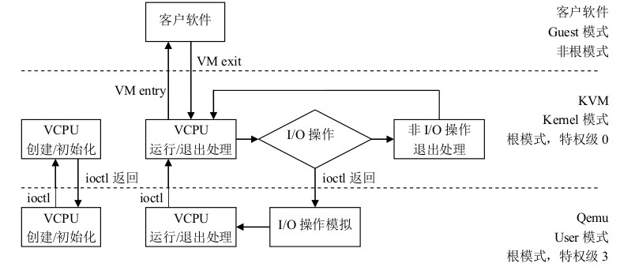
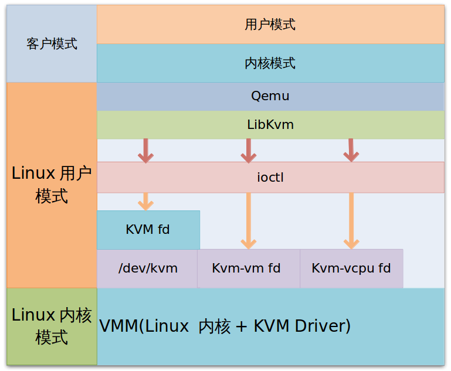
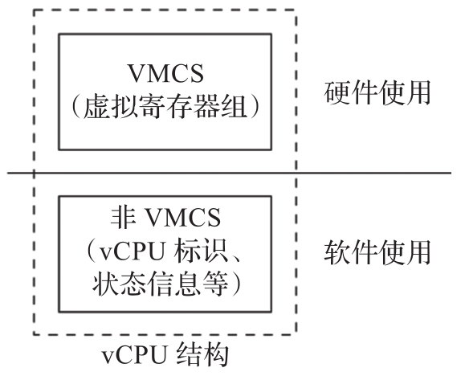
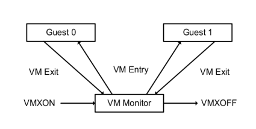
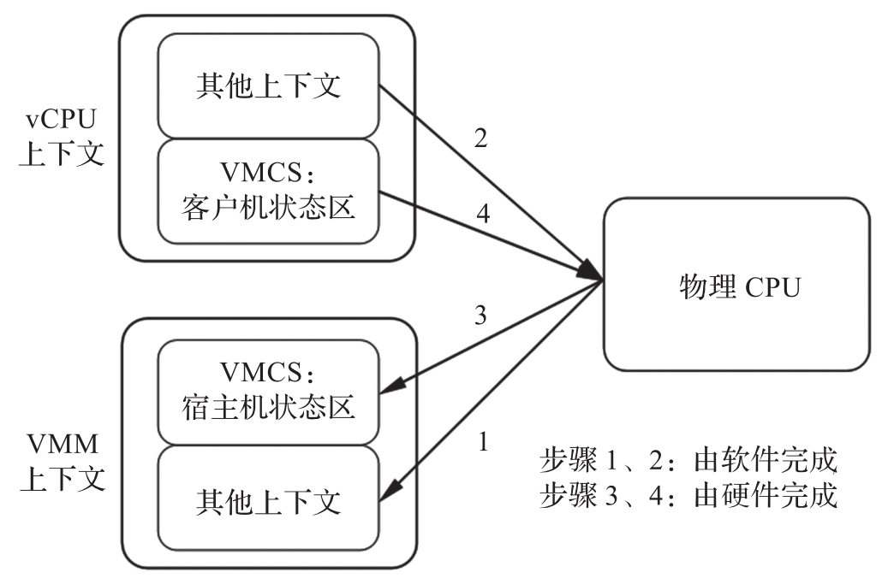
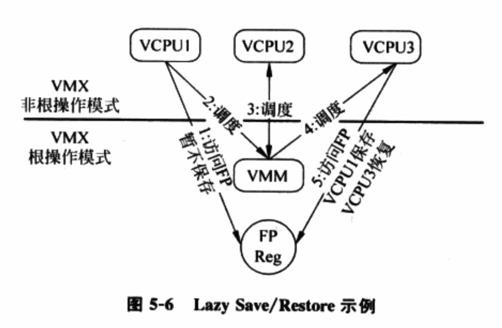
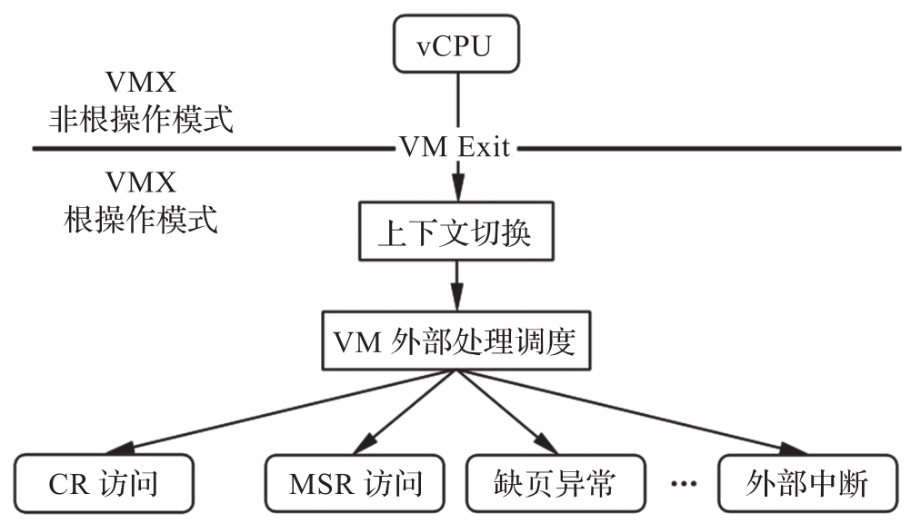
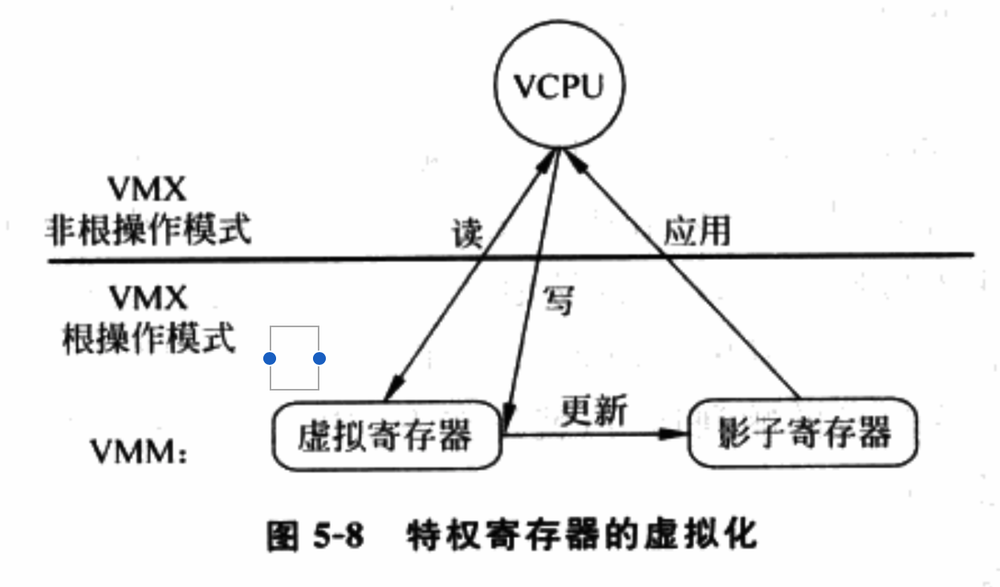
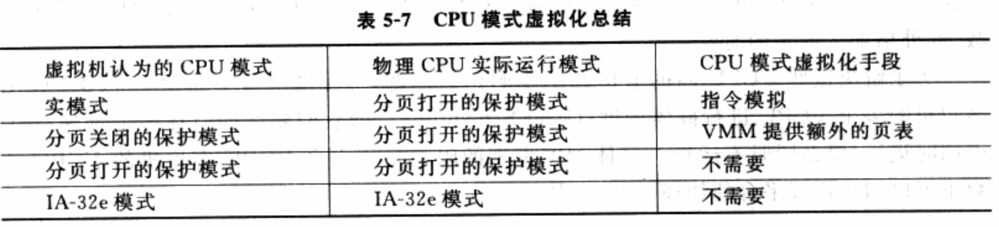

<!-- @import "[TOC]" {cmd="toc" depthFrom=1 depthTo=6 orderedList=false} -->

<!-- code_chunk_output -->

- [1. 运行的 3 个模式](#1-运行的-3-个模式)
- [2. VCPU 描述符](#2-vcpu-描述符)
- [3. VMM 与 guest 的切换](#3-vmm-与-guest-的切换)
- [4. VCPU 的创建](#4-vcpu-的创建)
  - [4.1. VMCS 的创建与初始化](#41-vmcs-的创建与初始化)
- [5. VCPU 的运行](#5-vcpu-的运行)
  - [5.1. 上下文切换](#51-上下文切换)
    - [5.1.1. 上下文切换步骤](#511-上下文切换步骤)
    - [5.1.2. 惰性保存/恢复](#512-惰性保存恢复)
  - [5.2. VCPU 的硬件优化](#52-vcpu-的硬件优化)
    - [5.2.1. 读写 CR0](#521-读写-cr0)
    - [5.2.2. 读取 TSC](#522-读取-tsc)
    - [5.2.3. GDTR/LDTR/IDTR/TR 的访问](#523-gdtrldtridtrtr-的访问)
    - [5.2.4. 读 CR2](#524-读-cr2)
    - [5.2.5. SYSENTER/SYSEXIT](#525-sysentersysexit)
    - [5.2.6. APIC 访问控制](#526-apic-访问控制)
    - [5.2.7. 异常控制](#527-异常控制)
    - [5.2.8. I/O 控制](#528-io-控制)
    - [5.2.9. MSR 位图](#529-msr-位图)
  - [5.3. 总结](#53-总结)
- [6. VCPU 的退出](#6-vcpu-的退出)
  - [6.1. VCPU 退出步骤](#61-vcpu-退出步骤)
  - [6.2. VCPU 退出原因](#62-vcpu-退出原因)
- [7. VCPU 的再运行](#7-vcpu-的再运行)
- [8. 进阶](#8-进阶)
  - [8.1. CPU 模式的虚拟化](#81-cpu-模式的虚拟化)
  - [8.2. 多处理器虚拟机](#82-多处理器虚拟机)

<!-- /code_chunk_output -->

# 1. 运行的 3 个模式

kvm 分 3 个模式, 对应到 VT-x 中即是

1. 客户模式对应 vmx non-root 模式

2. 内核模式对应 vmx root 模式下的 0 特权级

3. 用户模式对应 vmx root 模式下的 3 特权级





1. VMM 完成 vCPU, 内存的初始化后, 通过**ioctl**调用 KVM 的接口, 完成**虚拟机的创建**, 并**创建一个线程**来运行**VM**, 由于 VM 在**前期初始化**的时候会**设置各种寄存器**来帮助**KVM**查找到**需要加载的指令的入口**(main 函数). 所以**线程**在调用了**KVM 接口**后, **物理 CPU 的控制权**就交给了**VM**.

2. VM 运行在 VMX non-root 模式, 这是 Intel-V 或者 AMD-V 提供的一种特殊的 CPU 执行模式. 然后当**VM 执行了特殊指令**的时候, CPU 将**当前 VM 的上下文**保存到**VMCS 寄存器**(这个寄存器是一个**指针**, 保存了实际的上下文地址), 然后执行权切换到 VMM.

3. VMM 获取 **VM 返回原因**, 并做处理. 如果是**IO 请求**, VMM 可以直接**读取 VM 的内存**并将**IO 操作模拟**出来, 然后再调用**VMRESUME 指令**, VM 继续执行, 此时在**VM 看来**, **IO 操作的指令**被**CPU 执行**了.

# 2. VCPU 描述符

硬件虚拟化使用 VCPU(Virtual CPU) 描述符来**描述虚拟 CPU**.

VCPU 描述符类似操作系统中**进程描述符**(或进程控制块), 本质是一个**结构体**, 通常由下列几部分构成.

1) **VCPU 标识信息**: 用于**标识 VCPU 的一些属性**, 例如 VCPU 的 ID 号, VCPU 属于哪个客户机等.

2) **虚拟寄存器信息**: 虚拟的**寄存器资源**, 在使用 Intel VT-x 情况下, 这些内容包含在 **VMCS！！！** 中, 例如客户机状态域保存的内容.

3) **VCPU 状态信息**: 类似于进程的状态信息, 标识该 VCPU 当前所处的状态, 例如睡眠、运行等,  主要供**调度器使用**.

4) **额外寄存器/部件信息**: 主要指未包含在 VMCS 中的一些寄存器或 CPU 部件. 例如浮点寄存器和虚拟的 LAPIC 等.

5) **其它信息**: 用于 VMM 进行优化或存储额外信息的字段, 例如存放该 VCPU 私有数据的指针等.

Intel VT-x 情况下, **VCPU**可划分为两个部分,

- 一个是 **VMCS** 为主由**硬件使用和更新**的部分, 主要是**虚拟寄存器**;

- 一个是除 VMCS 之外, 由**VMM 使用和更新**的部分, 主要指 **VMCS 以外的部分**. 比如 VCPU 标识、状态信息等.

下图展示了 VCPU 的构成.



当 VMM 创建客户机, 首先为客户机**创建 VCPU**, 整个客户机运行实际上可以看作 VMM 调度不同的 VCPU 运行.

# 3. VMM 与 guest 的切换



Guest 与 VMM 之间的切换分两个部分: VM entry 和 VM exit. 有几种情况会导致 VM exit, 比如说 Guest 执行了硬件访问操作, 或者 Guest 调用了 VMCALL 指令或者调用了退出指令或者产生了一个 page fault, 或者访问了特殊设备的寄存器等. 当 Guest 处于 VMX 模式的时候, 没有提供获取是否处于此模式下的指令或者寄存器, 也就是说, Guest 不能判断当前 CPU 是否处于 VMX 模式.

当产生 **VM exit** 的时候, **CPU** 会将 **exit reason**保存到**MSRs**(VMX 模式的**特殊寄存器组**), 对应到 KVM 就是 `vCPU->kvm_run->exit_reason`. VMM 根据`exit_reason`做相应的处理.

如上图所示, VMM 开始于 **VMXON** 指令, 结束与 **VMXOFF** 指令.

第一次启动 Guest, 通过 **VMLAUNCH** 指令加载 Guest, 这时候一切都是新的, 比如说**起始的 rip 寄存器**等. 后续 Guest exit 后再 entry, 是通过 **VMRESUME** 指令, 此指令会将 **VMCS** 所指向的内容加载到**当前 Guest 的上下文**, 以便 Guest 继续执行.

下面以 VCPU 创建 --- 运行 --- 退出为主线, 介绍 Intel VT-x 技术的 CPU 虚拟化的实现.

# 4. VCPU 的创建

创建 vCPU 实质上是创建 VCPU 描述符, 由于**本质上 VCPU 描述符是一个结构体**, 因此**创建 VCPU 描述符**简单来说就是**分配相应大小的内存**.

VCPU 描述符包含的内容很多, 通常会被组织成多级结构, 例如第一级结构体可以是各个平台通用的内容, 中间包含一个指针指向第二级结构体, 包含平台相关的内容. 对于这样的多级结构, 需要为**每一级结构体**相应**分配内存**.

创建之后, 需要进一步初始化才能使用. 物理 CPU 上电后, 硬件会自动将 CPU 初始化为特定的状态. **VCPU 的初始化**也是一个类似过程. 通常包含:

1) 分配**VCPU 标识**: 首先标识**该 VCPU 属于哪个客户机**, 再为该 VCPU 分配一个**客户机范围内唯一的标识(！！！**).

2) 初始化**虚拟寄存器组**: 主要指出**初始化 VMCS 相关域！！！**. 这些寄存器的初始化值通常根据**物理 CPU 上电后各寄存器的值**设定.

3) 初始化**VCPU 状态信息**: 被调度前需要配置的必要标志. 具体依据调度器实现决定.

4) 初始化额外部件: 将**未被 VMCS 包含！！！**的**虚拟寄存器**初始化为**物理 CPU 上电**后的值, 并**配置虚拟 LAPIC**等部件.

5) 初始化其它信息: 根据 VMM 的实现初始化**VCPU 的私有数据**.

## 4.1. VMCS 的创建与初始化

**VMCS 分配**时, 只需要分配一块**4KB 大小**, 并**对齐到 4KB 边界的内存**即可. 初始化则需要根据 VT-x 的定义, 对前面内容进行初始化, 基本思想就是按照物理 CPU 初始化的定义, 提供了一个和物理 CPU 初始化后类似的状态.

此外, 根据 **VMM 的 CPU 虚拟化策略**, 设置相应的**VMCS 控制位**.

1) **客户机状态域**: 描述了**VCPU 运行时的状态**, 因此, 初始化的取值基本上是参考了**物理 CPU 初始化后的状态**. 例如, 物理 CPU 加电后会通过**复位**地址跳转到**BIOS 执行**, 那么**Guest RIP 字段**可直接设置为**虚拟机 Guest BIOS 的起始指令地址！！！**.

2) **宿主机状态域**: **VM-Exit**时, **CPU 切换**到**VMM 时寄存器值**, 因此, 初始化值参考**VMM 运行时的 CPU 的状态**. **HOST RIP 字段**通常被设置为**VMM 中 VMX Exit 处理函数！！！**(VMX Exit Handler)的入口.

3) **VM-Execution 控制域**: 控制**VCPU 运行时的一些行为**, 如执行**某些敏感指令时是否发生 VM-Exit**. 例如**IN/OUT 指令**, 如果 VMM 允许客户机**直接访问某些 I/O 端口**, 那么 VMM 就会将`Use I/O bitmaps`位置 1, 并在`I/O bitmap`中将相应 I/O 端口所对应的位置 0, 这样, 客户机访问这些 I/O 端口就**不会发生 VM-Exit**.

4) **VM-Entry 控制域**: 主要在**每次 VM-Entry 之前设置**, 因此在**VCPU 初始化时不需要特别设置**.

5) **VM-Exit 控制域**: 这个状态域有**两个字段**VMM 通常会设置, 一个是**Acknowledge interrupt on exit**, 有助于**更快响应外部中断**; 另一个是**Host Address Space**, 用于**支持 IA32 模式**.

6) **VM-Exit 信息域**: **硬件自动更新**, 因此不需要初始化.

# 5. VCPU 的运行

**VCPU**创建并初始化后, 可通过**调度程序**被**调度运行**. 调度程序会根据一定的策略算法来选择 VCPU 运行.

调度策略不表, 这里主要描述选定 VCPU 后, 如何将 VCPU 切换到物理 CPU 上运行.

## 5.1. 上下文切换

第 2 章中, 上下文实际上是一个寄存器的集合, 包括通用寄存器、浮点寄存器、段寄存器、控制寄存器以及 MSR 等.

前面提到, **Intel VT-x** 的支持下, **VCPU 的上下文**可以**分为两部分**. 故上下文的切换也分为由**硬件自动切换(VMCS 部分**)和**VMM 软件切换(非 VMCS 部分**)两个部分.

- **硬件切换**部分可以更好保证 VMM 与客户机的隔离, 但缺乏灵活性.

- **软件切换**部分可以由 V**MM 自己选择性切换需要的上下文**(例如, 浮点寄存器就无须每次切换), 从而有更大灵活并节省切换的开销.

### 5.1.1. 上下文切换步骤



上图描述了 VT-x 支持的**CPU 上下文切换过程**, 下列几步.

1) **VMM 保存自己的上下文**, 主要是保存**VMCS 不保存的寄存器！！！**, 即**宿主机状态域以外**的部分. VMM 软件切换.

2) **VMM**将保存在 VCPU 中的由**软件切换的上下文**加载到物理 CPU 中. VMM 软件切换

3) VMM 执行 VMRESUME/VMLAUNCH 指令, 触发 VM-Entry, 此时 CPU 自动将**VCPU 上下文**中**VMCS 部分**加载到**物理 CPU**, CPU 切换到非根模式. CPU 硬件自动完成.

注: 图中不正确, 因为宿主机状态域只需要在 VM-Exit 时恢复使用, VM-Entry 不使用

此时, **物理 CPU**已经处于**客户机的运行环境**了, **rip\eip**也指向了**客户机的指令**, 这样 VCPU 就被成功调度并运行了.

### 5.1.2. 惰性保存/恢复

上下文频繁切换会带来不小开销, 因此优化很有必要.

和 OS 一样, **VMM**也使用"**惰性保存/恢复(Lazy Save/Restore**)"的方法进行优化, 基本思想是尽量将**寄存器的保存/恢复**延迟到**最后一刻**, 即其它 VCPU 或 VMM 需要用该寄存器的时候再保存/恢复.

具体来说, VMM 通过**考察资源的使用情况**来实现"惰性保存/恢复".

1) 对于**VMM 需要使用的寄存器**, **每次 VCPU**和**VMM 切换**时都要**保存/恢复**.

2) 对于**VMM 没有使用！！！**的寄存器, 如果 VMM**无法知道**VCPU 是否在最近的执行中曾经**修改**了这个寄存器(如扩展通用寄存器 CR6), 那么

- **在 VCPU 和 VMM 切换**时, **不需要**对这个寄存器进行保存和恢复.
- 当 VMM 进行**不同的 VCPU 切换**时, 例如使一个 VCPU 睡眠并调度另一个 VCPU 运行, 需要每次都保存和恢复这个寄存器.

3) 对于**VMM 没有使用**的寄存器, 如果 VMM 可以知道客户机是否在最近执行中修改了这个寄存器(例如浮点寄存器), 还可以进一步优化. 不仅在 VCPU 和 VMM 切换时, 不需要对这个寄存器进行恢复和保存, 即使切换不同的 VCPU, 也不需要每次都保存/恢复, 而是根据需要进行.

例如, 如图 5-6, **VCPU1**、**VCPU2**和**VCPU3**按顺序调度到物理 CPU 上执行, 即 VCPU1 先执行, 其次 VCPU2, 最后 VCPU3. 其中, **VCPU1**和**VCPU3**在执行中会**使用浮点寄存器**, 而**VCPU2 不用**. VMM 了解到后,

- 在从**VCPU1**调度到**VCPU2**时, **只需保存 VCPU1 的浮点寄存器**而**无需加载 VCPU2 的**;
- 从**VCPU2 调度到 VCPU3**时, **只需加载 VCPU3 的浮点寄存器**而**无需保存 VCPU2**的.

这就将原来两次保存/加载的工作减少为 1 次(保存 VCPU1 半次, 加载 VCPU3 半次).



## 5.2. VCPU 的硬件优化

优化目的, 尽可能**减少在客户机和 VMM 之间切换**, 从而**减少上下文切换开销**.

Intel VT-x 优化方法可分为两种.

1) **无条件优化**: 指以往在**软件虚拟化**下**必须陷入到 VMM 的敏感指令**, 通过 Intel VT-x 已可以在**客户机中直接执行**. 如后面看到的**CR2 访问**、**SYSENTER/SYSEXIT 指令**.

2) **条件优化**: 指通过**VMCS 的 VM-Execution 控制域**, 可配置**某些敏感指令**是否产生**VM-Exit**而陷入到 VMM 中. 如**CR0、TSC 的访问**.

下面举例说明 Intel VT-x 带来的优化技术.

### 5.2.1. 读写 CR0

CR0 是一个控制寄存器, 控制寄存器的状态, 如**启动保护模式**、打开**分页机制**.

操作 CR0 的指令有**MOV TO CR0**、**MOV FROM CR0**、**CLTS**和**LMSW**, 这些指令必须在 **特权级 0！！！** 执行, 否则产生保护异常.

**纯软件虚拟机**中, 客户 OS 是特权级 1、特权级 2 上执行 CR0 读写指令, 因此所有指令都产生保护异常, 然后 VMM 模拟操作 CR0 指令的执行.

**硬件辅助虚拟机**中, 虽然**CR0 访问同样需要 VMM 模拟处理！！！**, 但**VT-x 提供了加速方法**, 能减少因访问 CR0 所引起的 VM-Exit 的次数.

- 首先, 读 CR0. VMCS 的"**VM-Execution 控制域**"的**CR0 read shadow 字段**用来加速客户机**读 CR0**的指令. 每次客户机**试图写 CR0！！！**时, 该字段都会**自动得到更新(会产生 VM-Exit！！！**), 保存客户机要写的值. 这样, 客户机**所有读 CR0 的指令都不用产生 VM-Exit！！！**, **CPU 只需返回 CR0 read shadow 的值**即可.

- 其次, **写 CR0**. VMCS 的"**VM-Execution 控制域**"的**CR0 guest/host Mask 字段**提供了客户机**写 CR0**指令的加速. 该字段**每一位**和 CR0 的**每一位对应**, 表示 CR0 对应的位是否可以被客户软件修改.
	- 若为**0**, 表示 CR0 中对应位**可被客户软件修改！！！**, **不产生 VM-Exit**;
	- 若为**1**, 表示不能, 如果客户软件修改该位, 产生 VM-Exit.

**读 CR0**. 通过**VM-Execution 控制域**的 CR0 read shadow 字段加速, VMCS 的客户机状态域 CR0, 为什么不使用呢??

**写 CR0**. 通过**VM-Execution 控制域**的相应字段控制是否让客户 OS 修改还是 VM-Exit.

但, **读写 CR0 只能在特权级 0**, 所以非根模式的客户机非特权级 0 时是否 VM-Exit 由 VMCS 的 VM-Execution 控制域的 Exception bitmap 决定.

同样机制被用于加速 CR4 的访问. 该优化属于条件优化.

### 5.2.2. 读取 TSC

**纯软件虚拟机**中, **读取 TSC**可以在**任何特权级**中执行, VMM 必须**想办法截获 TSC 读取指令**.

在**硬件辅助的虚拟机**中, 当"**VM-Execution 控制域**"中**RDTSC exiting**字段为 1, 客户软件执行 RDTSC 产生 VM-Exit, 由**VMM 模拟该指令**. 客户读取 TSC 非常频繁, 为提高效率, VT-x 提供下面的**硬件加速**. 当"VM-Execution 控制域"中 RDTSC exiting 字段为 1 并且**Use TSC offset**为 1, 硬件加速有效.

- **VMCS(每个 VMCS 一个！！！**) 中 **TSC 偏移量** 表示该 VMCS 所代表的虚拟 CPU TSC 相对于物理 CPU TSC 的偏移, 即虚拟 TSC = 物理 TSC + TSC 偏移量. 当客户软件执行 RDTSC 时, 处理器直接返回虚拟 TSC, **不产生 VM-Exit**. 这样, 对**TSC 的虚拟化**只需在 **适时更新 VMCS 中 TSC 偏移量！！！** 即可, 不需要每次 TSC 访问都产生 VM-Exit.

VMCS 存在 TSC 偏移量.

这属于条件优化.

### 5.2.3. GDTR/LDTR/IDTR/TR 的访问

必须在 0 特权级

**纯软件虚拟机**中, 客户 OS 是特权级 1、特权级 2 上, 执行 LGDT、LIDT、LLDT 和 LTR 指令, 会产生**保护异常**, 需要 VMM 模拟这些指令的执行. 模拟过程对不同情况, 有很多复杂的处理. 例如,

- **客户机 OS**在**GDT**中, 为**自身内核段**设置的**描述符的 DPL 是 0**. 由于它**自身运行在非特权级 0**上, 所以**VMM**要通过**截获 LGDT 指令**, **对 GDT 描述符修改**.
- 同时, 像**SGDT**这样的指令可以在**任何特权级下执行**, **客户 OS**中的程序**只需要读取 GDT**并**判断描述符的 DPL**就知道**自身运行在虚拟环境**, 这也是一个**虚拟化漏洞！！！**.

**硬件虚拟机**中. 使用**Intel VT-x**技术, **VMCS(！！！**) 为**客户机**和**VMM**都提供了一套 GDTR、IDTR、LDTR 和 TR, 分别保存在**客户机状态域**和**宿主机状态域**中(宿主机状态域没有 LDTR, 因为 VMM 不需要使用), 由硬件转换.
- 而客户机运行在非根的特权级 0, 所以无需对 GDT 表等做任何修改, **客户机执行 LGDT 等指令**也**无需 VM-Exit**.

VMCS 中的**宿主机状态域**和**客户机状态域**中存在.

该优化属于无条件优化.

### 5.2.4. 读 CR2

发生**缺页异常**时, **CR2**保存产生**缺页错误**的**虚拟地址**. **缺页错误处理程序**通常会读取 CR2 获得产生该错误的虚拟地址. 缺页错误是一个发生频率较高的异常, 所以**读取 CR2**是一个**高频操作**. **读取 CR2**必须在 **特权级 0！！！** 上执行, 否则产生保护错误.

**纯软件虚拟机**中, 客户 OS 在特权级 1、特权级 2 上执行读取 CR2 指令, 产生保护错误, 需要**VMM 模拟**该指令.

Intel VT-x 中, **VM-Entry/VM-Exit**时会**切换 CR2**.

- 并且, **客户 OS**是在**非根模式**的**特权级 0**执行读取**CR2 指令**, 不产生保护错误, 故无需 VMM 模拟该指令.

- 此外, 如果**客户机**在**特权级 0 以外**级别执行**读 CR2 指令**, 会产生**保护错误**, 该错误**是否引发 VM-Exit**由**Exception bitmap 控制**.

因为**VMCS 中没有 CR2！！！**

page\_fault 的处理程序会使用,

该优化属于无条件优化.

### 5.2.5. SYSENTER/SYSEXIT

早期**系统调用**通过**INT 指令**和**IRET 指令**实现. 当前主流的 IA32e CPU 中, Intel 推出了经过优化的 SYSENTER/SYSEXIT 指令以提高效率. 现代 OS 倾向使用**SYSENTER/SYSEXIT**指令.

正常情况下, SYSENTER 指令要求跳转的**目标代码段！！！**运行在**特权级 0**, 否则产生**保护错误**.

在软件虚拟机中, 客户 OS 运行在**特权级 1、特权级 2**, 当客户应用执行 SYSENTER 会产生**保护错误**, 需要由**VMM 模拟**SYSENTER 指令. **SYSEXIT 指令**必须在 **特权级 0！！！** 执行, 否则产生保护错误. 和 SYSENTER 一样, SYSEXIT 在软件虚拟化技术中必须由 VMM 模拟.

Intel VT-x 中, 客户 OS 运行在非根模式的**特权级 0**, SYSENTER/SYSEXIT 都**不会引起 VM-EXIT**, 即客户 OS 的系统调用无需 VMM 干预而直接执行. 该优化属于**无条件优化**.

### 5.2.6. APIC 访问控制

现代主流的支持**SMP 的 OS**来说, **LAPIC**在**中断的递交**中扮演很重要角色. LAPIC 有很多寄存器, 通常 OS 以**MMIO 方式**访问. 其中, OS 使用**TPR(Task Priority Register**)来**屏蔽**中断优先级小于或等于 TPR 的外部中断.

通过**虚拟化客户机的 MMU**, 当**客户机试图访问 LAPIC(！！！MMIO！！！**)时, 发生一个**缺页异常类型的 VM-Exit**, 从而被 VMM 拦截到. VMM 经过分析, 知道客户机正试图访问 LAPIC 后, 会**模拟客户机对 LAPIC 的访问**.

通常, 对于**客户机的每个虚拟 CPU**, **VMM**都会分配**一个虚拟 APIC 结构与之对应！！！**, 客户机的 MMIO 操作**不会真正影响物理的 LAPIC**, 而只反映到**相应的虚拟 LAPIC 结构！！！**里面. VMM 这种模拟开销很大, 如果客户机的**每个 LAPIC 访问**都导致**一次缺页异常类型的 VM-Exit**并由**VMM 模拟**, 会**严重影响客户机的性能**.

VT-x 提供了硬件加速.

- 可设置**VMCS**的 Use TPR shadow=1, Virtualize APIC accesses=1, 设置**Virtual APIC page**为**虚拟 LAPIC 结构的地址**, 同时**修改 VCPU 页表**, 使**客户机访问 LAPIC**时**不发生 Page Fault**(需要相应设置 VMCS 中的 Virtual-APIC address 寄存器).

- 同时, 对于那些**暂时不能注入客户机的中断**(如果有), 还需要挑出**优先级最高**的那个(即向量号最大的那个), 将其优先级填入 VMCS 中的**TPR threshold**寄存器.

这样设置后,

- 对于除了 TPR 以外的**LAPIC 寄存器的访问**, 客户机会直接发生**APIC Access 类型的 VM-Exit**. 此时, CPU 可告知 VMM 客户机正试图访问哪个 LAPIC, 这可降低 VMM 对客户机此次访问的模式开销;

- 而客户机**对 TPR 的读操作**则可以直接从虚拟 LAPIC 结构中的相应偏移处读取而**无须发生任何 VM-Exit**.

- 最后, 客户机对**TPR 的写操作**只在必要时候(客户机把 TPR 减少到比 TPR threshold 还要小的时候)才发生 TPR-Below-Threshold 类型的 VM-Exit, 这种情况下 VMM 可检测是否有虚拟中断可以注入到客户机.

上面的 TPR 寄存器是用**MMIO**方式访问, 对于**64 位**的 x86, 专门有一个特别的系统控制寄存器**CR8**被映射到 TPR(读写 CR8 等效于读写 TPR). 64 位客户机通常通过 CR8 寄存器来访问 TPR. 当**客户机**试图**访问 CR8**时, 会发生一个**Control-Register-Accesses 类型**的**VM-Exit**. 为更快模拟客户机对 CR8 的访问, 除了上面设置外, 可以设置 VMCS 中的 CR8-load exiting=0 和 CR8-store exiting=0. 这样,

- 客户机**读 CR8**时, CPU 可以从**虚拟 LAPIC**结构中**相应的偏移处直接返回**正确值而**不产生任何 VM-Exit**;
- 当客户机**写 CR8**时, 只在必要时候才发生 TPR-Below-Threshold 类型的 VM-Exit.

### 5.2.7. 异常控制

在软件虚拟化技术中, 客户机产生异常都会被 VMM 截获, 由 VMM 决定如何处理, 通常是注入给客户 OS.

Intel VT-x 中, 可用**Exception bitmap**配置哪些异常需要由 VMM 截获. 对于不需要 VMM 截获的, 可将 Exception bitmap 中对应的位置 1, 则异常发生时**直接由客户 OS 处理**. 属于条件优化.

### 5.2.8. I/O 控制

**软件虚拟化**中, VMM 需要**截获 I/O 指令**来实现**I/O 虚拟化**. 但由于 I/O 指令通过设置可在**特权级 3**执行, 截获 I/O 指令需要**额外处理**.

Intel VT-x 中, 可通过**VMCS**的 Unconditional I/O exiting、Use I/O bitmaps、I/O bitmap 进行配置, **选择性**让 I/O 访问产生 VM-Exit 而陷入 VMM 中. 这样, 对于**不需要模拟的 I/O 端口**, 可让**客户机直接访问**. 属于条件优化.

### 5.2.9. MSR 位图

Intel VT-x 和 I/O 控制一样, 可通过 use MSR bitmaps、MSR bitmap 来控制对 MSR 的访问是否触发 VM-Exit. 属于条件优化.

## 5.3. 总结

物理机情况下, 指令的执行都是有自己对应特权级的特权行为, 特权级别不匹配的话可能会异常, 可能无事发生.

软件虚拟化情况下,

在硬件辅助虚拟化中, 虚拟机也有一套完整的特权级. 一个指令开始执行, 这时候取决于**VMX 非根模式**下的行为定义.

**一般而言**, **硬件虚拟化**时一个**指令的动作**往往和**物理情况**下的动作有**类似**之处.

- 对于**权限符合**的(例如**0 级**指令在**非根 0 级**<CR0 读写>). 有些会有硬件无条件优化(**不会导致 VM-Exit**, 往往**借助 VMCS**), 有些可以**条件优化**(可**选择**触发 VM-Exit 还是直接修改物理寄存器, 往往通过**VMCS**相关字段**可配置**), 有些没有优化(类似于软件模拟, 会导致 VM-Exit 再由 VMM 模拟)

- 对于权限不符合(例如 0 级指令在非根 3 级). 物理环境会发生异常/无事发生, 在硬件虚拟化中, 有些可能会直接发生 VM-Exit, 有些无事发生, 有些又可以控制是否 VM-Exit(比如通过 VMCS 的 VM-Execution 控制域的 Exception bitmap 字段控制产生 VM-Exit 还是直接客户 OS 处理)

对于 IO 端口也是类似

# 6. VCPU 的退出

当然, vCPU作为调度单位不可能永远运行, 当 Guest 执行特权指令, 或者发生物理中断等. 这种退出表现为 VM-Exit.

对于 VCPU 退出的处理是 VMM 进行 CPU 虚拟化的核心, 例如模拟各种特权指令.

## 6.1. VCPU 退出步骤



上图描述了 VMM 处理 VCPU 退出的典型流程, 可归纳为下面几步.

1) 发生 VM-Exit, **CPU 自动**进行**一部分上下文的切换**. 见 6.2.7.

2) 当**CPU 切换到根模式**开始执行**VM-Exit 的处理函数**后, 进行另一部分上下文的切换工作(见 6.3.3)

根据**VM-Exit 信息域**获得**发生 VM-Exit 的原因**, 并分发到**对应的处理模块处理**. 例如, 原因是执行了**特权指令**, 则调用**相应指令的模拟函数**进行模拟.

## 6.2. VCPU 退出原因

前图列举了典型的 VCPU 退出原因. 总结起来, VCPU 退出的原因大体有三类

(1) 访问了**特权资源**, 对**CR**和**MSR 寄存器**的访问属于这一类

VMM 通过特权资源的虚拟化解决. 特权资源虚拟化要点在于解决客户机与 VMM 在特权资源控制权的矛盾. 即**客户机认为自己完全拥有特权资源**, 可自由读写, 而实际拥有者是 VMM, 不能允许客户机自由读写.

VMM 通过引入"**虚拟特权资源**"和"**影子特权资源**"来解决.

- "**虚拟特权资源**"是**客户机所看到的特权资源**, **VMM 允许客户机自由读写**.
- "**影子特权资源**"是客户机运行时**特权资源真正的值**, 通常是 VMM 在"虚拟特权资源"基础上经过处理得到的, 因此称为"影子".

图 5-8 以**特权寄存器**为例, 展示特权寄存器的虚拟化过程.



当**VCPU 读特权寄存器！！！**时, VMM 将"**虚拟寄存器！！！"的值返回**. 例如, 对于 MOV EAX, CR0 指令, VMM 将**Virtual CR0 的值**赋给 EAX, 然后**VM-Entry 返回！！！**.

当**VCPU 写特权寄存器**时, VMM 首先将值**写入"虚拟寄存器**", 然后根据"**虚拟寄存器"的值**以及**虚拟化策略**来**更新"影子寄存器**", 最后将"**影子寄存器"的值应用到 VCPU**上, 将值写入**VMCS"客户机状态域"的对应字段并且 VM-Entry 返回**. 这里的虚拟化策略因特权虚拟器而异, 例如对于下面指令:

```assembly
MOV EAX, 0x00000001
MOV CR0, EAX
```

假设原来**Virtual CR0=0x80000001**, VMM 比较后会发现客户机试图将**CR0 的第 31 位**(`CR0.PG`: 页模式)**清掉**, 即关掉 CPU 的页模式. 为**实现内存的隔离**, VT-x 是**不允许客户机的页模式关掉的！！！**. 因此, VMM 会将 Virtual CR0 按客户机要求设置为 0x00000001, 但影子 CR0 依然设置为 0x80000001(相应 VMCS 中的 Guest CR0 字段也会被设置). 此外, VMM 会通知内存虚拟化模块有关客户机页模式的变化, 内存虚拟化模块做相应处理, 比如不再使用客户机的页表等.

(2) 客户机执行的**指令**引发了**异常**, 例如缺页异常.

客户机指令导致的异常, 很多是**不需要虚拟化**的, 可以**直接由客户操作系统处理**, 例如"除 0 错误"、"溢出错误"和"非法指令"等异常. 这些都可以通过**Exception bitmap 设置**.

对于**需要虚拟化**的异常, 没有一个通用的方法, VMM 会对不同异常做**不同处理**. 以缺页异常为例, VMM 会首先分析产生错误的原因:

- 如果是因为访问**MMIO 地址**导致的, 则可以知道客户机在做**I/O 操作**, **VMM**会调用**I/O 虚拟化模块**处理;
- 如果是**软件虚拟化**中提到的**影子页**导致的异常, **VMM**会调用**内存虚拟化模块**处理;
- 如果**都不是**, 那就是客户机**正常的缺页异常**(即不要 VMM 处理的缺页异常), 该异常会被**注入给客户机**, 由**客户机 OS 自己处理**.

(3) 发生了中断. 可分为两种情况, 一种是发生**真正的物理中断**; 一种是**客户机的虚拟设备发生了虚拟中断**, 并通过**VMM 提供的接口使客户机发生 VM-Exit**.

- 对于前者, VMM 首先读取**VMCS**的 VM-Exit interruption information 字段来获取中断向量号, 然后调用**VMM**中对应的**中断处理函数**.

- 对于后者, VMM 在感知到**虚拟中断**发生时, 会用某种方法把**虚拟中断的目标 VCPU 拖到 VMM**中, 常用一个方法是**发一个 IPI 给运行该 VCPU 的物理 CPU**. 然后, VMM 在 IPI 的处理函数中将该虚拟中断注入给客户机, **客户机 OS 处理**.

# 7. VCPU 的再运行

VMM 在处理完 VCPU 的退出后, 会负责将 VCPU 投入再运行. 从 VT-x 的角度来看, 有几点需要额外考虑.

(1) 如果**VCPU**继续在**相同物理 CPU**上运行, 可以用**VMRESUME**实现 VM-Entry. VMRESUME 比 VMLAUNCH 更轻量, 执行效率更高. 因此, 作为优化, VMM 调度程序通常会尽量将 VCPU 调度在同一个物理 CPU 上.

(2) 如果由于某种原因(如负载均衡), **VCPU**被调度程序迁移到**另一个物理 CPU**上, 那么 VMM 需要做如下几个事情.

1) 将**VCPU 对应的 VMCS**迁移到**另一个物理 CPU**(见 6.2.2 节), 这通常可以由一个**IPI 中断**实现.

2) 迁移完成后, 在**重新**绑定的**物理 CPU**上执行**VMLAUNCH**发起 VM-Entery.

此外, 在上一节看到, 某些异常和中断是需要注入给客户机, 这也是在 VCPU 运行时进行的. 通过"**事件注入机制**", 可很容易让**VCPU**在**运行后直接进入到相应的中断/异常处理函数**中执行. 整个虚拟化内容就是在 VMM -> 客户机 -> VMM -> ∙∙∙中完成. 这里再细化下, 就是在 VCPU 运行 -> VCPU 退出 -> VCPU 再运行 -> ∙∙∙的过程中完成的.

# 8. 进阶

## 8.1. CPU 模式的虚拟化

在一个物理机器上, 可能同时运行一个实模式的虚拟机、一个保护模式的虚拟机和一个 IA-32e 模式的虚拟机, 以及其他组合. 为此, VMM 必须有模拟各种 CPU 运行模式的能力.

然而, 由于**客户机物理地址空间**和机器**真实的物理地址空间并不相同**, 且**客户机物理地址空间**占用的**真实物理页面通常不连续**, 因此, 目前**VT-x**要求**物理 CPU 处于非根模式时**, **分页机制必须是开启**的, 而不考虑客户机当前运行模式. 即, 客户机运行在实模式, 其所在物理 CPU 的分页机制也是开启的. 由于实模式使用的内存访问模式和保护模式不同, VMM 需要大量工作对客户机的实模式进行模拟.

**客户机**看到的**CPU 模式**实际是**VCPU 中设置的模式**, 即**VCPU 结构**中**CR0 寄存器值反映的模式**, 该模式和物理 CPU 的真正模式可能不同, 所以**CPU 模式的虚拟化**包括两个方面.

1) 对**标志 CPU 模式**的**控制寄存器(如 CR0 的 PE/PG 位)的虚拟化**.

2) 对**CPU 运行环境**的虚拟化, 如指令的操作数长度等.

当客户机运行在实模式, 由于物理 CPU 运行在保护模式, 两者在指令、运行环境都不同, 所以 VMM 对客户机的指令进行模拟执行.

当客户机运行在分页开启的保护模式, 和物理 CPU 的运行模式一样, 此时不需要就模式的虚拟化做额外的工作.

表 5-7 总结了客户机运行模式和物理 CPU 的实际模式之间的对应关系, 并总结模拟客户机运行模式的方法.



## 8.2. 多处理器虚拟机

现在多数计算机具备多个 CPU. 可将客户机配置多个 CPU 的虚拟平台, 提高客户机的计算能力. 多 CPU 的虚拟平台, 本质就是给客户机分配多个 VCPU, 并通过调度器让它们共享一个物理 CPU 分时执行或分散到多个物理 CPU 同时执行. 这和 OS 中的多线程任务采用同样思想.

与单 VCPU 客户机相比, 多 VCPU 客户机实现上有几点需要注意.

1) **多 VCPU 发现的问题**. 在物理机器上, OS 需要知道平台所有 CPU 的信息, 同样, 需要让客户 OS 知道它所拥有的 VCPU 的信息, 例如 VCPU 个数、每个 VCPU 的 ID 号等. 这些信息在**物理平台是通过 BIOS**提供, **虚拟环境, 客户机的虚拟 BIOS 负责**.

2) **多个 VCPU 初始化问题**. 物理平台, 多处理器初始化通常遵循一个规范, 例如 IA32 手册的 7.5 节 MULTIPLE-PROCESSOR(MP) INITIALIZATION 就定义了 IA32 平台上多处理器的初始化流程. 硬件通常会选择一个 CPU 作为主 CPU, 称为 BSP(Boot Strap Processor), 来执行 BIOS, 其它从 CPU, 称为 AP(Application Processor), 处于 Wait-for-SIPI 状态, 等待 BSP 发 SIPI(Start-up IPI)唤醒它们之后再开始执行. 客户机同样遵循这个规范, 包括挑选一个 VCPU 作为 BSP 执行 BIOS, 将其它 VCPU 置于 Wait-for-SIPI 状态等待 BSP 发 SIPI, 只是这个**挑选工作是由 VMM 完成**.

3) **VCPU 的同步问题**. 物理平台, 各 CPU 同时在运行. 但多个 VCPU 的客户机, 同一时刻, 可能一部分 VCPU 正在运行, 一部分则处于睡眠或阻塞状态. 这对于 VCPU 间通信和同步都造成一定延时问题. 例如, 当客户机的两个 VCPU 都运行着竞争自旋锁的代码时, 考虑下面这段两个 VCPU 通过自旋锁进行同步的代码:

```c
acquire_splinlock(lock)
    critical section
release_splinlock(lock)
```

当 VCPU0 上运行的代码通过 acquire\_splinlock(lock)取得自旋锁, 进入临界区后, VCPU0 可能会被调度出去. 其后, 当另一段运行在 VCPU1 上代码尝试获取锁, 它因为得不到而自旋等待, 知道 VCPU0 被重新调度执行, 完成临界区并执行 release\_splinlock(lock)释放自旋锁. 这样, VCPU1 因为 VCPU0 被调度出去的缘故, **增加了同步的时延**.

为解决这个问题, 一种解决方案是对一个多 VCPU 客户机的**多个 VCPU 进行群体调度(Gang Scheduling**), 即它们要么同时在多物理 CPU 上同时运行, 要么同时不运行. 群体调度带来的一个限制使一个多 VCPU 客户机的 VCPU 个数不可以超过物理平台的物理 CPU 个数.

