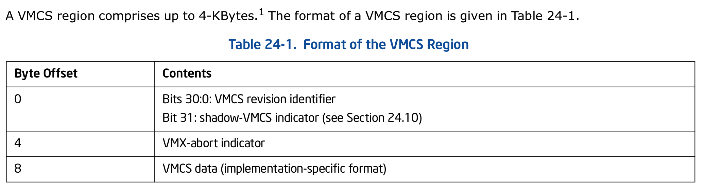
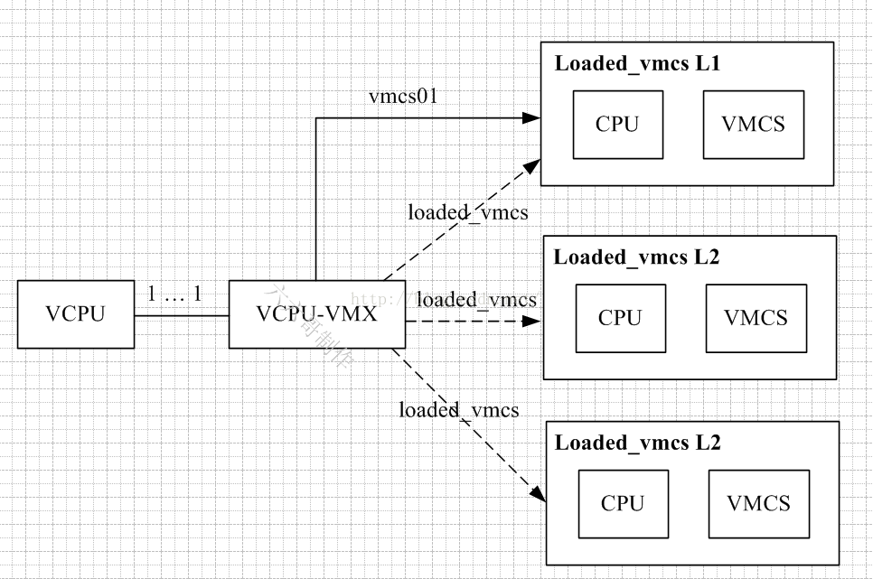

<!-- @import "[TOC]" {cmd="toc" depthFrom=1 depthTo=6 orderedList=false} -->

<!-- code_chunk_output -->

- [1. KVM 结构体: 一个虚拟机](#1-kvm-结构体-一个虚拟机)
- [2. kvm_vcpu 结构体](#2-kvm_vcpu-结构体)
  - [2.1. kvm_run 结构体](#21-kvm_run-结构体)
  - [2.2. kvm_vcpu_arch 结构体](#22-kvm_vcpu_arch-结构体)
- [3. kvm, kvm_vcpu, vcpu_vmx 和 loaded_vmcs 之间的关系](#3-kvm-kvm_vcpu-vcpu_vmx-和-loaded_vmcs-之间的关系)
- [4. struct vmcs_host_state: VMEXIT 时加载的 host 状态](#4-struct-vmcs_host_state-vmexit-时加载的-host-状态)
- [5. kvm_x86_ops 结构体](#5-kvm_x86_ops-结构体)
- [6. KVM API 中重要的结构体](#6-kvm-api-中重要的结构体)
  - [6.1. kvm_chardev_ops](#61-kvm_chardev_ops)
  - [6.2. kvm_vm_fops](#62-kvm_vm_fops)
  - [6.3. kvm_vcpu_fops](#63-kvm_vcpu_fops)

<!-- /code_chunk_output -->

# 1. KVM 结构体: 一个虚拟机

**KVM 结构体**在 KVM 的系统架构中**代表一个具体的虚拟机**.

当通过 **VM\_CREATE\_KVM！！！指令字**创建一个新的 KVM 虚拟机之后, 就会**创建一个新的 KVM 结构体对象**.

```cpp
// include/linux/kvm_host.h
struct kvm {
    // 保护 mmu 的 spinlock, mmu 范围最大的锁
    spinlock_t mmu_lock;
    // 内存槽操作锁
    struct mutex slots_lock;
    // 指向 qemu 用户态进程的 mm_struct
    struct mm_struct *mm; /* userspace tied to this vm */
    // 该 kvm 所有的 memslot
    struct kvm_memslots __rcu *memslots[KVM_ADDRESS_SPACE_NUM];
    struct srcu_struct srcu;
    struct srcu_struct irq_srcu;
    /* 模拟的 CPU */
    struct kvm_vcpu *vcpus[KVM_MAX_VCPUS];

    /*
     * created_vcpus is protected by kvm->lock, and is incremented
     * at the beginning of KVM_CREATE_VCPU.  online_vcpus is only
     * incremented after storing the kvm_vcpu pointer in vcpus,
     * and is accessed atomically.
     */
    // online 的 vcpu 数量
    atomic_t online_vcpus;
    int created_vcpus;
    int last_boosted_vcpu;
    // host 上 vm 管理链表
    struct list_head vm_list;
    struct mutex lock;
    struct kvm_io_bus *buses[KVM_NR_BUSES];
    //事件通道相关
#ifdef CONFIG_HAVE_KVM_EVENTFD
    struct {
        spinlock_t        lock;
        struct list_head  items;
        struct list_head  resampler_list;
        struct mutex      resampler_lock;
    } irqfds;
    struct list_head ioeventfds;
#endif
    struct kvm_vm_stat stat;
    // host 上 arch 的一些参数
    struct kvm_arch arch;
    // 引用计数
    atomic_t users_count;
#ifdef KVM_COALESCED_MMIO_PAGE_OFFSET
    struct kvm_coalesced_mmio_ring *coalesced_mmio_ring;
    spinlock_t ring_lock;
    struct list_head coalesced_zones;
#endif

    struct mutex irq_lock;
#ifdef CONFIG_HAVE_KVM_IRQCHIP
    /*
     * Update side is protected by irq_lock.
     */
    // 中断路由信息表
    struct kvm_irq_routing_table __rcu *irq_routing;
#endif
#ifdef CONFIG_HAVE_KVM_IRQFD
    struct hlist_head irq_ack_notifier_list;
#endif

#if defined(CONFIG_MMU_NOTIFIER) && defined(KVM_ARCH_WANT_MMU_NOTIFIER)
    // mmu 通知链
    struct mmu_notifier mmu_notifier;
    unsigned long mmu_notifier_seq;
    long mmu_notifier_count;
#endif
    // dirty tlb 数量
    long tlbs_dirty;
    struct list_head devices;
    struct dentry *debugfs_dentry;
    struct kvm_stat_data **debugfs_stat_data;
};
```

**KVM 结构体对象**中包含了**vCPU**、**内存**、**APIC**、**IRQ**、**MMU**、**Event 事件管理**等信息.

该结构体中的信息主要在 **KVM 虚拟机内部！！！使用**, 用于**跟踪虚拟机的状态**.

在定义 KVM 结构体的**结构成员**的过程中, 集成了**很多编译开关**, 这些开关对应了 KVM 体系中的不同功能点.

在 KVM 中, 连接了如下几个重要的结构体成员, 它们对虚拟机的运行有重要的作用.

* `struct kvm_memslots *memslots`;

KVM 虚拟机所分配到的**内存 slot**, 内存条模型. 注意最大`KVM_ADDRESS_SPACE_NUM`(这里是 1).

`kvm_memslots`结构体是`kvm_mem_slot`的封装, 其中包含一个`kvm_mem_slot`的数组, 对应于**该虚拟机**使用的**所有内存区域(slot**). 以**数组形式**存储这些**slot 的地址信息**.

`kvm_mem_slot`是 kvm 内存管理相关主要数据结构, 用来表示**虚拟机 GPA**和**主机 HVA**之间的**映射关系**, 一个`kvm_mem_slot`表示一段**内存区域(slot)的映射关系**.

* `struct kvm_vcpu *vcpus[KVM_MAX_VCPUS]`;

KVM 虚拟机中包含的**vCPU 结构体数组**,

**一个 vCPU**对应**一个数组成员**.

* `struct list_head vm_list;`

Host 上的 VM 管理链表

* `struct kvm_io_bus *buses[KVM_NR_BUSES]`;

KVM 虚拟机中的**I/O 总线结构体数组**

**一条总线**对应一个 `kvm_io_bus` 结构体**, 如**ISA 总线**、**PCI 总线**.

* `struct kvm_vm_stat stat`;

虚拟机运行时状态信息

KVM 虚拟机中的**页表**、**MMU**等**运行时状态信息**.

* `struct kvm_arch arch`;

KVM 的**arch** 方面所需要的一些参数,

将在后文讨论 KVM 的实现机理时详细叙述.

# 2. kvm_vcpu 结构体

在用户通过 `KVM_CREATE_VCPU` 系统调用请求**创建 vCPU** 之后, **KVM 子模块**将创建 `kvm_vcpu` 结构体并进行相应的初始化操作, 然后返回**对应的 vcpu\_fd 描述符**.

在 KVM 的**内部虚拟机调度！！！** 中, 以 **kvm\_vcpu** 和 **KVM 中的相关数据**进行操作.

`kvm_vcpu` 结构体中的字段较多, 其中重要的成员如下.

```cpp
// include/linux/kvm_host.h
struct kvm_vcpu {
    // 指向此 vcpu 所属的虚拟机对应的 kvm 结构
    struct kvm *kvm;
#ifdef CONFIG_PREEMPT_NOTIFIERS
    struct preempt_notifier preempt_notifier;
#endif
    int cpu;
    // vcpu id, 用于唯一标识该 vcpu
    int vcpu_id;
    int srcu_idx;
    int mode;
    unsigned long requests;
    unsigned long guest_debug;

    struct mutex mutex;
    // 执行虚拟机对应的 kvm_run 结构, 运行时的状态
    struct kvm_run *run;

    int fpu_active;
    int guest_fpu_loaded, guest_xcr0_loaded;
    // 队列
    wait_queue_head_t wq;
    struct pid *pid;
    int sigset_active;
    sigset_t sigset;
    // vcpu 状态信息
    struct kvm_vcpu_stat stat;
    // mmio 相关部分
#ifdef CONFIG_HAS_IOMEM
    int mmio_needed;
    int mmio_read_completed;
    int mmio_is_write;
    int mmio_cur_fragment;
    int mmio_nr_fragments;
    struct kvm_mmio_fragment mmio_fragments[KVM_MAX_MMIO_FRAGMENTS];
#endif

#ifdef CONFIG_KVM_ASYNC_PF
    struct {
        u32 queued;
        struct list_head queue;
        struct list_head done;
        spinlock_t lock;
    } async_pf;
#endif

#ifdef CONFIG_HAVE_KVM_CPU_RELAX_INTERCEPT
    /*
     * Cpu relax intercept or pause loop exit optimization
     * in_spin_loop: set when a vcpu does a pause loop exit
     * or cpu relax intercepted.
     * dy_eligible: indicates whether vcpu is eligible for directed yield.
     */
    struct {
        bool in_spin_loop;
        bool dy_eligible;
    } spin_loop;
#endif
    bool preempted;
    // 当前 VCPU 虚拟的架构, 默认 x86
    // 架构相关部分, 包括的寄存器、apic、mmu 相关等架构相关的内容
    struct kvm_vcpu_arch arch;
};
```

* `struct kvm *kvm;`

归属的 kvm

* `int vcpu_id`;

对应的 VCPU 的 ID.

* `struct kvm_run *run;`

vCPU 的**运行时参数**, 即运行时的状态

其中保存了**寄存器信息**、**内存信息**、**虚拟机状态**等各种**动态信息**.

* `struct kvm_vcpu_arch arch;`

当前 VCPU 虚拟的架构信息.

存储有 KVM **虚拟机**的**运行时参数**, 如**定时器**、**中断**、**内存槽**等方面的信息.

另外, kvm\_vcpu 中还包含了执行**iomem**所需要的数据结构, 用于处理**iomem 方面**的请求.

## 2.1. kvm_run 结构体

**vcpu 的运行状态**, 比如 VM-Exit 原因等

```cpp
// include/uapi/linux/kvm.h
struct kvm_run {
    /* in */
    __u8 request_interrupt_window;
    __u8 immediate_exit;
    __u8 padding1[6];

    /* out */
    __u32 exit_reason;
    __u8 ready_for_interrupt_injection;
    __u8 if_flag;
    __u16 flags;

    /* in (pre_kvm_run), out (post_kvm_run) */
    __u64 cr8;
    __u64 apic_base;

    union {
        /* KVM_EXIT_UNKNOWN */
        struct {
            __u64 hardware_exit_reason;
        } hw;
        /* KVM_EXIT_FAIL_ENTRY */
        struct {
            __u64 hardware_entry_failure_reason;
        } fail_entry;
        /* KVM_EXIT_EXCEPTION */
        struct {
            __u32 exception;
            __u32 error_code;
        } ex;
        /* KVM_EXIT_IO */
        struct {
#define KVM_EXIT_IO_IN  0
#define KVM_EXIT_IO_OUT 1
            __u8 direction;
            __u8 size; /* bytes */
            __u16 port;
            __u32 count;
            __u64 data_offset; /* relative to kvm_run start */
        } io; // IO 操作导致发生 vm-exit 时, 在这里保存 IO 相关信息
        /* KVM_EXIT_DEBUG */
        struct {
            struct kvm_debug_exit_arch arch;
        } debug;
        /* KVM_EXIT_MMIO */
        struct {
            __u64 phys_addr;
            __u8  data[8];
            __u32 len;
            __u8  is_write;
        } mmio;
        /* KVM_EXIT_HYPERCALL */
        struct {
            __u64 nr;
            __u64 args[6];
            __u64 ret;
            __u32 longmode;
            __u32 pad;
        } hypercall;
        /* KVM_EXIT_TPR_ACCESS */
        struct {
            __u64 rip;
            __u32 is_write;
            __u32 pad;
        } tpr_access;
        /* KVM_EXIT_DCR (deprecated) */
        struct {
            __u32 dcrn;
            __u32 data;
            __u8  is_write;
        } dcr;
        /* KVM_EXIT_INTERNAL_ERROR */
        struct {
            __u32 suberror;
            /* Available with KVM_CAP_INTERNAL_ERROR_DATA: */
            __u32 ndata;
            __u64 data[16];
        } internal;
        /* KVM_EXIT_OSI */
        struct {
            __u64 gprs[32];
        } osi;
        /* KVM_EXIT_PAPR_HCALL */
        struct {
            __u64 nr;
            __u64 ret;
            __u64 args[9];
        } papr_hcall;
        /* KVM_EXIT_EPR */
        struct {
            __u32 epr;
        } epr;
        /* KVM_EXIT_SYSTEM_EVENT */
        struct {
#define KVM_SYSTEM_EVENT_SHUTDOWN       1
#define KVM_SYSTEM_EVENT_RESET          2
#define KVM_SYSTEM_EVENT_CRASH          3
            __u32 type;
            __u64 flags;
        } system_event;
        /* KVM_EXIT_IOAPIC_EOI */
        struct {
            __u8 vector;
        } eoi;
        /* KVM_EXIT_HYPERV */
        struct kvm_hyperv_exit hyperv;
        /* Fix the size of the union. */
        char padding[256];
    };

    /* 2048 is the size of the char array used to bound/pad the size
     * of the union that holds sync regs.
     */
    #define SYNC_REGS_SIZE_BYTES 2048
    /*
     * shared registers between kvm and userspace.
     * kvm_valid_regs specifies the register classes set by the host
     * kvm_dirty_regs specified the register classes dirtied by userspace
     * struct kvm_sync_regs is architecture specific, as well as the
     * bits for kvm_valid_regs and kvm_dirty_regs
     */
    __u64 kvm_valid_regs;
    __u64 kvm_dirty_regs;
    union {
        struct kvm_sync_regs regs;
        char padding[SYNC_REGS_SIZE_BYTES];
    } s;
};
```

* `__u8 request_interrupt_window;`

向 VCPU 注入一个中断, 让 VCPU 做好相关准备工作

* `__u8 ready_for_interrupt_injection;`

响应 request_interrupt_window 的中断请求, 当设置时, 说明 VCPU 可以接收中断.

* `__u8 if_flag;`

中断使能标识, 如果使用了 APIC, 则无效

## 2.2. kvm_vcpu_arch 结构体

当前 VCPU 虚拟的**架构信息**.

存储有 **KVM 虚拟机**的**运行时参数**, 如定时器、中断、内存槽等方面的信息.

```cpp
// arch/x86/include/asm/kvm_host.h
enum kvm_reg {
        VCPU_REGS_RAX = __VCPU_REGS_RAX,
        VCPU_REGS_RCX = __VCPU_REGS_RCX,
        VCPU_REGS_RDX = __VCPU_REGS_RDX,
        VCPU_REGS_RBX = __VCPU_REGS_RBX,
        VCPU_REGS_RSP = __VCPU_REGS_RSP,
        VCPU_REGS_RBP = __VCPU_REGS_RBP,
        VCPU_REGS_RSI = __VCPU_REGS_RSI,
        VCPU_REGS_RDI = __VCPU_REGS_RDI,
#ifdef CONFIG_X86_64
        VCPU_REGS_R8  = __VCPU_REGS_R8,
        VCPU_REGS_R9  = __VCPU_REGS_R9,
        VCPU_REGS_R10 = __VCPU_REGS_R10,
        VCPU_REGS_R11 = __VCPU_REGS_R11,
        VCPU_REGS_R12 = __VCPU_REGS_R12,
        VCPU_REGS_R13 = __VCPU_REGS_R13,
        VCPU_REGS_R14 = __VCPU_REGS_R14,
        VCPU_REGS_R15 = __VCPU_REGS_R15,
#endif
        VCPU_REGS_RIP,
        NR_VCPU_REGS,

        VCPU_EXREG_PDPTR = NR_VCPU_REGS,
        VCPU_EXREG_CR0,
        VCPU_EXREG_CR3,
        VCPU_EXREG_CR4,
        VCPU_EXREG_RFLAGS,
        VCPU_EXREG_SEGMENTS,
        VCPU_EXREG_EXIT_INFO_1,
        VCPU_EXREG_EXIT_INFO_2,
};

struct kvm_vcpu_arch {
        /*
         * rip and regs accesses must go through
         * kvm_{register,rip}_{read,write} functions.
         */
        unsigned long regs[NR_VCPU_REGS];
        u32 regs_avail;
        u32 regs_dirty;
        //类似这些寄存器就是就是用来缓存真正的 CPU 值的
        unsigned long cr0;
        unsigned long cr0_guest_owned_bits;
        unsigned long cr2;
        unsigned long cr3;
        unsigned long cr4;
        unsigned long cr4_guest_owned_bits;
        unsigned long cr8;
        u32 pkru;
        u32 hflags;
        u64 efer;
        u64 apic_base;
        struct kvm_lapic *apic;    /* kernel irqchip context */
        bool apicv_active;
        bool load_eoi_exitmap_pending;
        DECLARE_BITMAP(ioapic_handled_vectors, 256);
        unsigned long apic_attention;
        int32_t apic_arb_prio;
        int mp_state;
        u64 ia32_misc_enable_msr;
        u64 smbase;
        u64 smi_count;
        bool tpr_access_reporting;
        bool xsaves_enabled;
        u64 ia32_xss;
        u64 microcode_version;
        u64 arch_capabilities;

        /*
         * Paging state of the vcpu
         *
         * If the vcpu runs in guest mode with two level paging this still saves
         * the paging mode of the l1 guest. This context is always used to
         * handle faults.
         */
        // 直接操作函数
        struct kvm_mmu *mmu;

        /* Non-nested MMU for L1 */
        // 非嵌套情况下的虚拟机 mmu
        struct kvm_mmu root_mmu;

        /* L1 MMU when running nested */
        // 嵌套情况下的 L1 的 mmu
        struct kvm_mmu guest_mmu;

        /*
         * Paging state of an L2 guest (used for nested npt)
         *
         * This context will save all necessary information to walk page tables
         * of an L2 guest. This context is only initialized for page table
         * walking and not for faulting since we never handle l2 page faults on
         * the host.
         */
        //
        struct kvm_mmu nested_mmu;

        /*
         * Pointer to the mmu context currently used for
         * gva_to_gpa translations.
         */
        // 用于 GVA 转换成 GPA
        struct kvm_mmu *walk_mmu;

        struct kvm_mmu_memory_cache mmu_pte_list_desc_cache;
        struct kvm_mmu_memory_cache mmu_page_cache;
        struct kvm_mmu_memory_cache mmu_page_header_cache;

        /*
         * QEMU userspace and the guest each have their own FPU state.
         * In vcpu_run, we switch between the user and guest FPU contexts.
         * While running a VCPU, the VCPU thread will have the guest FPU
         * context.
         *
         * Note that while the PKRU state lives inside the fpu registers,
         * it is switched out separately at VMENTER and VMEXIT time. The
         * "guest_fpu" state here contains the guest FPU context, with the
         * host PRKU bits.
         */
        struct fpu *user_fpu;
        struct fpu *guest_fpu;

        u64 xcr0;
        u64 guest_supported_xcr0;
        u32 guest_xstate_size;

        struct kvm_pio_request pio;
        void *pio_data;

        u8 event_exit_inst_len;

        struct kvm_queued_exception {
                bool pending;
                bool injected;
                bool has_error_code;
                u8 nr;
                u32 error_code;
                unsigned long payload;
                bool has_payload;
                u8 nested_apf;
        } exception;

        struct kvm_queued_interrupt {
                bool injected;
                bool soft;
                u8 nr;
        } interrupt;

        int halt_request; /* real mode on Intel only */

        int cpuid_nent;
        struct kvm_cpuid_entry2 cpuid_entries[KVM_MAX_CPUID_ENTRIES];

        int maxphyaddr;

        /* emulate context */
        // 下面是 KVM 的软件模拟模式, 也就是没有 vmx 的情况, 估计也没人用这一套
        struct x86_emulate_ctxt *emulate_ctxt;
        bool emulate_regs_need_sync_to_vcpu;
        bool emulate_regs_need_sync_from_vcpu;
        int (*complete_userspace_io)(struct kvm_vcpu *vcpu);

        gpa_t time;
        struct pvclock_vcpu_time_info hv_clock;
        unsigned int hw_tsc_khz;
        struct gfn_to_hva_cache pv_time;
        bool pv_time_enabled;
        /* set guest stopped flag in pvclock flags field */
        bool pvclock_set_guest_stopped_request;

        struct {
                u8 preempted;
                u64 msr_val;
                u64 last_steal;
                struct gfn_to_pfn_cache cache;
        } st;

        u64 tsc_offset;
        u64 last_guest_tsc;
        u64 last_host_tsc;
        u64 tsc_offset_adjustment;
        u64 this_tsc_nsec;
        u64 this_tsc_write;
        u64 this_tsc_generation;
        bool tsc_catchup;
        bool tsc_always_catchup;
        s8 virtual_tsc_shift;
        u32 virtual_tsc_mult;
        u32 virtual_tsc_khz;
        s64 ia32_tsc_adjust_msr;
        u64 msr_ia32_power_ctl;
        u64 tsc_scaling_ratio;

        atomic_t nmi_queued;  /* unprocessed asynchronous NMIs */
        unsigned nmi_pending; /* NMI queued after currently running handler */
        bool nmi_injected;    /* Trying to inject an NMI this entry */
        bool smi_pending;    /* SMI queued after currently running handler */

        struct kvm_mtrr mtrr_state;
        u64 pat;

        unsigned switch_db_regs;
        unsigned long db[KVM_NR_DB_REGS];
        unsigned long dr6;
        unsigned long dr7;
        unsigned long eff_db[KVM_NR_DB_REGS];
        unsigned long guest_debug_dr7;
        u64 msr_platform_info;
        u64 msr_misc_features_enables;

        u64 mcg_cap;
        u64 mcg_status;
        u64 mcg_ctl;
        u64 mcg_ext_ctl;
        u64 *mce_banks;

        /* Cache MMIO info */
        u64 mmio_gva;
        unsigned mmio_access;
        gfn_t mmio_gfn;
        u64 mmio_gen;

        struct kvm_pmu pmu;

        /* used for guest single stepping over the given code position */
        unsigned long singlestep_rip;

        struct kvm_vcpu_hv hyperv;

        cpumask_var_t wbinvd_dirty_mask;

        unsigned long last_retry_eip;
        unsigned long last_retry_addr;

        struct {
                bool halted;
                gfn_t gfns[roundup_pow_of_two(ASYNC_PF_PER_VCPU)];
                struct gfn_to_hva_cache data;
                u64 msr_val;
                u32 id;
                bool send_user_only;
                u32 host_apf_reason;
                unsigned long nested_apf_token;
                bool delivery_as_pf_vmexit;
        } apf;

        /* OSVW MSRs (AMD only) */
        struct {
                u64 length;
                u64 status;
        } osvw;

        struct {
                u64 msr_val;
                struct gfn_to_hva_cache data;
        } pv_eoi;

        u64 msr_kvm_poll_control;

        /*
         * Indicates the guest is trying to write a gfn that contains one or
         * more of the PTEs used to translate the write itself, i.e. the access
         * is changing its own translation in the guest page tables.  KVM exits
         * to userspace if emulation of the faulting instruction fails and this
         * flag is set, as KVM cannot make forward progress.
         *
         * If emulation fails for a write to guest page tables, KVM unprotects
         * (zaps) the shadow page for the target gfn and resumes the guest to
         * retry the non-emulatable instruction (on hardware).  Unprotecting the
         * gfn doesn't allow forward progress for a self-changing access because
         * doing so also zaps the translation for the gfn, i.e. retrying the
         * instruction will hit a !PRESENT fault, which results in a new shadow
         * page and sends KVM back to square one.
         */
        bool write_fault_to_shadow_pgtable;

        /* set at EPT violation at this point */
        unsigned long exit_qualification;

        /* pv related host specific info */
        // 不支持 VMX 下的模拟虚拟化
        struct {
                bool pv_unhalted;
        } pv;

        int pending_ioapic_eoi;
        int pending_external_vector;

        /* be preempted when it's in kernel-mode(cpl=0) */
        bool preempted_in_kernel;

        /* Flush the L1 Data cache for L1TF mitigation on VMENTER */
        bool l1tf_flush_l1d;

        /* AMD MSRC001_0015 Hardware Configuration */
        u64 msr_hwcr;
};
```

# 3. kvm, kvm_vcpu, vcpu_vmx 和 loaded_vmcs 之间的关系

先看下相关结构体的相关部分

```cpp
// include/linux/kvm_host.h
struct kvm
{
    struct kvm_vcpu *vcpus[KVM_MAX_VCPUS]; // 虚拟机的 vcpu
    struct list_head vm_list; // 用于挂到全局 vm_list 列表
    struct kvm_arch arch; // 平台相关
}
```

`struct kvm`代表一个虚拟机, 包含多个 vcpu

```cpp
// include/linux/kvm_host.h
struct kvm_vcpu {
    struct kvm *kvm;  // 指向此 vcpu 所属的虚拟机对应的 kvm 结构
    int cpu;    /*运行当前 VCPU 的物理 CPU 编号*/
}
```

`struct kvm_vcpu`代表一个 vCPU, 同一个时刻只能对应一个物理 CPU

```cpp
// arch/x86/kvm/vmx/vmx.h
struct vcpu_vmx {
    // 所对应的 vcpu
    struct kvm_vcpu       vcpu;
    /*
     * loaded_vmcs points to the VMCS currently used in this vcpu. For a
     * non-nested (L1) guest, it always points to vmcs01. For a nested
     * guest (L2), it points to a different VMCS.
     */
    struct loaded_vmcs    vmcs01;
    // 当前 vcpu 使用的 vmcs
    struct loaded_vmcs   *loaded_vmcs;
}

// arch/x86/kvm/svm/svm.h
struct vcpu_svm {
    struct kvm_vcpu vcpu;
    struct vmcb *vmcb;
    unsigned long vmcb_pa;
}
```

`struct vcpu_vmx`代表**vcpu 的一个运行环境**, 这个和 vcpu 是一对一的.

`loaded_vmcs` 指向当前 vcpu 使用的 vmcs. 对于非嵌套(即 L1)虚拟机, `loaded_vmcs` 一直指向`vmcs01`, 对于嵌套(L2), 指向另外的 vmcs.

```cpp
// arch/x86/kvm/vmx/vmcs.h
struct loaded_vmcs {
    struct vmcs *vmcs;  /*本 VCPU 对应的 VMCS*/
    int cpu;            /*上一次运行的 CPU 编号*/
    int launched;		/* 是否被这个 cpu 加载*/
    struct list_head loaded_vmcss_on_cpu_link;	/* 这个 cpu 上的所有 vmcs 链表, 在 cpu down 时候清理*/
};
```

而 vmcs 结构如下

```cpp
struct vmcs_hdr {
        u32 revision_id:31;
        u32 shadow_vmcs:1;
};
// vmcs 具体结构分配由硬件实现, 程序员只需要通过 VMWRITE 和 VMREAD 指令去访问.
struct vmcs {
        struct vmcs_hdr hdr;
        u32 abort;
        char data[0];
};
// 每个逻辑 cpu 一个 vmcs 结构
DECLARE_PER_CPU(struct vmcs *, current_vmcs);
```



`vcpu_vmx` 其实是 **VCPU** 的**一个运行环境**, 理解为 environment. 通过 **loaded\_vmcs** 和 **cpu** 成员将 **vmcs** 和 **CPU** 关联起来.

**一个 VCPU** 当然可以运行在**不同的物理 CPU** 之上, 只要更换`loaded_vmcs`中 **cpu 编号**即可;

但是为什么会**一个 VCPU**对应**多个不同的 VMCS**呢? 其实是因为**嵌套虚拟化**的原因, 当**L2 虚拟机**的**VCPU 加载**后, **VCPU**所使用的**VMCS 不是 L1 层的 VMCS**; 而是 L2 层的 VMCS; 其实就是把 L1 的 VCPU 在 L2 中当做了物理 CPU 用, 物理 CPU 当然可以有多个 VMCS 了.



一般 L1 中, `loaded_vmcs`就指向`vmcs01`, 当 VCPU 运行的**物理 CPU 发生切换**的时候, 修改`loaded_vmcs`中的**cpu 成员**即可

```cpp
static struct kvm_vcpu *vmx_create_vcpu(struct kvm *kvm, unsigned int id)
{

    /*vmcs 的分配*/
    vmx->loaded_vmcs = &vmx->vmcs01;
    vmx->loaded_vmcs->vmcs = alloc_vmcs();

}
```

在 L2 中, loaded_vmcs 会在 L1 VMCS 和各个 L2 VMCS 之间切换, 那么就需要修改 loaded_vmcs 指针的指向

```cpp
static int nested_vmx_run(struct kvm_vcpu *vcpu, bool launch)
{
    cpu = get_cpu();
    vmx->loaded_vmcs = vmcs02;
    vmx_vcpu_put(vcpu);
    vmx_vcpu_load(vcpu, cpu);
    vcpu->cpu = cpu;
    put_cpu();
}
```

# 4. struct vmcs_host_state: VMEXIT 时加载的 host 状态

```cpp
/*
 * vmcs_host_state tracks registers that are loaded from the VMCS on VMEXIT
 * and whose values change infrequently, but are not constant.  I.e. this is
 * used as a write-through cache of the corresponding VMCS fields.
 */
struct vmcs_host_state {
        unsigned long cr3;      /* May not match real cr3 */
        unsigned long cr4;      /* May not match real cr4 */
        unsigned long gs_base;
        unsigned long fs_base;
        unsigned long rsp;

        u16           fs_sel, gs_sel, ldt_sel;
#ifdef CONFIG_X86_64
        u16           ds_sel, es_sel;
#endif
};
```

虚拟机 vmexit 时, 会从 vmcs 中加载这部分内容, 很少修改

# 5. kvm_x86_ops 结构体

kvm\_x86\_ops 结构体中包含了针对**具体的 CPU 架构**进行**虚拟化时**的**函数指针调用**, 其定义在 Linux 内核文件的`arch/x86/include/asm/kvm_host.h`中.

该结构体主要包含 .

- **CPU VMM 状态硬件初始化**.
- **vCPU 创建与管理**.
- **中断管理**.
- **寄存器管理**.
- **时钟管理**.

kvm\_x86\_ops 结构体中的所有成员都是**函数指针**, 在 kvm\-intel.ko 和 kvm\-amd.ko 这两个**不同的模块**中, 针对**各自的体系**提供了**不同的函数**. 在 KVM 的初始化过程和后续的运行过程中, KVM 子系统的代码将通过该结构体的函数进行**实际的硬件操作**.

kvm\_x86\_ops 结构体通过**静态初始化**.

- 针对**amd 架构**的初始化代码在**svm.c**中,
- 针对**Intel 架构**的初始化代码在**vmx.c**中.

amd 架构的 kvm\_x86\_ops 结构体部分代码列举如下.

代码 5\-2 **svm.c**中的**kvm\_x86\_ops**初始化代码片段

```cpp
// arch/x86/kvm/svm.c
(01)static struct kvm_x86_ops svm_x86_ops = {
(02)     .cpu_has_kvm_support = has_svm,
(03)     .disabled_by_bios = is_disabled,
(04)     .hardware_setup = svm_hardware_setup,
(05)     .hardware_unsetup = svm_hardware_unsetup,
(06)     .check_processor_compatibility = svm_check_processor_compat,
(07)     .hardware_enable = svm_hardware_enable,
(08)     .hardware_disable = svm_hardware_disable,
(09)     .cpu_has_accelerated_tpr = svm_cpu_has_accelerated_tpr,
(10) ......
```

需要注意的是, 因为 KVM 架构要同时考虑到支持**不同的架构体系**. 因此, **kvm\_x86\_ops 结构体**是在**KVM 架构的初始化！！！** 过程中**注册**并 **导出成为全局变量！！！**, 让 KVM 的各个子模块能够方便地调用.

在 **arch/x86/kvm/x86.c** 中, 定义了名为 **kvm\_x86\_ops** 的**静态变量**, 通过**export\_symbol 宏**在 **全局范围！！！** 内导出.

```cpp
// arch/x86/kvm/x86.c
struct kvm_x86_ops *kvm_x86_ops __read_mostly;
EXPORT_SYMBOL_GPL(kvm_x86_ops);
```

在 **kvm\_init** 的**初始化过程**中, 通过**调用 kvm\_arch\_init**函数给**kvm\_x86\_ops**赋值, 代码如下, 其中, ops 就是通过**svm.c**调用**kvm\_init**函数时传入的**kvm\_x86\_ops 结构体**.

代码 5\-3 kvm\_x86\_ops 赋值

```cpp
// arch/x86/kvm/x86.c
(4652)        kvm_init_msr_list();
(4653)
(4654)        kvm_x86_ops = ops;
(4655)        kvm_mmu_set_nonpresent_ptes(0ull, 0ull);
(4656)        kvm_mmu_set_base_ptes(PT_PRESENT_MASK);
```

有关该结构的各个成员的详细说明, 将在后文针对 KVM 的初始化和其他关键过程的分析过程中进行详细阐述.

# 6. KVM API 中重要的结构体

**KVM** 在和**用户态程序**进行**交互的过程**中, **主要**通过/**dev/kvm 设备文件**进行通信.

从后文的 **KVM 的初始化**过程中可以得知, /**dev/kvm**是一个**字符型设备**, 通过符合**Linux 标准**的**一系列结构体**进行支撑, 主要是**kvm\_chardev\_ops**、**kvm\_vm\_fops**、**kvm\_vcpu\_fops**, 分别对应**字符型设备**、**VM 文件描述符**和**vCPU 文件描述符**的三种操作.

## 6.1. kvm_chardev_ops

**kvm\_chardev\_ops**的定义在**virt/kvm/kvm\_main.c**中, 代码如下:

在模块初始化的`kvm_init()`调用了`misc_register(&kvm_dev)`注册`/dev/kvm`设备文件.

下面是设备文件的结构体

```cpp
// virt/kvm/kvm_main.c
static struct file_operations kvm_chardev_ops = {
    .unlocked_ioctl = kvm_dev_ioctl,
    .llseek         = noop_llseek,
    KVM_COMPAT(kvm_dev_ioctl),
};
static struct miscdevice kvm_dev = {
    KVM_MINOR,
    "kvm",
    &kvm_chardev_ops,
};
```

代码 5\-4 kvm\_chardev\_ops

```cpp
// virt/kvm/kvm_main.c
(1913)   static struct file_operations kvm_chardev_ops = {
(1914)        .unlocked_ioctl = kvm_dev_ioctl,
(1915)        .compat_ioctl   = kvm_dev_ioctl,
(1916)        .llseek       = noop_llseek,
(1917)   };
```

kvm\_chardev\_ops 为一个标准的**file\_operations 结构体**, 但是只包含了**ioctl 函数**, **read**、**open**、**write**等常见的**系统调用**均采用**默认实现**. 因此, 就**只能**在**用户态**通过**ioctl 函数**进行操作.

## 6.2. kvm_vm_fops

如前文所述, 通过**KVM\_CREATE\_VM**之后可以获得一个**fd 文件描述符**, 代表**该 VM**, 该 fd 文件描述符在**KVM 子模块**内部操作实际上对应着**kvm\_vm\_fops 结构体**, 其主要内容如下.

代码 5\-5 kvm\_vm\_fops 结构体

```cpp
// virt/kvm/kvm_main.c
(1815)   static struct file_operations kvm_vm_fops = {
(1816)        .release       = kvm_vm_release,
(1817)        .unlocked_ioctl = kvm_vm_ioctl, // vmfd 的 ioctl 接口, 提供对 vm 级别的控制
(1818)   #ifdef CONFIG_COMPAT
(1819)        .compat_ioctl   = kvm_vm_compat_ioctl,
(1820)   #endif
(1821)        .mmap          = kvm_vm_mmap,
(1822)        .llseek       = noop_llseek,
(1823)   };
```

**针对 VM**的文件操作中, 提供了**ioctl**和**mmap**两个操作函数, 其中 mmap 对应着**GUEST OS 的物理地址**, 可以直接对**GUEST OS 的地址空间**进行**读/写**,  ioctl 则用于**发送 KVM 的控制字**.

## 6.3. kvm_vcpu_fops

针对 KVM 的 fd, 通过 **KVM\_CREATE\_VCPU 指令字**可以创建 KVM 的 vCPU, 并且获得该**vcpu\_fd**, 在 KVM 子模块中的操作对应着该结构体.

vcpu\_fd 的操作主要包含在 kvm\_vcpu\_fops 中, 其主要定义如下.

代码 5\-6 kvm\_vcpu\_fops 结构体

```cpp
// virt/kvm/kvm_main.c
(1348)   static struct file_operations kvm_vcpu_fops = {
(1349)        .release       = kvm_vcpu_release,
(1350)        .unlocked_ioctl = kvm_vcpu_ioctl,
(1351)        .compat_ioctl   = kvm_vcpu_ioctl,
(1352)        .mmap          = kvm_vcpu_mmap,
(1353)        .llseek       = noop_llseek,
(1354)   };
```

在**ioctl**中, 通过发送 ioctl, 即可**对 vCPU 进行控制**.

通过**mmap**, 则可以访问**kvm\_run 结构体**, 在这个结构体中保存了**vCPU 运行和控制的信息**, 并且可以对其**运行参数**进行设置.
