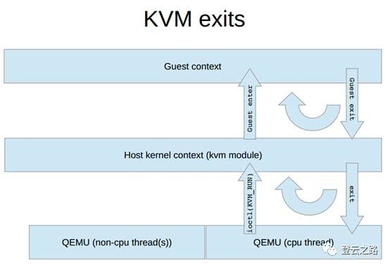
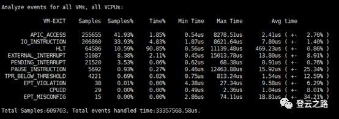

在虚机启动之后正常运行的过程中, 虚机就是在不断的经历 ioctl 进入, 返回, 进入, 返回的循环过程, 如下面的伪码所示.

```cpp
open("/dev/kvm")
ioctl(KVM_CREATE_VM)
ioctl(KVM_CREATE_VCPU)
for (;;) {
     ioctl(KVM_RUN)
     switch (exit_reason) {
     case KVM_EXIT_IO:  /* ... */
     case KVM_EXIT_HLT: /* ... */
     }
}
```

上述伪码是在用户空间中 QEMU 代码的实现模型, 在内核中的 KVM 实现中, 相关代码和用户空间类似, 也是在进入虚机运行, 等待虚机退出之后, 会依据退出事件类型调用不同的处理钩子函数. 唯一不同的是, 如果退出事件内核判断**内核层就可以处理完毕**, 就**不需要**再退出到**用户层**处理, 而是直接在内核层就直接转入虚机运行态. 这个过程如下图所示:



虚机的退出事件处理是虚机能正常运行的必要条件, 对虚机运行意义重大,

一个方面是**退出事件**的处理过程**消耗**对虚机性能表现**影响巨大**, 例如 virtio 本质上也是为了解决频繁的退出事件对虚机的影响提出的优化解决方案,

另一方面是退出事件是对**虚机运行情况最直观的反映**, 因为虚机在进入 vt-x 模式之后, 里面的运行情况外部来看其实是一个黑盒, 只有虚机在触发一定条件后退出 vt-x 模式, 宿主机才可以通过退出时携带的**状态数据**推测出当前虚机运行的关键信息, 进而可以**定位或者解决问题**.

# VM-EXIT 事件

`arch/x86/include/uapi/asm/svm.h`


触发虚机退出的事件有很多, 罗列如下:

`FAILED_VMENTRY、EXCEPTION_NMI、EXTERNAL_INTERRUPT、TRIPLE_FAULT、PENDING_INTERRUPT、NMI_WINDOW、TASK_SWITCH、CPUID、HLT、INVD、INVLPG、RDPMC、RDTSC、VMCALL、VMCLEAR、VMLAUNCH、VMPTRLD、VMPTRST、VMREAD、VMRESUME、VMWRITE、VMOFF、VMON、CR_ACCESS、DR_ACCESS、IO_INSTRUCTION、MSR_READ、MSR_WRITE、INVALID_STATE、MSR_LOAD_FAIL、MWAIT_INSTRUCTION、MONITOR_TRAP_FLAG、MONITOR_INSTRUCTION、PAUSE_INSTRUCTION、MCE_DURING_VMENTRY、TPR_BELOW_THRESHOLD、APIC_ACCESS、EOI_INDUCED、GDTR_IDTR、LDTR_TR、EPT_VIOLATION、EPT_MISCONFIG、INVEPT、RDTSCP、PREEMPTION_TIMER、INVVPID、WBINVD、XSETBV、APIC_WRITE、INVPCID、PML_FULL、XSAVES、XRSTORS`

但在虚机的正常运行过程中, 最常见的大概有那么几个, 后面部分会分不同小结对此进行陈述.

# vm-exit 跟踪

要**跟踪虚机的退出事件**, 需要使用必要的工具, 参考虚机退出的处理流程, 相对的可以有**不同的工具**来辅助处理. 例如在**内核层截获**这个**退出事件**可以使用**perf 工具**或者使用**SystemTap**, 在**用户层截获**退出事件并调试可以参考使用**gdb 工具**.

perf 及 gdb 都是比较好用的工具, 功能比较强大, 详细使用可以参考帮助手册.

## Perf

Perf 是一个 linux 平台上的性能调优工具, 多用于软件性能分析, 安装和使用 Perf 非常的容易.

Perf 主要是利用**PMU**、**tracepoint**和内核中的**特殊计数器**来进行**事件统计**, 通过这个可以**定位性能问题**, 也可以作为**探测工具**用于发现系统的一些其他**运行信息**.

这是使用 Perf 工具对虚机运行情况的一次跟踪, 从信息可以看出虚机在这段时间内, 是有很多次不同事件引起了 vm-exit.



## GDB

Gdb 是 GNU 开源组织发布的一个强大的 UNIX 下的程序调试工具.

我们在这里提到使用 Gdb 跟踪`vm-exit`事件主要是考虑可以跟踪进入 ioctl 之后退出逻辑的处理, 在这个退出逻辑里, 可以使用 Gdb 跟踪**用户层程序 qemu**对于 vm-exit 事件的**处理流程**.

## Qemu-event

在 qemu 里面追踪**event 事件**这个特性是由 qemu 提供的, 该功能主要用来进行 debug、性能分析或者监测 qemu 运行状况.

要使用该功能, 需要在编译 qemu 的时候增加配置项`--enable-trace-backends=simple`, 但打开这个配置项之后, qemu 的运行性能会有一定的损耗, 可以跟踪的`qemu-event`可以通过 qemu 提供的交互命令`info trace-events`列出来, 具体的使用可以参考 qemu 提供的功能说明文档进行操作. 不过因为使用这个工具需要重新编译 qemu, 使用上会有一些不方便.

# VM-RUN 整体处理逻辑

从前面的叙述也可以知道, `VM-Run`的最初发起方肯定是**qemu**的**一个 vcpu 线程**, 其通过调用 ioctl 系统函数进入 kvm 的 vcpu 处理逻辑, 之后会通过判断虚机当前的状态, 一切都合适的话会陷入 vmx-t 状态, 在虚机触发 vm-exit 之后, 会返回宿主机上下文, 然后处理当前的退出事件, 之后判断是否需要再次进入 vmx-t 状态. 其在 kvm 中, 代码上面的流程为:

```cpp
// virt/kvm/kvm_main.c
static long kvm_vcpu_ioctl(struct file *filp,
			   unsigned int ioctl, unsigned long arg)
{
    case KVM_RUN:
		r = -EINVAL;
		if (arg)
			goto out;
		if (unlikely(vcpu->pid != current->pids[PIDTYPE_PID].pid)) {
			/* The thread running this VCPU changed. */
			struct pid *oldpid = vcpu->pid;
			struct pid *newpid = get_task_pid(current, PIDTYPE_PID);

			rcu_assign_pointer(vcpu->pid, newpid);
			if (oldpid)
				synchronize_rcu();
			put_pid(oldpid);
		}
		r = kvm_arch_vcpu_ioctl_run(vcpu, vcpu->run);
		trace_kvm_userspace_exit(vcpu->run->exit_reason, r);
		break;
}
```

这里主要的调用函数是`kvm_arch_vcpu_ioctl_run`函数, 会依据当前的架构体系调用不同的函数, x86 上面的实现函数是:

```cpp
int kvm_arch_vcpu_ioctl_run(struct kvm_vcpu *vcpu,struct kvm_run *kvm_run)
```

在这个函数处理体中, 会再次进行一些状态判断, 例如本线程**是否有待处理信号**, 并对**多核架构**的系统判断**多核系统是否初始化完毕**, 没有的话, 会在这里进行一个**挂起操作**. 本函数最主要的入口点是`vcpu_run`, 在这个函数里面, 会真正实现循环进入虚机的处理体.

```cpp
static int vcpu_run(struct kvm_vcpu *vcpu)
```

从这个`while(1)`的循环中, 可以看出这里的退出逻辑是**进入虚机的调用返回小于等于的值**, 所以返回大于的话, 用户空间的 ioctl 调用会一直没有返回, 但即使没有返回用户层, 也不会导致本物理核上的其他进程迟迟得不到响应, 因为在最后会有一个类似 schedule 的调用.

本阶段最重要的实现函数是`vcpu_enter_guest`, 在这个函数里面会完成直接的状态判断, 模式切换, 并判断处理最后的 vmexit 事件.

```cpp
static int vcpu_enter_guest(struct kvm_vcpu *vcpu)

```

本函数是虚拟化切换最直接的处理函数, 功能实现的关键点涉及最多, 进入 vmx-t 模式运行是通过调用体系钩子函数`kvm_x86_ops->run(vcpu)`实现, 在之后的分类事件处理是通过体系注册钩子函数这个`kvm_x86_ops->handle_exit(vcpu)`实现, 对于 vmx 架构, 真实的函数体是在 vmx.c 文件里面的`static int (*const kvm_vmx_exit_handlers[])(struct kvm_vcpu *vcpu)`. 可以参考具体函数跟踪其实现.


# 参考

https://cloud.tencent.com/developer/news/210058