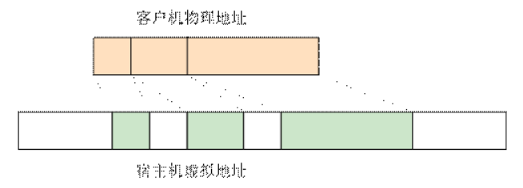
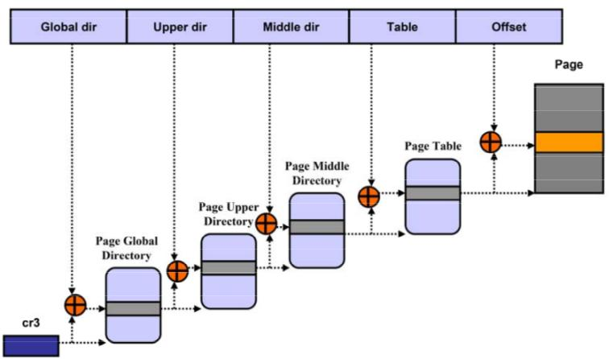
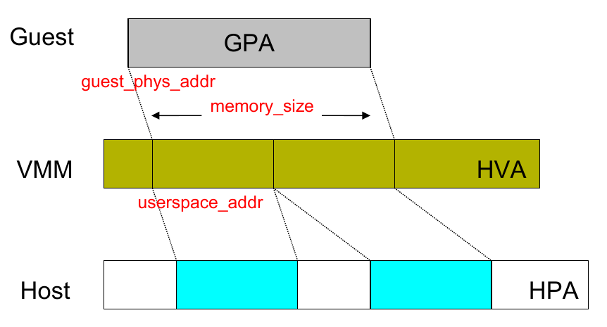
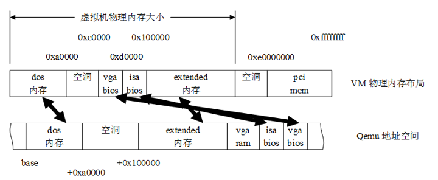

<!-- @import "[TOC]" {cmd="toc" depthFrom=1 depthTo=6 orderedList=false} -->

<!-- code_chunk_output -->

- [1. 客户机物理地址空间](#1-客户机物理地址空间)
- [2. 内存虚拟化的主要功能](#2-内存虚拟化的主要功能)
- [3. 传统的地址转换](#3-传统的地址转换)
- [4. 虚拟机的内存结构](#4-虚拟机的内存结构)
- [5. 四种地址以及转换关系](#5-四种地址以及转换关系)
  - [5.1. 客户机虚拟地址到客户机物理地址: GVA -> GPA](#51-客户机虚拟地址到客户机物理地址-gva---gpa)
  - [5.2. 客户机物理地址到主机虚拟地址: GPA -> HVA](#52-客户机物理地址到主机虚拟地址-gpa---hva)
  - [5.3. 主机虚拟地址到主机物理地址: HVA -> HPA](#53-主机虚拟地址到主机物理地址-hva---hpa)
- [6. 地址转换过程总结](#6-地址转换过程总结)
  - [6.1. 两种内存虚拟化方案](#61-两种内存虚拟化方案)
- [9. 参考](#9-参考)

<!-- /code_chunk_output -->

# 1. 客户机物理地址空间

为了实现内存虚拟化, 让**客户机**使用一个**隔离的**、**从零开始**且具有**连续的内存空间**, KVM 引入一层**新的地址空间**, 即**客户机物理地址空间 (Guest Physical Address, GPA**), 这个地址空间并**不是真正的物理地址空间**, 它只是**宿主机虚拟地址空间**在**客户机地址空间**的一个映射.

对**客户机**来说, **客户机物理地址空间**都是**从零开始的连续地址空间**, 但对于**宿主机**来说, **客户机的物理地址空间**并**不一定是连续的**, 客户机物理地址空间有可能映射在若干个不连续的宿主机地址区间, 如下图 1 所示:



# 2. 内存虚拟化的主要功能

QEMU-KVM 的内存虚拟化是由 QEMU 和 KVM 二者共同实现的, 其本质上是一个将 **Guest 虚拟内存**转换成 **Host 物理内存**的过程.

概括来看, 主要有以下几点:

* Guest 启动时, 由 **QEMU** 从它的**进程地址空间**申请**内存**并分配给 Guest 使用, 即**内存的申请**是在**用户空间 QEMU**完成的
* 通过 KVM 提供的 API, **QEMU** 将 **Guest 内存的地址信息**传递并**注册**到 KVM 中维护, 即**内存的管理**是由**内核空间**的 **KVM** 实现的
* 整个**转换过程**涉及 GVA、GPA、HVA、HPA **四种地址**, **Guest 的物理地址空间**从 **QEMU 的虚拟地址空间**中分配
* 内存虚拟化的关键在于维护 **GPA 到 HVA** 的**映射关系**, Guest 使用的依然是 Host 的物理内存

# 3. 传统的地址转换

**64 位 CPU** 上支持 **48 位的虚拟地址**寻址空间, 和 **52 位的物理地址**寻址空间.

Linux 采用 **4 级页表**机制将虚拟地址(VA)转换成物理地址(PA), 先从页表的基地址寄存器 CR3 中读取页表的起始地址, 然后加上页号得到对应的页表项, 从中取出页的物理地址, 加上偏移量就得到 PA.



# 4. 虚拟机的内存结构

QEMU 利用`mmap`系统调用, 在进程的虚拟地址空间中申请连续大小的空间, 作为 Guest 的物理内存.

QEMU 作为 Host 上的一个进程运行, Guest 的**每个 vCPU** 都是 QEMU 进程的一个**子线程**. 而 Guest 实际使用的仍是 Host 上的物理内存, 因此对于 Guest 而言, 在进行内存寻址时需要完成以下地址转换过程:

```cpp
  Guest 虚拟内存地址(GVA)
          |
    Guest 线性地址
          |
   Guest 物理地址(GPA)
          |             Guest
   ------------------
          |             Host
    Host 虚拟地址(HVA)
          |
      Host 线性地址
          |
    Host 物理地址(HPA)
```

其中, 虚拟地址到线性地址的转换过程可以省略, 因此 KVM 的内存寻址主要涉及以下四种地址的转换:

```
  Guest 虚拟内存地址(GVA)
          |
   Guest 物理地址(GPA)
          |             Guest
  ------------------
          |             Host
    Host 虚拟地址(HVA)
          |
    Host 物理地址(HPA)
```

其中, GVA->GPA 的映射由 Guest OS 维护, HVA->HPA 的映射由 Host OS 维护, 因此需要一种机制, 来维护 GPA->HVA 之间的映射关系.



常用的实现有 SPT(Shadow Page Table)和 EPT/NPT, 前者通过软件维护影子页表, 后者通过硬件特性实现二级映射.

# 5. 四种地址以及转换关系

1. GVA - Guest 虚拟地址

2. GPA - Guest 物理地址

3. HVA - Host 虚拟地址

4. HPA - Host 物理地址

## 5.1. 客户机虚拟地址到客户机物理地址: GVA -> GPA

Guest OS 维护的页表进行传统的操作, 客户机页表

## 5.2. 客户机物理地址到主机虚拟地址: GPA -> HVA

由于**客户机物理地址**不能直接用于**宿主机物理 MMU**进行寻址, 所以需要把**客户机物理地址**转换成**宿主机虚拟地址 (Host Virtual Address, HVA**).

**KVM 的虚拟机**实际上运行在**Qemu 的进程上下文**中. 于是, **虚拟机的物理内存**实际上是**Qemu 进程的虚拟地址**.

Kvm 要把**虚拟机的物理内存**分成**几个 slot**. 这是因为, 对计算机系统来说, **物理地址**是**不连续**的, 除了**bios**和**显存**要编入内存地址, **设备的内存**也可能**映射到内存**了, 所以内存实际上是分为一段段的.



为此, KVM 用一个`kvm_memory_slot`数据结构来记录**每一个地址区间**的**映射关系**, 此数据结构包含了对应此映射区间的**起始客户机页帧号 (Guest Frame Number, GFN**), 映射的**内存页数目**以及**起始宿主机虚拟地址**.

于是 KVM 就可以实现对**客户机物理地址**到**宿主机虚拟地址**之间的转换, 也即

- 首先根据**客户机物理地址**找到**对应的映射区间**,
- 然后根据此**客户机物理地址**在**此映射区间**的**偏移量**就可以得到其**对应的宿主机虚拟地址**.

## 5.3. 主机虚拟地址到主机物理地址: HVA -> HPA

通过**宿主机的页表**

# 6. 地址转换过程总结

**Guest OS**所维护的**页表**负责传统的从**guest 虚拟地址 GVA**到**guest 物理地址 GPA**的转换. 如果**MMU**直接装载 guest OS 所维护的页表来进行内存访问, 那么由于页表中每项所记录的都是**GPA**, **MMU 无法实现地址翻译**.

由于**宿主机 MMU 不能直接装载客户机的页表！！！** 来进行**内存访问**, 所以当**客户机**访问**宿主机物理内存**时, 需要经过**多次地址转换**. 即:

- **首先**根据**客户机页表**把**客户机虚拟地址**转换成**客户机物理地址**,
- 然后再通过**客户机物理地址**到**宿主机虚拟地址**之间的映射转换成**宿主机虚拟地址**,
- 最后再根据**宿主机页表**把宿主机虚拟地址转换成宿主机物理地址.

注意: **客户机页表基地址(即客户机 CR3**)是**客户机物理地址**, 当加载 CR3 时可以直接通过`kvm_memory_slot`进行转换成**宿主机虚拟地址**, 然后**在宿主机进行页表转换**, 得到**客户机页表基地**址的**真实物理地址**.

## 6.1. 两种内存虚拟化方案

显然通过这种映射方式, **客户机**的**每次内存访问**都需要 **KVM 介入！！！**, 并由**软件进行多次地址转换**, 其**效率是非常低**的.

因此, 为了**提高 GVA 到 HPA 转换的效率**, KVM 提供了**两种实现方式**来进行客户机虚拟地址到宿主机物理地址之间的直接转换.

其一是基于**纯软件**的实现方式, 也即通过**影子页表 (Shadow Page Table**) 来实现**客户虚拟地址**到**宿主机物理地址**之间的直接转换.

其二是基于**硬件对虚拟化**的支持, 来实现两者之间的转换. 下面就详细阐述两种方法在 KVM 上的具体实现.

# 9. 参考

https://my.oschina.net/liyufeng0803/blog/715989

