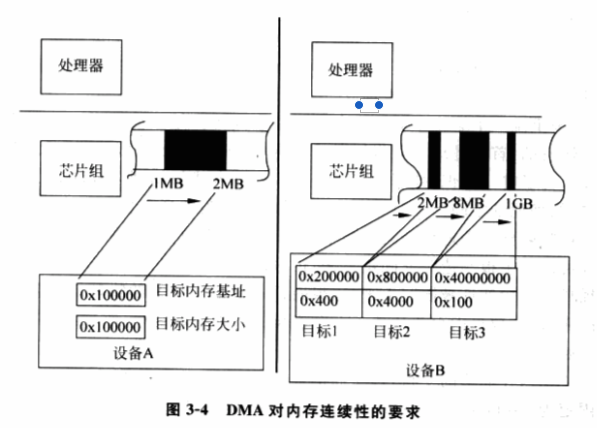
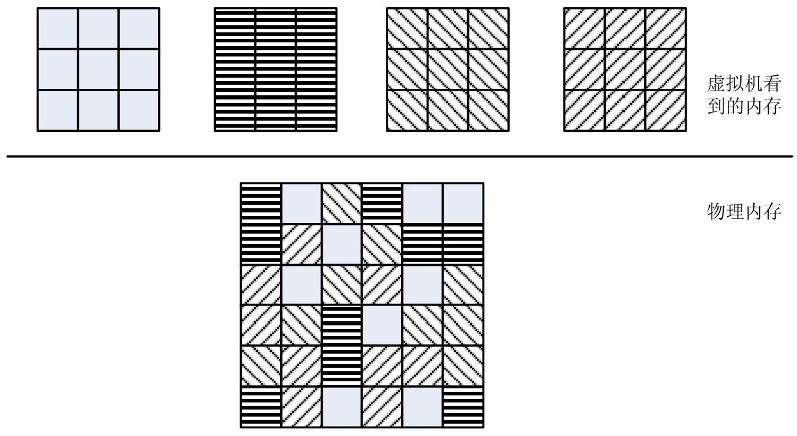

<!-- @import "[TOC]" {cmd="toc" depthFrom=1 depthTo=6 orderedList=false} -->

<!-- code_chunk_output -->

- [1. 背景](#1-背景)
- [2. 没有虚拟化的环境](#2-没有虚拟化的环境)
  - [2.1. 指令对内存的访问](#21-指令对内存的访问)
  - [2.2. 操作系统对内存的认知](#22-操作系统对内存的认知)
    - [2.2.1. Linux 内核可执行文件](#221-linux-内核可执行文件)
    - [2.2.2. DMA 操作](#222-dma-操作)
    - [2.2.3. 操作系统对内存的认知小结](#223-操作系统对内存的认知小结)
- [3. 虚拟化](#3-虚拟化)
  - [3.1. 内存虚拟化的目的](#31-内存虚拟化的目的)
  - [3.2. 内存虚拟化面临的问题](#32-内存虚拟化面临的问题)
  - [3.3. 内存虚拟化实现](#33-内存虚拟化实现)
    - [3.3.1. 内存虚拟化主要工作](#331-内存虚拟化主要工作)
    - [3.3.2. 系统的安全隔离](#332-系统的安全隔离)

<!-- /code_chunk_output -->

# 1. 背景

首先从一个**操作系统的角度**, 介绍其对物理内存存在的两个主要基本认识:

- **物理地址从 0 开始**

- 和**内存地址连续性**(至少在一些大的粒度上连续)

而**内存虚拟化**的产生, 主要源于 **VMM 与客户机操作系统！！！**在**对物理内存的认识**上存在冲突, 造成**物理内存的真正拥有者** \-\-\-\- **VMM**, 必须对**客户 OS**所访问的**内存**进行一定程度的**虚拟化**.

所以 VMM 满足客户机操作系统对内存的这两点要求, 这个欺骗过程, 就是**内存虚拟化**.

不仅仅如此, 实际上, **内存虚拟化**做到了:

- 既满足了**客户机操作系统**对于**内存和地址空间**的**特定认识**

- 也可以更好在**虚拟机之间**、**虚拟机与 VMM**之间进行**隔离**, 防止某个虚拟机内部的活动影响到其它的虚拟机甚至是 VMM 本身, 从而造成安全上的漏洞.

下面详细说明下.

# 2. 没有虚拟化的环境

先分析没有虚拟化的环境. 这种环境, 任何一个 OS 都认为自己完全控制处理器, 相应的就完全拥有了内存的所有权. 所以 OS 总是按照一台物理计算机上内存的属性和特征对其进行管理.

详细见第二章内存

## 2.1. 指令对内存的访问

**指令对于内存的访问**都是通过**处理器来转发**的, 首先**处理器**会将**解码后的信息请求**发送到**系统总线**上, 然后**由芯片组来负责进一步转发**.

为了**唯一标识**, 处理器使用**统一编址方式**将**物理内存映射成一个地址空间**, 即所谓的**物理地址空间**.

平时, 我们将**一根根内存条**插到主板上的**内存插槽**中, **每根内存条**都需要**被映射到物理地址空间中某个位置！！！**.

一般来说, **每根内存插槽！！！**在**物理地址空间的起始地址！！！**可以在**主板制造时就固定！！！**下来, 也可以通过某种方式由**BIOS 加电后自动设置！！！**. 一旦**内存插槽的起始地址被固定！！！**下来, 这根内存条上**每个字节的物理地址就相应确定！！！**下来了.

总的来说, **一根根内存条**形成了一个**连续的物理地址空间**, 而 **这个物理地址空间一定是从 0 开始！！！** 的.

例如 4 个内存插槽的主板, 每个插槽插上 256MB 的内存条, 如果 4 根插槽的起始地址分别固定为 0x00000000、0x10000000、0x20000000 和 0x30000000, 那么在它们上面的物理内存就被映射为 0x00000000 --- 0x0FFFFFFF、0x10000000 --- 0x1FFFFFFF、0x20000000 --- 0x2FFFFFFF、0x30000000 --- 0x3FFFFFFF 这 4 段. 总的来说, 这四根内存条组成了该系统 1GB 的内存, 而且这 1GB 内存是从 0 开始的连续空间, 4 根内存条上每个字节都会对应到唯一的物理地址. 处理器访问任何一个字节就是通过请求一个物理地址, 芯片组收到处理器发出的内存访问请求后, 会检测内核维护的物理地址空间的分配表, 当发现目标地址落在 0x00000000 --- 0x3FFFFFFF 范围内时, 处理器就会进一步将请求转发给内存控制器.

## 2.2. 操作系统对内存的认知

在**没有虚拟化的环境**中, **操作系统**也会**假定物理内存是从物理地址 0 开始**的.

### 2.2.1. Linux 内核可执行文件

以**x86 处理器上的 Linux**为例. 在 x86 上, **Linux 内核可执行文件头**里**定义了每个段的大小！！！**、期望在**物理地址空间！！！中被加载的位置**即**1MB！！！**, 以及**加载后执行第一条指令的地址！！！** 等, 这些信息在**编译链接阶段就确定下来**了.

由于**加载的位置是 1MB**, 那么对于后面代码, 其**访问的段！！！** 都是**基于 1MB 这个起始地址！！！** 的, 这也是在**编译链接阶段就确定下来**了的.

通常, 在**加载内核**时, 启动**加载程序(Boot Loader！！！** )就会通过**对该文件格式的分析**, 将**相应的段！！！复制到期望的位置！！！**, 然后**跳转到内核文件指定的入口点！！！**. 而**系统所做**的, **必须保证该指定位置存在可用内存**.

如果**物理地址空间不是从 0 开始**的, **Boot Loader**将会因指定位置**找不到可用内存而拒绝加载内核**, 及时加载内核到内存中, 由于内核代码在访问段时也会自身产生错误而造成整个系统的崩溃.

### 2.2.2. DMA 操作

除此之外, **现实**中**操作系统基本上对内存连续性**存在一定程度的**依赖性**, 如**DMA**. DMA 的目的就是允许**设备绕过处理器**来直接**访问物理内存**, 从而保证了 I/O 处理的高效. 目前绝大多数设备都支持 DMA 功能, 只是在实现上对驱动程序提出了不同的要求. 如图.

现实中设备在 DMA 的逻辑上要更复杂. 这是个**简化模型**.

左边的设备使用**最直接的方式**, 即驱动程序提供**DMA 的目标内存地址**0x100000 以及**大小**1MB, 然后设备顺序访问从 0x100000 到 0x200000 的内存. 很容易看到, 当一个内存页面大小小于 1MB 时, 就需要请求几个在**物理上连续的内存页面**, 以满足设备顺序访问内存的需求.

而右边设备使用了一种更加灵活的方式, 叫做"分散\-聚合"(Scatter\-Gather), 它允许驱动程序一次提供**多个物理上不连续的内存段**, 设备通过相关信息来离散地访问这些不连续的目标内存.

实际设备中, 这两种模式很普遍, 而且即使后一种模式, **设备允许的离散块数目是有限的**, 为支持**更大的 DMA 区域**, 驱动程序仍然会在**每一个离散块**中分配**多个连续的内存页面**, 这就意味着驱动必须从 OS 中分配到足够多连续的空闲内存页来满足 DMA 的要求.

### 2.2.3. 操作系统对内存的认知小结

总之, 在**没有虚拟化**情况下, **操作系统**在对**内存的使用**与管理已经达成以下两点认识.

1) 内存都是从**物理地址 0**开始的.

2) 内存都是**连续**的, 或者说至少在一些**大的粒度**(如 256MB)上连续.

# 3. 虚拟化

## 3.1. 内存虚拟化的目的

从上面操作系统对物理内存的假定和认知,  在**虚拟化环境**里, VMM 的任务就是模拟使得**模拟出来的内存**仍然符合**客户机操作系统**对**内存**的假定和认识.

因此, 在**虚拟化环境**中, 内存虚拟化的目的有两个.

* 提供给**虚拟机**一个**从零地址开始的连续物理内存空间**.
* 在各虚拟机之间有效隔离、调度和共享内存资源.

## 3.2. 内存虚拟化面临的问题

因此,  **内存虚拟化**面临的问题是:

* **物理内存**要被**多个客户机操作系统同时使用**, 但**物理内存只有一份**, **物理起始地址 0 也显然只有一个**, 无法同时满足**所有客户机操作系统内存从 0 开始的要求**;

* 由于使用**内存分区方式！！！**, 把**物理内存**分给**多个客户机操作系统使用**, 客户机操作系统的**内存连续性要求！！！** 虽然能得到解决, 但内存的使用效率非常不灵活.

## 3.3. 内存虚拟化实现

在面临这些问题的情况下, 内存虚拟化的核心, 在于引入了一层新的地址空间 --- **客户机物理地址空间**.

图 3\-5 中, **VMM！！！** 负责**管理和分配**每个**虚拟机的物理内存！！！**, **客户机 OS！！！** 看到的是一个虚构的**客户机物理地址空间！！！**, 其**指令目标地址！！！** 也是一个**客户机物理地址！！！**.

在**虚拟化环境**下, 这样的地址是不能被直接发送到系统总线上, 需要**VMM！！！** 负责将**客户机物理地址！！！** 首先转换成一个**实际物理地址！！！** 后, 再交给**物理处理器**来执行.

值得一提的是, 为**更有效利用空闲的物理内存**, 尤其是系统长期运行后产生的碎片, VMM 通常会以比较小的粒度(如 4KB)进行分配, 这就会造成了给定一个虚拟机的物理内存实际上是不连续的问题, 其具体位置完全取决于 VMM 的内存分配算法.

### 3.3.1. 内存虚拟化主要工作

由于引入了**客户机物理地址空间**, **内存虚拟化**就主要处理以下两个方面的问题.

1) 给定一个虚拟机, 维护**客户机物理地址**到**宿主机物理地址之间的映射关系！！！**.

2) **截获！！！** 虚拟机**对客户机物理地址的访问**, 并根据所记录的映射关系, 将其**转换**成**宿主机物理地址**.

第一个问题相对比较简单, 因为这只是一个数据结构的映射问题. 在实现过程中, 客户机 OS 采用客户页表维护了该虚拟机里进程所使用的虚拟地址到客户机物理地址的动态映射关系; VMM 负责维护客户机物理地址到宿主机物理地址之间的动态映射关系.

第二个问题相对复杂, 也是**衡量一个虚拟机的性能**最重要的方面. 再者, 地址转换一定要发生在物理处理器处理目标指令之前, 否则一旦客户机物理地址被直接发送到系统总线上, 会造成严重的破坏.

一个最简单的办法, 设法让虚拟机对客户机物理地址空间的每一次访问都触发异常, 然后由 VMM 来查询地址转换表模拟其访问. 这种方法完备性和正确性没问题, 但性能是最差的, 其它方法见后续.

### 3.3.2. 系统的安全隔离

内存虚拟化还实现了**整个系统**的**安全隔离**, 包括**虚拟机之间**, **虚拟机与 VMM 之间**.

(1) VMM 通过处理器硬件功能使得客户机操作系统完全运行在不同的地址空间, 或通过段限制使客户机 OS 所能"看见"的空间大小, 以保证 VMM 自身的安全性, 从而防止虚拟机触及 VMM 自身的运行状态.

(2) VMM 通过特殊权限验证机制使客户机 OS 局限在给定的地址空间里, 以保证一个虚拟机只能访问分配给它的内存页.

(3) VMM 通过硬件技术, 防止虚拟机利用设备可以通过 DMA 方式绕过处理器而直接访问目标内存的特点, 恶意访问设备的 DMA 目标寄存器, 进而通过设备越权访问所有物理内存.

