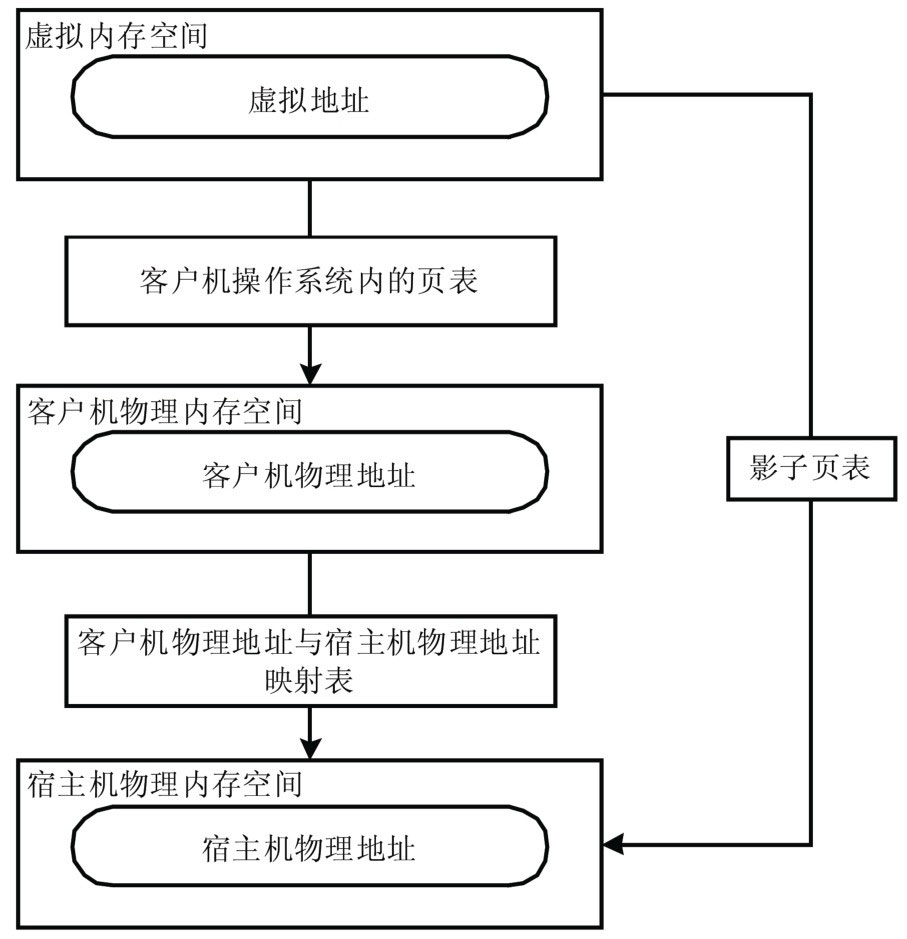
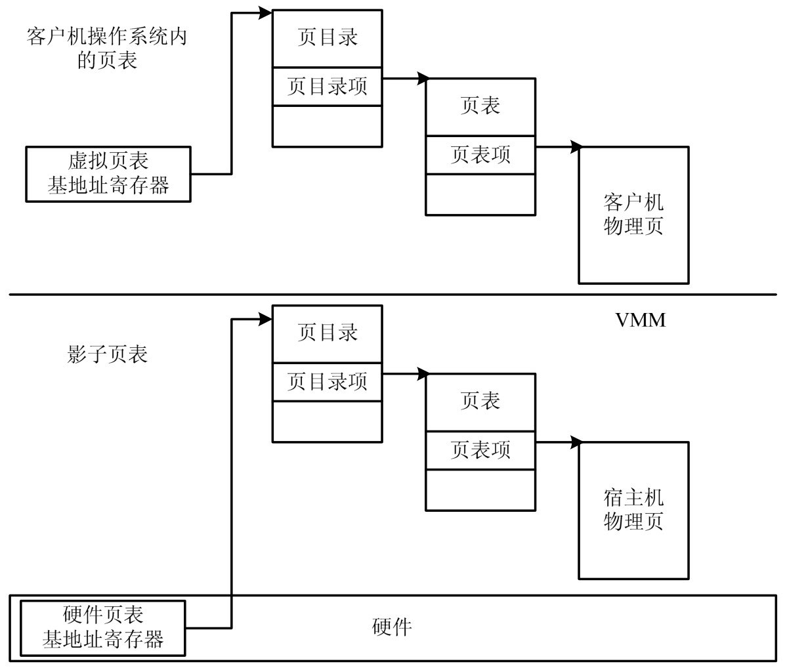

<!-- @import "[TOC]" {cmd="toc" depthFrom=1 depthTo=6 orderedList=false} -->

<!-- code_chunk_output -->

- [内存虚拟化的目的](#内存虚拟化的目的)
- [概述](#概述)
- [影子页表](#影子页表)

<!-- /code_chunk_output -->

# 内存虚拟化的目的

内存虚拟化的目的有两个.

- 提供给虚拟机一个从零地址开始的连续物理内存空间.

- 在各虚拟机之间有效隔离、调度和共享内存资源.

# 概述

为了让客户机 OS 使用一个隔离的、从零开始且具有连续性的内存空间, VMM 引入一层新的地址空间, 即客户机物理地址空间. 客户机物理地址空间是客户机操作系统所能"看见"和管理的物理地址空间, 这个地址空间不是真正的物理地址空间, 它和物理地址空间还有一个映射. 有了客户机物理地址空间, 就形成了从应用程序所在的客户机虚拟地址(`Guest Virtual Address`, GVA)到客户机物理地址(Guest Physical Address, GPA), 再从客户机物理地址 GPA 到宿主机物理地址(Host Physical Address, HPA)的两层地址转换. 前一个转换由客户机 OS 完成, 后一个转换由 VMM 负责.

为实现从客户机物理地址 GPA 到宿主机物理地址 HPA 的地址翻译, VMM 为**每个虚拟机**动态地维护了一张从**客户机物理地址**到**宿主机物理地址**映射关系的**表**.

有了这张表之后, VMM 截获**任何试图修改客户机页表**或**刷新 TLB 的指令**, 根据这张表, 将修改从客户机虚拟地址到客户机物理地址映射的操作, 变成修改客户机虚拟地址到相应的宿主机物理地址映射的操作.

自从有了这张表, 虽然宿主机物理地址只有一个零起始地址, 但在不同客户机物理地址空间里, 可以各有一个零起始地址, 而且客户机 OS 看来连续的客户机物理内存地址空间, 其对应的宿主机物理内存可能是不连续的, 而这增加了 VMM 为多个虚拟机分配宿主机物理内存时的灵活性, 提高了宿主机物理内存的利用率.

VMM 还可以通过该表确保运行于同一宿主机上的不同客户机访问的是不同的物理内存, 即相同的客户机物理地址呗映射到了不同的宿主机物理地址上. 这样一来, 一个客户机只能访问 VMM 通过该表设置分配给它的宿主机物理内存, 而不能访问其他客户机拥有的宿主机物理内存.

有时, VMM 使用页共享技术以写时复制(Copy On Write)的方式让不同的客户机可以共享包含相同数据的宿主机物理页, 删除多余的页备份. 这种页共享方式, 是通过将不同客户机的某些客户机物理地址映射到相同的宿主机物理地址上, 来实现共享这个宿主机物理地址对应的宿主机物理页.

除此以外, VMM 可以在客户机完全不知情情况下, 将客户机所拥有的某一客户机物理页映射到另一张新的宿主机物理页上, 甚至可以将客户机所拥有的某一客户机物理页所对应的宿主机物理页换出到硬盘上, 而客户机仍然以为它访问的客户机物理页是普通的硬件内存资源. 只有当它被真正访问, VMM 才将换出的页再次换入到宿主机内存中.

# 影子页表

客户机 OS 所维护的页表负责传统的从客户机虚拟地址 GVA 到客户机物理地址 GPA 的转换. 如果 MMU 直接装载客户机 OS 所维护的页表来进行内存访问, 那么由于页表中每项所记录的都是 GPA, 硬件无法正确通过多级页表来进行地址翻译.

针对这一问题, **影子页表(Shadow Page Table**)是一个有效地解决方法. 如图 4\-10, **一份影子页表**与**一份客户机 OS 系统的页表对应**, 其做的是由**GVA 直接到 HPA**的地址翻译.

影子页表的作用:

1. MMU 的虚拟化

在有虚拟化的情况下, 如果 MMU 直接装载客户机操作系统所维护的页表来进行内存访问, 那么由于页表中所记录的都是 GPA, 硬件无法正确地通过多级页表来进行地址翻译. 所以, VMM 还需要对 MMU 实现虚拟化.

客户机操作系统所能看到和操作的都是虚拟 MMU, 客户机操作系统所维护的页表只是被客户机操作系统载入到虚拟 MMU 中, 不能被物理 MMU 直接使用. VMM 在物理 MMU 中载入的是影子页表. 其原理如图 2-7 所示.

图 2-7 客户机操作系统页表与影子页表

在影子页表的实现过程中, 影子页表的页表结构并不一定与客户机页表的页表结构完全一致, 比如在 64 位机上模拟 32 位机, 客户机的页表结构便与宿主机不同, 但只要保证相对于同一个虚拟地址, 在影子页表中最后的那级页表的页表项, 所指向的宿主机物理页是且必须是客户机物理页在客户机物理地址与宿主机物理地址映射表中相对应的宿主机物理页.

2. 影子页表的建立与维护

影子页表的建立与维护过程交织在一起, 贯穿于 VMM 针对客户机操作系统修改客户机页表和刷新 TLB 所做的操作中, 主要包括三种: VMM 对客户机操作系统修改客户机 CR3 寄存器的截获与处理、VMM 对客户机操作系统 INVLPG 指令的截获与处理, 以及 VMM 对因客户机页表和影子页表不一致而触发的缺页异常的截获与处理. 其中最后一种发生概率最高, 也最复杂.

(1) 缺页异常的分类

我们首先介绍缺页异常的分类, 对于不同类型的缺页异常, 其处理方式往往也是不同的. 常见的缺页异常包括以下三类.

1) 影子页表初始化时的缺页异常.

开始时, VMM 中与客户机操作系统所拥有的页表相对应的影子页表是空的, 但是影子页表又是载入到物理 CR3 中真正为物理 MMU 所利用进行寻址的页表, 因此, 开始时任何的内存访问操作都会引起缺页异常. 如果客户机操作系统为所访问的客户机虚拟地址分配了客户机物理页, 即客户机操作系统的当前页表中包含了从这个客户机虚拟地址到已经分配了的某一客户机物理页地址的映射, 那么, 正是由于影子页表中相应的从客户机虚拟地址到宿主机物理地址的映射尚未初始化造成了这种异常的发生. 处理这种异常的过程也就是完成影子页表初始化的过程.

2) VMM 将宿主机物理页换出到硬盘上引发的缺页异常.

VMM 在客户机操作系统不知情的情况下, 将分配给客户机的宿主机物理页换出到硬盘上, 那么, 虽然客户机操作系统为所访问的客户机虚拟地址分配了客户机物理页, 但是由于 VMM 没在影子页表中为这个客户机虚拟地址建立相应的到宿主机物理地址的映射, 便会引发缺页异常.

3) 客户机上的缺页异常

如果客户机操作系统尚未给这个客户机虚拟地址分配客户机物理页, 即相应的客户机操作系统页表中没有这个客户机虚拟地址到某一客户页的映射, 这时也会引发缺页异常. 此外, 还有客户机所访问的客户页表项存在位(Present Bit)为 0, 或者写一个只读的客户机物理页, 也会引起缺页异常.

(2) 影子页表的缺页处理机制

VMM 首先截获到缺页异常的发生, 并将发生异常的客户机虚拟地址在客户机页表中对应页表项的访问权限位与缺页异常的错误码进行比较, 从而检查此缺页异常是否是由客户机本身引起的. 对于由客户机本身引起的缺页异常,  VMM 将直接返回客户机操作系统, 再由客户机操作系统的缺页异常处理机制来处理该缺页异常; 如果缺页异常不是由客户机引起的, 那么它必定是由于客户机页表和影子页表不一致, 这样的异常也叫"影子缺页异常". 对于影子缺页异常, VMM 会根据客户机页表同步影子页表. 同步影子页表的过程如下.

1) VMM 根据客户机页表项建立起相应的影子页目录和页表结构.

以 x86 架构上最简单的二级页表为例, 介绍影子页目录和页表结构的建立过程. 当客户机操作系统进入保护模式之前, 会为第一个保护模式的进程准备好客户机 CR3 寄存器的值, 我们将该值右移 12 位后称为客户机页帧号(Guest Frame Number, GFN). 每帧代表一个内存页. VMM 在为它建立影子页表时, 会根据 GFN 找到与之相对应的映射在宿主机上的物理页帧号(Machine Frame Number, MFN). 客户机认为存储在该 GFN 中的数据实际上是存储在 MFN 中的.

VMM 要从宿主机的物理内存中新分配一个物理页, 该物理页的起始地址右移 12 位后称为影子宿主机物理页帧号(Shadow Machine Frame Number,  SMFN). VMM 将这个新分配的物理页的起始地址载入物理 CR3 寄存器, 指向相应的客户机进程的影子页表. 客户机操作系统总会切换进程, 当这个进程再次被调度执行时, VMM 不需要重新分配新的宿主机物理页, 只需要找到以前为它分配的可载入物理 CR3 寄存器的宿主机物理页(即 SMFN)即可. 所以,  VMM 要在 GFN、MFN 和 SMFN 之间建立一定的联系, 而 GFN 和 MFN 是一对一的关系, 只需建立 MFN 和 SMFN 的关系. 建立 MFN 和 SMFN 之间的关系最常用的算法是 HASH 表, 以 MFN 的值和 SMFN 所对应的影子页表的类型 type(type 通常指在影子页表中是第几级页表, 也有其他特殊类型)为键值来索引 SMFN, SMFN=hash(MFN,type).

宿主机物理页已经载入了物理 CR3 寄存器, 对于两级页表来讲, 每张影子页表有 1024 个页表项, 每个页表项对应客户机页表相应位置的页表项. 客户机页表项的存在位如果为 1(即客户机物理页存在), 则 VMM 会为相应的影子页表的页表项填入宿主机物理地址. 如果该页表项所处的页表不是页表结构中的最后一级页表(即存储的是指向其他页表的指针), 那么根据客户机页表项所含物理地址右移 12 位得到 GFN, 将其转换为相应的 MFN, 若 hash(MFN,type)存在, 则将 hash(MFN,type)(即 SMFN)填入该影子页表项的宿主机物理地址; 反之, VMM 需为其新分配宿主机物理页, 并为该宿主机物理页和客户机物理页映射的宿主机物理页在 HASH 表中建立映射关系, 以备下次使用.

2) VMM 根据发生缺页异常的客户机虚拟地址, 在客户机页表的相应页表项中得到与之对应的客户机物理地址.

3) 根据客户机物理地址, 在客户机物理地址与宿主机物理地址映射表中得到相应的宿主机物理地址, VMM 再把这个宿主机物理地址填入到影子页表项中.

在根据客户机页表项同步影子页表时, 除了要建立起相应的影子页表数据结构、填充宿主机物理地址到影子页表的页表项中外, VMM 还要根据客户页表项的访问位和修改位设置对应影子页表项的访问位和修改位.

(3) 影子页表总结

影子页表和客户机页表之间并不是时刻同步的, 只有在需要的时候才进行同步. 影子页表可以看做是客户机页表巨大的 TLB, 称为虚拟 TLB. 当客户机操作系统需要访问它的客户机页表时, 物理 MMU 真正访问的是被称为"虚拟 TLB"的影子页表.

当客户机页表被修改时, 若影子页表中对应该客户机页表的表项访问权限低于客户机页表表项的, VMM 会截获一个缺页异常, 这可以理解为 TLB 未命中, 它表示尽管客户机页表中所访问的是合法的地址映射, 但是影子页表中尚未建立起与之对应的映射, 即发生了影子缺页异常. 此时, VMM 根据客户机页表的客户机虚拟地址到客户机物理地址的映射, 在影子页表中建立相应的客户机虚拟地址到宿主机物理地址的映射, 并置相应的权限位, 就相当于 TLB 填充.

当客户机修改客户机页表的表项时, 由于客户机执行敏感指令重写 CR3 或执行 INVLPG 敏感指令刷新 TLB, VMM 将截获这一操作, 并对影子页表进行相应的修改, 刷新影子页表(即客户机页表的虚拟 TLB)中的全部或部分内容, 就相当于 TLB 刷新.

3. 影子页表的缺点

影子页表解决了传统的 IA32 架构下的内存虚拟化问题, 但是它的缺点也比较明显, 具体如下.

首先, 实现非常复杂, 需要考虑各种各样的页表同步情况.

其次, 影子页表的内存开销也很大, 需要为每个客户机进程对应的页表都维护一个"影子页表".

为解决这些问题, Intel 和 AMD 都提供了相应的技术, 直接在硬件上支持 GVA -> GPA -> HPA 的两次地址转换, 大大降低了内存虚拟化的难度, 同时也大大提高了内存虚拟化的性能.

