<!-- @import "[TOC]" {cmd="toc" depthFrom=1 depthTo=6 orderedList=false} -->

<!-- code_chunk_output -->

- [1. 概述](#1-概述)
- [2. 影子页表的缺点](#2-影子页表的缺点)
- [3. VT-x 支持](#3-vt-x-支持)
  - [3.1. EPT](#31-ept)
  - [3.2. VPID](#32-vpid)
- [4. Intel EPT](#4-intel-ept)
  - [4.1. EPT 原理](#41-ept-原理)
    - [4.1.1. 地址转换流程](#411-地址转换流程)
    - [4.1.2. EPT 页表的建立流程](#412-ept-页表的建立流程)
  - [4.2. EPT 的硬件支持](#42-ept-的硬件支持)
    - [4.2.1. VM-Execution 控制域的 Enable EPT 字段](#421-vm-execution-控制域的-enable-ept-字段)
    - [4.2.2. VM-Execution 控制域的 Extended page table pointer 字段](#422-vm-execution-控制域的-extended-page-table-pointer-字段)
    - [4.2.3. TLB、INVEPT 指令和 VPID](#423-tlb-invept-指令和-vpid)
    - [4.2.4. VM-Exit 信息域的 EPT Violation 相关字段](#424-vm-exit-信息域的-ept-violation-相关字段)
  - [4.3. EPT 的软件使用](#43-ept-的软件使用)
- [5. VPID](#5-vpid)
  - [5.1. 传统 TLB](#51-传统-tlb)
  - [5.2. TLB 项的 VPID 标识不同虚拟处理器的不同 TLB](#52-tlb-项的-vpid-标识不同虚拟处理器的不同-tlb)
  - [5.3. VPID 的软件使用](#53-vpid-的软件使用)
- [6. Linux 系统检查](#6-linux-系统检查)
  - [6.1. /proc/cpuinfo](#61-proccpuinfo)
  - [6.2. sysfs 文件系统](#62-sysfs-文件系统)
- [7. AMD NPT](#7-amd-npt)
- [ARM](#arm)
  - [内存映射](#内存映射)
  - [MMIO](#mmio)
  - [SMMU](#smmu)

<!-- /code_chunk_output -->

# 1. 概述

内存虚拟化的主要任务是实现地址空间的虚拟化.

由于引入了**客户机物理地址空间**, **内存虚拟化**通过**两次地址转换**来支持地址空间的虚拟机, 即 **客户机虚拟地址 GVA**  ->  **客户机物理地址 GPA**  ->  **宿主机物理地址 HPA**的转换.

其中,

- **GVA -> GPA**的转换是由**客户机软件决定**, 通常是**客户机 OS**通过**VMCS 中客户机状态域 CR3**指向的**页表**来指定;

- **GPA -> HPA**的转换是由**VMM 决定**, VMM 在将**物理内存分配给客户机时**就确定了**GPA -> HPA**的转换, VMM 通常会用**内部数据结构**来记录这个关系. VMM 为**每个虚拟机**动态地维护了一张**客户机物理地址**与**宿主机物理地址**映射表.

# 2. 影子页表的缺点

传统的 IA32 架构只支持一次地址转换, 即通过**CR3 指定的页表**实现"**虚拟地址**" -> "**物理地址**"的转换.

这和**内存虚拟化**所要求的**两次地址转换**产生**矛盾**.

可通过将**两次转换合并成一次转换**解决, 即 VMM 根据**GVA  ->  GPA  ->  HPA 的映射关系**, 计算出**GVA -> HPA 的映射关系**, 并将其写入"**影子页表**".

影子页表的作用:

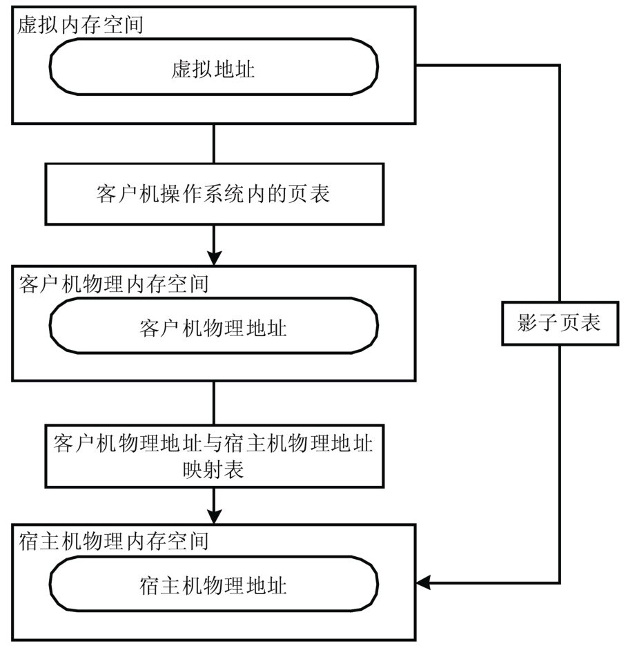

这样的软件方法尽管可以, 但缺点也很明显.

- 首先是**实现非常复杂**, 例如要考虑 **各种页表同步情况！！！** 等, 这样导致开发、调试和维护比较困难. 可参考 Xen/KVM 中影子页表的实现.
- 另外, **开销也很大**, 因为要为 **每个客户机进程对应的页表！！！** 都要维护一个"**影子页表**".

具体可以看 `第 4 章 基于软件的完全虚拟化`

# 3. VT-x 支持

## 3.1. EPT

为解决这个问题, VT-x 提供了 **Extend Page Table(EPT**)技术, 直接在**硬件支持 GVA -> GPA -> HPA 的两次地址转换**, 降低内存虚拟化的难度, 提高内存虚拟化性能.

## 3.2. VPID

此外, 为进一步**提高 TLB 的使用效率**, VT-x 还引入了 **Virtual Processor ID(VPID**)功能, 进一步增强内存虚拟化性能.

# 4. Intel EPT

## 4.1. EPT 原理


Intel EPT 技术引入了 EPT(Extended Page Table)和 EPTP(EPT base pointer)的概念. EPT 中维护着 GPA 到 HPA 的映射, 而 EPTP 负责指向 EPT.

在原有**客户机页表！！！** 对 **客户机虚拟地址！！！** 到 **客户机物理地址！！！**映射 (**CR3 页表地址映射！！！GVA -> GPA！！！**) 基础上, EPT 还引入了 **EPT 页表(GPA -> HPA！！！**) 来实现 **客户机物理地址**到**宿主机物理地址**的另一次映射.

这样, **GVA  ->  GPA  ->  HPA 两次地址转换！！！** 都由 **CPU 硬件自动完成！！！**. 二维地址翻译结构:

- **Guest** 维护自身的客户页表: `GVA->GPA`
- **EPT** 维护 `GPA->HPA` 的映射

图 5-13 描述了 EPT 基本原理.

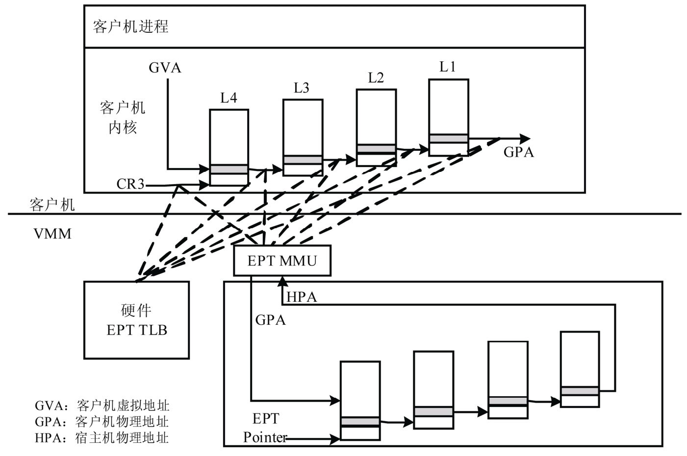

**客户机运行**时, **客户机页表基地址**被载入**物理 CR3**, 而**EPT 页表基地址**从**VMCS**中获取.

**客户机运行**时, **客户机页表**被载入 **物理 CR3**, 而 **EPT 页表**被载入专门的 **EPT 页表指针寄存器 EPTP**. 于是在进行地址转换时, 首先通过 CR3 指向的页表实现 GVA 到 GPA 的转换, 再通过 EPTP 指向的 EPT 完成 GPA 到 HPA 的转换. 当发生 EPT Page Fault 时, 需要 VM-EXIT 到 KVM, 更新 EPT.

- 优点: Guest 的缺页在 Guest OS 内部处理, 不会 VM-EXIT 到 KVM 中. 地址转化基本由硬件(MMU)查页表来完成, 大大提升了效率, 且只需为 Guest 维护一份 EPT 页表, 减少内存的开销

- 缺点: 两级页表查询, 只能寄望于 TLB 命中

**EPT 页表对地址的映射机理**与**客户机页表对地址的映射机理相同**, 下图 4 出示了一个页面大小为 4K 的映射过程:

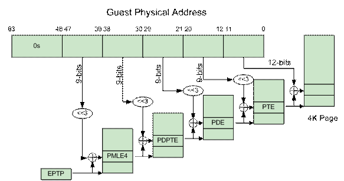

### 4.1.1. 地址转换流程

1. 处于`non-root`**模式**的**CPU**加载**guest 进程的 gCR3**;
2. gCR3 是**GPA**,cpu 需要通过**查询 EPT 页表**来实现`GPA->HPA`;
3. 如果没有, CPU 触发**EPT Violation**, 由**VMM 截获处理**;
4. 假设**客户机**有 **m 级页表**, **宿主机 EPT** 有 **n 级**, 在 TLB 均 miss 的最坏情况下, 会产生 **m*n 次内存访问**, 完成**一次客户机的地址翻译**;


注: 这里没有包括 gCR3 的访问, 带上 gCR3 就是 `<m+1> * n`

这里假设**客户机页表！！！**和**EPT 页表！！！**都是**4 级页表**, CPU 完成一次地址转换的基本过程如下.

CPU 首先查找 **Guest CR3** 指向的**L4 页表**. 由于**Guest CR3**给的是**GPA(！！！客户机物理地址, 不是客户机逻辑地址, 也不是宿主机物理地址！！！**), 因此 CPU 需要通过**EPT 页表！！！**来实现**Guest CR3 GPA -> HPA 的转换！！！**: CPU 首先会查看**硬件的 EPT TLB(因为 CR3 是 GPA！！！所以查找的是 EPT 的 TLB！！！**), 如果**没有对应的转换**, CPU 会**进一步查找 EPT 页表**, 如果还没有, CPU 则**抛出 EPT Violation 异常**由**VMM**来处理.

获取**L4 页表物理地址(！！！HPA！！！**)后, CPU 根据**GVA！！！**和**L4 页表项内容**, 获取**L3 页表项的 GPA！！！**. 如果 L4 页表中 GVA 对应的表项显示为"缺页", 那么 CPU 产生**Page Fault**, 直接交给**Guest Kernel！！！**处理. 注意, 这里**不会产生 VM-Exi！！！**t. 获得**L3 页表项的 GPA**后, CPU 同样要通过**查询 EPT 页表！！！来实现 L3 GPA -> HPA 的转换**, 过程和上面一样.

同样, CPU 依次查找 L2、L1 页表, 最后获得**GVA**对应的**GPA**, 然后通过**查询 EPT 页表获得 HPA**.

上图可以看出, CPU 需要**5 次！！！查询 EPT 页表(CR3\<L4 页表地址 GPA>、L3 页表地址、L2 页表地址、L1 页表地址和最终 GPA 查询 EPT 页表！！！**), **每次查询！！！**都需要**4 次内存访问(！！！每级页表都是一次内存访问！！！**), 最坏共**20 次内存访问**. EPT 硬件通过增大 EPT TLB 来尽量减少内存访问.

一个**GPA**到**HPA**的转换过程如下图.


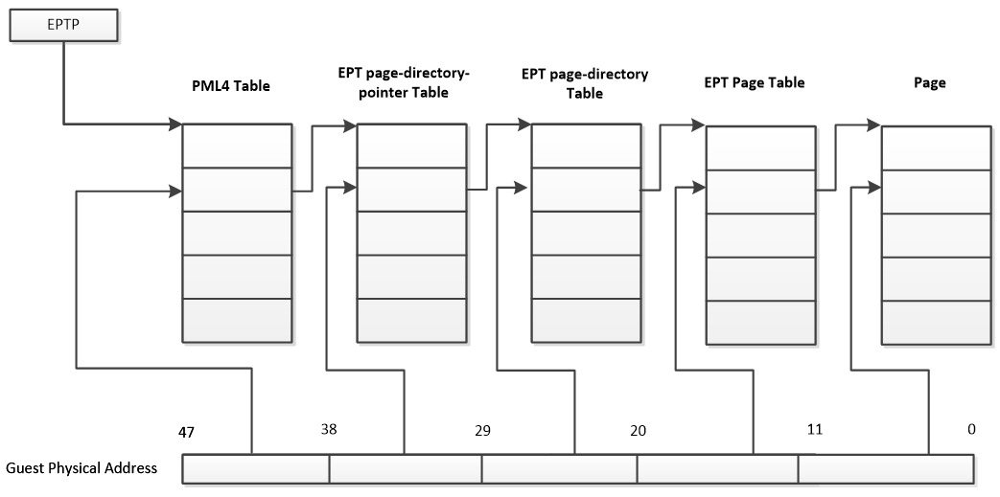

在**客户机物理地址 GPA**到**宿主机物理地址 HPA**转换的过程中, 由于缺页、写权限不足等原因也会导致客户机退出, 产生 **EPT 异常**.

注意: 上面的**EPT TLB**是用来缓存**客户机的 GPA**转换成**宿主机的 HPA**; 而在这之前, **客户机的 GVA 转成 GPA 是可以使用原始 TLB???**

### 4.1.2. EPT 页表的建立流程

1. 初始情况下: **Guest CR3**指向的**Guest 物理页面**为**空页面**;

2. **Guest 页表缺页异常**, KVM 采用**不处理 Guest 页表缺页**的机制, **不会导致 VM Exit**, 由**Guest 的缺页异常处理函数**负责分配**一个 Guest 物理页面(GPA**), 将该页面物理地址回填, 建立**Guest 页表结构**;

3. 完成该映射的过程需要将**GPA 翻译到 HPA**, 此时**该进程**相应的**EPT 页表为空**, 产生`EPT_VIOLATION`, 虚拟机退出到**根模式**下执行, 由 KVM 捕获该异常, 建立**该 GPA 到 HOST 物理地址 HPA 的映射**, 完成一套 EPT 页表的建立, **中断返回**, 切换到**非根模式**继续运行.

4. **VCPU 的 mmu**查询下一级**Guest 页表**, 根据 GVA 的偏移产生一条**新的 GPA**, Guest 寻址该 GPA 对应页面, 产生**Guest 缺页**, **不发生 VM_Exit**, 由 Guest 系统的缺页处理函数捕获该异常, 从 Guest 物理内存中选择一个空闲页, 将该 Guest 物理地址 GPA 回填给 Guest 页表;

5. 此时该**GPA**对应的**EPT 页表项不存在**, 发生`EPT_VIOLATION`, 切换到**根模式**下, 由 KVM 负责建立该`GPA->HPA`映射, 再切换回非根模式;

6. 如此往复, 直到**非根模式下 GVA**最后的偏移建立**最后一级 Guest 页表**, 分配 GPA, 缺页异常退出到根模式建立最后一套 EPT 页表.

7. 至此, **一条 GVA**对应在真实物理内存单元中的内容, 便可通过这**一套二维页表结构**获得.

在**客户机物理地址**到**宿主机物理地址转换**的过程中, 由于**缺页、写权限不足等原因**也会**导致客户机退出**, 产生 **EPT 异常**.

对于 **EPT 缺页异常**, KVM 首先根据**引起异常的客户机物理地址**, 映射到**对应的宿主机虚拟地址！！！**, 然后**为此虚拟地址分配新的物理页**, 最后 **KVM 再更新 EPT 页表**, 建立起引起**异常的客户机物理地址**到**宿主机物理地址**之间的映射. 对 **EPT 写权限**引起的异常, KVM 则通过**更新相应的 EPT 页表**来解决.

由此可以看出, **EPT 页表**相对于前述的影子页表, 其实现方式大大简化. 而且, 由于**客户机内部的缺页异常**也**不会致使客户机退出**, 因此**提高了客户机运行的性能**. 此外, KVM 只需为**每个客户机**维护**一套 EPT 页表**, 也大大**减少了内存的额外开销**.

## 4.2. EPT 的硬件支持

### 4.2.1. VM-Execution 控制域的 Enable EPT 字段

为了支持 EPT, VT-x 规范在**VMCS**的"**VM-Execution 控制域**"中提供了**Enable EPT 字段**. 如果在 VM-Entry 的时候该位被置, CPU 会使用 EPT 功能进行两次转换.

### 4.2.2. VM-Execution 控制域的 Extended page table pointer 字段

**EPT 页表的基地址**是由**VMCS"VM-Execution 控制域**"的**Extended page table pointer 字段**来执行的, 它包含了**EPT 页表的宿主机物理地址 HPA！！！**.

**EPT 是一个多级页表**, **每级页表**的 **表项格式是相同！！！** 的, 如表 5-8

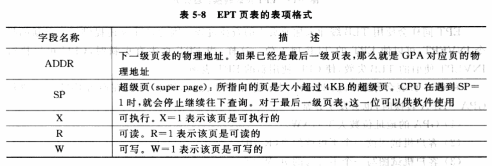

EPT 页表转换过程和**CR3 页表转换是类似**的. 图 5-14 展现了**CPU 使用 EPT 页表进行地址转换**的过程.

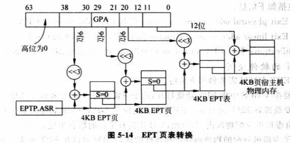

EPT 通过**EPT 页表**的**SP 字段！！！**支持大小为**2MB 或 1GB 的超级页**. 图 5-15 给出**2MB 超级页**的地址转换过程. 和上图不同在于, 当 CPU 发现**SP 字段为 1**时, 就停止继续向下遍历页表, 而是直接转换了.

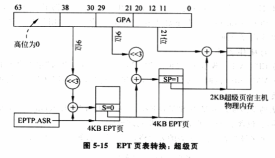

### 4.2.3. TLB、INVEPT 指令和 VPID

EPT 同样会使用**TLB 缓冲**来加速页表的查找过程. 因此, VT-x 还提供了一条新指令**INVEPT**, 可使 EPT 的 TLB 项失效. 这样, 当 EPT 页表有更新时, CPU 可以执行 INVEPT 使旧的 TLB 失效, 使 CPU 使用新的 EPT 表项.

VPID 下面讲到

### 4.2.4. VM-Exit 信息域的 EPT Violation 相关字段

和 CR3 页表会导致 Page Fault 一样, 使用 EPT 后, 如果 CPU 在**遍历 EPT 页表**进行**GPA -> HPA 转换**时, 也会发生异常.

1) GPA 的地址位数大于 GAW.

2) 客户机试图读一个不可读的页(R=0).

3) 客户机试图写一个不可写的页(W=0)

4) 客户机试图执行一个不可执行的页(X=0)

发生异常, CPU 会产生**VM-Exit！！！**, 退出原因是**EPT Violation！！！**. VMCS 的"**VM-Exit 信息域**"还包括如下信息.

- VM-Exit physical-address information: 引起 EPT Violalation 的**GPA**
- VM-Exit linear-address information: 引起 EPT Violation 的**GVA**
- Qualification: 引起**EPT Violation 的原因**, 如由于读或写引起等.

## 4.3. EPT 的软件使用

使用 EPT, VMM 需要做如下事情.

- 首先需要在**VMCS 中将 EPT 功能打开**, 这个只需要写 VMCS 相应字段即可.

- 其次需要设置好 EPT 的页表. **EPT 页表**反应了**GPA -> HPA 的映射关系**. 由于是**VMM 负责给虚拟机分配物理内存！！！**, 因此, VMM 拥有足够信息建立 EPT 页表. 此外, 如果 VMM 给虚拟机分配的物理内存足够连续的话, VMM 可以在**EPT 页表**中**尽量使用超级页**, 这样有利于**提高 TLB 的性能**.

- 当 CPU 开始使用 EPT 时, VMM 还需要处理**EPT Violation**.

通常, EPT Violation 的来源如下几种.

1) 客户机访问**MMIO 地址！！！**. 这时, VMM 需要将请求**转给 I/O 虚拟化模块！！！**.

2) **EPT 页表的动态创建**. 有些 VMM 采用懒惰方法, 一开始**EPT 页表为空**, 第一次使用发生 EPT Violation 时再建立映射.

由此, EPT 相对"影子页表", 大大简化了.

- 而且, 由于**客户机内存的 Page Fault 不用发生 VM-Exit**, 也大大**减少 VM-Exit 个数**, 提高了性能.
- 此外, **EPT 只需要维护一张 EPT 页表**, 不像"影子页表"那样需要为**每个客户机进程的页表维护一张影子页表**, 也**减少了内存的开销**.

# 5. VPID

## 5.1. 传统 TLB

**TLB**是**页表项**的缓存. TLB 需要和页表一起工作才有效. 因此, 当**页表发生切换**时, **TLB 原有内容也就失效**了, CPU 需要使用 **INVLPG 指令**使其**所有项失效**, 这样才不会影响之后页表的工作. 例如, 进程切换时, 通过切换 CR3 切换进程地址空间, 使前一个进程的 TLB 项全部失效.

类似, **每次 VM-Entry**和**VM-Exit**时, CPU 会**强制 TLB 内容全部失效！！！**, 以避免 **VMM** 以及**不同虚拟机虚拟处理器**之间 TLB 项的混用, 因为**硬件无法区分！！！**一个 **TLB** 项属于 **VMM** 还是**特定虚拟机的虚拟处理器**.

## 5.2. TLB 项的 VPID 标识不同虚拟处理器的不同 TLB

**VPID** 是一种硬件级的对 TLB 资源管理的优化. 通过在**硬件上**为**每个 TLB 项增加一个标志**, 来**标识不同的虚拟处理器地址空间**, 从而区分开**VMM**以及**不同虚拟机的不同虚拟处理器**的 TLB. 即, **硬件**具备了区分**不同的 TLB 项**属于**不同虚拟处理器地址空间**(对应**不同的 vCPU**)的能力.

这样,

- 硬件可以**避免**在**每次 VM-Entry**和**VM-Exit**时, 使**全部 TLB 失效！！！**, 提高 VM 切换效率.
- 并且, 由于这些继续存在的 TLB, 硬件也避免了 VM 切换后的一些**不必要页表遍历**, 减少内存访问, 提高了 VMM 以及虚拟机运行速度.

由于每个虚拟处理器都有自己的 VPID, VMM 在切换虚拟处理器时, 只需根据新的 VPID 快速定位和加载对应的 TLB 上下文, 而无需完全刷新 TLB, 减少了上下文切换的开销, 提高了系统的性能和响应速度.


VT-x 通过在**VMCS**中增加**两个域**来支持 VPID.

- 一个是 VMCS 中的**Enable VPID 域**, 当该域被置上, VT-x 硬件会开启 VPID 功能.
- 第二个是 VMCS 中的**VPID 域**, 标识该 VMCS 对应的 TLB. VMM 本身也需要一个 VPID, VT-x 规定虚拟处理器标志**0**被指定为用于**VMM 自身**.

注意: **VPID** 是和 **VCPU** 对应的, **不是**和**虚拟机**本身

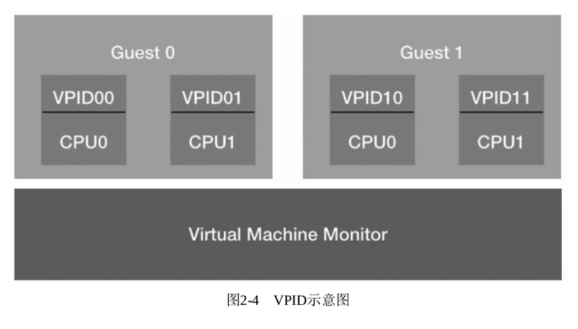

## 5.3. VPID 的软件使用

因此, **软件**上使用 VPID 很简单, 两件事.

- 首先为 VMCS**分配一个 VPID**, 只要是非 0 的且和其它 VMCS 的 VPID 不同即可;
- 其次是 VMCS 中 **Enable VPID 置位**.

# 6. Linux 系统检查

## 6.1. /proc/cpuinfo

对于内存虚拟化**EPT**以及**vpid**的支持查询

```
[root@kvm-host ~]# grep -E "ept|vpid" /proc/cpuinfo
```

## 6.2. sysfs 文件系统

在**宿主机**中, 可以根据**sysfs 文件系统**中**kvm\_intel 模块**的**当前参数值**来确定 KVM 是否打开**EPT 和 VPID**特性.

在默认情况下, 如果硬件支持了 EPT、VPID, 则**kvm\_intel 模块加载**时**默认开启 EPT 和 VPID**特性, 这样 KVM 会默认使用它们.

```
[root@kvm-host ~]# cat /sys/module/kvm_intel/parameters/ept
Y
[root@kvm-host ~]# cat /sys/module/kvm_intel/parameters/vpid
Y
```

在加载 kvm\_intel 模块时, 可以通过**设置 ept**和**vpid 参数**的值来**打开或关闭 EPT 和 VPID**.

当然, 如果 kvm\_intel 模块已经处于**加载状态**, 则需要**先卸载**这个模块, 在**重新加载**之时加入所需的参数设置. 当然, 一般不要手动关闭 EPT 和 VPID 功能, 否则会导致客户机中内存访问的性能下降.

```
[root@kvm-host ~]# modprobe kvm_intel ept=0,vpid=0
[root@kvm-host ~]# rmmod kvm_intel
[root@kvm-host ~]# modprobe kvm_intel ept=1,vpid=1
```

# 7. AMD NPT

AMD NPT(Nested Page Table, 嵌套页表)是 AMD 提供的内存虚拟化支持技术.

如图 2-9 所示, 传统的分页技术下的地址转换是直接将线性地址空间上的线性地址转换为物理地址空间上的物理地址. CR3 寄存器中存储着页表的物理基地址.

图 2-9 传统分页技术下的地址转换:

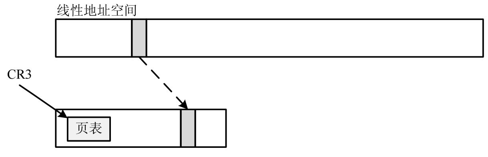

嵌套分页技术的原理如图 2-10 所示.

1) 客户机和宿主机都有自己的 CR3 寄存器, 分别记为 gCR3(guest CR3)和 nCR3(nested CR3). 真正的 CR3 由 VMM 所控制和使用.

2) gPT(guest Page Table, 客户机页表)负责将客户机线性地址转换为客户机物理地址. 客户机页表存在于客户机物理内存中, 并由 gCR3 索引.

3) nPT(nested Page Table, 嵌套页表)负责将客户机物理地址转换为系统物理地址. 嵌套页表存在于系统物理内存中, 并由 nCR3 索引.

4) 最常用到的客户机线性地址到系统物理地址的映射关系在 TLB 中缓存.

5) gCR3 和客户机页表中存放的都是客户机物理地址, 所以, 在访问客户机页表前需要将客户机物理地址转换为系统物理地址.

图 2-10 嵌套分页技术下的地址转换:

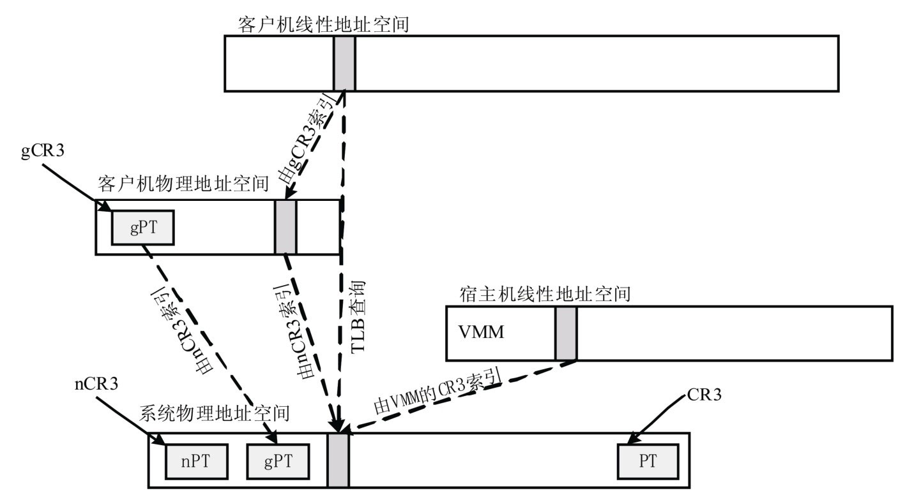

# ARM

`Stage 2 translation`. 与内存虚拟化息息相关, 这部分内容不仅包括常规的内存映射访问, 还包含了基于内存映射的I/O(MMIO)访问, 以及系统内存管理单元(SMMUs)控制下的内存访问.

## 内存映射

OS在访问物理内存前, 需要先建立页表来维护虚拟地址到物理地址的映射关系, 下边这张图可以认为是Stage 1转换:

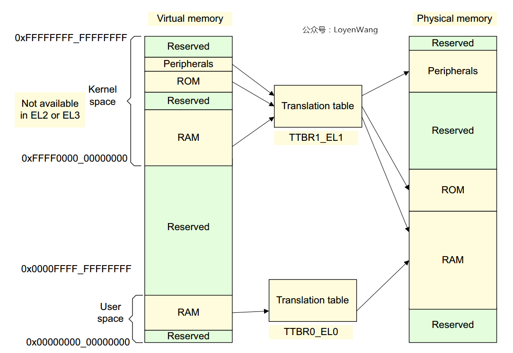

* 当有了虚拟机时, 情况就不太一样了, 比如Qemu运行在Linux系统之上时, 它只是Linux系统的一个用户进程, Guest OS所认为自己访问的物理地址, 其实是Linux的用户进程虚拟地址, 到最终的物理地址还需要进一步的映射;

* Hypervisor可以通过Stage 2转换来控制虚拟机的内存视图, 控制虚拟机是否可以访问某块物理内存, 进而达到隔离的目的;

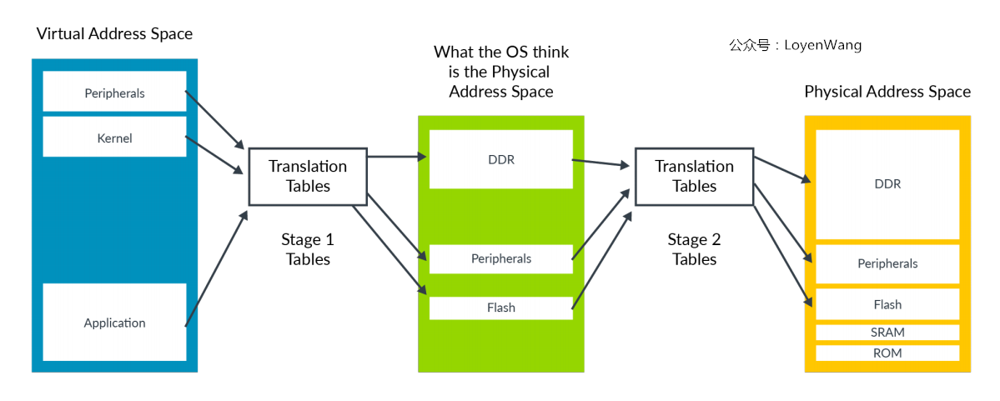

整个地址的映射分成了两个阶段:

* Stage 1: VA(Virutal Address) -> IPA(Intermediate Physical Address), 操作系统控制Stage 1转换;

* Stage 2: IPA(Intermediate Physical Address) -> PA(Physical Address), Hypervisor控制Stage 2转换;

Stage 2转换与Stage 1转换机制很类似, 不同点在于Stage 2转换时判断内存类型是normal还是device时, 是存放进页表信息里了, 而不是通过MAIR_ELx寄存器来判断;

每个虚拟机(VM, Virtual Machine)都会分配一个VMID, 用于标识TLB entry所属的VM, 允许在TLB中同时存在多个不同VM的转换;

操作系统会给应用程序分配一个ASID(Address Space Identifier), 也可以用于标识TLB entry, 属于同一个应用程序的TLB entry都有相同的ASID, 不同的应用程序可以共享同一块TLB缓存. 每个VM都有自己的ASID空间, 通常会结合VMID和ASID来同时使用;

Stage 1和Stage 2的转换页表中, 都包含了属性的相关设备, 比如访问权限, 存储类型等, 在两级转换的过程中, MMU会整合成一个最终的也有效值, 选择限制更严格的属性, 如下图:

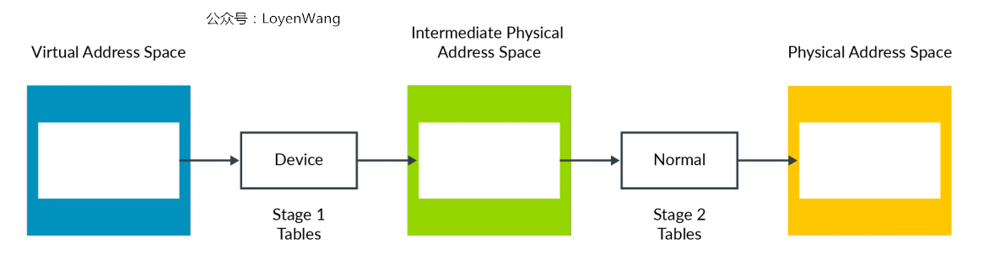

* 图中的Device属性限制更严格, 则选择Device类型;

* Hypervisor如果想要改变默认整合行为, 可以通过寄存器 HCR_EL2(Hypervisor Configuration Register)来配置, 比如设置Non-cacheable,  Write-Back Cacheable等特性;

## MMIO

Guest OS认为的物理地址空间, 实际是IPA地址空间, 就像真实物理机中一样, IPA的地址空间, 也分成内存地址空间和I/O地址空间:

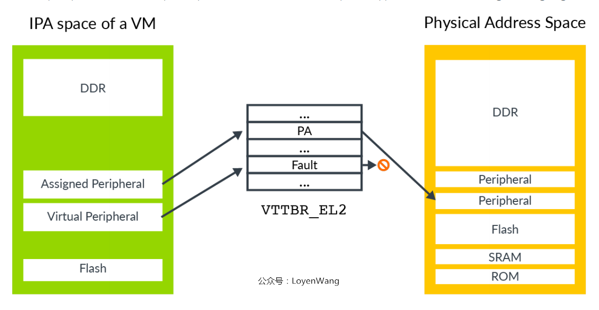

* 访问外设有两种情况: 1)直通访问真实的外设; 2)触发fault, Hypervisor通过软件来模拟;

* VTTBR_EL2: Virtualization Translation Table Base Register, 虚拟转换表基地址寄存器, 存放Stage 2转换的页表;

* 为了模拟外设, Hypervisor需要知道访问的是哪个外设以及访问的寄存器, 读访问还是写访问, 访问长度是多少, 使用哪些寄存器来传送数据等. Stage 2转换有一个专门的Hypervisor IPA Fault Address Register, EL2(HPFAR_EL2)寄存器, 用于捕获Stage 2转换过程中的fault;

软件模拟外设的示例流程如下:

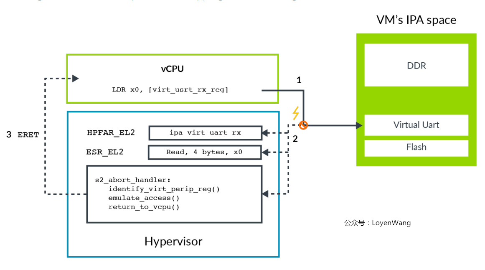

1) 虚拟机VM中的软件尝试访问串口设备;

2) 访问时Stage 2转换被block住, 并触发abort异常路由到EL2. 异常处理程序查询ESR_EL2(Exception Syndrome Register)寄存器关于异常的信息, 如访问长度、目标寄存器, Load/Store操作等, 异常处理程序还会查询HPFAR_EL2寄存器, 获取abort的IPA地址;

3) Hypervisor通过ESR_EL2和HPFAR_EL2里的相关信息对相关虚拟外围设备进行模拟, 完成后通过ERET指令返回给vCPU, 从发生异常的下一条指令继续运行;

## SMMU

SMMUs(System Memory Management Units)

访问内存的另外一种case就是DMA控制器.

非虚拟化下DMA控制器的工作情况如下:

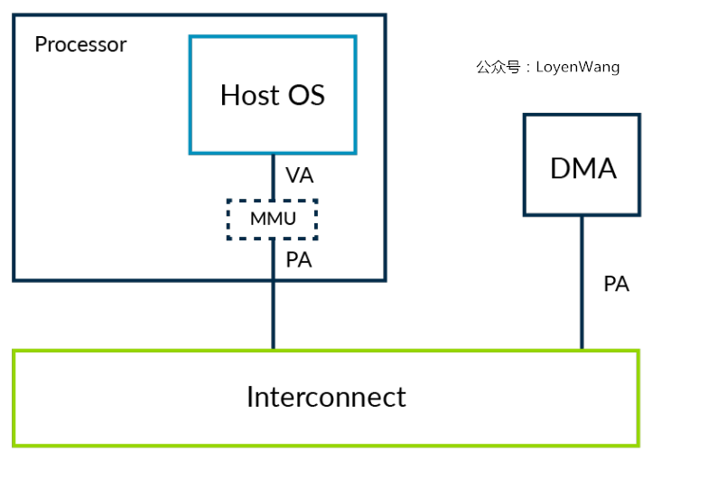

DMA控制器由内核的驱动程序来控制, 能确保操作系统层面的内存的保护不会被破坏, 用户程序无法通过DMA去访问被限制的区域;

虚拟化下DMA控制器, VM中的驱动直接与DMA控制器交互会出现什么问题呢？如下图:

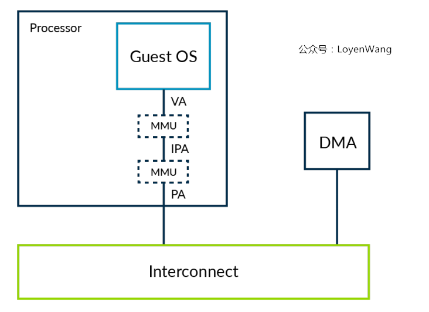

* DMA控制器不受Stage 2转换的约束, 会破坏VM的隔离性;

* Guest OS以为的物理地址是IPA地址, 而DMA看到的地址是真实的物理地址, 两者的视角不一致, 为了解决这个问题, 需要捕获每次VM与DMA控制器的交互, 并提供转换, 当内存出现碎片化时, 这个处理低效且容易引入问题;

SMMUs可以用于解决这个问题:

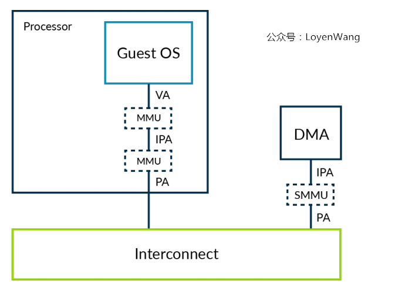

* SMMU也叫IOMMU, 对IO部件提供MMU功能, 虚拟化只是SMMU的一个应用;

* Hypervisor可以负责对SMMU进行编程, 以便让上层的控制器和虚拟机VM以同一个视角对待内存, 同时也保持了隔离性;


