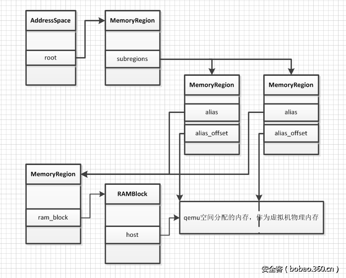

<!-- @import "[TOC]" {cmd="toc" depthFrom=1 depthTo=6 orderedList=false} -->

<!-- code_chunk_output -->

- [1. 基本概述](#1-基本概述)
- [2. 相关配置参数](#2-相关配置参数)
- [3. 可热插拔的 guest 内存](#3-可热插拔的-guest-内存)
- [4. 真实内存资源 Memory backends](#4-真实内存资源-memory-backends)
- [5. 与内存相关的数据结构关系图](#5-与内存相关的数据结构关系图)
- [6. RAM blocks 和 ram_addr_t 地址空间](#6-ram-blocks-和-ram_addr_t-地址空间)
- [7. 跟踪脏页](#7-跟踪脏页)
- [8. AddressSpace 和 MemoryRegion](#8-addressspace-和-memoryregion)

<!-- /code_chunk_output -->

# 1. 基本概述

在**虚拟机启动**时, 由 qemu 在**qemu 的进程地址空间申请内存**, 即**内存的申请**是在**用户空间**完成的, 申请的是**主机虚拟地址空间**, 而这个空间就作为**虚拟机物理内存**.

通过**kvm 提供的 API**, 把**地址信息注册到 KVM**中, 这样 KVM 中维护有**虚拟机相关的 slot**, **所有这些 slot**构成一个**完整的虚拟机物理地址空间**. slot 中记录其对应的 HVA、页面数、起始 GPA 等, 利用它可以将一个 GPA 转化为 HVA.

整个内存虚拟化可以分为两部分: qemu 部分和 kvm 部分.

- **QEMU**完成**内存的申请**

- **KVM**实现**内存的管理**

# 2. 相关配置参数

QEMU 的命令行中有参数:

```
-m [size=]megs[,slots=n,maxmem=size]
```

用于指定客户机**初始运行时的内存大小**以及客户机**最大内存大小**, 以及**内存芯片槽的数量(DIMM**).

之所以 QEMU 可以指定**最大内存**、**槽**等参数, 是因为 QEMU 可以**模拟 DIMM 的热插拔**, 客户机操作系统可以和在真实的系统上一样, 检测新内存被插入或者拔出. 也就是说, **内存热插拔的粒度**是**DIMM 槽(或者说 DIMM 集合**), 而不是最小的 byte.

# 3. 可热插拔的 guest 内存

Qemu 代码中的"**pc\-dimm**"设备(参考 Qemu 源码**hw/mem/pc\-dimm.c**文件中**Typeinfo pc\_dimm\_info**的定义)用来**模拟 DIMM 内存条**.

```cpp
// hw/mem/pc-dimm.c
static TypeInfo pc_dimm_info = {
    .name          = TYPE_PC_DIMM,
    .parent        = TYPE_DEVICE,
    .instance_size = sizeof(PCDIMMDevice),
    .instance_init = pc_dimm_init,
    .class_init    = pc_dimm_class_init,
    .class_size    = sizeof(PCDIMMDeviceClass),
    .interfaces = (InterfaceInfo[]) {
        { TYPE_MEMORY_DEVICE },
        { }
    },
};
```

代码中"**pc\-dimm"设备**的**创建**相当于**逻辑上热插拔了一块内存**(参考代码**type\_register\_static**(\&pc\_dimm\_info)). 尽管该设备名字包含的"pc"容易让人误解, 但 ppc 和 s390 机器仍沿用了该名字.

旁注: 上文提到的**guest 的初始化内存**是**不能**用"**pc\-dimm**"设备创建的, 也无法将其热移除.

在**QOM(Qemu Object Model**)模型中, "**pc\-dimm"对象**(参考代码 include/hw/mem/pc\-dimm.h 文件中的**PCDIMMDevice 结构体**)中并**没有定义**表示其**对应物理内存的变量**, 但定义了一个指针用来指向其**对应的"memory\-backend"对象**.

通过**在 QEMU 进程中**创建一个**新的 PCDIMMDevice 对象**, 就可以实现**内存的热插拔**.

```c
// include/hw/mem/pc-dimm.h
typedef struct PCDIMMDevice {
    /* private */
    DeviceState parent_obj;

    /* public */
    uint64_t addr;
    uint32_t node; //numa node
    int32_t slot; //slot 编号
    // memory-backend 对象
    HostMemoryBackend *hostmem;
} PCDIMMDevice;

typedef struct PCDIMMDeviceClass {
    /* private */
    DeviceClass parent_class;

    /* public */
    void (*realize)(PCDIMMDevice *dimm, Error **errp);
    MemoryRegion *(*get_vmstate_memory_region)(PCDIMMDevice *dimm,
                                               Error **errp);
} PCDIMMDeviceClass;
```

# 4. 真实内存资源 Memory backends

**每个 PCDIMMDevice 对象**都与**HostMemoryBackend 对象相关联**.

设备"memory\-backend"(参考 Qemu 源码**backends/hostmem.c**文件中 TypeInfo host\_memory\_backend\_info 的定义)描述的是支撑 guest 物理内存的**host**上**真实的内存资源**.

```cpp
static const TypeInfo host_memory_backend_info = {
    .name = TYPE_MEMORY_BACKEND,
    .parent = TYPE_OBJECT,
    .abstract = true,
    .class_size = sizeof(HostMemoryBackendClass),
    .class_init = host_memory_backend_class_init,
    .instance_size = sizeof(HostMemoryBackend),
    .instance_init = host_memory_backend_init,
    .instance_post_init = host_memory_backend_post_init,
    .interfaces = (InterfaceInfo[]) {
        { TYPE_USER_CREATABLE },
        { }
    }
};
```

HostMemoryBackend 对象包含了**客户机内存对应的真正的主机内存**, 这些内存

- 既可以是**匿名映射的内存**(参考 backends/hostmem\-ram.c 中 TypeInfo **ram\_backend\_info**的定义),
- 也可以是**文件映射**的内存(参考 backends/hostmem\-file.c 中 TypeInfo **file\_backend\_info**的定义).

```cpp
static const TypeInfo ram_backend_info = {
    .name = TYPE_MEMORY_BACKEND_RAM,
    .parent = TYPE_MEMORY_BACKEND,
    .class_init = ram_backend_class_init,
};

static const TypeInfo file_backend_info = {
    .name = TYPE_MEMORY_BACKEND_FILE,
    .parent = TYPE_MEMORY_BACKEND,
    .class_init = file_backend_class_init,
    .instance_finalize = file_backend_instance_finalize,
    .instance_size = sizeof(HostMemoryBackendFile),
};
```

**文件映射**这种方式允许**Linux**在**host 宿主机**上使用**大页分配的内存**能够**映射到 guest 物理内存**, 同时实现了**共享内存**, 允许**host！！！** 的**其他应用程序**访问**guest 物理内存！！！**.

"**pc\-dimm"对象**和"**memory\-backend"对象**(参考 include/sysemu/hostmem.h 文件中的**HostMemoryBackend 结构体**)作为**Qemu 中用户可见**的**guest 物理内存！！！**, 可以通过**Qemu 命令行**或者**QMP(Qemu Monitor Protocol**)对其进行管理.

```c
// include/sysemu/hostmem.h
struct HostMemoryBackendClass {
    ObjectClass parent_class;

    void (*alloc)(HostMemoryBackend *backend, Error **errp);
};

struct HostMemoryBackend {
    /* private */
    Object parent;

    /* protected */
    uint64_t size;
    bool merge, dump, use_canonical_path;
    bool prealloc, force_prealloc, is_mapped, share;
    DECLARE_BITMAP(host_nodes, MAX_NODES + 1);
    HostMemPolicy policy;

    MemoryRegion mr;
};
```

然而这只是冰山一角, 下面继续介绍**用户不可见的 guest 物理内存的管理**.

# 5. 与内存相关的数据结构关系图


# 6. RAM blocks 和 ram_addr_t 地址空间

**HostMemoryBackend 对象中的内存(guest 物理内存**)被**实际映射**到通过**qemu\_ram\_alloc**()函数(代码定义在**exec.c**中)分配的**RAMBlock 数据结构**中.

"**memory\-backend**(HostMemoryBackend 对象中的内存)"表示的**host**上**真实内存资源**, 由**RAMBlock**调用**exec.c**文件中的**qemu\_ram\_alloc**()函数, 最终通过**mmap**映射到**host**上的**一块虚拟内存**.

RAMBlock 定义在 include/exec/ram\_addr.h 中. RAMBlock 受**RCU 机制保护**, 所谓 RCU, 即 Read\-COPY\-Update,

```c
// include/exec/ram_addr.h
typedef uint64_t ram_addr_t;

struct RAMBlock {
    struct rcu_head rcu; //该数据结构受 rcu 机制保护
    struct MemoryRegion *mr;
    uint8_t *host;  //RAMBlock 在 host 上的虚拟内存起始位置
    uint8_t *colo_cache; /* For colo, VM's ram cache */
    ram_addr_t offset;  //在所有的 RAMBlock 中 offset
    ram_addr_t used_length; //已使用长度
    ram_addr_t max_length;  //最大分配内存
    void (*resized)(const char*, uint64_t length, void *host);
    uint32_t flags;
    /* Protected by iothread lock.  */
    char idstr[256];    //RAMBlock 的 ID
    /* RCU-enabled, writes protected by the ramlist lock */
    QLIST_ENTRY(RAMBlock) next;
    QLIST_HEAD(, RAMBlockNotifier) ramblock_notifiers;
    int fd; //映射文件的描述符
    size_t page_size;
    /* dirty bitmap used during migration */
    unsigned long *bmap;
    unsigned long *unsentmap;
    /* bitmap of already received pages in postcopy */
    unsigned long *receivedmap;
};
```

而**offset**表示了**这块内存**在**虚拟机物理内存中的偏移**. 每一个 ram\_block 还会被连接到全局的'ram_list'链表上.

**RAMBlock 结构体**中的

- **uint8\_t \*host**指向**动态分配的内存**, 用于表示**实际的虚拟机物理内存**, 指向**host**上**虚拟内存的起始值**,
- ram\_addr\_t **offset**表示**当前 RAMBlock**相对于**RAMList**(描述**host 虚拟内存的全局链表**)的**偏移量**.

也就是说**ram\_addr\_t offset**位于一个**全局命名空间**中, 可以通过此 offset 偏移量**定位某个 RAMBlock**.

然而**ram\_addr\_t 命名空间**并**不等同**于**guest 物理内存空间！！！**, 它仅表示**所有 RAMBlock 集合**构成的**一个地址空间**.

举个例子, **guest 物理地址**0x100001000 可能并**不对应**于**ram\_addr\_t 命名空间**中的 0x100001000 地址, 因为**ram\_addr\_t 命名空间**不包含**guest 物理内存**区域中用于**预留和 I/O 内存映射的这些部分**.

此外 ram\_addr\_t **offset**的值取决于**RAMBlock 被创建的顺序**, 而在 guest 物理内存空间中每块内存都有其固定的地址.

所有的**RAMBlock**保存在**全局的 RAMBlock 的链表**中, 名为**RAMList**, 它有专门的**数据结构定义**.

**RAMList 数据结构**定义在 include/exec/ramlist.h 中, 而全局的 ram\_list 变量则定义在 exec.c 中. 因此**这个链表**保存了**客户机的内存**对应的**所有的物理机！！！的实际内存信息！！！**.

```cpp
// include/exec/ramlist.h
#define DIRTY_MEMORY_VGA       0
#define DIRTY_MEMORY_CODE      1
#define DIRTY_MEMORY_MIGRATION 2
#define DIRTY_MEMORY_NUM       3        /* num of dirty bits */

typedef struct RAMList {
    QemuMutex mutex;
    //最近最常使用的 RAMBlock, 将其保存, 从而能够迅速访问
    RAMBlock *mru_block;
    /* RCU-enabled, writes protected by the ramlist lock. */
    //ram_list 的链表
    QLIST_HEAD(, RAMBlock) blocks;
    //用于保存脏页信息的 bitmap, 有三种 bitmap, 一种用于 VGA, 一种用于 TCG 编程中, 一种用于热迁移中.
    DirtyMemoryBlocks *dirty_memory[DIRTY_MEMORY_NUM];
    //全局的 ram_list, 每更改一次, version+1
    uint32_t version;
    QLIST_HEAD(, RAMBlockNotifier) ramblock_notifiers;
} RAMList;
extern RAMList ram_list;

// exec.c
RAMList ram_list = { .blocks = QLIST_HEAD_INITIALIZER(ram_list.blocks) };
```

结构体 ram\_list 中记录了所有 RAMBlock 以及"脏"内存 bitmap 的信息.

# 7. 跟踪脏页

当**客户机 CPU**或者**DMA**将**数据**保存到**客户机内存**时, 需要通知下列一些用户:

1. **热迁移**特性依赖于**跟踪脏页**, 在迁移过程中一旦发现这些内存页发生变化就会重新向目的主机发送这些"脏"页面. 因此他们能够在**被改变之后重新传输**.
2. Qemu 中的动态翻译器 TCG(Tiny Code Generator)会一直追踪自调整的代码, 当上游指令发生变化时对其重新编译.
3. **图形卡模拟**依赖于**跟踪脏的视频内存**, 用于**重画某些界面**.

以上**每种特性**在结构体 ram\_list 的成员变量 DirtyMemoryBlocks \*dirty_memory\[DIRTY\_MEMORY\_NUM]中都有其对应的 bitmap, 为以上特性**独立**的**开启或关闭"脏"页面跟踪机制**.

# 8. AddressSpace 和 MemoryRegion

**所有的 CPU 架构**都有**内存地址空间**, 有些 CPU 架构又有一个**IO 地址空间**. 它们在 QEMU 中被表示为**AddressSpace 数据结构**, 它定义在 include/exec/memory.h 中.

**一个 AddressSpace**对应**一棵 MemoryRegion 树**(其对应关系在 include/exec/memory.h 文件的 AddressSpace 结构体中定义: mr = as\-\>root).

**结构体 MemoryRegion**是联系**guest 物理地址空间**和描述**真实内存的 RAMBlocks(宿主机虚拟地址**)之间的桥梁. **每个 MemoryRegion 结构体**中定义了 RAMBlock \***ram\_block**成员指向**其对应的 RAMBlock**, 而在**RAMBlock**结构体中则定义了 struct MemoryRegion \*mr 指向**对应的 MemoryRegion**.

**MemoryRegion**不仅可以表示**RAM**, 也可以表示**I/O 映射内存**, 在**访问 I/O**时可以调用**read/write 回调函数**. 这也是**硬件**从**客户机 CPU 注册的访问**被分派到**相应的模拟设备**的方法. 如**guest CPU**在访问**硬件设备寄存器**时通过查找其**对应 MemoryRegion**结构体中的信息去**访问指定的模拟设备**.

函数 address\_space\_rw()访问 MemoryRegion 并对该 MR 描述的内存执行 load/store 操作. RAM 类型的 MemoryRegion 描述的内存可通过访问 RAMBlock 中的 guest 物理内存来获取. Guest 物理内存空间定义了一个全局变量 AddressSpace address\_space\_memory, 用来表示跟 RAM 相关的内存.

qemu 中用 AddressSpace 用来表示 CPU/设备看到的内存, 一个 AddressSpace 下面包含多个 MemoryRegion, 这些 MemoryRegion 结构通过树连接起来, 树的根是 AddressSpace 的**root 域**.

```c
// include/exec/memory.h
struct AddressSpace {
    /* All fields are private. */
    struct rcu_head rcu;
    char *name;
    // MR 树(多个 MR)
    MemoryRegion *root;

    /* Accessed via RCU.  */
    //AddressSpace 的一张平面视图, 它是 AddressSpace 所有正在使用的 MemoryRegion 的集合, 这是从 CPU 的视角来看到的.
    struct FlatView *current_map;

    int ioeventfd_nb;
    struct MemoryRegionIoeventfd *ioeventfds;
    QTAILQ_HEAD(, MemoryListener) listeners;
    QTAILQ_ENTRY(AddressSpace) address_spaces_link;
};

struct MemoryRegion {
    Object parent_obj;

    /* All fields are private - violators will be prosecuted */

    /* The following fields should fit in a cache line */
    bool romd_mode;
    bool ram;
    bool subpage;
    bool readonly; /* For RAM regions */
    bool nonvolatile;
    bool rom_device;
    bool flush_coalesced_mmio;
    bool global_locking;
    //表示哪种 dirty map 被使用, 共有三种
    uint8_t dirty_log_mask;
    bool is_iommu;
    // 分配的实际内存
    RAMBlock *ram_block;
    Object *owner;
    // 与 MemoryRegion 相关的操作
    const MemoryRegionOps *ops;
    void *opaque;
    MemoryRegion *container;
    Int128 size;
    //在 AddressSpace 中的地址
    hwaddr addr;
    void (*destructor)(MemoryRegion *mr);
    uint64_t align;
    bool terminates;
    //是否是 ram 内存, 区别于 rom 只读
    bool ram_device;
    //如果为 true, 表示已经通知 kvm 使用这段内存
    bool enabled;
    bool warning_printed; /* For reservations */
    uint8_t vga_logging_count;
    MemoryRegion *alias;
    hwaddr alias_offset;
    int32_t priority;
    QTAILQ_HEAD(, MemoryRegion) subregions;
    QTAILQ_ENTRY(MemoryRegion) subregions_link;
    QTAILQ_HEAD(, CoalescedMemoryRange) coalesced;
    //MemoryRegion 的名字,调试时使用
    const char *name;
    //IOevent 文件描述符的管理
    unsigned ioeventfd_nb;
    MemoryRegionIoeventfd *ioeventfds;
};
```

MemoryRegion 有**多种类型**, 可以表示一段**ram**、**rom**、**MMIO**、**alias**, alias 表示**一个 MemoryRegion**的**一部分区域**, **MemoryRegion**也可以表示**一个 container**, 这就表示它**只是其他若干个 MemoryRegion 的容器**.

在 MemoryRegion 中, 'ram\_block'表示的是**分配的实际内存**.

Address, MemoryRegion, RAMBlock 关系如下图所示.




总结

Guest 物理内存的管理是由几个不同层面共同作用的:

- "pc\-dimm"和"memory-backend"描述了用户可见的**guest 物理内存！！！**(分别代表**DIMM 内存条**与**host 真实的内存资源**);

- RAMBlock 描述了通过**mmap 映射**的**host 虚拟内存块**;

- AddressSpace 和 MemoryRegion 则记录了**guest 物理内存**与**host 虚拟内存**之间的映射.


参考

https://blog.csdn.net/u011364612/article/details/51345110

https://www.anquanke.com/post/id/86412