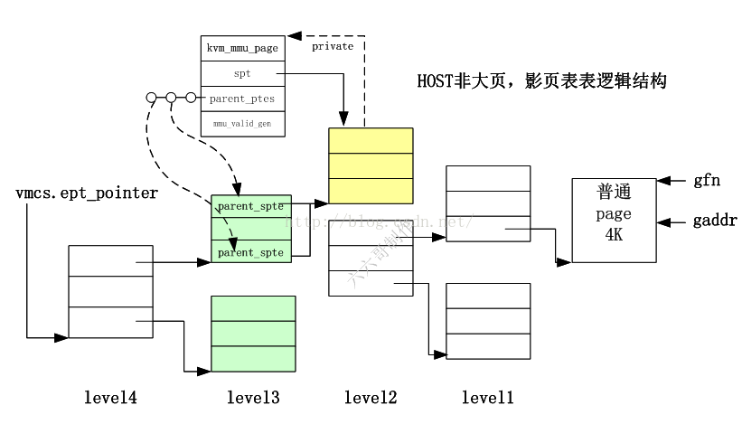

<!-- @import "[TOC]" {cmd="toc" depthFrom=1 depthTo=6 orderedList=false} -->

<!-- code_chunk_output -->

- [1. 几个缩写](#1-几个缩写)
- [2. QEMU](#2-qemu)
  - [2.1. 简介](#21-简介)
  - [2.2. 结构体代码](#22-结构体代码)
    - [2.2.1. AddressSpace: 虚拟机物理地址空间 GPA](#221-addressspace-虚拟机物理地址空间-gpa)
      - [2.2.1.1. 全局链表](#2211-全局链表)
      - [2.2.1.2. AddressSpace 与 MemoryRegion](#2212-addressspace-与-memoryregion)
    - [2.2.2. MemoryRegion: 虚拟机物理地址 GPA 到主机虚拟内存 HVA(RAMBlock)的桥梁](#222-memoryregion-虚拟机物理地址-gpa-到主机虚拟内存-hvaramblock的桥梁)
      - [2.2.2.1. 树结构? 其实只有一个 root](#2221-树结构-其实只有一个-root)
      - [2.2.2.2. 子区域与子区域链表](#2222-子区域与子区域链表)
      - [2.2.2.3. MemoryRegion 与 RAMBlock](#2223-memoryregion-与-ramblock)
    - [2.2.3. RAMBlock: 虚拟机物理内存 GPA 与主机一段虚拟内存 HVA](#223-ramblock-虚拟机物理内存-gpa-与主机一段虚拟内存-hva)
      - [2.2.3.1. RAMList 全局链表](#2231-ramlist-全局链表)
    - [2.2.4. Address, MemoryRegion, RAMBlock 关系](#224-address-memoryregion-ramblock-关系)
    - [2.2.5. FlatView: 虚拟机物理地址空间](#225-flatview-虚拟机物理地址空间)
      - [2.2.5.1. AddressSpace 与 FlatView](#2251-addressspace-与-flatview)
      - [2.2.5.2. FlatView 相关结构体](#2252-flatview-相关结构体)
      - [2.2.5.3. FlatView 与 MemoryRegion](#2253-flatview-与-memoryregion)
    - [2.2.6. MemoryRegionSection: 虚拟机物理地址空间 GPA](#226-memoryregionsection-虚拟机物理地址空间-gpa)
    - [2.2.7. KVMSlot: KVM 内存条模型](#227-kvmslot-kvm-内存条模型)
    - [2.2.8. kvm_userspace_memory_region: GPA->HVA](#228-kvm_userspace_memory_region-gpa-hva)
    - [2.2.9. AddressSpace、MemoryRegion、FlatView、MemoryRegionSection 与 KVMslot 的关系](#229-addressspace-memoryregion-flatview-memoryregionsection-与-kvmslot-的关系)
    - [2.2.10. MemoryListener](#2210-memorylistener)
      - [2.2.10.1. 全局链表和 AddressSpace 自己的 MemoryListener](#22101-全局链表和-addressspace-自己的-memorylistener)
    - [2.2.11. AddressSpaceDispatch](#2211-addressspacedispatch)
    - [2.2.12. memory_listeners、AddressSpace、AddressSpaceDispatch 等之间的联系](#2212-memory_listeners-addressspace-addressspacedispatch-等之间的联系)
  - [2.3. 参考](#23-参考)
- [3. KVM](#3-kvm)
  - [3.1. kvm_memslots: 虚拟机所有 slot 信息](#31-kvm_memslots-虚拟机所有-slot-信息)
  - [3.2. kvm_mem_slot 结构体: 一个代表一段空间, GPA -> HVA](#32-kvm_mem_slot-结构体-一个代表一段空间-gpa---hva)
  - [3.3. kvm 中与 mmu 相关成员](#33-kvm-中与-mmu-相关成员)
  - [3.4. kvm_vcpu 中与 mmu 相关成员](#34-kvm_vcpu-中与-mmu-相关成员)
  - [3.5. kvm_mmu 结构体: vMMU 数据结构](#35-kvm_mmu-结构体-vmmu-数据结构)
  - [3.6. kvm_mmu_page: 一个层级的影子页表页](#36-kvm_mmu_page-一个层级的影子页表页)
  - [3.7. 参考](#37-参考)

<!-- /code_chunk_output -->
# 1. 几个缩写

* GVA - Guest Virtual Address, 虚拟机的虚拟地址
* GPA - Guest Physical Address, 虚拟机的物理地址
* GFN - Guest Frame Number, 虚拟机的页框号
* HVA - Host Virtual Address, 宿主机虚拟地址, 也就是对应 Qemu 中申请的地址
* HPA - Host Physical Address, 宿主机物理地址
* HFN - Host Frame Number, 宿主机的页框号
* PFN - host page frame number, 宿主页框号
* PTE - page table entry, 页表项, 指向下一级页表或者页的物理地址, 以及相应的权限位
* GPTE - guest pte, 客户机页表项, 指向 GPT 中下一级页表或者页的 gpa, 以及相应的权限位
* TDP - two dimentional paging(二维分页, 可以是 NPT 和 EPT)
* SPTE - shadow page table entry, **影子页表项**, 也就是**EPT 页表项**, 指向 EPT 中下一级页表或者页的 hpa, 以及相应的权限位

以上唯一需要解释的是 spte, 在这里被叫做**shadow pte**, 如果不了解的话, 会很容易和以前的 shadow paging 机制搞混.

KVM 在还**没有 EPT 硬件支持**的时候, 采用的是**影子页表**(shadow page table)机制, 为了**和之前的代码兼容**, 在当前的实现中, **EPT 机制**是在**影子页表机制代码**的基础上实现的, 所以**EPT**里面的**pte**和之前一样被叫做 `shadow pte`, 这个会在之后进行详细的说明.

# 2. QEMU

## 2.1. 简介

1. Multiple types of MemoryRegion (MemoryRegion 直接操作内存, 每一棵 MR 树的树根对应一个 RAMBlock, 其 host 即为通过 mmap()分配的 HVA)

- RAM: a range of host memory that can be made available to the guest. e.g. "pc.ram", "pc.bios", "pc.rom", ram/rom for devices like "vga.ram", "vga.rom", etc.
- IOMMU region: translate addresses esp. for each PCI device for DMA usage
- container: includes other memory regions, each at a different offset. Use memory_region_init() to initialize.
- alias: a subsection of another region. Initialize with memory_region_init_alias().

2. AddressSpace (代表某种用途的内存, 比如"memory", "I/O", "cpu-memory"等, 将其他几个内存相关的结构体联系到一起)
- Links all important structures together: MemoryRegion, MemoryRegionListener, FlatView, AddressSpaceDispatch, MemoryRegionIoevented, and so on.
- Initialize with address_space_init().

3. FlatView (将树状的 MemoryRegion 展成平坦型的 FlatView, 用于内存映射)

- Spread the MR-tree to Flat FlatView, which is filled with several FlatRange.

4. MemoryListener (用于监听内存以及内存更新)
- Callbacks structure for updates to the physical memory map
- Allows a component to adjust to changes in the guest-visible memory map. Use with memory_listener_register() and memory_listener_unregister().

## 2.2. 结构体代码

### 2.2.1. AddressSpace: 虚拟机物理地址空间 GPA

```cpp
// include/exec/memory.h
struct AddressSpace {
    /* All fields are private. */
    struct rcu_head rcu;
    char *name;
    // MR 树(多个 MR), 指向根 MR
    MemoryRegion *root;

    /* Accessed via RCU.  */
    //AddressSpace 的一张平面视图, 它是 AddressSpace 所有正在使用的 MemoryRegion 的集合, 这是从 CPU 的视角来看到的.
    // 指向当前维护的 FlatView, 在 address_space_update_topology 时作为 old 比较
    struct FlatView *current_map;

    int ioeventfd_nb;
    struct MemoryRegionIoeventfd *ioeventfds;
    // 该 AddressSpace 的 listeners 链表头
    QTAILQ_HEAD(, MemoryListener) listeners;
    // AddressSpace 链表节点
    QTAILQ_ENTRY(AddressSpace) address_spaces_link;
};
```

**所有的 CPU 架构**都有**内存地址空间**, 有些 CPU 架构又有一个**IO 地址空间**. 它们在 QEMU 中被表示为**AddressSpace 数据结构**.

qemu 中用**AddressSpace**用来表示**CPU/设备**看到的**内存**.

每个 AddressSpace 代表了**一种用途的内存**, 比如"memory"、"I/O"

qemu 有几个全局的 AddressSpace, 比如 address_space_memory 和 address_space_io, 一个是管理系统地址空间, 一个是 IO 地址空间

```cpp
// 生成全局 system_memory 的 MemoryRegion
memory_region_init(system_memory, NULL, "system", UINT64_MAX);
// 初始化 address_space_memory 全局 AddressSpace, 将 system_memory 作为 root(根 MR)
address_space_init(&address_space_memory, system_memory, "memory");

// 生成全局 system_io 的 MemoryRegion
memory_region_init_io(system_io, NULL, &unassigned_io_ops, NULL, "io", 65536);
// 初始化 address_space_io 全局 AddressSpace, 将 system_io 作为 root(根 MR)
address_space_init(&address_space_io, system_io, "I/O");
```

root 指向根 MR, 对于`address_space_memory`来说, root 指向系统全局的 MR system_memory.

#### 2.2.1.1. 全局链表

**所有的 AddressSpace**是通过一个**全局链表**`address_spaces`链接起来, 每个 AddressSpace 的`address_spaces_link`作为链表节点.

```cpp
static QTAILQ_HEAD(, AddressSpace) address_spaces
    = QTAILQ_HEAD_INITIALIZER(address_spaces);
```

所以在上面提到的`address_space_init`函数中有`QTAILQ_INSERT_TAIL(&address_spaces, as, address_spaces_link);`操作.

#### 2.2.1.2. AddressSpace 与 MemoryRegion

一个 AddressSpace 对应多个 MemoryRegion .

所有 AddressSpace 下面**root**及其**子树**形成了**一个虚拟机**的**物理地址！！！**, 也就是说一个 AddressSpace 对应多个 MemoryRegion

MR 管理 host 的内存, 那么 address_space 管理的更偏向于虚拟机. AddressSpace 是将 MR 映射到虚拟机的物理地址空间.

见下面图

### 2.2.2. MemoryRegion: 虚拟机物理地址 GPA 到主机虚拟内存 HVA(RAMBlock)的桥梁

```cpp
// include/exec/memory.h
struct MemoryRegion {
    Object parent_obj;

    /* All fields are private - violators will be prosecuted */

    /* The following fields should fit in a cache line */
    bool romd_mode;
    // 是否是 ram
    bool ram;
    bool subpage;
    bool readonly; /* For RAM regions */
    bool nonvolatile;
    bool rom_device;
    bool flush_coalesced_mmio;
    bool global_locking;
    //表示哪种 dirty map 被使用, 共有三种
    uint8_t dirty_log_mask;
    bool is_iommu;
    // 指向对应的 RAMBlock, 分配的实际内存 HVA
    RAMBlock *ram_block;
    // 拥有者
    Object *owner;
    // 与 MemoryRegion 相关的操作的回调函数
    const MemoryRegionOps *ops;
    void *opaque;
    // 指向挂载的上一级 mr
    MemoryRegion *container;
    // mr 的大小
    Int128 size;
    // 相对父 mr 的偏移, 起始 GPA=父 MR base+addr 可以去源码中搜索一下如何初始化的就明白了
    hwaddr addr;
    void (*destructor)(MemoryRegion *mr);
    uint64_t align;
    // teminates 为 false 表明纯容器
    bool terminates;
    //是否是 ram 内存, 区别于 rom 只读
    bool ram_device;
    //如果为 true, 表示已经通知 kvm 使用这段内存
    bool enabled;
    bool warning_printed; /* For reservations */
    uint8_t vga_logging_count;
    // 如果本 mr 是 alias, 指向真实的 MR, 即从哪个 MR 中划分的
    MemoryRegion *alias;
    // 在真实 MR 中的偏移
    hwaddr alias_offset;
    // 优先级, 属于同一个 mr 的 subregions 中高优先级的 mr 会被优先渲染
    int32_t priority;
    // 子区域链表头
    QTAILQ_HEAD(, MemoryRegion) subregions;
    // 子区域链表节点
    QTAILQ_ENTRY(MemoryRegion) subregions_link;
    QTAILQ_HEAD(, CoalescedMemoryRange) coalesced;
    //MemoryRegion 的名字
    const char *name;
    //IOevent 文件描述符的管理
    unsigned ioeventfd_nb;
    MemoryRegionIoeventfd *ioeventfds;
};
```

首先 MemoryRegion 有两种,一种为纯容器(逻辑上的概念),一种为物理内存(物理内存又有几种 mmio 内存. ram, rom, ioport)

每个 MemoryRegion 有**多种类型**, 可以表示一段**ram**、**rom**、**MMIO**、**alias**.

**结构体 MemoryRegion**是联系**guest 物理地址空间**和描述**真实内存的 RAMBlocks(宿主机虚拟地址**)之间的桥梁.

其中 parent 指向父 MR, 默认是 NULL;

size 表示区域的大小;

ram_block 比较重要, 是分配的实际内存.

alias 表明该区域是某一个区域的一部分区域, 实际上虚拟机的 ram 申请时一次性申请一个完整的 ram, 记录在一个 MR 中, 之后又会对此 ram 按照 size 划分, 形成 subregion, 而 subregion 的 alias 便指向原始的 MR, 而 alias_offset 便是在原始 ram 中的偏移. 对于系统地址空间的 ram, 会把刚才得到的 subregion 注册到系统中, 父 MR 是刚才提到的全局 MR system_memory. 实际关联 host 内存的是 subregion->alias 指向的 MR, 其 ram_block 实际保存 gpa 到 hva 的映射关系.

#### 2.2.2.1. 树结构? 其实只有一个 root

QEMU 通过 MemoryRegion 来管理虚拟机内存, 通过内存属性, GUEST 物理地址等特点对内存分类, 就形成了多个 MemoryRegion, 这些 MemoryRegion 通过树状组织起来, 挂接到根 MemoryRegion 下. 每个 MemoryRegion 树代表了一类作用的内存, 如系统内存空间(system_memory)或 IO 内存空间(system_io),这两个是 qemu 中的两个全局 MemoryRegion.

**一个 AddressSpace**下面包含**多个 MemoryRegion**, 这些 MemoryRegion 结构通过**树**连接起来, **树的根**是**AddressSpace**的**root 域**.

**每个 MemoryRegion 树！！！** 代表了**一类作用的内存**, 如**系统内存空间**(`system_memory`)或**IO 内存空间**(`system_io`), 这两个是 qemu 中的**两个全局 MemoryRegion**.

这个树就是由 MemoryRegion 构成, MemoryRegion 负责管理 host 的内存, 理论上是树状结构, 但是实际上根据代码来看仅仅有两层, 也就是说 AddressSpace 下面是 MR root, root 往下再没有其他 MR 节点了, 而再往下就是子 MR 链表, 头是 subregions, 子 MR 通过`subregions_link`链接. 所以这个树其实往下是通过 subregion 维护的.

#### 2.2.2.2. 子区域与子区域链表

alias 表示**一个 MemoryRegion**的**一部分区域**, **MemoryRegion**也可以表示**一个 container**, 这就表示它**只是其他若干个 MemoryRegion 的容器**.

实际上**虚拟机的 ram 申请**时时一次性申请的一个**完整的 ram**, 记录在**一个 MR**中, 之后又对此 ram**按照 size 进行了划分**, 形成**子 MR**, 而子 MR 的**alias**便指向**原始的 MR**, 而 `alias_offset` 便是在**原始 MR**中的**偏移**.

对于系统地址空间的 ram, 会把刚才得到的 subregion 注册到系统中, 父 MR 是**全局 MR** `system_memory`, `subregions_link`是**链表节点**, 该链表头节点在父 MR 的`subregions`域.

前面提到, **实际关联 host 内存**的是`子 MR->alias`指向的**MR**, `子 MR->alias_offset`指向该子 MR 在父 MR 中的地址长度的偏移.

注: 子 MR 不关联 host 内存, 即不关联 HVA, 实际**关联内存**的是`子 MR->alias`指向的 MR

下面有张图

#### 2.2.2.3. MemoryRegion 与 RAMBlock

MR 与 RAMBLOCK 是一对一的.

**结构体 MemoryRegion**是联系**guest 物理地址空间**和描述**真实内存的 RAMBlocks(宿主机虚拟地址**)之间的桥梁.

**每个 MemoryRegion 结构体**中定义了`RAMBlock *ram_block`成员指向**其对应的 RAMBlock**, 而在**RAMBlock**结构体中则定义了`struct MemoryRegion *mr`指向**对应的 MemoryRegion**.

MemoryRegion 直接操作内存, **每一棵 MR 树的树根**对应一个**RAMBlock**, 其 host 即为通过 mmap()分配的 HVA

其`RAMBlock->offset`是该 MR 在**虚拟机的物理内存中的偏移**, RAMBlock 最直接的接触 host 的内存, 看下其结构

### 2.2.3. RAMBlock: 虚拟机物理内存 GPA 与主机一段虚拟内存 HVA

```cpp
// include/exec/ram_addr.h
typedef uint64_t ram_addr_t;

struct RAMBlock {
    struct rcu_head rcu; //该数据结构受 rcu 机制保护
    struct MemoryRegion *mr;
    uint8_t *host;  // RAMBlock 在 host 上的虚拟内存起始位置, 即 HVA
    uint8_t *colo_cache; /* For colo, VM's ram cache */
    ram_addr_t offset;  // 在虚拟机物理内存中的偏移, GPA
    ram_addr_t used_length; //已使用长度
    ram_addr_t max_length;  //最大分配内存
    void (*resized)(const char*, uint64_t length, void *host);
    uint32_t flags;
    /* Protected by iothread lock.  */
    /* 这里会被填充成 mr 的 name */
    char idstr[256];    //RAMBlock 的 ID
    /* RCU-enabled, writes protected by the ramlist lock */
    // 全局链表
    QLIST_ENTRY(RAMBlock) next;
    QLIST_HEAD(, RAMBlockNotifier) ramblock_notifiers;
    int fd; //映射文件的描述符
    size_t page_size;
    /* dirty bitmap used during migration */
    unsigned long *bmap;
    unsigned long *unsentmap;
    /* bitmap of already received pages in postcopy */
    unsigned long *receivedmap;
};
```

理论上**一个 RAMBlock**就代表**host 的一段虚拟内存**, host 指向**申请的 ram 的虚拟地址**, 是 HVA.

**RAMBlock 结构体**中的

- uint8\_t \***host**指向**动态分配的内存**, 用于表示**实际的虚拟机物理内存**, 指向**host**上**虚拟内存的起始值**,
- ram\_addr\_t **offset**表示**当前 RAMBlock**相对于**RAMList**(描述**host 虚拟内存的全局链表**)的**偏移量**.

也就是说`ram_addr_t offset`位于一个**全局命名空间**中, 可以通过此 offset 偏移量**定位某个 RAMBlock**.

然而**ram\_addr\_t 命名空间**并**不等同**于**guest 物理内存空间！！！**, 它仅表示**所有 RAMBlock 集合**构成的**一个地址空间**.

qemu 内存分布模型


qemu 模拟了**普通内存分布模型**, 内存的线性也是**分块被使用**的, **每个块**称为`RAMBlock`, 由`ram_list`统领, **RAMBlock.offset**则是**区块的线性地址**, 即**相对于开始的偏移位**, `RAMBlock.length(size)`则是区块的大小.

#### 2.2.3.1. RAMList 全局链表

这个全局链表描述了整个虚拟机使用的真正的**所有主机虚拟内存**.

```cpp
typedef struct RAMList {
    QemuMutex mutex;
    // 最近使用的 block
    RAMBlock *mru_block;
    /* RCU-enabled, writes protected by the ramlist lock. */
    QLIST_HEAD(, RAMBlock) blocks;
    DirtyMemoryBlocks *dirty_memory[DIRTY_MEMORY_NUM];
    uint32_t version;
    QLIST_HEAD(, RAMBlockNotifier) ramblock_notifiers;
} RAMList;
extern RAMList ram_list;

RAMList ram_list = { .blocks = QLIST_HEAD_INITIALIZER(ram_list.blocks) };
```

所有的 RAMBlock 通过**next 字段**连接起来, 表头保存在一个**全局的 RAMList 结构**中, 但是根据代码来看, **原始 MR 分配**内存时分配的是**一整块 block**, 之所以这样做也许是为了扩展用吧！！

**RAMList**中有个字段**mru_block 指针**, 指向**最近使用的 block**, 这样需要**遍历所有的 block**时, 先判断指定的 block 是否是`mru_block`, 如果不是再进行遍历从而提高效率.

每一个 ram\_block 还会被连接到全局的`'ram_list'`链表上.

### 2.2.4. Address, MemoryRegion, RAMBlock 关系

qemu 层的内存管理分为三个层次,

- MR 位于顶级抽象层或者说偏向于 host 端, qemu 中两个全局的 MR, 分别是 system_memory 和 system_io, 不过两个均是以指针的形式存在, 在地址空间的时候才会对其分配具体的内存并初始化. MR 负责管理 host 的内存, 是树状结构.

- AddressSpace 更偏向于虚拟机, 管理地址空间, qemu 中有几个全局的 AS, address_space_memory 和 address_space_io, 一个管理系统地址空间, 一个是 IO 地址空间

-


### 2.2.5. FlatView: 虚拟机物理地址空间

#### 2.2.5.1. AddressSpace 与 FlatView

AddressSpace 下面**root 及其子树**形成了一个**虚拟机的物理地址！！！**, 但是在往**kvm 进行设置！！！**的时候, 需要将其转换为一个**平坦的地址模型**, 也就是从 0 开始的.

这个就用 FlatView 表示, **一个 AddressSpace**对应**一个 FlatView**.

FlatView 管理 MR 展开后得到的所有 FlatRange .

#### 2.2.5.2. FlatView 相关结构体

```cpp
// memory.c
struct AddrRange {
    // GPA 虚拟机物理地址空间
    Int128 start; // 在虚拟机物理地址空间的起始地址
    Int128 size; // 大小
};

struct FlatRange {
    //指向所属的 MR
    MemoryRegion *mr;
    //在 MR 中的 offset
    hwaddr offset_in_region;
    //本 FlatView 代表的区间
    AddrRange addr;
    uint8_t dirty_log_mask;
    bool romd_mode;
    // 是否只读
    bool readonly;
    bool nonvolatile;
    int has_coalesced_range;
};

// include/exec/memory.h
typedef struct AddressSpaceDispatch AddressSpaceDispatch;
typedef struct FlatRange FlatRange;

struct FlatView {
    struct rcu_head rcu;
    //引用计数, 为 0 就销毁
    unsigned ref;
    //对应的 flatrange 数组
    FlatRange *ranges;
    //flatrange 数目
    unsigned nr;
    // 当前数组的项数
    unsigned nr_allocated;
    // 负责根据 GPA 找到 HVA
    struct AddressSpaceDispatch *dispatch;
    // 指向该 flatview
    MemoryRegion *root;
};
```

**ranges**是一个**数组**, 记录 FlatView 下**所有的 FlatRange**, **每个 FlatRange**对应一段**虚拟机物理地址区间**, 各个 FlatRange**不会重叠**, 按照**地址的顺序！！！** 保存在数组中.

FlatRange 在 FlatView 中是按照地址升序来排列的,另外不存在地址重合的 FlatRange.

具体的范围由一个`AddrRange`结构描述, 其描述了地址和大小, `offset_in_region`表示该区间在**全局的 MR**中的 offset, 根据此可以进行**GPA 到 HVA**的**转换**, mr 指向所属的 MR.


在 FlatView 中, FlatRange 表示按照需要被切分为了几个范围.

#### 2.2.5.3. FlatView 与 MemoryRegion

FlatView 是根据 MemoryRegion 通过 `generate_memory_topology()`生成的.

### 2.2.6. MemoryRegionSection: 虚拟机物理地址空间 GPA

在内存虚拟化中, 还有一个重要的结构是 MemoryRegionSection, 这个结构通过函数`section_from_flat_range`由**FlatRange 转换过来**.

也就是说 `MemoryRegionSection` 对应于`FlatRange`, **一个 FlatRange**代表**一个虚拟机物理地址空间的片段**, 但是其偏向于`address-space`, 而**MemoryRegionSection**则在**MR 端**显示的表明了分片, 其结构如下

```cpp
// include/exec/memory.h
struct MemoryRegionSection {
    // 所属的 MR
    MemoryRegion *mr;
    // 所属的 FV
    FlatView *fv;
    // 在 MemoryRegion 中的偏移
    /*
     * 相当于在 region 内偏移量, region 上面挂载了一块从 HOST 上分配的内存, 通过这个 offset, 就可以计算这个 section 在 HOST 内存上的 HVA 了
     */
    hwaddr offset_within_region;
    // 大小
    Int128 size;
    /*
     * AS 内偏移量, 该值是 GPA, 相当于从 GUEST 物理地址 0 处开始的偏移量, 也就是说, 这个值是该段内存 GPA 的起始地址
     * 这很好理解, 如果 AS 代表的是系统内存, 那么 AS 内的偏移量当然是物理地址
     */
    // 在 address space 的偏移, 该 address space 通过 FV 关联
    hwaddr offset_within_address_space;
    /*指明是 ROM 还是 RAM*/
    bool readonly;
    bool nonvolatile;
};
```

MemoryRegionSection 表示的是**MemoryRegion 的一部分**.

其中注意两个偏移, `offset_within_region`和`offset_within_address_space`.

- 前者描述的是**该 section**在**整个 MR**中的**偏移**, 一个**address_space**可能有**多个 MR**构成, 因此该 offset 是**局部**的.
- 而`offset_within_address_space`是在**整个地址空间**中的偏移, 是**全局**的 offset.

这个其实跟 FlatRange 差不多.

### 2.2.7. KVMSlot: KVM 内存条模型

```cpp
typedef struct KVMSlot
{
    // 客户机物理地址 GPA
    hwaddr start_addr;
    // 内存大小
    ram_addr_t memory_size;
    // HVA qemu 用户空间地址
    void *ram;
    // slot 编号
    int slot;
    int flags;
    int old_flags;
    /* Dirty bitmap cache for the slot */
    unsigned long *dirty_bmap;
} KVMSlot;
```

KVMSlot 更接近 KVM.

### 2.2.8. kvm_userspace_memory_region: GPA->HVA

```cpp
struct kvm_userspace_memory_region {
        // 插槽编号
        __u32 slot;
        // 标志位, 例如是否追踪脏页、是否可用等
        __u32 flags;
        // 虚拟机物理地址, GPA
        __u64 guest_phys_addr;
        // 虚拟机内存大小(字节为单位)
        __u64 memory_size; /* bytes */
        // qemu 分配的内存的起始地址, HVA
        __u64 userspace_addr; /* start of the userspace allocated memory */
};
```

kvm_userspace_memory_region 是和 kvm 共享的一个结构, 说共享不太恰当, 但是其实最终作为参数给 kvm 使用的, kvm 获取控制权后, 从栈中复制该结构到内核.

`GPA -> HVA`

### 2.2.9. AddressSpace、MemoryRegion、FlatView、MemoryRegionSection 与 KVMslot 的关系

这几个数据结构关系如下:


整体布局大致如图:


这里只展示最简单的对 ram_memory 的划分和管理. 实际上 system_memory 下面还有更多其他的 MR.

### 2.2.10. MemoryListener

```cpp
// include/exec/memory.h
struct MemoryListener {
    void (*begin)(MemoryListener *listener);
    void (*commit)(MemoryListener *listener);
    void (*region_add)(MemoryListener *listener, MemoryRegionSection *section);
    void (*region_del)(MemoryListener *listener, MemoryRegionSection *section);
    void (*region_nop)(MemoryListener *listener, MemoryRegionSection *section);
    void (*log_start)(MemoryListener *listener, MemoryRegionSection *section,
                      int old, int new);
    void (*log_stop)(MemoryListener *listener, MemoryRegionSection *section,
                     int old, int new);
    void (*log_sync)(MemoryListener *listener, MemoryRegionSection *section);
    void (*log_global_start)(MemoryListener *listener);
    void (*log_global_stop)(MemoryListener *listener);
    void (*eventfd_add)(MemoryListener *listener, MemoryRegionSection *section,
                        bool match_data, uint64_t data, EventNotifier *e);
    void (*eventfd_del)(MemoryListener *listener, MemoryRegionSection *section,
                        bool match_data, uint64_t data, EventNotifier *e);
    void (*coalesced_io_add)(MemoryListener *listener, MemoryRegionSection *section,
                               hwaddr addr, hwaddr len);
    void (*coalesced_io_del)(MemoryListener *listener, MemoryRegionSection *section,
                               hwaddr addr, hwaddr len);
    /* Lower = earlier (during add), later (during del) */
    unsigned priority;
    AddressSpace *address_space;
    QTAILQ_ENTRY(MemoryListener) link;
    QTAILQ_ENTRY(MemoryListener) link_as;
};
```

为了**监控虚拟机的物理地址访问**, 对于**每一个 AddressSpace**, 会有**一个 MemoryListener**与之对应. 每当`物理映射(GPA->HVA)`发生改变时, 会**回调这些函数**.

#### 2.2.10.1. 全局链表和 AddressSpace 自己的 MemoryListener

所有的 MemoryListener 都会挂在**全局变量 memory\_listeners 链表**上.

```cpp
static QTAILQ_HEAD(, MemoryListener) memory_listeners
    = QTAILQ_HEAD_INITIALIZER(memory_listeners);
```

同时, AddressSpace 也会有一个链表连接器自己注册的 MemoryListener.

### 2.2.11. AddressSpaceDispatch

为了在**虚拟机退出**时, 能够顺利根据**虚拟机物理地址**找到**对应的 HVA**地址, qemu 会有一个 AddressSpaceDispatch 结构, 用来在 AddressSpace 中进行位置的找寻, 继而完成对 IO/MMIO 地址的访问.

```cpp
// exec.c
struct AddressSpaceDispatch {
    MemoryRegionSection *mru_section;
    /* This is a multi-level map on the physical address space.
     * The bottom level has pointers to MemoryRegionSections.
     */
    PhysPageEntry phys_map;
    PhysPageMap map;
};
```

这里面有一个**PhysPageMap**, 这其实也是**保存**了一个**GPA\-\>HVA**的**一个映射**, 通过**多层页表实现**, 当**kvm exit 退到 qemu**之后, 通过这个 AddressSpaceDispatch 里面的 map 查找对应的 MemoryRegionSection, 继而找到对应的主机 HVA.

### 2.2.12. memory_listeners、AddressSpace、AddressSpaceDispatch 等之间的联系

这几个结构体的关系如下:


## 2.3. 参考

https://blog.csdn.net/Shirleylinyuer/article/details/83592614

https://www.cnblogs.com/ck1020/p/6729224.html

https://abelsu7.top/2019/07/07/kvm-memory-virtualization/ (未整理)

# 3. KVM

## 3.1. kvm_memslots: 虚拟机所有 slot 信息

一个`struct kvm`代表一个虚拟机, memslots 是该虚拟机所有内存条, 注意最大`KVM_ADDRESS_SPACE_NUM`(这里是 1), 用于将**GPA 转换为 HVA**.

**一个虚拟机的所有 slot(即 kvm->memslots)构成完整的虚拟机物理地址空间**.

```cpp
struct kvm {
	struct kvm_memslots __rcu *memslots[KVM_ADDRESS_SPACE_NUM];
}
/*
 * Note:
 * memslots are not sorted by id anymore, please use id_to_memslot()
 * to get the memslot by its id.
 */
struct kvm_memslots {
        u64 generation;
        /* The mapping table from slot id to the index in memslots[]. */
        short id_to_index[KVM_MEM_SLOTS_NUM];
        atomic_t lru_slot;
        int used_slots;
        // 所有插槽
        struct kvm_memory_slot memslots[];
};
```

kvm_memslots 结构体是`kvm_mem_slot`的封装, 其中包含一个`kvm_mem_slot`的数组, 对应于**该虚拟机**使用的**所有内存区域(slot**). 以**数组形式**存储这些**slot 的地址信息**.

`kvm_mem_slot`是 kvm 内存管理相关主要数据结构, 用来表示**虚拟机 GPA**和**主机 HVA**之间的**映射关系**, 一个`kvm_mem_slot`表示一段**内存区域(slot)的映射关系**.

获取某一个`kvm_memory_slot`, 通过`id_to_memslot(struct kvm_memslots *slots, int id)`实现, `虚拟机物理内存注册`有**具体代码**.

`kvm->memslots`结构在创建虚拟机时被创建. `kvm_create_vm`, 而插槽 ID`slot id`和其索引 index 是在`id_to_index`中维护, 即`slots->id_to_index[i] = slots->memslots[i].id = i`, 而这个映射关系是**新加一个内存条**(即虚拟机物理内存注册)时候建立的.

```cpp
static struct kvm *kvm_create_vm(unsigned long type)
{
        ...
        for (i = 0; i < KVM_ADDRESS_SPACE_NUM; i++) {
                struct kvm_memslots *slots = kvm_alloc_memslots();

                if (!slots)
                        goto out_err_no_arch_destroy_vm;
                /* Generations must be different for each address space. */
                slots->generation = i;
                rcu_assign_pointer(kvm->memslots[i], slots);
        }
        ...
}

static struct kvm_memslots *kvm_alloc_memslots(void)
{
        int i;
        struct kvm_memslots *slots;

        slots = kvzalloc(sizeof(struct kvm_memslots), GFP_KERNEL_ACCOUNT);
        if (!slots)
                return NULL;
        // 这里并没有建立, 而是在虚拟机物理内存注册时候建立
        for (i = 0; i < KVM_MEM_SLOTS_NUM; i++)
                slots->id_to_index[i] = -1;

        return slots;
}
```

## 3.2. kvm_mem_slot 结构体: 一个代表一段空间, GPA -> HVA

由于**GPA 不能直接用于物理 MMU 进行寻址！！！**, 所以需要**将 GPA 转换为 HVA**, kvm 中利用 `kvm_memory_slot` 数据结构来记录**每一个地址区间**(**Guest 中的物理地址区间**)中**GPA 与 HVA**的**映射关系**.

```cpp
struct kvm_memory_slot {
        // 虚拟机物理地址(即 GPA)对应的页框号, GPA
        // 等于: mem->guest_phys_addr >> PAGE_SHIFT;
        gfn_t base_gfn;
        // 当前 slot 中包含的 page 数目
        unsigned long npages;
        // 一个 slot 由许多客户机虚拟页面构成, 通过这个标识每个页是否可用(脏页的 bitmap)
        unsigned long *dirty_bitmap;
        // 架构相关部分
        struct kvm_arch_memory_slot arch;
        /*
         * GPA 对应的 host 虚拟地址(HVA), 由于虚拟机都运行在 qemu 的地址空间中
         * 而 qemu 是用户态程序, 所以通常使用 root-module 下的用户地址空间.
         */
        unsigned long userspace_addr;
        // slot 的标志位
        u32 flags;
        // slot 的 id
        short id;
};
```

众所周知, **KVM 虚拟机**运行在**qemu 的进程地址空间**中, 所以其实**虚拟机使用的物理地址**是从对应**qemu 进程的地址空间中分配**的.

**虚拟机物理内存！！！** 被分成若干个`kvm_memory_slot`, **每个 memslot**是**不能重叠**的, 也就是说**每一段内存区间**都必须有**独立的作用**. 一般来说**Qemu**会对**RAM**、**IO memory**、**High memory**等**分别注册若干个 memslot**.

**一个虚拟机的所有 slot(即 kvm->memslots)构成完整的虚拟机物理地址空间**.

**每个虚拟机**的**物理内存**由**多个 slot**组成, **每个 slot**对应一个`kvm_memory_slot`结构, 从结构体的字段可以看出, 该结构记录**slot 映射**的是**哪些客户物理 page**, 由于**映射多个页面**, 所以有一个`ditty_bitmap`来标识**各个页的状态**, 注意这个页是客户机的虚拟 page. 映射架构如下:


`kvm_memory_slot`本质是**qemu 进程用户空间的 hva**, 仅仅是 qemu 进程的虚拟地址空间, 并**没有对应物理地址**, 各个字段的意义不言自明了. 其中有一个`kvm_arch_memory_slot`结构, 我们重点描述.

```cpp
/* KVM Hugepage definitions for x86 */
enum {
        // 页面的起始地址在 页表(PT) 中
        PT_PAGE_TABLE_LEVEL   = 1,
        // 2M 大页(2^20), 页面的起始地址在 页目录项(PDE) 中
        PT_DIRECTORY_LEVEL    = 2,
        // 1G 大页(2^30), 页面的起始地址在 页目录指针项(PDPE) 中
        PT_PDPE_LEVEL         = 3,
        /* set max level to the biggest one */
        PT_MAX_HUGEPAGE_LEVEL = PT_PDPE_LEVEL,
};
// 这里是 3
#define KVM_NR_PAGE_SIZES       (PT_MAX_HUGEPAGE_LEVEL - \
                                 PT_PAGE_TABLE_LEVEL + 1)
struct kvm_rmap_head {
        unsigned long val;
};

struct kvm_lpage_info {
        int disallow_lpage;
};

struct kvm_arch_memory_slot {
        // 反向映射结构(reverse map)
        // 数组, 3 个指针, 每种页面大小对应一个链表
        struct kvm_rmap_head *rmap[KVM_NR_PAGE_SIZES];
        // Large page 结构(如 2MB、1GB 大小页面)
        struct kvm_lpage_info *lpage_info[KVM_NR_PAGE_SIZES - 1];
        unsigned short *gfn_track[KVM_PAGE_TRACK_MAX];
};
```

该结构的**rmap 字段**是指针数组, 每种页面大小**对应一个链表**, KVM 的大页面支持 2M 和 1G 的页面, 普通的页面就是 4KB 了. 结合上面的`kvm_memory_slot`结构可以发现, `kvm_arch_memory_slot`其实是`kvm_memory_slot`的一个**内嵌结构**, 所以**每个 slot**都关联一个`kvm_arch_memory_slot`, 也就有一个**rmap 数组**. 其实在**虚拟机中**, **qemu**为虚拟机分配的页面主要是**大页面**.

至于`kvm_userspace_memory_region`可以看 qemu 部分

## 3.3. kvm 中与 mmu 相关成员

```cpp
// include/linux/kvm_host.h
struct kvm {
        struct kvm_vcpu *vcpus[KVM_MAX_VCPUS];
        // 保护 mmu 的 spinlock, mmu 范围最大的锁
	spinlock_t mmu_lock;
        // 内存槽操作锁
	struct mutex slots_lock;
        // host 上 arch 的一些参数
	struct kvm_arch arch;
	// 指向 qemu 用户态进程的 mm_struct
	struct mm_struct *mm; /* userspace tied to this vm */
        // 该 kvm 所有的 memslot
        struct kvm_memslots __rcu *memslots[KVM_ADDRESS_SPACE_NUM];
```

kvm 结构体, 每个虚拟机一个, 代表一个虚拟机

- **arch**成员是**虚拟机级别**的**arch 特性**, 其中通过**hash 和链表**会将`kvm_mmu_page`结构管理起来, 以后通过**gfn**就可以**快速索引**到一个**gfn 地址所用的页表页**(`kvm_mmu_page`)
- **vcpus**成员指向一组虚拟机内的 VCPU 结构

其中`address_space_id = mem->slot >> 16;`, 详细见`虚拟机物理内存注册`.

## 3.4. kvm_vcpu 中与 mmu 相关成员

```cpp
// include/linux/kvm_host.h
struct kvm_vcpu {
	// 当前 VCPU 虚拟的架构, 默认 x86
    // 架构相关部分, 包括的寄存器、apic、mmu 相关等架构相关的内容
    struct kvm_vcpu_arch arch;
};
```

`kvm_vcpu`结构体, 对应一个 VCPU

- arch 成员是**架构特性部分**, 如 x86 特性部分, arm 特定部分等

```cpp
struct kvm_vcpu_arch {
        ......
        /*
        * Paging state of the vcpu
        *
        * If the vcpu runs in guest mode with two level paging this still saves
        * the paging mode of the l1 guest. This context is always used to
        * handle faults.
        */
        // vcpu 以两级页表运行在 guest 模式下, 这里仍然保存 L1 虚拟机的页表
        // 这个用于处理异常
        struct kvm_mmu *mmu;

        /* Non-nested MMU for L1 */
        // 非嵌套情况下的虚拟机 mmu
        struct kvm_mmu root_mmu;

        /* L1 MMU when running nested */
        // 嵌套情况下的 L1 的 mmu
        struct kvm_mmu guest_mmu;

        /*
         * Paging state of an L2 guest (used for nested npt)
         *
         * This context will save all necessary information to walk page tables
         * of an L2 guest. This context is only initialized for page table
         * walking and not for faulting since we never handle l2 page faults on
         * the host.
         */
        //
        struct kvm_mmu nested_mmu;

        /*
         * Pointer to the mmu context currently used for
         * gva_to_gpa translations.
         */
        // 用于 GVA 转换成 GPA
        struct kvm_mmu *walk_mmu;

        struct kvm_mmu_memory_cache mmu_pte_list_desc_cache;
        struct kvm_mmu_memory_cache mmu_page_cache;
        struct kvm_mmu_memory_cache mmu_page_header_cache;
        ......
```

- mmu 成员指向**vMMU 结构**, 可以看出 vMMU 是**每 VCPU 一个**
- `walk_mmu`成员指向 mmu

注释已经很清楚了, 我就不做过多的解释了, 说一下三个 cache:
- `mmu_pte_list_desc_cache`: 用来分配`struct pte_list_desc`结构, 该结构主要用于**反向映射**, 参考`rmap_ad`函数, **每个 rmapp**指向的就是**一个**`pte_list`. 后面介绍反向映射的时候会详细介绍.
- `mmu_page_cache`: 用来**分配 spt 页结构**, spt 页结构是存储`spt paging structure`的页, 对应`kvm_mmu_page.spt`
- `mmu_page_header_cache`: 用来分配`struct kvm_mmu_page`结构, 从该 cache 分配的页面可能会调用**kmem_cache 机制**来分配

这三个 cache 使用的是`kvm_mmu_memory_cache`结构, 该结构是 KVM 定义的 cache 结构, 进一步优化了 MMU 分配的效率. 有**两个对应的 kmem_cache 结构**:

```cpp
static struct kmem_cache *pte_list_desc_cache;
static struct kmem_cache *mmu_page_header_cache;
```

他们分别对应`mmu_pte_list_desc_cache`和`mmu_page_header_cache`, 也就是说如果这**两个 cache**中缓存的**object 数目不够**, 则会从上述对应的`kmem_cache`中获取, 对应的代码可以参考函数`mmu_topup_memory_cache`;

```cpp
static int mmu_topup_memory_cache(struct kvm_mmu_memory_cache *cache,
                                  struct kmem_cache *base_cache, int min)
{
        void *obj;

        if (cache->nobjs >= min)
                return 0;
        while (cache->nobjs < ARRAY_SIZE(cache->objects)) {
                obj = kmem_cache_zalloc(base_cache, GFP_KERNEL_ACCOUNT);
                if (!obj)
                        return cache->nobjs >= min ? 0 : -ENOMEM;
                cache->objects[cache->nobjs++] = obj;
        }
        return 0;
}
```

而`mmu_page_cache`中的 object 数目不够时, 则调用`mmu_topup_memory_cache_page`函数, 其中直接调用了`__get_free_page`函数来获得页面. 在一些**初始化函数**中, 需要**初始化这些 cache**以便**加速运行时的分配**, 初始化函数为`mmu_topup_memory_caches`, 该初始化过程在**mmu page fault 处理函数**(如`tdp_page_fault`)、**MMU 初始化函数**(`kvm_mmu_load`)和**写 SPT 的 pte 函数**(`kvm_mmu_pte_write`)中被调用.


从上图可以看到, `struct kvm_mmu`是`struct kvm_vcpu_arch`的一个字段.

## 3.5. kvm_mmu 结构体: vMMU 数据结构

```cpp
/*
 * x86 supports 4 paging modes (5-level 64-bit, 4-level 64-bit, 3-level 32-bit,
 * and 2-level 32-bit).  The kvm_mmu structure abstracts the details of the
 * current mmu mode.
 */
struct kvm_mmu {
        // 函数指针
        unsigned long (*get_guest_pgd)(struct kvm_vcpu *vcpu);
        u64 (*get_pdptr)(struct kvm_vcpu *vcpu, int index);
        int (*page_fault)(struct kvm_vcpu *vcpu, gpa_t cr2_or_gpa, u32 err,
                          bool prefault);
        void (*inject_page_fault)(struct kvm_vcpu *vcpu,
                                  struct x86_exception *fault);
        //
        gpa_t (*gva_to_gpa)(struct kvm_vcpu *vcpu, gpa_t gva_or_gpa,
                            u32 access, struct x86_exception *exception);
        gpa_t (*translate_gpa)(struct kvm_vcpu *vcpu, gpa_t gpa, u32 access,
                               struct x86_exception *exception);
        int (*sync_page)(struct kvm_vcpu *vcpu,
                         struct kvm_mmu_page *sp);
        void (*invlpg)(struct kvm_vcpu *vcpu, gva_t gva, hpa_t root_hpa);
        void (*update_pte)(struct kvm_vcpu *vcpu, struct kvm_mmu_page *sp,
                           u64 *spte, const void *pte);
        // 存储 paging structure 中根目录的地址(如 EPT 中的 EPTP), 这是 HPA
        // 影子页表 level4 页表页物理地址, EPT 情况下, 该值就是 VMCS 的 EPT_pointer
        hpa_t root_hpa;
        // 虚拟机本身页表的 cr3 地址, GPA
        gpa_t root_cr3;
        // 创建 mmu 页面时候使用的基本的 page role
        // 里面设置了 vMMU 角色所代表的一些硬件特性, 如是否开启了 NX, 是否开启了 SMEP 等
        union kvm_mmu_role mmu_role;
        // host paging structure 中根目录的级别(如 64 位支持 paging 可以支持 level=4 的页结构)
        // guest 中页表的级别, 根据 VCPU 特性不同而不同, 如开启 long mode 就是 4, 开启 PAE 的就是 3 等等
        u8 root_level;
        // SPT Paging Structure 中根目录的级别(如 64 位支持 paging 的系统可以支持 level=4 的 EPT 页结构)
        // 就是影子页表的级数, EPT 情况下这个是 4
        u8 shadow_root_level;
        u8 ept_ad;
        // 该 MMU 是否保证存储的页结构和 VCPU 使用的页结构的一致性.
        // 如果为 true 则每次 MMU 内容时都会刷新 VCPU 的 TLB, 否则需要手动同步.
        bool direct_map;
        struct kvm_mmu_root_info prev_roots[KVM_MMU_NUM_PREV_ROOTS];

        /*
         * Bitmap; bit set = permission fault
         * Byte index: page fault error code [4:1]
         * Bit index: pte permissions in ACC_* format
         */
        // 在 page fault 处理时不同 page fault error code 对应的权限, 权限由 ACC_* 系列宏指定
        u8 permissions[16];

        /*
        * The pkru_mask indicates if protection key checks are needed.  It
        * consists of 16 domains indexed by page fault error code bits [4:1],
        * with PFEC.RSVD replaced by ACC_USER_MASK from the page tables.
        * Each domain has 2 bits which are ANDed with AD and WD from PKRU.
        */
        u32 pkru_mask;

        u64 *pae_root;
        u64 *lm_root;

        /*
         * check zero bits on shadow page table entries, these
         * bits include not only hardware reserved bits but also
         * the bits spte never used.
         */
        struct rsvd_bits_validate shadow_zero_check;

        struct rsvd_bits_validate guest_rsvd_check;

        /* Can have large pages at levels 2..last_nonleaf_level-1. */
        u8 last_nonleaf_level;
        // 对应 CPU efer.nx, 详见 Intel 手册
        bool nx;
        // Guest 的页表结构, 对应 VMCS 中 GUEST_PDPTR0、GUEST_PDPTR1、GUEST_PDPTR2 和 GUEST_PDPTR3, 参考 ept_save_pdptrs 和 ept_load_pdptrs 函数
        u64 pdptrs[4]; /* pae */
};

union kvm_mmu_role {
        u64 as_u64;
        struct {
                union kvm_mmu_page_role base;
                union kvm_mmu_extended_role ext;
        };
};

union kvm_mmu_extended_role {
/*
 * This structure complements kvm_mmu_page_role caching everything needed for
 * MMU configuration. If nothing in both these structures changed, MMU
 * re-configuration can be skipped. @valid bit is set on first usage so we don't
 * treat all-zero structure as valid data.
 */
        u32 word;
        struct {
                unsigned int valid:1;
                unsigned int execonly:1;
                unsigned int cr0_pg:1;
                unsigned int cr4_pae:1;
                unsigned int cr4_pse:1;
                unsigned int cr4_pke:1;
                unsigned int cr4_smap:1;
                unsigned int cr4_smep:1;
                unsigned int maxphyaddr:6;
        };
};

/*
 * the pages used as guest page table on soft mmu are tracked by
 * kvm_memory_slot.arch.gfn_track which is 16 bits, so the role bits used
 * by indirect shadow page can not be more than 15 bits.
 *
 * Currently, we used 14 bits that are @level, @gpte_is_8_bytes, @quadrant, @access,
 * @nxe, @cr0_wp, @smep_andnot_wp and @smap_andnot_wp.
 */
union kvm_mmu_page_role {
        u32 word;
        struct {
                // 该页表页的层级
                // kvm_mmu_page 结构管理的页面可以作为影子页表中任何一个 level 的页表. 也就是影子页表所代表的角色不同, 有时候是 level1 有时候是 level4. 其所管理的页面被用作哪个界别是靠 role.level 区分的.
                unsigned level:4;
                unsigned gpte_is_8_bytes:1;
                unsigned quadrant:2;
                unsigned direct:1;
                // 访问权限
                unsigned access:3;
                // 表示该页是否有效
                unsigned invalid:1;
                // 记录了 efer.nxe 的值
                unsigned nxe:1;
                unsigned cr0_wp:1;
                unsigned smep_andnot_wp:1;
                unsigned smap_andnot_wp:1;
                unsigned ad_disabled:1;
                unsigned guest_mode:1;
                unsigned :6;

                /*
                 * This is left at the top of the word so that
                 * kvm_memslots_for_spte_role can extract it with a
                 * simple shift.  While there is room, give it a whole
                 * byte so it is also faster to load it from memory.
                 */
                unsigned smm:8;
        };
};
```

## 3.6. kvm_mmu_page: 一个层级的影子页表页

由于**gpa**对应的**hva 已经存在**, 所以可以直接根据**gpa 得到 hpa**, `gfn_to_pfn`函数实现了这个功能. 但**该页**对应的**ept 页表内存**却并未分配,所以 kvm 需要管理分页内存和页面映射. 为此 kvm 引入了`kvm_mmu_page`结构.

kvm_mmu_page 结构是 KVM MMU 中最重要的结构之一, 其存储了 KVM MMU 页表的结构

```cpp
struct kvm_mmu_page {
        // 将该结构链接到 kvm->arch.active_mmu_pages 和 invalid_list 上, 标注该页结构不同的状态
        struct list_head link;
        // 将该结构链接到 kvm->arch.mmu_page_hash 哈希表上, 以便进行快速查找, hash key 由接下来的 gfn 决定
        struct hlist_node hash_link;
        struct list_head lpage_disallowed_link;
        // 该域只对页结构的叶子节点有效, 可以执行该页的翻译是否与 guest 的翻译一致.
        // 如果为 false, 则可能出现修改了该页中的 pte 但没有更新 tlb, 而 guest 读取了 tlb 中的数据, 导致了不一致.
        bool unsync;
        // 该页的 generation number, 有效版本号
        // 用于和 kvm->arch.mmu_valid_gen 进行比较, 比它小表示该页是 invalid 的
        u8 mmu_valid_gen;
        bool mmio_cached;
        bool lpage_disallowed; /* Can't be replaced by an equiv large page */

        /*
         * The following two entries are used to key the shadow page in the
         * hash table.
         */
        // 该页的"角色", 详细参见上文对 union kvm_mmu_page_role 的说明
        // 记录该 mmu page 的各种属性
        union kvm_mmu_page_role role;
        // 在直接映射中存储线性地址的基地址; 在非直接映射中存储 guest page table, 该 PT 包含了由该页映射的 translation. 非直接映射不常见
        gfn_t gfn;
        // 指向影子页表页地址, HPA, 页中被分为多个 spte. 影子页表用的页面称为 shadow page, 一个页面中分为多个表项, 每个表项称为 spte, 注意不论哪个级别, 表项都称为 spte
        // 该域可以指向一个 lower-level shadow pages, 也可以指向真正的数据 page.
        u64 *spt;
        /* hold the gfn of each spte inside spt */
        // 每级的页表页都会管理 GUEST 物理地址空间的一部分, 这段 GUEST 物理地址空间的起止地址对应的 GFN 就在这个成员中被记录下来.
        // 当通过 gaddr 遍历影子页表页的时候, 就会根据 gaddr 算出 gfn, 然后看 gfn 落在每级中的哪个 spte 内, 从而确定使用哪个 spte, 然后用 spte 来定位出下一级页表地址或 pfn
        gfn_t *gfns;
        // 该页被多少个 vcpu 作为根页结构
        int root_count;          /* Currently serving as active root */
        // 记录该页结构下面有多少个子节点是 unsync 状态的
        unsigned int unsync_children;
        // 指向上一级 spt, 表示有哪些上一级页表页的页表项指向该页表页
        struct kvm_rmap_head parent_ptes; /* rmap pointers to parent sptes */
        // 记录了 unsync 的子结构的位图
        DECLARE_BITMAP(unsync_child_bitmap, 512);

#ifdef CONFIG_X86_32
        /*
         * Used out of the mmu-lock to avoid reading spte values while an
         * update is in progress; see the comments in __get_spte_lockless().
         */
        // 仅针对 32 位 host 有效, 具体作用参考函数__get_spte_lockless 的注释
        int clear_spte_count;
#endif

        /* Number of writes since the last time traversal visited this page.  */
        // 在写保护模式下, 对于任何一个页的写都会导致 KVM 进行一次 emulation.
        //对于叶子节点(真正指向数据页的节点), 可以使用 unsync 状态来保护频繁的写操作不会导致大量的 emulation, 但是对于非叶子节点(paging structure 节点)则不行.
        // 对于非叶子节点的写 emulation 会修改该域, 如果写 emulation 非常频繁, KVM 会 unmap 该页以避免过多的写 emulation.
        atomic_t write_flooding_count;
};
```

页分为**两类**, **物理页**和**页表页**, 而**页表页**本身也被分为**两类**, **高层级(level-4 to level-2)的页表页**, 和**最后一级(level-1)的页表页**.

影子页表页, shadow page, 就是**装载影子页表项**的**页面**, **每个页面**中分为**多个表项**, **每个表项**称为**spte**, 注意不论哪个级别, 表项都称为 spte. 一个该结构描述**一个层级的页表**.




注意, 这个**影子页表页**的**page struct 描述符**中的 private 指向了管理该页表页的`kvm_mmu_page`成员.

`parent_spte`: **一个页表页**, 会被会被**多个上级页表项引用**到, 那么**所有引用该页表页**的**上级页表项**称为`parent_spte`, 并且会将所有上级页表项的`parent_spte`存放在当前`kvm_mmu_page`的`parent_ptes`**链表**中, `mmu_page_add_parent_pte()`, 使用参见`__direct_map()`


分配好`kvm_mmu_page`结构后, 会用其**管理**的**GUEST 物理地址空间**的**起始 GFN！！！** 为 key 计算一个**hash 值**, 并上到哈希表`arch.mmu_page_hash[]`上(在`kvm_mmu_get_page()`中), 以便可以**快速的根据 gfn**找到**管理该物理地址空间的页表页**. 这个**起始 GPN**在`__direct_map()`中会计算, 使用下面公式, 即`base_gfn`; gfn 是标准页帧号(`gpa >> PAGE_SHIFT`, 全局唯一值, 4K 页面的标准页帧号). 也就是说`base_gfn`是该**页表页**所管理**GUEST 物理地址空间的起始 gfn**, 而**不是**发生**缺页地址**所在**页面的 gfn**. **缺页 gfn**是**被管理的 GEUST 物理地址空间**中的**一个值**. 假设`level=2`, 如果 gfn = 513, 则`base_gfn` = 512; 如果 gfn = 511, base_gfn = 0;

```cpp
base_gfn = gfn & ~(KVM_PAGES_PER_HPAGE(it.level) - 1);
```


`mmu_valid_gen`: 为**有效版本号**, KVM 维护了一个全局的的 gen number(`vcpu->kvm->arch.mmu_valid_gen`), 刚开始是**相同的**(在`kvm_mmu_alloc_page()`中初始化.), 如果该域与全局的 gen number 不相等, 则将该页标记为 invalid page. 该结构用来快速的碾压掉该页表项页管理的虚拟机物理地址空间. 例如, 如果想废弃掉当前所有的 MMU 页结构, 需要处理掉所有的 MMU 页面和对应的映射; 但是通过该结构, 可以直接将`vcpu->kvm->arch.mmu_valid_gen`加 1, 那么当前**所有的 MMU 页结构**都变成了**invalid**, 而处理掉页结构的过程可以留给后面的过程(如内存不够时)再处理, 可以加快废弃所有 MMU 页结构的速度.  当`mmu_valid_gen`值达到最大时, 可以调用`kvm_mmu_invalidate_zap_all_pages`**手动废弃**掉**所有的 MMU 页结构**.

SPT/EPT 页的 struct page 结构中`page->private`域会反向指向该`struct kvm_mmu_page`. 同样是在`kvm_mmu_alloc_page()`中调用`set_page_private(virt_to_page(sp->spt), (unsigned long)sp)`设置.

link: 表明**不同状态**. 同时只要是激活的页表页, 也会加入`vcpu->kvm->arch.active_mmu_page`链表中, 以便在后面快速的释放内存. 同样在`kvm_mmu_alloc_page()`中调用`list_add(&sp->link, &vcpu->kvm->arch.active_mmu_pages)`设置

## 3.7. 参考

https://blog.csdn.net/leoufung/article/details/52639876?depth_1-utm_source=distribute.pc_relevant.none-task&utm_source=distribute.pc_relevant.none-task