<!-- @import "[TOC]" {cmd="toc" depthFrom=1 depthTo=6 orderedList=false} -->

<!-- code_chunk_output -->

- [1. QEMU 的主要工作](#1-qemu-的主要工作)
- [2. 回调函数的注册](#2-回调函数的注册)
- [3. 全局的系统 AS 和 MR 的初始化: 不分配 GPA/HVA](#3-全局的系统-as-和-mr-的初始化-不分配-gpahva)
  - [3.1. address_space_init(): 整个 AS 初始化](#31-address_space_init-整个-as-初始化)
- [4. 虚拟机实际内存的分配 GPA/HVA: 生成 RAMBlock 添加到 ram_list, hva 放到 host 字段](#4-虚拟机实际内存的分配-gpahva-生成-ramblock-添加到-ram_list-hva-放到-host-字段)
  - [4.1. 分配内存(pc.ram, pc.rom): memory_region_allocate_system_memory](#41-分配内存pcram-pcrom-memory_region_allocate_system_memory)
    - [4.1.1. memory_region_init_ram: 创建 ramblock 并从 host 上分配虚拟内存](#411-memory_region_init_ram-创建-ramblock-并从-host-上分配虚拟内存)
    - [4.1.2. vmstate_register_ram_global(): ramblock 与 mr 关联](#412-vmstate_register_ram_global-ramblock-与-mr-关联)
  - [4.2. 将整体 mr(pc.ram)划分为两个子 MR(subregion): 不再申请内存, 即不关联 host 虚拟内存(HVA)](#42-将整体-mrpcram划分为两个子-mrsubregion-不再申请内存-即不关联-host-虚拟内存hva)
    - [4.2.1. 计算 above_4g_mem_size 和 below_4g_mem_size](#421-计算-above_4g_mem_size-和-below_4g_mem_size)
    - [4.2.2. 从 pc.ram 中划分并加入 system_memory 的 subregion](#422-从-pcram-中划分并加入-system_memory-的-subregion)
      - [4.2.2.1. memory_region_init_alias(): 初始化 alias 的 mr, 不申请内存](#4221-memory_region_init_alias-初始化-alias-的-mr-不申请内存)
      - [4.2.2.2. memory_region_add_subregion(): subregion 注册到全局的 system_memory(不是 pc.ram)](#4222-memory_region_add_subregion-subregion-注册到全局的-system_memory不是-pcram)
  - [4.3. 提交修改: memory_region_transaction_commit()](#43-提交修改-memory_region_transaction_commit)
    - [4.3.1. address_space_update_topology(): 设置拓扑 flatview, 会与 KVM 交互](#431-address_space_update_topology-设置拓扑-flatview-会与-kvm-交互)
      - [4.3.1.1. generate_memory_topology(mr): 根据给定的 mr 生成新的 Flatview](#4311-generate_memory_topologymr-根据给定的-mr-生成新的-flatview)
      - [4.3.1.2. address_space_set_flatview(): 设置 as 的 FlatView, 会调用 KVM](#4312-address_space_set_flatview-设置-as-的-flatview-会调用-kvm)
- [5. MEMORY_LISTENER_UPDATE_REGION(): 新 FlatRange 的更新](#5-memory_listener_update_region-新-flatrange-的更新)
  - [5.1. kvm_set_phys_mem(): 修改内核内存](#51-kvm_set_phys_mem-修改内核内存)
    - [5.1.1. 属性检查](#511-属性检查)
    - [5.1.2. kvm_align_section(): 得到 section/fr 的起始地址和大小](#512-kvm_align_section-得到-sectionfr-的起始地址和大小)
    - [5.1.3. 计算该 section/fr 对应的主机虚拟机地址(HVA)](#513-计算该-sectionfr-对应的主机虚拟机地址hva)
    - [5.1.4. kvm_set_user_memory_region(): 转化为 slot 然后注册到 KVM](#514-kvm_set_user_memory_region-转化为-slot-然后注册到-kvm)
- [6. MMIO 退出的处理](#6-mmio-退出的处理)
- [7. 总结](#7-总结)
- [8. 参考](#8-参考)

<!-- /code_chunk_output -->

# 1. QEMU 的主要工作

内存虚拟化的目的就是让虚拟机能够无缝的访问内存. 有了 **Intel EPT** 的支持后, CPU 在 **VMX non-root** 状态时进行内存访问会**再做一次 EPT 转换**. 在这个过程中, QEMU 会负责以下内容:

1. 首先需要从**自己的进程地址空间**中**申请内存**用于 **Guest**
2. 需要将上一步中申请到的内存的**虚拟地址(HVA**)和 **Guest 的物理地址**之间的**映射关系**传递给 KVM, 即`GPA->HVA`
3. 需要组织一系列的数据结构来**管理虚拟内存空间**, 并在**内存拓扑结构更改时**将最新的内存信息**同步**至 **KVM** 中

qemu 部分的内存申请流程上可以分为三小部分, 分成三小部分主要是我在看代码的时候觉得这三部分耦合性不是很大, 相对而言比较独立.

众所周知, qemu 起始于 vl.c 中的 main 函数, 那么这三部分也按照在 main 函数中的调用顺序分别介绍.

# 2. 回调函数的注册

涉及函数: `configure_accelerator() --> kvm_init() --> kvm_memory_listener_register() -> memory_listener_register()`

这里所说的 accelerator 在这里就是 kvm, 初始化函数自然调用了`kvm_init`, 该函数主要完成对**kvm 的初始化**, 包括一些常规检查如 CPU 个数、kvm 版本等, 还会通过 ioctl 和内核交互**创建 kvm 结构**, 这些并非本文重点, 不在赘述.

在`kvm_init`函数还会调用了`memory_listener_register`

```cpp
    if (kvm_eventfds_allowed) {
        s->memory_listener.listener.eventfd_add = kvm_mem_ioeventfd_add;
        s->memory_listener.listener.eventfd_del = kvm_mem_ioeventfd_del;
    }
    s->memory_listener.listener.coalesced_io_add = kvm_coalesce_mmio_region;
    s->memory_listener.listener.coalesced_io_del = kvm_uncoalesce_mmio_region;
    // 将 address_spaces 与 listener 建立关联
    kvm_memory_listener_register(s, &s->memory_listener,
                                 &address_space_memory, 0);
    memory_listener_register(&kvm_io_listener,
                             &address_space_io);
    memory_listener_register(&kvm_coalesced_pio_listener,
                             &address_space_io);
```

其中`kvm_io_listener`:

```cpp
static MemoryListener kvm_io_listener = {
    .eventfd_add = kvm_io_ioeventfd_add,
    .eventfd_del = kvm_io_ioeventfd_del,
    .priority = 10,
};
```

继而会调用`kvm_memory_listener_register`

```cpp
void kvm_memory_listener_register(KVMState *s, KVMMemoryListener *kml,
                                  AddressSpace *as, int as_id)
{
    int i;

    qemu_mutex_init(&kml->slots_lock);
    kml->slots = g_malloc0(s->nr_slots * sizeof(KVMSlot));
    kml->as_id = as_id;

    for (i = 0; i < s->nr_slots; i++) {
        kml->slots[i].slot = i;
    }
    // 回调函数
    kml->listener.region_add = kvm_region_add;
    kml->listener.region_del = kvm_region_del;
    kml->listener.log_start = kvm_log_start;
    kml->listener.log_stop = kvm_log_stop;
    kml->listener.log_sync = kvm_log_sync;
    kml->listener.log_clear = kvm_log_clear;
    kml->listener.priority = 10;
    // 具体调用
    memory_listener_register(&kml->listener, as);

    for (i = 0; i < s->nr_as; ++i) {
        if (!s->as[i].as) {
            s->as[i].as = as;
            s->as[i].ml = kml;
            break;
        }
    }
}
```

通过`memory_listener_register`函数, 针对**地址空间！！！** 注册了**lisenter**,lisenter 本身是**一组函数表**, 当**地址空间发生变化**的时候, 会调用到 listener 中的相应函数, 从而保持**内核**和**用户空间**的**内存信息的一致性**.

**虚拟机**包含有**两个地址空间**`address_space_memory`和`address_space_io`, 很容易理解, 正常系统也包含**系统地址空间**和**IO 地址空间**.

`memory_listener_register`函数不复杂, 咱们看下

```cpp
void memory_listener_register(MemoryListener *listener, AddressSpace *filter)
{
    MemoryListener *other = NULL;
    AddressSpace *as;

    listener->address_space_filter = filter;
    /*如果 listener 为空或者当前 listener 的优先级大于最后一个 listener 的优先级, 则可以直接插入*/
    if (QTAILQ_EMPTY(&memory_listeners)
        || listener->priority >= QTAILQ_LAST(&memory_listeners,
                                             memory_listeners)->priority) {
        QTAILQ_INSERT_TAIL(&memory_listeners, listener, link);
    } else {
        /*listener 按照优先级升序排列*/
        QTAILQ_FOREACH(other, &memory_listeners, link) {
            if (listener->priority < other->priority) {
                break;
            }
        }
        /*插入 listener*/
        QTAILQ_INSERT_BEFORE(other, listener, link);
    }
    /*全局 address_spaces-->as*/
    /*对于每个 address_spaces, 设置 listener*/
    QTAILQ_FOREACH(as, &address_spaces, address_spaces_link) {
        listener_add_address_space(listener, as);
    }
}
```

系统中可以存在**多个 listener**, listener 之间有着明确的**优先级关系**, 通过**链表**进行组织, **链表头**是**全局**的`memory_listeners`.

```cpp
static QTAILQ_HEAD(, MemoryListener) memory_listeners
    = QTAILQ_HEAD_INITIALIZER(memory_listeners);
```

函数中, 如果`memory_listeners`为空或者**当前 listener**的**优先级**大于最后一个 listener 的优先级, 即直接把当前 listener 插入. 否则需要**挨个遍历链表**, 找到**合适的位置**. 具体按照优先级升序查找.

在函数最后还针对**每个 address_space**, 调用`listener_add_address_space`函数, 该函数对其对应的`address_space`管理的**flatrange**向**KVM 注册**. 当然, 实际上**此时 address_space**尚未经过初始化, 所以这里的循环其实是**空循环**.

# 3. 全局的系统 AS 和 MR 的初始化: 不分配 GPA/HVA

涉及函数: `cpu_exec_init_all() -> memory_map_init()`

在第一节中已经**注册了 listener**, 但是**addressspace 尚未初始化**, 本节就介绍下其初始化流程.

从上节的`configure_accelerator()`函数往下走, 会执行`cpu_exec_init_all() -> memory_map_init()`函数, 该函数主要**初始化**了**IO 地址空间**和**系统地址空间**.

Qemu 中**系统内存**用**system_memory**来管理, **io 内存**用**system_io**来管理.

原本 AS 是树状结构, 通过该方式将其展开成平面结构, 最终得到的 FlatView 相当于一个内存条, 最终生成的结构体间关系如下图所示


```cpp
static void memory_map_init(void)
{
    /*为 system_memory 分配内存*/
    system_memory = g_malloc(sizeof(*system_memory));

    memory_region_init(system_memory, NULL, "system", UINT64_MAX);
    /*初始化全局的 address_space_memory*/
    address_space_init(&address_space_memory, system_memory, "memory");

    system_io = g_malloc(sizeof(*system_io));
    memory_region_init_io(system_io, NULL, &unassigned_io_ops, NULL, "io",
                          65536);
    address_space_init(&address_space_io, system_io, "I/O");
}
```

首先 MemoryRegion 有两种,一种为**纯容器**(逻辑上的概念),一种为**物理内存**(物理内存又有几种: mmio 内存. ram, rom, ioport),

地址空间即 CPU 所能看到的空间, 包括 Io 空间和 memory 空间, IO 空间使用 in、out 指令访问, 有回掉函数. Memory 空间使用 mov 等指令访问.

所以在函数起始, 就对 `system_memory` 分配了内存, 然后调用了 `memory_region_init` 函数对其进行初始化, 其中**size**设置为**整个地址空间**: 如果是**64 位**就是`2^64`.

## 3.1. address_space_init(): 整个 AS 初始化

接着调用了`address_space_init`函数对`address_space_memory`进行了初始化.

```cpp
void address_space_init(AddressSpace *as, MemoryRegion *root, const char *name)
{
    memory_region_ref(root);
    /* 指定 address_space_memory 的 root 为 system_memory */
    as->root = root;
    as->current_map = NULL;
    as->ioeventfd_nb = 0;
    as->ioeventfds = NULL;
    /* 初始化 AddressSpace 的 listeners 链表 */
    QTAILQ_INIT(&as->listeners);
    /* 把 address_space_memory 插入全局链表 */
    QTAILQ_INSERT_TAIL(&address_spaces, as, address_spaces_link);
    /* AddressSpace 的名称 */
    as->name = g_strdup(name ? name : "anonymous");
    // 初始化对应的 flatview, 设置拓扑
    address_space_update_topology(as);
    address_space_update_ioeventfds(as);
}
```

函数主要做了以下几个工作, 设置**addressSpaceh 和 MR 的关联**, 设置**其名称**, 把`address_space_memory`加入到**全局的 address_spaces 链表**中, 并通过`address_space_update_topology(as)`**初始化对应的 FlatView**, 在这个里面会调用`MEMORY_LISTENER_UPDATE_REGION()`**提交本次修改**, 这个后面做论述.

`address_space_update_topology()`调用下面会分析.

回到`memory_map_init()`函数中, 接下来按照同样的模式对 IO 区域`system_io`和 IO 地址空间`address_space_io`做了初始化.

针对系统内核、系统 IO 的 MR 和 AS 的初始化,  但是并不分配 GPA/HVA, MR 和 AS 都是全局的

# 4. 虚拟机实际内存的分配 GPA/HVA: 生成 RAMBlock 添加到 ram_list, hva 放到 host 字段

前面**注册 listener**也好, 或是初始化 addressspace 也好, 实际上均**没有对应的物理内存**.

顺着 main 往下走, 会调用到`machine—>init`, 实际上对应于`pc_init_pci`函数, 在虚拟机的创建与运行中`pc_init_pci`负责在**qemu 中初始化虚拟机**, **内存初始化**也是在这里完成的, 还是一步步从 qemu 说起, 在 vl.c 的 main 函数中有`ram_size`参数, 由 qemu 入参标识`QEMU_OPTION_m`设定, 顾名思义就是**虚拟机内存的大小**, 通过`machine->init`一步步传递给`pc_init1`函数. 在这里分出了`above_4g_mem_size`和`below_4g_mem_size`, 即**高低端内存**(也**不一定是 32bit 机器**..), 然后开始**初始化内存**, 即`pc_memory_init`, 内存通过`memory_region_init_ram`下面的`qemu_ram_alloc`分配, 使用`qemu_ram_alloc_from_ptr`.

我们直接从`pc_memory_init()`函数开始

```cpp
void pc_memory_init(PCMachineState *pcms,
                    MemoryRegion *system_memory,
                    MemoryRegion *rom_memory,
                    MemoryRegion **ram_memory)
{
    int linux_boot, i;
    MemoryRegion *ram, *option_rom_mr;
    MemoryRegion *ram_below_4g, *ram_above_4g;
    FWCfgState *fw_cfg;
    MachineState *machine = MACHINE(pcms);
    MachineClass *mc = MACHINE_GET_CLASS(machine);
    PCMachineClass *pcmc = PC_MACHINE_GET_CLASS(pcms);
    X86MachineState *x86ms = X86_MACHINE(pcms);

    assert(machine->ram_size == x86ms->below_4g_mem_size +
                                x86ms->above_4g_mem_size);

    linux_boot = (machine->kernel_filename != NULL);

    /* Allocate RAM.  We allocate it as a single memory region and use
     * aliases to address portions of it, mostly for backwards compatibility
     * with older qemus that used qemu_ram_alloc().
     */
    /* 分配新的整体 MR */
    ram = g_malloc(sizeof(*ram));
    /* 根据虚拟机内存大小初始化 MR, 为其分配具体的内存, 将 mr->name 设进 block */
    memory_region_allocate_system_memory(ram, NULL, "pc.ram",
                                         machine->ram_size);
    *ram_memory = ram;
    ram_below_4g = g_malloc(sizeof(*ram_below_4g));
    // 对前面的整体 mr(pc.ram)进行划分
    memory_region_init_alias(ram_below_4g, NULL, "ram-below-4g", ram,
                             0, x86ms->below_4g_mem_size);
    // 将 mr(ram_below_4g)加入全局 mr(system_memory)的子 mr
    memory_region_add_subregion(system_memory, 0, ram_below_4g);
    e820_add_entry(0, x86ms->below_4g_mem_size, E820_RAM);
    if (x86ms->above_4g_mem_size > 0) {
        ram_above_4g = g_malloc(sizeof(*ram_above_4g));
        memory_region_init_alias(ram_above_4g, NULL, "ram-above-4g", ram,
                                 x86ms->below_4g_mem_size,
                                 x86ms->above_4g_mem_size);
        memory_region_add_subregion(system_memory, 0x100000000ULL,
                                    ram_above_4g);
        e820_add_entry(0x100000000ULL, x86ms->above_4g_mem_size, E820_RAM);
    }

    if (!pcmc->has_reserved_memory &&
        (machine->ram_slots ||
         (machine->maxram_size > machine->ram_size))) {

        error_report("\"-memory 'slots|maxmem'\" is not supported by: %s",
                     mc->name);
        exit(EXIT_FAILURE);
    }
    /* always allocate the device memory information */
    machine->device_memory = g_malloc0(sizeof(*machine->device_memory));

    /* initialize device memory address space */
    if (pcmc->has_reserved_memory &&
        (machine->ram_size < machine->maxram_size)) {
        ram_addr_t device_mem_size = machine->maxram_size - machine->ram_size;

        if (machine->ram_slots > ACPI_MAX_RAM_SLOTS) {
            error_report("unsupported amount of memory slots: %"PRIu64,
                         machine->ram_slots);
            exit(EXIT_FAILURE);
        }

        if (QEMU_ALIGN_UP(machine->maxram_size,
                          TARGET_PAGE_SIZE) != machine->maxram_size) {
            error_report("maximum memory size must by aligned to multiple of "
                         "%d bytes", TARGET_PAGE_SIZE);
            exit(EXIT_FAILURE);
        }

        machine->device_memory->base =
            ROUND_UP(0x100000000ULL + x86ms->above_4g_mem_size, 1 * GiB);

        if (pcmc->enforce_aligned_dimm) {
            /* size device region assuming 1G page max alignment per slot */
            device_mem_size += (1 * GiB) * machine->ram_slots;
        }

        if ((machine->device_memory->base + device_mem_size) <
            device_mem_size) {
            error_report("unsupported amount of maximum memory: " RAM_ADDR_FMT,
                         machine->maxram_size);
            exit(EXIT_FAILURE);
        }

        memory_region_init(&machine->device_memory->mr, OBJECT(pcms),
                           "device-memory", device_mem_size);
        memory_region_add_subregion(system_memory, machine->device_memory->base,
                                    &machine->device_memory->mr);
    }
    /* Initialize PC system firmware */
    pc_system_firmware_init(pcms, rom_memory);

    option_rom_mr = g_malloc(sizeof(*option_rom_mr));
    memory_region_init_ram(option_rom_mr, NULL, "pc.rom", PC_ROM_SIZE,
                           &error_fatal);
    if (pcmc->pci_enabled) {
        memory_region_set_readonly(option_rom_mr, true);
    }
    memory_region_add_subregion_overlap(rom_memory,
                                        PC_ROM_MIN_VGA,
                                        option_rom_mr,
                                        1);

    fw_cfg = fw_cfg_arch_create(machine,
                                x86ms->boot_cpus, x86ms->apic_id_limit);

    rom_set_fw(fw_cfg);

    if (pcmc->has_reserved_memory && machine->device_memory->base) {
        uint64_t *val = g_malloc(sizeof(*val));
        PCMachineClass *pcmc = PC_MACHINE_GET_CLASS(pcms);
        uint64_t res_mem_end = machine->device_memory->base;

        if (!pcmc->broken_reserved_end) {
            res_mem_end += memory_region_size(&machine->device_memory->mr);
        }
        *val = cpu_to_le64(ROUND_UP(res_mem_end, 1 * GiB));
        fw_cfg_add_file(fw_cfg, "etc/reserved-memory-end", val, sizeof(*val));
    }

    if (linux_boot) {
        x86_load_linux(x86ms, fw_cfg, pcmc->acpi_data_size,
                       pcmc->pvh_enabled, pcmc->linuxboot_dma_enabled);
    }

    for (i = 0; i < nb_option_roms; i++) {
        rom_add_option(option_rom[i].name, option_rom[i].bootindex);
    }
    x86ms->fw_cfg = fw_cfg;

    /* Init default IOAPIC address space */
    x86ms->ioapic_as = &address_space_memory;

    /* Init ACPI memory hotplug IO base address */
    pcms->memhp_io_base = ACPI_MEMORY_HOTPLUG_BASE;
}
```

从总体上来讲, 该函数主要完成了三个工作:

1. 为 pc.ram 和 pc.rom 都生成新的 MR, 并**分配内存**(一整个 memory region)

2. 然后根据`below_4g_mem_size`、`above_4g_mem_size`分别对**pc.ram 进行划分**, 形成**子 MR**, 并注册**子 MR**到**root MR system_memory 的 subregions 链表**中.

3. 最后需要调用`memory_region_transaction_commit()`函数提交修改.

## 4.1. 分配内存(pc.ram, pc.rom): memory_region_allocate_system_memory

为虚拟机内存"pc.ram"和"pc.rom"都分别生成了新的 MR, 然后分配内存, 这里看"pc.ram"的内存分配`memory_region_allocate_system_memory(ram, NULL, "pc.ram", machine->ram_size);`, 对于非大页最终会调用到函数`memory_region_init_ram_shared_nomigrate()`

```cpp
memory_region_allocate_system_memory()
    allocate_system_memory_nonuma()
    | └- memory_region_init_ram_shared_nomigrate()
    └- vmstate_register_ram_global();
```

### 4.1.1. memory_region_init_ram: 创建 ramblock 并从 host 上分配虚拟内存

qemu 对内存条的模拟管理, 是通过`RAMBlock`和`ram_list`管理的, **RAMBlock**就是**每次申请的内存池**, `ram_list`则是 RAMBlock 的**链表**

```cpp
void memory_region_init_ram_shared_nomigrate(MemoryRegion *mr,
                                             Object *owner,
                                             const char *name,
                                             uint64_t size,
                                             bool share,
                                             Error **errp)
{
    Error *err = NULL;
    // 这个 mr 就是为系统内存重新分配的, 这里只是初始化
    memory_region_init(mr, owner, name, size);
    // 是 ram
    mr->ram = true;
    // 不是纯容器
    mr->terminates = true;
    mr->destructor = memory_region_destructor_ram;
    // 分配了具体的内存, 主机虚拟内存, 返回 RAMBlock
    mr->ram_block = qemu_ram_alloc(size, share, mr, &err);
    mr->dirty_log_mask = tcg_enabled() ? (1 << DIRTY_MEMORY_CODE) : 0;
    if (err) {
        mr->size = int128_zero();
        object_unparent(OBJECT(mr));
        error_propagate(errp, err);
    }
}
```

该函数实现很简单, 首先调用`memory_region_init`对**MR**做**初始化**.

然后进行简单的设置, 最重要的还是最后的`qemu_ram_alloc`, 最终调用`qemu_ram_alloc_internal(size, size, NULL, NULL, false, share, mr, errp)`

```cpp
// exec.c
static
RAMBlock *qemu_ram_alloc_internal(ram_addr_t size, ram_addr_t max_size,
                                  void (*resized)(const char*,
                                                  uint64_t length,
                                                  void *host),
                                  void *host, bool resizeable, bool share,
                                  MemoryRegion *mr, Error **errp)
{
    RAMBlock *new_block;
    Error *local_err = NULL;
    // 根据主机页面对齐
    size = HOST_PAGE_ALIGN(size);
    max_size = HOST_PAGE_ALIGN(max_size);
    // RAMBlock 生成
    new_block = g_malloc0(sizeof(*new_block));
    // 指向 pc.ram/pc.rom
    new_block->mr = mr;
    // NULL
    new_block->resized = resized;
    // 已使用长度, 等于
    new_block->used_length = size;
    new_block->max_length = max_size;
    assert(max_size >= size);
    // 映射文件描述符
    new_block->fd = -1;
    // 页面大小
    new_block->page_size = qemu_real_host_page_size;
    // 这里是 NULL
    new_block->host = host;
    if (host) {
        new_block->flags |= RAM_PREALLOC;
    }
    if (resizeable) {
        new_block->flags |= RAM_RESIZEABLE;
    }
    // 添加该 ramblock, 里面从 host 上分配内存
    ram_block_add(new_block, &local_err, share);
    if (local_err) {
        g_free(new_block);
        error_propagate(errp, local_err);
        return NULL;
    }
    return new_block;
}

static void ram_block_add(RAMBlock *new_block, Error **errp, bool shared)
{
    RAMBlock *block;
    RAMBlock *last_block = NULL;
    ram_addr_t old_ram_size, new_ram_size;
    Error *err = NULL;

    old_ram_size = last_ram_page();

    qemu_mutex_lock_ramlist();
    // 在虚拟机物理地址空间的偏移
    // 在虚拟机物理地址空间分配空间
    new_block->offset = find_ram_offset(new_block->max_length);
    // 还没分配, 所以会进入
    if (!new_block->host) {
        if (xen_enabled()) {
            xen_ram_alloc(new_block->offset, new_block->max_length,
                          new_block->mr, &err);
            if (err) {
                error_propagate(errp, err);
                qemu_mutex_unlock_ramlist();
                return;
            }
        } else {
            // 在 host 上分配虚拟内存, 其实就是 alloc()函数
            new_block->host = phys_mem_alloc(new_block->max_length,
                                             &new_block->mr->align, shared);
            if (!new_block->host) {
                error_setg_errno(errp, errno,
                                 "cannot set up guest memory '%s'",
                                 memory_region_name(new_block->mr));
                qemu_mutex_unlock_ramlist();
                return;
            }
            // 与相邻的 block 合并
            memory_try_enable_merging(new_block->host, new_block->max_length);
        }
    }

    new_ram_size = MAX(old_ram_size,
              (new_block->offset + new_block->max_length) >> TARGET_PAGE_BITS);
    if (new_ram_size > old_ram_size) {
        dirty_memory_extend(old_ram_size, new_ram_size);
    }
    /* Keep the list sorted from biggest to smallest block.  Unlike QTAILQ,
     * QLIST (which has an RCU-friendly variant) does not have insertion at
     * tail, so save the last element in last_block.
     */
    RAMBLOCK_FOREACH(block) {
        last_block = block;
        if (block->max_length < new_block->max_length) {
            break;
        }
    }
    if (block) {
        QLIST_INSERT_BEFORE_RCU(block, new_block, next);
    } else if (last_block) {
        QLIST_INSERT_AFTER_RCU(last_block, new_block, next);
    } else { /* list is empty */
        QLIST_INSERT_HEAD_RCU(&ram_list.blocks, new_block, next);
    }
    ram_list.mru_block = NULL;

    /* Write list before version */
    smp_wmb();
    ram_list.version++;
    qemu_mutex_unlock_ramlist();

    cpu_physical_memory_set_dirty_range(new_block->offset,
                                        new_block->used_length,
                                        DIRTY_CLIENTS_ALL);

    if (new_block->host) {
        qemu_ram_setup_dump(new_block->host, new_block->max_length);
        // 使用 madvise 对内存使用限定
        qemu_madvise(new_block->host, new_block->max_length, QEMU_MADV_HUGEPAGE);
        /* MADV_DONTFORK is also needed by KVM in absence of synchronous MMU */
        qemu_madvise(new_block->host, new_block->max_length, QEMU_MADV_DONTFORK);
        ram_block_notify_add(new_block->host, new_block->max_length);
    }
}
```

咱们重点看下这个函数, 该函数围绕**RAMBlock 结构**, 在函数起始对**size 进行页对齐**, 然后**申请一个 RAMBlock 结构**, 之后对其字段进行一些设置如**指定 MR** 和 offset, **offset**理论上需要调用`find_ram_offset`在已有的**RAMBlock**中找到一个可用的. 但是此时实际上**还没有其他 block**, 所以这里应该**直接返回 0**的.


上图是 qemu 模拟的普通内存分布模型, 内存的线性也是分块被使用的, 每个块称为 RAMBlock, 由 ram_list 统领, RAMBlock.offset 则是区块的线性地址, 即相对于开始的偏移位, RAMBlock.length(size)则是区块的大小. `find_ram_offset`函数则是在**线性区间内**找到**没有使用的一段空间**, 可以完全容纳**新申请的 ramblock length 大小**, 代码就是进行了所有区块的遍历(全局链表`ram_list`), 找到满足新申请 length 的最小区间, 把 ramblock 安插进去即可, 返回的 offset 即是新分配区间的开始地址.

本部分最重要的莫过于**设置其 host**了, 其对应的**宿主机虚拟地址空间！！！** 的**虚拟地址**. 在支持**大页**的情况下调用`file_ram_alloc()`函数进行分配, 否则调用`phys_mem_alloc()`函数进行分配. 二者分配其实都是利用**mmap**分配的, 但是在支持大页的情况下需要传递参数`mem_path`,所以需要两个函数.

在**非大页**的情况下, 分配好内存尝试**和相邻的 block 合并**下.

最后把 block 插入到**全局的链表**`ram_list`中, 只是 block 保持**从大到小**的顺序.

### 4.1.2. vmstate_register_ram_global(): ramblock 与 mr 关联

```cpp
void vmstate_register_ram_global(MemoryRegion *mr)
{
    vmstate_register_ram(mr, NULL);
}

void vmstate_register_ram(MemoryRegion *mr, DeviceState *dev)
{
    qemu_ram_set_idstr(mr->ram_block,
                       memory_region_name(mr), dev);
    qemu_ram_set_migratable(mr->ram_block);
}
```

`vmstate_register_ram_global`这个函数则是负责将前面提到的 ramlist 中的**ramblock**和**memory region**的初始地址对应一下, 将`mr->name`填充到 ramblock 的**idstr**里面, 就是让二者有确定的对应关系, 如此**mr**就有了**物理内存**使用.

## 4.2. 将整体 mr(pc.ram)划分为两个子 MR(subregion): 不再申请内存, 即不关联 host 虚拟内存(HVA)

此时`pc.ram`已经分配完成, `ram_addr`已经拿到了分配的内存地址, MemoryRegion ram 初始化完成.

在创建好了 ram 并且分配好了空间之后, 创建了**两个 mr alias**, `ram_below_4g`以及`ram_above_4g`, 这两个 mr 分别指向**ram 的低 4g**以及**高 4g 空间**, 这两个 alias 是挂在**根 system\_memory mr 下面**的, 即高低端内存(也不一定是 32bit 机器)

然后将`memory_region_add_subregion`添加**关联起来**.

### 4.2.1. 计算 above_4g_mem_size 和 below_4g_mem_size

对于 `x86_64`, 需要给 system io 留 0.5G 内存, 检查虚拟机内存是否大于 4G(ram_size 是否大于 3.5G), 计算如下

```cpp
PCMAchineState *pcms;
X86MachineState *x86ms = X86_MACHINE(pcms);

pc_init1()
    if (machine->ram_size >= 0xe0000000) {
        lowmem = gigabyte_align ? 0xc0000000 : 0xe0000000;
    } else {
        lowmem = 0xe0000000;
    }

    if (machine->ram_size >= lowmem) {
        above_4g_mem_size = machine->ram_size - lowmem;
        below_4g_mem_size = lowmem;
    } else {
        above_4g_mem_size = 0;
        below_4g_mem_size = machine->ram_size;
    }
```

其中 0xc0000000 为 3G, 0xe0000000 为 3.5G; 总之, 无论是否 32 位机器

- 内存大于 3.5G, `below_4g_mem_size = 3G`, `above = size - 3G`;
- 内存小于 3.5G, `below_4g_mem_size = size`, `above = 0`;


### 4.2.2. 从 pc.ram 中划分并加入 system_memory 的 subregion

```cpp
    // 创建新的 mr
    MemoryRegion *ram_below_4g = g_malloc(sizeof(*ram_below_4g));
    // 对前面的整体 mr(pc.ram)进行划分
    memory_region_init_alias(ram_below_4g, NULL, "ram-below-4g", ram,
                             0, x86ms->below_4g_mem_size);
    // 将 mr(ram_below_4g)加入全局 mr(system_memory)的子 mr
    memory_region_add_subregion(system_memory, 0, ram_below_4g);
    e820_add_entry(0, x86ms->below_4g_mem_size, E820_RAM);
    if (x86ms->above_4g_mem_size > 0) {
        MemoryRegion *ram_above_4g = g_malloc(sizeof(*ram_above_4g));
        memory_region_init_alias(ram_above_4g, NULL, "ram-above-4g", ram,
                                 x86ms->below_4g_mem_size,
                                 x86ms->above_4g_mem_size);
        memory_region_add_subregion(system_memory, 0x100000000ULL,
                                    ram_above_4g);
        e820_add_entry(0x100000000ULL, x86ms->above_4g_mem_size, E820_RAM);
    }
```

#### 4.2.2.1. memory_region_init_alias(): 初始化 alias 的 mr, 不申请内存

`memory_region_init_alias()`函数便对**两个子 MR 进行初始化**, 这里就**不再进行内存的申请**, 主要是设置`alias`和`alias_offset`字段, 代码如下.

```cpp
void memory_region_init_alias(MemoryRegion *mr,
                              Object *owner,
                              const char *name,
                              MemoryRegion *orig,
                              hwaddr offset,
                              uint64_t size)
{
    memory_region_init(mr, owner, name, size);
    // 这里就是 pc.ram 的 MR
    mr->alias = orig;
    // 这里就是相对于 pc.ram 的偏移
    mr->alias_offset = offset;
}
```

12 月 16 日

#### 4.2.2.2. memory_region_add_subregion(): subregion 注册到全局的 system_memory(不是 pc.ram)

在初始化完毕, 需要调用`memory_region_add_subregion()`函数把**子 MR**注册到**全局的 system_memory**. 该函数实现是比较简单的, 但是需要重点介绍下, 因为这里执行了关键的更新操作.

```cpp
memory_region_add_subregion(system_memory, 0, ram_below_4g);
memory_region_add_subregion(system_memory, 0x100000000ULL, ram_above_4g);

void memory_region_add_subregion(MemoryRegion *mr,
                                 hwaddr offset,
                                 MemoryRegion *subregion)
{
    // 优先级
    subregion->priority = 0;
    memory_region_add_subregion_common(mr, offset, subregion);
}
```

函数核心交给`memory_region_add_subregion_common()`函数实现

```cpp
static void memory_region_add_subregion_common(MemoryRegion *mr,
                                               hwaddr offset,
                                               MemoryRegion *subregion)
{
    assert(!subregion->container);
    // container 为 system_memory
    subregion->container = mr;
    // addr 是在父 MR 中的偏移, GPA
    subregion->addr = offset;
    memory_region_update_container_subregions(subregion);
}
```

该函数同样比较简单, 设置`subregion->container`和`system_memory`的关联, 设置**其 addr 字段**为 offset, 即在**全局 AS 中的偏移**.

```cpp
static void memory_region_update_container_subregions(MemoryRegion *subregion)
{
    MemoryRegion *mr = subregion->container;
    MemoryRegion *other;

    memory_region_transaction_begin();

    memory_region_ref(subregion);
    QTAILQ_FOREACH(other, &mr->subregions, subregions_link) {
        if (subregion->priority >= other->priority) {
            QTAILQ_INSERT_BEFORE(other, subregion, subregions_link);
            goto done;
        }
    }
    QTAILQ_INSERT_TAIL(&mr->subregions, subregion, subregions_link);
done:
    memory_region_update_pending |= mr->enabled && subregion->enabled;
    memory_region_transaction_commit();
}
```

然后就按照**优先级顺序**把**subregion**插入到`system_memory`的**subregions 链表**中, 这些都比较简单.

目前我们添加了区域, **地址空间已经发生变化**, 自然要把变化和 KVM 进行同步, 这一工作由`memory_region_transaction_commit()`实现.

## 4.3. 提交修改: memory_region_transaction_commit()

```cpp
void memory_region_transaction_commit(void)
{
    AddressSpace *as;

    assert(memory_region_transaction_depth);
    --memory_region_transaction_depth;
    if (!memory_region_transaction_depth && memory_region_update_pending) {
        memory_region_update_pending = false;
        MEMORY_LISTENER_CALL_GLOBAL(begin, Forward);
        /*更新各个 addressspace 拓扑结构*/
        QTAILQ_FOREACH(as, &address_spaces, address_spaces_link) {
            address_space_update_topology(as);
        }

        MEMORY_LISTENER_CALL_GLOBAL(commit, Forward);
    }
}
```

可以看到, 这里 listener 的作用就凸显出来了.

对于**每个 address_space！！！**, 调用`address_space_update_topology()`执行更新.

### 4.3.1. address_space_update_topology(): 设置拓扑 flatview, 会与 KVM 交互

这个在`address_space_init()`时候也会调用, 当`address_space_memory`调用时, mr 就是`system_memory`

```cpp
static void address_space_update_topology(AddressSpace *as)
{
    // 获取 as 的 mr, 如果是 alias, 使用原始 mr
    MemoryRegion *physmr = memory_region_get_flatview_root(as->root);

    flatviews_init();
    // 在哈希表 flat_views 中根据 physmr(key)查找这个 view, 如果不存在, 生成新的 flatview
    if (!g_hash_table_lookup(flat_views, physmr)) {
        // 核心函数, 基于 root MR 生成 flatview
        generate_memory_topology(physmr);
    }
    // 更新 as 的 flatview
    address_space_set_flatview(as);
}
```

里面涉及两个重要的函数`generate_memory_topology`和`address_space_update_topology_pass`.

前者对于**一个给定的 MR**, 生成其**对应的 FlatView**, 而后者则根据**oldview**和**newview**对当前视图进行更新.

#### 4.3.1.1. generate_memory_topology(mr): 根据给定的 mr 生成新的 Flatview

```cpp
/* Render a memory topology into a list of disjoint absolute ranges. */
static FlatView *generate_memory_topology(MemoryRegion *mr)
{
    int i;
    FlatView *view;

    /* 根据 AddressSpace 对应的 MR 生成一个新的 FlatView */
    view = flatview_new(mr);

    if (mr) {
        /*
          * 将 mr 所管理的内存进行平坦展开为 FlatView,通过 view 返回
          * addrrange_make(int128_zero(), int128_2_64()) --> 指定一个 GUEST 内存空间, 起始 GPA 等于 0, 大小等于 2^64, 可以想象成 GUEST 的整个物理地址空间
          */
        render_memory_region(view, mr, int128_zero(),
                             addrrange_make(int128_zero(), int128_2_64()),
                             false, false);
    }
    /* 简化 FlatView, 将 View 中的 FlatRange 能合并的都合并 */
    flatview_simplify(view);
    // dispatch 负责根据 GPA 找到 HVA
    view->dispatch = address_space_dispatch_new(view);
    for (i = 0; i < view->nr; i++) {
        MemoryRegionSection mrs =
            section_from_flat_range(&view->ranges[i], view);
        flatview_add_to_dispatch(view, &mrs);
    }
    address_space_dispatch_compact(view->dispatch);
    // 更新 flatview 的哈希表 flat_views
    g_hash_table_replace(flat_views, mr, view);

    return view;
}

static FlatView *flatview_new(MemoryRegion *mr_root)
{
    FlatView *view;
    // 新分配一个 FlatView 并初始化
    view = g_new0(FlatView, 1);
    // 引用计数
    view->ref = 1;
    // 该 FlatView 的 root 指向对应的 MR
    view->root = mr_root;
    memory_region_ref(mr_root);
    trace_flatview_new(view, mr_root);
    return view;
}
```

调用`render_memory_region()`:

- 函数的参数为 `FlatView *view`, 代表线性空间视图,维护**MemoryRegion**和 **线性地址**的关系(用于**gpa -> hva**的转换)

- `MemoryRegion *mr` 则为要渲染的 MemoryRegion
- base 标示该 MemoryRegion 对应最根层 MemoryRegion 的偏移(最根层的偏移一般为 0 ,现在已知的就 system_memory 和 system_io 两个地址空间, 分别代表内存空间和 io 空间), 这里为 0, GPA
- clip 表示**父空间的地址范围**, 子空间的地址范围是不允许落在父空间的范围外的, 如第一次 render 时 clip 代表了整个虚拟机物理地址空间

```cpp
(AddrRange){0, 2^64};
```

```cpp
/* Render a memory region into the global view.  Ranges in @view obscure
 * ranges in @mr.
 */
static void render_memory_region(FlatView *view,
                                 MemoryRegion *mr,
                                 Int128 base,
                                 AddrRange clip,
                                 bool readonly,
                                 bool nonvolatile)
{
    MemoryRegion *subregion;
    unsigned i;
    // 在 region 中的偏移
    hwaddr offset_in_region;
    // 待展开的内存的长度
    Int128 remain;
    // 本次展开的长度或跳过的长度
    Int128 now;
    FlatRange fr;
    AddrRange tmp;

    if (!mr->enabled) {
        return;
    }
    // base
    // mr 的 addr 什么时候初始化的?
    // base 改为 MR 的起始地址, addr 实际上是 subregion 在父 mr 中的偏移, base = base + mr->addr
    int128_addto(&base, int128_make64(mr->addr));
    //它的读写模式就是 mr 的读写模式
    readonly |= mr->readonly;
    nonvolatile |= mr->nonvolatile;
    // 返回 base 以及大小即 start&size, {0, 2^64}
    // 当前 mr 的地址空间范围
    tmp = addrrange_make(base, mr->size);
    //计算结果 true 因此不执行这里. 继续向下执行
    // 判断目标 MR 与 clip 是否有交叉, 即 MR 应该落在 clip 的范围内
    if (!addrrange_intersects(tmp, clip)) {
        return;
    }
    // 缩小 clip 到交叉的部分
    //结果为 start=0, size=0xffffffffffffffffui64
    clip = addrrange_intersection(tmp, clip);
    // 对别名空间进行渲染
    // 子区域才有 alias
    if (mr->alias) {
        int128_subfrom(&base, int128_make64(mr->alias->addr));
        int128_subfrom(&base, int128_make64(mr->alias_offset));
        //以上两行的计算得出别名空间的大小, 然后渲染别名空间
        render_memory_region(view, mr->alias, base, clip,
                             readonly, nonvolatile);
        return;
    }
    // //渲染子 region
    /* Render subregions in priority order. */
    QTAILQ_FOREACH(subregion, &mr->subregions, subregions_link) {
        render_memory_region(view, subregion, base, clip,
                             readonly, nonvolatile);
    }
    //teminates 为 false 表示该容器为纯容器只需要渲染不需要生成 flatrange
    if (!mr->terminates) {
        return;
    }
    //计算 Mr 在线性空间的大小和偏移, 返回结果为 0
    // clip.start 表示地址区间的起始, base 为本次映射的基址, 差值就是 offset
    offset_in_region = int128_get64(int128_sub(clip.start, base));
    // 最初 base 为 0
    // 开始映射时, clip 表示映射的区间范围, base 作为一个移动指导每个 FR 的映射, remain 表示 clip 还没映射的大小
    base = clip.start;
    // 为 0xffffffffffffffffui64
    remain = clip.size;
    //Flatrange 成员的初始化
    fr.mr = mr;
    fr.dirty_log_mask = memory_region_get_dirty_log_mask(mr);
    fr.romd_mode = mr->romd_mode;
    fr.readonly = readonly;
    fr.nonvolatile = nonvolatile;
    // 遍历 FlatView 中的 FlatRanges, flatview 的 nr 什么时候初始化?
    /* Render the region itself into any gaps left by the current view. */
    for (i = 0; i < view->nr && int128_nz(remain); ++i) {
        // 将 flatrange 结束地址小于 mr 开始地址的 FlatRange 排除掉
        if (int128_ge(base, addrrange_end(view->ranges[i].addr))) {
            continue;
        }
        // FlatRange 开始地址大于 mr 开始地址
        /*如果 base < = view->ranges[i].addr.start*/
        if (int128_lt(base, view->ranges[i].addr.start)) {
            /*now 表示已经存在的 FR 或者本次填充的 FR 的长度*/
            //找出两个中小的赋值给 now, min(remain, flatrange.start - base)
            now = int128_min(remain,
                             int128_sub(view->ranges[i].addr.start, base));
            // flatrange 在 mr 中的偏移, 第一次是 0
            /*fr.offset_in_region 表示在整个地址空间中的偏移*/
            fr.offset_in_region = offset_in_region;
            //完成 fr 的 addrfange 的赋值, base 到 min(remin, start)
            fr.addr = addrrange_make(base, now);
            // 将 flatrange 插入 flatview
            flatview_insert(view, i, &fr);
            ++i;
            // base = base + now
            int128_addto(&base, now);
            // offset_in_region = offset_in_region + now
            offset_in_region += int128_get64(now);
            // remain = remain - now
            int128_subfrom(&remain, now);
        }
        // now = min(base + remain, flatrange 结束地址) - base
        now = int128_sub(int128_min(int128_add(base, remain),
                                    addrrange_end(view->ranges[i].addr)),
                         base);
        // base = base + now
        int128_addto(&base, now);
        // offset_in_region = offset_in_region + now
        offset_in_region += int128_get64(now);
        // remain = remain - now
        int128_subfrom(&remain, now);
    }
    // remain != 0
    /*如果还有剩下的 clip 没有映射, 则下面不会在发生冲突, 直接一次性的映射完成*/
    if (int128_nz(remain)) {
        fr.offset_in_region = offset_in_region;
        // 返回 AddressRange{base, remain}
        fr.addr = addrrange_make(base, remain);
        flatview_insert(view, i, &fr);
    }
}
```

在此必须清楚 MR 和 clip 的意义, 即该函数实现的是把**MR 的区域**填充**clip 空间**. 填充的方式就是**生成一个个 FlatRange**, 并交由 FlatView 管理. 基本管理逻辑理论上如图所示

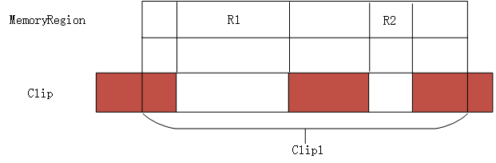

棕色部分意味着已经存在的映射, 这种情况下只需要把 R1 和 R2 映射进来即可. 最终 FlatView 中的 FlatRange 按照在物理地址空间的布局, 依次排列. 但是按照实际情况来讲, 实际上传递进来的 MR 是整个地址空间 system_space,所以像图中那样比较复杂的格局应该基本不会出现. 不过咱们还是根据代码来看. 首先获取了当前 MR 的区间范围, 以 base 为起点. 我们目的是要把 MR 的区间映射进 clip 中, 所以如果两者没有交叉, 那么无法完成映射. 接着设置 clip 为二者地址区间重叠的部分, 以图中所示, clip 就成了 clip1 所标的范围. 如果当前 MR 是某个 subregion,则需要对其原始的 MR 进行展开, 因为具体的信息都保存在原始的 MR 中. 但是全局 MR system_memory 作为参数传递进来, 那么这里 mr->alias 为 NULL, 所以到了下面对 system_memory 的每个 subregion 均进行展开. 就这样再次进入 render_memory_region 函数的时候, MR 为某个 subregion, clip 也为 subregion 对应的区域和原始 clip 的交集, 由于其 mr->alias 指向原始 MR, 进入 if 判断, 对原始 MR 的对应区间进行展开, 再次调用 render_memory_region. 这一次就要进行真正的展开操作了, 即生成对应的 FlatRange.

顺着函数往下走, 涉及几个变量这里先介绍下, offset_in_region 为对应 MR 在全局地址空间中的偏移, base 为一个移动指针, 指向当前映射的小区间, 指导每个 FR 的映射. now 当前已经映射的 FR 的长度, 有两种可能, 第一可能是当前映射的 FR, 第二可能是已经映射的 FR. remain 表示当前 clip 中剩下的未映射的部分(不考虑已经存在的 FR), 有了这些再看下面的代码就不吃力了.

核心的工作起始于一个 for 循环, 循环的条件是 view->nr && int128_nz(remain), 表示当前还有未遍历的 FR 并且 remain 还有剩余. 循环中如果 MR base 的值大于或者等于当前 FR 的 end,则继续往后遍历 FR, 否则进入下面, 如果 base 小于当前 FR 的 start, 则表明 base 到 start 之间的区间还没有映射, 则为其进行映射, now 表示要映射的长度, 取 remain 和 int128_sub(view->ranges[i].addr.start, base)之间的最小值, 后者表示下一个 FR 的 start 和 base 之间的差值, 当然按照 clip 为准. 接下来就没难度了, 设置 FR 的 offset_in_region 和 addr,然后调用 flatview_insert 插入到 FlatView 的 FlatRange 数组中. 不过由于 FR 按照地址顺序排列, 如果插入位置靠前, 则需要移动较多的项, 不知道为何不用链表实现. 下面就很自然了移动 base, 增加 offset_in_region, 减少 remain 等操作. 出了 if,此时 base 已经和 FR 的 start 对齐, 所以还需要略过当前 FR. 就这么一直映射下去.

出了 for 循环, 如果 remain 不为 0, 则表明还有没有映射的, 但是现在已经没有已经存在的 FR 了, 所以不会发生冲突, 直接把 remain 直接映射成一个 FR 即可.

按照这个思路, 吧所有的 subregion 都映射下去, 最终把 FlatView 返回.

qemu 要把**MemoryRegion**映射到 cpu 看到的**线性地址上**(**AddressSpace**), 但是有些情况**两个设备**的内存映射到**相同的线性地址**, 比如 mmio. 举个例子,对于一个**内存条是 4g**, 它的线性地址为**0-4g**, 但是**vga 设备**的内存地址通过**mmio 映射**到**线性地址**的`768k–(768+256k)`, 这种情况应该使 vga 的线性地址覆盖掉 ram 的`768k–(768+256k)`地址,这样写 vga 地址才能成功.

**FlatRang**则表示一个 MemoryRegion 映射到线性空间的一段地址.

qemu 内存建模是通过**优先级**来实现**内存地址的覆盖**, 优先级高的 MemoryRegion 先被转换为 **FlatRang**, 后面渲染的时候**低优先级**的 FlatRang**不覆盖高优先级**的 FlatRang, **低优先级**的**FlatRang**如果被**高优先级**的 FlatRang**截断**则**只保存**不被高优先级遮盖的部分到 flatview, 这是`render_memory_region` 的 677 行到 704 行的主要工作

MemoryRegion 的 terminates 变量如果为 false 表示它是一个**纯容器**, 纯容器自身**没有线性地址**(只规定一个偏移和大小来限制子区域线性地址的取值), 通过子 region 来生成线性地址, 所以纯容器所规定的线性地址空间可能留下空洞,会被其他低优先级的 MemoryRegion 所填充 MemoryRegion 的 addr 变量表示相对于父容器的偏移, 和大小,FlatRange 的 offset_in_region 变量表示该 FlatRange 相对所在 MemoryRegion 的位置(因为一个 MemoryRegion 可能被高优先级的 MemoryRegion 截断成多段,所以 offset_in_region 不一定为 0)

fr.addr 标示该 FlatRange 在线性地址空间的偏移

FlatRange 在 FlatView 中是按照地址升序来排列的, 另外不存在地址重合的 FlatRange.

后面把结束地址小于 MemoryRegion 开始地址的 FlatRange 都排除掉,因为他们的地址和我们要生成的地址有冲突

剩下的地址分为如下四种情况

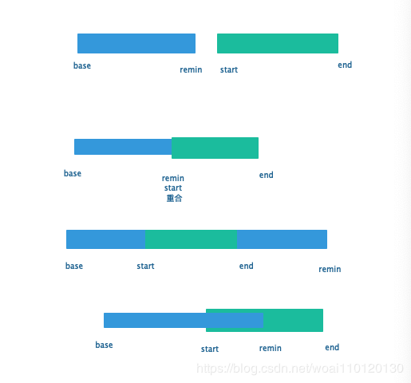

base 表示要生成的地址空间的开始 remin 表示要生成地址空间的结尾

start 表示下一个要比较的地址空间的开始, end 表示下一个要比较地址空间的结尾

for 循环中处理的就是图中的 1, 2, 4.

先把 base 到 min(remin, start) 这段地址生成一个 FlatRange(不和其他地址重合)

将剩余部分地址裁剪出来, 其实还有一部分 FlatRange 可能要生成新的 FlatRange(end 到 remin)

如果是 alias 还要展开自己, 这个说法是不对的. 事实上, alias mr 和它指向的 mr 的"gpa"(base+addr)并不一定一致, 如果都展开, 映射就重复了.

下面是 info mtree 打印出来的虚拟机 address-space 及 memory-region(被 alias mr 指向的 mr)

```
address-space: memory
  0000000000000000-ffffffffffffffff (prio 0, RW): system
    0000000000000000-00000000bfffffff (prio 0, RW): alias ram-below-4g @pc.ram 0000000000000000-00000000bfffffff
    0000000000000000-ffffffffffffffff (prio -1, RW): pci
      00000000000a0000-00000000000bffff (prio 1, RW): cirrus-lowmem-container
        00000000000a0000-00000000000a7fff (prio 1, RW): alias vga.bank0 @vga.vram 0000000000000000-0000000000007fff
        00000000000a0000-00000000000bffff (prio 0, RW): cirrus-low-memory
        00000000000a8000-00000000000affff (prio 1, RW): alias vga.bank1 @vga.vram 0000000000008000-000000000000ffff
      00000000000c0000-00000000000dffff (prio 1, RW): pc.rom
      00000000000e0000-00000000000fffff (prio 1, R-): alias isa-bios @pc.bios 0000000000020000-000000000003ffff
      00000000fc000000-00000000fdffffff (prio 1, RW): cirrus-pci-bar0
        00000000fc000000-00000000fc7fffff (prio 1, RW): vga.vram
        00000000fc000000-00000000fc7fffff (prio 0, RW): cirrus-linear-io
        00000000fd000000-00000000fd3fffff (prio 0, RW): cirrus-bitblt-mmio
      00000000febf0000-00000000febf0fff (prio 1, RW): cirrus-mmio
      00000000febf1000-00000000febf1fff (prio 1, RW): virtio-scsi-pci-msix
        00000000febf1000-00000000febf103f (prio 0, RW): msix-table
        00000000febf1800-00000000febf1807 (prio 0, RW): msix-pba
      00000000febf2000-00000000febf2fff (prio 1, RW): virtio-serial-pci-msix
        00000000febf2000-00000000febf201f (prio 0, RW): msix-table
        00000000febf2800-00000000febf2807 (prio 0, RW): msix-pba
      00000000fffc0000-00000000ffffffff (prio 0, R-): pc.bios
    00000000000a0000-00000000000bffff (prio 1, RW): alias smram-region @pci 00000000000a0000-00000000000bffff
    00000000000c0000-00000000000c3fff (prio 1, RW): alias pam-ram @pc.ram 00000000000c0000-00000000000c3fff [disabled]
    00000000000c0000-00000000000c3fff (prio 1, RW): alias pam-pci @pc.ram 00000000000c0000-00000000000c3fff [disabled]
    00000000000c0000-00000000000c3fff (prio 1, R-): alias pam-rom @pc.ram 00000000000c0000-00000000000c3fff
    00000000000c0000-00000000000c3fff (prio 1, RW): alias pam-pci @pci 00000000000c0000-00000000000c3fff [disabled]
    00000000000c4000-00000000000c7fff (prio 1, RW): alias pam-ram @pc.ram 00000000000c4000-00000000000c7fff [disabled]
    00000000000c4000-00000000000c7fff (prio 1, RW): alias pam-pci @pc.ram 00000000000c4000-00000000000c7fff [disabled]
    00000000000c4000-00000000000c7fff (prio 1, R-): alias pam-rom @pc.ram 00000000000c4000-00000000000c7fff
    00000000000c4000-00000000000c7fff (prio 1, RW): alias pam-pci @pci 00000000000c4000-00000000000c7fff [disabled]
    00000000000c8000-00000000000cbfff (prio 1, RW): alias pam-ram @pc.ram 00000000000c8000-00000000000cbfff [disabled]
    00000000000c8000-00000000000cbfff (prio 1, RW): alias pam-pci @pc.ram 00000000000c8000-00000000000cbfff [disabled]
    00000000000c8000-00000000000cbfff (prio 1, R-): alias pam-rom @pc.ram 00000000000c8000-00000000000cbfff
    00000000000c8000-00000000000cbfff (prio 1, RW): alias pam-pci @pci 00000000000c8000-00000000000cbfff [disabled]
    00000000000c9000-00000000000cbfff (prio 1000, RW): alias kvmvapic-rom @pc.ram 00000000000c9000-00000000000cbfff
    00000000000cc000-00000000000cffff (prio 1, RW): alias pam-ram @pc.ram 00000000000cc000-00000000000cffff [disabled]
    00000000000cc000-00000000000cffff (prio 1, RW): alias pam-pci @pc.ram 00000000000cc000-00000000000cffff [disabled]
    00000000000cc000-00000000000cffff (prio 1, R-): alias pam-rom @pc.ram 00000000000cc000-00000000000cffff
    00000000000cc000-00000000000cffff (prio 1, RW): alias pam-pci @pci 00000000000cc000-00000000000cffff [disabled]
    00000000000d0000-00000000000d3fff (prio 1, RW): alias pam-ram @pc.ram 00000000000d0000-00000000000d3fff [disabled]
    00000000000d0000-00000000000d3fff (prio 1, RW): alias pam-pci @pc.ram 00000000000d0000-00000000000d3fff [disabled]
    00000000000d0000-00000000000d3fff (prio 1, R-): alias pam-rom @pc.ram 00000000000d0000-00000000000d3fff
    00000000000d0000-00000000000d3fff (prio 1, RW): alias pam-pci @pci 00000000000d0000-00000000000d3fff [disabled]
    00000000000d4000-00000000000d7fff (prio 1, RW): alias pam-ram @pc.ram 00000000000d4000-00000000000d7fff [disabled]
    00000000000d4000-00000000000d7fff (prio 1, RW): alias pam-pci @pc.ram 00000000000d4000-00000000000d7fff [disabled]
    00000000000d4000-00000000000d7fff (prio 1, R-): alias pam-rom @pc.ram 00000000000d4000-00000000000d7fff
    00000000000d4000-00000000000d7fff (prio 1, RW): alias pam-pci @pci 00000000000d4000-00000000000d7fff [disabled]
    00000000000d8000-00000000000dbfff (prio 1, RW): alias pam-ram @pc.ram 00000000000d8000-00000000000dbfff [disabled]
    00000000000d8000-00000000000dbfff (prio 1, RW): alias pam-pci @pc.ram 00000000000d8000-00000000000dbfff [disabled]
    00000000000d8000-00000000000dbfff (prio 1, R-): alias pam-rom @pc.ram 00000000000d8000-00000000000dbfff
    00000000000d8000-00000000000dbfff (prio 1, RW): alias pam-pci @pci 00000000000d8000-00000000000dbfff [disabled]
    00000000000dc000-00000000000dffff (prio 1, RW): alias pam-ram @pc.ram 00000000000dc000-00000000000dffff [disabled]
    00000000000dc000-00000000000dffff (prio 1, RW): alias pam-pci @pc.ram 00000000000dc000-00000000000dffff [disabled]
    00000000000dc000-00000000000dffff (prio 1, R-): alias pam-rom @pc.ram 00000000000dc000-00000000000dffff
    00000000000dc000-00000000000dffff (prio 1, RW): alias pam-pci @pci 00000000000dc000-00000000000dffff [disabled]
    00000000000e0000-00000000000e3fff (prio 1, RW): alias pam-ram @pc.ram 00000000000e0000-00000000000e3fff [disabled]
    00000000000e0000-00000000000e3fff (prio 1, RW): alias pam-pci @pc.ram 00000000000e0000-00000000000e3fff [disabled]
    00000000000e0000-00000000000e3fff (prio 1, R-): alias pam-rom @pc.ram 00000000000e0000-00000000000e3fff
    00000000000e0000-00000000000e3fff (prio 1, RW): alias pam-pci @pci 00000000000e0000-00000000000e3fff [disabled]
    00000000000e4000-00000000000e7fff (prio 1, RW): alias pam-ram @pc.ram 00000000000e4000-00000000000e7fff [disabled]
    00000000000e4000-00000000000e7fff (prio 1, RW): alias pam-pci @pc.ram 00000000000e4000-00000000000e7fff [disabled]
    00000000000e4000-00000000000e7fff (prio 1, R-): alias pam-rom @pc.ram 00000000000e4000-00000000000e7fff
    00000000000e4000-00000000000e7fff (prio 1, RW): alias pam-pci @pci 00000000000e4000-00000000000e7fff [disabled]
    00000000000e8000-00000000000ebfff (prio 1, RW): alias pam-ram @pc.ram 00000000000e8000-00000000000ebfff [disabled]
    00000000000e8000-00000000000ebfff (prio 1, RW): alias pam-pci @pc.ram 00000000000e8000-00000000000ebfff [disabled]
    00000000000e8000-00000000000ebfff (prio 1, R-): alias pam-rom @pc.ram 00000000000e8000-00000000000ebfff
    00000000000e8000-00000000000ebfff (prio 1, RW): alias pam-pci @pci 00000000000e8000-00000000000ebfff [disabled]
    00000000000ec000-00000000000effff (prio 1, RW): alias pam-ram @pc.ram 00000000000ec000-00000000000effff
    00000000000ec000-00000000000effff (prio 1, RW): alias pam-pci @pc.ram 00000000000ec000-00000000000effff [disabled]
    00000000000ec000-00000000000effff (prio 1, R-): alias pam-rom @pc.ram 00000000000ec000-00000000000effff [disabled]
    00000000000ec000-00000000000effff (prio 1, RW): alias pam-pci @pci 00000000000ec000-00000000000effff [disabled]
    00000000000f0000-00000000000fffff (prio 1, RW): alias pam-ram @pc.ram 00000000000f0000-00000000000fffff [disabled]
    00000000000f0000-00000000000fffff (prio 1, RW): alias pam-pci @pc.ram 00000000000f0000-00000000000fffff [disabled]
    00000000000f0000-00000000000fffff (prio 1, R-): alias pam-rom @pc.ram 00000000000f0000-00000000000fffff
    00000000000f0000-00000000000fffff (prio 1, RW): alias pam-pci @pci 00000000000f0000-00000000000fffff [disabled]
    00000000fec00000-00000000fec00fff (prio 0, RW): kvm-ioapic
    00000000fee00000-00000000feefffff (prio 4096, RW): kvm-apic-msi
    0000000100000000-000000013fffffff (prio 0, RW): alias ram-above-4g @pc.ram 00000000c0000000-00000000ffffffff

address-space: I/O
  0000000000000000-000000000000ffff (prio 0, RW): io
    0000000000000000-0000000000000007 (prio 0, RW): dma-chan
    0000000000000008-000000000000000f (prio 0, RW): dma-cont
    0000000000000020-0000000000000021 (prio 0, RW): kvm-pic
    0000000000000040-0000000000000043 (prio 0, RW): kvm-pit
    0000000000000060-0000000000000060 (prio 0, RW): i8042-data
    0000000000000061-0000000000000061 (prio 0, RW): pcspk
    0000000000000064-0000000000000064 (prio 0, RW): i8042-cmd
    0000000000000070-0000000000000071 (prio 0, RW): rtc
    000000000000007e-000000000000007f (prio 0, RW): kvmvapic
    0000000000000080-0000000000000080 (prio 0, RW): ioport80
    0000000000000081-0000000000000083 (prio 0, RW): dma-page
    0000000000000087-0000000000000087 (prio 0, RW): dma-page
    0000000000000089-000000000000008b (prio 0, RW): dma-page
    000000000000008f-000000000000008f (prio 0, RW): dma-page
    0000000000000092-0000000000000092 (prio 0, RW): port92
    00000000000000a0-00000000000000a1 (prio 0, RW): kvm-pic
    00000000000000b2-00000000000000b3 (prio 0, RW): apm-io
    00000000000000c0-00000000000000cf (prio 0, RW): dma-chan
    00000000000000d0-00000000000000df (prio 0, RW): dma-cont
    00000000000000f0-00000000000000f0 (prio 0, RW): ioportF0
    0000000000000170-0000000000000177 (prio 0, RW): ide
    00000000000001f0-00000000000001f7 (prio 0, RW): ide
    0000000000000376-0000000000000376 (prio 0, RW): ide
    00000000000003b0-00000000000003df (prio 0, RW): cirrus-io
    00000000000003f1-00000000000003f5 (prio 0, RW): fdc
    00000000000003f6-00000000000003f6 (prio 0, RW): ide
    00000000000003f7-00000000000003f7 (prio 0, RW): fdc
    00000000000003f8-00000000000003ff (prio 0, RW): serial
    00000000000004d0-00000000000004d0 (prio 0, RW): kvm-elcr
    00000000000004d1-00000000000004d1 (prio 0, RW): kvm-elcr
    0000000000000510-0000000000000511 (prio 0, RW): fwcfg
    0000000000000514-000000000000051b (prio 0, RW): fwcfg.dma
    0000000000000600-000000000000063f (prio 0, RW): piix4-pm
      0000000000000600-0000000000000603 (prio 0, RW): acpi-evt
      0000000000000604-0000000000000605 (prio 0, RW): acpi-cnt
      0000000000000608-000000000000060b (prio 0, RW): acpi-tmr
    0000000000000700-000000000000073f (prio 0, RW): pm-smbus
    0000000000000cf8-0000000000000cfb (prio 0, RW): pci-conf-idx
    0000000000000cf9-0000000000000cf9 (prio 1, RW): piix3-reset-control
    0000000000000cfc-0000000000000cff (prio 0, RW): pci-conf-data
    0000000000005658-0000000000005658 (prio 0, RW): vmport
    000000000000ae00-000000000000ae13 (prio 0, RW): acpi-pci-hotplug
    000000000000af00-000000000000af1f (prio 0, RW): acpi-cpu-hotplug
    000000000000afe0-000000000000afe3 (prio 0, RW): acpi-gpe0
    000000000000c000-000000000000c0ff (prio 1, RW): pv_channel
    000000000000c100-000000000000c13f (prio 1, RW): virtio-pci
    000000000000c140-000000000000c15f (prio 1, RW): uhci
    000000000000c160-000000000000c17f (prio 1, RW): virtio-pci
    000000000000c180-000000000000c19f (prio 1, RW): virtio-pci
    000000000000c1a0-000000000000c1af (prio 1, RW): piix-bmdma-container
      000000000000c1a0-000000000000c1a3 (prio 0, RW): piix-bmdma
      000000000000c1a4-000000000000c1a7 (prio 0, RW): bmdma
      000000000000c1a8-000000000000c1ab (prio 0, RW): piix-bmdma
      000000000000c1ac-000000000000c1af (prio 0, RW): bmdma

address-space: i440FX
  0000000000000000-ffffffffffffffff (prio 0, RW): alias bus master @system 0000000000000000-ffffffffffffffff [disabled]

address-space: PIIX3
  0000000000000000-ffffffffffffffff (prio 0, RW): alias bus master @system 0000000000000000-ffffffffffffffff [disabled]

address-space: piix3-ide
  0000000000000000-ffffffffffffffff (prio 0, RW): alias bus master @system 0000000000000000-ffffffffffffffff

address-space: PIIX4_PM
  0000000000000000-ffffffffffffffff (prio 0, RW): alias bus master @system 0000000000000000-ffffffffffffffff [disabled]

address-space: piix3-usb-uhci
  0000000000000000-ffffffffffffffff (prio 0, RW): alias bus master @system 0000000000000000-ffffffffffffffff

address-space: virtio-scsi-pci
  0000000000000000-ffffffffffffffff (prio 0, RW): alias bus master @system 0000000000000000-ffffffffffffffff

address-space: virtio-pci-cfg-as
  0000000000000000-00000000007fffff (prio 0, RW): alias virtio-pci-cfg @virtio-pci 0000000000000000-00000000007fffff

address-space: virtio-serial-pci
  0000000000000000-ffffffffffffffff (prio 0, RW): alias bus master @system 0000000000000000-ffffffffffffffff

address-space: virtio-pci-cfg-as
  0000000000000000-00000000007fffff (prio 0, RW): alias virtio-pci-cfg @virtio-pci 0000000000000000-00000000007fffff

address-space: cirrus-vga
  0000000000000000-ffffffffffffffff (prio 0, RW): alias bus master @system 0000000000000000-ffffffffffffffff [disabled]

address-space: virtio-balloon-pci
  0000000000000000-ffffffffffffffff (prio 0, RW): alias bus master @system 0000000000000000-ffffffffffffffff

address-space: virtio-pci-cfg-as
  0000000000000000-00000000007fffff (prio 0, RW): alias virtio-pci-cfg @virtio-pci 0000000000000000-00000000007fffff

address-space: pv_channel
  0000000000000000-ffffffffffffffff (prio 0, RW): alias bus master @system 0000000000000000-ffffffffffffffff [disabled]

address-space: KVM-SMRAM
  0000000000000000-ffffffffffffffff (prio 0, RW): mem-container-smram
    0000000000000000-00000000ffffffff (prio 10, RW): smram
      00000000000a0000-00000000000bffff (prio 0, RW): alias smram-low @pc.ram 00000000000a0000-00000000000bffff
    0000000000000000-ffffffffffffffff (prio 0, RW): alias mem-smram @system 0000000000000000-ffffffffffffffff

memory-region: pc.ram
  0000000000000000-00000000ffffffff (prio 0, RW): pc.ram

memory-region: vga.vram
  0000000000000000-00000000007fffff (prio 1, RW): vga.vram

memory-region: pc.bios
  00000000fffc0000-00000000ffffffff (prio 0, R-): pc.bios

memory-region: pci
  0000000000000000-ffffffffffffffff (prio -1, RW): pci
    00000000000a0000-00000000000bffff (prio 1, RW): cirrus-lowmem-container
      00000000000a0000-00000000000a7fff (prio 1, RW): alias vga.bank0 @vga.vram 0000000000000000-0000000000007fff
      00000000000a0000-00000000000bffff (prio 0, RW): cirrus-low-memory
      00000000000a8000-00000000000affff (prio 1, RW): alias vga.bank1 @vga.vram 0000000000008000-000000000000ffff
    00000000000c0000-00000000000dffff (prio 1, RW): pc.rom
    00000000000e0000-00000000000fffff (prio 1, R-): alias isa-bios @pc.bios 0000000000020000-000000000003ffff
    00000000fc000000-00000000fdffffff (prio 1, RW): cirrus-pci-bar0
      00000000fc000000-00000000fc7fffff (prio 1, RW): vga.vram
      00000000fc000000-00000000fc7fffff (prio 0, RW): cirrus-linear-io
      00000000fd000000-00000000fd3fffff (prio 0, RW): cirrus-bitblt-mmio
    00000000febf0000-00000000febf0fff (prio 1, RW): cirrus-mmio
    00000000febf1000-00000000febf1fff (prio 1, RW): virtio-scsi-pci-msix
      00000000febf1000-00000000febf103f (prio 0, RW): msix-table
      00000000febf1800-00000000febf1807 (prio 0, RW): msix-pba
    00000000febf2000-00000000febf2fff (prio 1, RW): virtio-serial-pci-msix
      00000000febf2000-00000000febf201f (prio 0, RW): msix-table
      00000000febf2800-00000000febf2807 (prio 0, RW): msix-pba
    00000000fffc0000-00000000ffffffff (prio 0, R-): pc.bios

memory-region: system
  0000000000000000-ffffffffffffffff (prio 0, RW): system
    0000000000000000-00000000bfffffff (prio 0, RW): alias ram-below-4g @pc.ram 0000000000000000-00000000bfffffff
    0000000000000000-ffffffffffffffff (prio -1, RW): pci
      00000000000a0000-00000000000bffff (prio 1, RW): cirrus-lowmem-container
        00000000000a0000-00000000000a7fff (prio 1, RW): alias vga.bank0 @vga.vram 0000000000000000-0000000000007fff
        00000000000a0000-00000000000bffff (prio 0, RW): cirrus-low-memory
        00000000000a8000-00000000000affff (prio 1, RW): alias vga.bank1 @vga.vram 0000000000008000-000000000000ffff
      00000000000c0000-00000000000dffff (prio 1, RW): pc.rom
      00000000000e0000-00000000000fffff (prio 1, R-): alias isa-bios @pc.bios 0000000000020000-000000000003ffff
      00000000fc000000-00000000fdffffff (prio 1, RW): cirrus-pci-bar0
        00000000fc000000-00000000fc7fffff (prio 1, RW): vga.vram
        00000000fc000000-00000000fc7fffff (prio 0, RW): cirrus-linear-io
        00000000fd000000-00000000fd3fffff (prio 0, RW): cirrus-bitblt-mmio
      00000000febf0000-00000000febf0fff (prio 1, RW): cirrus-mmio
      00000000febf1000-00000000febf1fff (prio 1, RW): virtio-scsi-pci-msix
        00000000febf1000-00000000febf103f (prio 0, RW): msix-table
        00000000febf1800-00000000febf1807 (prio 0, RW): msix-pba
      00000000febf2000-00000000febf2fff (prio 1, RW): virtio-serial-pci-msix
        00000000febf2000-00000000febf201f (prio 0, RW): msix-table
        00000000febf2800-00000000febf2807 (prio 0, RW): msix-pba
      00000000fffc0000-00000000ffffffff (prio 0, R-): pc.bios
    00000000000a0000-00000000000bffff (prio 1, RW): alias smram-region @pci 00000000000a0000-00000000000bffff
    00000000000c0000-00000000000c3fff (prio 1, RW): alias pam-ram @pc.ram 00000000000c0000-00000000000c3fff [disabled]
    00000000000c0000-00000000000c3fff (prio 1, RW): alias pam-pci @pc.ram 00000000000c0000-00000000000c3fff [disabled]
    00000000000c0000-00000000000c3fff (prio 1, R-): alias pam-rom @pc.ram 00000000000c0000-00000000000c3fff
    00000000000c0000-00000000000c3fff (prio 1, RW): alias pam-pci @pci 00000000000c0000-00000000000c3fff [disabled]
    00000000000c4000-00000000000c7fff (prio 1, RW): alias pam-ram @pc.ram 00000000000c4000-00000000000c7fff [disabled]
    00000000000c4000-00000000000c7fff (prio 1, RW): alias pam-pci @pc.ram 00000000000c4000-00000000000c7fff [disabled]
    00000000000c4000-00000000000c7fff (prio 1, R-): alias pam-rom @pc.ram 00000000000c4000-00000000000c7fff
    00000000000c4000-00000000000c7fff (prio 1, RW): alias pam-pci @pci 00000000000c4000-00000000000c7fff [disabled]
    00000000000c8000-00000000000cbfff (prio 1, RW): alias pam-ram @pc.ram 00000000000c8000-00000000000cbfff [disabled]
    00000000000c8000-00000000000cbfff (prio 1, RW): alias pam-pci @pc.ram 00000000000c8000-00000000000cbfff [disabled]
    00000000000c8000-00000000000cbfff (prio 1, R-): alias pam-rom @pc.ram 00000000000c8000-00000000000cbfff
    00000000000c8000-00000000000cbfff (prio 1, RW): alias pam-pci @pci 00000000000c8000-00000000000cbfff [disabled]
    00000000000c9000-00000000000cbfff (prio 1000, RW): alias kvmvapic-rom @pc.ram 00000000000c9000-00000000000cbfff
    00000000000cc000-00000000000cffff (prio 1, RW): alias pam-ram @pc.ram 00000000000cc000-00000000000cffff [disabled]
    00000000000cc000-00000000000cffff (prio 1, RW): alias pam-pci @pc.ram 00000000000cc000-00000000000cffff [disabled]
    00000000000cc000-00000000000cffff (prio 1, R-): alias pam-rom @pc.ram 00000000000cc000-00000000000cffff
    00000000000cc000-00000000000cffff (prio 1, RW): alias pam-pci @pci 00000000000cc000-00000000000cffff [disabled]
    00000000000d0000-00000000000d3fff (prio 1, RW): alias pam-ram @pc.ram 00000000000d0000-00000000000d3fff [disabled]
    00000000000d0000-00000000000d3fff (prio 1, RW): alias pam-pci @pc.ram 00000000000d0000-00000000000d3fff [disabled]
    00000000000d0000-00000000000d3fff (prio 1, R-): alias pam-rom @pc.ram 00000000000d0000-00000000000d3fff
    00000000000d0000-00000000000d3fff (prio 1, RW): alias pam-pci @pci 00000000000d0000-00000000000d3fff [disabled]
    00000000000d4000-00000000000d7fff (prio 1, RW): alias pam-ram @pc.ram 00000000000d4000-00000000000d7fff [disabled]
    00000000000d4000-00000000000d7fff (prio 1, RW): alias pam-pci @pc.ram 00000000000d4000-00000000000d7fff [disabled]
    00000000000d4000-00000000000d7fff (prio 1, R-): alias pam-rom @pc.ram 00000000000d4000-00000000000d7fff
    00000000000d4000-00000000000d7fff (prio 1, RW): alias pam-pci @pci 00000000000d4000-00000000000d7fff [disabled]
    00000000000d8000-00000000000dbfff (prio 1, RW): alias pam-ram @pc.ram 00000000000d8000-00000000000dbfff [disabled]
    00000000000d8000-00000000000dbfff (prio 1, RW): alias pam-pci @pc.ram 00000000000d8000-00000000000dbfff [disabled]
    00000000000d8000-00000000000dbfff (prio 1, R-): alias pam-rom @pc.ram 00000000000d8000-00000000000dbfff
    00000000000d8000-00000000000dbfff (prio 1, RW): alias pam-pci @pci 00000000000d8000-00000000000dbfff [disabled]
    00000000000dc000-00000000000dffff (prio 1, RW): alias pam-ram @pc.ram 00000000000dc000-00000000000dffff [disabled]
    00000000000dc000-00000000000dffff (prio 1, RW): alias pam-pci @pc.ram 00000000000dc000-00000000000dffff [disabled]
    00000000000dc000-00000000000dffff (prio 1, R-): alias pam-rom @pc.ram 00000000000dc000-00000000000dffff
    00000000000dc000-00000000000dffff (prio 1, RW): alias pam-pci @pci 00000000000dc000-00000000000dffff [disabled]
    00000000000e0000-00000000000e3fff (prio 1, RW): alias pam-ram @pc.ram 00000000000e0000-00000000000e3fff [disabled]
    00000000000e0000-00000000000e3fff (prio 1, RW): alias pam-pci @pc.ram 00000000000e0000-00000000000e3fff [disabled]
    00000000000e0000-00000000000e3fff (prio 1, R-): alias pam-rom @pc.ram 00000000000e0000-00000000000e3fff
    00000000000e0000-00000000000e3fff (prio 1, RW): alias pam-pci @pci 00000000000e0000-00000000000e3fff [disabled]
    00000000000e4000-00000000000e7fff (prio 1, RW): alias pam-ram @pc.ram 00000000000e4000-00000000000e7fff [disabled]
    00000000000e4000-00000000000e7fff (prio 1, RW): alias pam-pci @pc.ram 00000000000e4000-00000000000e7fff [disabled]
    00000000000e4000-00000000000e7fff (prio 1, R-): alias pam-rom @pc.ram 00000000000e4000-00000000000e7fff
    00000000000e4000-00000000000e7fff (prio 1, RW): alias pam-pci @pci 00000000000e4000-00000000000e7fff [disabled]
    00000000000e8000-00000000000ebfff (prio 1, RW): alias pam-ram @pc.ram 00000000000e8000-00000000000ebfff [disabled]
    00000000000e8000-00000000000ebfff (prio 1, RW): alias pam-pci @pc.ram 00000000000e8000-00000000000ebfff [disabled]
    00000000000e8000-00000000000ebfff (prio 1, R-): alias pam-rom @pc.ram 00000000000e8000-00000000000ebfff
    00000000000e8000-00000000000ebfff (prio 1, RW): alias pam-pci @pci 00000000000e8000-00000000000ebfff [disabled]
    00000000000ec000-00000000000effff (prio 1, RW): alias pam-ram @pc.ram 00000000000ec000-00000000000effff
    00000000000ec000-00000000000effff (prio 1, RW): alias pam-pci @pc.ram 00000000000ec000-00000000000effff [disabled]
    00000000000ec000-00000000000effff (prio 1, R-): alias pam-rom @pc.ram 00000000000ec000-00000000000effff [disabled]
    00000000000ec000-00000000000effff (prio 1, RW): alias pam-pci @pci 00000000000ec000-00000000000effff [disabled]
    00000000000f0000-00000000000fffff (prio 1, RW): alias pam-ram @pc.ram 00000000000f0000-00000000000fffff [disabled]
    00000000000f0000-00000000000fffff (prio 1, RW): alias pam-pci @pc.ram 00000000000f0000-00000000000fffff [disabled]
    00000000000f0000-00000000000fffff (prio 1, R-): alias pam-rom @pc.ram 00000000000f0000-00000000000fffff
    00000000000f0000-00000000000fffff (prio 1, RW): alias pam-pci @pci 00000000000f0000-00000000000fffff [disabled]
    00000000fec00000-00000000fec00fff (prio 0, RW): kvm-ioapic
    00000000fee00000-00000000feefffff (prio 4096, RW): kvm-apic-msi
    0000000100000000-000000013fffffff (prio 0, RW): alias ram-above-4g @pc.ram 00000000c0000000-00000000ffffffff

memory-region: virtio-pci
  0000000000000000-00000000007fffff (prio 0, RW): virtio-pci

memory-region: virtio-pci
  0000000000000000-00000000007fffff (prio 0, RW): virtio-pci

memory-region: virtio-pci
  0000000000000000-00000000007fffff (prio 0, RW): virtio-pci
```

#### 4.3.1.2. address_space_set_flatview(): 设置 as 的 FlatView, 会调用 KVM

```cpp
static void address_space_set_flatview(AddressSpace *as)
{
    // 返回 as 的 current_map
    FlatView *old_view = address_space_to_flatview(as);
    // 获取 AddressSpace 的 root MR
    MemoryRegion *physmr = memory_region_get_flatview_root(as->root);
    // 在哈希表 flat_views 中根据 physmr(key)查找新的 new_view
    FlatView *new_view = g_hash_table_lookup(flat_views, physmr);

    assert(new_view);
    // 新旧相等, 不用更新
    if (old_view == new_view) {
        return;
    }
    // 下面逻辑是新旧 flatview 不等

    // 旧的非空则引用计数 + 1
    if (old_view) {
        flatview_ref(old_view);
    }

    // 新的增加引用
    flatview_ref(new_view);

    if (!QTAILQ_EMPTY(&as->listeners)) {
        FlatView tmpview = { .nr = 0 }, *old_view2 = old_view;
        // 旧的 fv 是空的, 则旧 fv 使用一个 fr 数目为 0 的 fv
        // 要不然就用旧的 fv
        if (!old_view2) {
            old_view2 = &tmpview;
        }
        // 删除
        address_space_update_topology_pass(as, old_view2, new_view, false);
        // 新加, 传参
        address_space_update_topology_pass(as, old_view2, new_view, true);
    }

    /* Writes are protected by the BQL.  */
    /* 设置新的 FlatView */
    atomic_rcu_set(&as->current_map, new_view);
    // 旧的引用计数 - 1
    if (old_view) {
        flatview_unref(old_view);
    }

    /* Note that all the old MemoryRegions are still alive up to this
     * point.  This relieves most MemoryListeners from the need to
     * ref/unref the MemoryRegions they get---unless they use them
     * outside the iothread mutex, in which case precise reference
     * counting is necessary.
     */
    if (old_view) {
        flatview_unref(old_view);
    }
}
```

在获取了**新旧两个 FlatView**之后, 调用了**两次**`address_space_update_topology_pass()`函数, 首次调用重在**删除原来的**, 而后者重在**添加**.

之后设置`as->current_map = new_view`.

对`old_view`**减少引用**, 当**引用计数为 1**时会**被删除**.

接下来重点在两个地方:

1、如何根据一个 MR 获取对应的 FlatView;

2、如何对旧的 FlatView 进行更新.

```cpp
static void address_space_update_topology_pass(AddressSpace *as,
                                               const FlatView *old_view,
                                               const FlatView *new_view,
                                               bool adding)
{
    unsigned iold, inew;
    FlatRange *frold, *frnew;

    /* Generate a symmetric difference of the old and new memory maps.
     * Kill ranges in the old map, and instantiate ranges in the new map.
     */
    iold = inew = 0;
    // 循环条件是 old_view->nr 和 new_view->nr, 即新旧 view 的可用 fr 数目
    while (iold < old_view->nr || inew < new_view->nr) {
        if (iold < old_view->nr) {
            frold = &old_view->ranges[iold];
        } else {
            frold = NULL;
        }
        if (inew < new_view->nr) {
            // flatrange 数组
            frnew = &new_view->ranges[inew];
        } else {
            frnew = NULL;
        }

        if (frold
            && (!frnew
                || int128_lt(frold->addr.start, frnew->addr.start)
                || (int128_eq(frold->addr.start, frnew->addr.start)
                    && !flatrange_equal(frold, frnew)))) {
            /* In old but not in new, or in both but attributes changed. */

            if (!adding) {
                flat_range_coalesced_io_del(frold, as);
                MEMORY_LISTENER_UPDATE_REGION(frold, as, Reverse, region_del);
            }

            ++iold;
        } else if (frold && frnew && flatrange_equal(frold, frnew)) {
            /* In both and unchanged (except logging may have changed) */

            if (adding) {
                MEMORY_LISTENER_UPDATE_REGION(frnew, as, Forward, region_nop);
                if (frnew->dirty_log_mask & ~frold->dirty_log_mask) {
                    MEMORY_LISTENER_UPDATE_REGION(frnew, as, Forward, log_start,
                                                  frold->dirty_log_mask,
                                                  frnew->dirty_log_mask);
                }
                if (frold->dirty_log_mask & ~frnew->dirty_log_mask) {
                    MEMORY_LISTENER_UPDATE_REGION(frnew, as, Reverse, log_stop,
                                                  frold->dirty_log_mask,
                                                  frnew->dirty_log_mask);
                }
            }

            ++iold;
            ++inew;
        } else {
            /* In new */

            if (adding) {
                MEMORY_LISTENER_UPDATE_REGION(frnew, as, Forward, region_add);
                flat_range_coalesced_io_add(frnew, as);
            }

            ++inew;
        }
    }
}
```

该函数倒是不长, 主体是一个**while 循环**, 循环条件是`old_view->nr`和`new_view->nr`,表示**新旧 view**的**可用 FlatRange 数目**.

这里依次对**FR 数组**的**对应 FR** 做对比, 主要由下面几种情况: **frold**和**frnew**均存在、frold 存在但 frnew 不存在, frold 不存在但 frnew 存在.

下面的 if 划分和上面的略有不同:

1、如果`frold 不为空&&(frnew 为空||frold.start<frnew.start||frold.start=frnew.start)&&frold!=frnew`: 这种情况是**新旧 view 的地址范围不一样**, 则需要调用 lienter 的`region_del`对**frold 进行删除！！！**.

2、如果**frold 和 frnew 均不为空**且`frold.start=frnew.start`: 这种情况需要判断**日志掩码**, 如果`frold->dirty_log_mask && !frnew->dirty_log_mask`, 调用`log_stop`回调函数; 如果`frnew->dirty_log_mask && !frold->dirty_log_mask`, 调用`log_start`回调函数.

3、**frold 为空**但是**frnew 不为空**: 这种情况直接调用`region_add`回调函数**添加 region**.

函数主体逻辑基本如上所述, 那我们注意到, 当**adding 为 false**时, 执行的**只有第一个情况**下的处理, 就是删除 frold 的操作, 其余的处理只有在**adding 为 true**的时候才得以执行. 这意图就比较明确, **首次执行先删除多余的**, 下次**直接添加**或者**对日志做更新操作**了.

会调用`MEMORY_LISTENER_UPDATE_REGION()`**提交本次修改**

# 5. MEMORY_LISTENER_UPDATE_REGION(): 新 FlatRange 的更新

对于要添加的 FR, 调用了 `MEMORY_LISTENER_UPDATE_REGION(x)`

```cpp
/* No need to ref/unref .mr, the FlatRange keeps it alive.  */
#define MEMORY_LISTENER_UPDATE_REGION(fr, as, dir, callback, _args...)  \
    do {                                                                \
        MemoryRegionSection mrs = section_from_flat_range(fr,           \
                address_space_to_flatview(as));                         \
        MEMORY_LISTENER_CALL(as, callback, dir, &mrs, ##_args);         \
    } while(0)

// 将 flatview 转换成 MemoryRegionSection
static inline MemoryRegionSection
section_from_flat_range(FlatRange *fr, FlatView *fv)
{
    return (MemoryRegionSection) {
        // fr 对应的 mr
        .mr = fr->mr,
        .fv = fv,
        .offset_within_region = fr->offset_in_region, // 在 mr 中的 offset
        .size = fr->addr.size, // fr 在 as 中所占大小
        .offset_within_address_space = int128_get64(fr->addr.start), // 在虚拟机物理地址空间的起始地址, GPA
        .readonly = fr->readonly, // 是否可写
        .nonvolatile = fr->nonvolatile,
    };
}
```

其中`address_space_to_flatview`会返回 as 的`current_map`, 这个值应该是旧的 flatview

该宏实际上是另一个宏`MEMORY_LISTENER_CALL`的封装, 在`MEMORY_LISTENER_CALL`中临时生成一个`MemoryRegionSection`结构, 具体逻辑如下

```cpp
#define MEMORY_LISTENER_CALL(_as, _callback, _direction, _section, _args...) \
    do {                                                                \
        MemoryListener *_listener;                                      \
                                                                        \
        switch (_direction) {                                           \
        case Forward:                                                   \
            QTAILQ_FOREACH(_listener, &(_as)->listeners, link_as) {     \
                if (_listener->_callback) {                             \
                    _listener->_callback(_listener, _section, ##_args); \
                }                                                       \
            }                                                           \
            break;                                                      \
        case Reverse:                                                   \
            QTAILQ_FOREACH_REVERSE(_listener, &(_as)->listeners, link_as) { \
                if (_listener->_callback) {                             \
                    _listener->_callback(_listener, _section, ##_args); \
                }                                                       \
            }                                                           \
            break;                                                      \
        default:                                                        \
            abort();                                                    \
        }                                                               \
    } while (0)
```

这里有个`_direction`, 其实就是**遍历方向**, 因为**listener**按照**优先级**从**低到高**排列, 所以这里其实就是**确定让谁先处理**.

**Forward**就是**从前向后**, 而**reverse**就是**从后向前**.

还有一个值得注意的是`memory_listener_match`函数, **listener**有着**对应的 AddressSpace**, 会在其 `address_space_filter` 域指定, 注意如果**没有指定 AddressSpace**, 那么该 listener 对**所有 AddressSpace 均适用**, 否则**只适用于其指定的 AddressSpace**. 知道这些, 看这些代码就不成问题了.

这样`kvm_region_add()`函数得到执行.

```cpp
static void kvm_region_add(MemoryListener *listener,
                           MemoryRegionSection *section)
{
    KVMMemoryListener *kml = container_of(listener, KVMMemoryListener, listener);
    // mr 引用加 1
    memory_region_ref(section->mr);
    kvm_set_phys_mem(kml, section, true);
}

static void kvm_region_del(MemoryListener *listener,
                           MemoryRegionSection *section)
{
    KVMMemoryListener *kml = container_of(listener, KVMMemoryListener, listener);

    kvm_set_phys_mem(kml, section, false);
    // mr 引用减 1
    memory_region_unref(section->mr);
}
```

`kvm_region_add()`函数是核心 listener 的添加 region 的函数, 在 qemu 申请好内存后, 针对**每个 FR**, 调用了 listener 的`region_add 函数`. 最终需要利用此函数把**region 信息**告知**KVM**, KVM 以此对内存信息做记录.

## 5.1. kvm_set_phys_mem(): 修改内核内存

咱们直奔主题, 函数核心在`static void kvm_set_phys_mem(MemoryRegionSection *section, bool add)`函数中, QEMU 通过该函数修改虚拟机注册在内核中的内存, 达到为虚拟机添加/删除/移动内存的目的.

```cpp
static void kvm_set_phys_mem(KVMMemoryListener *kml,
                             MemoryRegionSection *section, bool add)
{
    KVMSlot *mem;
    int err;
    MemoryRegion *mr = section->mr;
    // 是否可写
    bool writeable = !mr->readonly && !mr->rom_device;
    hwaddr start_addr, size, slot_size;
    void *ram;
    // 如果不是 ram, 则不能写操作
    if (!memory_region_is_ram(mr)) {
        // 可写 或 kvm 不支持只读内存, 直接返回
        if (writeable || !kvm_readonly_mem_allowed) {
            return;
        } else if (!mr->romd_mode) {
            /* If the memory device is not in romd_mode, then we actually want
             * to remove the kvm memory slot so all accesses will trap. */
            add = false;
        }
    }
    // 得到 section 的 start address 和 size, 对齐后的结果
    // start_addr 是该段内存<fr/section>在虚拟机地址空间的的起始地址, GPA, 虚拟机物理地址
    size = kvm_align_section(section, &start_addr);
    if (!size) {
        return;
    }
    // 该 section/fr 所属的 mr 在分配的主机虚拟地址中的偏移(HVA) + 该块(section/fr)在所属 mr 中的偏移 +
    // 该块<fr/section>在虚拟机地址空间的起始地址(GPA)的对齐结果 - 该块<fr/section>在虚拟机地址空间的起始地址(GPA)
    // 后面这个是对齐的偏差
    /* use aligned delta to align the ram address */
    ram = memory_region_get_ram_ptr(mr) + section->offset_within_region +
          (start_addr - section->offset_within_address_space);
    // 加锁
    kvm_slots_lock(kml);
    // 删除
    if (!add) {
        // 循环
        do {
            slot_size = MIN(kvm_max_slot_size, size);
            /*  */
            mem = kvm_lookup_matching_slot(kml, start_addr, slot_size);
            if (!mem) {
                goto out;
            }
            if (mem->flags & KVM_MEM_LOG_DIRTY_PAGES) {
                kvm_physical_sync_dirty_bitmap(kml, section);
            }

            /* unregister the slot */
            g_free(mem->dirty_bmap);
            mem->dirty_bmap = NULL;
            mem->memory_size = 0;
            mem->flags = 0;
            err = kvm_set_user_memory_region(kml, mem, false);
            if (err) {
                fprintf(stderr, "%s: error unregistering slot: %s\n",
                        __func__, strerror(-err));
                abort();
            }
            start_addr += slot_size;
            size -= slot_size;
        } while (size);
        goto out;
    }
    // 注册新的 slot
    /* register the new slot */
    do {
        slot_size = MIN(kvm_max_slot_size, size);
        // 生成新的 slot 并初始化
        mem = kvm_alloc_slot(kml);
        // 内存大小
        mem->memory_size = slot_size;
        // start_addr 是该段内存的起始地址, GPA, 虚拟机物理地址
        mem->start_addr = start_addr;
        // 主机虚拟地址, HVA, qemu 分配的
        mem->ram = ram;
        mem->flags = kvm_mem_flags(mr);

        if (mem->flags & KVM_MEM_LOG_DIRTY_PAGES) {
            /*
             * Reallocate the bmap; it means it doesn't disappear in
             * middle of a migrate.
             */
            kvm_memslot_init_dirty_bitmap(mem);
        }
        err = kvm_set_user_memory_region(kml, mem, true);
        if (err) {
            fprintf(stderr, "%s: error registering slot: %s\n", __func__,
                    strerror(-err));
            abort();
        }
        start_addr += slot_size;
        ram += slot_size;
        size -= slot_size;
    } while (size);

out:
    kvm_slots_unlock(kml);
}
```

### 5.1.1. 属性检查

获取**section 对应的 MR**的一些属性, 如 writeable、readonly_flag.

如果对应的 MR 关联的内存并**不是作为 ram 存在**, 就要进行额外的验证. 这种情况如果**writeable**允许写操作或者**kvm 不支持只读内存**, 那么**直接返回**.

### 5.1.2. kvm_align_section(): 得到 section/fr 的起始地址和大小

然后获取 section 的`start_addr`和 size, 其中`start_addr`就是 section 中的`offset_within_address_space`也就是**FR**中的`offset_in_region`,接下来对 size 进行了对齐操作.

```cpp
/*
 * Calculate and align the start address and the size of the section.
 * Return the size. If the size is 0, the aligned section is empty.
 */
static hwaddr kvm_align_section(MemoryRegionSection *section,
                                hwaddr *start)
{
    // 内存大小
    hwaddr size = int128_get64(section->size);
    hwaddr delta, aligned;

    /* kvm works in page size chunks, but the function may be called
       with sub-page size and unaligned start address. Pad the start
       address to next and truncate size to previous page boundary. */
    // 将在地址空间的偏移位置对齐到 qemu_real_host_page_size,
    // ROUND_UP(9,2)=10, 本来位置 9 改成对齐到位置 10
    aligned = ROUND_UP(section->offset_within_address_space,
                       qemu_real_host_page_size);
    // 减去原大小, 得到偏移
    delta = aligned - section->offset_within_address_space;
    // start 等于地址空间起始地址的对齐结果
    *start = aligned;
    if (delta > size) {
        return 0;
    }
    // 返回 size
    return (size - delta) & qemu_real_host_page_mask;
}
```

### 5.1.3. 计算该 section/fr 对应的主机虚拟机地址(HVA)

再计算 HVA, 主机虚拟地址,

```cpp
// 该 section/fr 所属的 mr 在分配的主机虚拟地址中的偏移(HVA) + 该块(section/fr)在所属 mr 中的偏移 +
// 该块<fr/section>在虚拟机地址空间的起始地址(GPA)的对齐结果 - 该块<fr/section>在虚拟机地址空间的起始地址(GPA)
ram = memory_region_get_ram_ptr(mr) + section->offset_within_region +
          (start_addr - section->offset_within_address_space);
```

```cpp
// 返回该 mr 实际映射的主机虚拟机地址(因为可能是 alias, 所以要加上 offset)
void *memory_region_get_ram_ptr(MemoryRegion *mr)
{
    void *ptr;
    uint64_t offset = 0;
    RCU_READ_LOCK_GUARD();
    while (mr->alias) {
        // 别名 mr 在真实 mr 中的偏移
        offset += mr->alias_offset;
        // 找到真实的 mr
        mr = mr->alias;
    }
    // ram_block 不能为空, 否则退出
    assert(mr->ram_block);
    // 返回 block->host + offset, qemu 分配的内存 + 偏移
    // offset 是查找的 mr 在真实的 mr 中偏移, alias 不与 ram_block 关联, 返回 qemu 分配的整个内存的一部分(属于该 mr 的)的起始地址, HVA
    ptr = qemu_map_ram_ptr(mr->ram_block, offset);
    return ptr;
}
```

### 5.1.4. kvm_set_user_memory_region(): 转化为 slot 然后注册到 KVM

接下来是函数的重点处理部分, 即把**当前的 section**转化成一个**slot**进行**添加**, 但是在此之前需要处理**已存在的 slot**和**新的 slot**的**重叠问题**, 当然如果没有重叠就好办了, 直接添加即可.

```cpp
static int kvm_set_user_memory_region(KVMMemoryListener *kml, KVMSlot *slot, bool new)
{
    KVMState *s = kvm_state;
    struct kvm_userspace_memory_region mem;
    int ret;

    mem.slot = slot->slot | (kml->as_id << 16);
    // 虚拟机物理地址
    mem.guest_phys_addr = slot->start_addr;
    mem.userspace_addr = (unsigned long)slot->ram;
    mem.flags = slot->flags;

    if (slot->memory_size && !new && (mem.flags ^ slot->old_flags) & KVM_MEM_READONLY) {
        /* Set the slot size to 0 before setting the slot to the desired
         * value. This is needed based on KVM commit 75d61fbc. */
        mem.memory_size = 0;
        kvm_vm_ioctl(s, KVM_SET_USER_MEMORY_REGION, &mem);
    }
    mem.memory_size = slot->memory_size;
    ret = kvm_vm_ioctl(s, KVM_SET_USER_MEMORY_REGION, &mem);
    slot->old_flags = mem.flags;
    trace_kvm_set_user_memory(mem.slot, mem.flags, mem.guest_phys_addr,
                              mem.memory_size, mem.userspace_addr, ret);
    return ret;
}
```

```cpp
    //
    ram = memory_region_get_ram_ptr(mr) + section->offset_within_region + delta;
    /*对重叠部分的处理*/
    while (1) {
        /*查找重叠的部分*/
        mem = kvm_lookup_overlapping_slot(s, start_addr, start_addr + size);
        /*如果没找到重叠, 就 break*/
        if (!mem) {
            break;
        }
        /*如果要添加区间已经被注册*/
        if (add && start_addr >= mem->start_addr &&
            (start_addr + size <= mem->start_addr + mem->memory_size) &&
            (ram - start_addr == mem->ram - mem->start_addr)) {
            /* The new slot fits into the existing one and comes with
             * identical parameters - update flags and done. */
            kvm_slot_dirty_pages_log_change(mem, log_dirty);
            return;
        }

        old = *mem;

        if (mem->flags & KVM_MEM_LOG_DIRTY_PAGES) {
            kvm_physical_sync_dirty_bitmap(section);
        }
        /*移除重叠的部分*/
        /* unregister the overlapping slot */
        mem->memory_size = 0;
        err = kvm_set_user_memory_region(s, mem);
        if (err) {
            fprintf(stderr, "%s: error unregistering overlapping slot: %s\n",
                    __func__, strerror(-err));
            abort();
        }

        /* Workaround for older KVM versions: we can't join slots, even not by
         * unregistering the previous ones and then registering the larger
         * slot. We have to maintain the existing fragmentation. Sigh.
         *
         * This workaround assumes that the new slot starts at the same
         * address as the first existing one. If not or if some overlapping
         * slot comes around later, we will fail (not seen in practice so far)
         * - and actually require a recent KVM version. */
         /*如果已有的 size 小于申请的 size, 则需要在原来的基础上, 添加新的, 不能删除原来的再次添加*/
        if (s->broken_set_mem_region &&
            old.start_addr == start_addr && old.memory_size < size && add) {
            mem = kvm_alloc_slot(s);
            mem->memory_size = old.memory_size;
            mem->start_addr = old.start_addr;
            mem->ram = old.ram;
            mem->flags = kvm_mem_flags(s, log_dirty, readonly_flag);

            err = kvm_set_user_memory_region(s, mem);
            if (err) {
                fprintf(stderr, "%s: error updating slot: %s\n", __func__,
                        strerror(-err));
                abort();
            }

            start_addr += old.memory_size;
            ram += old.memory_size;
            size -= old.memory_size;
            continue;
        }

        /* register prefix slot */
        /*new 的 start_addr 大于 old.start_addr, 需要补足前面多余的部分*/
        if (old.start_addr < start_addr) {
            mem = kvm_alloc_slot(s);
            mem->memory_size = start_addr - old.start_addr;
            mem->start_addr = old.start_addr;
            mem->ram = old.ram;
            mem->flags =  kvm_mem_flags(s, log_dirty, readonly_flag);

            err = kvm_set_user_memory_region(s, mem);
            if (err) {
                fprintf(stderr, "%s: error registering prefix slot: %s\n",
                        __func__, strerror(-err));
#ifdef TARGET_PPC
                fprintf(stderr, "%s: This is probably because your kernel's " \
                                "PAGE_SIZE is too big. Please try to use 4k " \
                                "PAGE_SIZE!\n", __func__);
#endif
                abort();
            }
        }

        /* register suffix slot */
        /* old 的 size 大于 新申请的 */
        if (old.start_addr + old.memory_size > start_addr + size) {
            ram_addr_t size_delta;

            mem = kvm_alloc_slot(s);
            mem->start_addr = start_addr + size;
            size_delta = mem->start_addr - old.start_addr;
            mem->memory_size = old.memory_size - size_delta;
            mem->ram = old.ram + size_delta;
            mem->flags = kvm_mem_flags(s, log_dirty, readonly_flag);

            err = kvm_set_user_memory_region(s, mem);
            if (err) {
                fprintf(stderr, "%s: error registering suffix slot: %s\n",
                        __func__, strerror(-err));
                abort();
            }
        }
    }
```

首先调用了 kvm_lookup_overlapping_slot 函数找到一个冲突的 slot, 注意返回结果是按照 slot 为单位, 只要两个地址范围有交叉, 就意味着存在冲突, 就返回冲突的 slot. 如果没有, 那么直接 break, 添加新的. 否则就根据以下几种情况进行分别处理. 其实主要由两种大情况:

1、新的 slot 完全包含于引起冲突的 slot 中, 并且参数都是一致的.

2、新的 slot 和引起冲突的 slot 仅仅是部分交叉.

针对第一种情况, 如果 flag 有变动, 则只更新 slot 的 flags,否则, 不需要变动. 第二种情况, 首先要把原来的 region     delete 掉, 具体方式是设置 mem->memory_size=0,然后调用 kvm_set_user_memory_region()函数. 由于 新的 region 和 delete 的 region 不是完全对应的, 仅仅是部分交叉, 所以就会连带 删除多余的映射, 那么接下来的工作就 是分批次弥补映射. 如图所示

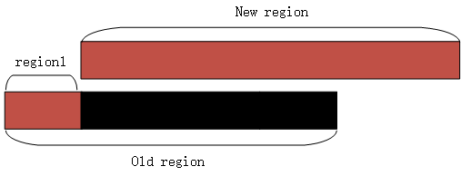

如图所示, old region 是找到的和 new region 重叠的 slot, 首次删除把整个 slot 都删除了, 造成了 region1 部门很无辜的受伤, 所以在映射时, 要把 region1 在弥补上. 而黑色部分就是实际删除的, 这样接下来就可以直接映射 new region 了, 如果多余的部分在后方, 也是同样的道理. 在把无辜被删除 region 映射之后, 接下来就调用 kvm_set_user_memory_region 把 new slot 映射进去. 基本思路就是这样.

下面看下核心函数`kvm_set_user_memory_region`


```cpp
static int kvm_set_user_memory_region(KVMState *s, KVMSlot *slot)
{
    struct kvm_userspace_memory_region mem;
    // slot id
    mem.slot = slot->slot;
    // 虚拟机物理地址
    mem.guest_phys_addr = slot->start_addr;
    // 对应的 qemu 分配的内存, HVA
    mem.userspace_addr = (unsigned long)slot->ram;
    mem.flags = slot->flags;
    if (s->migration_log) {
        mem.flags |= KVM_MEM_LOG_DIRTY_PAGES;
    }
    // 只读的 mem
    if (slot->memory_size && mem.flags & KVM_MEM_READONLY) {
        /* Set the slot size to 0 before setting the slot to the desired
         * value. This is needed based on KVM commit 75d61fbc. */
        mem.memory_size = 0;
        kvm_vm_ioctl(s, KVM_SET_USER_MEMORY_REGION, &mem);
    }
    // 内存大小
    mem.memory_size = slot->memory_size;
    return kvm_vm_ioctl(s, KVM_SET_USER_MEMORY_REGION, &mem);
}
```

可以看到该函数实现也并不复杂, 使用了一个`kvm_userspace_memory_region`对应, 该结构本质上作为参数传递给 KVM, 只是由于不能共享堆栈, 在 KVM 中需要把该结构复制到内核空间, 代码本身没什么难度, 只是这里如果是**只读的 mem**, 需要**调用两次**kvm_vm_ioctl, 第一次设置 mem 的 size 为 0.

至于为何这么做, 可以参考 KVM 端说明, KVM 接收端在`kvm_vm_ioctl()`函数中.

# 6. MMIO 退出的处理

由于 mmio 导致的退出, `kvm_cpu_exec --> case KVM_EXIT_MMIO --> address_spaces_rw --> address_space_rw --> io_mem_write`

```cpp
int kvm_cpu_exec(CPUState *cpu)
{
    ......
    do {
        run_ret = kvm_vcpu_ioctl(cpu, KVM_RUN, 0);
        attrs = kvm_arch_post_run(cpu, run);
        switch (run->exit_reason) {
            case KVM_EXIT_MMIO:
                address_space_rw(&address_space_memory,
                                run->mmio.phys_addr, attrs,
                                run->mmio.data,
                                run->mmio.len,
                                run->mmio.is_write);
        }
    }
    ......
}
```

```cpp
MemTxResult address_space_rw(AddressSpace *as, hwaddr addr, MemTxAttrs attrs,
                             uint8_t *buf, hwaddr len, bool is_write)
{
    if (is_write) {
        return address_space_write(as, addr, attrs, buf, len);
    } else {
        return address_space_read_full(as, addr, attrs, buf, len);
    }
}
```

```cpp
MemTxResult address_space_read_full(AddressSpace *as, hwaddr addr,
                                    MemTxAttrs attrs, uint8_t *buf, hwaddr len)
{
    MemTxResult result = MEMTX_OK;
    FlatView *fv;

    if (len > 0) {
        RCU_READ_LOCK_GUARD();
        fv = address_space_to_flatview(as);
        result = flatview_read(fv, addr, attrs, buf, len);
    }

    return result;
}

MemTxResult address_space_write(AddressSpace *as, hwaddr addr,
                                MemTxAttrs attrs,
                                const uint8_t *buf, hwaddr len)
{
    MemTxResult result = MEMTX_OK;
    FlatView *fv;

    if (len > 0) {
        RCU_READ_LOCK_GUARD();
        fv = address_space_to_flatview(as);
        result = flatview_write(fv, addr, attrs, buf, len);
    }

    return result;
}
```

# 7. 总结

qemu 向 KVM 注册内存的流程:

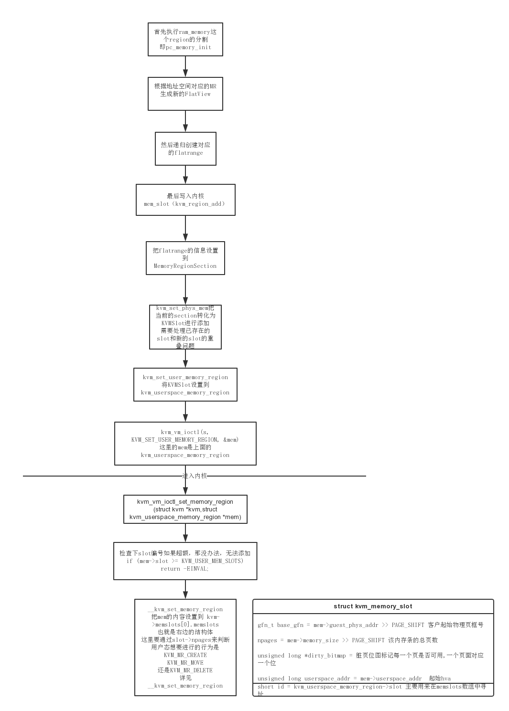

1. 全局 MemoryRegion: system_memory 以及 system_io 的初始化

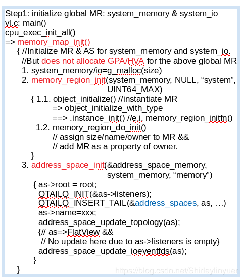

2. GPA (guest physical address) 与 HVA (host virtual address)的公共代码的分析.

3. 内存发生变化时, 更新内存映射 (GPA-HVA-HPA).

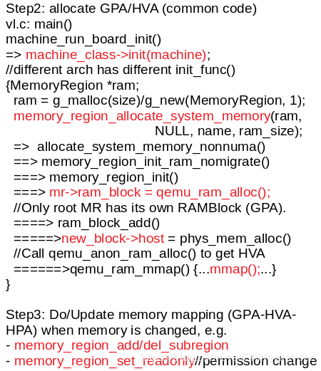

4. `x86_64`内存初始化的代码分析

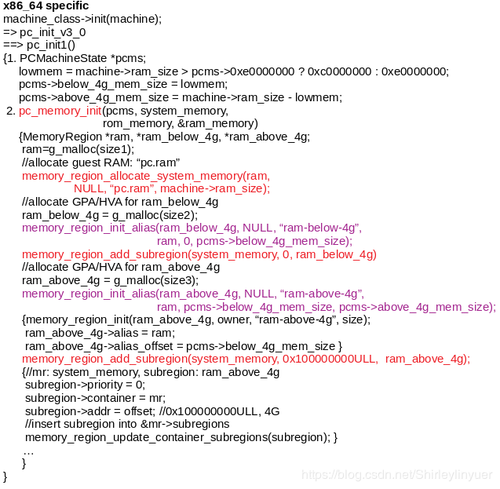

5. 对上述 x86_64 的`memory_region_init_alias()`画图描述:

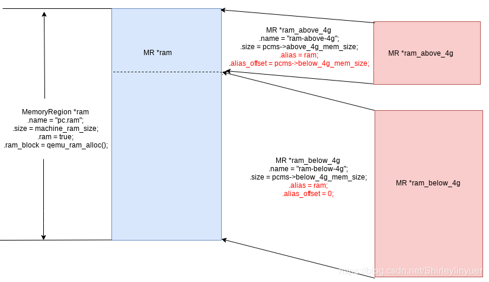

6. 上述 x86_64 ram 的`memory_region_add_subregion_common()`

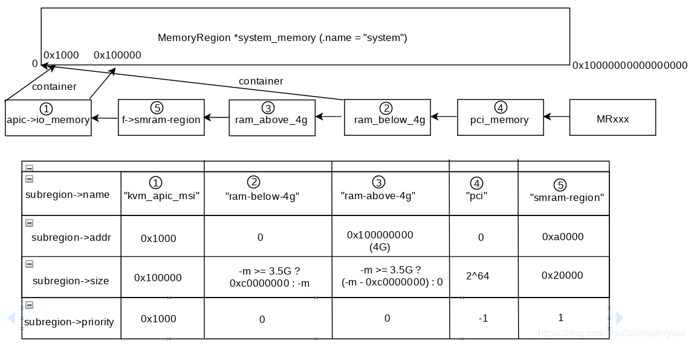

7. KVM_SET_USER_MEMORY_REGION 的调用过程

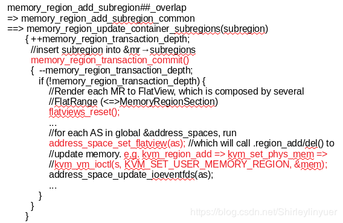

8. flatviews_reset()函数解析

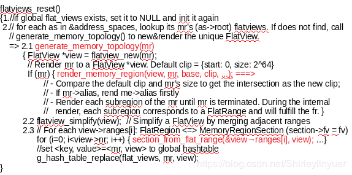

9. address_space_set_flatview()函数解析

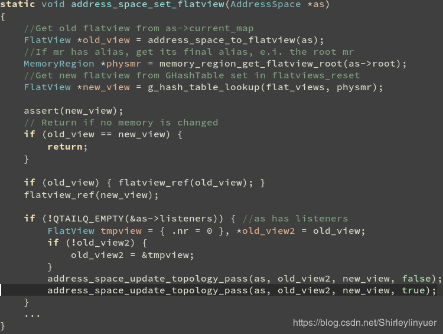

10. address_space_update_topology_pass => region_add()

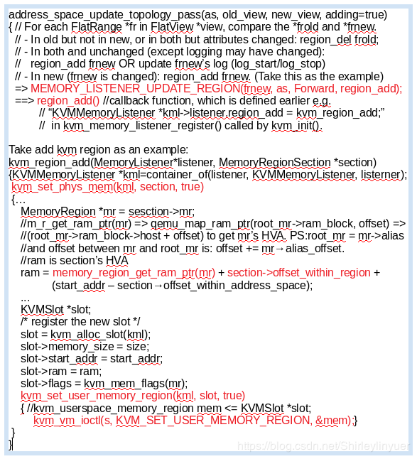

# 8. 参考

https://www.cnblogs.com/ck1020/p/6729224.html (已完)

https://www.cnblogs.com/ck1020/p/6738116.html (已完)

https://blog.csdn.net/Shirleylinyuer/article/details/83592758 (未整理)

http://abcdxyzk.github.io/blog/2015/07/29/kvm-src2/ (未完)

https://blog.csdn.net/woai110120130/article/details/102311622 (未完)

https://blog.csdn.net/leoufung/article/details/48781185 (未整理)

https://abelsu7.top/2019/07/07/kvm-memory-virtualization/ (未完)