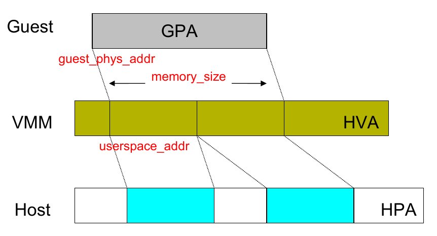

<!-- @import "[TOC]" {cmd="toc" depthFrom=1 depthTo=6 orderedList=false} -->

<!-- code_chunk_output -->

- [1. 基本原理: GPA->HVA](#1-基本原理-gpa-hva)
- [2. 流程概述](#2-流程概述)
- [3. 流程分析](#3-流程分析)
  - [3.1. kvm_vm_ioctl(): vm 指令入口](#31-kvm_vm_ioctl-vm-指令入口)
  - [3.2. __kvm_set_memory_region()](#32-__kvm_set_memory_region)
    - [3.2.1. kvm_set_memslot(): 最终调用函数](#321-kvm_set_memslot-最终调用函数)

<!-- /code_chunk_output -->

# 1. 基本原理: GPA->HVA

kvm 虚拟机实际运行于`qemu-kvm`的**进程上下文**中, 因此, 需要建立**虚拟机的物理内存空间**(GPA)与`qemu-kvm`**进程的虚拟地址空间**(HVA)的映射关系.

**KVM 并不负责物理页面的分配**, 而是**qemu 分配后**把**对应的地址传递过来**, 然后**KVM 维护 EPT**. 也就是说, 在**qemu 进程建立页表**后, **EPT 才会建立**.

**虚拟机的物理地址空间**实际也是**不连续**的, 分成**不同的内存区域**(slot), 因为物理地址空间中通常还包括**BIOS**、**MMIO**、**显存**、**ISA 保留**等部分, 也就是说**每一段内存区间**都必须有**独立的作用**.

qemu-kvm 通过**ioctl vm**指令`KVM_SET_USER_MEMORY_REGION`来**为虚拟机设置内存**. 主要建立**guest 物理地址空间**中的内存区域与**qemu-kvm 虚拟地址空间中的内存区域**的映射, 从而建立其从**GPA 到 HVA 的对应关系**, 该**对应关系**主要通过`kvm_mem_slot`结构体保存, 所以实质为设置`kvm_mem_slot`结构体, 并关联到`kvm->memslots->memslots[slots->used_slots++]` , 这个是虚拟机全局的.

本文简介 ioctl vm 指令`KVM_SET_USER_MEMORY_REGION`在内核中的执行流程, qemu-kvm 用户态部分暂不包括.



# 2. 流程概述

ioctl vm 指令`KVM_SET_USER_MEMORY_REGION`在内核主要执行流程如下:

```cpp
kvm_vm_ioctl()
    kvm_vm_ioctl_set_memory_region()
        kvm_set_memory_region()
            __kvm_set_memory_region()
                struct kvm_memory_slot new; // 生成新 slot, 对于删除的情况, new 除了 id 其他所有置为 0
                kvm_set_memslot()
                    slots = kvm_dup_memslots(__kvm_memslots(kvm, as_id), change); // 得到原有 kvm_memslots 的一个副本
                    kvm_arch_prepare_memory_region(kvm, new, mem, change) // 对于新建/移动, 初始化这个新 kvm_memory_slot 中 arch 部分; 对于删除, 什么不做
                    update_memslots(slots, new, change); // 更新 memslots 数组(即 slots 副本), 没有具体动作
                    slots = install_new_memslots(kvm, as_id, slots); //安装新的 slots, 并返回旧的
                        rcu_assign_pointer(kvm->memslots[as_id], slots); // 将新 slots 赋值给 kvm->memslots
                        kvm_arch_memslots_updated(); //
                    kvm_arch_commit_memory_region()
                    kvfree(slots); // 释放旧 slots

                    kvm_iommu_unmap_pages(); // 原来的 slot 需要删除, 所以需要 unmap 掉相应的内存区域
                    install_new_memslots() //将 new 分配的 memslot 写入 kvm->memslots[]数组中
                    kvm_free_physmem_slot() // 释放旧内存区域相应的物理内存(HPA)
```

# 3. 流程分析

## 3.1. kvm_vm_ioctl(): vm 指令入口

**kvm ioctl vm 指令的入口**, 传入的 fd 为`KVM_CREATE_VM`中返回的 fd. 主要用于针对 VM 虚拟机进行控制, 如: 内存设置、创建 VCPU 等.

```cpp
static long kvm_vm_ioctl(struct file *filp,
             unsigned int ioctl, unsigned long arg)
{
    // 建立 guest 物理地址空间中的内存区域与 qemu-kvm 虚拟地址空间中的内存区域的映射
    case KVM_SET_USER_MEMORY_REGION: {
        // 存放内存区域信息的结构体, 该内存区域从 qemu-kvm 进程的用户地址空间中分配
        struct kvm_userspace_memory_region kvm_userspace_mem;

        r = -EFAULT;
        // 从用户态拷贝相应数据到内核态, 入参 argp 指向用户态地址
        if (copy_from_user(&kvm_userspace_mem, argp,
                        sizeof kvm_userspace_mem))
            goto out;
        // 进入实际处理流程
        r = kvm_vm_ioctl_set_memory_region(kvm, &kvm_userspace_mem);
        break;
    }
...
```
可以看到首要任务就是把参数复制到内核, 然后调用了`kvm_vm_ioctl_set_memory_region()`函数.

`struct kvm_userspace_memory_region`详细在`QEMU/Memory`中查看

```cpp
int kvm_vm_ioctl_set_memory_region(struct kvm *kvm,
                   struct kvm_userspace_memory_region *mem)
{
        // slot 编号过大
    if (mem->slot >= KVM_USER_MEM_SLOTS)
        return -EINVAL;
    return kvm_set_memory_region(kvm, mem);
}
```

函数检查下 slot 编号如果超额, 那没办法, 无法添加, 否则调用`kvm_set_memory_region()`函数. 而该函数没做别的, 最终调用 `__kvm_set_memory_region()`

## 3.2. __kvm_set_memory_region()

主要做了如下几件事情:
- 数据检查
- 调用 id_to_memslot 来获得 kvm->memslots 中对应的 memslot 指针
- 设置 memslot 的 base_gfn、npages 等域
- 处理和已经存在的 memslots 的重叠
- 调用 install_new_memslots 装载新的 memslot

```cpp
/*
 * Allocate some memory and give it an address in the guest physical address
 * space.
 *
 * Discontiguous memory is allowed, mostly for framebuffers.
 *
 * Must be called holding kvm->slots_lock for write.
 */
int __kvm_set_memory_region(struct kvm *kvm,
                            const struct kvm_userspace_memory_region *mem)
{
        struct kvm_memory_slot old, new;
        struct kvm_memory_slot *tmp;
        enum kvm_mr_change change;
        int as_id, id;
        int r;
        // 标记检查
        r = check_memory_region_flags(mem);
        if (r)
                return r;
        // address_space ID = slot 编号右移 16 位
        as_id = mem->slot >> 16;
        // slot 编号
        id = (u16)mem->slot;
        // 合规检查, 防止用户态恶意传参而导致安全漏洞
        /* 如果 memory_size 不是页对齐, 直接失败 */
        if (mem->memory_size & (PAGE_SIZE - 1))
                return -EINVAL;
        // 如果客户机物理地址不是页对齐, 直接失败
        if (mem->guest_phys_addr & (PAGE_SIZE - 1))
                return -EINVAL;
        /* 如果 slot 的 id 在合法范围, 但是用户空间地址(host 线性地址)不是页对齐/不在地址范围, 直接失败 */
        if ((id < KVM_USER_MEM_SLOTS) &&
            ((mem->userspace_addr & (PAGE_SIZE - 1)) ||
             !access_ok((void __user *)(unsigned long)mem->userspace_addr,
                        mem->memory_size)))
                return -EINVAL;
        // slot id 太大, 失败
        if (as_id >= KVM_ADDRESS_SPACE_NUM || id >= KVM_MEM_SLOTS_NUM)
                return -EINVAL;
        if (mem->guest_phys_addr + mem->memory_size < mem->guest_phys_addr)
                return -EINVAL;

        /*
         * Make a full copy of the old memslot, the pointer will become stale
         * when the memslots are re-sorted by update_memslots(), and the old
         * memslot needs to be referenced after calling update_memslots(), e.g.
         * to free its resources and for arch specific behavior.
         */
        // 根据 kvm_userspace_memory_region->slot(qemu 的内存槽号) 得到 kvm_mem_slot(kvm 的内存槽号) 结构, 该结构从 kvm->memslots 获取
        // 根据 id 从 kvm_memslots 完全拷贝了一份 kvm_mem_slot 到 tmp, 当然可能找不到
        tmp = id_to_memslot(__kvm_memslots(kvm, as_id), id);
        if (tmp) {
                old = *tmp;
                tmp = NULL;
        } else {
                memset(&old, 0, sizeof(old));
                old.id = id;
        }
        // 新设置区域大小为 0, 意味着删除原有区域, 调用删除然后直接返回
        if (!mem->memory_size)
                // 最终还是会调用 kvm_set_memslot
                return kvm_delete_memslot(kvm, mem, &old, as_id);

        // 再往下, 就意味着要么是 new 要么是 move
        // 设置新的 kvm_memory_slot
        new.id = id;
        // 内存区域起始位置在 Guest 物理地址空间中的页框号
        new.base_gfn = mem->guest_phys_addr >> PAGE_SHIFT;
        // 内存区域大小转换为 page 单位
        new.npages = mem->memory_size >> PAGE_SHIFT;
        // 标志
        new.flags = mem->flags;
        // 主机虚拟地址, HVA
        new.userspace_addr = mem->userspace_addr;

        if (new.npages > KVM_MEM_MAX_NR_PAGES)
                return -EINVAL;
        // 旧 pages 为 0, 说明要创建新内存区域
        if (!old.npages) {
                /*
                 * 设置 KVM_MR_CREATE 标记
                 */
                change = KVM_MR_CREATE;
                new.dirty_bitmap = NULL;
                // 重置新 slot 的 arch 信息
                memset(&new.arch, 0, sizeof(new.arch));
        // 修改一个存在的 slot
        } else { /* Modify an existing slot. */
                // 判断是否修改现有的内存区域
                // 旧 page 数不为 0
                // 修改的区域的 HVA 不同 或者 大小不同 或者 flag 中的
                // KVM_MEM_READONLY 标记不同, 直接退出.
                if ((new.userspace_addr != old.userspace_addr) ||
                    (new.npages != old.npages) ||
                    ((new.flags ^ old.flags) & KVM_MEM_READONLY))
                        return -EINVAL;
                /*
                 * 走到这, 说明被修改的区域 HVA 和大小都是相同的
                 *
                 * 判断区域起始的 GFN 是否相同, 如果不是, 则说明需
                 * 要在 Guest 物理地址空间中 move 这段区域, 设置 KVM_MR_MOVE 标记
                 * 也就是需要移动内存条
                 */
                if (new.base_gfn != old.base_gfn)
                        change = KVM_MR_MOVE;
                // 如果仅仅是 flag 不同, 则仅修改标记, 设置 KVM_MR_FLAGS_ONLY 标记
                else if (new.flags != old.flags)
                        change = KVM_MR_FLAGS_ONLY;
                // 否则, 啥也不干, 退出
                else /* Nothing to change. */
                        return 0;

                /* Copy dirty_bitmap and arch from the current memslot. */
                // 原有的 dirty bitmap 复制给新 slot
                new.dirty_bitmap = old.dirty_bitmap;
                // 将原有 slot 的 arch 相关信息全部复制给新的 slot
                memcpy(&new.arch, &old.arch, sizeof(new.arch));
        }
        // 对于创建或 move, 检查现有的重叠
        if ((change == KVM_MR_CREATE) || (change == KVM_MR_MOVE)) {
                /* Check for overlaps */
                // 检查已经存在所有 kvm_memory_slot 和新的 slot 是否地址重叠, 有的话直接返回-EEXIST
                kvm_for_each_memslot(tmp, __kvm_memslots(kvm, as_id)) {
                        // new/move 的 id 对应的原有 slot, 因为原有的要删除, 所以直接跳过
                        if (tmp->id == id)
                                continue;
                        // new_end > slot_base && new_base < slot_end, 说明已经有覆盖该段内存了
                        if (!((new.base_gfn + new.npages <= tmp->base_gfn) ||
                              (new.base_gfn >= tmp->base_gfn + tmp->npages)))
                                return -EEXIST;
                }
        }
        // 如果新 slot 要求 KVM_MEM_LOG_DIRTY_PAGES, 分配一个 dirty_bitmap
        /* Allocate/free page dirty bitmap as needed */
        if (!(new.flags & KVM_MEM_LOG_DIRTY_PAGES))
                new.dirty_bitmap = NULL;
        else if (!new.dirty_bitmap) {
                r = kvm_alloc_dirty_bitmap(&new);
                if (r)
                        return r;

                if (kvm_dirty_log_manual_protect_and_init_set(kvm))
                        bitmap_set(new.dirty_bitmap, 0, new.npages);
        }
        // 真正执行的代码
        r = kvm_set_memslot(kvm, mem, &old, &new, as_id, change);
        if (r)
                goto out_bitmap;
        // 如果旧 slot 有新的没有, 释放 dirty_bitmap
        if (old.dirty_bitmap && !new.dirty_bitmap)
                kvm_destroy_dirty_bitmap(&old);
        return 0;

out_bitmap:
        if (new.dirty_bitmap && !old.dirty_bitmap)
                kvm_destroy_dirty_bitmap(&new);
        return r;
}
EXPORT_SYMBOL_GPL(__kvm_set_memory_region);
```

该函数主要用来建立**guest 物理地址空间**(虚拟机物理地址空间)中的**内存区域**与`qemu-kvm`**虚拟地址空间**(宿主机虚拟地址, HVA)中的**内存区域的映射**, 相应信息由`uerspace_memory_region` 参数传入, 而其源头来自于**用户态 qemu-kvm**.

check_memory_region_flags 检查`mem->flags`是否合法, 而当前 flag 也就使用了两位, `KVM_MEM_LOG_DIRTY_PAGES`和`KVM_MEM_READONLY`, 从 qemu 传过来的只能是`KVM_MEM_LOG_DIRTY_PAGES`

`id_to_memslot`则是根据**qemu 的内存槽号 i**得到**kvm 结构下的内存槽号**, 转换关系来自`id_to_index`数组, 那映射关系怎么来的, 映射关系是**一一对应**的, 在下面会看到映射关系的建立.

```cpp
static inline
struct kvm_memory_slot *id_to_memslot(struct kvm_memslots *slots, int id)
{
        int index = slots->id_to_index[id];
        struct kvm_memory_slot *slot;

        if (index < 0)
                return NULL;

        slot = &slots->memslots[index];

        WARN_ON(slot->id != id);
        return slot;
}
```

每次调用**设置一个内存区间**. 内存区域可以**不连续**(实际的物理内存区域也经常不连续, 因为有可能有保留内存)

另外看`kvm_mr_change`就知道 memslot 的变动值了:

```cpp
enum kvm_mr_change {
    KVM_MR_CREATE,
    KVM_MR_DELETE,
    KVM_MR_MOVE,
    KVM_MR_FLAGS_ONLY,
};
```

```cpp
static int kvm_delete_memslot(struct kvm *kvm,
                              const struct kvm_userspace_memory_region *mem,
                              struct kvm_memory_slot *old, int as_id)
{
        struct kvm_memory_slot new;
        int r;

        if (!old->npages)
                return -EINVAL;
        // 新的 slot 全部置为 0
        memset(&new, 0, sizeof(new));
        new.id = old->id;
        // 也是调用 kvm_set_memslot
        r = kvm_set_memslot(kvm, mem, old, &new, as_id, KVM_MR_DELETE);
        if (r)
                return r;
        // 释放 old 的堆空间
        kvm_free_memslot(kvm, old);
        return 0;
}

static void kvm_free_memslot(struct kvm *kvm, struct kvm_memory_slot *slot)
{
        // 释放 dirty bitmap 结构占用的内存
        kvm_destroy_dirty_bitmap(slot);
        // 释放 arch 数据结构占用的内存
        kvm_arch_free_memslot(kvm, slot);

        slot->flags = 0;
        slot->npages = 0;
}
```

### 3.2.1. kvm_set_memslot(): 最终调用函数

无论是删除、创建、修改, 最终都会调用`kvm_set_memslot()`

```cpp
static int kvm_set_memslot(struct kvm *kvm,
                           const struct kvm_userspace_memory_region *mem,
                           struct kvm_memory_slot *old,
                           struct kvm_memory_slot *new, int as_id,
                           enum kvm_mr_change change)
{
        struct kvm_memory_slot *slot;
        struct kvm_memslots *slots;
        int r;
        // 复制 kvm->memslots 的副本
        slots = kvm_dup_memslots(__kvm_memslots(kvm, as_id), change);
        if (!slots)
                return -ENOMEM;
        // 如果删除或 move 内存区域, 额外的处理
        if (change == KVM_MR_DELETE || change == KVM_MR_MOVE) {
                /*
                 * Note, the INVALID flag needs to be in the appropriate entry
                 * in the freshly allocated memslots, not in @old or @new.
                 */
                // 获取旧的 slot(内存条模型)
                slot = id_to_memslot(slots, old->id);
                // 在删除或 move 时, 旧 slot 应该不可用
                slot->flags |= KVM_MEMSLOT_INVALID;

                /*
                 * We can re-use the old memslots, the only difference from the
                 * newly installed memslots is the invalid flag, which will get
                 * dropped by update_memslots anyway.  We'll also revert to the
                 * old memslots if preparing the new memory region fails.
                 */
                // 安装新 memslots, 返回旧的 memslots
                slots = install_new_memslots(kvm, as_id, slots);

                /* From this point no new shadow pages pointing to a deleted,
                 * or moved, memslot will be created.
                 *
                 * validation of sp->gfn happens in:
                 *      - gfn_to_hva (kvm_read_guest, gfn_to_pfn)
                 *      - kvm_is_visible_gfn (mmu_check_root)
                 */
                //
                kvm_arch_flush_shadow_memslot(kvm, slot);
        }
        // 初始化 kvm_memory_slot 的 arch 部分
        r = kvm_arch_prepare_memory_region(kvm, new, mem, change);
        if (r)
                goto out_slots;
        // 更新 memslots 数组
        update_memslots(slots, new, change);
        // 安装新 memslots, 将其写入 kvm->memslots[]数组, 返回旧的 memslots
        slots = install_new_memslots(kvm, as_id, slots);
        // 刷新 MMIO 页表项
        kvm_arch_commit_memory_region(kvm, mem, old, new, change);
        // 释放旧内存区域相应的物理内存, HPA
        kvfree(slots);
        return 0;

out_slots:
        if (change == KVM_MR_DELETE || change == KVM_MR_MOVE)
                slots = install_new_memslots(kvm, as_id, slots);
        kvfree(slots);
        return r;
}
```

如果 change 为`KVM_MR_DELETE`或者`KVM_MR_MOVE`, 这里主要有**两个操作**, 一是设置对应 slot 标识为`KVM_MEMSLOT_INVALID`, **更新页表**. 二是增加 slots->generation, **撤销 iommu mapping**.

接下来对于**私有映射**的话`(memslot->id >= KVM_USER_MEM_SLOTS)`, 如果是要创建, 则需要**手动建立映射**.

```cpp
static struct kvm_memslots *install_new_memslots(struct kvm *kvm,
                int as_id, struct kvm_memslots *slots)
{
        // 获取 kvm->memslots
        struct kvm_memslots *old_memslots = __kvm_memslots(kvm, as_id);
        u64 gen = old_memslots->generation;

        WARN_ON(gen & KVM_MEMSLOT_GEN_UPDATE_IN_PROGRESS);
        slots->generation = gen | KVM_MEMSLOT_GEN_UPDATE_IN_PROGRESS;
        // 更新 kvm->memslots, 该指针受 rcu 机制保护
        rcu_assign_pointer(kvm->memslots[as_id], slots);
        synchronize_srcu_expedited(&kvm->srcu);

        /*
         * Increment the new memslot generation a second time, dropping the
         * update in-progress flag and incrementing the generation based on
         * the number of address spaces.  This provides a unique and easily
         * identifiable generation number while the memslots are in flux.
         */
        gen = slots->generation & ~KVM_MEMSLOT_GEN_UPDATE_IN_PROGRESS;

        /*
         * Generations must be unique even across address spaces.  We do not need
         * a global counter for that, instead the generation space is evenly split
         * across address spaces.  For example, with two address spaces, address
         * space 0 will use generations 0, 2, 4, ... while address space 1 will
         * use generations 1, 3, 5, ...
         */
        // 增加
        gen += KVM_ADDRESS_SPACE_NUM;
        //
        kvm_arch_memslots_updated(kvm, gen);

        slots->generation = gen;

        return old_memslots;
}
```

```cpp
void kvm_arch_memslots_updated(struct kvm *kvm, u64 gen)
{
        struct kvm_vcpu *vcpu;
        int i;

        /*
         * memslots->generation has been incremented.
         * mmio generation may have reached its maximum value.
         */
        kvm_mmu_invalidate_mmio_sptes(kvm, gen);

        /* Force re-initialization of steal_time cache */
        kvm_for_each_vcpu(i, vcpu, kvm)
                kvm_vcpu_kick(vcpu);
}
```

```cpp
int kvm_arch_prepare_memory_region(struct kvm *kvm,
                                struct kvm_memory_slot *memslot,
                                const struct kvm_userspace_memory_region *mem,
                                enum kvm_mr_change change)
{
        // 创建或 move 区域
        if (change == KVM_MR_CREATE || change == KVM_MR_MOVE)
                // 初始化 memslot 中 arch 相关内容, 涉及页表
                return kvm_alloc_memslot_metadata(memslot,
                                                  mem->memory_size >> PAGE_SHIFT);
        return 0;
}
```

```cpp
/* KVM Hugepage definitions for x86 */
/* 大页 */
enum {
        PT_PAGE_TABLE_LEVEL   = 1,
        PT_DIRECTORY_LEVEL    = 2,
        PT_PDPE_LEVEL         = 3,
        /* set max level to the biggest one */
        PT_MAX_HUGEPAGE_LEVEL = PT_PDPE_LEVEL,
};

// 这里是 3
#define KVM_NR_PAGE_SIZES       (PT_MAX_HUGEPAGE_LEVEL - \
                                 PT_PAGE_TABLE_LEVEL + 1)

static int kvm_alloc_memslot_metadata(struct kvm_memory_slot *slot,
                                      unsigned long npages)
{
        int i;

        /*
         * Clear out the previous array pointers for the KVM_MR_MOVE case.  The
         * old arrays will be freed by __kvm_set_memory_region() if installing
         * the new memslot is successful.
         */
        // 重置这个 kvm_memory_slot 的 arch
        memset(&slot->arch, 0, sizeof(slot->arch));

        for (i = 0; i < KVM_NR_PAGE_SIZES; ++i) {
                struct kvm_lpage_info *linfo;
                unsigned long ugfn;
                int lpages;
                int level = i + 1;
                // 一级页表所需的 pages 数目
                lpages = gfn_to_index(slot->base_gfn + npages - 1,
                                      slot->base_gfn, level) + 1;
                // rmap, 反向映射结构
                slot->arch.rmap[i] =
                        kvcalloc(lpages, sizeof(*slot->arch.rmap[i]),
                                 GFP_KERNEL_ACCOUNT);
                if (!slot->arch.rmap[i])
                        goto out_free;
                if (i == 0)
                        continue;
                // Large page 结构(如 2MB、1GB 大小页面)
                linfo = kvcalloc(lpages, sizeof(*linfo), GFP_KERNEL_ACCOUNT);
                if (!linfo)
                        goto out_free;

                slot->arch.lpage_info[i - 1] = linfo;

                if (slot->base_gfn & (KVM_PAGES_PER_HPAGE(level) - 1))
                        linfo[0].disallow_lpage = 1;
                if ((slot->base_gfn + npages) & (KVM_PAGES_PER_HPAGE(level) - 1))
                        linfo[lpages - 1].disallow_lpage = 1;
                ugfn = slot->userspace_addr >> PAGE_SHIFT;
                /*
                 * If the gfn and userspace address are not aligned wrt each
                 * other, disable large page support for this slot.
                 */
                if ((slot->base_gfn ^ ugfn) & (KVM_PAGES_PER_HPAGE(level) - 1)) {
                        unsigned long j;

                        for (j = 0; j < lpages; ++j)
                                linfo[j].disallow_lpage = 1;
                }
        }

        if (kvm_page_track_create_memslot(slot, npages))
                goto out_free;

        return 0;

out_free:
        for (i = 0; i < KVM_NR_PAGE_SIZES; ++i) {
                kvfree(slot->arch.rmap[i]);
                slot->arch.rmap[i] = NULL;
                if (i == 0)
                        continue;

                kvfree(slot->arch.lpage_info[i - 1]);
                slot->arch.lpage_info[i - 1] = NULL;
        }
        return -ENOMEM;
}
```

如果是新插入内存条或 move, `kvm_alloc_memslot_metadata`函数, 里面主要是一个循环, `KVM_NR_PAGE_SIZES`是**分页的级数**, 此处是**3**, 第一次循环, `lpages = gfn_to_index(slot->base_gfn + npages - 1,slot->base_gfn, level) + 1`, lpages 就是**一级页表**所需要的**page 数**, 大致是`npages>>1*9`,然后为`slot->arch.rmap[i]`申请了内存空间, 此处可以猜想, **rmap 就是一级页表**了, 继续看, **lpages**约为`npages>>1*9`, 此处又多为**lpage_info**申请了同等空间, 然后对`lpage_info`初始化赋值, 现在看不到 lpage_info 的具体作用, 看到后再补上. 整体上看`kvm_alloc_memslot_metadata`做了一个**3 级的软件页表**.

```cpp
static void update_memslots(struct kvm_memslots *slots,
                            struct kvm_memory_slot *memslot,
                            enum kvm_mr_change change)
{
        int i;
        // 删除
        if (change == KVM_MR_DELETE) {
                kvm_memslot_delete(slots, memslot);
        } else {
                if (change == KVM_MR_CREATE)
                        // 创建, 返回 slots->used_slots++
                        i = kvm_memslot_insert_back(slots);
                else
                        // move
                        i = kvm_memslot_move_backward(slots, memslot);
                i = kvm_memslot_move_forward(slots, memslot, i);

                /*
                 * Copy the memslot to its new position in memslots and update
                 * its index accordingly.
                 */
                slots->memslots[i] = *memslot;
                // 建立 slot id 和 index 的映射关系
                slots->id_to_index[memslot->id] = i;
        }
}
```

在新建一个`kvm_memory_slot`时, 会建立 qemu 内存条和 kvm, 即`slots->id_to_index[i] = slots->memslots[i].id = i`

```cpp
void kvm_arch_commit_memory_region(struct kvm *kvm,
                                const struct kvm_userspace_memory_region *mem,
                                struct kvm_memory_slot *old,
                                const struct kvm_memory_slot *new,
                                enum kvm_mr_change change)
{
        if (!kvm->arch.n_requested_mmu_pages)
                kvm_mmu_change_mmu_pages(kvm,
                                kvm_mmu_calculate_default_mmu_pages(kvm));

        /*
         * Dirty logging tracks sptes in 4k granularity, meaning that large
         * sptes have to be split.  If live migration is successful, the guest
         * in the source machine will be destroyed and large sptes will be
         * created in the destination. However, if the guest continues to run
         * in the source machine (for example if live migration fails), small
         * sptes will remain around and cause bad performance.
         *
         * Scan sptes if dirty logging has been stopped, dropping those
         * which can be collapsed into a single large-page spte.  Later
         * page faults will create the large-page sptes.
         *
         * There is no need to do this in any of the following cases:
         * CREATE:      No dirty mappings will already exist.
         * MOVE/DELETE: The old mappings will already have been cleaned up by
         *              kvm_arch_flush_shadow_memslot()
         */
        if (change == KVM_MR_FLAGS_ONLY &&
                (old->flags & KVM_MEM_LOG_DIRTY_PAGES) &&
                !(new->flags & KVM_MEM_LOG_DIRTY_PAGES))
                kvm_mmu_zap_collapsible_sptes(kvm, new);

        /*
         * Set up write protection and/or dirty logging for the new slot.
         *
         * For KVM_MR_DELETE and KVM_MR_MOVE, the shadow pages of old slot have
         * been zapped so no dirty logging staff is needed for old slot. For
         * KVM_MR_FLAGS_ONLY, the old slot is essentially the same one as the
         * new and it's also covered when dealing with the new slot.
         *
         * FIXME: const-ify all uses of struct kvm_memory_slot.
         */
        if (change != KVM_MR_DELETE)
                kvm_mmu_slot_apply_flags(kvm, (struct kvm_memory_slot *) new);

        /* Free the arrays associated with the old memslot. */
        if (change == KVM_MR_MOVE)
                kvm_arch_free_memslot(kvm, old);
}
```
