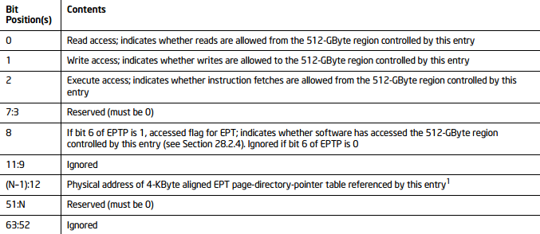
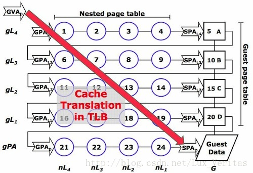
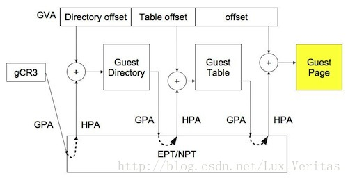
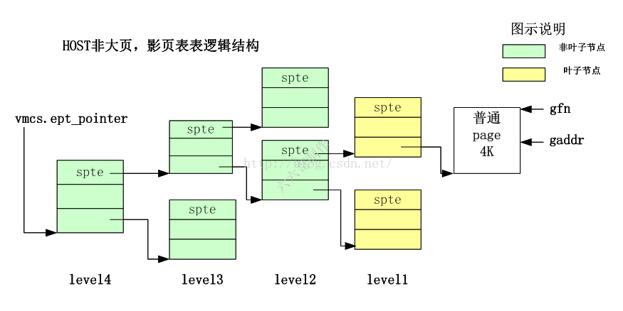
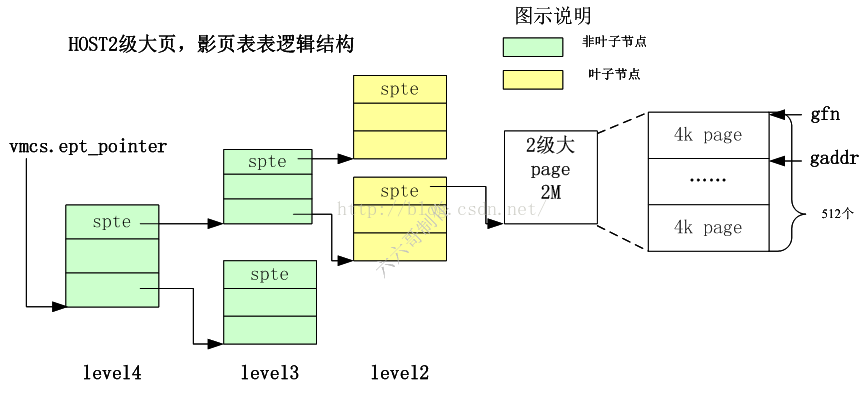
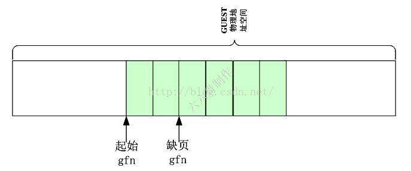
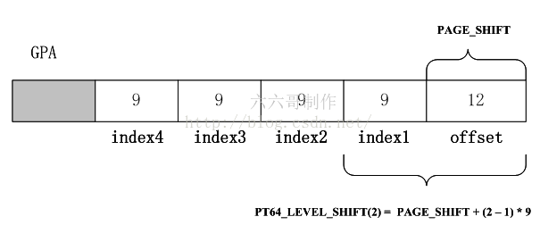
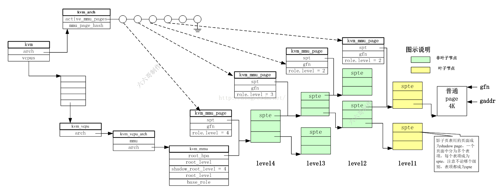
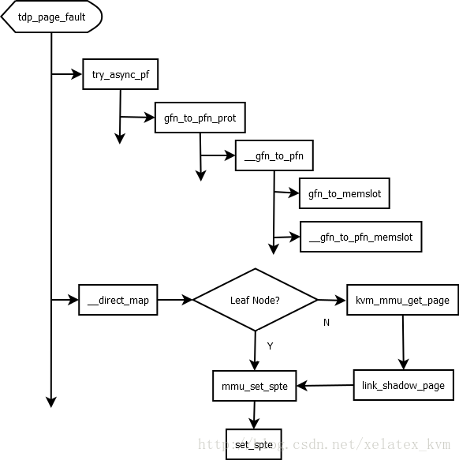

# 1. 背景

**KVM 并不负责物理页面的分配**, 而是**qemu 分配后**把**对应的地址传递过来**, 然后**KVM 维护 EPT**. 也就是说, 在**qemu 进程建立页表**后, **EPT 才会建立**.

在虚拟化环境下, intel CPU 在处理器级别加入了对内存虚拟化的支持. 即扩展页表 EPT, 而 AMD 也有类似的成为 NPT. 在此之前, 内存虚拟化使用的一个重要技术为影子页表.

在**虚拟化环境**下, 虚拟机使用的是**客户机虚拟地址 GVA**, 而其**本身页表机制**只能把**客户机的虚拟地址**转换成**客户机的物理地址**也就是完成`GVA->GPA`的转换, 但是 GPA 并不是被用来真正的访存, 所以需要想办法把**客户机的物理地址 GPA**转换成**宿主机的物理地址 HPA**.

在 KVM 机制下, 客户系统运行在 CPU 的非根模式, 透明的完成地址翻译, 即对客户机而言, 一条客户机虚拟地址经 MMU 翻译为客户机物理地址而返回. 但实际过程则稍微复杂, 因为每一条客户机物理地址也都是真实存在于物理内存上的, 而虚拟机所在的地址空间并不是真实的内存物理地址空间, 所以客户域下的 GPA 需要再经过某种地址翻译机制完成到 HPA 的转化, 才能够取得真实物理内存单元中的内容.

KVM 提供了两种地址翻译的机制, 基于软件模拟的影子页表机制, 以及基于硬件辅助的扩展页表机制(Intel 的 EPT, AMD 的 NPT).

**影子页表**采用的是一步到位式, 即完成**客户机虚拟地址 GVA**到**宿主机物理地址 HPA**的转换, 由 VMM 为每个客户机进程维护. 本节对于影子页表不做过多描述, 重点在于 EPT.

内容第一部分根据 intel 手册分析 EPT 地址转换机制; 第二部分借助于 KVM 源代码分析 EPT 构建过程.

# 2. EPT 地址转换机制

具体见`<系统虚拟化/处理器虚拟化技术>`, 当然最权威是 Intel 手册

当一个逻辑 CPU 处于非根模式下运行客户机代码时, 使用的地址是客户机虚拟地址, 而访问这个虚拟地址时, 同样会发生地址的转换, 这里的转换还没有设计到 VMM 层, 和正常的系统一样, 这里依然是采用 CR3 作为基址, 利用客户机页表进行地址转换, 只是到这里虽然已经转换成物理地址, 但是由于是客户机物理地址, 不等同于宿主机的物理地址, 所以并不能直接访问, 需要借助于第二次的转换, 也就是 EPT 的转换. 注意 EPT 的维护有 VMM 维护, 其转换过程由硬件完成, 所以其比影子页表有更高的效率.

我们假设已经获取到了客户机的物理地址, 下面分析下如何利用一个客户机的物理地址, 通过 EPT 进行寻址.


注意不管是 32 位客户机还是 64 位客户机, 这里统一按照 64 位物理地址来寻址. EPT 页表是 4 级页表, 页表的大小仍然是一个页即 4KB, 但是一个表项是 8 个字节, 所以一张表只能容纳 512 个表项, 需要 9 位来定位具体的表项. 客户机的物理地址使用低 48 位来完成这一工作. 从上图可以看到, 一个 48 位的客户机物理地址被分为 5 部分, 前 4 部分按 9 位划分, 最后 12 位作为页内偏移. 当处于非根模式下的 CPU 使用客户机操作一个客户机虚拟地址时, 首先使用客户机页表进行地址转换, 得到客户机物理地址, 然后 CPU 根据此物理地址查询 EPT, 在 VMCS 结构中有一个 EPTP 的指针, 其中的 12-51 位指向 EPT 页表的一级目录即 PML4 Table.这样根据客户机物理地址的首个 9 位就可以定位一个 PML4 entry, 一个 PML4 entry 理论上可以控制 512GB 的区域, 这里不是重点, 我们不在多说. PML4 entry 的格式如下:



1、其实这里我们只需要知道 PML4 entry 的`12-51`位记录下一级页表的地址, 而这 40 位肯定是用不完的, 根据 CPU 的架构, 采取不同的位数, 具体如下:

在 Intel 中使用 MAXPHYADDR 来表示最大的物理地址, 我们可以通过 CPUID 的指令来获得处理支持的最大物理地址, 然而这已经不在此次的讨论范围之内, 我们需要知道的只是:
- 当 MAXPHYADDR 为 36 位, 在 Intel 平台的桌面处理器上普遍实现了 36 位的最高物理地址值, 也就是我们普通的个人计算机, 可寻址 64G 空间;
- 当 MAXPHYADDR 为 40 位, 在 Inter 的服务器产品和 AMD 的平台上普遍实现 40 位的最高物理地址, 可寻址达 1TB;
- 当 MAXPHYADDR 为 52 位, 这是 x64 体系结构描述最高实现值, 目前尚未有处理器实现.

而对下级表的物理地址的存储 4K 页面寻址遵循如下规则:

1) 当 MAXPHYADDR 为 52 位时, 上一级 table entry 的`12~51`位提供下一级 table 物理基地址的高 40 位, 低 12 位补零, 达到基地址在 4K 边界对齐;

2) 当 MAXPHYADDR 为 40 位时, 上一级 table entry 的`12~39`位提供下一级 table 物理基地址的高 28 位, 此时`40~51`是保留位, 必须置 0, 低 12 位补零, 达到基地址在 4K 边界对齐;

3) 当 MAXPHYADDR 为 36 位时, 上一级 table entry 的`12~35`位提供下一级 table 物理基地址的高 24 位, 此时`36~51`是保留位, 必须置 0, 低 12 位补零, 达到基地址在 4K 边界对齐.

而 MAXPHYADDR 为 36 位正是普通 32 位机的 PAE 模式.

2、就这么定位为下一级的页表 EPT Page-Directory-Pointer-Table , 根据客户物理地址的 30-38 位定位此页表中的一个表项 EPT Page-Directory-Pointer-Table entry. 注意这里如果该表项的第 7 位为 1, 该表项指向一个 1G 字节的 page.为 0, 则指向下一级页表. 下面我们只考虑的是指向页表的情况.

3、然后根据表项中的 12-51 位, 继续往下定位到第三级页表 EPT Page-Directory-Pointer-Table, 在根据客户物理地址的 21-29 位来定位到一个 EPT Page-Directory-Pointer-Table Entry. 如果此 entry 的第 7 位为 1, 则表示该 entry 指向一个 2M 的 page, 为 0 就指向下一级页表.

4、根据 entry 的 12-51 位定位第四级页表 EPT Page-Directory , 然后根据客户物理地址的 12-20 位定位一个 PDE.

PDE 的 12-51 位指向一个 4K 物理页面, 最后根据客户物理地址的最低 12 位作为偏移, 定位到具体的物理地址.


与影子页表的构成略有不同(影子页表项存储的是 GVA->HPA 的映射), 基于硬件辅助的地址翻译采用二维的地址翻译结构("two-dimensional"), 如以下两图所示. 客户系统维护自身的客户页表, 即完成 GVA->GPA 的映射, 而具体的每一条客户页表项、客户页目录项都是真实存储在物理内存中的, 所以需要完成 GPA->HPA 的映射, 定位到宿主物理地址空间, 以获得物理内存单元中的值. EPT/NPT 页表就负责维护 GPA->HPA 的映射, 并且 EPT/NPT 页表是由处理器的 MMU 直接读取的, 可以高效的实现地址翻译. 总结之, 所谓"二维"的地址翻译结构, 即客户系统维护自己的页表, 透明地进行地址翻译; VMM 负责将客户机请求的 GPA 映射到宿主机的物理地址, 到真实的内存单元中取值.



一条完整的地址翻译流程为, 处于非根模式的 CPU 加载客户进程的 gCR3, 由于 gCR3 是一条 GPA, CPU 需要通过查询 EPT/NPT 页表来实 gCR3 GPA->HPA 的转换. CPU MMU 首先查询硬件的 TLB, 如果没有 GPA 到 HPA 的映射, 在 cache 中查询 EPT/NPT, 若 cache 中未缓存, 逐层向下层存储查询, 最终获得 gCR3 所映射的物理地址单元内容, 作为下一级客户页表的索引基址. 如果还没有, CPU 抛出 EPT Violation, 由 VMM 截获处理. 根据 GVA 获得偏移, 获得一条地址用于索引下一级页表, 该地址为 GPA, 再由 VCPU 的 MMU 查询 EPT/NPT, 如此往复, 最终获得客户机请求的客户页内容. 假设客户机有 m 级页表, 宿主机 EPT/NPT 有 n 级, 在 TLB 均 miss 的最坏情况下, 会产生 m*n 次内存访问, 完成一次客户机的地址翻译.



虽然影子页表与 EPT/NPT 的机制差距甚大, 一个用于建立 GVA->HPA 的影子页表, 另一个用于建立 GPA->EPT 的硬件寻址页表, 但是在 KVM 层建立页表的过程却十分相似, 所以在 KVM 中共用了建立页表的这部分代码. 至于究竟建立的是什么页表, init_kvm_mmu()会根据 EPT 支持选项是否开启, 选择使用哪种方式建立页表.


# 3. MMU 初始化

## 3.1. 相关变量初始化: kvm 模块初始化时

### 3.1.1. 整体流程

```cpp
vmx_init()                               // 初始化入口
 ├─ kvm_init(KVM_GET_API_VERSION)        // 初始化 KVM 框架
 |   ├─ kvm_arch_init()                  // 架构相关初始化
 |   |   ├─ kvm_mmu_module_init()         // mmu 模块初始化
 |   |   ├─ kvm_mmu_set_mask_ptes()       // shadow pte mask 设置
 |   ├─ kvm_arch_hardware_setup()        //
 |   |   ├─ kvm_x86_ops->hardware_setup() //
 |   |   |  ├─ kvm_configure_mmu()        // 硬件判断和全局变量
```

### 3.1.2. 代码分析

```cpp
int kvm_mmu_module_init(void)
{
        int ret = -ENOMEM;

        if (nx_huge_pages == -1)
                __set_nx_huge_pages(get_nx_auto_mode());

        /*
         * MMU roles use union aliasing which is, generally speaking, an
         * undefined behavior. However, we supposedly know how compilers behave
         * and the current status quo is unlikely to change. Guardians below are
         * supposed to let us know if the assumption becomes false.
         */
        BUILD_BUG_ON(sizeof(union kvm_mmu_page_role) != sizeof(u32));
        BUILD_BUG_ON(sizeof(union kvm_mmu_extended_role) != sizeof(u32));
        BUILD_BUG_ON(sizeof(union kvm_mmu_role) != sizeof(u64));

        kvm_mmu_reset_all_pte_masks();
        // mmio
        kvm_set_mmio_spte_mask();
        // 建立缓存, 用于反向映射
        pte_list_desc_cache = kmem_cache_create("pte_list_desc",
                                            sizeof(struct pte_list_desc),
                                            0, SLAB_ACCOUNT, NULL);
        if (!pte_list_desc_cache)
                goto out;
        // 建立缓存, 用于分配 struct kvm_mmu_page
        mmu_page_header_cache = kmem_cache_create("kvm_mmu_page_header",
                                                  sizeof(struct kvm_mmu_page),
                                                  0, SLAB_ACCOUNT, NULL);
        if (!mmu_page_header_cache)
                goto out;

        if (percpu_counter_init(&kvm_total_used_mmu_pages, 0, GFP_KERNEL))
                goto out;
        // 当系统内存回收时的回调函数
        ret = register_shrinker(&mmu_shrinker);
        if (ret)
                goto out;

        return 0;

out:
        mmu_destroy_caches();
        return ret;
}
```

在`hardware_setup`时确认全局变量

```cpp
static __init int hardware_setup(void)
{
        ......
        if (!cpu_has_vmx_ept() ||
                !cpu_has_vmx_ept_4levels() ||
                !cpu_has_vmx_ept_mt_wb() ||
                !cpu_has_vmx_invept_global())
                enable_ept = 0;
        if (!enable_ept)
                // ept 没有启用, 0
                ept_lpage_level = 0;
        else if (cpu_has_vmx_ept_1g_page())
                // 支持 1G 大页, 3
                ept_lpage_level = PT_PDPE_LEVEL;
        else if (cpu_has_vmx_ept_2m_page())
                // 支持 2M 大页, 2
                ept_lpage_level = PT_DIRECTORY_LEVEL;
        else
                // 4K 页面, 1
                ept_lpage_level = PT_PAGE_TABLE_LEVEL;
        kvm_configure_mmu(enable_ept, ept_lpage_level);
        ......
}

void kvm_configure_mmu(bool enable_tdp, int tdp_page_level)
{
        tdp_enabled = enable_tdp;

        /*
         * max_page_level reflects the capabilities of KVM's MMU irrespective
         * of kernel support, e.g. KVM may be capable of using 1GB pages when
         * the kernel is not.  But, KVM never creates a page size greater than
         * what is used by the kernel for any given HVA, i.e. the kernel's
         * capabilities are ultimately consulted by kvm_mmu_hugepage_adjust().
         */
        if (tdp_enabled)
                // 1G 大页, 3
                // 2M 大页, 2
                // 4K 页面, 1
                max_page_level = tdp_page_level;
        else if (boot_cpu_has(X86_FEATURE_GBPAGES))
                max_page_level = PT_PDPE_LEVEL;
        else
                max_page_level = PT_DIRECTORY_LEVEL;
}
EXPORT_SYMBOL_GPL(kvm_configure_mmu);
```

## 3.2. MMU 相关操作函数初始化: vcpu 创建时

### 3.2.1. 整体流程

KVM 在**vcpu 创建时**创建和初始化 MMU, 所以说 KVM 的**MMU**是**每个 VCPU 独有的**(但是有一些是共享的内容, 后面会说到).

```cpp
kvm_vm_ioctl()  // 虚拟机 vm 的 ioctl 入口
 ├─ kvm_vm_ioctl_create_vcpu()       // 创建 vcpu 的 ioctl
 |   ├─ kvm_arch_vcpu_create()   // 初始化 kvm_vcpu_arch
 |   |   |─ kvm_mmu_create(vcpu);   // 创建 mmu
 |   |   |   ├─ alloc_mmu_pages(vcpu, &vcpu->arch.guest_mmu);  // 分配内存
 |   |   |   └─ alloc_mmu_pages(vcpu, &vcpu->arch.root_mmu);   // 分配内存
 |   |   |─ kvm_init_mmu(vcpu, false);   // 初始化 mmu
 |   |   |   ├─ init_kvm_tdp_mmu(vcpu);  // 设置回调函数
```

### 3.2.2. MMU 的创建

MMU 的创建在`kvm_vm_ioctl()` --> `kvm_vm_ioctl_create_vcpu()` --> `kvm_arch_vcpu_create()` --> `kvm_mmu_create()`

```cpp
int kvm_mmu_create(struct kvm_vcpu *vcpu)
{
        uint i;
        int ret;

        vcpu->arch.mmu = &vcpu->arch.root_mmu;
        vcpu->arch.walk_mmu = &vcpu->arch.root_mmu;
        // 存储 paging structure 中根目录的地址(如 EPT 中的 EPTP), 这是 HPA
        vcpu->arch.root_mmu.root_hpa = INVALID_PAGE;
        // 虚拟机本身页表的 cr3 地址, GPA
        vcpu->arch.root_mmu.root_cr3 = 0;
        vcpu->arch.root_mmu.translate_gpa = translate_gpa;
        for (i = 0; i < KVM_MMU_NUM_PREV_ROOTS; i++)
                vcpu->arch.root_mmu.prev_roots[i] = KVM_MMU_ROOT_INFO_INVALID;

        vcpu->arch.guest_mmu.root_hpa = INVALID_PAGE;
        vcpu->arch.guest_mmu.root_cr3 = 0;
        vcpu->arch.guest_mmu.translate_gpa = translate_gpa;
        for (i = 0; i < KVM_MMU_NUM_PREV_ROOTS; i++)
                vcpu->arch.guest_mmu.prev_roots[i] = KVM_MMU_ROOT_INFO_INVALID;

        vcpu->arch.nested_mmu.translate_gpa = translate_nested_gpa;
        // guest_mmu 是嵌套的情况下, L1 虚拟机 mmu
        ret = alloc_mmu_pages(vcpu, &vcpu->arch.guest_mmu);
        if (ret)
                return ret;
        // 非嵌套情况下的虚拟机 MMU
        ret = alloc_mmu_pages(vcpu, &vcpu->arch.root_mmu);
        if (ret)
                goto fail_allocate_root;

        return ret;
 fail_allocate_root:
        free_mmu_pages(&vcpu->arch.guest_mmu);
        return ret;
}

static int alloc_mmu_pages(struct kvm_vcpu *vcpu, struct kvm_mmu *mmu)
{
        struct page *page;
        int i;

        /*
         * When using PAE paging, the four PDPTEs are treated as 'root' pages,
         * while the PDP table is a per-vCPU construct that's allocated at MMU
         * creation.  When emulating 32-bit mode, cr3 is only 32 bits even on
         * x86_64.  Therefore we need to allocate the PDP table in the first
         * 4GB of memory, which happens to fit the DMA32 zone.  Except for
         * SVM's 32-bit NPT support, TDP paging doesn't use PAE paging and can
         * skip allocating the PDP table.
         */
        if (tdp_enabled && kvm_x86_ops->get_tdp_level(vcpu) > PT32E_ROOT_LEVEL)
                return 0;
        // 分配内存
        page = alloc_page(GFP_KERNEL_ACCOUNT | __GFP_DMA32);
        if (!page)
                return -ENOMEM;
        // 后面会用到
        mmu->pae_root = page_address(page);
        for (i = 0; i < 4; ++i)
                mmu->pae_root[i] = INVALID_PAGE;

        return 0;
}
```

该函数指定了`arch.walk_mmu`就是 arch.mmu 的地址, 在 KVM MMU 相关的代码中经常会把`arch.walk_mmu`和`arch.mmu`混用, 在这里指定了他们其实是一回事.


### 3.2.3. MMU 的初始化: vcpu->arch.mmu

`kvm_vm_ioctl()` --> `kvm_vm_ioctl_create_vcpu()` --> `kvm_arch_vcpu_create()` --> `kvm_init_mmu()`:

```cpp
// arch/x86/kvm/mmu/mmu.c
static int kvm_init_mmu(struct kvm_vcpu *vcpu)
{
    if (mmu_is_nested(vcpu))
        // 嵌套虚拟化
        return init_kvm_nested_mmu(vcpu);
    else if (tdp_enabled) // 是否支持 EPT
        /*
        * EPT(Extended page table, Intel x86 硬件提供的内存虚拟化技术)相关初始化
        * 主要是设置一些函数指针, 其中比较重要的如缺页异常处理函数
        */
        return init_kvm_tdp_mmu(vcpu);
    else
        // 影子页表(软件实现内存虚拟化技术)相关初始化
        return init_kvm_softmmu(vcpu);
}
```

在支持 EPT 情况下, 调用`init_kvm_tdp_mmu`初始化 MMU.

```cpp
static void init_kvm_tdp_mmu(struct kvm_vcpu *vcpu)
{
        // vcpu->arch.mmu
        struct kvm_mmu *context = vcpu->arch.mmu;
        union kvm_mmu_role new_role =
                kvm_calc_tdp_mmu_root_page_role(vcpu, false);

        if (new_role.as_u64 == context->mmu_role.as_u64)
                return;

        context->mmu_role.as_u64 = new_role.as_u64;
        // page_fault 函数被初始化为 kvm_tdp_page_fault
        context->page_fault = kvm_tdp_page_fault;
        context->sync_page = nonpaging_sync_page;
        context->invlpg = nonpaging_invlpg;
        context->update_pte = nonpaging_update_pte;
        context->shadow_root_level = kvm_x86_ops->get_tdp_level(vcpu);
        context->direct_map = true;
        context->get_guest_pgd = get_cr3;
        context->get_pdptr = kvm_pdptr_read;
        context->inject_page_fault = kvm_inject_page_fault;

        if (!is_paging(vcpu)) {
                context->nx = false;
                context->gva_to_gpa = nonpaging_gva_to_gpa;
                // 没开启分页,
                context->root_level = 0;
        } else if (is_long_mode(vcpu)) {
                context->nx = is_nx(vcpu);
                // 64 位: 5 级页表/4 级页表
                context->root_level = is_la57_mode(vcpu) ?
                                PT64_ROOT_5LEVEL : PT64_ROOT_4LEVEL;
                reset_rsvds_bits_mask(vcpu, context);
                context->gva_to_gpa = paging64_gva_to_gpa;
        } else if (is_pae(vcpu)) {
                context->nx = is_nx(vcpu);
                // 32 位开启 pae, 值为 3: 3 级页表
                context->root_level = PT32E_ROOT_LEVEL;
                reset_rsvds_bits_mask(vcpu, context);
                context->gva_to_gpa = paging64_gva_to_gpa;
        } else {
                context->nx = false;
                // 32 位非 pae, 值为 2: 2 级页表
                context->root_level = PT32_ROOT_LEVEL;
                reset_rsvds_bits_mask(vcpu, context);
                context->gva_to_gpa = paging32_gva_to_gpa;
        }

        update_permission_bitmask(vcpu, context, false);
        update_pkru_bitmask(vcpu, context, false);
        update_last_nonleaf_level(vcpu, context);
        reset_tdp_shadow_zero_bits_mask(vcpu, context);
}
```

所谓初始化就是填充 `vcpu->arch.mmu` 结构体, 里面有很多回调函数都会用到

# 4. SPT(影子页表/EPT 页表)逻辑结构

KVM 在还**没有 EPT 硬件支持**的时候, 采用的是**影子页表**(shadow page table)机制, 为了**和之前的代码兼容**, 在当前的实现中, **EPT 机制**是在**影子页表机制代码**的基础上实现的, 所以**EPT**里面的**pte**和之前一样被叫做 `shadow pte`.

## 4.1. 未开启大页

在**未开启大页**的情况下, **64 位**机器上, **影子页表**是**4 级**结构,

- **非叶子节点表**的**表项**指向**下一级页表基地址**, 如绿色所示;
- **叶子节点表**的**表项**指向**一个真正的物理页面**, 如下图所示:



**最开始的根表**的**级别**是`level = 4`, 其次是 level = 3, 一直到 level = 1 的表, **level1 表**的**表项**指向 4K 的**真实物理页面**(当然这里**只是分配了 HPA**, 还需要配合 HOST 上的 PF 分配真实物理页面);

**level4 表**就是**影子页表(EPT**)的**根表**, 其**物理地址**就被记录在**VMCS**的`EPT Pointer`中, **每个 VCPU**都有一个 EPT Pointer, 也就是**每个 VCPU！！！** 都有自己的**MMU！！！** 和**一套页表！！！**.

**gaddr**就是发生`EPT voilation`的**guest 物理地址**, **GFN**就是 gaddr 对应的**页框号**, 转换公式如下 `gfn = gaddr / PAGE_SIZE`. gfn 是 1 的倍数. 位置关系如上图所示

## 4.2. 开启大页

在开启大页的情况下, 64 位机器上, 这里以 2M 大页, 影子页表 3 级结构为例说明, 如下图所示:



在这里, **叶子表**变成了**level 2 表**; 其他的同普通影子页表相同;

在**2M 大页**的情况下, **一个大页内**可以包含**512 个小页**. (一个 2M 大页是`2^11`KB 大小, 一个标准页 4K`<2^2>`, 所以 `2^9` 个)

**一个大页包含的小页的数目**, 在 KVM 的代码中通过`KVM_PAGES_PER_HPAGE(level)`宏可以获得, **level**代表了**第几级页表！！！** 是**叶子节点页表！！！**.

```cpp
// arch/x86/include/asm/kvm_host.h
/* KVM Hugepage definitions for x86 */
enum {
        // 4K 页面, PT(页表)是最后一级表, 里面是页表项, 即指向页面, 1
        PT_PAGE_TABLE_LEVEL   = 1,
        // 2M 大页, PDT(页目录表)是最后一级表, 里面是页目录项, 即指向页面, 2
        PT_DIRECTORY_LEVEL    = 2,
        // 1G 大页, PDPT(页目录指针表)是最后一级表, 里面是页目录指针项, 即指向页面, 3
        PT_PDPE_LEVEL         = 3,
        /* set max level to the biggest one */
        PT_MAX_HUGEPAGE_LEVEL = PT_PDPE_LEVEL,
};
// 3
#define KVM_NR_PAGE_SIZES       (PT_MAX_HUGEPAGE_LEVEL - \
                                 PT_PAGE_TABLE_LEVEL + 1)

/*
 * level-1 级叶子页表所管理的页面是 level 级叶子页表所管理的页面大小的 2^9 倍.
 * KVM_HPAGE_GFN_SHIFT 表示以 level 级页表为叶子页表的情况下, 所管理的页面是标准页面的多少倍
 */
#define KVM_HPAGE_GFN_SHIFT(x)  (((x) - 1) * 9)
/*基本页面大小是 PAGE_SHIFT, KVM_HPAGE_GFN_SHIFT(x)是倍数关系*/
#define KVM_HPAGE_SHIFT(x)      (PAGE_SHIFT + KVM_HPAGE_GFN_SHIFT(x))
/*当前所管理的页面大小 */
#define KVM_HPAGE_SIZE(x)       (1UL << KVM_HPAGE_SHIFT(x))
#define KVM_HPAGE_MASK(x)       (~(KVM_HPAGE_SIZE(x) - 1))
/*当前所管理的页面, 是标准页面的多少倍*/
#define KVM_PAGES_PER_HPAGE(x)  (KVM_HPAGE_SIZE(x) / PAGE_SIZE)
```

gaddr 就是发生`EPT voilation`的**guest 物理地址**, `fn = gaddr / PAGE_SIZE`, 这里的**FN**是**标准页面情况**下, **gaddr 的页框号**; 如果**一个大页面**中含有**512 个标准页面**的话, **大页面**的**起始页框号**就应该是**512 的整倍数**, 如`0`, `512`, `1024`等. **对 FN 向下取元整！！！** 就可以得到**大页面的起始页帧号**. 如下图


举个例子, 如果 `fn = 513`, 则`gfn = 512`; 如果 `fn = 511`, `gfn = 0`;

转换为数学公式如下:

```
a = a & ~(b-1) ;
```

就是**A 对 B 去元整**, 得到的是**B 的整倍数**.  如  `5 & ~(4-1) = 4`; `5 & ~(8-1) = 0`

这在我们的代码里面也是有体现的

```cpp
	gfn_t gfn = gpa >> PAGE_SHIFT;
......
	level = mapping_level(vcpu, gfn);
	gfn &= ~(KVM_PAGES_PER_HPAGE(level) - 1);
......
```

`KVM_PAGES_PER_HPAGE(level) `按照上面的分析, 就是**大页**是**普通页面多少倍大小**, 也就是对其关系; 那么这里计算出来的`gfn`就是按照**大页倍数对齐后**的**起始 gfn 编号**. **起始 pfn**是该**页表页**所管理**GUEST 物理地址空间的起始 gfn**, 而**不是**发生**缺页地址**所在**页面的 gfn**. **缺页 gfn**是**被管理的 GEUST 物理地址空间**中的**一个值**.

假设`level=2`, 如果 gfn = 513, 则`base_gfn` = 512; 如果 gfn = 511, base_gfn = 0;



# 5. 通过 gaddr 来索引 shadow page table (EPT)

在 64 位的机器上, 同样 GPA 也是使用 64bit 宽度, 但是目前 intel 使用了其中的 48bit 作为物理地址使用. 当进行 EPT 的索引的时候, 就像 native 页表的方法一样, 将 GPA 按照 9、9、9、9、12 的宽度进行分段, 每一个段作为一级 shadow page table 的索引值.



index4 用来索引 level 4 影子页表的中的 SPTE, index3 用来索引 level3 级影子页表中的 SPTE, 最后 level 1 级中的 SPTE 中的 PFN 加上 offset 就得到了最终的物理地址 HPA.

在 KVM 的代码中, 通过下面的几个宏定义来计算索引 index, 注释的应该很清楚了

```cpp
/*64bit 物理地址的 EPT 页表索引计算宏定义*/
/*每级页表索引占用 9bit*/
#define PT64_LEVEL_BITS 9

/*计算第 level 级索引的偏移量*/
#define PT64_LEVEL_SHIFT(level) \
		(PAGE_SHIFT + (level - 1) * PT64_LEVEL_BITS)

/*
 * 得到 addr 在 level 页表下的索引值.
 * >> PT64_LEVEL_SHIFT(level)       移动掉索引右边的部分
 * & ((1 << PT64_LEVEL_BITS) - 1)   屏蔽掉索引左边的部分, 只取本级的 9bit
 */
#define PT64_INDEX(address, level)\
	(((address) >> PT64_LEVEL_SHIFT(level)) & ((1 << PT64_LEVEL_BITS) - 1))
```

**每级页表**的**页表项**都会管理**一定宽度的物理地址空间**, 比如

- **level 1 级页表**的**每个页表项**就可以管理 `1<< 12` 大小的物理地址空间, 这个宽度就是**页大小**, 4KB

- **level 2 级页表**的**一个页表项**管理地址空间的大小就是 `1 << (12 + 9)` , 即 2MB

`1 << (12 + (2  - 1) * 9)`

=>  `1 << 12  + ( level - 1) * 9`

=>  `1ULL << (PAGE_SHIFT + (((level) - 1) * PT64_LEVEL_BITS)`

所以 **level 级页表**的**页表项**管理**地址空间大小** = `1ULL << (PAGE_SHIFT + (((level) - 1) * PT64_LEVEL_BITS)`

**每个 level 级页表**的**页表项**内所管理的**地址**都是按照**大小对齐的！！！**.

**掩码**就是用于**对齐的位都是 0**, 其余位**都是 1**.

`地址 & MASK`, 得到的就是**该地址**的**level 级页表**的**页表项！！！** 所**管理地址空间！！！的起始地址！！！**, 该地址的大小是同 level 级页表的**页表项**管理地址**空间大小对齐**的

KVM 代码中有相应的宏来**计算 MASK**, 用来**对 gaddr 进行取整**操作

```cpp
#define PT64_BASE_ADDR_MASK (((1ULL << 52) - 1) & ~(u64)(PAGE_SIZE-1))
#define PT64_DIR_BASE_ADDR_MASK \
	(PT64_BASE_ADDR_MASK & ~((1ULL << (PAGE_SHIFT + PT64_LEVEL_BITS)) - 1))
#define PT64_LVL_ADDR_MASK(level) \
	(PT64_BASE_ADDR_MASK & ~((1ULL << (PAGE_SHIFT + (((level) - 1) \
						* PT64_LEVEL_BITS))) - 1))
#define PT64_LVL_OFFSET_MASK(level) \
	(PT64_BASE_ADDR_MASK & ((1ULL << (PAGE_SHIFT + (((level) - 1) \
						* PT64_LEVEL_BITS))) - 1))
```

# 6. 影子页表迭代器

通过 `kvm_shadow_walk_iterator` 结构, 可以对影子页表进行迭代, 其结构如下

```cpp
struct kvm_shadow_walk_iterator {
    u64 addr;//寻找的 GuestOS 的物理地址, 即(u64)gfn << PAGE_SHIFT
    hpa_t shadow_addr;// 指向下一个要找的 EPT 页表基地址
    // sptep 不是下一级页表的基地址, 而是当前页表中要使用的表项, 而该表项中含有下一级表项的基地址
    // 更新的时候, 需要向 sptep 中填入下一级表项物理地址或 HPA 物理地址
    u64 *sptep;//指向当前页表项地址, 表项值为 0 代表下一级为空
    int level;//当前查找所处的页表级别
    unsigned index;//对应于 gaddr 的表项在当前页表的索引
};
```

当 gaddr 发生 ept violation 的时候, 使用 kvm_shadow_walk_iterator 完成影子页表(EPT)的遍历, 逐级查找 gaddr 所对应的页表项 EPT, 最终索引到叶子页表中对应的页表项 SPTE, 从而得到 gaddr 对应的页框的 pfn.

对于 64bit 且没开大页的服务器来说, 遍历是从 level4 页表开始的, 一直遍历到 level1 级页表. level 4  ~ level 2 成为非叶子页表, level1 称为叶子页表.

当开启大页的时候, 就像原来 OS 的原理一样, 由于一个页表项管理范围的扩大, 叶子页表的级别会变大, 如 2M 页面, 那么在 level = 2 的时候就是叶子页表, 其中的每个页表项管理 2M 空间; 同理 开启 1G 大页的时候, level = 3 的页表就是叶子页表.

如果遍历期间, 发现没有中间某级的页表, 那么就会分配下一级页表, 将该页表的基地址填入当前页表项之中, 当前遍历到的页表用 level 表示当前遍历的 level 级页表, 通过 level 可以从 gaddr 中得到 level 级页表中所用的 index 索引号, 然后通过 index 索引号就得到了页表项 spte, 将其地址保存到 sptep 中, 然后就可以进行页表项的填写与更新了

在初始化的时候, 将 gaddr 记录在 addr 成员中,  shadow_addr 指向 EPT 的根页表的地址上.
遍历的时候, shadow_addr 指向当前遍历到的 level 级别页表, 当处理完当前页表后, shadow_addr 就指向了下一级页表的基地址.

上述的操作被 KVM 封装成了几个函数, 如下

```cpp
/*
 * 判断 pte 是否是大页的最后一级, 如果 PTE 中的 SZ 位置位, 停止向下的遍历
 */
static int is_large_pte(u64 pte)
{
	return pte & PT_PAGE_SIZE_MASK;
}

/*
 * 判断 pte 是否是影子页表的叶子页表页表项, 返回 1 代表是最后一级页表的页表项
 */
static int is_last_spte(u64 pte, int level)
{
    /*
     * level = 1 肯定是最后一个级别了, 那么 spte 肯定是叶子页表页表项了, 返回 1
     */
	if (level == PT_PAGE_TABLE_LEVEL)
		return 1;
    /*
     * 如果大页的最后一级, 也就是页表项的 SZ 位置 1, 说明是最后一级, 停止查找, 返回 1
     */
	if (is_large_pte(pte))
		return 1;
	return 0;
}

/*
 * 负责初始化 struct kvm_shadow_walk_iterator 结构, 准备遍历 EPT 页表
 * @addr 是发生 ept violation 的 guest 物理地址(调用者已经进行了页面对齐, 因为 EPT 映射都是整页面进行的)
 * @vcpu 发生 EPT violation 的 VCPU
 * @iterator 迭代器
 */
static void shadow_walk_init(struct kvm_shadow_walk_iterator *iterator,
			     struct kvm_vcpu *vcpu, u64 addr)
{
	/* 把要索引的地址赋给 addr */
	iterator->addr = addr;
	/* 初始化时, 指向 EPT Pointer 的基地址 */
	iterator->shadow_addr = vcpu->arch.mmu.root_hpa;
        /*
        * 初始化 指向根页表(level = 4 级)
        * 注意这里 iterator->level 是 mmu.shadow_root_level 而不是  role.level
        */
	iterator->level = vcpu->arch.mmu.shadow_root_level;

        /*
        * 如果 HOST 上 EPT 是 4 级, 但是 guest 页表小于 4 级, 说明 GUEST 可能是 32bit paging,或其他的映射方式
        * 这种是非直接映射
        * 从下一级 level = 3 开始
        */
	if (iterator->level == PT64_ROOT_LEVEL &&
	    vcpu->arch.mmu.root_level < PT64_ROOT_LEVEL &&
	    !vcpu->arch.mmu.direct_map)
		--iterator->level;

        /*PAE 的情况, PDPT 中只有 4 个 PDPTP*/
	if (iterator->level == PT32E_ROOT_LEVEL) {
		iterator->shadow_addr
			= vcpu->arch.mmu.pae_root[(addr >> 30) & 3];
		iterator->shadow_addr &= PT64_BASE_ADDR_MASK;
		--iterator->level;
		if (!iterator->shadow_addr)
			iterator->level = 0;
	}
}

/*
 * 检查当前页表是否还需要遍历当前页表, 当 level < 1 的时候, 已经遍历完最后一个级别就不需要遍历了
 */
static bool shadow_walk_okay(struct kvm_shadow_walk_iterator *iterator)
{
	/*
	 * 当 level < 1 的时候, 已经遍历完最后一个级别就不需要遍历了
        */
	if (iterator->level < PT_PAGE_TABLE_LEVEL)
		return false;

	/*
	 * 得到 addr 在当前 level 级页表中表项的索引值
        */
	iterator->index = SHADOW_PT_INDEX(iterator->addr, iterator->level);

        /*
         * shadow_addr 指向当前 level 级页表的基地址, 通过偏移 index 距离得到对应的页表项, 记录 spte 的地址到 sptep 中
         * sptep 不是下一级页表的基地址, 而是当前页表中药使用的表项, 而该表项中含有下一级表项的基地址, 更新的时候, 需要向 sptep 中填入下一级表项物理地址或 HPA 物理地址
        */
	iterator->sptep	= ((u64 *)__va(iterator->shadow_addr)) + iterator->index;
	return true;
}

/*
 * 处理完了当前级别页表, 取得下一级页表.
 * 函数进入的时候, spte 的值当前级别页表中使用的页表项的值
 */
static void __shadow_walk_next(struct kvm_shadow_walk_iterator *iterator,
			       u64 spte)
{
        /*
        * 如果当前页表项已经是叶子页表页表项, 直接处理 level = 0, 以便在 shadow_walk_okay 中退出
        */
	if (is_last_spte(spte, iterator->level)) {
		iterator->level = 0;
		return;
	}

        /*
        * 不是最后一级页表的页表项的话
        * 从 SPTE 中提取出下一级影子页表的基地址, 记录到 shadow_addr, 相当于 i--
        * 因为到了下一级页表, 页表级别也就减少 1.
        */
	iterator->shadow_addr = spte & PT64_BASE_ADDR_MASK;
	--iterator->level;
}

/*
 * 参见__shadow_walk_next
 */
static void shadow_walk_next(struct kvm_shadow_walk_iterator *iterator)
{
	return __shadow_walk_next(iterator, *iterator->sptep);
}
```

那么如何遍历呢?KVM 代码提供了简单的接口抽象

```cpp
#define for_each_shadow_entry(_vcpu, _addr, _walker)            \
        for (shadow_walk_init(&(_walker), _vcpu, _addr);        \
             shadow_walk_okay(&(_walker));                      \
             shadow_walk_next(&(_walker)))
```



三个参数的含义

- `_vcpu`: 对应`kvm_vcpu`结构体的指针.
- `_addr`: 如果是**ETP**的话, 是 GuestOS 的**物理地址**
- `_walker`: 游标

说白了其实就是一个 for 循环, 只不过循环的三个部分由三个函数组成

```cpp
static void shadow_walk_init(struct kvm_shadow_walk_iterator *iterator,
                             struct kvm_vcpu *vcpu, u64 addr)
{
        shadow_walk_init_using_root(iterator, vcpu, vcpu->arch.mmu->root_hpa,
                                    addr);
}

static void shadow_walk_init_using_root(struct kvm_shadow_walk_iterator *iterator,
                                        struct kvm_vcpu *vcpu, hpa_t root,
                                        u64 addr)
{
        // 要查找的虚拟机物理地址
        iterator->addr = addr;
        // 影子页表 level4 页表页物理地址, EPT 下就是 VMCS 的 EPT pointer
        iterator->shadow_addr = root;
        // 影子页表级数, EPT 下是 4
        iterator->level = vcpu->arch.mmu->shadow_root_level;

        if (iterator->level == PT64_ROOT_4LEVEL &&
            vcpu->arch.mmu->root_level < PT64_ROOT_4LEVEL &&
            !vcpu->arch.mmu->direct_map)
                --iterator->level;

        if (iterator->level == PT32E_ROOT_LEVEL) {
                /*
                 * prev_root is currently only used for 64-bit hosts. So only
                 * the active root_hpa is valid here.
                 */
                BUG_ON(root != vcpu->arch.mmu->root_hpa);

                iterator->shadow_addr
                        = vcpu->arch.mmu->pae_root[(addr >> 30) & 3];
                iterator->shadow_addr &= PT64_BASE_ADDR_MASK;
                --iterator->level;
                if (!iterator->shadow_addr)
                        iterator->level = 0;
        }
}
```

初始化函数, 即 CPU 拿到一个 GPA, 构建页表的第一步, 构建最初始的`kvm_shadow_walk_iterator`,

**每一级的遍历**通过一个`kvm_shadow_walk_iterator`进行, 其中各个字段的意义已经注明, 我们只需要明白**初始状态**

- `iterator.shadow_addr= vcpu->arch.mmu->root_hpa`, 影子页表 level4**页表页物理地址**, EPT 情况下, 该值就是 VMCS 的`EPT_pointer`, 指向**EPT 页表基地址**, 下一个要查找的页表就是当前 vCPU 的根页表目录
- `addr`是 GPA 的客户物理地址, 要查找的**虚拟机物理地址**
- `level = vcpu->arch.mmu->shadow_root_level`, **影子页表的级数**, EPT 情况下这个是**4**是当前 iterator 所处的级别, 其值会随着一层一层的遍历递减.

然后看循环条件

```cpp
static bool shadow_walk_okay(struct kvm_shadow_walk_iterator *iterator)
{
        // < 1
        if (iterator->level < PT_PAGE_TABLE_LEVEL)
                return false;
        // 虚拟机物理地址在相应 level 页表中的索引
        iterator->index = SHADOW_PT_INDEX(iterator->addr, iterator->level);
        // 获取 GuestOS 物理地址在 EPT 页表对应级别的页表项地址, 表项中会指向下一级页表的地址
        iterator->sptep = ((u64 *)__va(iterator->shadow_addr)) + iterator->index;
        return true;
}
```

循环的条件比较简单, 就是判断是否循环到了**最后一级的页表**, 即`iterator.level < 1`, 如果`iterator.level`**递减到 0**, 则**本次页表构建过程也完毕**了.

如果 iterator 还**没有到最后一级**, 则需要设置**iterator 的 index**, 这是要**寻找的 addr**在**本级页表**中对应的**页表项索引**, 然后设置`iterator->sptep`, 指向**下一级的页表页**.

处理函数:

```cpp
static void shadow_walk_next(struct kvm_shadow_walk_iterator *iterator)
{
        __shadow_walk_next(iterator, *iterator->sptep);
}

static void __shadow_walk_next(struct kvm_shadow_walk_iterator *iterator,
                               u64 spte)
{
        if (is_last_spte(spte, iterator->level)) {
                iterator->level = 0;
                return;
        }
        // 这个是下一级页表的物理地址
        iterator->shadow_addr = spte & PT64_BASE_ADDR_MASK;
        --iterator->level;
}
```

正如前面所说, 此过程是**往后移动 iterator 的过程**, 当 level 为`PT_PAGE_TABLE_LEVEL`即**1**的时候, 此时应该**设置对应的页表**指向**对应的页**了, 而**不需要再次往后遍历**, 所以, 就直接 return, 否则, 需要往后移动 iterator, 设置**iterator**的`shadow_addr`和 level.

# 7. SPTE 设定的辅助函数

另外, 对于 SPTE 的设定, kvm 中也提供了一些辅助函数

代码中提供了辅助函数, 可以帮助我们来建立 EPT 页表

`mmu_set_spte`函数: 用来**设置影子页表项**, 这样就可以将**PFN**或者**下一级页表**的**基地址**填到**SPTE**中, 当然, 其中处理了复杂的 addr 的内容, 刷新 TLB、将 spte 加入 gfn 对应的 ramp 中

`link_shadow_page`函数: 将新分配出来的**下一级影子页表页**的**地址**填写**本级对应的 SPTE**中

# 8. 虚拟机 EPT 根页表载入和 CR3 初始化

## 8.1. 整体流程

虚拟机每一次运行, 执行`vcpu_enter_guest`这个函数, **载入 ept 页表**

```cpp
vcpu_enter_guest()
  kvm_mmu_reload(vcpu)
    kvm_mmu_load(vcpu);
      mmu_topup_memory_caches(vcpu); // 从缓存中分配 vcpu->arch.mmu_pte_list_desc_cache 和 vcpu->arch.mmu_page_header_cache
      mmu_alloc_roots(vcpu); // 初始化根目录的页面
      kvm_mmu_sync_roots(vcpu);
      kvm_mmu_load_pgd(vcpu); // 加载 pgd, 即 cr3
        kvm_x86_ops->load_mmu_pgd(vcpu, vcpu->arch.mmu->root_hpa); // 调用 vmx_load_mmu_pgd()
      kvm_x86_ops->tlb_flush(vcpu, true);
```

## 8.2. 代码分析

调用`kvm_mmu_load`函数, 设置客户 CR3

```cpp
int kvm_mmu_load(struct kvm_vcpu *vcpu)
{
        int r;
        // 从缓存中分配 vcpu->arch.mmu_pte_list_desc_cache 和 vcpu->arch.mmu_page_header_cache
        r = mmu_topup_memory_caches(vcpu);
        if (r)
                goto out;
        r = mmu_alloc_roots(vcpu);
        kvm_mmu_sync_roots(vcpu);
        if (r)
                goto out;
        kvm_mmu_load_pgd(vcpu);
        kvm_x86_ops->tlb_flush(vcpu, true);
out:
        return r;
}
```

```cpp
static int mmu_alloc_roots(struct kvm_vcpu *vcpu)
{
        if (vcpu->arch.mmu->direct_map)
                return mmu_alloc_direct_roots(vcpu);
        else
                return mmu_alloc_shadow_roots(vcpu);
}
```

```cpp
static int mmu_alloc_direct_roots(struct kvm_vcpu *vcpu)
{
        struct kvm_mmu_page *sp;
        unsigned i;
        // 根据当前 vcpu 的分页模式建立 ept 顶层页表的管理结构
        if (vcpu->arch.mmu->shadow_root_level >= PT64_ROOT_4LEVEL) {
                spin_lock(&vcpu->kvm->mmu_lock);
                if(make_mmu_pages_available(vcpu) < 0) {
                        spin_unlock(&vcpu->kvm->mmu_lock);
                        return -ENOSPC;
                }
                //为 PML4T 的地址
                sp = kvm_mmu_get_page(vcpu, 0, 0,
                                vcpu->arch.mmu->shadow_root_level, 1, ACC_ALL);
                ++sp->root_count;
                spin_unlock(&vcpu->kvm->mmu_lock);
                // root_hpa 是影子页表 level4 页表页物理地址, 即 EPTP
                // sp->spt 指向影子页表页的地址
                vcpu->arch.mmu->root_hpa = __pa(sp->spt);
        } else if (vcpu->arch.mmu->shadow_root_level == PT32E_ROOT_LEVEL) {
                for (i = 0; i < 4; ++i) {
                        hpa_t root = vcpu->arch.mmu->pae_root[i];

                        MMU_WARN_ON(VALID_PAGE(root));
                        spin_lock(&vcpu->kvm->mmu_lock);
                        if (make_mmu_pages_available(vcpu) < 0) {
                                spin_unlock(&vcpu->kvm->mmu_lock);
                                return -ENOSPC;
                        }
                        // 32 地址 bit[31:30]只需要 4 项,所以在这里都分配出来,可以减少以后 vm-exit 次数
                        sp = kvm_mmu_get_page(vcpu, i << (30 - PAGE_SHIFT),
                                        i << 30, PT32_ROOT_LEVEL, 1, ACC_ALL);
                        root = __pa(sp->spt);
                        ++sp->root_count;
                        spin_unlock(&vcpu->kvm->mmu_lock);
                        vcpu->arch.mmu->pae_root[i] = root | PT_PRESENT_MASK;
                }
                vcpu->arch.mmu->root_hpa = __pa(vcpu->arch.mmu->pae_root);
        } else
                BUG();

        /* root_cr3 is ignored for direct MMUs. */
        vcpu->arch.mmu->root_cr3 = 0;

        return 0;
}
```

```cpp
void vmx_load_mmu_pgd(struct kvm_vcpu *vcpu, unsigned long cr3)
{
        struct kvm *kvm = vcpu->kvm;
        bool update_guest_cr3 = true;
        unsigned long guest_cr3;
        u64 eptp;
        // 初始状态, 传入的是 INVALID_PAGE
        guest_cr3 = cr3;
        // 开启 ept
        if (enable_ept) {
                eptp = construct_eptp(vcpu, cr3);
                vmcs_write64(EPT_POINTER, eptp);

                if (kvm_x86_ops->tlb_remote_flush) {
                        spin_lock(&to_kvm_vmx(kvm)->ept_pointer_lock);
                        to_vmx(vcpu)->ept_pointer = eptp;
                        to_kvm_vmx(kvm)->ept_pointers_match
                                = EPT_POINTERS_CHECK;
                        spin_unlock(&to_kvm_vmx(kvm)->ept_pointer_lock);
                }

                /* Loading vmcs02.GUEST_CR3 is handled by nested VM-Enter. */
                // 嵌套情况下
                if (is_guest_mode(vcpu))
                        update_guest_cr3 = false;
                else if (!enable_unrestricted_guest && !is_paging(vcpu))
                        guest_cr3 = to_kvm_vmx(kvm)->ept_identity_map_addr;
                else if (test_bit(VCPU_EXREG_CR3, (ulong *)&vcpu->arch.regs_avail))
                        guest_cr3 = vcpu->arch.cr3;
                else /* vmcs01.GUEST_CR3 is already up-to-date. */
                        update_guest_cr3 = false;
                ept_load_pdptrs(vcpu);
        }
        // 写 VMCS, 设置虚拟机的 CR3 寄存器
        if (update_guest_cr3)
                vmcs_writel(GUEST_CR3, guest_cr3);
}
```

# 9. EPT 构建过程

与宿主机页表建立过程相似, EPT 页表结构也是通过对缺页异常的处理完成的. Guset 处在非根模式下运行, 加载新的客户进程时, 将 VMCS 客户域 CR3 的值加载到 CR3 寄存器(保存的是 GPA), 非根模式下的 CPU 根据 EPT 页表寻址该`GPA->HPA`的映射, EPT 页表的基址在 VMCS 执行域的 EPTP 字段中保存. 初始情况下**客户进程页表**与**该进程的父进程共享**一套**页表结构**(COW 机制), **Guest CR3**指向的**客户物理页面**为空页面, **客户页表缺页**, KVM 采用不处理客户页表缺页的机制, **虚拟机不退出**, 由**客户机**的**缺页异常处理函数**负责分配一个**客户物理页面**, 将该**页面物理地址回填**, 建立**客户页表结构**; **完成该映射的过程**需要将**GPA 翻译到 HPA**, 此时该**进程相应的 EPT 页表为空**, 产生`EPT_VIOLATION`异常, 虚拟机退出到**根模式**下执行, 由**KVM 捕获该异常**, 建立该**GPA**到**宿主物理地址 HPA**的映射, 完成一套**EPT 页表的建立**, 中断返回, 切换到非根模式继续运行.

VCPU 的 mmu 查询下一级客户页表, 根据 GVA 的偏移产生一条新的 GPA, 客户机寻址该 GPA 对应页面, 产生客户缺页, 不发生`VM_Exit`, 由客户系统的缺页处理函数捕获该异常, 从**客户物理内存**中选择一个**空闲页**, 将该**客户物理地址 GPA**回填给**客户页表**, 此时该**GPA 对应的 EPT 页表项不存在**, 发生`EPT_VIOLATION`, 切换到根模式下, 由 KVM 负责建立该 GPA->HPA 映射, 再切换回非根模式, 如此往复, 直到非根模式下 GVA 最后的偏移建立最后一级客户页表, 分配 GPA, 缺页异常退出到根模式建立最后一套 EPT 页表. 至此, 一条 GVA 对应在真实物理内存单元中的内容, 便可通过这一套二维页表结构获得.

下面借助于 KVM 源代码分析下**EPT 的构建过程**, 其构建模式和普通页表一样, 属于**中断触发式**.

即**初始页表是空的**, 只有在**访问未命中**的时候**引发缺页中断**, 然后缺页处理程序**构建页表**.

## 9.1. EPT 页表的建立流程

### 9.1.1. 整体流程

1. 初始情况下: **Guest CR3**指向的**Guest 物理页面**为空页面;
2. **Guest 页表缺页异常**, KVM 采用**不处理 Guest 页表缺页**的机制, **不会导致 VM Exit**, 由**Guest 的缺页异常处理函数**负责分配**一个 Guest 物理页面(GPA**), 将该页面物理地址回填, 建立**Guest 页表结构**;
3. **完成该映射的过程**需要将**GPA 翻译到 HPA**, 此时**该进程**相应的**EPT 页表为空**, 产生`EPT_VIOLATION`, 虚拟机退出到**根模式**下执行, 由 KVM 捕获该异常, 建立**该 GPA 到 HOST 物理地址 HPA 的映射**, 完成一套 EPT 页表的建立, **中断返回**, 切换到**非根模式**继续运行.
4. **VCPU 的 mmu**查询下一级**Guest 页表**, 根据 GVA 的偏移产生一条**新的 GPA**, Guest 寻址该 GPA 对应页面, 产生**Guest 缺页**, **不发生 VM_Exit**, 由 Guest 系统的缺页处理函数捕获该异常, 从 Guest 物理内存中选择一个空闲页, 将该 Guest 物理地址 GPA 回填给 Guest 页表;
5. 此时该**GPA**对应的**EPT 页表项不存在**, 发生`EPT_VIOLATION`, 切换到**根模式**下, 由 KVM 负责建立该`GPA->HPA`映射, 再切换回非根模式;
6. 如此往复, 直到**非根模式下 GVA**最后的偏移建立**最后一级 Guest 页表**, 分配 GPA, 缺页异常退出到根模式建立最后一套 EPT 页表.
7. 至此, **一条 GVA**对应在真实物理内存单元中的内容, 便可通过这**一套二维页表结构**获得.

注: **EPTP**和**EPT 表项**的**地址**都是**宿主机物理地址**, 即**HPA**

```cpp
vmx_handle_exit()  // vmxexit 的入口
 ├─ kvm_vmx_exit_handlers[exit_reason](vcpu);      // 调用对应函数
 |   ├─ handle_ept_violation()   // ept violation 异常的处理
 |   |   |─ exit_qualification = vmcs_readl(EXIT_QUALIFICATION);   // 读取 exit_qualification 字段
 |   |   |─ gpa = vmcs_read64(GUEST_PHYSICAL_ADDRESS);   // 读取虚拟机的物理地址
 |   |   |─ error_code = XXXX;   // 拼凑 error
 |   |   |─ kvm_mmu_page_fault(vcpu, gpa, error_code, NULL, 0);   // 处理 page fault 异常
 |   |   |   ├─ kvm_mmu_do_page_fault(vcpu, cr2_or_gpa, lower_32_bits(error_code), false); // 处理内存访问异常, mmio 的见 io 部分
 |   |   |   |   └─ vcpu->arch.mmu->page_fault(vcpu, cr2_or_gpa, err, prefault);   // EPT 下会调用 kvm_tdp_page_fault
 |   |   |   |       └─ direct_page_fault(vcpu, gpa, error_code, prefault, max_level, true);   // EPT 下会调用 kvm_tdp_page_fault
 |   |   |   |           ├─ gfn = gpa >> PAGE_SHIFT;   // 虚拟机物理地址右移 12 位得到虚拟机物理页框号, 这是标准页面下的 GFN
 |   |   |   |           ├─ mmu_topup_memory_caches(vcpu);   // 分配缓存池
 |   |   |   |           ├─ fast_page_fault();   // 快速 page fault 处理
 |   |   |   |           ├─ try_async_pf();   // 根据 gfn, 在 memslots 中查找, 得到 pfn, 主机物理页框号, HPA
 |   |   |   |           |   ├─ slot = kvm_vcpu_gfn_to_memslot(vcpu, gfn);   // 得到该 gfn(虚拟机页框号)对应的 kvm_memory_slot
 |   |   |   |           |   └─ *pfn = __gfn_to_pfn_memslot();   // 得到该 gfn(虚拟机页框号)对应的 pfn(主机物理页框号), 即 GPA 到 HPA 的转换
 |   |   |   |           |        ├─ addr = __gfn_to_hva_many();   // 得到该 gfn(虚拟机页框号)对应的 qemu 中分配的页面的 HVA
 |   |   |   |           |        |   └─ return __gfn_to_hva_memslot();
 |   |   |   |           |        |       └─ return slot->userspace_addr + (gfn - slot->base_gfn) * PAGE_SIZE; // 这是 gfn(虚拟机页框号)转换成主机虚拟地址(hva)
 |   |   |   |           |        └─ return hva_to_pfn(); // 得到这个主机虚拟地址(HVA)的主机物理页框号(HPA), 当然这只是一个 PFN, 还需要 PF 完成真正页面的分配, 如果 HVA 对应的地址并不在内存中, 还需要 HOST 自己处理缺页中断
 |   |   |   |           ├─ handle_abnormal_pfn();   // 处理反常的物理页
 |   |   |   |           └─ __direct_map();   // 完成 EPT 页表的构造, 并在最后一级页表项中将 gfn 同 pfn 映射起来
 |   |   |   |               ├─ level = kvm_mmu_hugepage_adjust(vcpu, gfn, max_level, &pfn);   // 获取到该 gfn 对应的 level, 基于 vcpu->kvm->mm(qemu 的 mm_struct)
 |   |   |   |               ├─ for_each_shadow_entry(vcpu, gpa, it);   // 遍历 EPT 页表
 |   |   |   |               ├─ it.level == level: break;   //  如果页表的 level 等于请求的 level, 表明是该 entry 引起的 violation(说明到了叶子节点), 跳出
 |   |   |   |               ├─ sp = kvm_mmu_get_page();   // 对于非叶子节点, 如果该 entry 页表项值为 0, 表明下一级页表页不存在, 则分配当前 entry 的下一级(level-1, 指向的页表)页表的 kvm_mmu_page(sp)
 |   |   |   |               ├─ link_shadow_page(vcpu, it.sptep, sp);   // 非叶子结点, 下一级页表页不存在时, 将分配的下一级页表页链接到当前 entry, 这是 HPA
 |   |   |   |           |        ├─ mmu_spte_set(sptep, spte);   // 将 sp 处理后成为 spte, 将其添加到当前 entry(sptep), HPA
 |   |   |   |           |        └─ mmu_page_add_parent_pte(vcpu, sp, sptep); // 当前页表页(sp)会被多个上级页表项引用, 将所有上级页表项的 parent_spte 添加到当前页表页的 patent_ptes 链表中
 |   |   |   |           |   └─ mmu_set_spte();   // 设置最后一级页表项(即表项指向真正的页面), sptep 指向 pfn, HPA
 |   |   |   └─ x86_emulate_instruction(vcpu, cr2_or_gpa, emulation_type, insn, insn_len);   //
```

```

```

### 9.1.2. EPT 异常处理入口

**初始状态 EPT 页表为空**, 当**客户机运行**时, 其使用的**GVA 转化成 GPA**后, 还需要 CPU 根据**GPA 查找 EPT**, 从而**定位具体的 HPA**, 但是由于此时**EPT 为空**, 所以会引发**缺页中断**, 发生**VM-exit**, 此时**CPU 进入到根模式**, 运行 VMM(这里指 KVM), 进入`vmx_handle_exit`函数, 在 KVM 中定义了一个**异常处理数组**来处理**对应的 VM-exit**

```cpp
static int (*kvm_vmx_exit_handlers[])(struct kvm_vcpu *vcpu) = {
    ......
        [EXIT_REASON_EPT_VIOLATION]           = handle_ept_violation,
        [EXIT_REASON_EPT_MISCONFIG]           = handle_ept_misconfig,
    ......
};
```

Intel **EPT 相关的 VMEXIT**有两个:

- `EPT Misconfiguration`: **EPT pte 配置错误**, 具体情况参考 Intel Manual 3C, 28.2.3.1 EPT Misconfigurations
- `EPT Violation`: 当**guest VM**访存触发到 EPT 相关的部分, 在**不产生 EPT Misconfiguration 的前提**下, 可能会产生 EPT Violation, 具体情况参考 Intel Manual 3C, 28.2.3.2 EPT Violations

所以在发生 EPT violation 的时候, 根据`EXIT_REASON_EPT_VIOLATION`走到`handle_ept_violation`函数, KVM 中会执行`handle_ept_violation`:

```cpp
// arch/x86/kvm/vmx/vmx.c
static int handle_ept_violation(struct kvm_vcpu *vcpu)
{
        unsigned long exit_qualification;
        gpa_t gpa;
        u64 error_code;
        // 读取 exit 明细信息
        exit_qualification = vmcs_readl(EXIT_QUALIFICATION);

        /*
         * EPT violation happened while executing iret from NMI,
         * "blocked by NMI" bit has to be set before next VM entry.
         * There are errata that may cause this bit to not be set:
         * AAK134, BY25.
         */
        if (!(to_vmx(vcpu)->idt_vectoring_info & VECTORING_INFO_VALID_MASK) &&
                        enable_vnmi &&
                        (exit_qualification & INTR_INFO_UNBLOCK_NMI))
                vmcs_set_bits(GUEST_INTERRUPTIBILITY_INFO, GUEST_INTR_STATE_NMI);
        // 获取正在执行的虚拟机物理地址, GPA, 这就是产生异常的 GPA
        gpa = vmcs_read64(GUEST_PHYSICAL_ADDRESS);
        trace_kvm_page_fault(gpa, exit_qualification);

        /* Is it a read fault? */
        error_code = (exit_qualification & EPT_VIOLATION_ACC_READ)
                     ? PFERR_USER_MASK : 0;
        /* Is it a write fault? */
        error_code |= (exit_qualification & EPT_VIOLATION_ACC_WRITE)
                      ? PFERR_WRITE_MASK : 0;
        /* Is it a fetch fault? */
        error_code |= (exit_qualification & EPT_VIOLATION_ACC_INSTR)
                      ? PFERR_FETCH_MASK : 0;
        /* ept page table entry is present? */
        error_code |= (exit_qualification &
                       (EPT_VIOLATION_READABLE | EPT_VIOLATION_WRITABLE |
                        EPT_VIOLATION_EXECUTABLE))
                      ? PFERR_PRESENT_MASK : 0;

        error_code |= (exit_qualification & 0x100) != 0 ?
               PFERR_GUEST_FINAL_MASK : PFERR_GUEST_PAGE_MASK;
        // exit 明细信息
        vcpu->arch.exit_qualification = exit_qualification;
        return kvm_mmu_page_fault(vcpu, gpa, error_code, NULL, 0);
}
```

而该函数并没有做具体的工作, 只是获取一下发生`VM-exit`的时候的一些**状态信息**如发生此 VM-exit 的时候正在执行的**客户物理地址 GPA**、**退出原因**等, 然后作为参数继续往下传递, 调用`kvm_mmu_page_fault`

```cpp
// arch/x86/kvm/mmu/mmu.c
/*
 * Return values of handle_mmio_page_fault and mmu.page_fault:
 * RET_PF_RETRY: let CPU fault again on the address.
 * RET_PF_EMULATE: mmio page fault, emulate the instruction directly.
 *
 * For handle_mmio_page_fault only:
 * RET_PF_INVALID: the spte is invalid, let the real page fault path update it.
 */
enum {
        RET_PF_RETRY = 0,
        RET_PF_EMULATE = 1,
        RET_PF_INVALID = 2,
};

int kvm_mmu_page_fault(struct kvm_vcpu *vcpu, gpa_t cr2_or_gpa, u64 error_code,
                       void *insn, int insn_len)
{
        int r, emulation_type = EMULTYPE_PF;
        bool direct = vcpu->arch.mmu->direct_map;

        if (WARN_ON(!VALID_PAGE(vcpu->arch.mmu->root_hpa)))
                return RET_PF_RETRY;

        r = RET_PF_INVALID;
        // mmio 引起的, 其实从上面的路径走不到这里, 而是从 handle_ept_misconfig()过来
        // 关于 mmio , 见 io 部分
        if (unlikely(error_code & PFERR_RSVD_MASK)) {
                // mmio pagefault 的处理
                r = handle_mmio_page_fault(vcpu, cr2_or_gpa, direct);
                // mmio page fault, 直接进行指令模拟
                if (r == RET_PF_EMULATE)
                        goto emulate;
        }
        // 处理内存访问异常
        if (r == RET_PF_INVALID) {
                // spte(影子页表项/EPT 页表项)无效
                r = kvm_mmu_do_page_fault(vcpu, cr2_or_gpa,
                                          lower_32_bits(error_code), false);
                WARN_ON(r == RET_PF_INVALID);
        }
        // 再次 fault
        if (r == RET_PF_RETRY)
                return 1;
        if (r < 0)
                return r;

        /*
         * Before emulating the instruction, check if the error code
         * was due to a RO violation while translating the guest page.
         * This can occur when using nested virtualization with nested
         * paging in both guests. If true, we simply unprotect the page
         * and resume the guest.
         */
        if (vcpu->arch.mmu->direct_map &&
            (error_code & PFERR_NESTED_GUEST_PAGE) == PFERR_NESTED_GUEST_PAGE) {
                kvm_mmu_unprotect_page(vcpu->kvm, gpa_to_gfn(cr2_or_gpa));
                return 1;
        }

        /*
         * vcpu->arch.mmu.page_fault returned RET_PF_EMULATE, but we can still
         * optimistically try to just unprotect the page and let the processor
         * re-execute the instruction that caused the page fault.  Do not allow
         * retrying MMIO emulation, as it's not only pointless but could also
         * cause us to enter an infinite loop because the processor will keep
         * faulting on the non-existent MMIO address.  Retrying an instruction
         * from a nested guest is also pointless and dangerous as we are only
         * explicitly shadowing L1's page tables, i.e. unprotecting something
         * for L1 isn't going to magically fix whatever issue cause L2 to fail.
         */
        if (!mmio_info_in_cache(vcpu, cr2_or_gpa, direct) && !is_guest_mode(vcpu))
                emulation_type |= EMULTYPE_ALLOW_RETRY_PF;
emulate:
        /*
         * On AMD platforms, under certain conditions insn_len may be zero on #NPF.
         * This can happen if a guest gets a page-fault on data access but the HW
         * table walker is not able to read the instruction page (e.g instruction
         * page is not present in memory). In those cases we simply restart the
         * guest, with the exception of AMD Erratum 1096 which is unrecoverable.
         */
        if (unlikely(insn && !insn_len)) {
                if (!kvm_x86_ops->need_emulation_on_page_fault(vcpu))
                        return 1;
        }

        return x86_emulate_instruction(vcpu, cr2_or_gpa, emulation_type, insn,
                                       insn_len);
}
EXPORT_SYMBOL_GPL(kvm_mmu_page_fault);
```

首先就判断**本次 exit**是否是**MMIO**引起的, 如果是, 则调用`handle_mmio_page_fault`函数处理 MMIO pagefault,具体为何这么判断**可参考 intel 手册**, mmio 的 fault 处理见 io 部分.

针对 SPTE invalid(shadow/EPT 页表项无效), 调用`kvm_mmu_do_page_fault`

```cpp
static inline int kvm_mmu_do_page_fault(struct kvm_vcpu *vcpu, gpa_t cr2_or_gpa,
                                        u32 err, bool prefault)
{
#ifdef CONFIG_RETPOLINE
        if (likely(vcpu->arch.mmu->page_fault == kvm_tdp_page_fault))
                return kvm_tdp_page_fault(vcpu, cr2_or_gpa, err, prefault);
#endif
        return vcpu->arch.mmu->page_fault(vcpu, cr2_or_gpa, err, prefault);
}
```

这里就会调用上面初始化的`kvm_tdp_page_fault()`, 该函数用于完成 EPT 表项的建立.

### 9.1.3. kvm_tdp_page_fault(): 建立页表项

而**GFN**和**PFN**就一个**转换关系**, 这就是**影子页表(或 EPT)完成的映射**

```cpp
// arch/x86/kvm/mmu/mmu.c
int kvm_tdp_page_fault(struct kvm_vcpu *vcpu, gpa_t gpa, u32 error_code,
                       bool prefault)
{
        int max_level;
        // 从 3 开始, 大于 1, 也就是 3 和 2, 代表 1G 大页和 2M 大页
        for (max_level = PT_MAX_HUGEPAGE_LEVEL;
             max_level > PT_PAGE_TABLE_LEVEL;
             max_level--) {
                // 一个大页是一个普通页面多少倍大小
                // 1G 大页是 2^18 倍; 2M 大页是 512 倍
                int page_num = KVM_PAGES_PER_HPAGE(max_level);
                // gpa 按照大页倍数对齐后的起始 gfn 编号
                gfn_t base = (gpa >> PAGE_SHIFT) & ~(page_num - 1);
                // 检查 gfn(即 base)范围一致性, 从而确定最大级别
                // 得到的 max_level 是叶子页表, 也就是其项指向页面的那一级??
                if (kvm_mtrr_check_gfn_range_consistency(vcpu, base, page_num))
                        break;
        }

        return direct_page_fault(vcpu, gpa, error_code, prefault,
                                 max_level, true);
}
```

调用`direct_page_fault()`

```cpp
static int direct_page_fault(struct kvm_vcpu *vcpu, gpa_t gpa, u32 error_code,
                             bool prefault, int max_level, bool is_tdp)
{
        bool write = error_code & PFERR_WRITE_MASK;
        bool exec = error_code & PFERR_FETCH_MASK;
        bool lpage_disallowed = exec && is_nx_huge_page_enabled();
        bool map_writable;
        // 虚拟机物理地址右移 12 位得到虚拟机物理页框号(相对于虚拟机而言)
        // 标准页面情况下的 gfn
        gfn_t gfn = gpa >> PAGE_SHIFT;
        unsigned long mmu_seq;
        kvm_pfn_t pfn;
        int r;

        if (page_fault_handle_page_track(vcpu, error_code, gfn))
                return RET_PF_EMULATE;
        // 分配缓存池
        r = mmu_topup_memory_caches(vcpu);
        if (r)
                return r;
        // 大页不开, 那就是 4K 页面, max_level 是最后一级(叶子页表, 也就是其项指向页面的那一级), 1
        if (lpage_disallowed)
                max_level = PT_PAGE_TABLE_LEVEL;
        // 快速处理 violation
        // 只有当 GFN 对应的物理页存在且 violation 是由读写操作引起的, 才可以使用快速处理, 因为这样不用加 MMU-lock.
        if (fast_page_fault(vcpu, gpa, error_code))
                return RET_PF_RETRY;

        mmu_seq = vcpu->kvm->mmu_notifier_seq;
        smp_rmb();
        // 根据虚拟机物理页框号 gfn 和虚拟机物理地址 gpa 得到 qemu 中分配的页面的 HVA, 然后得到这个 HVA 页面的 pfn, 当然这只是个 pfn, 还需要 PF 完成真正页面的分配
        // 得到 pfn, 主机物理页框号
        if (try_async_pf(vcpu, prefault, gfn, gpa, &pfn, write, &map_writable))
                return RET_PF_RETRY;
        // 处理反常的物理页框
        if (handle_abnormal_pfn(vcpu, is_tdp ? 0 : gpa, gfn, pfn, ACC_ALL, &r))
                return r;

        r = RET_PF_RETRY;
        spin_lock(&vcpu->kvm->mmu_lock);
        if (mmu_notifier_retry(vcpu->kvm, mmu_seq))
                goto out_unlock;
        if (make_mmu_pages_available(vcpu) < 0)
                goto out_unlock;
        // 建立 EPT 页表结构
        r = __direct_map(vcpu, gpa, write, map_writable, max_level, pfn,
                         prefault, is_tdp && lpage_disallowed);

out_unlock:
        spin_unlock(&vcpu->kvm->mmu_lock);
        kvm_release_pfn_clean(pfn);
        return r;
}
```

调用`mmu_topup_memory_caches`函数进行**缓存池的分配**, 官方的解释是为了避免在运行时分配空间失败, 这里提前分配浩足额的空间, 便于运行时使用. 该部分内容最后单独详解.

接着调用了`fast_page_fault`尝试快速处理 violation, 只有当 GFN 对应的物理页存在且 violation 是由读写操作引起的, 才可以使用快速处理, 因为这样不用加`MMU-lock`.

假设这里**不能快速处理**, 那么到后面就调用`try_async_pf`函数根据**GFN**获取对应的**PFN**, 这个过程具体来说需要首先获取**GFN 对应的 slot**, 转化成**HVA**, 接着就是**正常的 HOST 地址翻译的过程**了, 如果**HVA 对应的地址并不在内存**中, 还需要**HOST 自己处理缺页中断**.

#### 9.1.3.1. fast_page_fault(): 快速处理

pass

#### 9.1.3.2. try_async_pf(): GPA 到 HPA 的转换

**KVM 并不负责物理页面的分配**, 而是**qemu 分配后**把**对应的地址传递过来**, 然后**KVM 维护 EPT**. 也就是说, 在**qemu 进程建立页表**后, **EPT 才会建立**.

```cpp
try_async_pf();   // 根据 gfn, 在 memslots 中查找, 得到 pfn, 主机物理页框号, HPA
 ├─ slot = kvm_vcpu_gfn_to_memslot(vcpu, gfn);   // 得到该 gfn(虚拟机页框号)对应的 kvm_memory_slot
 └─ *pfn = __gfn_to_pfn_memslot();   // 得到该 gfn(虚拟机页框号)对应的 pfn(主机物理页框号), 即 GPA 到 HPA 的转换
      ├─ addr = __gfn_to_hva_many();   // 得到该 gfn(虚拟机页框号)对应的 qemu 中分配的页面的 HVA
      |   └─ return __gfn_to_hva_memslot();
      |       └─ return slot->userspace_addr + (gfn - slot->base_gfn) * PAGE_SIZE; // 这是 gfn(虚拟机页框号)转换成主机虚拟地址(hva)
      └─ return hva_to_pfn(); // 得到这个主机虚拟地址(HVA)的主机物理页框号(HPA), 当然这只是一个 PFN, 还需要 PF 完成真正页面的分配, 如果 HVA 对应的地址并不在内存中, 还需要 HOST 自己处理缺页中断
```

```cpp
static bool try_async_pf(struct kvm_vcpu *vcpu, bool prefault, gfn_t gfn,
                         gpa_t cr2_or_gpa, kvm_pfn_t *pfn, bool write,
                         bool *writable)
{
        struct kvm_memory_slot *slot;
        bool async;

        /*
         * Don't expose private memslots to L2.
         */
        if (is_guest_mode(vcpu) && !kvm_is_visible_gfn(vcpu->kvm, gfn)) {
                *pfn = KVM_PFN_NOSLOT;
                return false;
        }

        slot = kvm_vcpu_gfn_to_memslot(vcpu, gfn);
        async = false;
        *pfn = __gfn_to_pfn_memslot(slot, gfn, false, &async, write, writable);
        if (!async)
                return false; /* *pfn has correct page already */

        if (!prefault && kvm_can_do_async_pf(vcpu)) {
                trace_kvm_try_async_get_page(cr2_or_gpa, gfn);
                if (kvm_find_async_pf_gfn(vcpu, gfn)) {
                        trace_kvm_async_pf_doublefault(cr2_or_gpa, gfn);
                        kvm_make_request(KVM_REQ_APF_HALT, vcpu);
                        return true;
                } else if (kvm_arch_setup_async_pf(vcpu, cr2_or_gpa, gfn))
                        return true;
        }

        *pfn = __gfn_to_pfn_memslot(slot, gfn, false, NULL, write, writable);
        return false;
}
```

二者均调用了`__gfn_to_pfn_memslot(struct kvm_memory_slot *slot, gfn_t gfn, bool atomic, bool *async,bool write_fault, bool *writable)`函数, 区别在于**第四个参数**`bool *async`, 前者不为 NULL, 而后者为 NULL.

```cpp
kvm_pfn_t __gfn_to_pfn_memslot(struct kvm_memory_slot *slot, gfn_t gfn,
                               bool atomic, bool *async, bool write_fault,
                               bool *writable)
{
        unsigned long addr = __gfn_to_hva_many(slot, gfn, NULL, write_fault);

        if (addr == KVM_HVA_ERR_RO_BAD) {
                if (writable)
                        *writable = false;
                return KVM_PFN_ERR_RO_FAULT;
        }

        if (kvm_is_error_hva(addr)) {
                if (writable)
                        *writable = false;
                return KVM_PFN_NOSLOT;
        }

        /* Do not map writable pfn in the readonly memslot. */
        if (writable && memslot_is_readonly(slot)) {
                *writable = false;
                writable = NULL;
        }

        return hva_to_pfn(addr, atomic, async, write_fault,
                          writable);
}
EXPORT_SYMBOL_GPL(__gfn_to_pfn_memslot);
```

GPA 到 HPA 的转化分两步完成, 分别通过`gfn_to_hva`、`hva_to_pfn`两个函数完成.
- `gfn_to_hva`: 首先确定**gpa**对应的**gfn**映射到哪一个`kvm_memory_slot`, 通过`kvm_memory_slot`做一个**地址映射**(实际就是做一个线性的地址偏移, 偏移大小为`(gfn - slot->base_gfn) * PAGE_SIZE)`, 这样就得到了由**gfn 到 hva 的映射**, 实际获得的是**GPA 的客户物理页号**到宿主虚拟地址的映射.
- `hva_to_pfn`: 利用获得的 gfn 到 hva 的映射, 完成**宿主机**上的**虚拟地址**(该虚拟地址为**gfn 对应的虚拟地址**)到**物理地址的转换**, 进而获得**宿主机物理页框号**pfn. 此转换可能涉及**宿主机物理页缺页！！！**, 需要**请求分配该页！！！**.

##### 9.1.3.2.1. __gfn_to_hva_many(): 虚拟机页框号(gfn)得到 qemu 中分配的页面的 HVA


##### 9.1.3.2.2. hva_to_pfn(): 主机虚拟地址(HVA)得到主机物理页框号(HPA)

```cpp
/*
 * Pin guest page in memory and return its pfn.
 * @addr: host virtual address which maps memory to the guest
 * @atomic: whether this function can sleep
 * @async: whether this function need to wait IO complete if the
 *         host page is not in the memory
 * @write_fault: whether we should get a writable host page
 * @writable: whether it allows to map a writable host page for !@write_fault
 *
 * The function will map a writable host page for these two cases:
 * 1): @write_fault = true
 * 2): @write_fault = false && @writable, @writable will tell the caller
 *     whether the mapping is writable.
 */
static kvm_pfn_t hva_to_pfn(unsigned long addr, bool atomic, bool *async,
                        bool write_fault, bool *writable)
{
        struct vm_area_struct *vma;
        kvm_pfn_t pfn = 0;
        int npages, r;

        /* we can do it either atomically or asynchronously, not both */
        /*这里二者不能同时为真*/
        BUG_ON(atomic && async);
        /*主要实现逻辑*/
        // 查 tlb 缓存
        if (hva_to_pfn_fast(addr, write_fault, writable, &pfn))
                return pfn;

        if (atomic)
                return KVM_PFN_ERR_FAULT;
        /*如果前面没有成功, 则调用 hva_to_pfn_slow */
        //快表未命中, 查内存页表
        npages = hva_to_pfn_slow(addr, async, write_fault, writable, &pfn);
        if (npages == 1)
                return pfn;

        down_read(&current->mm->mmap_sem);
        if (npages == -EHWPOISON ||
              (!async && check_user_page_hwpoison(addr))) {
                pfn = KVM_PFN_ERR_HWPOISON;
                goto exit;
        }

retry:
        vma = find_vma_intersection(current->mm, addr, addr + 1);

        if (vma == NULL)
                pfn = KVM_PFN_ERR_FAULT;
        else if (vma->vm_flags & (VM_IO | VM_PFNMAP)) {
                r = hva_to_pfn_remapped(vma, addr, async, write_fault, writable, &pfn);
                if (r == -EAGAIN)
                        goto retry;
                if (r < 0)
                        pfn = KVM_PFN_ERR_FAULT;
        } else {
                if (async && vma_is_valid(vma, write_fault))
                        *async = true;
                pfn = KVM_PFN_ERR_FAULT;
        }
exit:
        up_read(&current->mm->mmap_sem);
        return pfn;
}
```

在本函数中涉及到两个重要函数`hva_to_pfn_fast`和`hva_to_pfn_slow`, 首选是前者, 在**前者失败**后, 调用后者.

`hva_to_pfn_fast`核心是调用了`__get_user_pages_fast`函数, 而`hva_to_pfn_slow`函数的主体其实是`get_user_pages_fast`函数, 可以看到这里两个函数就差了一个前缀, 前者**默认页表项已经存在**, 直接通过**遍历页表得到对应的页框**; 而后者不做这种假设, 如果有页表项没有建立, 还需要建立页表项, 物理页面没有分配就需要分配物理页面. 考虑到这里是 KVM, 在**开始 EPT violation 时候**, **虚拟地址**肯定**没有分配具体的物理地址**, 所以这里调用后者的可能性比较大.

```cpp
/*
 * The fast path to get the writable pfn which will be stored in @pfn,
 * true indicates success, otherwise false is returned.  It's also the
 * only part that runs if we can in atomic context.
 */
static bool hva_to_pfn_fast(unsigned long addr, bool write_fault,
                            bool *writable, kvm_pfn_t *pfn)
{
        struct page *page[1];
        int npages;

        /*
         * Fast pin a writable pfn only if it is a write fault request
         * or the caller allows to map a writable pfn for a read fault
         * request.
         */
        if (!(write_fault || writable))
                return false;

        npages = __get_user_pages_fast(addr, 1, 1, page);
        if (npages == 1) {
                *pfn = page_to_pfn(page[0]);

                if (writable)
                        *writable = true;
                return true;
        }

        return false;
}

/*
 * The slow path to get the pfn of the specified host virtual address,
 * 1 indicates success, -errno is returned if error is detected.
 */
static int hva_to_pfn_slow(unsigned long addr, bool *async, bool write_fault,
                           bool *writable, kvm_pfn_t *pfn)
{
        unsigned int flags = FOLL_HWPOISON;
        struct page *page;
        int npages = 0;

        might_sleep();

        if (writable)
                *writable = write_fault;

        if (write_fault)
                flags |= FOLL_WRITE;
        if (async)
                flags |= FOLL_NOWAIT;

        npages = get_user_pages_unlocked(addr, 1, &page, flags);
        if (npages != 1)
                return npages;

        /* map read fault as writable if possible */
        if (unlikely(!write_fault) && writable) {
                struct page *wpage;

                if (__get_user_pages_fast(addr, 1, 1, &wpage) == 1) {
                        *writable = true;
                        put_page(page);
                        page = wpage;
                }
        }
        *pfn = page_to_pfn(page);
        return npages;
}
```

```cpp
/*
 * Like get_user_pages_fast() except it's IRQ-safe in that it won't fall back to
 * the regular GUP.
 * Note a difference with get_user_pages_fast: this always returns the
 * number of pages pinned, 0 if no pages were pinned.
 *
 * If the architecture does not support this function, simply return with no
 * pages pinned.
 */
int __get_user_pages_fast(unsigned long start, int nr_pages, int write,
                          struct page **pages)
{
        unsigned long len, end;
        unsigned long flags;
        int nr = 0;

        start = untagged_addr(start) & PAGE_MASK;
        len = (unsigned long) nr_pages << PAGE_SHIFT;
        end = start + len;

        if (end <= start)
                return 0;
        if (unlikely(!access_ok((void __user *)start, len)))
                return 0;

        /*
         * Disable interrupts.  We use the nested form as we can already have
         * interrupts disabled by get_futex_key.
         *
         * With interrupts disabled, we block page table pages from being
         * freed from under us. See struct mmu_table_batch comments in
         * include/asm-generic/tlb.h for more details.
         *
         * We do not adopt an rcu_read_lock(.) here as we also want to
         * block IPIs that come from THPs splitting.
         */

        if (IS_ENABLED(CONFIG_HAVE_FAST_GUP) &&
            gup_fast_permitted(start, end)) {
                local_irq_save(flags);
                gup_pgd_range(start, end, write ? FOLL_WRITE : 0, pages, &nr);
                local_irq_restore(flags);
        }

        return nr;
}
```

函数开始获取**虚拟页框号**和**结束地址**, 在咱们分析的情况下, 一般这里就是一个页面的大小. 然后调用 local_irq_disable 禁止本地中断, 开始遍历**当前进程的页表**. pgdp 是在页目录表中的偏移+一级页表基址. 进入 while 循环, 获取二级表的基址, next 在这里基本就是 end 了, 因为前面申请的仅仅是一个页面的长度. 可以看到这里如果表项内容为空, 则 goto 到了 slow, 即要为其建立表项. 这里暂且略过. 先假设其存在, 继续调用`gup_pud_range`函数. 在 x86 架构下, 使用的二级页表而在 64 位下使用四级页表. 64 位暂且不考虑, 所以中间两层处理其实就是走个过场. 这里直接把 pgdp 指针转成了 pudp 即 pud_t 类型的指针, 接下来还是进行同样的工作, 只不过接下来调用的是`gup_pmd_range`函数, 该函数取出表项的内容, 往下一级延伸, 重点看其调用的`gup_pte_range`函数.


```cpp
static int gup_pte_range(pmd_t pmd, unsigned long addr, unsigned long end,
                         unsigned int flags, struct page **pages, int *nr)
{
        struct dev_pagemap *pgmap = NULL;
        int nr_start = *nr, ret = 0;
        pte_t *ptep, *ptem;

        ptem = ptep = pte_offset_map(&pmd, addr);
        do {
                pte_t pte = gup_get_pte(ptep);
                struct page *head, *page;

                /*
                 * Similar to the PMD case below, NUMA hinting must take slow
                 * path using the pte_protnone check.
                 */
                if (pte_protnone(pte))
                        goto pte_unmap;

                if (!pte_access_permitted(pte, flags & FOLL_WRITE))
                        goto pte_unmap;

                if (pte_devmap(pte)) {
                        if (unlikely(flags & FOLL_LONGTERM))
                                goto pte_unmap;

                        pgmap = get_dev_pagemap(pte_pfn(pte), pgmap);
                        if (unlikely(!pgmap)) {
                                undo_dev_pagemap(nr, nr_start, pages);
                                goto pte_unmap;
                        }
                } else if (pte_special(pte))
                        goto pte_unmap;

                VM_BUG_ON(!pfn_valid(pte_pfn(pte)));
                page = pte_page(pte);

                head = try_get_compound_head(page, 1);
                if (!head)
                        goto pte_unmap;

                if (unlikely(pte_val(pte) != pte_val(*ptep))) {
                        put_page(head);
                        goto pte_unmap;
                }

                VM_BUG_ON_PAGE(compound_head(page) != head, page);

                SetPageReferenced(page);
                pages[*nr] = page;
                (*nr)++;

        } while (ptep++, addr += PAGE_SIZE, addr != end);

        ret = 1;

pte_unmap:
        if (pgmap)
                put_dev_pagemap(pgmap);
        pte_unmap(ptem);
        return ret;
}
```

这里就根据 pmd 和虚拟地址的二级偏移, 定位到二级页表项的地址 ptep, 在循环中, 就取出 ptep 的内容, 不出意外就是物理页面的地址及 pfn, 后面调用了 page = pte_page(pte);实质是把 pfn 转成了 page 结构, 然后设置参数中的 page 数组. 没有错误就返回 1. 上面就是整个页表遍历的过程. 如果**失败**了, 就为其**维护页表**并**分配物理页面**, 注意这里如果当初申请的是多个页面, 就一并处理了, 而不是一个页面一个页面的处理. 实现的主体是 get_user_pages 函数, 该函数是__get_user_pages 函数的封装, __get_user_pages 比较长, 我们这里就不在介绍, 感兴趣的朋友可以参考具体的代码或者其他资料.

#### 9.1.3.3. __direct_map(): 构建页表核心

`__direct_map()`是构建页表的核心函数,

```cpp
/*
 * 建立 EPT 页表结构,负责将 GPA 逐层添加到 EPT 页表中
 * @vcpu:   发生 EPT VIOLATION 的 VCPU
 * @gfn:    缺页 GUEST 物理地址的 GFN
 * @level:  叶子页表所在的 level
 * @pfn:    gfn 对应的 HOST 物理页的页框号
 */
static int __direct_map(struct kvm_vcpu *vcpu, gpa_t gpa, int write,
                        int map_writable, int max_level, kvm_pfn_t pfn,
                        bool prefault, bool account_disallowed_nx_lpage)
{
        struct kvm_shadow_walk_iterator it;
        struct kvm_mmu_page *sp;
        int level, ret;
        // 虚拟机物理页帧号(这是全局唯一的, 以 4K 为一个页面)
        gfn_t gfn = gpa >> PAGE_SHIFT;
        gfn_t base_gfn = gfn;

        if (WARN_ON(!VALID_PAGE(vcpu->arch.mmu->root_hpa)))
                return RET_PF_RETRY;
        // 对 level 和 gfn、pfn 做出调整
        // level 是 gfn 转换成 hva, 然后得到这个 hva 映射的 level(根据 vcpu->kvm->mm, 这是 qemu 用户态进程的 mm_struct)
        // 也就是请求的地址使用的 level
        level = kvm_mmu_hugepage_adjust(vcpu, gfn, max_level, &pfn);

        trace_kvm_mmu_spte_requested(gpa, level, pfn);
        // 遍历所有页表中 addr 对应的页表项 spte, 上面有详细说明
        for_each_shadow_entry(vcpu, gpa, it) {
                /*
                 * We cannot overwrite existing page tables with an NX
                 * large page, as the leaf could be executable.
                 */
                disallowed_hugepage_adjust(it, gfn, &pfn, &level);
                // 那么这里计算出来的 gfn 就是按照大页倍数对齐后的起始 gfn 编号, 具体见前面
                // 跳出循环时候, 这个就是最后一级页表项(即直接指向页面的那个)对应的页面起始 gfn 编号
                base_gfn = gfn & ~(KVM_PAGES_PER_HPAGE(it.level) - 1);
                // entry 的 level 和请求的 level 相等, 说明该 entry 引起的 violation,
                // 即该 entry 对应的下级页或者页表不在内存中, 或者直接为 NULL.
                // 这是整个循环跳出条件, 说明到了叶子节点
                /*
		 * 叶子节点, 直接映射真正的物理页面 pfn
		 */
                if (it.level == level)
                        break;

                /*
	         * 非叶子页表页表项, 表项不存在, 分配下一级页表, 并链接到当前的 spte 中
	         */
                drop_large_spte(vcpu, it.sptep);
                /* 判断当前 entry 指向的页表是否存在, 也就是缺页, 不存在的话需要建立 */
                if (!is_shadow_present_pte(*it.sptep)) {
                        // 当前 entry 指向的页表不存在
                        // 获取一个页, 得到的是下一级别 kvm_mmu_page(level-1)
                        sp = kvm_mmu_get_page(vcpu, base_gfn, it.addr,
                                              it.level - 1, true, ACC_ALL);
                        // 将新分配出来的下一级影子页表页的地址填写该 entry 对应的 SPTE(it.sptep)中
                        link_shadow_page(vcpu, it.sptep, sp);
                        if (account_disallowed_nx_lpage)
                                account_huge_nx_page(vcpu->kvm, sp);
                }
        }
        // 叶子节点, 设置 pte, page 地址(pfn, HPA)写入到 pte
        /*
        * 若找到最终 level 的 EPT 页表项, 调用 mmu_set_spte 将 GPA 添加进去,
        * 若为各级中间 level 的页表项, 调用__set_spte 将下一级物理地址添加进去
        */
        ret = mmu_set_spte(vcpu, it.sptep, ACC_ALL,
                           write, level, base_gfn, pfn, prefault,
                           map_writable);
        direct_pte_prefetch(vcpu, it.sptep);
        ++vcpu->stat.pf_fixed;
        return ret;
}
```

先调用 `kvm_mmu_hugepage_adjust()` 对 level 和 gfn、pfn 做出调整, 里面会调用`gfn_to_memslot_dirty_bitmap`函数判断**当前 gfn 对应的 slot 是否可用**, 当然绝大多数情况下是可用的. **为什么**要进行这样的判断呢?在 if 内部可以看到是**获取 level**, 如果**当前 GPN 对应的 slot 可用**, 我们就可以获取分配 slot 的 pagesize, 然后得到**最低级的 level**, 比如如果是**2M 的页**, 那么**level 就为 2**, 为**4K 的页**, **level 就为 1**.

`base_gfn`得到的是按照**大页对齐后的虚拟机物理页帧号**,  确保对应层级的偏移部分为 0, 如 level=1, 则 baseaddr 的低 12 位就清零, 也就是说如果是 2M 页面(level=2), 则应该是 512 的倍数(2M 页面包含 512 个 4K 标准页); 1G 页面应该是`2^18`的倍数. 也就是说`base_gfn`是该**页表页**所管理**GUEST 物理地址空间的起始 gfn**, 而**不是**发生**缺页地址**所在**页面的 gfn**. 缺页 gfn 是被管理的 GEUST 物理地址空间中的一个值. 假设`level=2`, 如果 gfn = 513, 则`base_gfn` = 512; 如果 gfn = 511, base_gfn = 0;


`for_each_shadow_entry`, 用于根据 GFN 遍历 EPT 页表的对应项, 这点上面有详细解释.

循环中首先判断**entry 的 level**和**请求的 level**是否相等,

- level**相等**说明到了**叶子节点**, 即**该 entry 处引起的 violation**, 即该**entry 对应**的**下级页**不在**内存**中, 或者直接为 NULL.  则会跳出, 直接调用`mmu_set_spte`.  `mmu_set_spte`调用 `set_spte` 来**设置 spte**, 这里设置了 PFN, 属于 HPA.

- level**不相等**就说明是**非叶子结点**, 对**非叶子节点**, 判断**当前页表项 spte**是否为 0(即**该页表项 spte**对应的**下一级的页表项不存在**), 就调用 `kvm_mmu_get_page` 获得**一页新的 mmu page**, 之后调用 `link_shadow_page` 调用 `mmu_set_spte`将其加入到 EPT paging structure 中(即设置**当前页表项 spte**指向这个**页表项页**`kvm_mmu_page`, 这个是 HPA); 将本次的`parent_spte`加入到反向链表中. 如果**存在**就**直接向后遍历**.

整个处理流程就是这样, 根据**GPA**组**逐层查找 EPT**, 最终**level 相等！！！** (叶子节点, 直接映射真正的物理页面 pfn)的时候, 就根据**最后一层的索引**定位一个**PTE**, **该 PTE**应该指向的就是**GFN 对应的 PFN**, 那么这时候**set spte**就可以了. **最好的情况**就是**最后一级页表**中的**entry 指向的物理页**被换出外磁盘, 这样只需要处理一次 EPT violation, 而如果在初始全部为空的状态下访问, **每一级的页表**都需要**重新构建**, 则需要处理四次 EPTviolation, 发生 4 次`VM-exit`.

##### 9.1.3.3.1. kvm_mmu_get_page: 创建页表页

`kvm_mmu_get_page`函数是**创建 mmu 页结构**的函数, 在该函数主要流程如下:

1. 设置 role
2. 通过 role 和 gfn 在反向映射表中查找 kvm mmu page, 如果存在之前创建过的 page, 则返回该 page
3. 调用`kvm_mmu_alloc_page`创建新的`struct kvm_mmu_page`
4. 调用`hlist_add_head`将该页加入到`kvm->arch.mmu_page_hash`哈希表中
5. 调用`init_shadow_page_table`初始化对应的 spt

```cpp
static struct kvm_mmu_page *kvm_mmu_get_page(struct kvm_vcpu *vcpu,
                                             gfn_t gfn,
                                             gva_t gaddr,
                                             unsigned level,
                                             int direct,
                                             unsigned int access)
{
        union kvm_mmu_page_role role;
        unsigned quadrant;
        struct kvm_mmu_page *sp;
        bool need_sync = false;
        bool flush = false;
        int collisions = 0;
        LIST_HEAD(invalid_list);
        // 设置该 mmu page 的属性
        /*设置角色, 重要的是 level, 代表本页表页在影子页表中的级别*/
        role = vcpu->arch.mmu->mmu_role.base;
        role.level = level;
        role.direct = direct;
        if (role.direct)
                role.gpte_is_8_bytes = true;
        role.access = access;
        /* quadrant 对应页表项的索引, 来自于 GPA */
        if (!vcpu->arch.mmu->direct_map
            && vcpu->arch.mmu->root_level <= PT32_ROOT_LEVEL) {
                quadrant = gaddr >> (PAGE_SHIFT + (PT64_PT_BITS * level));
                quadrant &= (1 << ((PT32_PT_BITS - PT64_PT_BITS) * level)) - 1;
                role.quadrant = quadrant;
        }
        /* 根据 gfn 遍历 KVM 维护的可用的 mmu_page_hash 哈希链表 */
        /*
         * 查找页表页是否已经被其他上级的 SPTE 分配过了, 如果是的话, 就找到了,返回
         *
         */
        for_each_valid_sp(vcpu->kvm, sp, gfn) {
                if (sp->gfn != gfn) {
                        collisions++;
                        continue;
                }

                if (!need_sync && sp->unsync)
                        need_sync = true;

                if (sp->role.word != role.word)
                        continue;

                if (sp->unsync) {
                        /* The page is good, but __kvm_sync_page might still end
                         * up zapping it.  If so, break in order to rebuild it.
                         */
                        if (!__kvm_sync_page(vcpu, sp, &invalid_list))
                                break;

                        WARN_ON(!list_empty(&invalid_list));
                        kvm_make_request(KVM_REQ_TLB_FLUSH, vcpu);
                }
                // 记录该页表页中有多少个 spte 是 unsync 状态的
                if (sp->unsync_children)
                        kvm_make_request(KVM_REQ_MMU_SYNC, vcpu);

                __clear_sp_write_flooding_count(sp);
                trace_kvm_mmu_get_page(sp, false);
                // 如果能找到, 直接返回
                goto out;
        }
        /*如果根据页框号没有遍历到合适的 page, 就需要重新创建一个页*/
        ++vcpu->kvm->stat.mmu_cache_miss;
        // 分配
        sp = kvm_mmu_alloc_page(vcpu, direct);
        /* 设置所管理 GUEST 物理地址空间的起始 gfn 和 level 角色 */
        sp->gfn = gfn;
        sp->role = role;
        /* 以所管理 GUEST 物理地址空间的起始 gfn 为 key, 加入到 hash 表 arch.mmu_page_hash 中 */
        hlist_add_head(&sp->hash_link,
                &vcpu->kvm->arch.mmu_page_hash[kvm_page_table_hashfn(gfn)]);
        if (!direct) {
                /*
                 * we should do write protection before syncing pages
                 * otherwise the content of the synced shadow page may
                 * be inconsistent with guest page table.
                 */
                account_shadowed(vcpu->kvm, sp);
                if (level == PT_PAGE_TABLE_LEVEL &&
                      rmap_write_protect(vcpu, gfn))
                        kvm_flush_remote_tlbs_with_address(vcpu->kvm, gfn, 1);

                if (level > PT_PAGE_TABLE_LEVEL && need_sync)
                        flush |= kvm_sync_pages(vcpu, gfn, &invalid_list);
        }
        /*初始化清空页表页中所有的 SPTE 为 0*/
        clear_page(sp->spt);
        trace_kvm_mmu_get_page(sp, true);

        kvm_mmu_flush_or_zap(vcpu, &invalid_list, false, flush);
out:
        if (collisions > vcpu->kvm->stat.max_mmu_page_hash_collisions)
                vcpu->kvm->stat.max_mmu_page_hash_collisions = collisions;
        return sp;
}
```

一个`kvm_mmu_page`对应于一个`kvm_mmu_page_role`, `kvm_mmu_page_role`记录对应**page 的各种属性**.

下面`for_each_valid_sp`是一个遍历链表的宏定义, KVM 为了根据**GFN**查找对应的`kvm_mmu_page`, 用一个**HASH 数组**记录**所有**的`kvm_mmu_page`, **每一个表项**都是一个**链表头**, 即根据起始 GFN 获取到的 HASH 值相同的, 位于一个链表中. 这也是 HASH 表处理冲突常见方法.

如果 sp 有**unsync 的子项**, 标记`KVM_REQ_MMU_SYNC`,下次`vm-entry`时处理, 将指向 sp 的页框页标记为 unsync 状态.

如果在**对应链表**中找到一个**合适的页**, 就直接利用该页, 否则需要调用`kvm_mmu_alloc_page`函数**重新申请一个页**, 主要是申请一个`kvm_mmu_page`结构和**一个存放表项**的**page**, 这就用到了之前我们说过的**三种缓存**, 这里只用到了两个, 分别是`mmu_page_header_cache`和`mmu_page_cache`.

这样分配好`kvm_mmu_page`结构后, 会用其**管理**的**GUEST 物理地址空间**的**起始 GFN！！！** (见上面)为 key 计算一个**hash 值**, 并上到**哈希表**`vcpu->kvm->arch.mmu_page_hash[]`上, 以便可以**快速的根据 gfn**找到**管理该物理地址空间的页表页**(即上面的`for_each_valid_sp`); 作为一个节点加入到**全局的 HASH 链表**中, 最后返回 sp.

有个问题: 一个缺页 gfn, 既在 level3 页表页的管理空间内, 也在 level2 页表页的管理空间内, 那么 gfn 应该是哪个页表页的起始 gfn 呢?答案很简单, 是 level2 的起始 gfn. 因为在`__direct_map`函数中, 是从**level4 逐级往下处理**的, 当处理 level3 页表页的 spte 的时候, gfn 为 level3 页表页管理 GUEST 物理地址空间的起始 gfn, 但发现**已经有了指向 level2 页表页的基地址**了, 就不会调用`kvm_mmu_get_page`了; 下一次循环的时候, gfn 就被变更为 level2 页表页管理 GUEST 物理地址空间的起始 gfn 了, 而 spte 中没有指向 level1 页表页基地址的指针, 才会调用`kvm_mmu_get_page`, 这时候**传入的 gfn**是**level2 页表页**管理**GUEST 物理地址空间的起始 gfn**.

###### 9.1.3.3.1.1. kvm_mmu_alloc_page(): 申请一个存放页表页

```cpp
static struct kvm_mmu_page *kvm_mmu_alloc_page(struct kvm_vcpu *vcpu, int direct)
{
        struct kvm_mmu_page *sp;

        sp = mmu_memory_cache_alloc(&vcpu->arch.mmu_page_header_cache);
        //  spt 就是页框, 用 mmu_memory_cache_alloc(&vcpu->arch.mmu_page_cache)分配
        sp->spt = mmu_memory_cache_alloc(&vcpu->arch.mmu_page_cache);
        // gfn_t *gfns 用于影子页表的 case
        if (!direct)
                sp->gfns = mmu_memory_cache_alloc(&vcpu->arch.mmu_page_cache);
        // SPT/EPT 页的 struct page 结构中 page->private 域会反向指向该 struct kvm_mmu_page
        set_page_private(virt_to_page(sp->spt), (unsigned long)sp);

        /*
         * active_mmu_pages must be a FIFO list, as kvm_zap_obsolete_pages()
         * depends on valid pages being added to the head of the list.  See
         * comments in kvm_zap_obsolete_pages().
         */
        // 初始化有效版本号, 初始化等于 vcpu->kvm->arch.mmu_valid_gen
        sp->mmu_valid_gen = vcpu->kvm->arch.mmu_valid_gen;
        // 加入链表, 以便后面快速的释放内存
        list_add(&sp->link, &vcpu->kvm->arch.active_mmu_pages);
        kvm_mod_used_mmu_pages(vcpu->kvm, +1);
        return sp;
}
```

这样看每次缺页都会分配新的 mmu page, 虚拟机每次启动是根据 guest 不停的进行`EXIT_REASON_EPT_VIOLATION`, 整个页表就建立起来了.

##### 9.1.3.3.2. link_shadow_page(): 将下级影子页表页与页表项关联起来

将新分配出来的下一级影子页表页的地址填写该 entry 对应的 SPTE(it.sptep)中

```cpp
static void link_shadow_page(struct kvm_vcpu *vcpu, u64 *sptep,
                             struct kvm_mmu_page *sp)
{
        u64 spte;

        BUILD_BUG_ON(VMX_EPT_WRITABLE_MASK != PT_WRITABLE_MASK);

        spte = __pa(sp->spt) | shadow_present_mask | PT_WRITABLE_MASK |
               shadow_user_mask | shadow_x_mask | shadow_me_mask;

        if (sp_ad_disabled(sp))
                spte |= SPTE_AD_DISABLED_MASK;
        else
                spte |= shadow_accessed_mask;
        // 设置页表项(sptep)指向下一级页表页(spte)
        mmu_spte_set(sptep, spte);
        // 将上级页表项的 parent_spte 添加到当前页表页(sp)的 patent_ptes 链表中
        mmu_page_add_parent_pte(vcpu, sp, sptep);

        if (sp->unsync_children || sp->unsync)
                mark_unsync(sptep);
}

static void mmu_page_add_parent_pte(struct kvm_vcpu *vcpu,
                                    struct kvm_mmu_page *sp, u64 *parent_pte)
{
        // 当 parent_pte 不存在时,直接返回
        if (!parent_pte)
                return;

        pte_list_add(vcpu, parent_pte, &sp->parent_ptes);
}

/*
 * About rmap_head encoding:
 *
 * If the bit zero of rmap_head->val is clear, then it points to the only spte
 * in this rmap chain. Otherwise, (rmap_head->val & ~1) points to a struct
 * pte_list_desc containing more mappings.
 */

/*
 * Returns the number of pointers in the rmap chain, not counting the new one.
 */
static int pte_list_add(struct kvm_vcpu *vcpu, u64 *spte,
                        struct kvm_rmap_head *rmap_head)
{
        struct pte_list_desc *desc;
        int i, count = 0;
        //sp 首次初始化时 sp->parent_ptes = parent_pte
        if (!rmap_head->val) {
                rmap_printk("pte_list_add: %p %llx 0->1\n", spte, *spte);
                rmap_head->val = (unsigned long)spte;
        } else if (!(rmap_head->val & 1)) { //第二次时
                rmap_printk("pte_list_add: %p %llx 1->many\n", spte, *spte);
                desc = mmu_alloc_pte_list_desc(vcpu);
                desc->sptes[0] = (u64 *)rmap_head->val;
                desc->sptes[1] = spte;
                rmap_head->val = (unsigned long)desc | 1;
                ++count;
        } else {
                // 以后在增加时由于 desc 已存在不需再 alloc
                rmap_printk("pte_list_add: %p %llx many->many\n", spte, *spte);
                desc = (struct pte_list_desc *)(rmap_head->val & ~1ul);
                while (desc->sptes[PTE_LIST_EXT-1] && desc->more) {
                        desc = desc->more;
                        count += PTE_LIST_EXT;
                }
                // 当 sptes 数量太多时用 more 链表来管理
                if (desc->sptes[PTE_LIST_EXT-1]) {
                        desc->more = mmu_alloc_pte_list_desc(vcpu);
                        desc = desc->more;
                }
                for (i = 0; desc->sptes[i]; ++i)
                        ++count;
                desc->sptes[i] = spte;
        }
        return count;
}
```

由于 spte 的地址只可能是 8 的倍数, 所以其第一位肯定是 0, 那么我们就利用这个特点:

- 我们用一个 unsignedlong * 来表示 pte_list ;

- 如果这个 pte_list 为空, 则表示这个之前没有创建过, 那么将其赋值, 即上文中 0->1 的情况;

- 如果这个 pte_list 不为空, 但是其第一位是, 则表示这个 rmap 之前已经被设置了一个值, 那么需要将这个 pte_list 的值改为某个 struct pte_list_desc 的地址, 然后将第一位设成 , 来表示该地址并不是单纯的一个 spte 的地址, 而是指向某个 structpte_list_desc , 这是上文中 1->many 的情况;

- 如果这个 pte_list 不为空, 而且其第一位是, 那么通过访问由这个地址得到`struct pte_list_desc` , 得到更多的 sptes, 即上文中 many->many 的情况.

struct pte_list_desc 结构定义如下:

```cpp
#define PTE_LIST_EXT 3
struct pte_list_desc {
        u64 *sptes[PTE_LIST_EXT];
        struct pte_list_desc *more;
};
```

它是一个**单链表的节点**, **每个节点**都存有**3 个 spte 的地址**, 以及**下一个节点的位置**. 这个**反向映射**用于如下 case:如操作系统需要进行**页面回收或换出**, 如果**宿主机**需要把**某个客户机物理页**换到**disk**, 那么它就需要**修改这个页的物理地址 gpa**对应的**spte**, 将其设置成**不存在**.

反向映射的遍历函数如下:


#### 9.1.3.4. kvm_tdp_page_fault 小结

在**非 fast page fault**, **非异步 page fault**时:



可以看到, 首先通过`try_async_pf`**从 gfn 获得 pfn**,

`__gfn_to_pfn`中, 首先调用`gfn_to_memslot`, 确定该 gfn 在哪一个 memslot 中; 之后调用`__gfn_to_pfn_memslot`, 该函数首先调用`__gfn_to_hva_many`获得**gfn 到 hva 的映射**, 之后调用`hva_to_pfn`获得**hva 到 pfn 的映射**.

之后调用 `__direct_map` 函数进行映射.

`__direct_map` 中, 对非叶子节点的处理调用`kvm_mmu_get_page`获得一页新的 mmu page, 之后调用`link_shadow_page`调用`mmu_set_spte`将其加入到 EPT paging structure 中. 对于叶子节点, 则直接调用`mmu_set_spte`. `mmu_set_spte`调用`set_spte`来设置 spte. `set_spte`是设置页表结构的最终调用函数.

`kvm_mmu_get_page`函数是创建 mmu 页结构的函数, 在该函数主要流程如下:

1. 设置 role
2. 通过 role 和 gfn 在**反向映射表**中查找 kvm mmu page, 如果存在之前创建过的 page, 则返回该 page
3. 调用`kvm_mmu_alloc_page`创建新的`struct kvm_mmu_page`
4. 调用`hlist_add_head`将该页加入到`kvm->arch.mmu_page_hash`哈希表中
5. 调用`init_shadow_page_table`初始化对应的 spt

# 10. kvm_mmu_free_page(): 回收

当页无效时, 最终会调用`kvm_mmu_free_page()`回收, 这里主要看下何时会回收.

```cpp
static void kvm_mmu_commit_zap_page(struct kvm *kvm,
                                    struct list_head *invalid_list)
{
        struct kvm_mmu_page *sp, *nsp;

        if (list_empty(invalid_list))
                return;

        /*
         * We need to make sure everyone sees our modifications to
         * the page tables and see changes to vcpu->mode here. The barrier
         * in the kvm_flush_remote_tlbs() achieves this. This pairs
         * with vcpu_enter_guest and walk_shadow_page_lockless_begin/end.
         *
         * In addition, kvm_flush_remote_tlbs waits for all vcpus to exit
         * guest mode and/or lockless shadow page table walks.
         */
        kvm_flush_remote_tlbs(kvm);
        // 从 invalid_list 回收页
        list_for_each_entry_safe(sp, nsp, invalid_list, link) {
                WARN_ON(!sp->role.invalid || sp->root_count);
                kvm_mmu_free_page(sp);
        }
}
```

`prepare_zap_oldest_mmu_page`将 sp 放入 invalid list.

有三种 case 调用该函数:

(1) host 内存需要回收时 mmu_shrink_scan

(2) Guest OS memory region 发生变化

(3) ept 加载时`mmu_alloc_direct_roots==>make_mmu_pages_available`

# 11. EPT vm-entry 处理

## 11.1. KVM_REQ_MMU_RELOAD

`kvm_mmu_invalidate_zap_all_pages` ==> `kvm_reload_remote_mmus` ==> `make_all_cpus_request(kvm,KVM_REQ_MMU_RELOAD);`

vcpu_enter_guest==>

```cpp
if(kvm_check_request(KVM_REQ_MMU_RELOAD, vcpu))

           kvm_mmu_unload(vcpu); //call mmu_free_roots
```

kvm_mmu_unload 会调用 prepare_zap_oldest_mmu_page, 将所有 sp 放入 invalid_list

## 11.2. KVM_REQ_MMU_SYNC

```cpp
kvm_mmu_get_page

    if (sp->unsync_children) {

           kvm_make_request(KVM_REQ_MMU_SYNC, vcpu);

           kvm_mmu_mark_parents_unsync(sp);

       }

set_spte  ==》 mmu_need_write_protect  ==》kvm_unsync_pages  ==》__kvm_unsync_page==》kvm_mmu_mark_parents_unsync


vcpu_enter_guest==>

       if (kvm_check_request(KVM_REQ_MMU_SYNC, vcpu))

           kvm_mmu_sync_roots(vcpu); //call mmu_sync_roots

 

kvm_sync_roots==> mmu_sync_children

    while (mmu_unsync_walk(parent, &pages)) { //统计有多少页为 sync

       bool protected = false;

 

       for_each_sp(pages, sp, parents, i)

           protected |= rmap_write_protect(vcpu->kvm, sp->gfn);

 

       if (protected)

           kvm_flush_remote_tlbs(vcpu->kvm);

 

       for_each_sp(pages, sp, parents, i) {

           kvm_sync_page(vcpu, sp, &invalid_list); //

           mmu_pages_clear_parents(&parents);

       }

       kvm_mmu_commit_zap_page(vcpu->kvm, &invalid_list);

       cond_resched_lock(&vcpu->kvm->mmu_lock);

       kvm_mmu_pages_init(parent, &parents, &pages);

    }

 

static int __kvm_sync_page(struct kvm_vcpu *vcpu, struct kvm_mmu_page *sp,

              struct list_head*invalid_list, bool clear_unsync)

{

    if (sp->role.cr4_pae != !!is_pae(vcpu)) {

       kvm_mmu_prepare_zap_page(vcpu->kvm, sp, invalid_list);

       return 1;

    }

 

    if (clear_unsync)

       kvm_unlink_unsync_page(vcpu->kvm, sp); // 减少 sp->unsync = 0;

   //同步页, ept case sync_page = nonpaging_sync_page,该函数直接返回 1

    if (vcpu->arch.mmu.sync_page(vcpu, sp)) {

       kvm_mmu_prepare_zap_page(vcpu->kvm, sp, invalid_list); //同步完后将页移除 invalid_list

       return 1;

    }

 

    kvm_mmu_flush_tlb(vcpu);

    return 0;

}
```

## 11.3. KVM_REQ_TLB_FLUSH

kvm_mmu_flush_tlb ==》 kvm_make_request(KVM_REQ_TLB_FLUSH, vcpu);


```cpp
vcpu_enter_guest==>

    if (kvm_check_request(KVM_REQ_TLB_FLUSH, vcpu))

           kvm_x86_ops->tlb_flush(vcpu);


static voidvmx_flush_tlb(struct kvm_vcpu *vcpu)

{

    vpid_sync_context(to_vmx(vcpu));

    if (enable_ept) {

       if (!VALID_PAGE(vcpu->arch.mmu.root_hpa))

           return;

       ept_sync_context(construct_eptp(vcpu->arch.mmu.root_hpa));

    }

}

static inline void__invvpid(int ext, u16 vpid, gva_t gva)

{

    struct {

    u64 vpid : 16;

    u64 rsvd : 48;

    u64 gva;

    } operand = { vpid, 0, gva };

 

    asm volatile (__ex(ASM_VMX_INVVPID)

         /* CF==1 or ZF==1--> rc = -1 */

         "; ja 1f ; ud2 ;1:"

         : :"a"(&operand), "c"(ext) : "cc","memory");

}

static inline void__invept(int ext, u64 eptp, gpa_t gpa)

{

    struct {

       u64 eptp, gpa;

    } operand = {eptp, gpa};

 

    asm volatile (__ex(ASM_VMX_INVEPT)

           /* CF==1 or ZF==1 --> rc = -1 */

           "; ja 1f ; ud2 ; 1:\n"

           : : "a" (&operand), "c" (ext) :"cc", "memory");

}
```
 
# 12. EPT VM-exit 处理

## 12.1. CR3 寄存器

```cpp
static voidvmx_set_cr3(struct kvm_vcpu *vcpu, unsigned long cr3)

{

    unsigned long guest_cr3;

    u64 eptp;

 

    guest_cr3 = cr3;

    if (enable_ept) {

       eptp = construct_eptp(cr3);

       vmcs_write64(EPT_POINTER, eptp); //设置 ept 地址

       if (is_paging(vcpu) || is_guest_mode(vcpu)) //分页或 nest kvm

           guest_cr3 = kvm_read_cr3(vcpu);

       else

           guest_cr3 = vcpu->kvm->arch.ept_identity_map_addr;//实模式

       ept_load_pdptrs(vcpu);

    }

 

    vmx_flush_tlb(vcpu);

    vmcs_writel(GUEST_CR3, guest_cr3);

}

 

mmu_alloc_direct_roots 中会分配 arch.mmu.root_hpa

kvm_mmu_load==> vcpu->arch.mmu.set_cr3(vcpu,vcpu->arch.mmu.root_hpa);
```
 

## 12.2. handle_ept_violation

  a 当 EXIT_QUALIFICATION

    bit7=0bit8=1 为非法 case

    bit7=1 时 gpa 来自对 guest-linear-address 的转换,  bit8 为 0 表明 eptviolation 发生在访问 guest paging structure.

   bit7 =1, bit8 = 0 表明 ept violation 发生在 gpa->hpa

   bit7=0bit8=0 表明 gpa 不是由 guest-linear-addr 引起(例如 mov to cr3 指令导致 pdpte 加载)

 

b. /* Itis a write fault? */

    error_code= exit_qualification & (1U << 1);

    /* Itis a fetch fault? */

    error_code|= (exit_qualification & (1U << 2)) << 2;

    /* eptpage table is present? */

    error_code|= (exit_qualification >> 3) & 0x1;

    vcpu->arch.exit_qualification= exit_qualification;

    returnkvm_mmu_page_fault(vcpu, gpa, error_code, NULL, 0);

 

kvm_mmu_page_fault==》 vcpu->arch.mmu.page_fault ==》tdp_page_fault

 

{

    . . . . . . .

    if (unlikely(error_code & PFERR_RSVD_MASK)) {

       r = handle_mmio_page_fault(vcpu, gpa, error_code, true);

 

       if (likely(r != RET_MMIO_PF_INVALID))

           return r;

    }

 

    r = mmu_topup_memory_caches(vcpu);

    if (r)

       return r;

 

    force_pt_level = mapping_level_dirty_bitmap(vcpu, gfn);

    if (likely(!force_pt_level)) {

       level = mapping_level(vcpu, gfn);

       gfn &= ~(KVM_PAGES_PER_HPAGE(level) - 1);

    } else

       level = PT_PAGE_TABLE_LEVEL;

 

    if (fast_page_fault(vcpu, gpa, level, error_code))

       return 0;

 

    mmu_seq = vcpu->kvm->mmu_notifier_seq;

    smp_rmb();

 

    if (try_async_pf(vcpu, prefault, gfn, gpa, &pfn, write,&map_writable))

       return 0;

 

    if (handle_abnormal_pfn(vcpu, 0, gfn, pfn, ACC_ALL, &r))

       return r;

 

    spin_lock(&vcpu->kvm->mmu_lock);

    if (mmu_notifier_retry(vcpu->kvm, mmu_seq))

       goto out_unlock;

    make_mmu_pages_available(vcpu);

    if (likely(!force_pt_level))

       transparent_hugepage_adjust(vcpu, &gfn, &pfn,&level);

    r = __direct_map(vcpu, gpa, write, map_writable,

            level, gfn, pfn,prefault);

    spin_unlock(&vcpu->kvm->mmu_lock);

    . . . . . .

}

mapping_level 根据 gfn 得到映射页表的级数

static intmapping_level(struct kvm_vcpu *vcpu, gfn_t large_gfn)

{

    int host_level, level, max_level;

 

    host_level = host_mapping_level(vcpu->kvm, large_gfn);

 

    if (host_level == PT_PAGE_TABLE_LEVEL)

       return host_level;

 

    max_level = min(kvm_x86_ops->get_lpage_level(), host_level);

 

    for (level = PT_DIRECTORY_LEVEL; level <= max_level; ++level)

       if (has_wrprotected_page(vcpu->kvm, large_gfn, level))

           break;

 

    return level - 1;

}

 

try_async_pf 的到 gpa 对应的 hpa

 

static int __direct_map(structkvm_vcpu *vcpu, gpa_t v, int write,

           int map_writable, int level, gfn_t gfn, pfn_t pfn,

           bool prefault)

{

   .......

//循环遍历 guest os 页帧号在影子页表中的页表项   

    for_each_shadow_entry(vcpu, (u64)gfn << PAGE_SHIFT,iterator) {

       if (iterator.level == level) { //如果等于要设置的页表级别, 设置对应的页表

           mmu_set_spte(vcpu, iterator.sptep, ACC_ALL,

                   write,&emulate, level, gfn, pfn,

                   prefault,map_writable);

           direct_pte_prefetch(vcpu, iterator.sptep);

           ++vcpu->stat.pf_fixed;

           break;

       }

 

       drop_large_spte(vcpu, iterator.sptep);

 

       if (!is_shadow_present_pte(*iterator.sptep)) { //如果设置的页表之前的页表项为空, 那么要建立页表

           u64 base_addr = iterator.addr;

 

           base_addr &= PT64_LVL_ADDR_MASK(iterator.level);

           pseudo_gfn = base_addr >> PAGE_SHIFT;

           sp = kvm_mmu_get_page(vcpu, pseudo_gfn, iterator.addr,

                       iterator.level - 1,

                        1,ACC_ALL, iterator.sptep); 分配一个新的页表

 

           link_shadow_page(iterator.sptep, sp, true);

       }

    }

    return emulate;

}

__direct_map 这个函数是根据传进来的 gpa 进行计算, 从第 4 级(level-4)页表页开始, 一级一级地填写相应页表项, 这些都是在 for_each_shadow_entry(vcpu, (u64)gfn << PAGE_SHIFT, iterator) 这个宏定义里面实现的.这两种情况是这样子的:

第一种情况是指如果当前页表页的层数(iterator.level )是最后一层( level )的页表页, 那么直接通过调用 mmu_set_spte (之后会细讲)设置页表项.

第二种情况是指如果当前页表页 A 不是最后一层, 而是中间某一层(leve-4, level-3, level-2), 而且该页表项之前并没有初始化(!is_shadow_present_pte(*iterator.sptep) ), 那么需要调用 kvm_mmu_get_page 得到或者新建一个页表页 B , 然后通过 link_shadow_page 将其 link 到页表页 A 相对应的页表项中

 

对于高层级的页表页, 我们只需要调用 link_shadow_page , 将页表项的值和相应的权限位直接设置上去就好了, 但是对于最后一级的页表项, 我们除了设置页表项对应的值之外, 还需要做另一件事,  rmap_add : arch/x86/kvm/mmu.c

static void mmu_set_spte(...)

{

  ...

  if (set_spte(vcpu, sptep, pte_access, level,gfn, pfn, speculative,

        true, host_writable)) {

    ...

  }

  ...

  if (is_shadow_present_pte(*sptep)) {

    if (!was_rmapped) {

      rmap_count = rmap_add(vcpu, sptep, gfn);

      ...

    }

  }

 

  ...

}

 

static int rmap_add(structkvm_vcpu *vcpu, u64 *spte, gfn_t gfn)

{

  ...

  sp = page_header(__pa(spte));

  kvm_mmu_page_set_gfn(sp, spte - sp->spt,gfn);

  rmapp = gfn_to_rmap(vcpu->kvm, gfn,sp->role.level);

  return pte_list_add(vcpu, spte, rmapp);

}

 

(3) EPT 遍历操作

```
#definefor_each_shadow_entry(_vcpu, _addr, _walker)   \

    for (shadow_walk_init(&(_walker), _vcpu, _addr); \

         shadow_walk_okay(&(_walker));        \

        shadow_walk_next(&(_walker)))

 

structkvm_shadow_walk_iterator {

    u64 addr;

    hpa_t shadow_addr;

    u64 *sptep;

    int level;

    unsigned index;

};
```
 

遍历开始时(shadow_walk_init)

    iterator->addr = addr;

    iterator->shadow_addr = vcpu->arch.mmu.root_hpa;

    iterator->level = vcpu->arch.mmu.shadow_root_level;

 

取当前项的值, shadow_walk_okay

    iterator->index= SHADOW_PT_INDEX(iterator->addr, iterator->level);

    iterator->sptep   = ((u64 *)__va(iterator->shadow_addr)) +iterator->index;

 

取下一项

__shadow_walk_next:

    iterator->shadow_addr= spte & PT64_BASE_ADDR_MASK;

    --iterator->level;

3.3.5 Sync page

(1) mmu_sync_roots

  从 root_hpa 开始调用 mmu_sync_children

  mmu_unsync_walk(struct kvm_mmu_page *sp, structkvm_mmu_pages *pvec)

a)  mmu_unsync_walk 得到所有子 sp  将这些 sp 都加入到 pvec 中

b)  for_each_sp(pages,sp, parents, i) //对 pvec 中的页面(不包括用于 page dir 的 page)

protected |=rmap_write_protect(vcpu->kvm, sp->gfn); // 计算该页和他的 page dir 是否有一个为 write protected

c)  if(protected)

kvm_flush_remote_tlbs(vcpu->kvm);

d)  for_each_sp(pages,sp, parents, i) {

kvm_sync_page(vcpu, sp, &invalid_list);//同步 page

mmu_pages_clear_parents(&parents); //遍历减少 unsync_children

       i.     }

e)  kvm_mmu_commit_zap_page(vcpu->kvm,&invalid_list); //释放 invalid_list 中的页

 

(2) kvm_sync_page==> __kvm_sync_page 时 clear_unsync 设为 true

static int__kvm_sync_page(struct kvm_vcpu *vcpu, struct kvm_mmu_page *sp,

              struct list_head*invalid_list, bool clear_unsync)

 

a. if (clear_unsync)

       kvm_unlink_unsync_page(vcpu->kvm, sp); //sp->unsync = 0;

b. if (vcpu->arch.mmu.sync_page(vcpu, sp)) {

       kvm_mmu_prepare_zap_page(vcpu->kvm, sp, invalid_list);

 

(3) kvm_mmu_prepare_zap_page

a)  ret =mmu_zap_unsync_children(kvm, sp, invalid_list);

通过 mmu_unsync_walk; for_each_sp,  对所有 sp 进行如下操作

kvm_mmu_prepare_zap_pag; mmu_pages_clear_parents

b)  kvm_mmu_page_unlink_children

对 sp 所指向的页做 mmu_page_zap_pte==>drop_parent_pte

c)  kvm_mmu_unlink_parents:

if (sp->unsync)

kvm_unlink_unsync_page(kvm, sp);//sp->unsync=0

d)  如果 free 了 root 则 将页移入 invalid_list

不是则移入 kvm->arch.active_mmu_pages)

对所有指向 sp 的页框做 drop_parent_pte

 

(4) unsync 的设置时机

__direct_map ==> mmu_set_spte==>set_spte  ==》 mmu_need_write_protect  ==》 kvm_unsync_pages  ==》 __kvm_unsync_page==》kvm_mmu_mark_parents_unsync


# 13. 逆向映射机制

## 13.1. 两种逆向映射

有两个很重要的函数:

- `mmu_page_add_parent_pte`: 调用`pte_list_add`设置其`parent_pte`的 reverse map
- `mmu_set_spte`: 会调用`rmap_add`进而调用`pte_list_add`

其实它们都和 reverse map 有关

首先, 对于**低层级**(`level-3` to `level-1`)的**页表页结构** `kvm_mmu_page`, 我们需要设置**上一级的相应的页表项地址**, 然后通过 `mmu_page_add_parent_pte` 设置其`parent_pte`的 reverse map;

页分为两类, **物理页**和**页表页**, 而**页表页**本身也被分为两类, **高层级**(level-4 to level-2)的页表页, 和最后一级(level-1)的页表页.

对于**高层级的页表页**, 我们只需要调用 `link_shadow_page` , 将**页表项的值**和**相应的权限**位直接设置上去就好了, 但是对于**最后一级**的**页表项**, 我们除了设置页表项对应的值之外, 还需要做另一件事,  `rmap_add`:

不管是 `mmu_page_add_parent_pte` , 还是 `mmu_set_spte` 调用的 `rmap_add` , 最后**都会调用！！！** 到 `pte_list_add`

那么问题来了, 这货是干嘛的呢?

翻译成中文的话, **reverse map**被称为**反向映射**, 在上面提到的**两个反向映射**中,
- 第一个叫`parent_ptes`, 记录的是**页表页**和**指向它的页表项**对应的映射,
- 另一个是**每个 gfn**对应的**反向映射 rmap**, 记录的是**该 gfn**对应的**spte**.

## 13.2. rmap 逆向映射: gfn 对应的 spte

linux 下根据**虚拟地址**经过**页表转换**得到**物理地址**. 怎么根据**物理地址**得到对应的**虚拟地址**呢?这里便用到了**逆向映射**.

逆向映射有什么用呢?最重要的, 在**页面换出**时, 由于**物理内存的管理**由一套**相对独立的机制在负责**, 根据**物理页面的活跃程度**, 对**物理页面**进行**换出**, 而此时就需要**更新引用了此页面的页表**了, 否则造成**不同步而出错**. 如果获取**对应的物理页面**对应的**pte 的地址**呢?内核的做法是先通过**逆向映射**得到**虚拟地址**, 根据虚拟地址**遍历页表**得到 pte 地址.

在 KVM 中, 逆向映射机制的作用是类似的, 但是完成的却**不是**从**HPA**到**对应的 EPT 页表项**的定位, 而是从**gfn**到**对应的影子页表项**的定位. **理论**上讲根据**gfn**一步步**遍历 EPT**也未尝不可, 但是**效率较低**; 况且在**EPT**所维护的**页面不同于 host 的页表**, 理论上讲是**虚拟机之间**是**禁止主动的共享内存**的, 为了提高效率, 就有了**当前的逆向映射机制**.

mmu 维护一个**反向映射**, 映射这个页的**所有页表项**, 可以通过**gfn**查找到**此页的影子页表项 spte**. 该反向映射主要用于页面回收或换出时, 例如**宿主机**如果想把**客户机的某个物理页面**交换到**硬盘**, 宿主机需要能够**修改对应的 SPT**, 将该**spte**设置为**不存在**, 否则客户机访问该页面时将会访问到一个错误的页.

**给定一个 gfn**, 设定**其对应的 rmap**呢?

1. 首先, 我们通过 `gfn_to_memslot` 得到**这个 gfn**对应的**memory slot**;
2. 通过得到的**slot**和**gfn**, 算出相应的**index**, 然后从 `slot->arch.rmap` 数组中取出**相应的 rmap**
3. 有了 gfn 对应的 rmap 之后, 我们再调用 `pte_list_add` 将这次映射得到的**spte**加到这个**rmap**中

如果通过**反向映射计算 spte 地址**呢?

1. **页面回收**时, 能够知道**宿主机虚拟地址 HVA**
2. 通过**HVA**可以计算出**GFN**, 计算公式`gfn=(hva-base_hva)>>PAGE_SIZE+base_gfn`
3. 通过**反向映射**定位到**影子页表项 spte**

反向映射表相关的结构存储在`kvm_arch_memory_slot.rmap`中, 每个元素存储的是一个`pte_list_desc+权限位`, 每个`pte_list_desc`是一个单链表的节点, 即存储的是一个**单链表结构**.

反向映射表相关的操作如下:
1. 由 gfn 获得对应的 rmap: `static unsigned long *gfn_to_rmap(struct kvm *kvm, gfn_t gfn, int level)`
2. 添加 gfn 反向映射 spte: `static int rmap_add(struct kvm_vcpu *vcpu, u64 *spte, gfn_t gfn)`, 添加的内容是 struct pte_list_desc
3. 删除反向映射: `static void rmap_remove(struct kvm *kvm, u64 *spte)`
4. 获得 rmap 单链表中的元素: 首先调用`rmap_get_first()`获得一个有效的 rmap_iterator, 其次调用`static u64 *rmap_get_next(struct rmap_iterator *iter)`获得链表中的下一个元素

看到这里你可能还是一头雾水, rmap 到底是什么, 为什么加一个 rmap 的项要那么复杂?

好吧, 其实我的理解是这样的:

1. 首先, rmap 就是一个**数组**, 这个数组的**每个项**都对应了**这个 gfn**反向映射出的**某个 spte 的地址**;
2. 其次, 由于大部分情况下**一个 gfn**对应的**spte 只有一个**, 也就是说, 大部分情况下**这个数组的大小是 1**;
3. 但是, 这个数组也可能很大, 大到你也不知道应该把数组的大小设到多少合适;
4. 所以, 总结来说, rmap 是一个不确定大小, 但是大部分情况下大小为 1 的数组.

这是一个看上去很完美的设计！

由于**spte 的地址**只可能是**8 的倍数**(?), 所以其**第一位肯定是 0**, 那么我们就利用这个特点:

1. 我们用一个 `unsigned long *` 来表示一个 rmap, 即 `rmap_head->val` ;
2. 如果这个 `rmap_head->val` 为空, 则表示这个 rmap 之前**没有创建过**, 那么将其赋值, 即上文中 0->1 的情况;
3. 如果这个 `rmap_head->val` 不为空, 但是其第一位是 , 则表示这个 rmap 之前已经被设置了一个值, 那么需要将这个 `rmap_head->val` 的值改为某个 `struct pte_list_desc` 的地址, 然后将第一位设成 , 来表示该地址并不是单纯的一个 spte 的地址, 而是指向某个 `struct pte_list_desc` , 这是上文中 1->many 的情况;
4. 如果这个 pte_list 不为空, 而且其第一位是 , 那么通过访问由这个地址得到的 `struct pte_list_desc` , 得到更多的 sptes, 即上文中 many->many 的情况.

`struct pte_list_desc` 它是一个**单链表的节点**, **每个节点**都存有**3 个 spte 的地址**, 以及下一个节点的位置.

## 13.3. rmap 的用处

rmap 到底有什么用?

举个例子吧, 假如操作系统需要进行页面回收或换出, 如果宿主机需要把某个客户机物理页换到 disk, 那么它就需要修改这个页的物理地址 gpa 对应的 spte, 将其设置成不存在.

那么这个该怎么做呢?

当然, 你可以用软件走一遍 ept 页表, 找到其对应的 spte. 但是, 这样太慢了！这个时候你就会想, 如果有一个 gfn 到 spte 的反向映射岂不方便很多！于是, reverse map 就此派上用场.

这里最后说一点, 如果说有这么一个需求: **宿主机**想要**废除**当前客户机**所有的 MMU 页结构**, 那么如何做最快呢?

当然, 你可以从**EPTP 开始**遍历一遍**所有的页表页**, 处理掉所有的 MMU 页面和对应的映射, 但是这种方法效率很低.

如果你还记得之前 kvm_mmu_page 结构里面的 mmu_valid_gen 域的话, 你就可以通过将 kvm->arch.mmu_valid_gen 加 1, 那么当前所有的 MMU 页结构都变成了 invalid, 而处理掉页结构的过程可以留给后面的过程(如内存不够时)再处理, 这样就可以加快这个过程.

而当`mmu_valid_gen`值达到最大时, 可以调用`kvm_mmu_invalidate_zap_all_pages`手动废弃掉所有的 MMU 页结构.

## 13.4. rmap 相关数据结构

**虚拟机**的**物理内存**由**多个 slot**构成, **每个 slot**都是一个`kvm_memory_slot`结构, 表示**虚拟机物理内存的一段空间**.

```cpp
struct kvm_memory_slot {
        gfn_t base_gfn;
        unsigned long npages;
        unsigned long *dirty_bitmap;
        struct kvm_arch_memory_slot arch;
        unsigned long userspace_addr;
        u32 flags;
        short id;
};
```

`kvm_memory_slot`本质是**qemu 进程用户空间的 hva**, 仅仅是**qemu 进程的虚拟地址空间**, 并**没有对应物理地址**, 各个字段的意义不言自明了. 其中有一个`kvm_arch_memory_slot`结构, 我们重点描述.

```cpp
struct kvm_rmap_head {
        unsigned long val;
};

struct kvm_arch_memory_slot {
        // 3, 每种页面大小对应一个链表
        struct kvm_rmap_head *rmap[KVM_NR_PAGE_SIZES];
        struct kvm_lpage_info *lpage_info[KVM_NR_PAGE_SIZES - 1];
        unsigned short *gfn_track[KVM_PAGE_TRACK_MAX];
};
```

该结构的**rmap 字段**是指针数组, **每种页面大小**对应**一个链表**, KVM 的大页面支持 2M 和 1G 的页面, 普通的页面就是 4KB 了.

结合上面的`kvm_memory_slot`结构可以发现, `kvm_arch_memory_slot`其实是`kvm_memory_slot`的一个**内嵌结构**, 所以**每个 slot**都关联一个`kvm_arch_memory_slot`, 也就有一个**rmap 数组**.

其实在**虚拟机中**, **qemu**为虚拟机分配的页面主要是**大页面**, 但是这里为了方面, 按照 4KB 的普通页面做介绍.

## 13.5. 初始化阶段: 注册各个 slot 时

在 qemu 为虚拟机**注册各个 slot**的时候, 在 KVM 中会初始化逆向映射的相关内存区.

`__kvm_set_memory_region` --> `kvm_alloc_memslot_metadata`

在该函数中, 用一个 for 循环为每种页面类型的 rmap 分配空间, 具体分配代码如下

```cpp
static int kvm_alloc_memslot_metadata(struct kvm_memory_slot *slot,
                                      unsigned long npages)
{
        int i;

        /*
         * Clear out the previous array pointers for the KVM_MR_MOVE case.  The
         * old arrays will be freed by __kvm_set_memory_region() if installing
         * the new memslot is successful.
         */
        // 重置这个 kvm_memory_slot 的 arch
        memset(&slot->arch, 0, sizeof(slot->arch));

        for (i = 0; i < KVM_NR_PAGE_SIZES; ++i) {
                struct kvm_lpage_info *linfo;
                unsigned long ugfn;
                int lpages;
                int level = i + 1;
                // 一级页表所需的 pages 数目
                lpages = gfn_to_index(slot->base_g fn + npages - 1,
                                      slot->base_gfn, level) + 1;
                // rmap, 反向映射结构
                slot->arch.rmap[i] =
                        kvcalloc(lpages, sizeof(*slot->arch.rmap[i]),
                                 GFP_KERNEL_ACCOUNT);
                if (!slot->arch.rmap[i])
                        goto out_free;
```

`gfn_to_index`把**一个 gfn**转化成**该 gfn**在**这个 slot**中的**索引**, 而这里获取的其实就是**整个 slot**包含的**不同 level**的**页面数**.

然后为`slot->arch.rmap[i]`分配内存, **每个页面**对应一个**unsigned Long**.

## 13.6. 建立阶段: 填充 EPT

建立阶段自然是在**填充 EPT 的时候**了, 在 KVM 中维护 EPT 的核心函数是`kvm_tdp_page_fault`函数. 在函数尾部(`__direct_map`尾部的`mmu_set_spte`中)会调用`rmap_add`函数建立逆向映射

```cpp
static int rmap_add(struct kvm_vcpu *vcpu, u64 *spte, gfn_t gfn)
{
        struct kvm_mmu_page *sp;
        struct kvm_rmap_head *rmap_head;
        // 获取该页表项对应的页表页
        sp = page_header(__pa(spte));
        // 设置该页表页
        kvm_mmu_page_set_gfn(sp, spte - sp->spt, gfn);
        // gfn 对应的 rmap 地址
        rmap_head = gfn_to_rmap(vcpu->kvm, gfn, sp);
        // 设置逆向映射
        return pte_list_add(vcpu, spte, rmap_head);
}
```

`page_header`是一个**内联函数**, 主要目的在于获取`kvm_mmu_page`, 一个该结构描述**一个层级的页表**, **地址**保存在**page 结构**的**private 字段**, 然后调用`kvm_mmu_page_set_gfn`, 对`kvm_mmu_page`进行设置.

接着就获取了**gfn 对应的 rmap 的地址**, 重点看下

### 13.6.1. gfn_to_rmap(): 获取 gfn 对应的 rmap 地址

```cpp
static struct kvm_rmap_head *gfn_to_rmap(struct kvm *kvm, gfn_t gfn,
                                         struct kvm_mmu_page *sp)
{
        struct kvm_memslots *slots;
        struct kvm_memory_slot *slot;
        //
        slots = kvm_memslots_for_spte_role(kvm, sp->role);
        // 获取该 gfn 对应的 slot
        slot = __gfn_to_memslot(slots, gfn);

        return __gfn_to_rmap(gfn, sp->role.level, slot);
}
```

首先转化成到对应的 slot, 然后调用了`__gfn_to_rmap`

```cpp
static struct kvm_rmap_head *__gfn_to_rmap(gfn_t gfn, int level,
                                           struct kvm_memory_slot *slot)
{
        unsigned long idx;
        /*gfn 在 slot 中的 index*/
        idx = gfn_to_index(gfn, slot->base_gfn, level);
        /*rmap 是一个指针数组, 每个项记录对应层级的 gfn 对应的逆向映射, index 就是下标*/
        return &slot->arch.rmap[level - PT_PAGE_TABLE_LEVEL][idx];
}
```

再次看到了`gfn_to_index`函数, 这里就**根据指定的 gfn 转化成索引**, 同时也是在**rmap 数组的下标**, 然后就**返回对应的表项的地址**, 没啥好说的吧......现在地址已经获取到了, 还等什么呢?设置吧, 调用`pte_list_add`函数, 该函数也值得一说

### 13.6.2. pte_list_add(): 设置 rmap

```cpp
/*
 * Returns the number of pointers in the rmap chain, not counting the new one.
 */
static int pte_list_add(struct kvm_vcpu *vcpu, u64 *spte,
                        struct kvm_rmap_head *rmap_head)
{
        struct pte_list_desc *desc;
        int i, count = 0;
        /*如果 remap_head 为空, 直接设置逆向映射即可 */
        if (!rmap_head->val) {
                rmap_printk("pte_list_add: %p %llx 0->1\n", spte, *spte);
                rmap_head->val = (unsigned long)spte;
        } else if (!(rmap_head->val & 1)) {
                rmap_printk("pte_list_add: %p %llx 1->many\n", spte, *spte);
                desc = mmu_alloc_pte_list_desc(vcpu);
                desc->sptes[0] = (u64 *)rmap_head->val;
                desc->sptes[1] = spte;
                rmap_head->val = (unsigned long)desc | 1;
                ++count;
        } else {
                rmap_printk("pte_list_add: %p %llx many->many\n", spte, *spte);
                desc = (struct pte_list_desc *)(rmap_head->val & ~1ul);
                while (desc->sptes[PTE_LIST_EXT-1] && desc->more) {
                        desc = desc->more;
                        count += PTE_LIST_EXT;
                }
                /*如果已经满了, 就再次扩展 more*/
                if (desc->sptes[PTE_LIST_EXT-1]) {
                        desc->more = mmu_alloc_pte_list_desc(vcpu);
                        desc = desc->more;
                }
                /*找到首个为空的项, 进行填充*/
                for (i = 0; desc->sptes[i]; ++i)
                        ++count;
                desc->sptes[i] = spte;
        }
        return count;
}
```

先走下函数流程, 我们已经传递进来 gfn 对应的 rmap 的地址, 就是`rmap_head`, 接下来主要分为三部分; if......else if ......else

首先, 如果`*rmap_head`为空, 则直接`*rmap_head->val = (unsigned long)spte;`直接把**rmap 地址的内容**设置成**表项地址**. 但是这并不能解决所有问题, 说到这里看下函数前面的注释

```cpp
/*
 * About rmap_head encoding:
 *
 * If the bit zero of rmap_head->val is clear, then it points to the only spte
 * in this rmap chain. Otherwise, (rmap_head->val & ~1) points to a struct
 * pte_list_desc containing more mappings.
 */
```

根据注释判断, `rmap_head->val`**最低一位**表明这**直接指向一个 spte**还是`pte_list_desc`, 后者用作**扩展 remap**. 那么到了 else if 这里, 如果`rmap_head->val`**不为空**且也并没有指向一个`pte_list_desc`, 那么就坏了, **根据 gfn**定位到了**这个 remap 项**, 但是人家已经在用了, 怎么办?解决方案就是通过`pte_list_desc`**扩展**下, 但是最后要**表明**这是一个`pte_list_desc`, 所以要**把最后一位置 1**, 然后设置进`rmap_head->val`. 还是介绍下该结构

```cpp
/* make pte_list_desc fit well in cache line */
#define PTE_LIST_EXT 3

struct pte_list_desc {
        u64 *sptes[PTE_LIST_EXT];
        struct pte_list_desc *more;
};
```

结构比较简单, 自身携带一个`PTE_LIST_EXT`大小的**指针数组**, `PTE_LIST_EXT`为 3, 也就是扩展一下可以**增加 2 个表项**, 数量不多, 所以如果还不够, 就通过下面的**more 扩展**. more 又指向一个`pte_list_desc`. 好了, 接下看我们的 else

如果前两种情况都不对, 这就是**remap 项不为空**, 且**已经指向**一个`pte_list_desc`, 同样的道理我们需要获取该结构, **找到**一个能用的地方. 如何找?

如果`desc->sptes`已经满了, 且**more 不为空**, 则**递归的遍历 more**, while 循环出来, 就有两种情况

1、**sptes 有剩余**

2、**more 为空**

此时进行判断, 如果**sptes 没满**, 直接找到一个**空闲的项**, 进行填充; 否则, 申请一个`pte_list_desc`, 通过 more 进行扩展, 然后在寻找一个空闲的.

PS: 上面是函数的大致流程, 可是为何需要扩展呢?之前有提到, **初始化**的时候为**每个页面**都分配了**remap 空间**, 如果**qemu 进程**为虚拟机分配的都是**4KB 的页面**, 那么**每个页面**均会**对应一个位置**, 这样仅仅 if 哪里就可以了, 不需要扩展. 但是**qemu**为虚拟机分配的一般是**比较大的页面**, 就是 2M/1G 的, 但是虚拟机自己分配的很可能是**4KB 的**, 这样, 初始化的时候为**2M/1G 的页**为单位分配**rmap 空间**, 就**不能保证**所有的**小页面**都对应一个**唯一的 remap 地址**, 这样就用到了扩展.

# 14. 参考

https://www.cnblogs.com/ck1020/p/6043054.html

https://blog.csdn.net/leoufung/article/details/52661968

https://blog.csdn.net/xelatex_kvm/article/details/17685123

https://blog.csdn.net/leoufung/article/details/48781123(未整理)

https://www.cnblogs.com/ck1020/p/6753206.html(未完)

https://blog.csdn.net/wanthelping/article/details/47068871

https://www.cnblogs.com/ck1020/p/6920765.html