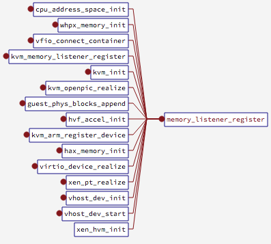
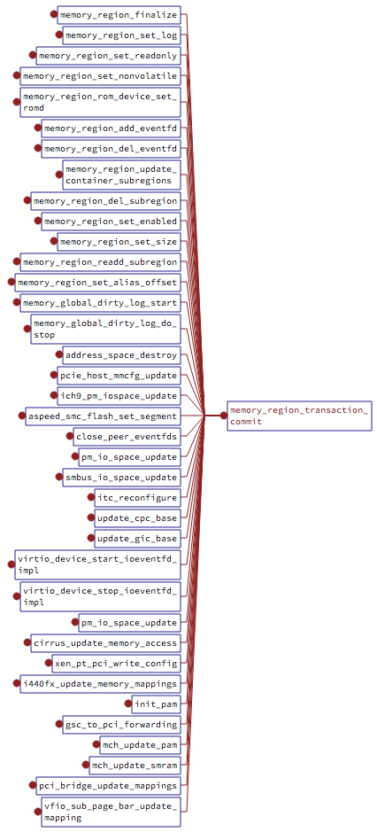

<!-- @import "[TOC]" {cmd="toc" depthFrom=1 depthTo=6 orderedList=false} -->

<!-- code_chunk_output -->

- [内存虚拟化](#内存虚拟化)
- [概述](#概述)
- [相关数据结构](#相关数据结构)
- [初始化流程](#初始化流程)
  - [全局 address space: memory space 和 io space 初始化](#全局-address-space-memory-space-和-io-space-初始化)
  - [pc_memory_init](#pc_memory_init)
    - [pc.ram 分配](#pcram-分配)
    - [两个 mr alias: ram_below_4g 和 ram_above_4g](#两个-mr-alias-ram_below_4g-和-ram_above_4g)
- [内存的提交](#内存的提交)
  - [全局的 memory_listeners](#全局的-memory_listeners)
  - [memory_listener_register 注册](#memory_listener_register-注册)
  - [内存更新](#内存更新)
    - [新建 AddressSpace 时更新](#新建-addressspace-时更新)
- [参考](#参考)

<!-- /code_chunk_output -->

# 内存虚拟化

内存虚拟化就是为虚拟机提供内存, 使得虚拟机能够像在物理机上正常工作, 这需要虚拟化软件为虚拟机展示一种物理内存的假象, 内存虚拟化是虚拟化技术中关键技术之一.

`qemu+kvm` 的虚拟化方案中, 内存虚拟化是由 qemu 和 kvm 共同完成的. qemu 的虚拟地址作为 guest 的物理地址, 一句看似轻描淡写的话幕后的工作确实非常多, 加上 qemu 本身可以独立于 kvm, 成为一个完整的虚拟化方案, 所以其内存虚拟化更加复杂.

本文主要介绍 qemu 在内存虚拟化方面的工作, 之后的文章会介绍内存 kvm 方面的内存虚拟化.

# 概述

内存虚拟化就是要让**虚拟机**能够**无缝的访问内存**, 这个内存哪里来的, **qemu**的**进程地址空间**分出来的.

有了 ept 之后, CPU 在 vmx non\-root 状态的时候进行内存访问会再做一个 ept 转换.

在这个过程中, **qemu**扮演的角色.

1. 首先需要去**申请内存用于虚拟机**, 这是**HVA**;

2. 需要将 1 中**申请**的**虚拟地址(HVA**)与**虚拟机**的对应的**物理地址(GVA**)告诉给**kvm**, 就是指定**GPA\->HVA**的映射关系;

3. 需要组织**一系列的数据结构**去管理**控制内存虚拟化**, 比如, **设备注册**需要**分配物理地址**, **虚拟机退出**之后需要**根据地址做模拟**等等非常多的工作, 由于**qemu 本身**能够支持**tcg 模式的虚拟化**, 会显得更加复杂.

首先明确**内存虚拟化**中**QEMU**和**KVM**工作的分界.

KVM 的**ioctl**中, **设置虚拟机内存**的为**KVM\_SET\_USER\_MEMORY\_REGION**, 我们看到这个 ioctl 需要传递的参数是:

```c
/* for KVM_SET_USER_MEMORY_REGION */
struct kvm_userspace_memory_region {
	__u32 slot;
	__u32 flags;
    // guest 物理地址 GPA
	__u64 guest_phys_addr;
    // 内存大小
	__u64 memory_size; /* bytes */
    // HVA 起始地址
	__u64 userspace_addr; /* start of the userspace allocated memory */
};
```

这个**ioctl**主要就是**设置 GPA 到 HVA 的映射**. 看似简单的工作在 qemu 里面却很复杂, 下面逐一剖析之.

# 相关数据结构

# 初始化流程

```c
main()                              // vl.c
    cpu_exec_init_all()             // exec.c
        memory_map_init()           // exec.c
            address_space_init()    // memory.c
    machine_run_board_init()        // hw/core/machine.c
        machine_class->init()       // pc_init1, hw/i386/pc_piix.c
            pc_cpus_init()          // hw/i386/pc.c
            pc_memory_init()        // hw/i386/pc.c

```

## 全局 address space: memory space 和 io space 初始化

首先在**main**\-\>**cpu\_exec\_init\_all**\-\>**memory\_map\_init**中对**全局的 memory 和 io**进行初始化,

- **system\_memory**作为**address\_space\_memory**的**根 MemoryRegion**, 大小涵盖了**整个 64 位空间的大小**, 当然, 这是一个**pure contaner**,并**不会分配空间**的,

- **system\_io**作为**address\_space\_io**的根 MemoryRegion, 大小为**65536**, 也就是平时的**io port 空间**.

```cpp
//exec.c
static MemoryRegion *system_memory;
static MemoryRegion *system_io;

AddressSpace address_space_io;
AddressSpace address_space_memory;
static void memory_map_init(void)
{
    system_memory = g_malloc(sizeof(*system_memory));
    memory_region_init(system_memory, NULL, "system", UINT64_MAX);
    address_space_init(&address_space_memory, system_memory, "memory");

    system_io = g_malloc(sizeof(*system_io));
    memory_region_init_io(system_io, NULL, &unassigned_io_ops, NULL, "io",
                          65536);
    address_space_init(&address_space_io, system_io, "I/O");
}

// memory.c
void address_space_init(AddressSpace *as, MemoryRegion *root, const char *name)
{
    memory_region_ref(root);
    as->root = root;
    as->current_map = NULL;
    as->ioeventfd_nb = 0;
    as->ioeventfds = NULL;
    QTAILQ_INIT(&as->listeners);
    QTAILQ_INSERT_TAIL(&address_spaces, as, address_spaces_link);
    as->name = g_strdup(name ? name : "anonymous");
    address_space_update_topology(as);
    address_space_update_ioeventfds(as);
}

```

在随后的**cpu 初始化**之中, 还会**初始化多个 AddressSpace**, 这些很多都是 disabled 的, 对虚拟机意义不大.

## pc_memory_init

在**初始化虚拟机**中, main 中由 QEMU 入参标识`QEMU_OPTION_m`设定了`ram_size`参数, 即**虚拟机内存的大小**, 通过调用`machine_run_board_init`, 再调用`machine_class->init(machine)`, 然后一步步传递给`pc_init1`函数.

重点在随后的`main->pc_init_v2_8->pc_init1->pc_memory_init`中, 这里面是**分配系统 ram**, 也是第一次**真正为虚拟机分配物理内存**.

整个过程中, 分配内存也不会像 MemoryRegion 那么频繁, **mr**很多时候是**创建一个 alias**, 指向**已经存在的 mr**的一部分, 这也是**alias 的作用**, 就是把**一个 mr**分割成**多个不连续的 mr**.

### pc.ram 分配

**真正分配空间**的大概有这么几个, **pc.ram**, **pc.bios**, **pc.rom**, 以及**设备的一些 ram**, rom 等, vga.vram, vga.rom, e1000.rom 等.

```cpp
memory_region_allocate_system_memory(ram, NULL, "pc.ram",
                                    machine->ram_size);
```

分配 pc.ram 的流程如下:

```
pc_memory_init  // hw/i386/pc.c
memory_region_allocate_system_memory    // numa.c
allocate_system_memory_nonnuma          // numa.c
memory_region_init_ram_shared_nomigrate // memory.c
qemu_ram_alloc      // exec.c
ram_block_add       // exec.c
phys_mem_alloc      // exec.c
qemu_anon_ram_alloc // util/oslib-posix.c
qemu_ram_mmap       // util/mmap-alloc.c
mmap
```

可以看到, qemu 通过使用**mmap**创建一个**内存映射**来作为 ram.

### 两个 mr alias: ram_below_4g 和 ram_above_4g

继续**pc\_memory\_init**, 函数在创建好了 ram 并且分配好了空间之后, 创建了**两个 mr alias**, **ram\_below\_4g**以及**ram\_above\_4g**, 这两个 mr 分别指向**ram 的低 4g**以及**高 4g 空间**, 这两个 alias 是挂在**根 system\_memory mr 下面**的. 即高低端内存(也不一定是 32bit 机器)

```cpp
ram_below_4g = g_malloc(sizeof(*ram_below_4g));
memory_region_init_alias(ram_below_4g, NULL, "ram-below-4g", ram,
                            0, pcms->below_4g_mem_size);
memory_region_add_subregion(system_memory, 0, ram_below_4g);
e820_add_entry(0, pcms->below_4g_mem_size, E820_RAM);
if (pcms->above_4g_mem_size > 0) {
    ram_above_4g = g_malloc(sizeof(*ram_above_4g));
    memory_region_init_alias(ram_above_4g, NULL, "ram-above-4g", ram,
                            pcms->below_4g_mem_size,
                            pcms->above_4g_mem_size);
    memory_region_add_subregion(system_memory, 0x100000000ULL,
                                ram_above_4g);
    e820_add_entry(0x100000000ULL, pcms->above_4g_mem_size, E820_RAM);
}
```

以后的情形类似, 创建根 mr, 创建 AddressSpace, 然后在根 mr 下面加 subregion.

# 内存的提交

当我们每一次**更改上层的内存布局**之后, 都需要**通知到 kvm**. 这个过程是通过一系列的**MemoryListener 来实现**的.

## 全局的 memory_listeners

首先系统有一个**全局的 memory\_listeners**, 上面挂上了**所有的 MemoryListener**

```c
// memory.c
static QTAILQ_HEAD(, MemoryListener) memory_listeners
    = QTAILQ_HEAD_INITIALIZER(memory_listeners);
```

## memory_listener_register 注册



以 kvm\_init 为例

```cpp
static int kvm_init(MachineState *ms)
{
    ......
    kvm_memory_listener_register(s, &s->memory_listener,
                                 &address_space_memory, 0);
    memory_listener_register(&kvm_io_listener,
                             &address_space_io);
    memory_listener_register(&kvm_coalesced_pio_listener,
                             &address_space_io);
    ......
}

void kvm_memory_listener_register(KVMState *s, KVMMemoryListener *kml,
                                  AddressSpace *as, int as_id)
{
    int i;

    kml->slots = g_malloc0(s->nr_slots * sizeof(KVMSlot));
    kml->as_id = as_id;

    for (i = 0; i < s->nr_slots; i++) {
        kml->slots[i].slot = i;
    }

    kml->listener.region_add = kvm_region_add;
    kml->listener.region_del = kvm_region_del;
    kml->listener.log_start = kvm_log_start;
    kml->listener.log_stop = kvm_log_stop;
    kml->listener.log_sync = kvm_log_sync;
    kml->listener.priority = 10;

    memory_listener_register(&kml->listener, as);
}
```

在这里我们看到 kvm 也注册了自己的 MemoryListener, 也有自己的几个回调函数.

## 内存更新

在上面看到 MemoryListener 之后, 我们看看什么时候需要更新内存.



**进行内存更新**有很多个点, 比如

- 我们将**一个 mr**添加到**另一个 mr 的 subregions**中 memory\_region\_add\_subregion,
- 我们**更改了一端内存的属性**memory\_region\_set\_readonly,
- 将**一个 mr 设置使能或者非使能**memory\_region\_set\_enabled,

总之一句话, 我们**修改**了**虚拟机的内存布局/属性**时, 就需要**通知到各个 Listener**, 这包括**各个 AddressSpace 对应**的, 以及**kvm 注册**的, 这个过程叫做**commit**, 通过函数 memory\_region\_transaction\_commit 实现.

```cpp
void memory_region_set_readonly(MemoryRegion *mr, bool readonly)
{
    ......
    memory_region_transaction_begin();
    ......
    memory_region_transaction_commit();
    ......
}
```

```cpp
// memory.c
void memory_region_transaction_commit(void)
{
    AddressSpace *as;

    assert(memory_region_transaction_depth);
    assert(qemu_mutex_iothread_locked());

    --memory_region_transaction_depth;
    if (!memory_region_transaction_depth) {
        if (memory_region_update_pending) {
            flatviews_reset();

            MEMORY_LISTENER_CALL_GLOBAL(begin, Forward);

            QTAILQ_FOREACH(as, &address_spaces, address_spaces_link) {
                address_space_set_flatview(as);
                address_space_update_ioeventfds(as);
            }
            memory_region_update_pending = false;
            ioeventfd_update_pending = false;
            MEMORY_LISTENER_CALL_GLOBAL(commit, Forward);
        } else if (ioeventfd_update_pending) {
            QTAILQ_FOREACH(as, &address_spaces, address_spaces_link) {
                address_space_update_ioeventfds(as);
            }
            ioeventfd_update_pending = false;
        }
   }
}

#define MEMORY_LISTENER_CALL_GLOBAL(_callback, _direction, _args...)    \
    do {                                                                \
        MemoryListener *_listener;                                      \
                                                                        \
        switch (_direction) {                                           \
        case Forward:                                                   \
            QTAILQ_FOREACH(_listener, &memory_listeners, link) {        \
                if (_listener->_callback) {                             \
                    _listener->_callback(_listener, ##_args);           \
                }                                                       \
            }                                                           \
            break;                                                      \
        case Reverse:                                                   \
            QTAILQ_FOREACH_REVERSE(_listener, &memory_listeners, link) { \
                if (_listener->_callback) {                             \
                    _listener->_callback(_listener, ##_args);           \
                }                                                       \
            }                                                           \
            break;                                                      \
        default:                                                        \
            abort();                                                    \
        }                                                               \
    } while (0)
```

MEMORY\_LISTENER\_CALL\_GLOBAL 对**memory\_listeners**上的**各个 MemoryListener**调用指定函数.

### 新建 AddressSpace 时更新

注: 我们**新创建了一个 AddressSpace** address\_space\_init, 是主动调用更新

```cpp
void address_space_init(AddressSpace *as, MemoryRegion *root, const char *name)
{
    memory_region_ref(root);
    as->root = root;
    as->current_map = NULL;
    as->ioeventfd_nb = 0;
    as->ioeventfds = NULL;
    QTAILQ_INIT(&as->listeners);
    QTAILQ_INSERT_TAIL(&address_spaces, as, address_spaces_link);
    as->name = g_strdup(name ? name : "anonymous");
    address_space_update_topology(as);
    address_space_update_ioeventfds(as);
}
```

address\_space\_update\_topology 调用.

```cpp
// memory.c
static void address_space_update_topology(AddressSpace *as)
{
    MemoryRegion *physmr = memory_region_get_flatview_root(as->root);

    flatviews_init();
    if (!g_hash_table_lookup(flat_views, physmr)) {
        generate_memory_topology(physmr);
    }
    address_space_set_flatview(as);
}
```

前面我们已经说了, as\-\>root 会被**展开**为一个**FlatView**, 所以在这里 update topology 中, 首先**得到上一次的 FlatView**, 之后调用**generate\_memory\_topology**生成一个**新的 FlatView**,

```cpp
static FlatView *generate_memory_topology(MemoryRegion *mr)
{
    int i;
    FlatView *view;

    view = flatview_new(mr);

    if (mr) {
        render_memory_region(view, mr, int128_zero(),
                             addrrange_make(int128_zero(), int128_2_64()),
                             false, false);
    }
    flatview_simplify(view);

    view->dispatch = address_space_dispatch_new(view);
    for (i = 0; i < view->nr; i++) {
        MemoryRegionSection mrs =
            section_from_flat_range(&view->ranges[i], view);
        flatview_add_to_dispatch(view, &mrs);
    }
    address_space_dispatch_compact(view->dispatch);
    g_hash_table_replace(flat_views, mr, view);

    return view;
}
```

最主要的是 render\_memory\_region**生成 view**, 这个 render 函数很复杂, 需要**递归 render 子树**, 具体以后有机会单独讨论.

在生成了 view 之后会调用**flatview\_simplify**进行简化, 主要是**合并相邻的 FlatRange**. 在生成了当前 as 的 FlatView 之后, 我们就可以更新了, 这在函数 address_space_update_topology_pass 中完成, 这个函数就是逐一对比新旧 FlatView 的差别, 然后进行更新.

# 参考

https://www.cnblogs.com/ck1020/p/6729224.html

https://www.binss.me/blog/qemu-note-of-memory/

http://oenhan.com/qemu-memory-struct

https://blog.csdn.net/leoufung/article/details/48781205