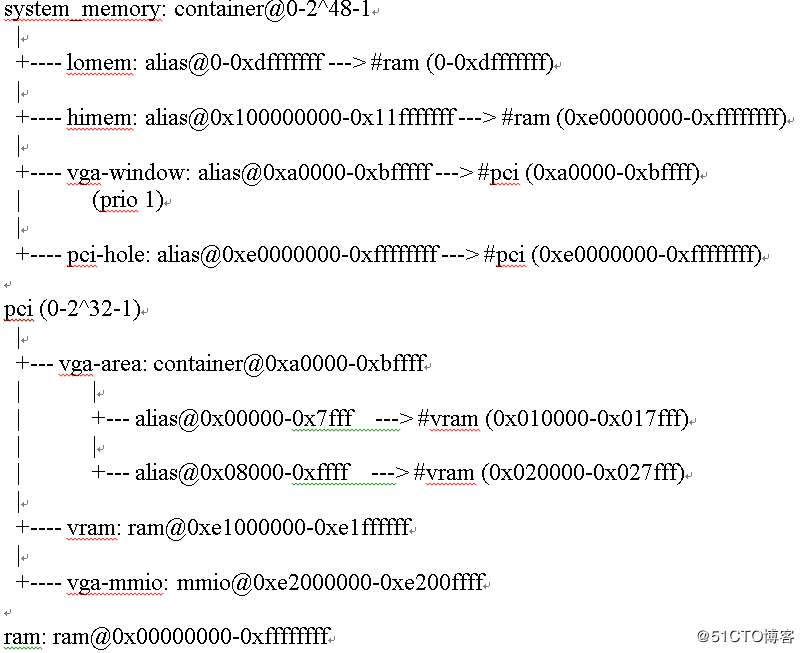
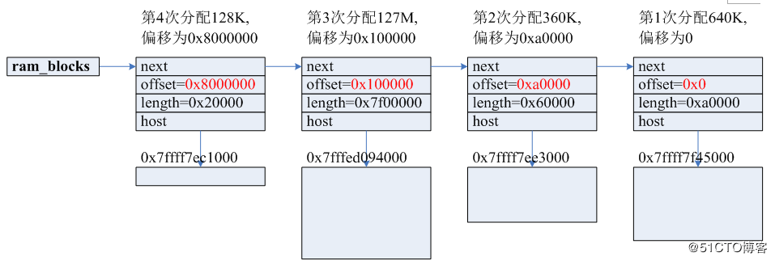

<!-- @import "[TOC]" {cmd="toc" depthFrom=1 depthTo=6 orderedList=false} -->

<!-- code_chunk_output -->

- [Qemu 内存分布](#qemu-内存分布)
- [内存初始化](#内存初始化)
- [内存分配](#内存分配)
- [内存映射](#内存映射)
- [客户机物理地址到主机虚拟地址的转换](#客户机物理地址到主机虚拟地址的转换)
  - [地址属性](#地址属性)
  - [客户机物理地址到主机虚拟地址的转换步骤](#客户机物理地址到主机虚拟地址的转换步骤)
- [KVM 映射](#kvm-映射)
- [参考](#参考)

<!-- /code_chunk_output -->

# Qemu 内存分布



# 内存初始化

Qemu 中的内存模型, 简单来说就是 Qemu**申请用户态内存**并进行管理, 并将该部分申请的内存**注册**到**对应的加速器(如 KVM)中**.

这样的模型有如下好处:

1. **策略与机制分离**. **加速的机制**由**KVM**负责, 而**如何调用**加速的机制由 **Qemu 负责**

2. 可以由 **Qemu** 设置**多种内存模型**, 如**UMA**、**NUMA**等等

3. 方便 Qemu**对特殊内存的管理**(如 MMIO)

4. 内存的**分配**、**回收**、**换出**等都可以采用 Linux 原有的机制, **不需要**为 KVM**单独开发**.

5. **兼容其他加速器模型**(或者**无加速器**, 单纯使用**Qemu 做模拟**)

Qemu 需要做的有两方面工作:

- **向 KVM 注册用户态内存空间**,
- 申请**用户态内存空间**.

Qemu 主要通过如下结构来维护内存:

```cpp
// include/exec/memory.h
struct AddressSpace {
    /* All fields are private. */
    struct rcu_head rcu;
    char *name;
    // MR 树(多个 MR)
    MemoryRegion *root;

    /* Accessed via RCU.  */
    //AddressSpace 的一张平面视图, 它是 AddressSpace 所有正在使用的 MemoryRegion 的集合, 这是从 CPU 的视角来看到的.
    struct FlatView *current_map;

    int ioeventfd_nb;
    struct MemoryRegionIoeventfd *ioeventfds;
    QTAILQ_HEAD(, MemoryListener) listeners;
    QTAILQ_ENTRY(AddressSpace) address_spaces_link;
};
```

"memory"的 root 是`static MemoryRegion system_memory`;

使用**链表**`address_spaces`保存**虚拟机的内存**, 该链表保存`AddressSpace address_space_io`和`AddressSpace address_space_memory`等信息

```cpp
// memory.c
void address_space_init(AddressSpace *as, MemoryRegion *root, const char *name)
{
    memory_region_ref(root);
    as->root = root;
    as->current_map = NULL;
    as->ioeventfd_nb = 0;
    as->ioeventfds = NULL;
    QTAILQ_INIT(&as->listeners);
    QTAILQ_INSERT_TAIL(&address_spaces, as, address_spaces_link);
    as->name = g_strdup(name ? name : "anonymous");
    address_space_update_topology(as);
    address_space_update_ioeventfds(as);
}
```

AddressSpace 设置了一段内存, 其主要信息存储在 root 成员中, root 成员是个 MemoryRegion 结构, 主要存储内存区的结构. 在 Qemu 中最主要的两个 AddressSpace 是 `address_space_memory` 和 `address_space_io`, 分别对应的 MemoryRegion 变量是`system_memory`和 `system\_io`.

Qemu 的**主函数**是**vl.c**中的 main 函数, 其中调用了`configure_accelerator()`, 是 KVM 初始化的配置部分.

configure\_accelerator 中首先根据命令行输入的参数找到对应的 accelerator, 这里是 KVM. 之后调用`accel_list[i].init()`, 即`kvm_init()`.

在 kvm_init()函数中主要做如下几件事情:

1. `s->fd = qemu_open("/dev/kvm", O_RDWR)`, **打开 kvm 控制的总设备文件/dev/kvm**
2. `s->vmfd = kvm_ioctl(s, KVM_CREATE_VM, 0)`, 调用**创建虚拟机的 API**
3. `kvm_check_extension`, 检查各种 extension, 并设置对应的 features
4. `ret = kvm_arch_init(s)`, 做一些**体系结构相关的初始化**, 如**msr**、**identity map**、**mmu pages number**等等
5. `kvm_irqchip_create`, 调用`kvm_vm_ioctl(s, KVM_CREATE_IRQCHIP)`**在 KVM 中虚拟 IRQ 芯片**
6. `memory_listener_register`, 该函数是**初始化内存**的主要函数
7. `memory_listener_register`调用了两次**, 分别注册了 `kvm_memory_listener`和`kvm_io_listener`, 即**通用的内存**和**MMIO**是**分开管理**的.

以**通用的内存注册**为例, 函数首先在**全局的 memory\_listener 链表**中添加了`kvm_memory_listener`, 之后调用**listener\_add\_address\_space**分别将**该 listener**添加到**address\_space\_memory**和**address\_space\_io**中, address\_space\_io 是虚机的 io 地址空间(**设备的 io port**就分布在这个地址空间里).

8. 然后**调用 listener 的 region\_add**(即 `kvm_region_add()`), 该函数最终调用了 kvm\_set\_user\_memory\_region(), 其中调用 `kvm_vm_ioctl(s, KVM_SET_USER_MEMORY_REGION, &mem)`, 该调用是最终**将内存区域注册到 kvm**中的函数.
9. 之后在 vl.c 的 main 函数中调用了 cpu\_exec\_init\_all() \=\> memory\_map\_init(), 设置**system\_memory**和**system\_io**.

至此**初始化好**了所有 Qemu 中需要维护的**相关的内存结构**, 并完成了在 KVM 中的注册. 下面需要初始化 KVM 中的 MMU 支持.

ram\_size 内存大小从内存被读取到 ram\_size 中, 在 vl.c 的 main 中调用 machine\-\>init()来初始化, **machine**是命令行**指定的机器类型**, 默认的 init 是 pc\_init\_pci

```c
pc_memory_init
memory_region_allocate_system_memory
memory_region_add_subregion
memory_region_add_subregion_common
memory_region_update_container_subregions
memory_region_transaction_commit
address_space_update_topology
generate_memory_topology
render_memory_region
flatview_insert
```

# 内存分配

**内存的分配**实现函数为 ram\_addr\_t **qemu\_ram\_alloc**(ram\_addr\_t size, MemoryRegion \*mr), 输出为**该次分配的内存**在**所有分配内存**中的**顺序偏移**(即下图中的红色数字).

该函数**最终**调用**phys\_mem\_alloc**分配内存, 并将所分配的**全部内存块**, **串**在一个**ram\_blocks 开头的链表**中, 如下示意:



上图中分配了 4 个内存块, 每次分配时偏移 offset 顺序累加, host 指向该内存块在主机中的虚拟地址.

调用 memory\_listener\_register 注册

# 内存映射

使用的相关结构体如下:

```c
// memory.c
struct AddrRange {
    Int128 start; // 起始
    Int128 size; // 大小
};

struct FlatRange {
    //指向所属的 MR
    MemoryRegion *mr;
    //在 MR 中的 offset
    hwaddr offset_in_region;
    //本 FR 代表的区间
    AddrRange addr;
    uint8_t dirty_log_mask;
    bool romd_mode;
    bool readonly;
    bool nonvolatile;
    int has_coalesced_range;
};

// include/exec/memory.h
typedef struct AddressSpaceDispatch AddressSpaceDispatch;
typedef struct FlatRange FlatRange;

struct FlatView {
    struct rcu_head rcu;
    //引用计数, 为 0 就销毁
    unsigned ref;
    //对应的 flatrange 数组
    FlatRange *ranges;
    //flatrange 数目
    unsigned nr;
    unsigned nr_allocated;
    // 负责根据 GPA 找到 HVA
    struct AddressSpaceDispatch *dispatch;
    MemoryRegion *root;
};
```

映射是将上面**分配的地址块**映射为**客户机的物理地址**, 函数如下, 输入为映射后的物理地址, 内存偏移, 通用内存块的地址

```c
static void memory_region_add_subregion_common(MemoryRegion mr, hwaddr offset, MemoryRegion subregion)
```

MemoryRegion mr: 对应的是 system\_memory 或者 system\_io, 通过 memory\_listener\_register 函数注册内存块.

通用栈如下:

```c
memory_region_update_container_subregions
memory_region_transaction_commit
address_space_update_topology
generate_memory_topology
address_space_update_topology_pass
memory_region_update_container_subregions 函数在链表中寻找合适的位置插入,
/插入指定的位置/
QTAILQ_FOREACH(other, &mr->subregions, subregions_link) {
if (subregion->priority >= other->priority) {
QTAILQ_INSERT_BEFORE(other, subregion, subregions_link);
goto done;
}
}
QTAILQ_INSERT_TAIL(&mr->subregions, subregion, subregions_link);
```

memory\_region\_transaction\_commit 中引入了新的结构 address\_spaces(AS), 内存有不同的应用类型, address_spaces 以链表形式存在, commit 函数则是对所有 AS 执行 address\_space\_update\_topology, 先看 AS 在哪里注册的, 就是前面提到的 kvm\_init 里面, 执行 memory\_listener\_register, 注册了 address\_space\_memory 和 address\_space\_io 两个, 涉及的另 外一个结构体则是 MemoryListener, 有 kvm\_memory\_listener 和 kvm\_io\_listener, 就是用于监控内存映射关系 发生变化之后执行回调函数.

address_space_update_topology_pass 函数比较之前的内存块, 做相应的处理

MEMORY_LISTENER_UPDATE_REGION 函数, 将变化的 FlatRange 构造一个 MemoryRegionSection, 然后 遍历所有的 memory_listeners, 如果 memory_listeners 监控的内存区域和 MemoryRegionSection 一样, 则执 行第四个入参函数, 如 region_del 函数, 即 kvm_region_del 函数, 这个是在 kvm_init 中初始化的.  kvm_region_add 主要是 kvm_set_phys_mem 函数, 主要是将 MemoryRegionSection 有效值转换成 KVMSlot 形式, 在 kvm_set_user_memory_region 中使用 kvm_vm_ioctl(s, KVM_SET_USER_MEMORY_REGION, &mem)传递给 kernel.

# 客户机物理地址到主机虚拟地址的转换

## 地址属性

内存映射是以页为单位的, 也就意味着 phys_offset 的低 12bit 为 0, Qemu 使用这些 bit 标识地址属性:

Bit 11-3 Bit 2 Bit 1 Bit 0

MMIO 索引, 其中 4 个固定分配 SUBWIDTH SUBPAGE ROMD

0: RAM

1: ROM

2: UNASSIGNED

3: NOTDIRTY

## 客户机物理地址到主机虚拟地址的转换步骤

虚拟机因 mmio 退出时, qemu 处理该退出事件, 相关的函数:

```c
void cpu_physical_memory_rw(hwaddr addr, uint8_t buf, int len, int is_write)
```

该函数实现虚拟机的物理地址到主机虚拟地址的转换

查找该地址所应的 MemoryRegionSection 结构, 函数为 static MemoryRegionSection phys_page_find(PhysPageEntry lp, hwaddr addr, Node nodes, MemoryRegionSection *sections), 即将客户物理地址分为 4 段, 取每一段的索引查找下一段, 直至找到 Level 3 的 MemoryRegionSection 结构.

调函数 void qemu_get_ram_ptr(ram_addr_t addr), 取主机虚拟地址起始位置, 再加上页内偏移, 即为对应的主机虚拟地址

# KVM 映射

```c
static void kvm_set_phys_mem(MemoryRegionSection section, bool add)
```

该函数把**guest 的物理内存**映射**主机的虚拟内存**

```c
typedef struct KVMSlot
{
hwaddr start_addr; /guest 物理地址/
ram_addr_t memory_size; /内存大小/
void ram; /对应的虚拟地址/
int slot; /对应的插槽号*/
int flags;
} KVMSlot;
```

**Qemu 支持 kvm**时, 还需**通知 kvm**将**客户机物理内存**进行映射, 方法为先定义一个映射结构:

```c
struct kvm_userspace_memory_region memory = {
.memory_size = len,
.guest_phys_addr = phys_start, // 客户机物理地址
.userspace_addr = userspace_addr, // 主机虚拟地址, 而非上面的偏移
.flags = log ? KVM_MEM_LOG_DIRTY_PAGES : 0,
};
```

然后调用 kvm 的 ioctl r = kvm\_vm\_ioctl(kvm\_state, KVM\_SET\_USER\_MEMORY\_REGION, \&memory);同时, qemu 的 kvm 用户空间代码, 还定义了一些结构如 mapping/slot, 用于地址空间的管理, 如防止重复映射等.

# 参考

https://blog.51cto.com/zybcloud/2149626