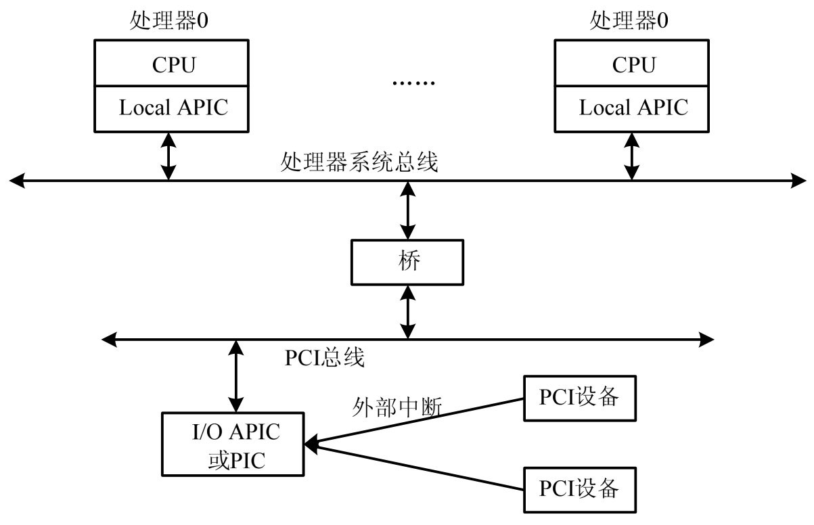
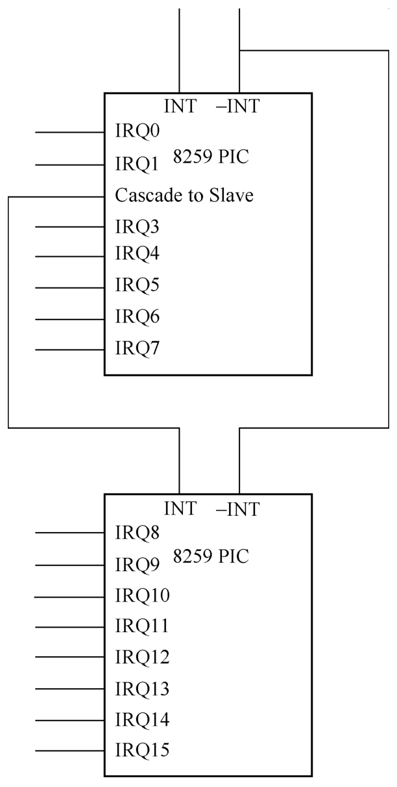

<!-- @import "[TOC]" {cmd="toc" depthFrom=1 depthTo=6 orderedList=false} -->

<!-- code_chunk_output -->

- [1. 中断的引入](#1-中断的引入)
- [2. 中断架构](#2-中断架构)
- [3. 中断分发方式](#3-中断分发方式)
  - [3.1. XT-PIC](#31-xt-pic)
  - [3.2. APIC](#32-apic)
  - [3.3. MSI](#33-msi)
- [4. 中断线与中断向量](#4-中断线与中断向量)

<!-- /code_chunk_output -->

# 1. 中断的引入

计算机系统有很多外设需要服务, 显然, 轮询的方式是非常浪费 CPU 的计算资源的, 尤其是对于那些并不是频繁需要服务的设备. 因此设计了外设主动向 CPU 发起服务请求的方式, 这种方式就是中断. 采用中断方式后, 在没有外设请求时, CPU 可以继续其他计算任务, 而不是进行很多不必要的轮询, 极大地提高了系统的吞吐. 在每个指令周期结束后, 如果 CPU 的状态标志寄存器中的 IF(interrupt flag)位为 1, 那么 CPU 会去检查是否有中断请求, 如果有中断请求, 则运行对应的中断服务程序, 然后返回被中断的计算任务继续执行.

中断是外部设备向操作系统发起通知的方式, 通常情况下, 操作系统中的设备驱动程序向设备发指令进行某项工作, 当设备完成后可以通过中断的形式通知驱动程序. 设备并不是直接连接到 CPU 的, 而是统一连接到中断控制器, 每种中断控制器有自己的中断分发和传递方式. 为了模拟一个完整的计算机系统, QEMU-KVM 必须支持中断的模拟, 本节介绍几种中断设备及其对应的中断分发和处理机制.

# 2. 中断架构

物理平台的中断架构:

物理平台, 外部中断流程如图.

1) 首先, I/O 设备通过中断控制器(`I/O APIC` 或 PIC)发出中断请求;

2) 中断请求经由 PCI 总线发送到系统总线上;

3) 最后目标 CPU 的 Local APIC 部件接收中断, CPU 开始处理中断.

# 3. 中断分发方式

## 3.1. XT-PIC

XT-PIC 中断模式是最古老的中断分发方式, 用于单处理器系统. XT-PIC 中断模式使用两个 Intel 8259 中断控制芯片(又叫 PIC 芯片)​, 每个 8259 芯片支持 8 个中断. 通过将两个 8259 芯片级联起来, 计算机系统能够支持 15 个中断. 两个 8259 芯片级联方式如图 6-1 所示, 直接连接 CPU 的 PIC 芯片叫作 master PIC 芯片, 另一个 PIC 叫作 slave PIC 芯片, 它的输出端口连接到 master PIC 的 IRQ2.

PIC 中断控制器原理:

当与 PIC 芯片相连的设备需要发出中断时, 它发送一个信号到中断引脚(通常是拉低电平)​,PIC 芯片收到这个中断信号之后就会发送一个信号到 CPU.CPU 在每一次指令执行完成之后都会检查是否有中断, 如果有中断就会让操作系统执行中断处理例程(Interrupt Service Routine,ISR)​, 并将正在处理的中断类型屏蔽. ISR 会检查发起中断的设备的状态, 处理中断请求, 当中断请求完成的时候, 操作系统会解除对该中断的屏蔽.

PIC 中断控制器有很多局限性, 如其中断线比较少, 中断的优先级通过中断号就固定下来了, 不能支持多 CPU 的情况等.

## 3.2. APIC

Intel 在随后发布的多处理器芯片中引入了 APIC 中断控制器, 它包括两个部分: 第一个部分是在 CPU 内部的 LAPIC, 每个 CPU 都有一个 LAPIC; 另一个是用来连接设备的 I/O APIC, 系统中可以有一个或多个 I/O APIC.APIC 中断控制架构很大程度上突破了 PIC 中断控制器的局限, 最重要的改变体现在对多 CPU 的支持以及 I/O APIC 支持 24 条中断线上.

为了保持向后兼容, I/O APIC 的 24 条中断线的前 16 条会按照 XT-PIC 模式分配给对应的设备, 这样 I/O APIC 就只有多余的 8 条中断线可用, 所以 I/O APIC 情况下, 设备一般都需要共享中断线. I/O APIC 中断分发与处理步骤如下.

1) 如果设备需要触发一个中断, 那么它向与之相连的 I/O APIC 引脚发送一个信号.

2) I/O APIC 收到来自设备的信号之后, 会向 LAPIC 写入对应的中断向量号, I/O APIC 中保存了一个重定向表, 用来将中断线与操作系统内部的中断向量号联系起来.

3) 被中断的 CPU 开始执行对应的中断处理例程, 这里可能会有多个中断例程.

4) 每一个中断例程判断是否是自己对应的设备触发的中断, 如果不是自己对应的设备则直接略过, 如果是则开始中断处理流程.

## 3.3. MSI

此外, PCI/PCIe 设备还支持另一种中断方式 MSI, **MSI** 可以允许**设备直接发送中断到 Local APIC**, 不需要经过中断控制器(I/O APIC).

MSI 中断模式在 1999 年被引入 PCI 规格中, 作为一个可选方式, 但是随着 2004 年 PCIe 设备的出现, MSI 成为 **PCIe 硬件必须实现**的一个标准. MSI 中断模式中绕过了 I/O APIC, 允许设备直接写 LAPIC. MSI 模式支持 224 个中断, 由于中断数目多, 所以 MSI 不允许中断共享. MSI 模式下中断的分发和处理过程如下.

1) 如果设备需要出发一个中断, 那么它直接写入中断向量号到对应 CPU 的 LAPIC.

2) 被中断的 CPU 开始执行与该中断向量号对应的中断处理例程.

# 4. 中断线与中断向量

中断线与中断向量是两个容易混淆的概念. 中断线是硬件的概念, 如设备连接哪一条中断线, 拉高或拉低中断线的电平. 中断向量则是操作系统的概念, CPU 在接收到中断后还会接收到中断向量号, 并且会使用该中断向量号作为索引在 IDT 表中寻找中断处理例程, 然后执行中断处理函数. 在 pin-based 的中断传递机制中, 设备直接向中断线发送信号, 中断控制器 (PIC 或者 I/O APIC) 会把中断线号转换成中断向量号发送给 CPU, 在 MSI/MSIX 方案中, 设备直接向 CPU 的 LAPIC 写入中断向量号信息. 为了避免混淆, 下文将用 irq 表示中断线号, vector 表示中断向量号.

对 XT-PIC 中断模式来说, 其 irq 与 vector 是固定的, 即 `vector=irq+0x20`. 如 XT-PIC 中时钟中断的 irq 号为 0, vector 号为 32, 键盘中断的 irq 号为 1, vector 号为 33.

I/O APIC 中 **irq** 到 **vector** 的**转换**是通过 I/O APIC 的 **I/O 重定向表** (I/O redirection table) 完成的, 该重定向表是操作系统通过写 I/O APIC 设备的寄存器完成设置的. I/O APIC 的重定向表总共包括 24 项, 对应 24 个引脚的重定向信息, 表中的每一个重定向项为 8 个字节共 64 位, 其中的第 8 位用来表示对应 irq 的 vector 信息.
