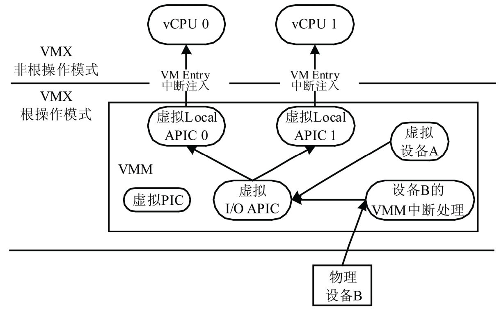
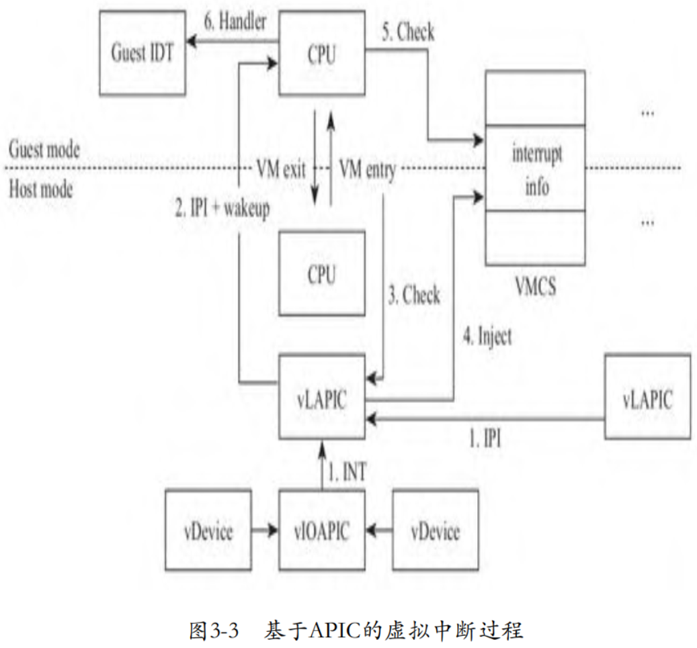

<!-- @import "[TOC]" {cmd="toc" depthFrom=1 depthTo=6 orderedList=false} -->

<!-- code_chunk_output -->

- [1. 中断架构](#1-中断架构)
- [2. 不同中断](#2-不同中断)
- [3. 中断处理](#3-中断处理)
  - [3.1. 物理 CPU 处理中断](#31-物理-cpu-处理中断)
  - [3.2. 虚拟化](#32-虚拟化)
- [4. 单核使用 PIC](#4-单核使用-pic)
- [5. 多处理器使用 APIC](#5-多处理器使用-apic)
- [6. 硬件辅助](#6-硬件辅助)
  - [6.1. VM exit 开销](#61-vm-exit-开销)
  - [6.2. virtual-APIC page](#62-virtual-apic-page)
  - [6.3. Guest 模式下的中断评估逻辑](#63-guest-模式下的中断评估逻辑)
  - [6.4. posted-interrupt](#64-posted-interrupt)
- [7. 虚拟化环境下的中断注入](#7-虚拟化环境下的中断注入)

<!-- /code_chunk_output -->

# 1. 中断架构

虚拟化环境中, VMM 也需要为客户机 OS 展现一个与物理中断架构类似的虚拟中断架构.

虚拟机的中断架构:



和物理平台一样,

* **每个 VCPU** 都对应**一个虚拟 Local APIC** 用于**接收中断**;

* **虚拟平台**也包含**虚拟 I/O APIC** 或**虚拟 PIC** 用于**发送中断**.

和 VCPU 一样, **虚拟 Local APIC**,**虚拟 I/O APIC** 和**虚拟 PIC** 都是 **VMM 维护的软件实体**.

- 当**虚拟设备**需要**发送中断**时, **虚拟设备**会**调用虚拟 I/O APIC 的接口发送中断**.

- **虚拟 I/O APIC** 根据中断请求, 挑选出**相应的虚拟 Local APIC**, 调用其接口**发送中断请求**.

- **虚拟 Local APIC** 进一步利用 `VT-x` 的事件注入机制将中断注入到相应的 VCPU.

可见, 中断虚拟化的主要任务是实现图 5-10 描述的虚拟中断架构, 具体包括**虚拟 PIC**,**虚拟 I/O APIC** 和**虚拟 Local APIC**, 并实现**中断的生成**,**采集**和**注入**的**整个过程**.

# 2. 不同中断

在 **VMX root** 模式下, **外部来的中断**是直接通过**宿主机**的**物理中断控制器**处理的, **虚拟机**的**中断控制器** (如 PIC 或者 APIC) 是通过 **VMM** 创建的, VMM 可以利用虚拟机的中断控制器向其注入中断. 下图展示了宿主机外部中断和虚拟机虚拟中断的关系.

宿主机外部中断和虚拟机虚拟中断:


设备 A 为**宿主机**拥有, 在宿主机的 IDT 表中, 由 X 向量号对应的中断处理程序处理, **中断处理程序**由**设备 A** 在**宿主机**中加载的**驱动程序**注册.

虚拟机有一个**虚拟设备** C, 其**利用物理设备 A 的功能**完成模拟, 虚拟设备 C 的中断处理由虚拟机的 IDT 表中 P 向量号对应的中断处理程序处理, 这个**中断处理程序**是由**虚拟设备 C** 在**虚拟机**中加载的**驱动程序**注册的.

设备 B 是一个物理设备, 但是被**直通**给了**虚拟机**, 设备 B 的中断首先由**宿主机** IDT 表中 Y 向量号对应的**中断处理程序**处理, 这个中断处理程序由 **VMM** 设置, VMM 接着会**向虚拟机注入中断**; **虚拟机** IDT 表中的 Q 向量对应的**中断处理程序**会进行处理, 这个中断处理程序由**虚拟机**的**设备 B 驱动**注册.

接下来从代码角度详细分析这些过程, 其中直通设备的中断处理将在第 7 章介绍.

# 3. 中断处理

## 3.1. 物理 CPU 处理中断

在探讨 Guest 模式的 CPU 处理中断前, 我们首先回顾一下**物理 CPU** 是如何**响应中断**的. 当**操作系统允许 CPU 响应中断**后, 每当**执行完一条指令**, **CPU** 都将检查**中断引脚是否有效**. 一旦有效, CPU 将**处理中断**, 然后再**执行下一条指令**, 如下图所示.


## 3.2. 虚拟化

当有中断需要 CPU 处理时, **中断芯片**将**使连接 CPU 的 INTR 引脚有效**, 也就是说如果 INTR 是**高电平有效**, 那么**中断芯片拉高 INTR 引脚**的电平. **CPU** 在执行完一条指令后, 将**检查 INTR 引脚**.

类似的, **虚拟中断**也**效仿这种机制**, **使**与 CPU 的 INTR 引脚相连的 "**引脚**" **有效**, 当然, 对于**软件虚拟**的**中断芯片**而言, "**引脚**"只是一个**变量**, 从**软件模拟**的角度就是**设置变量的值**了.

如果 **KVM** 发现**虚拟中断芯片**有**中断请求**, 则向 **VMCS** 中 `VM-entry control` 部分的 `VM-entry interruption-information field` 字段**写入中断信息**, 在**切入 Guest 模式**的一刻, **CPU** 将检查这个字段, 就**如同检查 CPU 管脚**, 如果有中断, 则进入**中断执行过程**.

# 4. 单核使用 PIC

下图为**单核系统**使用 **PIC** 中断芯片下的虚拟中断过程.


具体步骤如下:

1) 虚拟设备向虚拟中断芯片 PIC 发送中断请求, 虚拟 PIC 记录虚拟设备的中断信息. 与物理的中断过程不同, 此时并不会触发虚拟 PIC 芯片的中断评估逻辑, 而是在 VM entry 时进行.

2) 如果虚拟 CPU 处于睡眠状态, 则唤醒虚拟 CPU, 即使虚拟 CPU 对应的线程进入了物理 CPU 的就绪任务队列.

3) 当虚拟 CPU 开始运行时, 在其切入 Guest 前一刻, **KVM** 模块将**检查虚拟 PIC 芯片**, 查看**是否有中断**需要处理. 此时, KVM 将触发虚拟 PIC 芯片的中断评估逻辑.

4) 一旦经过虚拟中断芯片计算得出有需要 Guest 处理的中断, 则将**中断信息**注入 **VMCS** 中的字段 `VM-entry interruption-information`.

5) 进入 **Guest** 模式**后**, **CPU** 检查 **VMCS** 中的**中断信息**.

6) 如果有中断需要处理, **CPU** 将调用 **Guest IDT** 中相应的**中断服务**处理中断.

# 5. 多处理器使用 APIC

**PIC** 只能支持**单处理器系统**, 对于**多处理器系统**, 需要 **APIC** 支持. 对于虚拟化而言, 显然也需要**虚拟相应的 APIC**, 但是其本质上与 PIC 基本相同, 如下图所示.



与单处理器情况相比, 多处理器的虚拟中断主要有两点不同:

1) 在**多处理器**系统下, 不同 CPU 之间需要收发中断, 因此, **每个 CPU** 需要分别关联一个**独立的中断芯片**, 这个中断芯片称为 LAPIC. LAPIC 不仅需要接收 CPU 之间的**核间中断**(`Inter-Processor Interrupt`, **IPI**), 还需要接收来自**外设的中断**. **外设**的中断引脚**不可能**连接到**每个 LAPIC** 上, 因此, 有一个**统一的 I/O APIC芯片**负责**连接外设**, 如果一个 I/O APIC 引脚不够用, 系统中可以使用**多个 I/O APIC**. LAPIC 和 I/O APIC 都接到总线上, 通过总线进行通信. 所以在虚拟化场景下, 需要虚拟 LAPIC 和 I/O APIC 两个组件.

2) 在**多处理器**情况下, **仅仅**是**唤醒**可能在睡眠的**虚拟 CPU 线程**还不够, 如果**虚拟 CPU** 是在**另外一个物理 CPU** 上运行于 **Guest 模式**, 此时还需要向其发送 **IPI**, 使目的 CPU 从 Guest 模式退出到 Host 模式, 然后在下一次 VM entry 时, 进行**中断注入**.

# 6. 硬件辅助

## 6.1. VM exit 开销

**Guest 模式的 CPU** 和**虚拟中断芯片**处于两个"世界", 所以**处于 Guest 模式的 CPU 不能检查虚拟中断芯片的引脚**, 只能在 VM entry 前由 **KVM** 模块代为检查, 然后**写入 VMCS**.

所以, 一旦有中断需要注入, 那么处于 Guest 模式的 CPU 一定需要通过 **VM exit** 退出到 Host 模式, 这是一个很大的开销.

## 6.2. virtual-APIC page

为了去除 VM exit 的开销, Intel 在**硬件层面**对中断虚拟化进行了支持. 典型的情况比如当 Guest 访问 LAPIC 的寄存器时, 将导致 VM exit. 但是事实上, 某些访问过程并**不需要 VMM 介入**, 也就无须 VM exit. 我们知道, **物理 LAPIC 设备**上有一个**页面大小的内存**用于**存储寄存器**, 这个页面称为 **APIC page**, 于是 Intel 实现了一个处于 **Guest 模式**的页面, 称为 **virtual-APIC page**.

## 6.3. Guest 模式下的中断评估逻辑

除此之外, Intel 还在 **Guest 模式下**实现了**部分中断芯片的逻辑**, 比如**中断评估**, 我们将其称为**虚拟中断逻辑**. 如此, 在 Guest 模式下就有了状态和逻辑, 就可以模拟很多中断的行为, 比如访问中断寄存器, 跟踪中断的状态以及向 CPU 递交中断等. 因此, 很多中断行为就**无须 VMM 介入**了, 从而大大地减少了 VM exit 的次数.

当然, 有些**写中断寄存器**的操作是具有副作用的, 比如通过写 icr 寄存器发送 IPI, 此时仍然需要触发 VM exit, 由本地 LAPIC 向目标 LAPIC 发送 IPI.

## 6.4. posted-interrupt

在**硬件虚拟化**支持下, 当 LAPIC 收到中断时, 不必再等到下一次 VM entry 时被动执行中断评估, 而是主动向处于 Guest 模式的 CPU 告知信息, LAPIC 首先将中断信息写入 posted-interrupt descriptor. 然后, LAPIC 通过一个特殊的核间中断 posted-interrupt notification 通知目标 CPU, 目标 CPU 在 Guest 模式下借助虚拟中断逻辑处理中断. 虚拟中断过程如下图所示.


# 7. 虚拟化环境下的中断注入

前面多种中断分发与处理机制, 这些机制少不了中断控制器. 从设备上来说, QEMU-KVM 必须模拟这些中断控制器设备, 另一方面还需要 Intel 的硬件 CPU 提供一种机制, 让 CPU 在进入 `VMX non-root` 的时候能够将中断信息告诉虚拟机, 从而让虚拟机开始对应的中断处理. VMCS 中的 `VM-entry interruption-information field` 即用来**设定虚拟机的中断信息**, 这个成员包括 4 个字节, 总共 32 位.

从 Intel SDM 第二卷表 24-13 可以知道, VM-entry interruption-information field 的低 8 位表示中断 vector, 也就是虚拟机接收到的中断向量号, 用来索引虚拟机 CPU 的 IDT 表查找中断处理函数, 8:10 表示中断类型, 对于模拟硬件设备产生的中断, 该值设置为 0, 第 11 位表示是否需要将异常错误码压栈, 只有当第 31 位 valid 为 1 的时候才进行中断注入.

KVM 中 kvm_x86_ops 结构的 set_irq 回调函数用于注入中断, 对于 Intel 的硬件虚拟化方案来说该回调函数为 vmx_inject_irq, 代码如下.

```cpp
// arch/x86/kvm/vmx/vmx.c
void vmx_inject_irq(struct kvm_vcpu *vcpu, bool reinjected)
{
	struct vcpu_vmx *vmx = to_vmx(vcpu);
	uint32_t intr;
    // 重点 1
	int irq = vcpu->arch.interrupt.nr;

	trace_kvm_inj_virq(irq, vcpu->arch.interrupt.soft, reinjected);

	++vcpu->stat.irq_injections;
	if (vmx->rmode.vm86_active) {
		int inc_eip = 0;
		if (vcpu->arch.interrupt.soft)
			inc_eip = vcpu->arch.event_exit_inst_len;
		kvm_inject_realmode_interrupt(vcpu, irq, inc_eip);
		return;
	}
	intr = irq | INTR_INFO_VALID_MASK;
	if (vcpu->arch.interrupt.soft) {
		intr |= INTR_TYPE_SOFT_INTR;
		vmcs_write32(VM_ENTRY_INSTRUCTION_LEN,
			     vmx->vcpu.arch.event_exit_inst_len);
	} else
		intr |= INTR_TYPE_EXT_INTR;
    // 重点 2
	vmcs_write32(VM_ENTRY_INTR_INFO_FIELD, intr);

	vmx_clear_hlt(vcpu);
}
```

`vmx_inject_irq` 函数首先从 vcpu->arch.interrupt.nr 中取得中断向量号保存在 irq, irq 与 `INTR_INFO_VALID_MASK` 和 `INTR_TYPE_EXT_INTR` 组成一个 32 位的变量 intr, 最终通过 vmcs_write32 写入 VM-entry interruption-information 区域.

在进入 VMX non-root 之前, KVM 会调用 vcpu_enter_guest 函数的检查其中 pending 的 request, 如果发现有 `KVM_REQ_EVENT` 请求, 就会调用 `kvm_check_and_inject_events` 函数进行事件注入, 这类事件中就有设备中断. `kvm_check_and_inject_events` 函数代码如下.

```cpp
// arch/x86/kvm/x86.c
static int vcpu_enter_guest(struct kvm_vcpu *vcpu)
{
    ...
	if (kvm_check_request(KVM_REQ_EVENT, vcpu) || req_int_win ||
	    kvm_xen_has_interrupt(vcpu)) {
        ...
		r = kvm_check_and_inject_events(vcpu, &req_immediate_exit);
        ...
    }
    ...
}

static int kvm_check_and_inject_events(struct kvm_vcpu *vcpu,
				       bool *req_immediate_exit)
{
    bool can_inject;
	int r;
    ...
    // 重点
	if (kvm_cpu_has_injectable_intr(vcpu)) {
		r = can_inject ? kvm_x86_call(interrupt_allowed)(vcpu, true) :
				 -EBUSY;
		if (r < 0)
			goto out;
		if (r) {
			int irq = kvm_cpu_get_interrupt(vcpu);

			if (!WARN_ON_ONCE(irq == -1)) {
				kvm_queue_interrupt(vcpu, irq, false);
				kvm_x86_call(inject_irq)(vcpu, false);
				WARN_ON(kvm_x86_call(interrupt_allowed)(vcpu, true) < 0);
			}
		}
		if (kvm_cpu_has_injectable_intr(vcpu))
			kvm_x86_call(enable_irq_window)(vcpu);
	}
    ...
}
```

`kvm_check_and_inject_events` 函数会调用 `kvm_cpu_has_injectable_intr` 判断是否有中断需要注入, 然后调用 `interrupt_allowed()` 判断当前 VCPU 是否允许中断注入. 如果允许注入则会调用 `kvm_cpu_get_interrupt()` 得到当前的中断向量号, 然后调用 `kvm_queue_interrupt` 将需要注入的中断向量号写入到 `vcpu->arch.interrupt.nr` 中, 代码如下.

```cpp
// arch/x86/kvm/x86.h
static inline void kvm_queue_interrupt(struct kvm_vcpu *vcpu, u8 vector,
	bool soft)
{
	vcpu->arch.interrupt.injected = true;
	vcpu->arch.interrupt.soft = soft;
	vcpu->arch.interrupt.nr = vector;
}
```

kvm_queue_interrupt 完成之后, inject_pending_event 会调用 `inject_irq`(`vmx_inject_irq`), 最终将中断写入到 VMCS 的 VM-entry interruption-information 区域.

这就是在最开头提到的 Intel VT 提供的中断注入的机制, 本节后面的分析中不管是 PIC 和 I/O APIC 中断控制器, 还是 MSI/MSIX 中断注入方式, 本质上都是通过该机制实现中断注入的.


