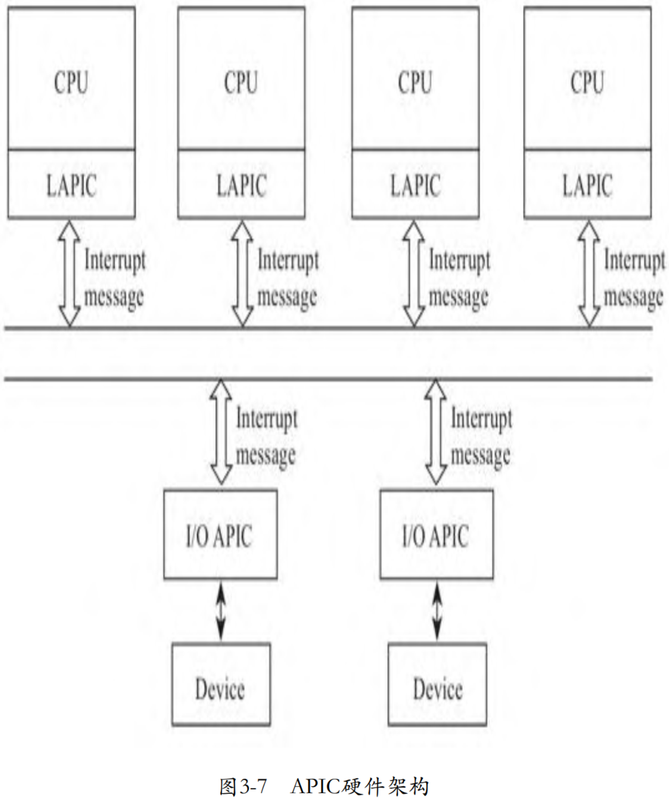
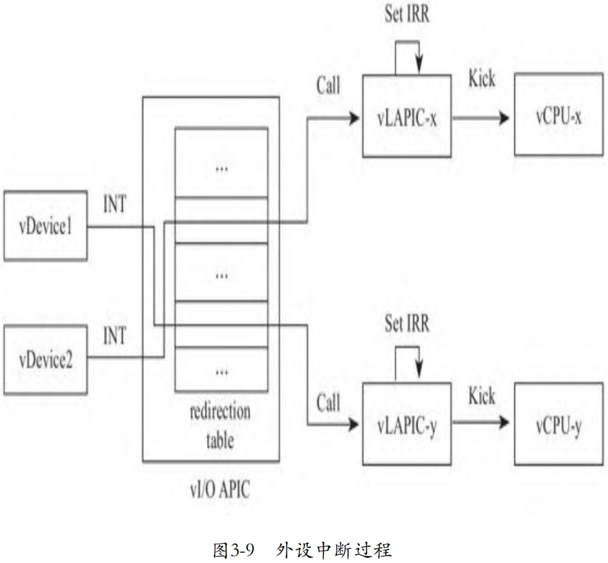
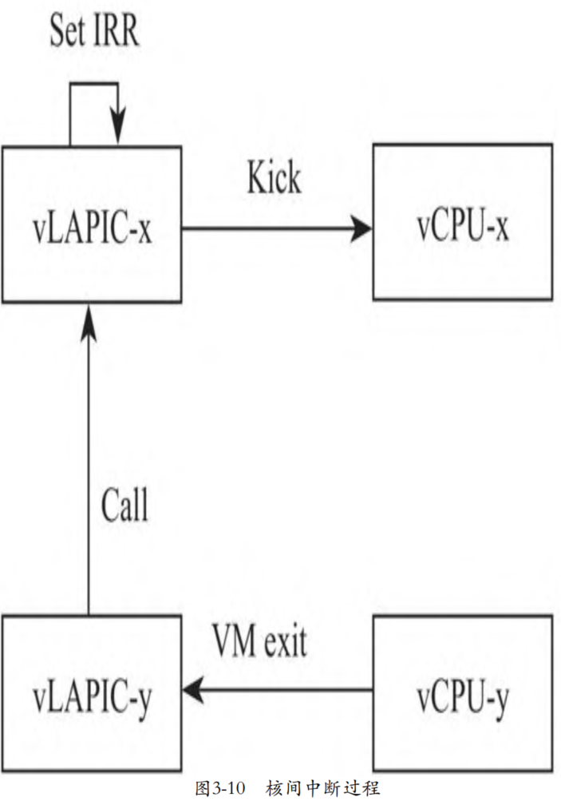
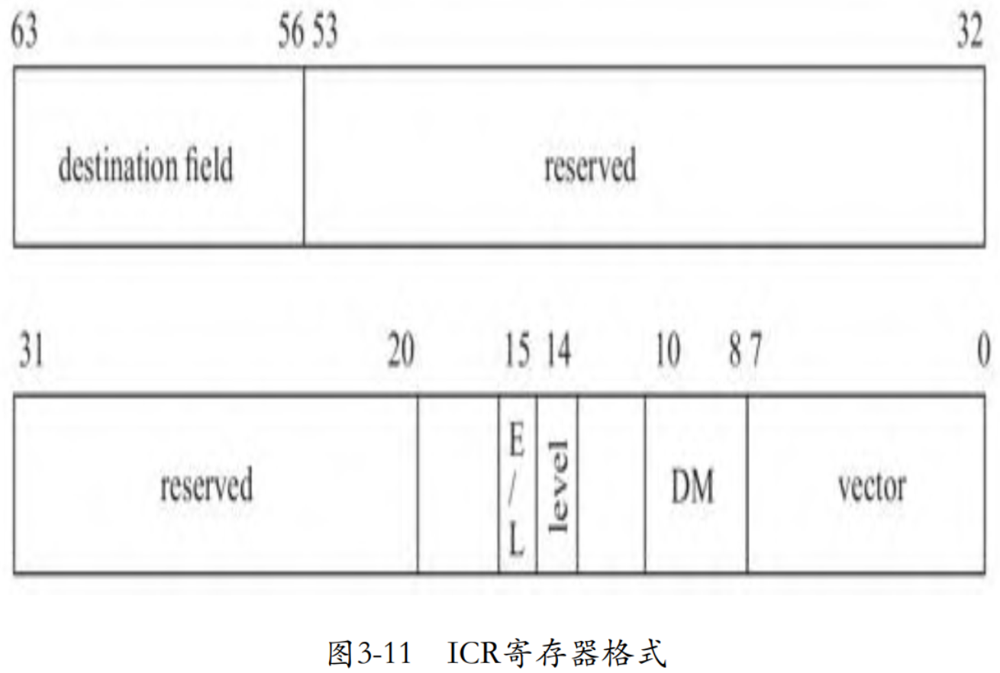

随着多核系统的出现, 8259A 不再能满足需求了. 8259A 只有一个 INTR 和 INTA 管脚, 如果将其用在多处理器系统上, 那么当中断发生时, 中断将始终只能发送给一个处理器, 并不能利用多处理器并发的优势. 而且, **CPU 之间**也需要发送**中断**. 于是, 随着多处理器系统的出现, 为了充分利用多处理器的并行能力, Intel 为 SMP 系统设计了 APIC(`Advanced Programmable Interrupt Controller`), 其可以将接收到的**中断按需分发**给**不同的处理器**进行处理. 比如对于一个支持**多队列的网卡**而言, 其可以将网卡的**每个队列**的**中断**发送给**不同的 CPU**, 从而提高中断处理能力, 提高网络吞吐. APIC 的架构如下图所示.



APIC 包含两个部分: LAPIC 和 I/O APIC.

* LAPIC 即 local APIC, 位于处理器一侧, 除接收来自 I/O APIC 的中断外, 还用于处理器之间发送**核间中断**IPI(`Inter Processor Interrupt`);

* I/O APIC 一般位于南桥芯片上, 响应来自外部设备的中断, 并将中断发送给 LAPIC, 然后由 LAPIC 发送给对应的 CPU.

* I/O APIC 和 LAPIC 之间通过**总线**的方式通信, 最初通过**专用的总线**连接, 后来直接使用了**系统总线**, 每增加一颗核, 只是在总线上多挂一个 LAPIC 而已, 不再受管脚数量的约束.

当 I/O APIC 收到设备的中断请求时, 通过寄存器决定将中断发送给哪个 LAPIC(CPU). I/O APIC 的寄存器如下表所示.


其中, 地址 0x10 到 0x3F 处, 有 24 个 64 位的寄存器, 对应着 I/O APIC 的 24 个 I/O APIC 的中断管脚, 其中记录着管脚相关的中断信息. 这 24 个 64 位寄存器组成了**中断重定向表**(`Redirection Table`), 每个表项的格式如图所示.


其中 destination 表示中断发送**目标 CPU**, 目标 CPU 可能是**一个**, 也可能是**一组**, 我们在设置中断负载均衡(中断亲和性)时, 设置的就是 destination 字段. 另外一个重要的字段就是 interrupt vector, 这个在讨论 PIC 时我们已经介绍了, 就是中断向量, 用于在 IDT 中索引中断服务程序. 重定向表使用管脚号作为索引, 比如说接在 IR0 号管脚的对应于第 1 个重定向表项. 当中断发生时, `I/O APIC` 将查询这个重定向表, 将中断发往操作系统预先设置的目的 CPU. 操作系统内核初始化时会对 I/O APIC 编程, 设置重定向表的各个表项. 当然也可以在**系统运行时**设置, 通过 proc 文件系统设置中断的亲和性(affinity)时, 也会更新重定向表.

# 外设中断过程

* **外设**通过调用**虚拟 I/O APIC** 对外提供的**接口**向其**发送中断请求**.

* 在收到外设的中断请求后, **虚拟 I/O APIC** 将以**中断请求号**为**索引**, **查询**中断重定向表, 根据**中断重定向表**决定将中断分发给**哪个或哪些 CPU**.

* 确定了**目标 CPU** 后, 向目标 CPU 对应的**虚拟 LAPIC** 转发中断请求. 虚拟 LAPIC 也对外提供了接口, 供虚拟 I/O APIC 向其发送中断.

* **虚拟 LAPIC** 与虚拟 PIC 非常相似, 当收到来自虚拟 I/O APIC 转发过来的中断请求后, 其首先设置 **IRR** 寄存器, 然后或者**唤醒**正在睡眠的 **VCPU**, 或者触发正在运行的 **Guest** 退出到 **Host** 模式, 然后在**下一次 VM entry** 时评估虚拟 LAPIC 中的中断, 执行**注入**过程, 整个过程如下图所示.



## 中断重定向表

当 **I/O APIC** 的**某一个管脚**收到来自**设备**的**中断**信号时, I/O APIC 需要**查询中断重定向表**, 确定管脚的中断请求对应的**中断向量**, 以及需要发送给**哪个或哪些 CPU**.

那么谁来负责**填充这个表格**呢? 显然是 **I/O APIC 的驱动**.

* 在**系统初始化**时, **内核**将调用 I/O APIC 的 API 设置中断重定向表.

* 除了初始化时设置 I/O APIC 的中断重定向表外, 用户也会在系统启动后**动态**地**设置中断重定向表**, 比如典型的一个应用, 在服务器启动后, 用户会通过内核 **proc** 提供的接口将**多队列网卡**的每个队列的**中断**分别绑定一颗 **CPU**, 即设置网卡的中断亲和性. proc 中的接口通过调用 I/O APIC 模块的接口更新中断重定向表.

下面就是 **Guest** 内核填充重定向表的相关代码:

```cpp
commit 1fd4f2a5ed8f80cf6e23d2bdf78554f6a1ac7997
KVM: In-kernel I/O APIC model
linux.git/arch/x86/kernel/io_apic_64.c

static void
__ioapic_write_entry(int apic, int pin, struct IO_APIC_route_entry e)
{
    union entry_union eu;
    eu.entry = e;
    io_apic_write(apic, 0x11 + 2*pin, eu.w2);
    io_apic_write(apic, 0x10 + 2*pin, eu.w1);
}

static inline void io_apic_write(unsigned int apic, unsigned int reg, unsigned int value)
{
    struct io_apic __iomem *io_apic = io_apic_base(apic);
    writel(reg, &io_apic->index);
    writel(value, &io_apic->data);
}
```

函数 `io_apic_write` 的第 2 个参数是寄存器地址(相对于基址的偏移), 第 3 个参数相当于写入的内容, `eu.w1` 为 entry 的低 32 位, `eu.w2` 为 entry 的高 32 位. 0x10 正是 I/O APIC 重定向表开始的地方, 对于第 1 个管脚, pin 值为 0, 0x10、0x11 恰好是第 1 个 entry; 对于第 2 个管脚, pin 值为 1, 0x12、0x13 对应第 2 个 entry, 以此类推.

I/O APIC 的**中断重定向表**中的**这些 entry**, 或者说**寄存器**, 都是**间接访问**的. 这些寄存器并不允许外部直接访问, 而是需要通过其他寄存器来间接访问. 这 2 个寄存器是 **IOREGSEL**(`I/O Register Select`)和 **IOWIN**(`I/O Window`), 它们通过**内存映射**的方式映射到 CPU 的**地址空间**, 处理器可以直接访问. 其中 **IOREGSEL** 用来**指定**访问的**目标寄存器**, 比如说, 在向 IOREGSEL 写入 0x10 后, 接下来向寄存器 **IOWIN** 写入的值将被写到中断重定向表的第 1 个 entry 的低 32 位, 因为地址 0x10 是中断重定向表的第 1 个 entry 的低 32 位的地址. 上面的代码中, `io_apic->index` 对应的就是寄存器 IOREGSEL, `io_apic-＞data` 对应的就是寄存器 IOWIN.

**虚拟 I/O APIC** 收到 **Guest** 内核 I/O APIC 填充**中断重定向表**的请求后, 将中断向量、目标CPU、触发模式等中断信息记录到中断重定向表中, 相关代码如下:

```cpp
commit 1fd4f2a5ed8f80cf6e23d2bdf78554f6a1ac7997
KVM: In-kernel I/O APIC model
linux.git/drivers/kvm/ioapic.c
static void ioapic_mmio_write(struct kvm_io_device *this, gpa_t addr, int len,
                  const void *val)
{
    ...
    switch (addr) {
    case IOAPIC_REG_SELECT:
        ioapic->ioregsel = data;
        break;

    case IOAPIC_REG_WINDOW:
        ioapic_write_indirect(ioapic, data);
        break;
    ...
    }
}

static void ioapic_write_indirect(struct kvm_ioapic *ioapic, u32 val)
{
    unsigned index;

    switch (ioapic->ioregsel) {
    case IOAPIC_REG_VERSION:
        /* Writes are ignored. */
        break;
    ...
    default:
        index = (ioapic->ioregsel - 0x10) >> 1;
        ...
        if (ioapic->ioregsel & 1) {
            ioapic->redirtbl[index].bits &= 0xffffffff;
            ioapic->redirtbl[index].bits |= (u64) val << 32;
        } else {
            ...
        }
        ...
    }
}
```

## 中断过程

虚拟 I/O APIC 将对外提供向其发送中断申请的接口, 虚拟设备通过虚拟 I/O APIC 提供的对外接口向 I/O APIC 发送中断请求. **虚拟 I/O APIC** 收到虚拟设备的中断请求后, 以**管脚号**为索引, 从中断重定表中索引具体的表项, 从表项中提取中断向量、目的CPU、触发模式等, 然后将这些信息分发给目的 CPU, 当然了, 本质上是分发给目的 CPU 对应的**虚拟 LAPIC**. 类似的, 虚拟 LAPIC 也对外提供了接口, 供虚拟 I/O APIC 或者其他虚拟 LAPIC 调用. 虚拟 LAPIC 与虚拟 PIC 的逻辑基本完全相同, 通过寄存器记录中断的状态、实现向 Guest 的中断注入等.

对于**在用户空间虚拟的设备**, 将通过 **ioctl** 接口向内核中的 KVM 模块发送 `KVM_IRQ_LINE` 请求:

```cpp
commit 8b1ff07e1f5e4f685492de9b34bec25662ae57cb
kvm: Virtio block device emulation
kvmtool.git/blk-virtio.c
static bool blk_virtio_out(struct kvm *self, uint16_t port, void *data, int size, uint32_t count)
{
    ...
    case VIRTIO_PCI_QUEUE_NOTIFY: {
        kvm__irq_line(self, VIRTIO_BLK_IRQ, 1);
        return true;
    }
    ...
}

kvmtool.git/kvm.c
void kvm__irq_line(struct kvm *self, int irq, int level)
{
    struct kvm_irq_level irq_level;

    irq_level	= (struct kvm_irq_level) {
        {
            .irq		= irq,
        },
        .level		= level,
    };

    if (ioctl(self->vm_fd, KVM_IRQ_LINE, &irq_level) < 0)
        die_perror("KVM_IRQ_LINE failed");
}
```

**虚拟 APIC 处理中断**的代码如下:

```cpp
commit 1fd4f2a5ed8f80cf6e23d2bdf78554f6a1ac7997
KVM: In-kernel I/O APIC model

linux.git/drivers/kvm/kvm_main.c
static long kvm_vm_ioctl(struct file *filp,
               unsigned int ioctl, unsigned long arg)
{
    ...
    switch (ioctl) {
    ...
    case KVM_IRQ_LINE: {
        ...
        if (irqchip_in_kernel(kvm)) {
            if (irq_event.irq < 16)
                kvm_pic_set_irq(pic_irqchip(kvm),
                    irq_event.irq,
                    irq_event.level);
            // 向虚拟ioapic发送中断请求
            kvm_ioapic_set_irq(kvm->vioapic,
                    irq_event.irq,
                    irq_event.level);
            r = 0;
        }
        break;
    }
    ...
}

linux.git/drivers/kvm/ioapic.c
static void ioapic_deliver(struct kvm_ioapic *ioapic, int irq)
{
    // 从中断重定向表中查询具体的信息
    // 
    u8 dest = ioapic->redirtbl[irq].fields.dest_id;
    u8 dest_mode = ioapic->redirtbl[irq].fields.dest_mode;
    // 发送模式
    u8 delivery_mode = ioapic->redirtbl[irq].fields.delivery_mode;
    // 中断号
    u8 vector = ioapic->redirtbl[irq].fields.vector;
    ...
    // 不同发送方式
    switch (delivery_mode) {
    // 
    case dest_LowestPrio:
        // 确定最终的目的CPU
        target =
            kvm_apic_round_robin(ioapic->kvm, vector, deliver_bitmask);
        if (target != NULL)
            ioapic_inj_irq(ioapic, target, vector,
                       trig_mode, delivery_mode);
    ...
    case dest_Fixed:
    ...
    }
    ...
}

static void ioapic_inj_irq(...)
{
    ...
    // 注入中断
    kvm_apic_set_irq(target, vector, trig_mode);
}
```

KVM 模块收到来自用户空间的模拟设备的请求后, 将调用**虚拟 I/O APIC** 的接口 `kvm_ioapic_set_irq` 向虚拟 `I/O APIC` **发送中断请求**. 对于在**内核空间虚拟的设备**, 直接调用虚拟 `I/O APIC` 的这个接口 `kvm_ioapic_set_irq` 即可. 这个过程相当于**物理设备**通过**管脚**向 I/O APIC 设备发送**中断**请求.

**虚拟 I/O APIC** 收到中断请求后, 以**管脚号**为索引, 从**中断重定向表**中索引具体的表项, 从表项中查询具体的信息, 包括这个外设对应的中断号 vector、目的CPU、发送模式等.

I/O APIC 支持**多种发送模式**(Delivery Mode), 包括 LowestPrio 模式, 以及Fixed模式. 根据不同的模式, I/O APIC 将会从目的 CPU 列表中选择最终的目的 CPU.

确定了目的 CPU 后, 虚拟 I/O APIC 调用虚拟 LAPIC 的接口 `kvm_apic_set_irq` 向 Guest 注入中断. 虚拟 LAPIC 向 Guest 注入中断的过程和前面讨论的虚拟 PIC 的机制本质上完全相同, 我们简单回顾一下, 当 8259A 收到外设发起中断, 其首先在 IRR 寄存器中记录下来, 然后再设置一个变量 output 表示有 pending 的中断, 在下一次 VM entry 时, KVM 发起中断评估等一系列过程, 最终将中断信息写入 VMCS 中的字段 `VM-entry interruptioninformation`. 另外, 因为目的 CPU 可能正处于 Guest 模式, 或者承载 VCPU 的线程正处于睡眠状态, 为减少中断延迟, 需要虚拟 LAPIC "踢" 一下目标 VCPU, 要么将其从 Guest 模式踢出到 Host 模式, 要么唤醒挂起的 VCPU 线程, 代码如下:

```cpp
commit 1fd4f2a5ed8f80cf6e23d2bdf78554f6a1ac7997
KVM: In-kernel I/O APIC model

linux.git/drivers/kvm/lapic.c

int kvm_apic_set_irq(struct kvm_lapic *apic, u8 vec, u8 trig)
{
    if (!apic_test_and_set_irr(vec, apic)) {
        /* a new pending irq is set in IRR */
        if (trig)
            apic_set_vector(vec, apic->regs + APIC_TMR);
        else
            apic_clear_vector(vec, apic->regs + APIC_TMR);
        kvm_vcpu_kick(apic->vcpu);
        return 1;
    }
    return 0;
}
```

# 核间中断过程

LAPIC 有 1 个 4KB 大小的页面, Intel 称之为 APIC page, LAPIC 的所有寄存器都存储在这个页面上. Linux 内核将 APIC page 映射到内核空间, 通过 MMIO 的方式访问这些寄存器, 当内核访问这些寄存器时, 将触发 Guest 退出到 Host 的 KVM 模块中的虚拟 LAPIC. 当 Guest 发送核间中断时, 虚拟 LAPIC 确定目的 CPU, 向目的 CPU 发送核间中断, 当然, 这个过程实际上是向目的 CPU 对应的虚拟 LAPIC 发送核间中断, 最后由目标虚拟 LAPIC 完成向 Guest 的中断注入过程, 如图所示.



当 Guest 通过 MMIO 方式写 LAPIC 的寄存器时, 将导致 VM exit, 从而进入 KVM 中的虚拟 LAPIC. 虚拟 LAPIC 的处理函数为 `apic_mmio_write`:

```cpp
commit 97222cc8316328965851ed28d23f6b64b4c912d2
KVM: Emulate local APIC in kernel
linux.git/drivers/kvm/lapic.c
static void apic_mmio_write(...)
{
    ...
    switch (offset) {
    ...
    case APIC_ICR:
        /* No delay here, so we always clear the pending bit */
        apic_set_reg(apic, APIC_ICR, val & ~(1 << 12));
        apic_send_ipi(apic);
        break;

    case APIC_ICR2:
        apic_set_reg(apic, APIC_ICR2, val & 0xff000000);
        break;
    ...
}

static void apic_send_ipi(struct kvm_lapic *apic)
{
    u32 icr_low = apic_get_reg(apic, APIC_ICR);
    u32 icr_high = apic_get_reg(apic, APIC_ICR2);
    unsigned int dest = GET_APIC_DEST_FIELD(icr_high);
    ...
    for (i = 0; i < KVM_MAX_VCPUS; i++) {
        vcpu = apic->vcpu->kvm->vcpus[i];
        ...
        if (vcpu->apic &&
            apic_match_dest(vcpu, apic, short_hand, dest, dest_mode)) {
            if (delivery_mode == APIC_DM_LOWEST)
                ...
            else
                __apic_accept_irq(vcpu->apic, delivery_mode,
                          vector, level, trig_mode);
        }
    }
}
```

当 Guest 写的是 LAPIC 的 ICR 寄存器时, 表明这个 CPU 向另外一个 CPU 发送核间中断. ICR 寄存器长度为 64 位, 其第 56~63 位存储目标 CPU, 上面的代码中, `APIC_ICR2` 对应的是 ICR 寄存器的高 32 位, 当 Guest写ICR寄存器的高32位时, 虚拟 LAPIC 只是记下目标 CPU 的 ID, 实际上是目标 CPU 关联的 LAPIC 的 ID. 当 Guest 写 ICR 寄存器的低 32 位才会触发虚拟 LAPIC 向目标 CPU 发送核间中断. ICR 寄存器的格式如图所示.



当 Guest 写寄存器 ICR 的低 32 位时, 将触发 LAPIC 向目标 CPU 发送核间中断, 代码中对应的函数是 `apic_send_ipi`. 函数 `apic_send_ipi` 首先从寄存器 ICR 中读取目标 CPU, 然后遍历虚拟机的所有 VCPU, 如果有 VCPU 匹配成功, 则向其发送 IPI 中断, 目标 LAPIC 调用函数 `__apic_accept_irq` 接收中断:

```cpp
commit 97222cc8316328965851ed28d23f6b64b4c912d2
KVM: Emulate local APIC in kernel
linux.git/drivers/kvm/lapic.c
static int __apic_accept_irq(struct kvm_lapic *apic, int delivery_mode,
                 int vector, int level, int trig_mode)
{
    ...
    switch (delivery_mode) {
    case APIC_DM_FIXED:
    case APIC_DM_LOWEST:
    ...
        kvm_vcpu_kick(apic->vcpu);
    ...
}
```

函数 `__apic_accept_irq` 的实现与虚拟LAPIC对外提供的接口 `kvm_apic_set_irq` 的实现几乎完全相同, 其首先在 IRR 寄存器中记录下中断信息, 因为目标 CPU 可能正处于 Guest 模式, 或者承载 VCPU 的线程正处于睡眠状态, 为减少中断延迟, 需要虚拟 LAPIC "踢" 一下目标 VCPU, 要么将其从 Guest 模式踢出到 Host 模式, 要么唤醒挂起的 VCPU 线程. 在下一次 VM entry 时, KVM 发起中断评估等一系列过程, 最终将中断信息写入 VMCS 中的字段 `VM-entry interruption-information`.

# IRQ routing

在加入 APIC 的虚拟后, 当外设发送中断请求后, 那么 KVM 模块究竟是通过 8259A, 还是通过 APIC 向 Guest 注入中断呢? 我们看看 KVM 模块最初是如何处理的:

```cpp
commit 1fd4f2a5ed8f80cf6e23d2bdf78554f6a1ac7997
KVM: In-kernel I/O APIC model
linux.git/drivers/kvm/kvm_main.c
static long kvm_vm_ioctl(...)
{
    ...
    case KVM_IRQ_LINE: {
        ...
        if (irqchip_in_kernel(kvm)) {
            if (irq_event.irq < 16)
                kvm_pic_set_irq(pic_irqchip(kvm),
                    irq_event.irq,
                    irq_event.level);
            ...
        }
        break;
    }
}
```

我们看到, 当**管脚号小于 16** 时, 同时调用 **8259A** 的接口 `kvm_pic_set_irq` 和 **I/O APIC** 的接口 `kvm_ioapic_set_irq`. 这是因为 8259A 和 APIC 都支持小于 16 号的中断, 但是 KVM 并不清楚 Guest 系统支持的是 8259A 还是 APIC, 所以索性两个虚拟芯片都进行调用. 后面 Guest 支持哪个芯片, Guest 就与哪个芯片继续交互.

显然这不是一个合理的实现, 尤其是后面还要加入**其他的中断方式**, 比如接下来的 **MSI** 方式. 因此, KVM 的开发者将代码重构了一下, 设计了 **IRQ routing** 方案, 因代码变化较大, 为了避免读者读起来感到困惑, 我们简要介绍一下这种方案. IRQ routing 包含一个表, 表格中的**每一项**的结构如下:

```cpp
commit 399ec807ddc38ecccf8c06dbde04531cbdc63e11
KVM: Userspace controlled irq routing
linux.git/include/linux/kvm_host.h
struct kvm_kernel_irq_routing_entry {
    u32 gsi;
    void (*set)(struct kvm_kernel_irq_routing_entry *e,
            struct kvm *kvm, int level);
    union {
        struct {
            unsigned irqchip;
            unsigned pin;
        } irqchip;
    };
    struct list_head link;
};
```

其中有 2 个关键变量, 1 个是 **gsi**, 可以理解为**管脚号**, 比如IR0、IR1等等, 第 2 个就是**函数指针** `set`. 当一个外设请求到来时, KVM 遍历这个表格, 匹配 gsi, 如果成功匹配, 则调用函数指针 set 指向的函数, 负责注入中断. 对于使用 PIC 的外设, set 指向虚拟 PIC 对外提供的发送中断的接口; 对于使用 API C的外设, set 指向虚拟 I/O APIC 对外提供的发送中断的接口; 对于支持并启用了 MSI 的外设, set 则指向为 MSI 实现的发送中断的接口. 当 KVM 收到设备发来的中断时, 不再区分 PIC、APIC 还是 MSI, 而是调用一个**统一的接口** `kvm_set_irq`, 该函数**遍历 IRQ routing 表**中的每一个表项, 调用匹配的每个 entry 的 set 指向的函数发起中断, 如此就实现了代码统一:

```cpp
commit 399ec807ddc38ecccf8c06dbde04531cbdc63e11
KVM: Userspace controlled irq routing
linux.git/arch/x86/kvm/x86.c
long kvm_arch_vm_ioctl(...)
{
    ...
    case KVM_IRQ_LINE: {
        ...
        if (irqchip_in_kernel(kvm)) {
            kvm_set_irq(kvm, KVM_USERSPACE_IRQ_SOURCE_ID,
                    irq_event.irq, irq_event.level);
        }
    }
    ...
}

linux.git/virt/kvm/irq_comm.c
void kvm_set_irq(struct kvm *kvm, int irq_source_id, int irq, int level)
{
    ...
    // 遍历 IRQ routing 表
    list_for_each_entry(e, &kvm->irq_routing, link)
        if (e->gsi == irq)
            e->set(e, kvm, !!(*irq_state));
}
```

当创建内核中的虚拟中断芯片时, 虚拟中断芯片会创建一个默认的表格. KVM 为用户空间提供 API 以设置这个表格, 用户空间的虚拟设备可以按需增加这个表格的表项. 之前我们看到, 因为不清楚 Guest 支持 PIC 还是 APIC, 所以对于管脚号小于 16 的, 既调用了 8259A 注入接口, 又调用了 APIC 的注入接口. 根据新的数据结构, 在这个表格中, 每个小于 16 的管脚会创建两个 entry, 其中 1 个 entry 的函数指针 set 指向 8259A 提供的中断注入接口, 另外一个 entry 的函数指针 set 指向 APIC 提供的中断注入接口, 见下面 `default_routing` 的定义:

```cpp
commit 399ec807ddc38ecccf8c06dbde04531cbdc63e11
KVM: Userspace controlled irq routing

linux.git/virt/kvm/irq_comm.c

#define ROUTING_ENTRY1(irq) IOAPIC_ROUTING_ENTRY(irq)
#ifdef CONFIG_X86
#  define ROUTING_ENTRY2(irq) \
    IOAPIC_ROUTING_ENTRY(irq), PIC_ROUTING_ENTRY(irq)
#else
#  define ROUTING_ENTRY2(irq) \
    IOAPIC_ROUTING_ENTRY(irq)
#endif

static const struct kvm_irq_routing_entry default_routing[] = {
    ROUTING_ENTRY2(0), ROUTING_ENTRY2(1),
    ...
    ROUTING_ENTRY1(16), ROUTING_ENTRY1(17),
    ...
};
```

宏定义 `IOAPIC_ROUTING_ENTRY` 和 `PIC_ROUTING_ENTRY` 创建结构体 `kvm_irq_routing_entry` 中的 entry, 分别对应 APIC 和 PIC. 可以看到, 当管脚号小于 16 时, 在表格中为每个管脚创建了 2 个表项, 一个是 APIC 的表项, 另外一个是 PIC 的表项. 当管脚号大于 16 时, 只创建一个 APIC 的表项. 根据创建具体表项的函数 `setup_routing_entry` 可见, 如果中断芯片是 PIC, 则函数指针 set 指向 8259A 的接口 `kvm_pic_set_irq`, 如果中断芯片是 I/O APIC, 则函数指针 set 指向 I/O APIC 的接口 `kvm_ioapic_set_irq`:

```cpp
commit 399ec807ddc38ecccf8c06dbde04531cbdc63e11
KVM: Userspace controlled irq routing

linux.git/virt/kvm/irq_comm.c
int setup_routing_entry(...)
{
    ...
    switch (ue->type) {
    case KVM_IRQ_ROUTING_IRQCHIP:
        delta = 0;
        switch (ue->u.irqchip.irqchip) {
        case KVM_IRQCHIP_PIC_MASTER:
            e->set = kvm_set_pic_irq;
        ...
        case KVM_IRQCHIP_IOAPIC:
                e->set = kvm_set_ioapic_irq;
        ...
out:
    return r;
}
```