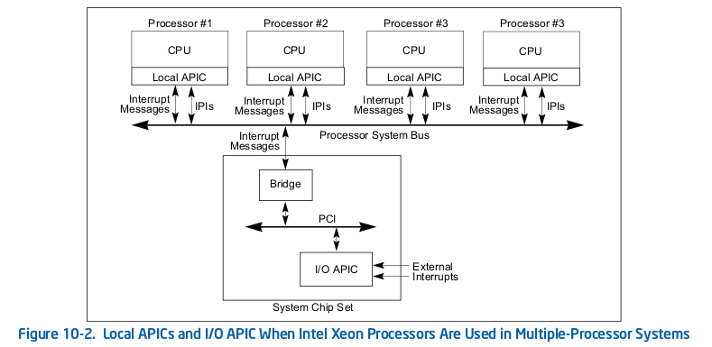

<!-- @import "[TOC]" {cmd="toc" depthFrom=1 depthTo=6 orderedList=false} -->

<!-- code_chunk_output -->

- [中断控制器的创建和初始化](#中断控制器的创建和初始化)
  - [中断控制器的创建](#中断控制器的创建)
  - [用户态和内核态的中断关联](#用户态和内核态的中断关联)
  - [中断路由](#中断路由)
  - [中断路由表](#中断路由表)
  - [中断路由项](#中断路由项)
- [参考](#参考)

<!-- /code_chunk_output -->


# 中断控制器的创建和初始化

考虑到中断实时性对性能的影响, **PIC 和 IOAPIC**的**设备模拟主要逻辑**都放到了**kvm 模块**进行实现, **每个 VCPU**的**LAPIC**则**完全放到 kvm**中进行实现.

**i8259 控制器**和**IOAPIC**的创建和初始化由**qemu 和 kvm 配合完成**, 包括了 2 个方面:

- **kvm**中**设备相关数据结构初始化**
- **qemu 中设备模拟的初始化**

## 中断控制器的创建

qemu 代码中中断控制器的 kvm 内核初始化流程为:

```cpp
configure_accelerator
    |--> accel_init_machine
        |--> kvm_init
            |--> kvm_irqchip_create
                |--> kvm_vm_ioctl(s, KVM_CREATE_IRQCHIP)
                |--> kvm_init_irq_routing
```

qemu 通过 kvm 的 ioctl 命令`KVM_CREATE_IRQCHIP`调用到 kvm 内核模块中, 在内核模块中创建和初始化 PIC/IOAPIC 设备(创建设备对应的数据结构并将设备注册到总线上).

```cpp
kvm_arch_vm_ioctl(s, KVM_CREATE_IRQCHIP)
    |--> kvm_pic_init                    /* i8259 初始化 */
    |--> kvm_ioapic_init                 /* ioapic 初始化 */
    |--> kvm_setup_default_irq_routing   /* 初始化缺省的 IRE */
```

这一步详见 KVM

qemu 在 kvm 内核中创建完成 PIC 和 IOAPIC 后将全局变量`kvm_kernel_irqchip`置为**true**, kvm 模块则将`kvm->arch.irqchip_mode` 赋值为 `KVM_IRQCHIP_KERNEL`, 这样后面的`kvm_irqchip_in_kernel`返回 true 表示**pic 芯片**放到**kvm 内核模块**中实现, `kvm_ioapic_in_kernel`也返回 true 表示 ioapic 放到 kvm 中来模拟.

**中断处理的逻辑**放在**kvm 内核模块**中进行实现, 但**设备的模拟**呈现还是需要**qemu 设备模拟器**来搞定, 最后 qemu 和 kvm 一起配合完成快速中断处理的流程.

i8259 的设备创建流程(pic 还是传统的 isa 设备, 中断是边沿触发的, master 的 i/o port 为 0x20,0x21 slave 的 i/o port 为 0xa0,0xa1):

```cpp
machine_run_board_init
    |--> pc_init1
        |--> if (kvm_pic_in_kernel())
            |--> kvm_i8259_init
                |--> isadev = isa_create(bus, name)
```

ioapic 的设备创建流程:

```cpp
machine_run_board_init
    |--> pc_init1
        |--> if (pcmc->pci_enabled)
            |--> ioapic_init_gsi(gsi_state, "i440fx")
                |--> if kvm_ioapic_in_kernel()
                    |--> dev = qdev_create(NULL, "kvm-ioapic")
```

PIC 由**2 个 i8259**进行"级联", 一个为 master 一个为 slave, **每个 i8259**有**8 个 PIN**(**salve**的**INT 输出线**连接到**master**的**IRQ2 引脚**上,所以实际可用的**IRQ 数目为 15**). 目前 kvm 只为**虚拟机**创建**一个 ioapic 设备**(现在多路服务器可能有多个 ioapic 设备), **ioapic 设备**提供**24 个 PIN**给**外部中断**使用. 在 IRQ 路由上 `0-15` 号 GSI 为**PIC 和 IOAPIC 共用的**, `16-23`号 GSI 则都**分配给 ioapic**.

几个概念要理清楚: IRQ 号, 中断向量和 GSI.

- IRQ 号是 PIC 时代引入的概念,由于 ISA 设备通常是直接连接到到固定的引脚, 所以对于 IRQ 号描述了设备连接到了 PIC 的哪个引脚上, 同 IRQ 号直接和中断优先级相关,例如 IRQ0 比 IRQ3 的中断优先级更高.
- GSI 号是 ACPI 引入的概念, 全称是 Global System Interrupt, 用于为系统中每个中断源指定一个唯一的中断编号. 注: ACPI Spec 规定 PIC 的 IRQ 号必须对应到 GSI0-GSI15 上. kvm 默认支持最大 1024 个 GSI.
- 中断向量是针对逻辑 CPU 的概念, 用来表示中断在 IDT 表的索引号, 每个 IRQ(或者 GSI)最后都会被定向到某个 Vecotor 上. 对于 PIC 上的中断, 中断向量 = 32(start vector) + IRQ 号. 在 IOAPIC 上的中断被分配的中断向量则是由操作系统分配.

PIC 主要针对与传统的单核处理器体系结构, 在 SMP 系统上则是通过 IOAPIC 和每个 CPU 内部的 LAPIC 来构成整个中断系统的.



如上图所描述, IOAPIC 负责接受中断并将中断格式化化成中断消息, 并按照一定规则转发给 LAPIC. LAPIC 内部有 IRR(Interrupt Reguest Register)和 ISR(Interrupt Service Register)等 2 个重要寄存器. 系统在处理一个 vector 的同时缓存着一个相同的 vector, vector 通过 2 个 256-bit 寄存器标志, 对应位置位则表示上报了 vector 请求或者正在处理中. 另外 LAPIC 提供了 TPR(Task Priority Register), PPR(Processor Priority Register)来设置 LAPIC 的 task 优先级和 CPU 的优先级, 当 IOAPIC 转发的终端 vector 优先级小于 LAPIC 设置的 TPR 时, 此中断不能打断当前 cpu 上运行的 task; 当中断 vector 的优先级小于 LAPIC 设置的 PPR 时此 cpu 不处理这个中断. 操作系统通过动态设置 TPR 和 PPR 来实现系统的实时性需求和中断负载均衡.

值得一提的是 qemu 中为了记录 pic 和 ioapic 的中断处理回调函数, 定义了一个 GSIState 类型的结构体:

```cpp
typedef struct GSIState {
    qemu_irq i8259_irq[ISA_NUM_IRQS];
    qemu_irq ioapic_irq[IOAPIC_NUM_PINS];
} GSIState;
```

在 qemu 主板初始化逻辑函数 pc_init1 中会分别分配 ioapic 和 pic 的 qemu_irq 并初始化注册 handler. ioapic 注册的 handler 为 kvm_pc_gsi_handler 函数 opaque 参数为 qdev_get_gpio_in,pic 注册的 handler 为 kvm_pic_set_irq. 这 2 个 handler 是 qemu 模拟中断的关键入口, 后面我们会对其进行分析.

## 用户态和内核态的中断关联

qemu 中尽管对中断控制器进行了模拟, 但只是搭建了一个空架子, 如果高效快速工作起来还需要 qemu 用户态和 kvm 内核的数据关联才能实现整个高效的中断框架.

IOAPIC 为了实现中断路由(Interrupt Routing)会维护一个中断路由表信息, 下面看下 kvm 内核模块中几个重要的数据结构.

## 中断路由

用来记录中断路由信息的数据结构.

```cpp
struct kvm_irq_routing {
    __u32 nr;
    __u32 flags;
    struct kvm_irq_routing_entry entries[0];  /* irq routing entry 数组 */
};
```

## 中断路由表

kvm_irq_routing_table 这个数据结构描述了"每个虚拟机的中断路由表", 对应于 kvm 数据结构的 irq_routing 成员. chip 是个二维数组表示三个中断控制器芯片的每一个管脚(最多 24 个 pin)的 GSI, nr_rt_entries 表示中断路由表中存放的"中断路由项"的数目, 最为关键的 struct hlist_head map[0]是一个哈希链表结构体数组, 数组以 GSI 作为索引可以找到同一个 irq 关联的所有 kvm_kernel_irq_routing_entry(中断路由项).

```cpp
struct kvm_irq_routing_table {
    int chip[KVM_NR_IRQCHIPS][KVM_IRQCHIP_NUM_PINS];
    u32 nr_rt_entries;
    /*
        * Array indexed by gsi. Each entry contains list of irq chips
        * the gsi is connected to.
        */
    struct hlist_head map[0];  /* 哈希表数组 */
};
```

## 中断路由项

gsi 表示这个中断路由项对应的 GSI 号, type 表示该 gsi 的类型取值可以是 KVM_IRQ_ROUTING_IRQCHIP, KVM_IRQ_ROUTING_MSI 等, set 函数指针很重要表示该 gsi 关联的中断触发方法(不同 type 的 GSI 会调用不同的 set 触发函数), hlist_node 则是中断路由表哈希链表的节点, 通过 link 将同一个 gsi 对应的中断路由项链接到 map 对应的 gsi 上.

```cpp
struct kvm_kernel_irq_routing_entry {
    u32 gsi;
    u32 type;
    int (*set)(struct kvm_
    kernel_irq_routing_entry *e,
        struct kvm *kvm, int irq_source_id, int level,
        bool line_status);
    union {
        struct {
            unsigned irqchip;
            unsigned pin;
        } irqchip;
        struct {
            u32 address_lo;
            u32 address_hi;
            u32 data;
            u32 flags;
            u32 devid;
        } msi;
        struct kvm_s390_adapter_int adapter;
        struct kvm_hv_sint hv_sint;
    };
    struct hlist_node link;
};
```

中断路由表的设置在 qemu 中初始化时, 通过调用`kvm_pc_setup_irq_routing`函数来完成.

```cpp
    void kvm_pc_setup_irq_routing(bool pci_enabled)
    {
        KVMState *s = kvm_state;
        int i;

        if (kvm_check_extension(s, KVM_CAP_IRQ_ROUTING)) {
            for (i = 0; i < 8; ++i) {
                if (i == 2) {    /* slave 的 INTR 引脚接入到 master 的 2 号引脚上 */
                    continue;
                }
                kvm_irqchip_add_irq_route(s, i, KVM_IRQCHIP_PIC_MASTER, i);
            }
            for (i = 8; i < 16; ++i) {
                kvm_irqchip_add_irq_route(s, i, KVM_IRQCHIP_PIC_SLAVE, i - 8);
            }
            if (pci_enabled) {
                for (i = 0; i < 24; ++i) {
                    if (i == 0) {
                        kvm_irqchip_add_irq_route(s, i, KVM_IRQCHIP_IOAPIC, 2);
                    } else if (i != 2) {
                        kvm_irqchip_add_irq_route(s, i, KVM_IRQCHIP_IOAPIC, i);
                    }
                }
            }
            kvm_irqchip_commit_routes(s);
        }
    }
```

# 参考

https://luohao-brian.gitbooks.io/interrupt-virtualization/qemu-kvm-zhong-duan-xu-ni-hua-kuang-jia-fen-679028-4e0a29.html