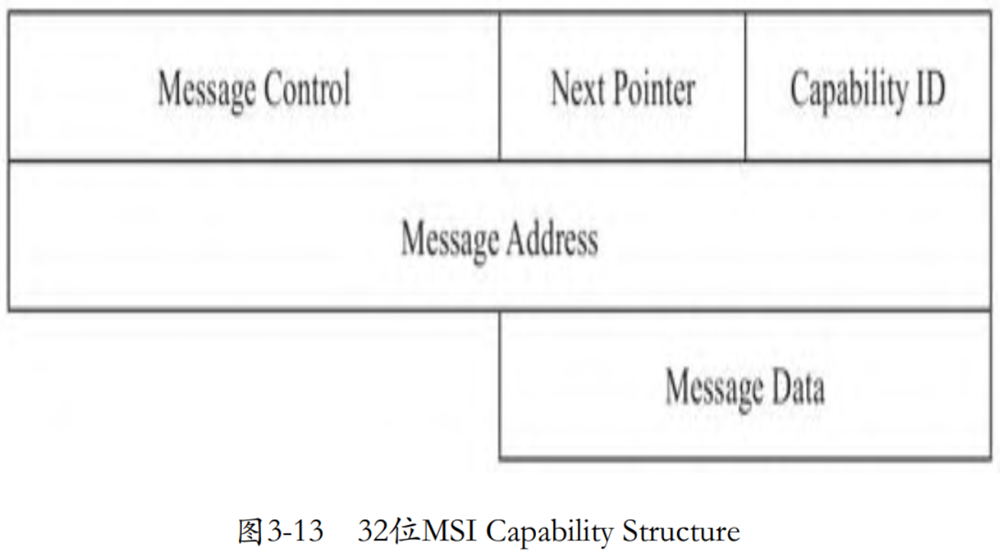

虽然 APIC 相比 PIC 更进了一步, 但是我们看到, 外设发出中断请求后, 需要经过 I/O APIC 才能到达 LAPIC(CPU). 如果中断请求可以从设备直接发送给 LAPIC, 而不是绕道 I/O APIC, 可以大大减少中断处理的延迟. 事实上, 在 1999 年 PCI 2.2 就引入了 MSI. MSI 全称是 Message Signaled Interrupts, 从名字就可以看出, 第 3 代中断技术不再基于管脚, 而是基于消息. 在 PCI 2.2 时, MSI 是设备的一个可选特性, 到了 2004 年, PCIE 规范发布, MSI 就成为了 PCIE 设备强制要求的特性. 在 PCI 3.3 时, 又对 MSI 进行了一定的增强, 称为 MSI-X. 相比 MSI, MSI-X 的每个设备可以支持更多的中断, 并且每个中断可以独立配置.

除了减少中断延迟外, 因为不再存在管脚的概念了, 所以之前因为管脚有限而共享管脚的问题自然就消失了. 之前当某个管脚有信号时, 操作系统需要逐个调用共享这个管脚的中断服务程序去试探是否可以处理这个中断, 直到某个中断服务程序可以正确处理. 同样的道理, 不再受管脚的数量约束, MSI 能够支持的中断数也大大增加了. 支持 MSI 的设备绕过 I/O APIC, 直接与 LAPIC 通过系统总线相连, 如下图所示.


从 PCI 2.1 开始, 如果设备需要扩展某种特性, 可以向配置空间中的 Capabilities List 中增加一个 Capability, MSI 利用的就是这个特性, 将 I/O APIC 中的功能扩展到设备自身. MSI 的 Capability Structure 如图 3-13 所示.



为了支持多个中断, MSI-X 的 Capability Structure 在 MSI 的基础上增加了 table, 其中字段 Table Offset 和 BIR 定义了 table 所在的位置, 其中 BIR 为 BAR Indicator Register, 即指定使用哪个 BAR 寄存器, 然后从指定的这个 BAR 寄存器中取出映射在 CPU 地址空间中的基址, 加上 Table Offset 就定位了 table 的位置, 如下图所示.


当外设准备发送中断消息时, 其将从 Capability Structure 中提取相关信息. 消息地址取自字段 message address, 其中 bits 31-20 是一个固定的值 0FEEH. PCI 总线根据消息地址, 得知这是一个中断消息, 会将其发送给 Host-to-PCI 桥, Host-to-PCI 桥将其发送到目的 CPU(LAPIC). 消息体取自 message data, 主要部分是中断向量.


MSI 中断本质上是一个 memory write, memory write 的地址就是设备配置空间的 MSI address 寄存器的值, memory write 的数据就是设备配置空间的 MSI data 寄存器的值. Message address 寄存器和 message data 寄存器是调用 `pci_enable_msi` 时, 系统软件填入的 (address 和 data 和 CPU 的架构相关, 简单说就是和 CPU 的中断控制器部分相关). 

也就是说, 一个设备想产生一个 MSI 中断话, 只需要使用配置空间的 message address 寄存器和 message data 寄存器发起一个 memory write 请求, 即往 message address 寄存器写入 memory data. 在 X86 系统下, message address 对应的 LAPIC 的地址. 

# MSI(X) Capability 数据结构

在初始化设备时, 如果设备支持 MSI, 并且设备配置为启用 MSI 支持, 则内核中将组织 MSI Capability 数据结构, 然后通过 MMIO 的方式写到 PCI 设备的配置空间中. 内核中的 PCI 公共层为驱动提供了接口 `pci_enable_msix` 配置 MSI Capability 数据结构:

```cpp
commit 82af8ce84ed65d2fb6d8c017d3f2bbbf161061fb
virtio_pci: optional MSI-X support
linux.git/drivers/pci/msi.c
int pci_enable_msix(struct pci_dev* dev, struct msix_entry *entries, int nvec)
{
    ...
    status = pci_msi_check_device(dev, nvec, PCI_CAP_ID_MSIX);
    ...
}

static int msix_capability_init(struct pci_dev *dev,
                struct msix_entry *entries, int nvec)
{
    ...
     pci_read_config_dword(dev, msix_table_offset_reg(pos), &table_offset);
    bir = (u8)(table_offset & PCI_MSIX_FLAGS_BIRMASK);
    table_offset &= ~PCI_MSIX_FLAGS_BIRMASK;
    phys_addr = pci_resource_start (dev, bir) + table_offset;
    base = ioremap_nocache(phys_addr, nr_entries * PCI_MSIX_ENTRY_SIZE);
    ...
    /* MSI-X Table Initialization */
    for (i = 0; i < nvec; i++) {
        entry = alloc_msi_entry(dev);
        ...
        entry->msi_attrib.pos = pos;
        entry->mask_base = base;
        ...
        list_add_tail(&entry->list, &dev->msi_list);
    }

    ret = arch_setup_msi_irqs(dev, nvec, PCI_CAP_ID_MSIX);
    ...
}
```

代码中的变量 bir 和 table_offset 是不是特别熟悉, 没错, 就是 PCI 配置空间 header 中的这两个字段: Table Offset 和 BIR. 根据这两个变量, 内核计算出 table 的位置, 然后将配置空间中 table 所在位置, 通过 iomap 的方式, 映射到 CPU 的地址空间, 后面就可以像访问内存一样直接访问这个 table 了. 然后, 在内存中组织 MSI Capability 数据结构, 最后将组织好的 MSI Capability 数据结构, 包括这个结构映射到地址空间中的位置, 传给体系结构相关的函数 `arch_setup_msi_irqs` 中构建消息, 包括中断向量、目标 CPU、触发模式等, 写入设备的 PCI 配置空间.

当 Guest 内核侧设置设备的 MSI 的 Capability 数据结构, 即写 PCI 设备的配置空间时, 将导致 VM exit, 进入虚拟设备一侧. 虚拟设备将 Guest 内核设置的 MSI 的 Capability 信息记录到设备的 MSI 的 Capability 结构体中. 以虚拟设备 virtio net 为例, 函数 callback_mmio 接收 Guest 内核侧发来的配置信息, 记录到设备的 MSI 的 Capability 数据结构中:

```cpp
commit 3395f880e871c3fdd31f774f93415b1ed38a768b
kvm tools: Add MSI-X support to virtio-net
kvmtool.git/virtio/net.c
void virtio_net__init(const struct virtio_net_parameters *params)
{
    ...
    ndev.msix_io_block = pci_get_io_space_block();
    kvm__register_mmio(params->kvm, ndev.msix_io_block, 0x100, callback_mmio, NULL);
    ...
}

static void callback_mmio(u64 addr, u8 *data, u32 len, u8 is_write, void *ptr)
{
    void *table = pci_header.msix.table;
    if (is_write)
        memcpy(table + addr - ndev.msix_io_block, data, len);
    else
        memcpy(data, table + addr - ndev.msix_io_block, len);
}
```

# 建立 IRQ routing 表项

之前我们看到 KVM 模块为了从架构上统一处理虚拟 PIC、虚拟 APIC 以及虚拟 MSI, 设计了一个 IRQ routing 表. 对于每个中断, 在表格 irq_routing 中都需要建立一个表项, 当中断发生后, 会根据管脚信息, 或者说 gsi, 索引到具体的表项, 提取表项中的中断向量, 调用表项中的函数指针 set 指向的函数发起中断.

所以, 建立好虚拟设备中的 MSI-X Capability Structure 还不够, 还需要将中断的信息补充到负责 IRQ routing 的表中. 当然, 虚拟设备并不能在建立好 MSI-X Capability 后, 就自作主张地发起配置 KVM 模块中的 IRQ routing 表, 而是需要由 Guest 内核的驱动发起这个过程, 以 Virtio 标准为例, 其定义了 `queue_msix_vector` 用于 Guest 内核驱动通知虚拟设备配置 IRQ routing 信息. 以 virtio 驱动为例, 其在配置 virtioqueue 时, 如果确认虚拟设备支持 MSI 并且也启用了 MSI, 则通知虚拟设备建立 IRQ routing 表项:

```cpp
commit 82af8ce84ed65d2fb6d8c017d3f2bbbf161061fb
virtio_pci: optional MSI-X support
linux.git/drivers/virtio/virtio_pci.c
static struct virtqueue *vp_find_vq(...)
{
    ...
    if (callback && vp_dev->msix_enabled) {
        iowrite16(vector, vp_dev->ioaddr + VIRTIO_MSI_QUEUE_VECTOR);
        ...
    }
    ...
}
```

虚拟设备收到 Guest 内核驱动的通知后, 则从 MSI Capability 结构体中提取中断相关信息, 向内核发起请求, 为这个队列建立相应的 IRQ routing 表项

```cpp
commit 3395f880e871c3fdd31f774f93415b1ed38a768b
kvm tools: Add MSI-X support to virtio-net
kvmtool.git/virtio/net.c
static bool virtio_net_pci_io_out(...)
{
    ...
    case VIRTIO_MSI_QUEUE_VECTOR: {
        ...
        gsi = irq__add_msix_route(kvm,
                      pci_header.msix.table[vec].low,
                      pci_header.msix.table[vec].high,
                      pci_header.msix.table[vec].data);
        ...
    }
    ...
}

kvmtool.git/irq.c
int irq__add_msix_route(struct kvm *kvm, u32 low, u32 high, u32 data)
{
    int r;

    irq_routing->entries[irq_routing->nr++] =
        (struct kvm_irq_routing_entry) {
            .gsi = gsi,
            .type = KVM_IRQ_ROUTING_MSI,
            .u.msi.address_lo = low,
            .u.msi.address_hi = high,
            .u.msi.data = data,
        };

    r = ioctl(kvm->vm_fd, KVM_SET_GSI_ROUTING, irq_routing);
    ...
}
```

# MSI 设备中断过程

对于虚拟设备而言, 如果启用了 MSI, 中断过程就不需要虚拟 I/O APIC 参与了. 虚拟设备直接从自身的 MSI(-X) Capability Structure 中提取目的 CPU 等信息, 向目的 CPU 关联的虚拟 LAPIC 发送中断请求, 后续 LAPIC 的操作与之前讨论的 APIC 虚拟化完全相同, 整个过程如图所示.


在 KVM 设计了 IRQ routing 后, 当 KVM 收到虚拟设备发来的中断时, 不再区分是 PIC、APIC 还是 MSI, 而是调用一个统一的接口 kvm_set_irq, 该函数遍历 IRQ routing 表中的每一个表项, 调用匹配的每个 entry 的 set 指向的函数发起中断, 如此就实现了代码统一. set 指向的函数, 负责注入中断, 比如

* 对于使用 PCI 的外设, set 指向 `kvm_set_pic_irq`;

* 对于使用 APIC 的外设, set 指向  `kvm_set_ioapic_irq`;

* 对于支持并启用了 MSI 的外设, 则 set 指向为 MSI 实现的发送中断的接口 `kvm_set_msi`.

```cpp
commit 79950e1073150909619b7c0f9a39a2fea83a42d8
KVM: Use irq routing API for MSI
linux.git/virt/kvm/irq_comm.c
int setup_routing_entry(...)
{
    ...
    switch (ue->type) {
    case KVM_IRQ_ROUTING_IRQCHIP:
        ...
        switch (ue->u.irqchip.irqchip) {
        case KVM_IRQCHIP_PIC_MASTER:
            e->set = kvm_set_pic_irq;
        ...
        case KVM_IRQCHIP_IOAPIC:
                e->set = kvm_set_ioapic_irq;
        ...
    case KVM_IRQ_ROUTING_MSI:
        e->set = kvm_set_msi;
        ...
    ...
}
```

函数 kvm_set_msi 的实现, 与 I/O APIC 的 set 函数非常相似. I/O APIC 从中断重定向表提取中断信息, 而 MSI-X 是从 MSI-X Capability 提取信息, 找到目标 CPU, 可见, MSI-X 就是将 I/O APIC 的功能下沉到外设中. 最后, 都是调用目标 CPU 关联的虚拟 LAPIC 的接口 `kvm_apic_set_irq` 向 Guest 注入中断:

```cpp
commit 79950e1073150909619b7c0f9a39a2fea83a42d8
KVM: Use irq routing API for MSI
linux.git/virt/kvm/irq_comm.c
static void kvm_set_msi(...)
{
    ...
    int dest_id = (e->msi.address_lo & MSI_ADDR_DEST_ID_MASK)
            >> MSI_ADDR_DEST_ID_SHIFT;
    int vector = (e->msi.data & MSI_DATA_VECTOR_MASK)
            >> MSI_DATA_VECTOR_SHIFT;
    ...
    /* IOAPIC delivery mode value is the same as MSI here */
    switch (delivery_mode) {
    case IOAPIC_LOWEST_PRIORITY:
        vcpu = kvm_get_lowest_prio_vcpu(ioapic->kvm, vector,
                deliver_bitmask);
        if (vcpu != NULL)
            kvm_apic_set_irq(vcpu, vector, trig_mode);
    ...
}
```
