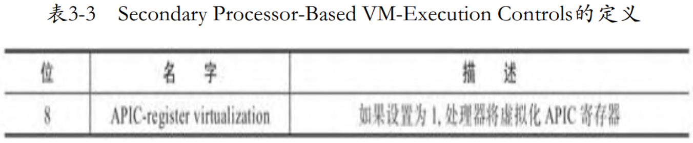
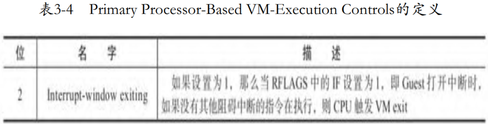
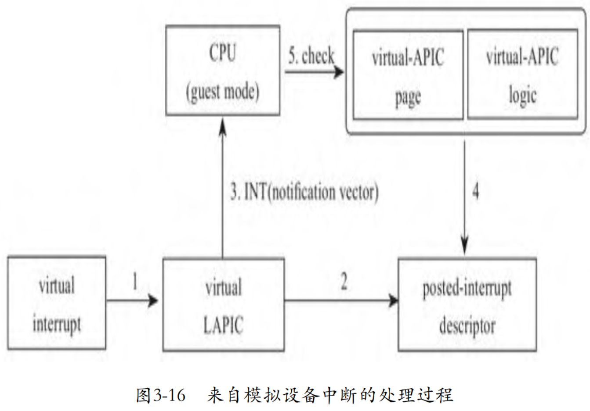
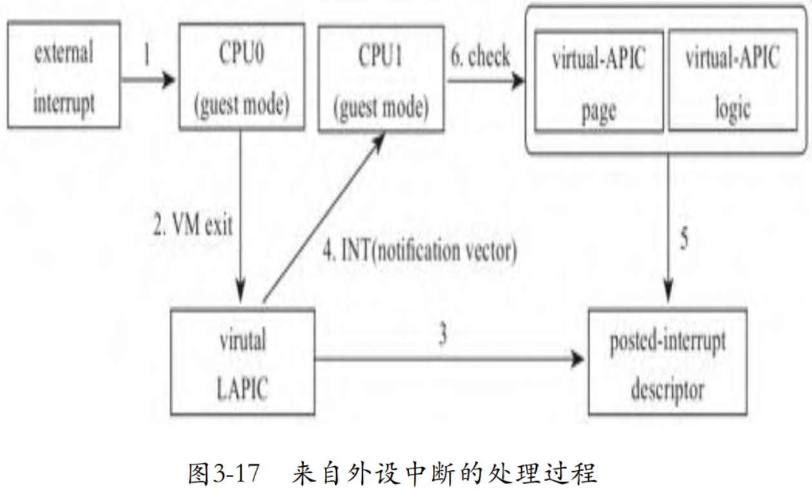
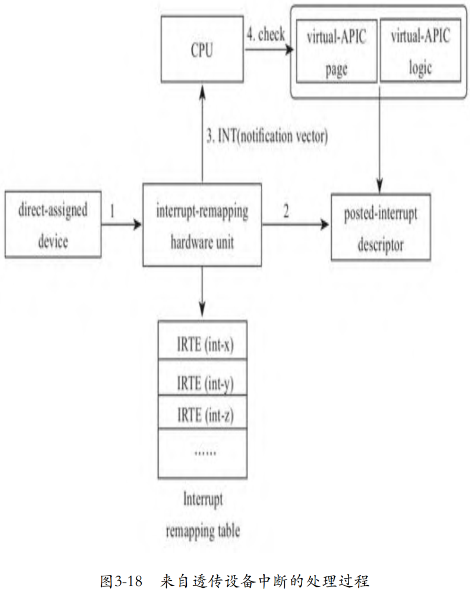
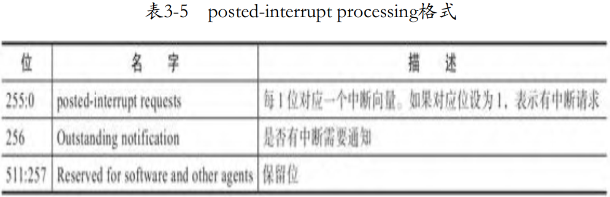

最初, 虚拟中断芯片是在用户空间实现的, 但是中断芯片密集地参与了整个计算机系统的运转过程, 因此, 为了减少内核空间和用户空间之间的上下文切换带来的开销, 后来, 中断芯片的虚拟实现在了内核空间. 为了进一步提高效率, Intel 从硬件层面对虚拟化的方方面面进行了支持, 这一节, 我们就来讨论 Intel 在硬件层面对中断虚拟化的支持.

在前面讨论完全基于软件虚拟中断芯片的方案中, 我们看到, 向 Guest 注入中断的时机都是在 VM entry 那一刻, 因此, 如果要向 Guest 注入中断, 必须要触发一次 VM exit, 这是中断虚拟化的主要开销. 因此, 为了避免这次 Host 模式和 Guest 模式的切换, Intel 在硬件层面从如下 3 个方面进行了支持:

1) virtual-APIC page. 我们知道, 在**物理**上, LAPIC 有一个 4KB 大小的页面 APIC page, 用来保存寄存器的值. Intel 在 CPU 的 Guest 模式下实现了一个用于存储中断寄存器的 virtual-APIC page. 在 Guest 模式下有了状态, 后面 Guest 模式下还有了中断逻辑, 很多中断行为就无须 VMM 介入了, 从而大大地减少了 VM exit 的次数. 当然有些写中断寄存器的操作是具有副作用的, 比如通过写 ICR 寄存器发送 IPI 中断, 这时就需要触发 VM exit.

2) Guest 模式下的中断评估逻辑. Intel 在 Guest 模式中实现了部分中断芯片的逻辑用于中断评估, 当有中断发生时, CPU 不必再退出到 Host 模式, 而是直接在 Guest 模式下完成中断评估.

3) posted-interrupt processing. 在软件虚拟中断的方案中, 虚拟中断芯片收到中断请求后, 会将信息保存到虚拟中断芯片中, 在 VM entry 时, 触发虚拟中断芯片的中断评估逻辑, 根据记录在虚拟中断芯片中的信息进行中断评估. 但是当 CPU 支持在 Guest 模式下的中断评估逻辑后, 虚拟中断芯片可以在收到中断请求后, 将中断信息直接传递给处于 Guest 模式下的 CPU, 由 Guest 模式下的中断芯片的逻辑在 Guest 模式中进行中断评估, 向 Guest 模式的 CPU 直接递交中断.

# 虚拟中断寄存器页面 (virtual-APIC page)

> 这个不是 x2apic 的

在 APIC 中, **物理 LAPIC** 有一个页面大小的 **内存** 用来存放 **各寄存器的值**, Intel 称这个页面为 `APIC-access page`, CPU 采用 mmap 的方式访问这些寄存器. 起初, 一旦 Guest 试图访问这个页面, CPU 将从 Guest 模式切换到 Host 模式, KVM 负责完成模拟, 将 Guest 写给 LAPIC 的值写入虚拟 LAPIC 的 APIC page, 或者从虚拟 LAPIC 的 APIC page 读入值给 Guest.

但是很快开发者就发现, 因为频繁地访问某些寄存器, 导致 Guest 和 Host 之间频繁的切换, 而这些大量的切换带来很大的性能损失. 为了减少 VM exit, Intel 设计了一个所谓的 `virtual-APIC page` 来替代 `APIC-access page`. CPU 在 Guest 模式下使用这个 virtual-APIC page 来维护寄存器的状态, 当 Guest 读寄存器时, 直接读 virtual-APIC page, 不必再切换到 Host 模式. 但是因为在写某些寄存器时, 可能要伴随着一些副作用, 比如需要发送一个 IPI, 所以在写寄存器时, 还需要触发 CPU 状态的切换.

那么 Guest 模式下的 CPU 从哪里找到 virtual-APIC page 呢? 显然, 我们再次想到了 **VMCS**. VMX 在 VMCS 中设计了一个字段 `VIRTUAL_APIC_PAGE_ADDR`, 在切入 Guest 模式前, KVM 需要将 virtual APIC page 的地址记录在 VMCS 的这个字段中:

```cpp
commit 83d4c286931c9d28c5be21bac3c73a2332cab681
x86, apicv: add APICv register virtualization support
linux.git/arch/x86/kvm/vmx.c
static int vmx_vcpu_reset(struct kvm_vcpu *vcpu)
{
    ...
    if (cpu_has_vmx_tpr_shadow()) {
        ...
        if (vm_need_tpr_shadow(vmx->vcpu.kvm))
            vmcs_write64(VIRTUAL_APIC_PAGE_ADDR,
                     __pa(vmx->vcpu.arch.apic->regs));
        ...
    }
    ...
}
```

这个特性需要配置 VMCS 中的相应开关, VMX 定义如表所示.



```cpp
commit 83d4c286931c9d28c5be21bac3c73a2332cab681
x86, apicv: add APICv register virtualization support
linux.git/arch/x86/kvm/vmx.c
static __init int setup_vmcs_config(struct vmcs_config *vmcs_conf)
{
    ...
    if (_cpu_based_exec_control & CPU_BASED_ACTIVATE_SECONDARY_CONTROLS) {
        min2 = 0;
        opt2 = SECONDARY_EXEC_VIRTUALIZE_APIC_ACCESSES |
            ...
            SECONDARY_EXEC_APIC_REGISTER_VIRT;
    ...
}

linux.git/arch/x86/include/asm/vmx.h
#define SECONDARY_EXEC_APIC_REGISTER_VIRT       0x00000100
```

在开启这个特性之前, 所有的访问 LAPIC 寄存器的处理函数, 无论读和写都由函数 `handle_apic_access` 统一处理. 但是, 在打开这个特性后, 因为 **读** 操作不再触发 VM exit, 只有 **写** 寄存器才会触发, 因此我们看到又新增了一个专门处理写的函数 `handle_apic_write`:

```cpp
commit 83d4c286931c9d28c5be21bac3c73a2332cab681
x86, apicv: add APICv register virtualization support
linux.git/arch/x86/kvm/vmx.c
static int (*const kvm_vmx_exit_handlers[])(struct kvm_vcpu *vcpu) = {
    ...
    [EXIT_REASON_APIC_ACCESS]             = handle_apic_access,
    [EXIT_REASON_APIC_WRITE]              = handle_apic_write,
    ...
};
```

写寄存器时, 除了更新寄存器内容外, 可能还会伴随其他一些动作, 比如说下面代码中的发送核间中断的操作 `apic_send_ipi`, 所以这就是为什么写寄存器时依然要触发 VM exit:

```cpp
commit 83d4c286931c9d28c5be21bac3c73a2332cab681
x86, apicv: add APICv register virtualization support
linux.git/arch/x86/kvm/lapic.c
static int apic_reg_write(struct kvm_lapic *apic, u32 reg, u32 val)
{
    ...
    case APIC_ICR:
        ...
        apic_send_ipi(apic);
        ...
}
```

# Guest 模式下的中断评估逻辑

> `Virtual-interrupt delivery`(虚拟中断的提交)

在 **没有硬件层面** 的 Guest 模式中的中断评估等逻辑支持时, 我们看到, **每次中断注入** 必须发生在 **VM entry** 时, 换句话说, 只有在 VM entry 时, Guest 模式的 CPU 才会评估是否有中断需要处理.

如果当 `VM entry` 那一刻 **Guest** 是 **关闭中断** 的, 或者 Guest 正在执行一些 **不能被中断指令**, 如 `sti`, 那么这时 Guest 是无法处理中断的, 但是又不能让中断等待太久, 导致 **中断延时过大**, 所以, 一旦 Guest 打开中断, 并且 Guest 又没有执行不能被中断的指令, CPU 应该马上从 Guest 模式退出到 Host 模式, 这样就能在下一次 VM entry 时, 注入中断了. 为此, VMX 还提供了一种特性: `Interrupt-window exiting`, 如表所示.



这个特性表示 **在任何指令执行前**, 如果 RFLAGS 寄存器中的 **IF** 位设置了, 即 **Guest 能处理中断**, 并且 Guest 没有运行任何阻止中断的操作, 那么如果 `Interrupt-window exiting` 被设置为 1, 则一旦有中断在等待注入, 则 Guest 模式下的 CPU 需要触发 VM exit. 这个触发 VM exit 的时机, 其实与物理 CPU 在指令之间去检查中断类似.

所以, 我们看到, 在每次 VM entry 时, KVM 在执行中断注入时, 会检查 Guest 是否允许中断, 并且确认 Guest 是否在运行任何阻止中断的操作, 也就是说检查中断窗口是否是打开的. 如果中断窗口打开, 则注入中断; 如果中断窗口是关闭的, 这时**不能注入中断**, 则需要设置 `Interrupt-window exiting`, 告知 CPU 有中断正在等待处理, 一旦 Guest 能处理中断了, 请马上退出到 Guest 模式, 代码如下:

```cpp
commit 85f455f7ddbed403b34b4d54b1eaf0e14126a126
KVM: Add support for in-kernel PIC emulation
linux.git/drivers/kvm/vmx.c
static void vmx_intr_assist(struct kvm_vcpu *vcpu)
{
    ...
    interrupt_window_open =
        ((vmcs_readl(GUEST_RFLAGS) & X86_EFLAGS_IF) &&
         (vmcs_read32(GUEST_INTERRUPTIBILITY_INFO) & 3) == 0);
    if (interrupt_window_open)
        vmx_inject_irq(vcpu, kvm_cpu_get_interrupt(vcpu));
    else
        enable_irq_window(vcpu);
}

static void enable_irq_window(struct kvm_vcpu *vcpu)
{
    u32 cpu_based_vm_exec_control;

    cpu_based_vm_exec_control = vmcs_read32(CPU_BASED_VM_EXEC_CONTROL);
    cpu_based_vm_exec_control |= CPU_BASED_VIRTUAL_INTR_PENDING;
    vmcs_write32(CPU_BASED_VM_EXEC_CONTROL, cpu_based_vm_exec_control);
}
```

当 Guest 模式下支持**中断评估**后, Guest 模式的 CPU 就不仅仅在 VM entry 时才能进行中断评估了, 其重大的不同在于运行于 Guest 模式的 CPU 也能评估中断, 一旦识别出中断, 在 Guest 模式即可自动完成中断注入, 无须再触发 VM exit. 因为 CPU 具备在 Guest 模式下中断评估的能力, 所以也有了后面的 posted-interrupt processing 机制, 即虚拟中断芯片可以直接将中断注入正运行于 Guest 模式的 CPU, 而无须触发其发生 VM exit.

Guest 模式的 CPU 评估中断借助 VMCS 中的字段 guest interrupt status. 当 Guest 打开中断或者执行完不能被中断的指令后, CPU 会检查 VMCS 中的字段 guest interrupt status 是否有中断需要处理, 如果有中断 pending 在这, 则调用 Guest 的内核中断 handler 处理中断. 字段 guest interrupt status 长度为 16 位, 存储在 VMCS 中的 Guest NonRegister State 区域. 低 8 位称作 Requesting virtual interrupt(RVI), 这个字段用来保存中断评估后待处理的中断向量; 高 8 位称作 Servicing virtual interrupt(SVI), 这个字段表示 Guest 正在处理的中断.

所以, 当启用了 Guest 模式下的 CPU 的中断评估支持后, KVM 在注入中断时, 也需要进行适当修改, 需要将注入的中断信息更新到字段 guest interrupt status. 这样, 即使 Guest 在 VM entry 一刻不能处理中断, 那么等到 Guest 模式可以处理中断时, 就可以直接处理记录在字段 guest interrupt status 中的中断了, 代码如下:

```cpp
commit c7c9c56ca26f7b9458711b2d78b60b60e0d38ba7
x86, apicv: add virtual interrupt delivery support
linux.git/arch/x86/kvm/x86.c
static int vcpu_enter_guest(struct kvm_vcpu *vcpu)
{
    ...
    if (kvm_check_request(KVM_REQ_EVENT, vcpu) || req_int_win) {
        ...
        if (kvm_lapic_enabled(vcpu)) {
            if (kvm_x86_ops->hwapic_irr_update)
                kvm_x86_ops->hwapic_irr_update(vcpu,
                    kvm_lapic_find_highest_irr(vcpu));
            ...
        }
    }
    ...
}

linux.git/arch/x86/kvm/vmx.c
static void vmx_hwapic_irr_update(struct kvm_vcpu *vcpu, int max_irr)
{
    ...
    vmx_set_rvi(max_irr);
}

static void vmx_set_rvi(int vector)
{
    ...
    if ((u8)vector != old) {
        status &= ~0xff;
        status |= (u8)vector;
        vmcs_write16(GUEST_INTR_STATUS, status);
    }
}
```

Guest 模式下的 CPU 的中断评估支持默认是关闭的, 如果使用这个特性, 需要手动开启, KVM 默认开启了这个特性:

```cpp
commit c7c9c56ca26f7b9458711b2d78b60b60e0d38ba7
x86, apicv: add virtual interrupt delivery support
linux.git/arch/x86/kvm/vmx.c
static __init int setup_vmcs_config(struct vmcs_config *vmcs_conf)
{
    ...
        opt2 = SECONDARY_EXEC_VIRTUALIZE_APIC_ACCESSES |
            ...
            SECONDARY_EXEC_VIRTUAL_INTR_DELIVERY;
    ...
}
```

# posted-interrupt processing

在 Guest 模式下的 CPU 支持中断评估后, 中断注入再也无须经历低效的退出 Guest 模式的过程了, 这种机制使得在 Guest 运行时中断注入成为可能.

于是, Intel 设计了 `posted-interrupt processing` 机制, 在该机制下, 当**虚拟中断芯片**需要**注入中断**时, 其将中断的信息更新到 `posted-interrupt descriptor` 中. 然后虚拟中断芯片向 CPU 发送一个**通知** `posted-interrupt notification`, 处于 Guest 模式的 CPU 收到这个中断后, 将在 Guest 模式直接响应中断. **这个通知**并不特殊, 就是一个 **常规的 IPI**, 但是**核间中断向量是专有** 的, 目的 CPU 在收到这个 IPI 后, 将不再触发 VM exit, 而是去处理被虚拟中断芯片写在 `posted-interrupt descriptor` 中的中断.

下面我们概述一下启用了 `posted-interrupt processing` 后的几种典型情况的中断处理过程.

## 虚拟设备中断

下图展示的是 **中断** 来自 **虚拟设备** 的情况:



当来自**虚拟设备**的中断到达虚拟 LAPIC 后, **虚拟 LAPIC** 将更新目标 Guest 的 `posted-interrupt descriptor`, 然后通知目的 CPU 评估并处理中断, 目的 CPU 无须进行一次 VM exit 和 VM entry.

## 外部中断

下图展示的是 **外部中断** 在一个 **处于 Guest 模式的 CPU**, 但是 **目标 Guest** 是运行于 **另外一个 CPU** 上的情况.



来自外设的中断落在 CPU0 上, 而此时 **CPU0** 处于 **Guest** 模式, 将导致 CPU0 发生 **VM exit**, 陷入 KVM.

KVM 中的虚拟 LAPIC 将更新 **目标 Guest** 的 `posted-interrupt descriptor`, 然后通知目的 CPU1 评估并处理中断, **目的 CPU1 无须**进行一次 VM exit 和 VM entry.

## 透传设备中断

设备透传结合 `posted-interrupt processing` 机制后, **中断重映射硬件单元**负责更新目标 **Guest** 的 `posted-interrupt descriptor`, 将不再导致任何 VM exit, 外部透传设备的中断可直达目标 CPU. 图 3-18 展示了这一情况, 我们将在 "设备虚拟化" 一章详细讨论.



## posted-interrupt descriptor

posted-interrupt descriptor 的长度为 64 位, 其格式如表 3-5 所示.



`0~255` 位用来表示中断向量, 256 位用来指示是否有中断. 其地址记录在 VMCS 中, 对应的字段是 posted-interrupt descriptor address. 类似的, CPU 如何判断哪个中断是 `posted-interrupt notification` 呢? 我们又想起了 VMCS. 没错, 这个 posted-interrupt notification 的中断向量也记录在 VMCS 中:

```cpp
commit 5a71785dde307f6ac80e83c0ad3fd694912010a1
KVM: VMX: Use posted interrupt to deliver virtual interrupt
linux.git/arch/x86/kvm/vmx.c
static int vmx_vcpu_setup(struct vcpu_vmx *vmx)
{
    ...
    if (vmx_vm_has_apicv(vmx->vcpu.kvm)) {
        ...
        vmcs_write64(POSTED_INTR_NV, POSTED_INTR_VECTOR);
        vmcs_write64(POSTED_INTR_DESC_ADDR, __pa((&vmx->pi_desc)));
    }
    ...
}
```

根据前面的讨论, posted-interrupt processing 机制核心就是完成两件事. 一是向 `posted-interrupt descriptor` 中 **写入中断信息**, 二是 **通知** CPU 去处理 posted-interrupt descriptor 中的 **中断**.

下面代码中, 函数 `pi_test_and_set_pir` 和 `pi_test_and_set_on` 分别设置 posted-interrupt descriptor 中的 **pir** 和 **notification**, 设置完 posted-interrupt descriptor 后, 如果此时 CPU 处于 Guest 模式, 那么发送专为 posted-interrupt processing 定义的 **核间中断** `POSTED_INTR_VECTOR`(`posted-interrupt notification vector`); 如果 CPU **不是** 处于 **Guest** 模式, 那么就发送一个 **重新调度的核间中断**, 促使目标 CPU 尽快得到调度, 在 VM entry 后马上处理 posted-interrupt descriptor 中的中断. 代码如下:

```cpp
commit 5a71785dde307f6ac80e83c0ad3fd694912010a1
KVM: VMX: Use posted interrupt to deliver virtual interrupt
linux.git/arch/x86/kvm/lapic.c
static int __apic_accept_irq(...)
{
    ...
            kvm_x86_ops->deliver_posted_interrupt(vcpu, vector);
    ...
}

linux.git/arch/x86/kvm/vmx.c
static void vmx_deliver_posted_interrupt(struct kvm_vcpu *vcpu, int vector)
{
    ...
    if (pi_test_and_set_pir(vector, &vmx->pi_desc))
        return;

    r = pi_test_and_set_on(&vmx->pi_desc);
    ...
    if (!r && (vcpu->mode == IN_GUEST_MODE))
        apic->send_IPI_mask(get_cpu_mask(vcpu->cpu),
                POSTED_INTR_VECTOR);
    else
        kvm_vcpu_kick(vcpu);
}
```

# IPIv

> pv-IPI: https://zhuanlan.zhihu.com/p/680042112

> https://www.ctyun.cn/developer/article/424163886542917

IPIv 和 pv-IPI (见 虚拟机中的 IPI 优化: pv-IPI) 的区别:

* pv-IPI 是将 guest 中多个写 ICR 发送 IPI 的操作, 使用一个 kvm_hypercall 完成 (multi-cast);

* 而 IPIv 是针对单个 ICR 写 (unicast). pv-IPI 仍然会有 VM-exit (EXIT_REASON_VMCALL) 和 VM-entry; 而 IPIv 不会.