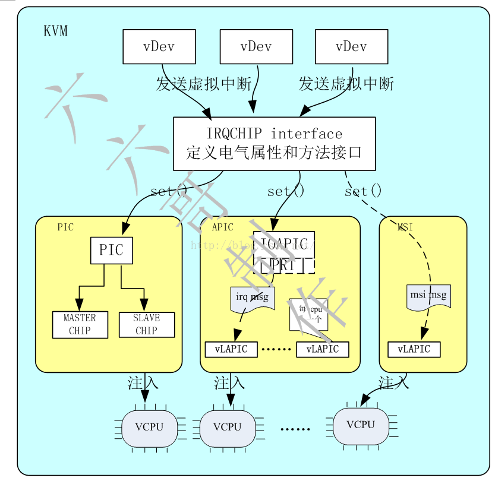
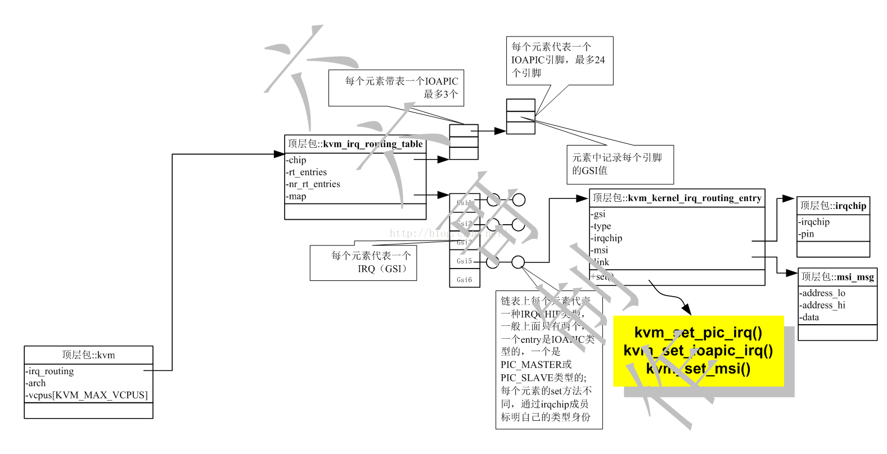
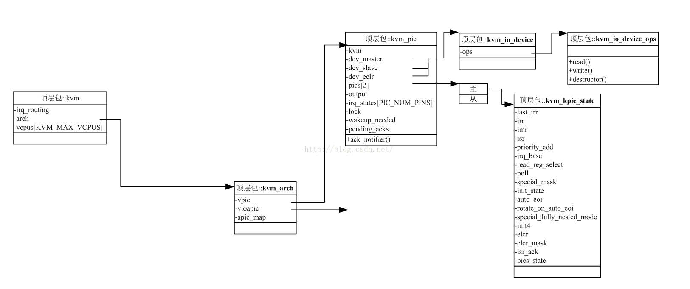
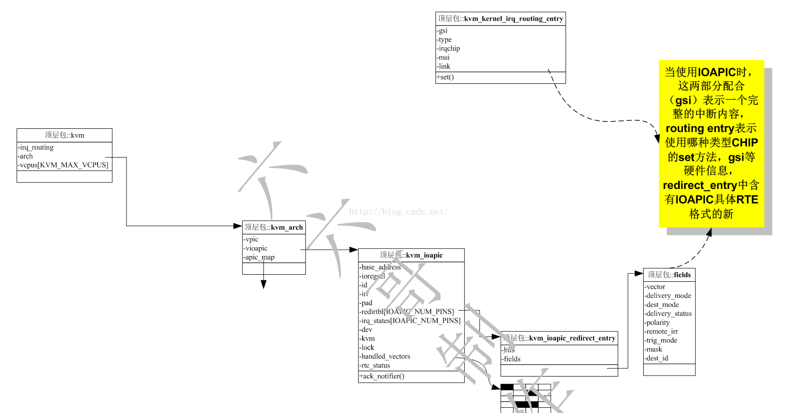
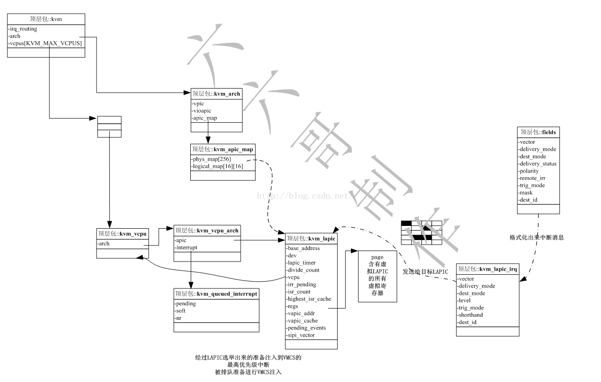

<!-- @import "[TOC]" {cmd="toc" depthFrom=1 depthTo=6 orderedList=false} -->

<!-- code_chunk_output -->

- [1. 虚拟中断子系统逻辑图](#1-虚拟中断子系统逻辑图)
- [2. 虚拟中断子系统的关系](#2-虚拟中断子系统的关系)
  - [2.1. kvm_irq_routing_table: 虚拟机的中断路由表](#21-kvm_irq_routing_table-虚拟机的中断路由表)
  - [2.2. kvm_kernel_irq_routing_entry: 中断路由项](#22-kvm_kernel_irq_routing_entry-中断路由项)
  - [2.3. IRQ 抽象接口层](#23-irq-抽象接口层)
  - [2.4. PIC 芯片结构](#24-pic-芯片结构)
  - [2.5. IOAPIC 芯片结构](#25-ioapic-芯片结构)
  - [2.6. LAPIC 芯片结构体](#26-lapic-芯片结构体)
- [3. 参考](#3-参考)

<!-- /code_chunk_output -->

# 1. 虚拟中断子系统逻辑图

KVM 中断系统逻辑图如下



KVM 将**所有类型**的**IRQ CHIP**(**中断芯片**)抽象出**一个接口**, 类似于 C++ 的 interface 抽象基类.

每个**中断芯片**定义了

- **中断的触发方法**: `set()`
- 以及**每个引脚**和**GSI**的**映射关系**,

这些都是**和芯片类型！！！无关**的, **具体的芯片**都是**继承和实现接口**, **虚拟设备的中断**发送给**IRQ CHIP(中断芯片)接口**开始中断的模拟; 分别实现了**PIC**、**IOAPIC**以及**MSI**的**set 方法**进行, 通过**set 方法**完成对于**VCPU 的中断注入**.

其中**IOAPIC**中对于**每个引脚**, 又定义了**PRT**, **IOAPIC**收到中断后根据**RTE 格式化**出**中断消息**并发送给**目标 LAPIC**, LAPIC 完成**中断的选举和注入实现**.

# 2. 虚拟中断子系统的关系

在**KVM 架构**下, **每个 KVM 虚拟机！！！** 维护一个**IO APIC！！！**, 但是**每个 VCPU！！！** 有**一个 local APIC！！！**.

## 2.1. kvm_irq_routing_table: 虚拟机的中断路由表

一个`struct kvm`代表一个虚拟机,
`irq_routing`是这个**虚拟机所有 IRQ CHIP 抽象接口**的**表**(汇总). 即表示该**虚拟机的整个中断路由信息表**.

**一个虚拟机**对应**一个中断路由表**.

```cpp
struct kvm {
        struct mutex irq_lock;
#ifdef CONFIG_HAVE_KVM_IRQCHIP
	/*
	 * Update side is protected by irq_lock.
	 */
	// irq 相关部分
	struct kvm_irq_routing_table __rcu *irq_routing;
#endif
}

// pic master
#define KVM_IRQCHIP_PIC_MASTER   0
// pic slave
#define KVM_IRQCHIP_PIC_SLAVE    1
// ioapic
#define KVM_IRQCHIP_IOAPIC       2
#define KVM_NR_IRQCHIPS          3
#define KVM_IOAPIC_NUM_PINS 24
#define KVM_IRQCHIP_NUM_PINS KVM_IOAPIC_NUM_PINS

#ifdef CONFIG_HAVE_KVM_IRQ_ROUTING
struct kvm_irq_routing_table {
        // 每个引脚的 GSI, 已不使用
        // 3 个芯片, 每个最大 24 个引脚(ioapic 最大), 最大 72 个引脚
        int chip[KVM_NR_IRQCHIPS][KVM_IRQCHIP_NUM_PINS];
        // 中断路由项的数目
        u32 nr_rt_entries;
        /*
         * Array indexed by gsi. Each entry contains list of irq chips
         * the gsi is connected to.
         */
        // 哈希链表结构体数组, 索引是 gsi 号
        // 数组里面的元素是哈希链表, 同一个 irq 关联的所有 entry
        struct hlist_head map[0];
};
#endif
```

`chip`是个**二维数组**, 表示**三个中断控制器芯片**的**每一个管脚**(最多 24 个 pin). 每个成员**对应一个引脚**, 内容记录了**该引脚的 GSI 号**, 其实**该成员已经不用了**.

这三个中断控制器芯片是`pic master`, `pic slave`和`ioapic`

`nr_rt_entries`表示**中断路由表**中存放的"**中断路由项**"的**数目**

**map**是一个**哈希链表结构体数组**, 也就是说可以将 map 理解为**链表头数组**, 即**每个元素**都是**一个链表头**. 链表中每个项都是`kvm_kernel_irq_routing_entry`, 链表的所有项是通过`kvm_kernel_irq_routing_entry`中的`link`关联起来.

**以 GSI 作为索引**这个 map 数组, 可以找到**同一个 irq**关联的所有(中断路由项), 即这个链表头. 也就是说**每个链表**对应**一个 IRQ 号**.

## 2.2. kvm_kernel_irq_routing_entry: 中断路由项

```cpp
/* gsi routing entry types */
#define KVM_IRQ_ROUTING_IRQCHIP 1
#define KVM_IRQ_ROUTING_MSI 2
#define KVM_IRQ_ROUTING_S390_ADAPTER 3
#define KVM_IRQ_ROUTING_HV_SINT 4

struct kvm_kernel_irq_routing_entry {
        // 该 entry 对应的 GSI 号
        u32 gsi;
        // 类型
        u32 type;
        // 该 GSI 关联的中断触发方式
        int (*set)(struct kvm_kernel_irq_routing_entry *e,
                   struct kvm *kvm, int irq_source_id, int level,
                   bool line_status);
        // 联合体
        union {
                // irq 芯片
                struct {
                        // 芯片类型
                        // 有三个, pic master, pic slave 和 ioapic
                        unsigned irqchip;
                        // 引脚号
                        unsigned pin;
                } irqchip;
                // msi 中断
                struct {
                        u32 address_lo;
                        u32 address_hi;
                        u32 data;
                        u32 flags;
                        u32 devid;
                } msi;
                struct kvm_s390_adapter_int adapter;
                struct kvm_hv_sint hv_sint;
        };
        //
        struct hlist_node link;
};
```

`kvm_kernel_irq_routing_entry`结构体**对应具体芯片的一个引脚**, 也就是每个项对应**一个设备信息**.

GSI 是该 entry 对应的**GSI 号**, 一般**和 IRQ 是一样**, 注意, 如果**irq 共享**的话, **两个或多个中断路由项**的 GSI 可能是**一样的**, 即**两个或多个设备**使用**同一个 irq 号**.

type 表示**该 gsi 的类型**, 取值可以是` KVM_IRQ_ROUTING_IRQCHIP`, `KVM_IRQ_ROUTING_MSI`等

set 表示该 gsi 关联的中断触发方法(不同 type 的 GSI 会调用不同的 set 触发函数), 通过该方法把**IRQ 传递给 IO-APIC**; 按照**芯片类型**实现路由项中的`set`接口,

link 就是**连接点**, 连接在上面**同一 IRQ**对应的**map**上; `hlist_node`则是中断路由表哈希链表的节点, 通过 link 将同一个 gsi 对应的中断路由项链接到 map 对应的 gsi 上.

**每个该结构体**代表了一个**具体芯片**的`set()`方法的**实现**, 在进行**中断注入的时候**, **每种芯片的 set 方法**都会**被调用**一下, 在**guest**中会**忽略没有实现的芯片类型发送的中断消息**(其实这里是可以优化的, 必经不需要多次的中断注入, 在**QEMU 注册中断设备**的时候就**不要注册不需要的中断芯片类型**)

## 2.3. IRQ 抽象接口层



```cpp

struct kvm_irq_routing_entry {
        __u32 gsi;
        __u32 type;
        __u32 flags;
        __u32 pad;
        union {
                struct kvm_irq_routing_irqchip irqchip;
                struct kvm_irq_routing_msi msi;
                struct kvm_irq_routing_s390_adapter adapter;
                struct kvm_irq_routing_hv_sint hv_sint;
                __u32 pad[8];
        } u;
};

struct kvm_irq_routing {
        __u32 nr;
        __u32 flags;
        struct kvm_irq_routing_entry entries[0];
};
```

`kvm_irq_routing`是中断路由, 用来记录中断路由信息的数据结构

## 2.4. PIC 芯片结构



```cpp
/**
 * kvm_io_device_ops are called under kvm slots_lock.
 * read and write handlers return 0 if the transaction has been handled,
 * or non-zero to have it passed to the next device.
 **/
struct kvm_io_device_ops {
        int (*read)(struct kvm_vcpu *vcpu,
                    struct kvm_io_device *this,
                    gpa_t addr,
                    int len,
                    void *val);
        int (*write)(struct kvm_vcpu *vcpu,
                     struct kvm_io_device *this,
                     gpa_t addr,
                     int len,
                     const void *val);
        void (*destructor)(struct kvm_io_device *this);
};


struct kvm_io_device {
        const struct kvm_io_device_ops *ops;
};

struct kvm_kpic_state {
        u8 last_irr;    /* edge detection */
        // irr 寄存器
        u8 irr;         /* interrupt request register */
        // imr 寄存器
        u8 imr;         /* interrupt mask register */
        // isr 寄存器
        u8 isr;         /* interrupt service register */
        u8 priority_add;        /* highest irq priority */
        u8 irq_base;
        u8 read_reg_select;
        u8 poll;
        u8 special_mask;
        u8 init_state;
        u8 auto_eoi;
        u8 rotate_on_auto_eoi;
        u8 special_fully_nested_mode;
        u8 init4;               /* true if 4 byte init */
        // 标识 边沿触发/水平触发 ??
        u8 elcr;                /* PIIX edge/trigger selection */
        u8 elcr_mask;
        u8 isr_ack;     /* interrupt ack detection */
        struct kvm_pic *pics_state;
};

struct kvm_pic {
        spinlock_t lock;
        bool wakeup_needed;
        unsigned pending_acks;
        struct kvm *kvm;
        struct kvm_kpic_state pics[2]; /* 0 is master pic, 1 is slave pic */
        int output;             /* intr from master PIC */
        struct kvm_io_device dev_master;
        struct kvm_io_device dev_slave;
        struct kvm_io_device dev_eclr;
        void (*ack_notifier)(void *opaque, int irq);
        unsigned long irq_states[PIC_NUM_PINS];
};
```

PIC 是**一个 KVM 虚拟机对应一个**, 由`kvm.arch.vpic`成员指向

`kvm_pic`结构体就是虚拟 PIC 的实现, `dev_master`、`dev_slave`、`dev_eclr`实现了**虚拟 PIC 设备**的**PIO 地址空间**, 并**注册**在**KVM 内核的 PIO 总线**上, 以便**完成设备的 IO 操作**, **ECLR**就是**控制中断触发方式的寄存器**;

`pics`执行一个数组, 每个元素指向`kvm_kpic_state`结构体, `kvm_kpic_state`结构体**芯片**的**所有寄存器和状态**, 包括**IRR**, **ISR**, **IMR**等.

## 2.5. IOAPIC 芯片结构



```cpp
// arch/x86/kvm/ioapic.h
struct rtc_status {
        int pending_eoi;
        struct dest_map dest_map;
};

union kvm_ioapic_redirect_entry {
        u64 bits;
        struct {
                // 向量号
                u8 vector;
                // 交付模式
                u8 delivery_mode:3;
                u8 dest_mode:1;
                u8 delivery_status:1;
                u8 polarity:1;
                u8 remote_irr:1;
                // 触发模式, level(水平)/edge(边沿)
                u8 trig_mode:1;
                u8 mask:1;
                u8 reserve:7;
                u8 reserved[4];
                u8 dest_id;
        } fields;
};

struct kvm_ioapic {
        u64 base_address;
        u32 ioregsel;
        u32 id;
        // irr 寄存器
        u32 irr;
        u32 pad;
        union kvm_ioapic_redirect_entry redirtbl[IOAPIC_NUM_PINS];
        unsigned long irq_states[IOAPIC_NUM_PINS];
        struct kvm_io_device dev;
        struct kvm *kvm;
        void (*ack_notifier)(void *opaque, int irq);
        spinlock_t lock;
        struct rtc_status rtc_status;
        struct delayed_work eoi_inject;
        u32 irq_eoi[IOAPIC_NUM_PINS];
        u32 irr_delivered;
};
```

IO APIC 可以一个系统里面有多个, 但是在 KVM 实现中只有一个, 由`kvm.arch.vioapic`指向`kvm_ioapic`结构体. **设备发送中断**, 发送到·; IO APIC 中存在着**一个 PRT 表**, 每个 PRT 的表项成为**RTE**, RTE 是每个引脚一个, IOAPIC 引脚收到中断消息后, 根据 RTE 得到目标 LAPIC, 并格式化出一个**中断消息**发送给**LAPIC**, 同时置位 remote irr(level).

kvm_ioapic 结构体就是**虚拟 IOAPIC**.

irr 成员就是 IRR 寄存器. 真实的 ioapic 没有 irr 寄存器吧???

`redirtbl[IOAPIC_NUM_PINS]`是一个数组, 构成**PRT 表**, **每个成员**对一个**IOAPIC 的引脚**, 执行`kvm_ioapic_redirect_entry`结构体.

`kvm_ioapic_redirect_entry`结构体就是一个**RTE**, **fields**成员执行了**RTE 中的各个域**, 如
- `dest_id`和`dest_mode`用来**确定目标 CPU**,
- `vector`用来确定中断向量号,
- `remote_irr`在**level 触发**时候保证**中断共享**情况下可以处理到**所有设备的中断请求**.

`fields`和`kvm_kernel_irq_routing_entry`的**gsi**配合起来**确定了一个完整的中断信息内容！！！**

目前 kvm 只为**虚拟机**创建**一个 ioapic 设备**(现在多路服务器可能有多个 ioapic 设备), **ioapic 设备**提供**24 个 PIN**给**外部中断**使用.

在**IRQ 路由**上 `0-15` 号 GSI 为**PIC 和 IOAPIC 共用的**, `16-23`号 GSI 则都**分配给 ioapic**.

## 2.6. LAPIC 芯片结构体



LAPIC 是每个 VCPU 一个, 由`kvm.vcpus[i].arch.apic`指向`kvm_lapic`结构体.

```cpp
struct kvm_timer {
        // 对应的 hrtimer 定时器
        struct hrtimer timer;
        // 触发周期, 一次性和周期性使用
        s64 period;                             /* unit: ns */
        // 周期性/一次性使用的目标过期时间
        ktime_t target_expiration;
        // 定时器模式, apic timer 有 3 种
        u32 timer_mode;
        // timer 模式屏蔽位
        u32 timer_mode_mask;
        // tscdeadline 值, 用于 tscdeadline 模式
        u64 tscdeadline;
        u64 expired_tscdeadline;
        // timer advanced
        u32 timer_advance_ns;
        s64 advance_expire_delta;
        // 定时器的 pending 事件计数
        atomic_t pending;                       /* accumulated triggered timers */
        bool hv_timer_in_use;
};

struct kvm_lapic {
        //GPA, Guest 设置
        unsigned long base_address;
        struct kvm_io_device dev;
        // APIC timer(LVT 功能)
        struct kvm_timer lapic_timer;
        // timer 计数的时钟频率
        u32 divide_count;
        struct kvm_vcpu *vcpu;
        bool sw_enabled;
        bool irr_pending;
        bool lvt0_in_nmi_mode;
        /* Number of bits set in ISR. */
        s16 isr_count;
        /* The highest vector set in ISR; if -1 - invalid, must scan ISR. */
        int highest_isr_cache;
        /**
         * APIC register page.  The layout matches the register layout seen by
         * the guest 1:1, because it is accessed by the vmx microcode.
         * Note: Only one register, the TPR, is used by the microcode.
         */
        // 所有寄存器
        void *regs;
        gpa_t vapic_addr;
        struct gfn_to_hva_cache vapic_cache;
        unsigned long pending_events;
        unsigned int sipi_vector;
};
```

`kvm_lapic`结构体代表**一个虚拟 LAPIC**.

- `base_address`为 LAPIC 的**基地址**, 这是**一个 GPA**, 是 GUEST 设置的**LAPIC 的基地址**, 在 GUEST 写某个 LAPIC 寄存器的时候, 会带入该寄存器的 GPA, 然后 GPA 减去 base_address 可以算出寄存器对于基地址的偏移量, 然后到 regs 成员中真正的找到虚拟寄存器加以修改, 请参见`apic_mmio_read`, `apic_mmio_write`;
- dev 成员将 lapic 在 KVM 内核空间的 KVM MMIO BUS 总线上注册了 IO 地址空间, 通过对 IO 地址空间的操作完成对 LAPIC 的操作.
- regs 成员指向一个页面, 这是一个 HVA, 指向一个 HOST 的页面, 这个页面总记录了 LAPIC 是所有虚拟寄存, IRR, ISR, LVT 等等, 通过偏移量就可以得到某个虚拟寄存器的 HVA, 完成对该虚拟寄存器的读写操作.

```cpp
struct kvm_lapic_irq {
        u32 vector;
        u16 delivery_mode;
        // 目的地模式
        u16 dest_mode;
        bool level;
        // 触发模式, R/W. 指明该管脚的的中断由什么方式触发
        u16 trig_mode;
        u32 shorthand;
        u32 dest_id;
        bool msi_redir_hint;
};
```

`kvm_lapic_irq`结构体是中断经过**IOAPIC**的**PRT**格式化出来的**中断消息**, 从 IOAPIC**发送给 LAPIC**.

LAPIC 在 GUEST 运行之前会对 IRR 中的进行选举, 找到最高优先级的中断, 该中断会被记录在`kvm_queued_interrupt`结构体中并且**pending 成员**设置为`true`; nr 成员记录了该中断的中断向量号, soft 说明是否是硬中断. 如果该中断大于 PPR, 就进行注入. 如果注入成功, 在虚拟机退出的时候, 将 pending 设置为 false, 这个结构体保存着`kvm.vcpus[i].arch.interrupt`中. 如果注入不成功, 会在再次进入虚拟机的时候再次进行注入.

为了加速对于目标 VCPU 的查找, 在`kvm.arch.apic_map`中保存了 kvm_apic_map 结构体. phys_map 成员和 logical_map 成员记录了 RTE 的 destination filed 同 VLAPIC 结构体的对应的关系, 分别对应 physical mode 和 logic mode. 在发送中断的时候, 如果有该 map 表, 且中断不是 lowest priority 和广播, 则通过 RTE 的 destination filed 就可以直接找到目标 VCPU, 进行快速的分发. 否则需要遍历所有的 VCPU, 逐一的和 RTE 的 destination filed 进行匹配.


# 3. 参考

https://blog.csdn.net/leoufung/article/details/53081207

https://blog.csdn.net/Mr0cheng/article/details/102578713 (未完)

https://blog.csdn.net/Mr0cheng/article/details/102578713 (未完)

https://blog.csdn.net/wanthelping/article/details/47069065 (未完)