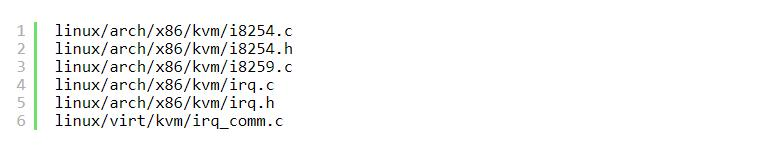
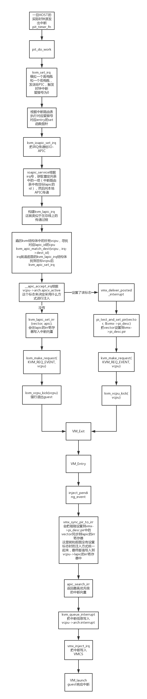
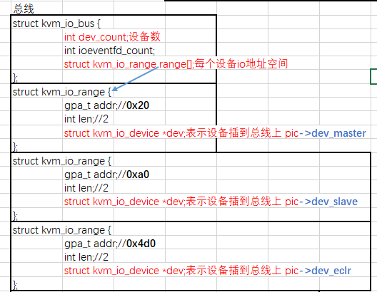
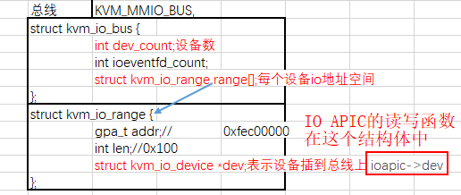
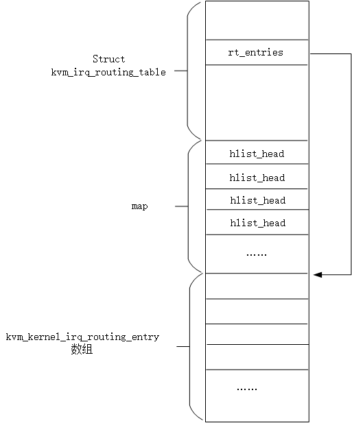
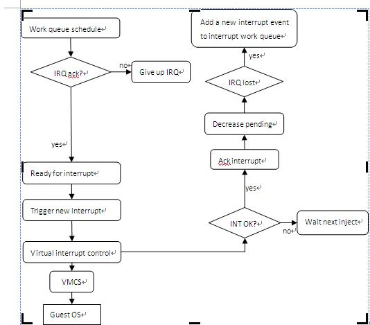

<!-- @import "[TOC]" {cmd="toc" depthFrom=1 depthTo=6 orderedList=false} -->

<!-- code_chunk_output -->

- [1. 基本原理](#1-基本原理)
- [2. 相关代码](#2-相关代码)
- [3. 整体流程](#3-整体流程)
- [4. 初始化中断控制器](#4-初始化中断控制器)
  - [4.1. LAPIC 的创建](#41-lapic-的创建)
    - [4.1.1. 整体流程](#411-整体流程)
    - [4.1.2. 代码入口](#412-代码入口)
  - [4.2. PIC 和 IOAPIC 的创建](#42-pic-和-ioapic-的创建)
    - [4.2.1. 用户态 QEMU 中断模块初始化](#421-用户态-qemu-中断模块初始化)
    - [用户态 qemu 中断控制器 ioapic 与虚拟 PC 的关联](#用户态-qemu-中断控制器-ioapic-与虚拟-pc-的关联)
      - [设置 ioapic 的 irq 路由信息](#设置-ioapic-的-irq-路由信息)
      - [分配 gsis](#分配-gsis)
    - [用户态 qemu 中断控制器 pic 与虚拟 PC 的关联](#用户态-qemu-中断控制器-pic-与虚拟-pc-的关联)
    - [4.2.2. 整体流程](#422-整体流程)
    - [4.2.3. 入口代码](#423-入口代码)
    - [4.2.4. kvm_pic_init(): 虚拟 pic(8259A)的初始化](#424-kvm_pic_init-虚拟-pic8259a 的初始化)
      - [4.2.4.1. kvm_io_bus_register_dev(): 在相应的 io_bus 总线上注册设备](#4241-kvm_io_bus_register_dev-在相应的-io_bus-总线上注册设备)
      - [4.2.4.2. 三种设备在虚拟 bus 上的结构](#4242-三种设备在虚拟-bus-上的结构)
    - [4.2.5. kvm_ioapic_init(): ioapic 的初始化](#425-kvm_ioapic_init-ioapic-的初始化)
    - [4.2.6. kvm_setup_default_irq_routing(): 默认中断路由表的初始化](#426-kvm_setup_default_irq_routing-默认中断路由表的初始化)
- [5. 中断触发: kvm_set_irq()](#5-中断触发-kvm_set_irq)
  - [5.1. 整体流程](#51-整体流程)
  - [5.2. 中断触发入口](#52-中断触发入口)
  - [5.3. kvm_irq_map_gsi(): 获取同一个 irq 对应的所有中断路由项(即设备)](#53-kvm_irq_map_gsi-获取同一个-irq-对应的所有中断路由项即设备)
  - [5.4. irq_set[i].set(): 调用路由项的触发函数](#54-irq_setiset-调用路由项的触发函数)
    - [5.4.1. PIC 中断触发: kvm_set_pic_irq()](#541-pic-中断触发-kvm_set_pic_irq)
      - [5.4.1.1. 整体流程](#5411-整体流程)
      - [5.4.1.2. pic 的触发入口](#5412-pic-的触发入口)
    - [5.4.2. IOAPIC 中断触发: kvm_set_ioapic_irq()](#542-ioapic-中断触发-kvm_set_ioapic_irq)
      - [5.4.2.1. 整体流程](#5421-整体流程)
      - [5.4.2.2. ioapic 的触发入口](#5422-ioapic-的触发入口)
      - [5.4.2.3. ioapic_service(): 根据 RTE 构建中断消息发往 lapic](#5423-ioapic_service-根据-rte-构建中断消息发往-lapic)
        - [5.4.2.3.1. kvm_irq_delivery_to_apic(): 投递消息到 lapic](#54231-kvm_irq_delivery_to_apic-投递消息到-lapic)
    - [5.4.3. MSI 中断触发函数: kvm_set_msi()](#543-msi-中断触发函数-kvm_set_msi)
      - [5.4.3.1. 整体流程](#5431-整体流程)
      - [5.4.3.2. msi 的触发入口](#5432-msi-的触发入口)
  - [5.5. __apic_accept_irq(): LAPIC 接收中断](#55-__apic_accept_irq-lapic-接收中断)
- [6. 中断具体注入过程](#6-中断具体注入过程)
  - [6.1. 整体流程](#61-整体流程)
  - [6.2. 具体注入入口: vcpu_enter_guest()](#62-具体注入入口-vcpu_enter_guest)
  - [6.3. inject_pending_event(): 注入](#63-inject_pending_event-注入)
- [7. 中断源](#7-中断源)
- [8. 参考](#8-参考)

<!-- /code_chunk_output -->

# 1. 基本原理

中断虚拟化**起始关键**在于**对中断控制器的虚拟化**.

在正常系统中:

中断控制器目前主要有**APIC**, 这种架构下**设备控制器**通过**某种触发方式**通知 **IO APIC**, **IO APIC** 根据**自身维护**的**重定向表 pci irq routing table** 格式化出**一条中断消息**, 把中断消息发送给**local APIC**.

local APIC 局部于 CPU, 即**每个 CPU 一个**, local APIC 具备**传统中断控制器的相关功能**以及各个寄存器, 中断请求寄存器 IRR, 中断屏蔽寄存器 IMR, 中断服务寄存器 ISR 等.

针对这些关键部件的虚拟化是中断虚拟化的重点.


apicv: https://richardweiyang-2.gitbook.io/understanding_qemu/00-advance_interrupt_controller/03-apicv

# 2. 相关代码



# 3. 整体流程

整个主要流程:



修正: 重定向表中有目标 lapic 的 id, 图中有问题, `apicv_active`标志设置了的话, 不会调用`kvm_make_request`

1. 当**中断需要模拟的时候**就调用`kvm_set_irq()`触发中断, 会根据 irq 查找所有的中断路由项(可能多个), 然后遍历调用**每个路由实体**的 set 触发函数.
2. 以 ioapic 为例, ioapic 的 set 方法`kvm_ioapic_set_irq`会将 irq 传递给`IO-APIC`, 然后`ioapic_service`会根据 irq 号获取重定向表中的一项(ret 中有目标 lapic 的 id), 遍历 kvm 虚拟机的所有 vcpu, 找到 lapic id 对应的 CPU, 调用`kvm_apic_set_irq -> __apic_accept_irq()`让 lapic 处理中断.
3. `__apic_accept_irq()`根据`vcpu->arch.apicv_active`这个标志来决定采用什么方式进行注入, 如下.
* 如果设置了该标志, 则调用`pi_test_and_set_pir(vector, &vmx->pi_desc)`设置位图(把 vector 设置到`vmx->pi_desc.pir`), 然后调用`kvm_vcpu_kick(vcpu)`强行让 vcpu 退出 guest 模式, 进入 kvm
* 如果没有设置该标志, `kvm_lapic_set_irr(vector, apic)`会往**lapic 的 irr 寄存器**中写入中断向量, 然后设置`vcpu->requests`的`KVM_REQ_EVENT`位, 再调用`kvm_vcpu_kick(vcpu)`强行让 vcpu 退出 guest 模式, 进入 kvm
4. 虚拟机发生 vm-exit, 然后在 vm-entry 之前, `kvm_check_request(KVM_REQ_EVENT, vcpu)`如果有 req 事件, 调用`inject_pending_event`进行阻塞事件注入, 统一`vcpu->arch.apicv_active`这个标志没有设置时注入方式, 将刚刚设置到`vmx->pi_desc.pir`中的 vector 同步到`vpuc->lapic`的 irr 寄存器
5. `apic_search_irr`返回最高优先级的中断向量.
6. `kvm_queue_interrupt`将中断信息写入`vcpu->arch.interrupt`
7. `vmx_inject_irq`将中断写入 VMCS
8. 在 VM resume 后, guest 响应中断.

# 4. 初始化中断控制器

考虑到中断实时性对性能的影响, **PIC 和 IOAPIC**的**设备模拟主要逻辑！！！** 都放到了**kvm 模块**进行实现, **每个 VCPU**的**LAPIC**则**完全！！！放到 kvm**中进行实现.

**i8259 控制器**和**IOAPIC**的创建和初始化由**qemu 和 kvm 配合完成**, 包括了 2 个方面:

- **kvm**中**设备相关数据结构初始化！！！**
- **qemu 中设备模拟的初始化！！！**

**中断处理的逻辑**放在**kvm 内核模块**中进行实现, 但**设备的模拟**呈现还是需要**qemu 设备模拟器**来搞定, 最后 qemu 和 kvm 一起配合完成快速中断处理的流程.

所以在**qemu**中也会创建**i8259A**和**ioapic**

## 4.1. LAPIC 的创建

### 4.1.1. 整体流程

```cpp
kvm_arch_vcpu_create()  // vcpu 创建中创建 lapic
 ├─ kvm_create_lapic() // lapic 创建入口
 |   ├─ kzalloc(sizeof(*apic), GFP_KERNEL_ACCOUNT);  // 如果 irqchip 在 kvm 中实现, 则直接返回, 不执行任何动作
 |   ├─ vcpu->arch.apic = apic;  //
 |   ├─ apic->regs = (void *)get_zeroed_page(GFP_KERNEL_ACCOUNT); //
 |   ├─ hrtimer_init(&apic->lapic_timer.timer, CLOCK_MONOTONIC, HRTIMER_MODE_ABS_HARD);  //初始化 hrtimer 定时器
 |   ├─ apic->lapic_timer.timer.function = apic_timer_fn;  // hrtimer 定时器回调函数, 即 APIC Timer 设备产生中断的函数
 |   ├─ apic->lapic_timer.timer_advance_ns;  // advanced timer
 |   └─ kvm_iodevice_init(&apic->dev, &apic_mmio_ops);  //
 ├─ kvm_vcpu_reset(vcpu, false); // 对 vcpu 结构进行初始化
 |   ├─ kvm_lapic_reset(vcpu, init_event); // 设置寄存器的值为默认值
```

### 4.1.2. 代码入口

lapic 是每个 vcpu 一个, 所以在**创建 vcpu 流程**中创建了 lapic

```cpp
int kvm_create_lapic(struct kvm_vcpu *vcpu, int timer_advance_ns)
{
        struct kvm_lapic *apic;

        ASSERT(vcpu != NULL);
        // 分配 apic 结构体
        apic = kzalloc(sizeof(*apic), GFP_KERNEL_ACCOUNT);
        if (!apic)
                goto nomem;

        vcpu->arch.apic = apic;

        apic->regs = (void *)get_zeroed_page(GFP_KERNEL_ACCOUNT);
        if (!apic->regs) {
                printk(KERN_ERR "malloc apic regs error for vcpu %x\n",
                       vcpu->vcpu_id);
                goto nomem_free_apic;
        }
        apic->vcpu = vcpu;
        // 建立 hrtimer 定时器, 回调函数 apic_timer_fn
        hrtimer_init(&apic->lapic_timer.timer, CLOCK_MONOTONIC,
                     HRTIMER_MODE_ABS_HARD);
        // hrtimer 定时器回调函数, 即 APIC Timer 设备产生中断的函数
        apic->lapic_timer.timer.function = apic_timer_fn;
        if (timer_advance_ns == -1) {
                apic->lapic_timer.timer_advance_ns = LAPIC_TIMER_ADVANCE_NS_INIT;
                lapic_timer_advance_dynamic = true;
        } else {
                apic->lapic_timer.timer_advance_ns = timer_advance_ns;
                lapic_timer_advance_dynamic = false;
        }

        /*
         * APIC is created enabled. This will prevent kvm_lapic_set_base from
         * thinking that APIC state has changed.
         */
        vcpu->arch.apic_base = MSR_IA32_APICBASE_ENABLE;
        static_key_slow_inc(&apic_sw_disabled.key); /* sw disabled at reset */
        kvm_iodevice_init(&apic->dev, &apic_mmio_ops);

        return 0;
nomem_free_apic:
        kfree(apic);
        vcpu->arch.apic = NULL;
nomem:
        return -ENOMEM;
}
```

其中`hrtimer_init`是创建了一个时钟定时器, 用来实现时钟的模拟

因为**APIC Timer 设备**实际就是 lapic 的一个功能, 所以在创建 lapic 设备**同时创建**了.

然后初始化 APIC Timer 设备产生中断的函数, 实际就是定时器回调函数.


## 4.2. PIC 和 IOAPIC 的创建

### 4.2.1. 用户态 QEMU 中断模块初始化

qemu 代码中中断控制器的 kvm 内核初始化流程为:

```cpp
configure_accelerator
 ├─ accel_init_machine
 |   ├─ kvm_init
 |   |   ├─ kvm_irqchip_create
 |   |   |   ├─ kvm_vm_ioctl(s, KVM_CREATE_IRQCHIP) // 让内核态创建一个中断控制器
 |   |   |   ├─ kvm_init_irq_routing
 |   |   |   |   ├─ kvm_check_extension(s, KVM_CAP_IRQ_ROUTING); // 检察内核态的 Irq routing
 |   |   ├─ s->irq_set_ioctl = KVM_IRQ_LINE;
 |   |   ├─ if (kvm_check_extension(s, KVM_CAP_IRQ_INJECT_STATUS)) {
 |   |   |   ├─ s->irq_set_ioctl = KVM_IRQ_LINE_STATUS;
 |   |   ├─ }
```

在`kvm_init`中

```cpp
// kvm-all.c
// 让内核态创建一个中断控制器
// kvm_init -> kvm_irqchip_create
kvm_vm_ioctl(s, KVM_CREATE_IRQCHIP)
// 检察内核态的 Irq routing
//kvm_init_irq_routing -> kvm_check_extension
kvm_check_extension(s,KVM_CAP_IRQ_ROUTING)

// kvm_init
s->irq_set_ioctl = KVM_IRQ_LINE;
if (kvm_check_extension(s, KVM_CAP_IRQ_INJECT_STATUS)) {
s->irq_set_ioctl = KVM_IRQ_LINE_STATUS;
}
```

关于 IRQ、GSI 和 Vector 见硬件基础部分.

qemu 通过 kvm 的 ioctl 命令`KVM_CREATE_IRQCHIP`调用到 kvm 内核模块中, 在**内核模块**中**创建和初始化 PIC/IOAPIC 设备**(创建设备对应的数据结构并将设备注册到总线上).

更多细节见 https://blog.csdn.net/wanthelping/article/details/47069065

### 用户态 qemu 中断控制器 ioapic 与虚拟 PC 的关联

```cpp
// hw/i386/pc_piix.c
// ioapic 的
pc_init1() ->
gsi_state = pc_gsi_create(&x86ms->gsi, pcmc->pci_enabled);

// hw/i386/pc.c
GSIState *pc_gsi_create(qemu_irq **irqs, bool pci_enabled)
{
    GSIState *s;

    s = g_new0(GSIState, 1);
    if (kvm_ioapic_in_kernel()) {
        // 设置 irq 路由
        kvm_pc_setup_irq_routing(pci_enabled);
    }
    // 分配 gsis
    *irqs = qemu_allocate_irqs(gsi_handler, s, GSI_NUM_PINS);

    return s;
}
```

#### 设置 ioapic 的 irq 路由信息

```cpp
// hw/i386/kvm/ioapic.c
/* PC Utility function */
void kvm_pc_setup_irq_routing(bool pci_enabled)
{
    KVMState *s = kvm_state;
    int i;

    if (kvm_check_extension(s, KVM_CAP_IRQ_ROUTING)) {
        // 修改前 8 个路由信息
        for (i = 0; i < 8; ++i) {
            if (i == 2) {
                continue;
            }
            kvm_irqchip_add_irq_route(s, i, KVM_IRQCHIP_PIC_MASTER, i);
        }
        // 修改 8-16 的路由信息
        for (i = 8; i < 16; ++i) {
            kvm_irqchip_add_irq_route(s, i, KVM_IRQCHIP_PIC_SLAVE, i - 8);
        }
        if (pci_enabled) {
            for (i = 0; i < 24; ++i) {
                if (i == 0) {
                    kvm_irqchip_add_irq_route(s, i, KVM_IRQCHIP_IOAPIC, 2);
                } else if (i != 2) {
                    kvm_irqchip_add_irq_route(s, i, KVM_IRQCHIP_IOAPIC, i);
                }
            }
        }
        // 提交 irq 路由信息
        kvm_irqchip_commit_routes(s);
    }
}

// 添加 irq 路由信息
void kvm_irqchip_add_irq_route(KVMState *s, int irq, int irqchip, int pin)
{
    struct kvm_irq_routing_entry e = {};

    assert(pin < s->gsi_count);

    e.gsi = irq;
    e.type = KVM_IRQ_ROUTING_IRQCHIP;
    e.flags = 0;
    e.u.irqchip.irqchip = irqchip;
    e.u.irqchip.pin = pin;
    kvm_add_routing_entry(s, &e);
}

static void kvm_add_routing_entry(KVMState *s,
                                  struct kvm_irq_routing_entry *entry)
{
    struct kvm_irq_routing_entry *new;
    int n, size;

    if (s->irq_routes->nr == s->nr_allocated_irq_routes) {
        n = s->nr_allocated_irq_routes * 2;
        if (n < 64) {
            n = 64;
        }
        size = sizeof(struct kvm_irq_routing);
        size += n * sizeof(*new);
        s->irq_routes = g_realloc(s->irq_routes, size);
        s->nr_allocated_irq_routes = n;
    }
    n = s->irq_routes->nr++;
    new = &s->irq_routes->entries[n];

    *new = *entry;

    set_gsi(s, entry->gsi);
}

static void set_gsi(KVMState *s, unsigned int gsi)
{
    set_bit(gsi, s->used_gsi_bitmap);
}

void kvm_irqchip_commit_routes(KVMState *s)
{
    int ret;

    if (kvm_gsi_direct_mapping()) {
        return;
    }

    if (!kvm_gsi_routing_enabled()) {
        return;
    }

    s->irq_routes->flags = 0;
    trace_kvm_irqchip_commit_routes();
    // 通知内核设置 gsi routing
    ret = kvm_vm_ioctl(s, KVM_SET_GSI_ROUTING, s->irq_routes);
    assert(ret == 0);
}
```
#### 分配 gsis
 
```cpp
typedef struct IRQState *qemu_irq;

qemu_irq **irqs;
*irqs = qemu_allocate_irqs(gsi_handler, s, GSI_NUM_PINS);
```

irqs 定义如下:

```cpp
struct IRQState {
    Object parent_obj;

    qemu_irq_handler handler;
    void *opaque;
    int n;
};

irqs->qemu_irq_handler = gsi_handler;
```

### 用户态 qemu 中断控制器 pic 与虚拟 PC 的关联

```cpp
// hw/i386/pc_piix.c
// ioapic 的
pc_init1() ->
pc_i8259_create(isa_bus, gsi_state->i8259_irq);

void pc_i8259_create(ISABus *isa_bus, qemu_irq *i8259_irqs)
{
    qemu_irq *i8259;

    if (kvm_pic_in_kernel()) {
        // 内核态
        i8259 = kvm_i8259_init(isa_bus);
    } else if (xen_enabled()) {
        i8259 = xen_interrupt_controller_init();
    } else {
        i8259 = i8259_init(isa_bus, x86_allocate_cpu_irq());
    }

    for (size_t i = 0; i < ISA_NUM_IRQS; i++) {
        i8259_irqs[i] = i8259[i];
    }

    g_free(i8259);
}

qemu_irq *kvm_i8259_init(ISABus *bus)
{
    i8259_init_chip(TYPE_KVM_I8259, bus, true);
    i8259_init_chip(TYPE_KVM_I8259, bus, false);

    return qemu_allocate_irqs(kvm_pic_set_irq, NULL, ISA_NUM_IRQS);
}
```

https://blog.csdn.net/wanthelping/article/details/47069065

### 4.2.2. 整体流程

```cpp
kvm_vm_ioctl()  // vm ioctl 的入口
 ├─ kvm_arch_vm_ioctl()
 |   ├─ irqchip_in_kernel(kvm)  // 如果 irqchip 在 kvm 中实现, 则直接返回, 不执行任何动作
 |   ├─ kvm_pic_init()   // pic 创建, 8259
 |   |   ├─ struct kvm_pic *s = kzalloc(sizeof(struct kvm_pic), GFP_KERNEL_ACCOUNT);   // 创建 kvm_pic 结构
 |   |   ├─ kvm_iodevice_init(&s->dev_master, &picdev_master_ops); // 注册 master 的 IO 端口读写函数
 |   |   ├─ kvm_iodevice_init(&s->dev_slave, &picdev_slave_ops); // 注册 slave 的 IO 端口读写函数
 |   |   ├─ kvm_iodevice_init(&s->dev_eclr, &picdev_eclr_ops); // 注册 eclr 的 IO 端口读写函数
 |   |   ├─ kvm_io_bus_register_dev(kvm, KVM_PIO_BUS, 0x20, 2, &s->dev_master); // 注册了 PIO 型的 bus 访问形式; 另一种 IO 形式为 MMIO;
 |   |   ├─ kvm_io_bus_register_dev(kvm, KVM_PIO_BUS, 0xa0, 2, &s->dev_slave); // 注册了 PIO 型的 bus 访问形式; 另一种 IO 形式为 MMIO;
 |   |   ├─ kvm_io_bus_register_dev(kvm, KVM_PIO_BUS, 0x4d0, 2, &s->dev_eclr); // 注册了 PIO 型的 bus 访问形式; 另一种 IO 形式为 MMIO;
 |   |   └─ kvm->arch.vpic = s;   // 将 s 赋值给 kvm->arch.vpic
 |   ├─ kvm_ioapic_init()   // ioapic 的初始化
 |   |   ├─ struct kvm_ioapic *ioapic = kzalloc(sizeof(struct kvm_ioapic), GFP_KERNEL_ACCOUNT);  // 创建 kvm_pic 结构
 |   ├─ kvm_setup_default_irq_routing();   // 设置默认的 irq 路由表
 |   |   └─ kvm_set_irq_routing();   //
 |   |       ├─ kzalloc(struct_size(new, map, nr_rt_entries), GFP_KERNEL_ACCOUNT); // 为中断路由表分配空间
 |   |       ├─ for (i = 0; i < nr; ++i)  // 循环默认的 24 个路由项
 |   |       ├─ kzalloc(sizeof(*e), GFP_KERNEL_ACCOUNT); // 为每个中断路由项分配空间
 |   |       ├─ setup_routing_entry(kvm, new, e, ue) // 设置路由项
 |   |       |    ├─ kvm_set_routing_entry(kvm, e, ue);;   // 设置路由项的 set 方法
 |   |       |    └─ hlist_add_head(&e->link, &rt->map[e->gsi]);   // 设置 gsi 对应的哈希链表
 |   |       ├─ rcu_assign_pointer(kvm->irq_routing, new);   // 设置虚拟机中断路由表
 |   |       ├─ kvm_irq_routing_update(kvm);   //
 |   |       └─ kvm_arch_irq_routing_update(kvm);   //
 |   └─ kvm->arch.irqchip_mode = KVM_IRQCHIP_KERNEL;  // irqchip 为 kernel 模式, 即在 kernel 中实现
```

### 4.2.3. 入口代码

```cpp
        case KVM_CREATE_IRQCHIP: {
                mutex_lock(&kvm->lock);

                r = -EEXIST;
                // 如果 irqchip 在 kvm 中实现, 则不用创建
                if (irqchip_in_kernel(kvm))
                        goto create_irqchip_unlock;

                r = -EINVAL;
                if (kvm->created_vcpus)
                        goto create_irqchip_unlock;
                // 主要过程, 是 8259A pic 初始化
                r = kvm_pic_init(kvm);
                if (r)
                        goto create_irqchip_unlock;
                // ioapic 的初始化
                r = kvm_ioapic_init(kvm);
                if (r) {
                        kvm_pic_destroy(kvm);
                        goto create_irqchip_unlock;
                }
                // 建立默认中断路由表
                r = kvm_setup_default_irq_routing(kvm);
                if (r) {
                        kvm_ioapic_destroy(kvm);
                        kvm_pic_destroy(kvm);
                        goto create_irqchip_unlock;
                }
                /* Write kvm->irq_routing before enabling irqchip_in_kernel. */
                smp_wmb();
                // irq 属于内核实现
                kvm->arch.irqchip_mode = KVM_IRQCHIP_KERNEL;
        create_irqchip_unlock:
                mutex_unlock(&kvm->lock);
                break;
        }
```

### 4.2.4. kvm_pic_init(): 虚拟 pic(8259A)的初始化

`arch/x86/kvm/i8259.c`

```cpp
// arch/x86/kvm/i8259.c
int kvm_pic_init(struct kvm *kvm)
{
        struct kvm_pic *s;
        int ret;
        // 分配 kvm_pic 结构体
        s = kzalloc(sizeof(struct kvm_pic), GFP_KERNEL_ACCOUNT);
        if (!s)
                return -ENOMEM;
        spin_lock_init(&s->lock);
        // 该 pic 所属的 kvm 虚拟机
        s->kvm = kvm;
        s->pics[0].elcr_mask = 0xf8;
        s->pics[1].elcr_mask = 0xde;
        s->pics[0].pics_state = s;
        s->pics[1].pics_state = s;

        /*
         * Initialize PIO device
         */
        // 注册 master 的 IO 端口读写函数
        kvm_iodevice_init(&s->dev_master, &picdev_master_ops);
        // 注册 slave 的 IO 端口读写函数
        kvm_iodevice_init(&s->dev_slave, &picdev_slave_ops);
        // 注册 eclr 的 IO 端口读写函数
        kvm_iodevice_init(&s->dev_eclr, &picdev_eclr_ops);
        mutex_lock(&kvm->slots_lock);
        // 注册了 PIO 型的 bus 访问形式; 另一种 IO 形式为 MMIO;
        ret = kvm_io_bus_register_dev(kvm, KVM_PIO_BUS, 0x20, 2,
                                      &s->dev_master);
        if (ret < 0)
                goto fail_unlock;
        // 注册 PIO 类型 bus 的访问
        ret = kvm_io_bus_register_dev(kvm, KVM_PIO_BUS, 0xa0, 2, &s->dev_slave);
        if (ret < 0)
                goto fail_unreg_2;
        // 注册 PIO 类型 bus 的访问
        ret = kvm_io_bus_register_dev(kvm, KVM_PIO_BUS, 0x4d0, 2, &s->dev_eclr);
        if (ret < 0)
                goto fail_unreg_1;

        mutex_unlock(&kvm->slots_lock);

        kvm->arch.vpic = s;

        return 0;

fail_unreg_1:
        kvm_io_bus_unregister_dev(kvm, KVM_PIO_BUS, &s->dev_slave);

fail_unreg_2:
        kvm_io_bus_unregister_dev(kvm, KVM_PIO_BUS, &s->dev_master);

fail_unlock:
        mutex_unlock(&kvm->slots_lock);

        kfree(s);

        return ret;
}
```

#### 4.2.4.1. kvm_io_bus_register_dev(): 在相应的 io_bus 总线上注册设备

8259A PIC 属于 PIO 访问类型.

```cpp
int kvm_io_bus_register_dev(struct kvm *kvm, enum kvm_bus bus_idx, gpa_t addr,
                            int len, struct kvm_io_device *dev)
{
        int i;
        struct kvm_io_bus *new_bus, *bus;
        struct kvm_io_range range;
        // 获取 io_bus 总线
        bus = kvm_get_bus(kvm, bus_idx);
        if (!bus)
                return -ENOMEM;

        /* exclude ioeventfd which is limited by maximum fd */
        if (bus->dev_count - bus->ioeventfd_count > NR_IOBUS_DEVS - 1)
                return -ENOSPC;
        // 分配新的 io_bus
        new_bus = kmalloc(struct_size(bus, range, bus->dev_count + 1),
                          GFP_KERNEL_ACCOUNT);
        if (!new_bus)
                return -ENOMEM;

        range = (struct kvm_io_range) {
                .addr = addr,
                .len = len,
                .dev = dev,
        };

        for (i = 0; i < bus->dev_count; i++)
                if (kvm_io_bus_cmp(&bus->range[i], &range) > 0)
                        break;

        memcpy(new_bus, bus, sizeof(*bus) + i * sizeof(struct kvm_io_range));
        new_bus->dev_count++;
        new_bus->range[i] = range;
        memcpy(new_bus->range + i + 1, bus->range + i,
                (bus->dev_count - i) * sizeof(struct kvm_io_range));
        rcu_assign_pointer(kvm->buses[bus_idx], new_bus);
        synchronize_srcu_expedited(&kvm->srcu);
        kfree(bus);

        return 0;
}
```

#### 4.2.4.2. 三种设备在虚拟 bus 上的结构

虚拟 bus 总线结构如下, 注意 IO 端口地址与设备读写函数的关联



每个`kvm_io_device`的设备都有对应的读写函数

### 4.2.5. kvm_ioapic_init(): ioapic 的初始化

```cpp
int kvm_ioapic_init(struct kvm *kvm)
{
        struct kvm_ioapic *ioapic;
        int ret;
        // 分配 kmv_ioapic 结构体
        ioapic = kzalloc(sizeof(struct kvm_ioapic), GFP_KERNEL_ACCOUNT);
        if (!ioapic)
                return -ENOMEM;
        spin_lock_init(&ioapic->lock);
        //
        INIT_DELAYED_WORK(&ioapic->eoi_inject, kvm_ioapic_eoi_inject_work);
        kvm->arch.vioapic = ioapic;
        // 重置 ioapic
        kvm_ioapic_reset(ioapic);
        // 初始化 ioapic 的操作函数
        kvm_iodevice_init(&ioapic->dev, &ioapic_mmio_ops);
        ioapic->kvm = kvm;
        mutex_lock(&kvm->slots_lock);
        ret = kvm_io_bus_register_dev(kvm, KVM_MMIO_BUS, ioapic->base_address,
                                      IOAPIC_MEM_LENGTH, &ioapic->dev);
        mutex_unlock(&kvm->slots_lock);
        if (ret < 0) {
                kvm->arch.vioapic = NULL;
                kfree(ioapic);
        }

        return ret;
}
```

在 MMIO_BUS 上注册了 ioapic 设备



### 4.2.6. kvm_setup_default_irq_routing(): 默认中断路由表的初始化

**中断路由表的初始化**通过`kvm_setup_default_irq_routing`函数实现,

```cpp
// 默认有 24 个表项
static const struct kvm_irq_routing_entry default_routing[] = {
        ROUTING_ENTRY2(0), ROUTING_ENTRY2(1),
        ROUTING_ENTRY2(2), ROUTING_ENTRY2(3),
        ROUTING_ENTRY2(4), ROUTING_ENTRY2(5),
        ROUTING_ENTRY2(6), ROUTING_ENTRY2(7),
        ROUTING_ENTRY2(8), ROUTING_ENTRY2(9),
        ROUTING_ENTRY2(10), ROUTING_ENTRY2(11),
        ROUTING_ENTRY2(12), ROUTING_ENTRY2(13),
        ROUTING_ENTRY2(14), ROUTING_ENTRY2(15),
        ROUTING_ENTRY1(16), ROUTING_ENTRY1(17),
        ROUTING_ENTRY1(18), ROUTING_ENTRY1(19),
        ROUTING_ENTRY1(20), ROUTING_ENTRY1(21),
        ROUTING_ENTRY1(22), ROUTING_ENTRY1(23),
};

int kvm_setup_default_irq_routing(struct kvm *kvm)
{
        return kvm_set_irq_routing(kvm, default_routing,
                                   ARRAY_SIZE(default_routing), 0);
}
```

首个参数 kvm 指定特定的虚拟机, 后面`default_routing`是一个**全局**的`kvm_irq_routing_entry`**数组**, 一共 24 项, 该数组没别的作用, 就是初始化`kvm_irq_routing_table`**路由表**

看一下这个**表项宏**:

```cpp
#define IOAPIC_ROUTING_ENTRY(irq) \
        { .gsi = irq, .type = KVM_IRQ_ROUTING_IRQCHIP,  \
          .u.irqchip = { .irqchip = KVM_IRQCHIP_IOAPIC, .pin = (irq) } }
#define ROUTING_ENTRY1(irq) IOAPIC_ROUTING_ENTRY(irq)

// irq 小于 8 属于 PIC master 芯片类型的, 大于 8 属于 PIC slave 类型的
#define SELECT_PIC(irq) \
        ((irq) < 8 ? KVM_IRQCHIP_PIC_MASTER : KVM_IRQCHIP_PIC_SLAVE)

#define PIC_ROUTING_ENTRY(irq) \
        { .gsi = irq, .type = KVM_IRQ_ROUTING_IRQCHIP,  \
          .u.irqchip = { .irqchip = SELECT_PIC(irq), .pin = (irq) % 8 } }
#define ROUTING_ENTRY2(irq) \
        IOAPIC_ROUTING_ENTRY(irq), PIC_ROUTING_ENTRY(irq)
```

注意看这个结构体, `kvm_irq_routing_entry`, 不是`kvm_kernel_irq_routing_entry`; `ROUTING_ENTRY2`会对应两个路由项, 不同在于`irqchip`.

这是**初始化**`default_routing`的一个关键宏, **每一项**都是通过该宏**传递 irq 号**(`0-23`)64 位下是`0-47`, 可见
- **gsi**就是**irq 号**;
- type 是`KVM_IRQ_ROUTING_IRQCHIP`, irq 芯片, 而非 MSI.
- irqchip 中:
    - irqchip 指明**芯片**, 有三种, pic master、pic slave 和 ioapic, 这里是**ioapic**
    - pin 是引脚号, 等于 irq

所以这里的**默认中断路由项**, 一共 24 项, 全部是**芯片类型**(非 MSI), 而且是**ioapic**, gsi 和引脚都是`0-24`

看`kvm_set_irq_routing`,

```cpp
int kvm_set_irq_routing(struct kvm *kvm,
                        const struct kvm_irq_routing_entry *ue,
                        unsigned nr,
                        unsigned flags)
{
        // 路由表
        struct kvm_irq_routing_table *new, *old;
        // 路由表项
        struct kvm_kernel_irq_routing_entry *e;
        u32 i, j, nr_rt_entries = 0;
        int r;
        /*正常情况下, nr_rt_entries=nr*/
        // 这里是 24
        for (i = 0; i < nr; ++i) {
                if (ue[i].gsi >= KVM_MAX_IRQ_ROUTES)
                        return -EINVAL;
                nr_rt_entries = max(nr_rt_entries, ue[i].gsi);
        }

        nr_rt_entries += 1;
        /* 为中断路由表申请空间 */
        new = kzalloc(struct_size(new, map, nr_rt_entries), GFP_KERNEL_ACCOUNT);
        if (!new)
                return -ENOMEM;
        /* 设置路由表的表项数目 */
        new->nr_rt_entries = nr_rt_entries;
        // 初始化路由表的每个芯片的每个引脚为 GSI 号, 为-1, 不再使用
        for (i = 0; i < KVM_NR_IRQCHIPS; i++)
                for (j = 0; j < KVM_IRQCHIP_NUM_PINS; j++)
                        new->chip[i][j] = -1;
        /*初始化每一个路由项*/
        for (i = 0; i < nr; ++i) {
                r = -ENOMEM;
                // 为每个路由项申请空间
                e = kzalloc(sizeof(*e), GFP_KERNEL_ACCOUNT);
                if (!e)
                        goto out;

                r = -EINVAL;
                switch (ue->type) {
                // MSI 类型的中断
                case KVM_IRQ_ROUTING_MSI:
                        if (ue->flags & ~KVM_MSI_VALID_DEVID)
                                goto free_entry;
                        break;
                default:
                        if (ue->flags)
                                goto free_entry;
                        break;
                }
                // 设置每一个路由项到路由表 new
                r = setup_routing_entry(kvm, new, e, ue);
                if (r)
                        goto free_entry;
                // 到下一项
                ++ue;
        }

        mutex_lock(&kvm->irq_lock);
        old = rcu_dereference_protected(kvm->irq_routing, 1);
        // 更新虚拟机路由表, 设置虚拟机中断路由表为 new
        rcu_assign_pointer(kvm->irq_routing, new);
        kvm_irq_routing_update(kvm);
        kvm_arch_irq_routing_update(kvm);
        mutex_unlock(&kvm->irq_lock);

        kvm_arch_post_irq_routing_update(kvm);

        synchronize_srcu_expedited(&kvm->irq_srcu);
        /*释放 old*/
        new = old;
        r = 0;
        goto out;

free_entry:
        kfree(e);
out:
        free_irq_routing_table(new);

        return r;
}
```

所以实际上, 回到函数中`nr_rt_entries`就是数组中**项数**, 接着为`kvm_irq_routing_table`**分配空间**, 注意分配的空间包含**三部分**:

- `kvm_irq_routing_table`**结构**、
- `map`
- **nr 个**`kvm_kernel_irq_routing_entry`

所以`kvm_irq_routing_table`的**大小**是和**全局数组的大小**一样的.

整个结构如下图所示



根据上图就可以理解`new->rt_entries = (void *)&new->map[nr_rt_entries];`这行代码的含义. (注, 新代码已经不是这样, 但是这部分内容保留, 便于了解发展演进)

接下来是对 table 的 chip 数组做初始化, 这里初始化为`-1`.

接下来就是一个循环, 对**每一个中断路由项**做初始化, 该过程是通过`setup_routing_entry`函数实现的, 这里看下该函数

```cpp
static int setup_routing_entry(struct kvm *kvm,
                               struct kvm_irq_routing_table *rt,
                               struct kvm_kernel_irq_routing_entry *e,
                               const struct kvm_irq_routing_entry *ue)
{
        struct kvm_kernel_irq_routing_entry *ei;
        int r;
        // 获取到这个路由项的 gsi 号
        u32 gsi = array_index_nospec(ue->gsi, KVM_MAX_IRQ_ROUTES);

        /*
         * Do not allow GSI to be mapped to the same irqchip more than once.
         * Allow only one to one mapping between GSI and non-irqchip routing.
         */
        // 遍历这个 gsi 对应的路由项链表
        hlist_for_each_entry(ei, &rt->map[gsi], link)
                // 如果不是芯片
                if (ei->type != KVM_IRQ_ROUTING_IRQCHIP ||
                    ue->type != KVM_IRQ_ROUTING_IRQCHIP ||
                    ue->u.irqchip.irqchip == ei->irqchip.irqchip)
                        return -EINVAL;
        // 路由项的 gsi
        e->gsi = gsi;
        // 路由项的类型
        e->type = ue->type;
        // 设置该路由项的 set 方法
        r = kvm_set_routing_entry(kvm, e, ue);
        if (r)
                return r;
        // irq 芯片, 而非 MSI 时候
        if (e->type == KVM_IRQ_ROUTING_IRQCHIP)
                // 设置路由表的 chip. 即引脚号
                rt->chip[e->irqchip.irqchip][e->irqchip.pin] = e->gsi;
        // 添加到路由表的哈希链表
        hlist_add_head(&e->link, &rt->map[e->gsi]);

        return 0;
}
```

1. 之前的初始化过程我们已经看见了, `.type`为`KVM_IRQ_ROUTING_IRQCHIP`, 所以这里实际上就是把`e->gsi = ue->gsi; e->type = ue->type;`.

2. 然后调用了`kvm_set_routing_entry`, 该函数中主要是设置了`kvm_kernel_irq_routing_entry`中的**set 函数**
- **IOAPIC**的话设置的是`kvm_set_ioapic_irq`函数,
- **pic**的话设置`kvm_set_pic_irq`函数
- **MSI**中断消息系统的中断触发函数`kvm_set_msi`

3. 然后设置**irqchip 的类型**和**管脚**, 对于**IOAPIC**也是直接复制过来, PIC 由于**管脚计算**是`irq%8`, 所以这里需要**加上 8 的偏移**. 之后**设置 table 的 chip 为 gis 号**.

4. 最后就把`kvm_kernel_irq_routing_entry`**以 gsi 号位索引**, 加入到了**map 数组**中对应的**哈希链表**中.

```cpp
int kvm_set_routing_entry(struct kvm *kvm,
                          struct kvm_kernel_irq_routing_entry *e,
                          const struct kvm_irq_routing_entry *ue)
{
        /* We can't check irqchip_in_kernel() here as some callers are
         * currently inititalizing the irqchip. Other callers should therefore
         * check kvm_arch_can_set_irq_routing() before calling this function.
         */
        switch (ue->type) {
        // 芯片类型
        case KVM_IRQ_ROUTING_IRQCHIP:
                if (irqchip_split(kvm))
                        return -EINVAL;
                e->irqchip.pin = ue->u.irqchip.pin;
                switch (ue->u.irqchip.irqchip) {
                // pic slave, 注意没有 break
                case KVM_IRQCHIP_PIC_SLAVE:
                        e->irqchip.pin += PIC_NUM_PINS / 2;
                        /* fall through */
                // pic master
                case KVM_IRQCHIP_PIC_MASTER:
                        if (ue->u.irqchip.pin >= PIC_NUM_PINS / 2)
                                return -EINVAL;
                        // PIC 的 set 方法
                        e->set = kvm_set_pic_irq;
                        break;
                // ioapic
                case KVM_IRQCHIP_IOAPIC:
                        if (ue->u.irqchip.pin >= KVM_IOAPIC_NUM_PINS)
                                return -EINVAL;
                        // ioapic 的 set 方法
                        e->set = kvm_set_ioapic_irq;
                        break;
                default:
                        return -EINVAL;
                }
                e->irqchip.irqchip = ue->u.irqchip.irqchip;
                break;
        // MSI 类型
        case KVM_IRQ_ROUTING_MSI:
                // MSI 的 set 方法
                e->set = kvm_set_msi;
                e->msi.address_lo = ue->u.msi.address_lo;
                e->msi.address_hi = ue->u.msi.address_hi;
                e->msi.data = ue->u.msi.data;

                if (kvm_msi_route_invalid(kvm, e))
                        return -EINVAL;
                break;
        // HV SINT 类型, 不懂
        case KVM_IRQ_ROUTING_HV_SINT:
                e->set = kvm_hv_set_sint;
                e->hv_sint.vcpu = ue->u.hv_sint.vcpu;
                e->hv_sint.sint = ue->u.hv_sint.sint;
                break;
        default:
                return -EINVAL;
        }

        return 0;
}
```

# 5. 中断触发: kvm_set_irq()

中断注入需要处理两个问题, 什么时候注入, 如何注入?

有个一个标志性的函数 `kvm_set_irq()`, 这个是**中断注入的最开始**.

## 5.1. 整体流程

```cpp
kvm_set_irq()  // 中断触发入口
 ├─ kvm_irq_map_gsi()  // 获取同一个 irq 注册的所有中断路由项(即设备)
 ├─ while() {  // 遍历中断路由项
 ├─ irq_set[i].set()  // 调用对应路由实体的触发函数
 └─ } //
```

根据 irq 查找所有的中断路由项(一个 irq 可能对应多个路由项), 然后遍历调用**每个路由实体**的 set 触发函数.

## 5.2. 中断触发入口

```cpp
// virt/kvm/irqchip.c
/*
 * Return value:
 *  < 0   Interrupt was ignored (masked or not delivered for other reasons)
 *  = 0   Interrupt was coalesced (previous irq is still pending)
 *  > 0   Number of CPUs interrupt was delivered to
 */
int kvm_set_irq(struct kvm *kvm, int irq_source_id, u32 irq, int level,
                bool line_status)
{
        // 因为一共 3 个芯片, 每个芯片 24 个引脚, 也就是意味着同一个 irq 的路由项最多 3 个
        struct kvm_kernel_irq_routing_entry irq_set[KVM_NR_IRQCHIPS];
        int ret = -1, i, idx;

        trace_kvm_set_irq(irq, level, irq_source_id);

        /* Not possible to detect if the guest uses the PIC or the
         * IOAPIC.  So set the bit in both. The guest will ignore
         * writes to the unused one.
         */
        idx = srcu_read_lock(&kvm->irq_srcu);
        // 获取同一个 irq 注册的所有中断路由项, 存于 irq_set, 返回数量
        i = kvm_irq_map_gsi(kvm, irq_set, irq);
        srcu_read_unlock(&kvm->irq_srcu, idx);
        /* 依次调用同一个 irq 上的所有芯片的 set 方法 */
        while (i--) {
                int r;
                // 调用对应路由实体的触发函数
                r = irq_set[i].set(&irq_set[i], kvm, irq_source_id, level,
                                   line_status);
                if (r < 0)
                        continue;

                ret = r + ((ret < 0) ? 0 : ret);
        }

        return ret;
}
```

各个参数的意思:

- **kvm**指定特定的虚拟机
- `irq_source_id`是**中断源 ID**, 一般有 `KVM_USERSPACE_IRQ_SOURCE_ID` 和 `KVM_IRQFD_RESAMPLE_IRQ_SOURCE_ID`, 对于 KVM 设备我们都会申请一个中断资源 ID, 一般在注册 KVM IO 设备时申请的
- **irq** 是**全局的中断号**, 这个是转化成 GSI 之前的, 比如时钟是 0 号, 这里就是 0, 而不是 32
- **level**指定**高低电平**, 需要注意的是, 针对**边沿触发**, 需要**两个电平触发来模拟**, **先高电平再低电平**.

中断触发方式分为电平触发和边沿触发, **isa 设备**大多数采用**边沿触发**, **pci 设备**采用**电平触发**.

## 5.3. kvm_irq_map_gsi(): 获取同一个 irq 对应的所有中断路由项(即设备)

首先要收集的是**同一 irq**上注册的**所有的设备信息**, 这主要在于**irq 共享**的情况, 非共享的情况下最多就一个.

**设备信息**抽象成一个 `kvm_kernel_irq_routing_entry`, 这里临时放到 `irq_set` 数组中.

```cpp
int kvm_irq_map_gsi(struct kvm *kvm,
                    struct kvm_kernel_irq_routing_entry *entries, int gsi)
{
        struct kvm_irq_routing_table *irq_rt;
        struct kvm_kernel_irq_routing_entry *e;
        int n = 0;
        // 得到中断路由表
        irq_rt = srcu_dereference_check(kvm->irq_routing, &kvm->irq_srcu,
                                        lockdep_is_held(&kvm->irq_lock));
        if (irq_rt && gsi < irq_rt->nr_rt_entries) {
                // 提取中断路由表中对应的中断路由实体, map[gsi]是一个对应中断的路由实体表头结点
                // 这里遍历它能够得到所有对应的路由实体
                hlist_for_each_entry(e, &irq_rt->map[gsi], link) {
                        entries[n] = *e;
                        ++n;
                }
        }

        return n;
}
```

## 5.4. irq_set[i].set(): 调用路由项的触发函数

然后对于数组中的**每个元素**, 调用**其 set 方法**
- 在**传统 pic** 情况下, 是 `kvm_set_pic_irq`
- 目前大都是**APIC 架构**, 因此 set 方法基本都是 `kvm_set_ioapic_irq`
- **MSI 中断**消息系统的中断触发函数 `kvm_set_msi`.

### 5.4.1. PIC 中断触发: kvm_set_pic_irq()

#### 5.4.1.1. 整体流程

```cpp
kvm_set_pic_irq()  // pic 的中断触发入口
 ├─ struct kvm_pic *pic = kvm->arch.vpic; // 获取虚拟机的 pic
 └─ kvm_pic_set_irq()


```

#### 5.4.1.2. pic 的触发入口

```cpp
// arch/x86/kvm/irq_comm.c
static int kvm_set_pic_irq(struct kvm_kernel_irq_routing_entry *e,
                           struct kvm *kvm, int irq_source_id, int level,
                           bool line_status)
{
        struct kvm_pic *pic = kvm->arch.vpic;
        return kvm_pic_set_irq(pic, e->irqchip.pin, irq_source_id, level);
}

int kvm_pic_set_irq(struct kvm_pic *s, int irq, int irq_source_id, int level)
{
        int ret, irq_level;

        BUG_ON(irq < 0 || irq >= PIC_NUM_PINS);

        pic_lock(s);
        // 触发电平
        irq_level = __kvm_irq_line_state(&s->irq_states[irq],
                                         irq_source_id, level);
        ret = pic_set_irq1(&s->pics[irq >> 3], irq & 7, irq_level);
        pic_update_irq(s);
        trace_kvm_pic_set_irq(irq >> 3, irq & 7, s->pics[irq >> 3].elcr,
                              s->pics[irq >> 3].imr, ret == 0);
        pic_unlock(s);

        return ret;
}
```

对于 PIC 来说, 它主要是设置 kvm 里面的**虚拟中断控制器结构体**`struct kvm_pic`完成**虚拟中断控制器的设置**.

如果是**边缘触发**, 需要**触发电平先 1 再 0**, 完成一个正常的中断模拟.

```cpp
/*
 * set irq level. If an edge is detected, then the IRR is set to 1
 */
static inline int pic_set_irq1(struct kvm_kpic_state *s, int irq, int level)
{
        int mask, ret = 1;
        mask = 1 << irq;
        // 水平触发
        if (s->elcr & mask)     /* level triggered */
                // 高电平
                if (level) {
                        ret = !(s->irr & mask);
                        s->irr |= mask;
                        s->last_irr |= mask;
                } else {
                        s->irr &= ~mask;
                        s->last_irr &= ~mask;
                }
        // 边沿触发
        else    /* edge triggered */
                // 高
                if (level) {
                        if ((s->last_irr & mask) == 0) {
                                ret = !(s->irr & mask);
                                s->irr |= mask;
                        }
                        s->last_irr |= mask;
                // 低
                } else
                        s->last_irr &= ~mask;

        return (s->imr & mask) ? -1 : ret;
}
```

所以不会走向 lapic.

### 5.4.2. IOAPIC 中断触发: kvm_set_ioapic_irq()

#### 5.4.2.1. 整体流程

```cpp
kvm_set_ioapic_irq()  // ioapic 的中断触发入口
 ├─ struct kvm_ioapic *ioapic = kvm->arch.vioapic; // 获取虚拟机的 ioapic
 └─ kvm_ioapic_set_irq()
 |   ├─ irq_level = __kvm_irq_line_state(); // 获取电平
 |   └─ ioapic_set_irq()   //
 |   |   ├─ u32 mask = 1 << irq;   // irq 对应的位
 |   |   ├─ entry = ioapic->redirtbl[irq];   // 获取 irq 对应的 ioapic 中的重定向表项, 即 RTE
 |   |   ├─ edge = (entry.fields.trig_mode == IOAPIC_EDGE_TRIG); // 判断触发方式, 是否边沿触发
 |   |   ├─ ioapic->irr &= ~mask; // 低电平时, 表明边沿触发第二次触发, 清理 irr 中相应的 irq 位, 直接返回, 说明模拟情况下电平触发只在高电平触发
 |   |   ├─ old_irr = ioapic->irr; // 保存原有 irr 寄存器
 |   |   ├─ ioapic->irr |= mask; // irr 寄存器相应位置位
 |   |   └─ ioapic_service();   // 将 s 赋值给 kvm->arch.vpic
 |   |   |   ├─ entry = ioapic->redirtbl[irq];   // 获取 irq 对应的 ioapic 中的重定向表项, 即 RTE
 |   |   |   ├─ irqe.XXX = XXX  // 构建中断消息, 对应 kvm_lapic_irq
 |   |   |   ├─ kvm_irq_delivery_to_apic(); // 将中断消息投递到 lapic
 |   |   |   |   ├─ kvm_for_each_vcpu(i, vcpu, kvm) {   // 遍历虚拟机的每个 vcpu
 |   |   |   |   ├─ kvm_apic_match_dest(); continue; // 如果 vcpu 不符合直接跳过
 |   |   |   |   ├─ }
 |   |   |   |   └─ kvm_apic_set_irq();   //
 |   |   |   |       ├─ struct kvm_lapic *apic = vcpu->arch.apic; // 获取 vcpu 的 lapic
 |   |   |   └─ entry->fields.remote_irr = 1; // 投递成功且电平触发模式
```

对于 IOAPIC 来说, 整个流程是先检查 IOAPIC 状态, 如果符合注入条件, 则**组建中断结构体**, 发送到**指定 VCPU** 的 **LAPIC**, **设置 LAPIC 的寄存器**, 完成**虚拟中断控制器设置**.

#### 5.4.2.2. ioapic 的触发入口

```cpp
static int kvm_set_ioapic_irq(struct kvm_kernel_irq_routing_entry *e,
                              struct kvm *kvm, int irq_source_id, int level,
                              bool line_status)
{
        // 获取该虚拟机的 ioapic
        struct kvm_ioapic *ioapic = kvm->arch.vioapic;
        return kvm_ioapic_set_irq(ioapic, e->irqchip.pin, irq_source_id, level,
                                line_status);
}

int kvm_ioapic_set_irq(struct kvm_ioapic *ioapic, int irq, int irq_source_id,
                       int level, bool line_status)
{
        int ret, irq_level;

        BUG_ON(irq < 0 || irq >= IOAPIC_NUM_PINS);

        spin_lock(&ioapic->lock);
        /*得到请求电平*/
        irq_level = __kvm_irq_line_state(&ioapic->irq_states[irq],
                                         irq_source_id, level);
        // ioapic 中断触发
        ret = ioapic_set_irq(ioapic, irq, irq_level, line_status);

        spin_unlock(&ioapic->lock);

        return ret;
}

static int ioapic_set_irq(struct kvm_ioapic *ioapic, unsigned int irq,
                int irq_level, bool line_status)
{
        union kvm_ioapic_redirect_entry entry;
        // irq 对应的位
        u32 mask = 1 << irq;
        u32 old_irr;
        int edge, ret;
        // 该 irq 对应的 ioapic 的重定向表项, 即 RTE
        entry = ioapic->redirtbl[irq];
        /*判断触发方式*/
        edge = (entry.fields.trig_mode == IOAPIC_EDGE_TRIG);
        // 如果低电平, 表明是模拟边沿触发的第二次触发
        // 清理 irr 对应位后直接返回
        // 说明电平触发只是在 high 电平触发
        if (!irq_level) {
                // 第二次边沿触发, 清理 irr 寄存器的该 irq 位
                ioapic->irr &= ~mask;
                ret = 1;
                // 直接返回
                goto out;
        }
        // 往下表明是第一次边沿触发或者电平触发, 都是高电平
        /*
         * AMD SVM AVIC accelerate EOI write and do not trap,
         * in-kernel IOAPIC will not be able to receive the EOI.
         * In this case, we do lazy update of the pending EOI when
         * trying to set IOAPIC irq.
         */
        if (kvm_apicv_activated(ioapic->kvm))
                ioapic_lazy_update_eoi(ioapic, irq);

        /*
         * Return 0 for coalesced interrupts; for edge-triggered interrupts,
         * this only happens if a previous edge has not been delivered due
         * to masking.  For level interrupts, the remote_irr field tells
         * us if the interrupt is waiting for an EOI.
         *
         * RTC is special: it is edge-triggered, but userspace likes to know
         * if it has been already ack-ed via EOI because coalesced RTC
         * interrupts lead to time drift in Windows guests.  So we track
         * EOI manually for the RTC interrupt.
         */
        // RTC
        if (irq == RTC_GSI && line_status &&
                rtc_irq_check_coalesced(ioapic)) {
                ret = 0;
                goto out;
        }
        // 原来的 irr 寄存器
        old_irr = ioapic->irr;
        // irr 相应位置位
        ioapic->irr |= mask;
        // 如果是边沿触发
        if (edge) {
                ioapic->irr_delivered &= ~mask;
                // 边沿触发且旧的 irr 寄存器与请求的 irr 相等
                // 说明已经有个这样的中断请求, 不触发
                if (old_irr == ioapic->irr) {
                        ret = 0;
                        goto out;
                }
        }
        // 1. 边沿触发, 旧的 irr 寄存器与请求的 irr 不等
        // 或者
        // 2. 电平触发
        ret = ioapic_service(ioapic, irq, line_status);

out:
        trace_kvm_ioapic_set_irq(entry.bits, irq, ret == 0);
        return ret;
}
```

到这里, 中断已经到达**模拟的 IO-APIC**了, IO-APIC 最重要的就是它的**重定向表**, 针对重定向表的操作主要在 `ioapic_service` 中, 之前都是做一些准备工作, 在进入 `ioapic_service` 函数之前, 主要有**两个任务**:

1. **判断触发方式**, 主要是区分**电平触发**和**边沿触发**.

2. 设置 **ioapic 的 irr 寄存器**.

之前我们说过, **边沿触发**需要**两个水平触发**来**模拟**, **前后电平相反**. 这里就要先做判断是对应哪一次. **只有首次触发**才会进行后续的操作, 而**二次触发**相当于 **reset 操作**, 就是把 **ioapic 的 irr 寄存器清除**.

#### 5.4.2.3. ioapic_service(): 根据 RTE 构建中断消息发往 lapic

**边沿触发**且**旧 irr**与**新的不等**, 或者, **电平触发**, 就会对其进行更新, 进入`ioapic_service`函数.

```cpp
// arch/x86/kvm/ioapic.h
#ifdef CONFIG_X86
#define RTC_GSI 8
#else
#define RTC_GSI -1U
#endif

// arch/x86/kvm/ioapic.c
static int ioapic_service(struct kvm_ioapic *ioapic, int irq, bool line_status)
{
        // 根据 irq 获取重定向表的相应项 RTE
        union kvm_ioapic_redirect_entry *entry = &ioapic->redirtbl[irq];
        // 下面根据 entry 构建 lapic 的 irq
        struct kvm_lapic_irq irqe;
        int ret;
        // 1. 该 entry 设置了 mask, 即被屏蔽
        // 或者
        // 2. 电平触发以及
        // 不触发, 直接返回
        if (entry->fields.mask ||
            (entry->fields.trig_mode == IOAPIC_LEVEL_TRIG &&
            entry->fields.remote_irr))
                return -1;
        // 下面根据 entry 格式化了中断消息
        irqe.dest_id = entry->fields.dest_id;
        // 向量号
        irqe.vector = entry->fields.vector;
        irqe.dest_mode = kvm_lapic_irq_dest_mode(!!entry->fields.dest_mode);
        irqe.trig_mode = entry->fields.trig_mode;
        irqe.delivery_mode = entry->fields.delivery_mode << 8;
        irqe.level = 1;
        irqe.shorthand = APIC_DEST_NOSHORT;
        irqe.msi_redir_hint = false;
        // 边沿触发
        if (irqe.trig_mode == IOAPIC_EDGE_TRIG)
                ioapic->irr_delivered |= 1 << irq;
        // RTC, irq8
        if (irq == RTC_GSI && line_status) {
                /*
                 * pending_eoi cannot ever become negative (see
                 * rtc_status_pending_eoi_check_valid) and the caller
                 * ensures that it is only called if it is >= zero, namely
                 * if rtc_irq_check_coalesced returns false).
                 */
                BUG_ON(ioapic->rtc_status.pending_eoi != 0);
                // 将消息传递给相应的 vcpu
                ret = kvm_irq_delivery_to_apic(ioapic->kvm, NULL, &irqe,
                                               &ioapic->rtc_status.dest_map);
                ioapic->rtc_status.pending_eoi = (ret < 0 ? 0 : ret);
        } else
                ret = kvm_irq_delivery_to_apic(ioapic->kvm, NULL, &irqe, NULL);
        // 投递成功并且是电平触发, 设置目的中断请求寄存器
        if (ret && irqe.trig_mode == IOAPIC_LEVEL_TRIG)
                entry->fields.remote_irr = 1;

        return ret;
}
```

该函数比较简单, 就是**根据 irq 号**, 获取**重定向表中的一项**, 判断 `kvm_ioapic_redirect_entry` **没有设置 mask**, 然后根据 `kvm_ioapic_redirect_entry`, **构建** `kvm_lapic_irq`, 这就类似于在**总线上的传递过程**.

##### 5.4.2.3.1. kvm_irq_delivery_to_apic(): 投递消息到 lapic

之后调用 `kvm_irq_delivery_to_apic`, 该函数会**把消息传递给相应的 VCPU** ,

```cpp
int kvm_irq_delivery_to_apic(struct kvm *kvm, struct kvm_lapic *src,
                struct kvm_lapic_irq *irq, struct dest_map *dest_map)
{
        int i, r = -1;
        struct kvm_vcpu *vcpu, *lowest = NULL;
        unsigned long dest_vcpu_bitmap[BITS_TO_LONGS(KVM_MAX_VCPUS)];
        unsigned int dest_vcpus = 0;

        if (kvm_irq_delivery_to_apic_fast(kvm, src, irq, &r, dest_map))
                return r;

        if (irq->dest_mode == APIC_DEST_PHYSICAL &&
            irq->dest_id == 0xff && kvm_lowest_prio_delivery(irq)) {
                printk(KERN_INFO "kvm: apic: phys broadcast and lowest prio\n");
                irq->delivery_mode = APIC_DM_FIXED;
        }

        memset(dest_vcpu_bitmap, 0, sizeof(dest_vcpu_bitmap));
        // 遍历虚拟机每个 vcpu
        kvm_for_each_vcpu(i, vcpu, kvm) {
                if (!kvm_apic_present(vcpu))
                        continue;
                // 判断 vcpu 是否符合, 不符合跳过
                if (!kvm_apic_match_dest(vcpu, src, irq->shorthand,
                                        irq->dest_id, irq->dest_mode))
                        continue;

                if (!kvm_lowest_prio_delivery(irq)) {
                        if (r < 0)
                                r = 0;
                        r += kvm_apic_set_irq(vcpu, irq, dest_map);
                } else if (kvm_apic_sw_enabled(vcpu->arch.apic)) {
                        if (!kvm_vector_hashing_enabled()) {
                                if (!lowest)
                                        lowest = vcpu;
                                else if (kvm_apic_compare_prio(vcpu, lowest) < 0)
                                        lowest = vcpu;
                        } else {
                                __set_bit(i, dest_vcpu_bitmap);
                                dest_vcpus++;
                        }
                }
        }

        if (dest_vcpus != 0) {
                int idx = kvm_vector_to_index(irq->vector, dest_vcpus,
                                        dest_vcpu_bitmap, KVM_MAX_VCPUS);

                lowest = kvm_get_vcpu(kvm, idx);
        }

        if (lowest)
                r = kvm_apic_set_irq(lowest, irq, dest_map);

        return r;
}

bool kvm_apic_match_dest(struct kvm_vcpu *vcpu, struct kvm_lapic *source,
                           int shorthand, unsigned int dest, int dest_mode)
{
        struct kvm_lapic *target = vcpu->arch.apic;
        u32 mda = kvm_apic_mda(vcpu, dest, source, target);

        ASSERT(target);
        switch (shorthand) {
        case APIC_DEST_NOSHORT:
                if (dest_mode == APIC_DEST_PHYSICAL)
                        return kvm_apic_match_physical_addr(target, mda);
                else
                        return kvm_apic_match_logical_addr(target, mda);
        case APIC_DEST_SELF:
                return target == source;
        case APIC_DEST_ALLINC:
                return true;
        case APIC_DEST_ALLBUT:
                return target != source;
        default:
                return false;
        }
}
EXPORT_SYMBOL_GPL(kvm_apic_match_dest);

int kvm_apic_set_irq(struct kvm_vcpu *vcpu, struct kvm_lapic_irq *irq,
                     struct dest_map *dest_map)
{
        // 获取 vcpu 的 lapic
        struct kvm_lapic *apic = vcpu->arch.apic;

        return __apic_accept_irq(apic, irq->delivery_mode, irq->vector,
                        irq->level, irq->trig_mode, dest_map);
}
```

具体需要调用`kvm_apic_set_irq`函数, 继而调用`__apic_accept_irq`, 让 lapic 接收中断, 这个的分析见后面.

### 5.4.3. MSI 中断触发函数: kvm_set_msi()

#### 5.4.3.1. 整体流程

```cpp
kvm_set_msi()  // msi 的中断触发入口
 ├─ struct kvm_lapic_irq irq;; //
 ├─ kvm_set_msi_irq(kvm, e, &irq);
 └─ kvm_irq_delivery_to_apic(kvm, NULL, &irq, NULL);


 |   ├─ irq_level = __kvm_irq_line_state(); // 获取电平
 |   └─ ioapic_set_irq()   //
 |   |   ├─ u32 mask = 1 << irq;   // irq 对应的位
 |   |   ├─ entry = ioapic->redirtbl[irq];   // 获取 irq 对应的 ioapic 中的重定向表项, 即 RTE
 |   |   ├─ edge = (entry.fields.trig_mode == IOAPIC_EDGE_TRIG); // 判断触发方式, 是否边沿触发
 |   |   ├─ ioapic->irr &= ~mask; // 低电平时, 表明边沿触发第二次触发, 清理 irr 中相应的 irq 位, 直接返回, 说明模拟情况下电平触发只在高电平触发
 |   |   ├─ old_irr = ioapic->irr; // 保存原有 irr 寄存器
 |   |   ├─ ioapic->irr |= mask; // irr 寄存器相应位置位
 |   |   └─ ioapic_service();   // 将 s 赋值给 kvm->arch.vpic
 |   |   |   ├─ entry = ioapic->redirtbl[irq];   // 获取 irq 对应的 ioapic 中的重定向表项, 即 RTE
 |   |   |   ├─ irqe.XXX = XXX  // 构建中断消息, 对应 kvm_lapic_irq
 |   |   |   ├─ kvm_irq_delivery_to_apic(); // 将中断消息投递到 lapic
 |   |   |   |   ├─    //
 |   |   |   |   └─ kvm_apic_set_irq();   //
 |   |   |   └─ entry->fields.remote_irr = 1; // 投递成功且电平触发模式
```

就是将 irq 消息解析, 然后构造发送给 VCPU 的 LAPIC, 后面和 IOAPIC 的相同.

#### 5.4.3.2. msi 的触发入口

```cpp
int kvm_set_msi(struct kvm_kernel_irq_routing_entry *e,
                struct kvm *kvm, int irq_source_id, int level, bool line_status)
{
        struct kvm_lapic_irq irq;

        if (kvm_msi_route_invalid(kvm, e))
                return -EINVAL;

        if (!level)
                return -1;

        kvm_set_msi_irq(kvm, e, &irq);

        return kvm_irq_delivery_to_apic(kvm, NULL, &irq, NULL);
}
```

就是将 irq 消息解析, 然后构造发送给 VCPU 的 LAPIC, 后面和 IOAPIC 的相同.

```cpp
kvm_set_msi() -> kvm_irq_delivery_to_apic() -> kvm_apic_set_irq() -> __apic_accept_irq()
```

这里要注意, CPU 主循环和中断注入是两个并行的过程, 所以 CPU 处于任何状态都能进行设置中断, 设置中断以后, 就会引起中断退出(最后一点是个人意见, 可能不正确, 应该是要写到 vmcs 位). 另外来自 QEMU 的中断注入也是调用这个循环, 所以在 QEMU 中的中断和 CPU 循环也是并行执行.

## 5.5. __apic_accept_irq(): LAPIC 接收中断

然后来看下 LAPIC 如何接收中断, 主要是在函数 `__apic_accept_irq` 中, 这里就是将中断写入**当前触发 VCPU** 的 `kvm_lapic` 结构体中的相应位置.

```cpp
/*
 * Add a pending IRQ into lapic.
 * Return 1 if successfully added and 0 if discarded.
 */
static int __apic_accept_irq(struct kvm_lapic *apic, int delivery_mode,
                             int vector, int level, int trig_mode,
                             struct dest_map *dest_map)
{
        int result = 0;
        struct kvm_vcpu *vcpu = apic->vcpu;

        trace_kvm_apic_accept_irq(vcpu->vcpu_id, delivery_mode,
                                  trig_mode, vector);
        // APIC 投递模式, 表明是什么功能
        switch (delivery_mode) {
        case APIC_DM_LOWEST:
                vcpu->arch.apic_arb_prio++;
        /* fall through */
        case APIC_DM_FIXED:
                if (unlikely(trig_mode && !level))
                        break;

                /* FIXME add logic for vcpu on reset */
                if (unlikely(!apic_enabled(apic)))
                        break;

                result = 1;

                if (dest_map) {
                        __set_bit(vcpu->vcpu_id, dest_map->map);
                        dest_map->vectors[vcpu->vcpu_id] = vector;
                }

                if (apic_test_vector(vector, apic->regs + APIC_TMR) != !!trig_mode) {
                        if (trig_mode)
                                // 中断触发, 设置中断位, 设置 apic 里面的寄存器变量
                                // 偏移地址 APIC_TMR 和真实 APIC 控制器相同
                                kvm_lapic_set_vector(vector,
                                                     apic->regs + APIC_TMR);
                        else
                                kvm_lapic_clear_vector(vector,
                                                       apic->regs + APIC_TMR);
                }
                // 如果设置没有设置 vcpu->arch.apicv_active 标志, 直接返回 -1, 会走大括号流程
                // 如果设置 vcpu->arch.apicv_active 标志, 不走大括号
                if (kvm_x86_ops.deliver_posted_interrupt(vcpu, vector)) {
                        // 没有设置 vcpu->arch.apicv_active 这个标志
                        // 往 lapic 的 irr 寄存器写入中断向量
                        kvm_lapic_set_irr(vector, apic);
                        // 请求 KVM_REQ_EVENT 事件
                        // 在下次 vm-entry 的时候会进行中断注入
                        kvm_make_request(KVM_REQ_EVENT, vcpu);
                        // 重新调度, 强行使 vcpu 退出 guest 模式
                        kvm_vcpu_kick(vcpu);
                }
                break;

        case APIC_DM_REMRD:
                result = 1;
                vcpu->arch.pv.pv_unhalted = 1;
                kvm_make_request(KVM_REQ_EVENT, vcpu);
                kvm_vcpu_kick(vcpu);
                break;

        case APIC_DM_SMI:
                result = 1;
                kvm_make_request(KVM_REQ_SMI, vcpu);
                kvm_vcpu_kick(vcpu);
                break;

        case APIC_DM_NMI:
                result = 1;
                kvm_inject_nmi(vcpu);
                kvm_vcpu_kick(vcpu);
                break;

        case APIC_DM_INIT:
                if (!trig_mode || level) {
                        result = 1;
                        /* assumes that there are only KVM_APIC_INIT/SIPI */
                        apic->pending_events = (1UL << KVM_APIC_INIT);
                        kvm_make_request(KVM_REQ_EVENT, vcpu);
                        kvm_vcpu_kick(vcpu);
                }
                break;

        case APIC_DM_STARTUP:
                result = 1;
                apic->sipi_vector = vector;
                /* make sure sipi_vector is visible for the receiver */
                smp_wmb();
                set_bit(KVM_APIC_SIPI, &apic->pending_events);
                kvm_make_request(KVM_REQ_EVENT, vcpu);
                kvm_vcpu_kick(vcpu);
                break;

        case APIC_DM_EXTINT:
                /*
                 * Should only be called by kvm_apic_local_deliver() with LVT0,
                 * before NMI watchdog was enabled. Already handled by
                 * kvm_apic_accept_pic_intr().
                 */
                break;

        default:
                printk(KERN_ERR "TODO: unsupported delivery mode %x\n",
                       delivery_mode);
                break;
        }
        return result;
}
```

该函数中会根据**不同的传递模式**处理消息

`kvm_vcpu_kick` 产生**处理器中断 ipi** , **重新调度**, 会使 vcpu 强行退出 guest(即产生 `vm-exit`), 为中断注入做准备.

大部分情况都是 `APIC_DM_FIXED`, 在**该模式**下, **中断**被传递到**特定的 CPU**, 其中会调用 `kvm_x86_ops->deliver_posted_interrupt`, 实际上对应于 `vmx.c`中的 `vmx_deliver_posted_interrupt`

```cpp
/*
 * Send interrupt to vcpu via posted interrupt way.
 * 1. If target vcpu is running(non-root mode), send posted interrupt
 * notification to vcpu and hardware will sync PIR to vIRR atomically.
 * 2. If target vcpu isn't running(root mode), kick it to pick up the
 * interrupt from PIR in next vmentry.
 */
static int vmx_deliver_posted_interrupt(struct kvm_vcpu *vcpu, int vector)
{
        struct vcpu_vmx *vmx = to_vmx(vcpu);
        int r;

        r = vmx_deliver_nested_posted_interrupt(vcpu, vector);
        if (!r)
                return 0;
        // 没有设置该标志, 直接返回 -1
        if (!vcpu->arch.apicv_active)
                return -1;
        // 设置位图, 把 vector 设置到 vmx->pi_desc.pir
        if (pi_test_and_set_pir(vector, &vmx->pi_desc))
                return 0;
        /*标记位图更新标志*/
        /* If a previous notification has sent the IPI, nothing to do.  */
        if (pi_test_and_set_on(&vmx->pi_desc))
                return 0;

        if (!kvm_vcpu_trigger_posted_interrupt(vcpu, false))
                kvm_vcpu_kick(vcpu);

        return 0;
}
```

`__apic_accept_irq` 根据 `vcpu->arch.apicv_active` 这个标志来决定采用什么方式进行注入

这里主要是设置 `vmx->pi_desc` 中的位图(即 `struct pi_desc` 中的**pir 字段**), 其是一个 **32 位的数组**, 共 **8 项**. 因此最大标记 **256 个中断**, **每个中断向量**对应一位.

```cpp
static inline bool kvm_vcpu_trigger_posted_interrupt(struct kvm_vcpu *vcpu,
                                                     bool nested)
{
#ifdef CONFIG_SMP
        int pi_vec = nested ? POSTED_INTR_NESTED_VECTOR : POSTED_INTR_VECTOR;

        if (vcpu->mode == IN_GUEST_MODE) {
                /*
                 * The vector of interrupt to be delivered to vcpu had
                 * been set in PIR before this function.
                 *
                 * Following cases will be reached in this block, and
                 * we always send a notification event in all cases as
                 * explained below.
                 *
                 * Case 1: vcpu keeps in non-root mode. Sending a
                 * notification event posts the interrupt to vcpu.
                 *
                 * Case 2: vcpu exits to root mode and is still
                 * runnable. PIR will be synced to vIRR before the
                 * next vcpu entry. Sending a notification event in
                 * this case has no effect, as vcpu is not in root
                 * mode.
                 *
                 * Case 3: vcpu exits to root mode and is blocked.
                 * vcpu_block() has already synced PIR to vIRR and
                 * never blocks vcpu if vIRR is not cleared. Therefore,
                 * a blocked vcpu here does not wait for any requested
                 * interrupts in PIR, and sending a notification event
                 * which has no effect is safe here.
                 */

                apic->send_IPI_mask(get_cpu_mask(vcpu->cpu), pi_vec);
                return true;
        }
#endif
        return false;
}
```

设置好后, 请求 `KVM_REQ_EVENT` 事件, 在**下次 vm-entry** 的时候会进行**中断注入**.

```cpp
static inline void kvm_make_request(int req, struct kvm_vcpu *vcpu)
{
        /*
         * Ensure the rest of the request is published to kvm_check_request's
         * caller.  Paired with the smp_mb__after_atomic in kvm_check_request.
         */
        smp_wmb();
        set_bit(req & KVM_REQUEST_MASK, (void *)&vcpu->requests);
}
```

# 6. 中断具体注入过程

当我们设置好**虚拟中断控制器**以后, 接着在 `KVM_RUN` 退出以后, 就开始遍历这些虚拟中断控制器, 如果发现中断, 就将中断写入中断信息位(中断注入).

中断注入实际是向**客户机 CPU**注入一个事件, 这个事件包括**异常**, **外部中断**和**NMI**. 异常我们一般看作为同步, **中断被认为异步**.

硬件具体实现就是设置**VMCS**中字段 `VM-Entry interruption-infomation` 中断信息位字段.

中断注入实际在 **VM 运行前完成**的, 当中断完成后通过**读取中断的返回信息**来分析中断是否正确.

## 6.1. 整体流程

```cpp
vcpu_enter_guest() // 物理 CPU 进入 guest 模式
 ├─ kvm_check_request(KVM_REQ_EVENT, vcpu) || req_int_win  // 检查是否有事件请求
 ├─ kvm_apic_accept_events(vcpu);      //
 ├─ inject_pending_event(vcpu);      // 注入阻塞的事件, 中断, 异常和 nmi
 ├─ kvm_x86_ops.run(vcpu) // 真正进入虚拟机模式


```

## 6.2. 具体注入入口: vcpu_enter_guest()

在`vcpu_enter_guest` (x86.c)函数中,有这么一段代码

```cpp
    //检查是否有事件请求
    if (kvm_check_request(KVM_REQ_EVENT, vcpu) || req_int_win) {
        // req event
        ++vcpu->stat.req_event;
        //
        kvm_apic_accept_events(vcpu);
        //
        if (vcpu->arch.mp_state == KVM_MP_STATE_INIT_RECEIVED) {
                r = 1;
                goto out;
        }
        // 注入阻塞的事件, 中断, 异常和 nmi 等
        /* 注入中断在 vcpu 加载到真实 cpu 上后, 相当于某些位已经被设置*/
        if (inject_pending_event(vcpu) != 0)
                req_immediate_exit = true;
        else {
                /* Enable SMI/NMI/IRQ window open exits if needed.
                    *
                    * SMIs have three cases:
                    * 1) They can be nested, and then there is nothing to
                    *    do here because RSM will cause a vmexit anyway.
                    * 2) There is an ISA-specific reason why SMI cannot be
                    *    injected, and the moment when this changes can be
                    *    intercepted.
                    * 3) Or the SMI can be pending because
                    *    inject_pending_event has completed the injection
                    *    of an IRQ or NMI from the previous vmexit, and
                    *    then we request an immediate exit to inject the
                    *    SMI.
                    */
                if (vcpu->arch.smi_pending && !is_smm(vcpu))
                        if (!kvm_x86_ops.enable_smi_window(vcpu))
                                req_immediate_exit = true;
                /* 使能 NMI/IRQ window, 参见 Intel64 System Programming Guide 25.3 节(P366)
                    * 当使能了 interrupt-window exiting 或 NMI-window exiting(由 VMCS 中相关字段控制),
                    * 表示在刚进入虚拟机后, 就会立刻因为有 pending 或注入的中断导致 VM-exit
                    */
                // 不可屏蔽中断
                if (vcpu->arch.nmi_pending)
                        kvm_x86_ops.enable_nmi_window(vcpu);
                // 收集中断
                if (kvm_cpu_has_injectable_intr(vcpu) || req_int_win)
                        kvm_x86_ops.enable_irq_window(vcpu);
                //
                WARN_ON(vcpu->arch.exception.pending);
        }

        if (kvm_lapic_enabled(vcpu)) {
                update_cr8_intercept(vcpu);
                kvm_lapic_sync_to_vapic(vcpu);
        }
    }
```

即在**进入非根模式之前**会检查 `KVM_REQ_EVENT` 事件, 如果**存在 pending 的事件**, 则调用 `kvm_apic_accept_events` **接收**, 这里主要是处理 **APIC 初始化期间**和 **IPI 中断**的, 暂且不关注.

## 6.3. inject_pending_event(): 注入

```cpp
static int inject_pending_event(struct kvm_vcpu *vcpu)
{
        int r;

        /* try to reinject previous events if any */
        if (vcpu->arch.exception.injected)
                kvm_x86_ops.queue_exception(vcpu);
        /*
         * Do not inject an NMI or interrupt if there is a pending
         * exception.  Exceptions and interrupts are recognized at
         * instruction boundaries, i.e. the start of an instruction.
         * Trap-like exceptions, e.g. #DB, have higher priority than
         * NMIs and interrupts, i.e. traps are recognized before an
         * NMI/interrupt that's pending on the same instruction.
         * Fault-like exceptions, e.g. #GP and #PF, are the lowest
         * priority, but are only generated (pended) during instruction
         * execution, i.e. a pending fault-like exception means the
         * fault occurred on the *previous* instruction and must be
         * serviced prior to recognizing any new events in order to
         * fully complete the previous instruction.
         */
        else if (!vcpu->arch.exception.pending) {
                // nmi, 不可屏蔽中断
                if (vcpu->arch.nmi_injected)
                        kvm_x86_ops.set_nmi(vcpu);
                else if (vcpu->arch.interrupt.injected)
                        kvm_x86_ops.set_irq(vcpu);
        }

        /*
         * Call check_nested_events() even if we reinjected a previous event
         * in order for caller to determine if it should require immediate-exit
         * from L2 to L1 due to pending L1 events which require exit
         * from L2 to L1.
         */
        if (is_guest_mode(vcpu) && kvm_x86_ops.check_nested_events) {
                r = kvm_x86_ops.check_nested_events(vcpu);
                if (r != 0)
                        return r;
        }

        /* try to inject new event if pending */
        // 异常存在, 上面代码不应该走这里
        if (vcpu->arch.exception.pending) {
                trace_kvm_inj_exception(vcpu->arch.exception.nr,
                                        vcpu->arch.exception.has_error_code,
                                        vcpu->arch.exception.error_code);

                WARN_ON_ONCE(vcpu->arch.exception.injected);
                vcpu->arch.exception.pending = false;
                vcpu->arch.exception.injected = true;

                if (exception_type(vcpu->arch.exception.nr) == EXCPT_FAULT)
                        __kvm_set_rflags(vcpu, kvm_get_rflags(vcpu) |
                                             X86_EFLAGS_RF);

                if (vcpu->arch.exception.nr == DB_VECTOR) {
                        /*
                         * This code assumes that nSVM doesn't use
                         * check_nested_events(). If it does, the
                         * DR6/DR7 changes should happen before L1
                         * gets a #VMEXIT for an intercepted #DB in
                         * L2.  (Under VMX, on the other hand, the
                         * DR6/DR7 changes should not happen in the
                         * event of a VM-exit to L1 for an intercepted
                         * #DB in L2.)
                         */
                        kvm_deliver_exception_payload(vcpu);
                        if (vcpu->arch.dr7 & DR7_GD) {
                                vcpu->arch.dr7 &= ~DR7_GD;
                                kvm_update_dr7(vcpu);
                        }
                }

                kvm_x86_ops.queue_exception(vcpu);
        }

        /* Don't consider new event if we re-injected an event */
        if (kvm_event_needs_reinjection(vcpu))
                return 0;

        if (vcpu->arch.smi_pending && !is_smm(vcpu) &&
            kvm_x86_ops.smi_allowed(vcpu)) {
                vcpu->arch.smi_pending = false;
                ++vcpu->arch.smi_count;
                enter_smm(vcpu);
        } else if (vcpu->arch.nmi_pending && kvm_x86_ops.nmi_allowed(vcpu)) {
                --vcpu->arch.nmi_pending;
                vcpu->arch.nmi_injected = true;
                kvm_x86_ops.set_nmi(vcpu);
        // 会走到这里?
        } else if (kvm_cpu_has_injectable_intr(vcpu)) {
                /*
                 * Because interrupts can be injected asynchronously, we are
                 * calling check_nested_events again here to avoid a race condition.
                 * See https://lkml.org/lkml/2014/7/2/60 for discussion about this
                 * proposal and current concerns.  Perhaps we should be setting
                 * KVM_REQ_EVENT only on certain events and not unconditionally?
                 */
                if (is_guest_mode(vcpu) && kvm_x86_ops.check_nested_events) {
                        r = kvm_x86_ops.check_nested_events(vcpu);
                        if (r != 0)
                                return r;
                }
                // vcpu 允许中断
                if (kvm_x86_ops.interrupt_allowed(vcpu)) {
                        // 获得当前中断号, 将中断记录到 vcpu 中
                        kvm_queue_interrupt(vcpu, kvm_cpu_get_interrupt(vcpu),
                                            false);
                        // 写入 vmcs 结构中
                        kvm_x86_ops.set_irq(vcpu);
                }
        }

        return 0;
}
```

```cpp
/*
 * check if there is injectable interrupt:
 * when virtual interrupt delivery enabled,
 * interrupt from apic will handled by hardware,
 * we don't need to check it here.
 */
int kvm_cpu_has_injectable_intr(struct kvm_vcpu *v)
{
        /*
         * FIXME: interrupt.injected represents an interrupt that it's
         * side-effects have already been applied (e.g. bit from IRR
         * already moved to ISR). Therefore, it is incorrect to rely
         * on interrupt.injected to know if there is a pending
         * interrupt in the user-mode LAPIC.
         * This leads to nVMX/nSVM not be able to distinguish
         * if it should exit from L2 to L1 on EXTERNAL_INTERRUPT on
         * pending interrupt or should re-inject an injected
         * interrupt.
         */
        // lapic 不是内核态, 直接返回
        if (!lapic_in_kernel(v))
                return v->arch.interrupt.injected;
        // 已经有外部中断
        if (kvm_cpu_has_extint(v))
                return 1;

        if (!is_guest_mode(v) && kvm_vcpu_apicv_active(v))
                return 0;

        return kvm_apic_has_interrupt(v) != -1; /* LAPIC */
}

// lapic 是否有中断
int kvm_apic_has_interrupt(struct kvm_vcpu *vcpu)
{
        struct kvm_lapic *apic = vcpu->arch.apic;
        u32 ppr;

        if (!kvm_apic_hw_enabled(apic))
                return -1;

        __apic_update_ppr(apic, &ppr);
        return apic_has_interrupt_for_ppr(apic, ppr);
}
```

在这里会检查当前**是否有可注入的中断**, 而具体检查过程时首先会通过`kvm_cpu_has_injectable_intr`函数, 其中调用`kvm_apic_has_interrupt -> apic_find_highest_irr -> vmx_sync_pir_to_irr`

`vmx_sync_pir_to_irr`函数**对中断进行收集同步**, 就是检查前面设置的`vmx->pi_desc`中的**位图**(即`struct pi_desc`中的**pir 字段**), 如果有, 则会调用`kvm_apic_update_irr`把信息**更新到 lapic 的 irr 寄存器**里. 这样就和前面没有设置`vcpu->arch.apicv_active`这个标志时候的注入方式统一了起来, 最终都是写入到了`vpuc-lapic`的 irr 寄存器中.

然后调用`apic_search_irr`获取**IRR 寄存器中的中断**, 会返回最高优先级的中断向量, 没找到的话会返回-1.

找到后调用`kvm_queue_interrupt`, 把**中断信息**记录到`vcpu->arch.interrupt`中.

```cpp
static inline void kvm_queue_interrupt(struct kvm_vcpu *vcpu, u8 vector,
    bool soft)
{
        //将当前中断 pending 标记为 true
        vcpu->arch.interrupt.pending = true;
        vcpu->arch.interrupt.soft = soft;
        vcpu->arch.interrupt.nr = vector;
}
```

最后会调用`kvm_x86_ops->set_irq`, 即 vmx 下的`vmx_inject_irq`进行中断注入的最后一步, 即**写入到 vmcs 结构**中. 等 VM resume 后, guest 会响应中断.

```cpp
static void vmx_inject_irq(struct kvm_vcpu *vcpu)
{
        struct vcpu_vmx *vmx = to_vmx(vcpu);
        uint32_t intr;
        // 之前得到并且设置好的中断的中断向量号
        int irq = vcpu->arch.interrupt.nr;

        trace_kvm_inj_virq(irq);

        ++vcpu->stat.irq_injections;
        if (vmx->rmode.vm86_active) {
                int inc_eip = 0;
                if (vcpu->arch.interrupt.soft)
                        inc_eip = vcpu->arch.event_exit_inst_len;
                kvm_inject_realmode_interrupt(vcpu, irq, inc_eip);
                return;
        }
        // 设置有中断向量的有效性
        intr = irq | INTR_INFO_VALID_MASK;
        // 看是外部中断还是软中断, 我们之前注入的地方默认是 false, 所以是走下面分支
        // 如果是软件中断
        if (vcpu->arch.interrupt.soft) {
                // 内部中断
                intr |= INTR_TYPE_SOFT_INTR;
                // 软件中断需要写入指令长度
                vmcs_write32(VM_ENTRY_INSTRUCTION_LEN,
                             vmx->vcpu.arch.event_exit_inst_len);
        } else
                // 标记为外部中断
                intr |= INTR_TYPE_EXT_INTR;
        // 写入 vmcs 的 VM_ENTRY_INTR_INFO_FIELD 中断信息位中
        vmcs_write32(VM_ENTRY_INTR_INFO_FIELD, intr);

        vmx_clear_hlt(vcpu);
}
```

最终会写入到 vmcs 的`VM_ENTRY_INTR_INFO_FIELD`中, 这需要按照一定的格式. 具体格式详见 intel 手册.

- `0-7`位是向量号,
- `8-10`位是中断类型(硬件中断或者软件中断),
- 最高位是有效位,
- 12 位是 NMI 标志.

```cpp
// arch/x86/include/asm/vmx.h
/*
 * Interruption-information format
 */
#define INTR_INFO_VECTOR_MASK           0xff            /* 7:0 */
#define INTR_INFO_INTR_TYPE_MASK        0x700           /* 10:8 */
#define INTR_INFO_DELIVER_CODE_MASK     0x800           /* 11 */
#define INTR_INFO_UNBLOCK_NMI           0x1000          /* 12 */
#define INTR_INFO_VALID_MASK            0x80000000      /* 31 */
```

这样 KVM 就完成了虚拟中断的注入, 从中断源触发到写入虚拟中断控制器, 再到 VMCS 的过程.

# 7. 中断源

最后再回过头来讲讲是什么时候触发这个`kvm_set_irq`的.

当然**中断需要模拟的时候**就调用.

这里调用分为两种.

1. 可以**直接在 KVM 中调用这个函数**, 如虚拟 I8254, 我在其他文章中分析过 i8254 的中断模拟过程, 这里有这种类型设备的中断源的模拟, 顺被贴一张, 一般中断源的逻辑流程图:



2. 可以从 QEMU 中通过**调用 QEMU 中的函数中断注入函数**`kvm_set_irq`.

在 QEMU 中, 如果有中断触发, 会触发到相应中断控制器, 中断方式也有 8259(hw/i8259.c), IOAPIC(hw/ipf.c x86 下没用这个, pic 和 apic 相同处理, 将 pic 扩展到 24 个), MSI(hw/msix.c), 在这里中断控制器里面都会触发这个 QEMU 的`kvm_set_irq`函数.

最后通过一个`KVM_IRQ_LINE`的 IOCTL 调用 KVM 模块里面的`kvm_set_irq`函数.

```cpp
// accel/kvm/kvm-all.c
int kvm_set_irq(KVMState *s, int irq, int level)
{
    struct kvm_irq_level event;
    int ret;

    assert(kvm_async_interrupts_enabled());

    event.level = level;
    event.irq = irq;
    ret = kvm_vm_ioctl(s, s->irq_set_ioctl, &event);
    if (ret < 0) {
        perror("kvm_set_irq");
        abort();
    }

    return (s->irq_set_ioctl == KVM_IRQ_LINE) ? 1 : event.status;
}
```

这里我就不分析 QEMU 中的中断源了, 具体见 qemu 部分

# 8. 参考

https://www.cnblogs.com/ck1020/p/7424922.html

https://blog.csdn.net/yearn520/article/details/6663532