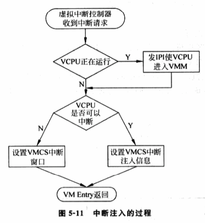
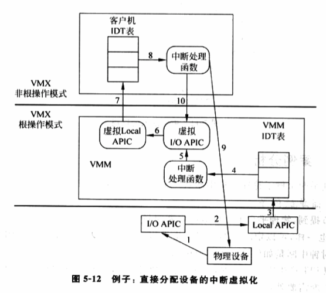

<!-- @import "[TOC]" {cmd="toc" depthFrom=1 depthTo=6 orderedList=false} -->

<!-- code_chunk_output -->

- [1. 概述](#1-概述)
- [2. 虚拟 PIC](#2-虚拟-pic)
- [3. 虚拟 I/O APIC](#3-虚拟-io-apic)
- [4. 虚拟 Local APIC](#4-虚拟-local-apic)
- [5. 中断采集](#5-中断采集)
- [6. 中断注入](#6-中断注入)
- [7. 中断过程示例](#7-中断过程示例)
  - [7.1. 虚拟设备](#71-虚拟设备)
  - [7.2. 直通设备](#72-直通设备)
- [8. 硬件增强](#8-硬件增强)

<!-- /code_chunk_output -->

# 1. 概述

# 2. 虚拟 PIC

**PIC** 本质是芯片组的**一个设备**. 因此, 虚拟 PIC 的实现, 根据 PIC 硬件规范, 在软件上模拟出虚拟 PIC, 为虚拟机提供和物理 PIC 一样的接口.

**虚拟 PIC** 首先要虚拟出和物理 PIC 一样的软件接口. PIC 为软件提供了如下接口用于操作 PIC.

- 4 个**初始化命令字**(`Initialization Command Words`): `ICW1 ~ 4`, 用于初始化操作;

- 3 个**操作命令字**(`Operation Command Words`): `OCW1 ~ 3`, 用于操作 PIC.

在 IA32 平台上, PIC 的 `ICW 1 ~ 4` 和 `OCW 1 ~ 3` 都是通过 **I/O 端口**访问的. 因此, `VT-x` 下, VMM 很容易就可以实现这些接口的虚拟化. 具体而言, 这些接口是通过 **I/O 端口 0x20/0x21 以及 0xA0/0xA1** 来访问, 因此, **VMM** 可以设置 **VMCS 的 I/O bitmap** 中的**相应位**, 使得**客户机为访问这些端口**时发生 **VM\-Exit**, 便于 VMM 截获.

VMM 在截获这些接口访问后, 下一步就是按 PIC 硬件规范对这些接口的定义, 实现相应的逻辑. 举例, 接口 OCW1 的功能用于操作 IMR 寄存器, 控制指定中断是否被屏蔽. 因此, VMM 会分析客户机的 OCW1 命令, 判断是对哪个中断进行屏蔽或解除屏蔽, VMM 继而在**内部逻辑**中**记录指定中断是否被屏蔽**. 若被屏蔽, 相应的虚拟中断就不会被提交.

此外, **虚拟 PIC** 还要**为虚拟设备提供接口**用于发送中断请求. 这在物理上表现为 **I/O 设备**和 **PIC** 之间的电气连线, 在虚拟环境中由于设备和 PIC 都是虚拟的, 因而两者的交互表现为**直接的函数调用**.

**虚拟 PIC** 最终会向**虚拟 Local APIC** 提交中断, 这在**物理**上表现为 **PIC 和 CPU 之间的电气连线**. 同样, 在**虚拟环境**中由于设备和 PIC 都是虚拟的, 因而两者交互表现为**直接的函数调用**.

虚拟 PIC 接口的完整实现很复杂, VMM 通常会为虚拟 PIC 维护一个内部的状态机来驱动虚拟 PIC 的行为. 虚拟 PIC 具体实现可参照 `KVM/Xen` 实现.

# 3. 虚拟 I/O APIC

PIC 值适用于单 CPU 系统, 对于**多 CPU**, 必须通过**I/O APIC 来发送中断**. 因此, 对于**多 CPU 虚拟平台**, 必须实现**虚拟 I/O APIC**.

和**虚拟 PIC 的实现**类似, **虚拟 I/O APIC**在**VMM**中也是**一个虚拟设备！！！**. VMM 根据其硬件规范来实现虚拟设备. **Intel ICH 系列 Datasheet**定义了**I/O APIC 的软件接口**.

和 PIC 类似, 虚拟 I/O APIC 也会根据硬件规范实现相应的接口内部逻辑, 也会为虚拟设备提供接口用来发送中断请求. **虚拟 I/O APIC**最后也是**通过虚拟 Local APIC 的接口**来**提交中断**.

OS 通过 **MMIO 方式**访问 **I/O APIC**, 因此, VMM 的实现和虚拟 PIC 有所不同. VMM 会将**虚拟 IO APIC 的 MMIO**地址**对应的页表项**置为"**该页不存在**", 因此, 当**客户机**访问**相应的 MMIO 寄存器**时, 就会发生原因为 **Page Fault 的 VM\-Exit**. 这样, VMM 就能**截获客户机对虚拟 I/O APIC 的访问**, 进而正确地虚拟化.

虚拟 I/O APIC 的具体实现可参考 KVM 或 XEN 的实现.

# 4. 虚拟 Local APIC

Local APIC 是 CPU 上一个内部部件, 负责外部中断. 此外, 还提供了产生中断的功能, 例如, Local APIC Timer Interrupt 和处理器间中断 IPI. Intel 手册的第 9 章 ADVANCED PROGRAMMABLE INTERRUPT CONTROLLOR(APIC)详细定义了 Local APIC 的规范.

和虚拟 PIC、虚拟 I/O APIC 一样, 虚拟 Local APIC 在 VMM 中被实现为一个模拟设备. 和 I/O APIC 一样, Local APIC 提供给软件的接口是**MMIO 寄存器**, 因此, **VMM**也通过**Page Fault 截获**并模拟.

虚拟 Local APIC 的最主要功能是向 VCPU 注入中断. 在 VT\-x 下, **虚拟 Local APIC** 可借助 **VM\-Entry 事件注入机制简单实现这个功能！！！**. 当然, 具体实现比较复杂.

# 5. 中断采集

上面介绍了**虚拟机中断架构**的**各个组件**, 下面介绍**这些组件如何一起工作**为客户机**产生虚拟中断！！！**. 这个过程包括两部分: **中断采集**和**中断注入**.

中断采集指如何将**虚拟机的设备中断**请求送到**虚拟中断控制器**. 在虚拟环境里, **客户机中断**有两种可能来源.

1) 来自软件模拟的**虚拟设备**, 例如一个**模拟出来的串口**, 可以产生一个虚拟中断.

2) 来自**直接分配**给客户机的**物理设备的中断**, 例如一块物理网卡, 可产生一个真正的物理中断.

对于**虚拟设备**, 是软件模块. 当**虚拟设备**要发出中断请求时, 可通过**虚拟中断控制器**提供的**接口函数发出中断请求**, 例如使用虚拟 PIC 或虚拟 I/O APIC 提供的接口.

直接分配要复杂. 一个物理设备被直接分配给一个虚拟机, 意味当设备发生中断, 该**物理中断的处理函数位于客户 OS！！！**中. 而在虚拟化环境中, **物理中断控制器由 VMM 控制(！！！这是关键, 直接分配设备也是通过物理中断控制器发中断！！！因为物理连接就是物理中断控制器！！！**), 且**中断发生**时**CPU 的 IDT 表**通常**不是客户机的 IDT 表！！！**, 因此, **物理中断**需要**首先由 VMM 的中断处理函数接收**, 再**注入给客户机**.

下面通过例子概要介绍物理中断采集过程.

1) 物理设备发生中断, 假定设备 IRQ 号为 14, 对应的中断向量号为 0x41.

2) **CPU 收到中断**, 执行**标准中断处理流程**, 例如应答 PIC、中断门自动屏蔽等. 最后, CPU 跳转到**物理机 IDT 表**中 **0x41 表项**所指定的**处理函数**. 注意, 该**处理函数是 VMM 提供**的, 目的是**将物理中断注入给客户机**.

3) VMM 的**中断处理函数！！！**对中断检查, 发现该中断是**分配给客户机**的设备产生的, **VMM！！！**调用**虚拟中断控制器的接口函数！！！**, 将**中断发送给虚拟 Local APIC**. 之后, **虚拟 Local APIC！！！**就会在适当时候**将该中断注入给客户机**, 由**客户 OS 处理函数**处理.

4) 在将**中断事件通知客户机**后, VMM 会进行后续处理, 例如**开中断**等.

上述过程中, 有两点信息是需要创建客户机时候提供.

1) **设备的分配信息**. 第 3) 步中, **VMM**必须了解, **中断 0x41**对应的**设备是否分配**给了虚拟机以及**哪个虚拟机**. 通常, 这是**创建虚拟机时候**由**用户决定**, 用户通过**管理工具**通知 VMM**相关的绑定信息**.

2) **设备在客户机平台上的管脚信息**. 第 3) 步中, **VMM**在**调用虚拟中断控制器的接口函数**时, 需要**提供 IRQ 号**, 即**管脚号**. 需要注意的是, **虚拟中断控制器的输入管脚！！！** 与 **物理中断控制器的输入管脚！！！** 不一定相同. **虚拟中断控制器的输入管脚**是由 VMM 所提供的虚拟平台决定, **通常创建客户机时候确定**. **VMM 负责两者之间的转换**.

# 6. 中断注入

负责将**虚拟中断控制器**采集到的中断请求**按照其优先级**, **逐一注入**客户机虚拟处理器. 这里有**两个问题**:

- 首先是**如何取得需要注入的最高优先级中断的相关信息**,
- 其次是**如何才能将一个中断注入客户机 VCPU**.

第一个, **虚拟中断控制器**会负责将中断按**优先级排序**, **VMM**只需要调用**虚拟中断控制器**提供的**接口函数**, 就可以获得**当前最高优先级中断信息**.

第二个, **虚拟 Local APIC**提供了**将中断注入客户机 VCPU**最基本的功能. **VMM**可调用虚拟 Local APIC**接口**实现中断注入. 这里, VMM 的虚拟中断注入逻辑需要考虑下面几个问题.

1) 目标 VCPU 正在物理 CPU 上运行, 如何注入中断? 前面说过, **只能在 VM\-Entry 时候将中断注入客户机！！！**, 因此为保证中断的及时注入, 需要**强迫 VCPU 发生 VM\-Exit**, 这时就可以在 VM\-Entry 返回客户机时候注入中断. 常用的**使客户机发生 VM\-Exit 的方法**是**向 VCPU 所在物理 CPU 发送 IPI 中断！！！**.

2) 如果**目标 VCPU 目前无法中断**, 例如 VCPU 目前正处于关中断状态(客户机 EFLAGS.IF 为 0), 如何注入中断? Intel VT\-x 提供了一个解决机制, 即使用**中断窗口(Interrupt Windows**). 该机制通过设置**VMCS 的一个特定字段**, 告诉物理 CPU, 其当前运行的客户机 VCPU 有一个中断需要注入. 一旦**客户机 VCPU**开始**可以接受中断**, 例如**进入开中断状态**, **物理 CPU**会**主动触发 VM\-Exit**, 从**客户机陷入到 VMM**中, **虚拟中断注入模块**就可以**注入等待的中断**了.

3) **什么时候**触发中断注入? 通常方法是, 当**中断采集**逻辑调用**虚拟中断控制器接口**请求发出中断后, **虚拟中断控制器**会根据**内部状态**, 例如虚拟 IMR/ISR 寄存器的值, 来决定是否需要注入中断给客户机. 其判断过程和物理中断控制器判断是否提交中断给 CPU 一样.

图 5\-11 给出中断注入逻辑过程

# 7. 中断过程示例

举两个例子论述虚拟中断从产生到注入的全过程

## 7.1. 虚拟设备

**物理平台**上**可编程时钟 PIT** 会**定期产生时钟中断**. **VMM 模拟的虚拟 PIT** 也一样, 可以定时为客户机产生时钟中断.

1) **虚拟 PIT** 产生**中断请求**时, 调用**虚拟中断控制器**提供的**接口**通知**虚拟 PIC/IOAPIC**, 自己有一个中断.

2) **虚拟 PIC/IOAPIC** 记录这个**中断请求**, 并**检查内部寄存器**, 如 **IMR、IRR 和 ISR** 等, 以决定**是否需要将中断注入到客户机**. 如果**不是**, 将这个**中断请求保存在虚拟 PIC/IOAPIC 的内部逻辑**中. 当**虚拟 PIC 内部状态改变**后(通常是**客户机写 PIC/IOAPIC 的寄存器时**), **虚拟 PIC/IOAPIC** 会**检查内部**是否有**等待处理的中断请求并重复这个过程**.

3) 如果此时需要**注入中断**, **调用中断注入逻辑**

4) **VMM** 检查**客户机 VCPU 是否正在运行**, 如果是, 则发一个**IPI 强制其进入 VMM 上下文！！！**.

5) 在**客户机 VCPU 再运行前**, **VMM 会检查！！！**发现**该 VCPU 有中断需要注入**, 接着 VMM 会**检查当前客户机 VCPU 是否能够被注入中断**. 如果能, 使用**虚拟中断控制器提供的接口**, 获取最高优先级中断的信息, 设置好 VMCS 中的相应字段, 使当 VCPU 投入运行时自动去执行相应矢量号的中断处理函数. 否则, 设置**中断窗口**, 等待下次 VM\-Exit 之后再注入.

## 7.2. 直通设备

被**直接分配给虚拟机的物理设备发生中断**时, VMM 需要将该中断注入给对应的客户机.

假定物理设备产生中断, **设备中断管脚**连接到**IOAPIC**的**管脚 0x12**, 对应中断重定向的**矢量号为 0x41**, 并假定系统使用物理 APIC, 客户机使用虚拟 APIC. 同时, 物理设备中断发生时, 物理 CPU 的中断是开启的.

图 5\-12 给出该例子的流程.

1) **物理设备**发生**中断**, 将中断发送给**物理 I/O APIC 的管脚 0x12**.

2) **物理 I/O APIC** 收到后, 将**管脚 0x12** 转化为**中断向量 0x41** 发送到 **Local APIC**.

3) **Local APIC**将**中断 0x41** 注入到 **CPU**, CPU 跳转到**IDT 表**中 **0x41 表项**指定的**处理函数**. 同时, **Local APIC** 的 **ISR 寄存器**对应 **0x41 的位**被置 1, 后面的等于或低于 0x41 的中断被屏蔽.

4) **VMM 相关中断处理函数被执行**.

5) **中断处理函数**检查发现**这个中断**是属于**客户机的设备产生的中断**, 故调用**虚拟中断控制器！！！的接口函数**. 在**将中断事件注入客户机**以后, **VMM** 通过置一**物理 IOAPIC 第 0x12 个 RTE 的屏蔽位！！！**, **屏蔽后续的物理中断**. VMM 向**物理 Local APIC**写入 **EOI**, 以**清掉 Local APIC 的 ISR 寄存器 0x41 位**, 从而其它中断也可以被接受.

VMM 处理函数对物理 APIC 的操作到此结束, 下面是虚拟 APIC 工作的流程.

1) **虚拟的 IOAPIC 中断控制器**调用**虚拟的 Local APIC 的接口函数**, 并将**虚拟 IOAPIC** 中**相关矢量号传入**. **虚拟 Local APIC** 的 **ISR 相关 bit 位被置一**.

2) **虚拟的 Local APIC** 通过**中断注入逻辑模块**将**中断注入到客户机**. 中断注入逻辑模块, 见前面.

3) **客户机**执行相关**中断处理函数**

4) 客户机中断处理函数**处理物理设备的中断**

5) 客户机向**虚拟 Local APIC** 写入 **EOI**, EOI 操作被 **VMM 截获！！！**. 虚拟 Local APIC 的 ISR 位被清掉, 同时, 虚拟 Local APIC 通知 VMM 客户已经完成中断 0x21 的处理, VMM 清除物理 IOAPIC 第 0x12 个 RTE 的屏蔽位.

# 8. 硬件增强

Intel 平台叫 APICv.

AMD 平台叫 AVIC, 且不支持 x2APIC.
