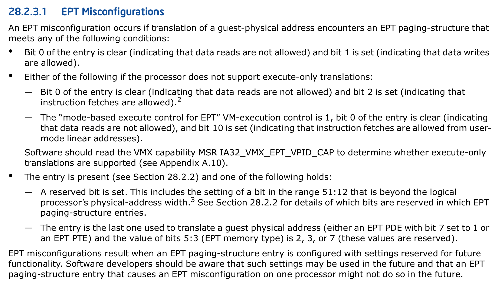

# MMIO 和 PIO 的区别

I/O 作为 CPU 和外设交流的一个渠道, 主要分为两种, 一种是 Port I/O, 一种是 MMIO(Memory mapping I/O).

前者就是我们常说的 I/O 端口, 它实际上的应该被称为 I/O 地址空间.  对于 x86 架构来说, 通过 IN/OUT 指令访问. PC 架构一共有 65536 个 8bit 的 I/O 端口, 组成 64KI/O 地址空间, 编号从 0~0xFFFF. 连续两个 8bit 的端口可以组成一个 16bit 的端口, 连续 4 个组成一个 32bit 的端口. I/O 地址空间和 CPU 的物理地址空间是两个不同的概念, 例如 I/O 地址空间为 64K, 一个 32bit 的 CPU 物理地址空间是 4G.

MMIO 占用 CPU 的物理地址空间, 对它的访问可以使用 CPU 访问内存的指令进行. 一个形象的比喻是把文件用 mmap()后, 可以像访问内存一样访问文件、同样, MMIO 是用访问内存一样的方式访问 I/O 资源, 如设备上的内存. MMIO 不能被 cache(有特殊情况, 如 VGA).

Port I/O 和 MMIO 的主要区别在于:

(1) 前者不占用 CPU 的物理地址空间, 后者占有(这是对 x86 架构说的, 一些架构, 如 IA64, port I/O 占用物理地址空间).

(2) 前者是顺序访问. 也就是说在一条 I/O 指令完成前, 下一条指令不会执行. 例如通过 Port I/O 对设备发起了操作, 造成了设备寄存器状态变化, 这个变化在下一条指令执行前生效. uncache 的 MMIO 通过 uncahce memory 的特性保证顺序性.

(3) 使用方式不同.

由于 port I/O 有独立的 64KI/O 地址空间, 但 CPU 的地址线只有一套, 所以必须区分地址属于物理地址空间还是 I/O 地址空间. 早期的 CPU 有一个 M/I 针脚来表示当前地址的类型, 后来似乎改了. 刚才查了一下, 叫 request command line, 没搞懂, 觉得还是一个针脚.

IBM PC 架构规定了一些固定的 I/O 端口, ISA 设备通常也有固定的 I/O 端口, 这些可以通过 ICH(南桥)的规范查到. PCI 设备的 I/O 端口和 MMIO 基地址通过设备的 PCI configure space 报告给操作系统, 这些内容以前的帖子都很多, 可以查阅一下.

通常遇到写死在 I/O 指令中的 I/O 端口, 如果不是 ISA 设备, 一般都是架构规定死的端口号, 可查阅规范.

# qemu-kvm 中的 MMIO

我们知道 X86 体系结构上对设备进行访问可以通过 PIO 方式和 MMIO(Memory Mapped I/O)两种方式进行,  那么`QEMU-KVM`具体是如何实现设备 MMIO 访问的呢?

MMIO 是直接将设备 I/O 映射到物理地址空间内, 虚拟机物理内存的虚拟化又是通过 EPT 机制来完成的,  那么模拟设备的 MMIO 实现也需要利用 EPT 机制. 虚拟机的 EPT 页表是在`EPT_VIOLATION`异常处理的时候建立起来的,  对于模拟设备而言访问 MMIO 肯定要触发`VM_EXIT`然后交给 QEMU/KVM 去处理, 那么怎样去标志 MMIO 访问异常呢? 查看 Intel SDM 知道这是通过利用`EPT_MISCONFIG`来实现的. 那么`EPT_VIOLATION`与`EPT_MISCONFIG`的区别是什么?

EXIT_REASON_EPT_VIOLATION is similar to a "page not present" pagefault.

EXIT_REASON_EPT_MISCONFIG is similar to a "reserved bit set" pagefault.

EPT_VIOLATION 表示的是对应的物理页不存在, 而 EPT_MISCONFIG 表示 EPT 页表中有非法的域. 

那么这里有２个问题需要弄清楚. 

## KVM 如何标记 EPT 是 MMIO 类型 ?

`hardware_setup`时候虚拟机如果开启了 ept 支持就调用`ept_set_mmio_spte_mask`初始化 shadow_mmio_mask,  设置 EPT 页表项**最低 3 bit**为: `110b`就会触发 ept_msconfig(110b 表示该页**可读可写**但是**还未分配**或者**不存在**, 这显然是一个错误的 EPT 页表项).

```cpp
#define VMX_EPT_WRITABLE_MASK                   0x2ull
#define VMX_EPT_EXECUTABLE_MASK                 0x4ull

/* The mask to use to trigger an EPT Misconfiguration in order to track MMIO */
#define VMX_EPT_MISCONFIG_WX_VALUE              (VMX_EPT_WRITABLE_MASK |       \
                                                 VMX_EPT_EXECUTABLE_MASK)


static void ept_set_mmio_spte_mask(void)
{
        /*
         * EPT Misconfigurations can be generated if the value of bits 2:0
         * of an EPT paging-structure entry is 110b (write/execute).
         */
        kvm_mmu_set_mmio_spte_mask(VMX_EPT_MISCONFIG_WX_VALUE, 0);
}
```

同时还要对 EPT 的一些特殊位进行标记来标志该 spte 表示 MMIO 而不是虚拟机的物理内存, 例如这里

(1)set the special mask:  SPTE_SPECIAL_MASK. 

(2)reserved physical address bits:  the setting of a bit in the range `51:12` that is beyond the logical processor's physic

关于 EPT_MISCONFIG 在 SDM 中有详细说明. 



我们可以通过以两个函数对比一下 kvm 对 MMIO pte 的处理:

```cpp
void kvm_mmu_set_mmio_spte_mask(u64 mmio_value, u64 access_mask)
{
        BUG_ON((u64)(unsigned)access_mask != access_mask);
        WARN_ON(mmio_value & (shadow_nonpresent_or_rsvd_mask << shadow_nonpresent_or_rsvd_mask_len));
        WARN_ON(mmio_value & shadow_nonpresent_or_rsvd_lower_gfn_mask);
        shadow_mmio_value = mmio_value | SPTE_MMIO_MASK;
        shadow_mmio_access_mask = access_mask;
}
EXPORT_SYMBOL_GPL(kvm_mmu_set_mmio_spte_mask);

static void kvm_set_mmio_spte_mask(void)
{
        u64 mask;

        /*
         * Set a reserved PA bit in MMIO SPTEs to generate page faults with
         * PFEC.RSVD=1 on MMIO accesses.  64-bit PTEs (PAE, x86-64, and EPT
         * paging) support a maximum of 52 bits of PA, i.e. if the CPU supports
         * 52-bit physical addresses then there are no reserved PA bits in the
         * PTEs and so the reserved PA approach must be disabled.
         */
        if (shadow_phys_bits < 52)
                mask = BIT_ULL(51) | PT_PRESENT_MASK;
        else
                mask = 0;

        kvm_mmu_set_mmio_spte_mask(mask, ACC_WRITE_MASK | ACC_USER_MASK);
}
```

KVM 在建立 EPT 页表项之后设置了这些标志位再访问对应页的时候会触发`EPT_MISCONFIG`退出了, 然后调用`handle_ept_misconfig`-->`handle_mmio_page_fault`来完成 MMIO 处理操作.

```cpp
KVM 内核相关代码:
handle_ept_misconfig --> kvm_emulate_instruction --> x86_emulate_instruction --> x86_emulate_insn
writeback
    --> segmented_write
        --> emulator_write_emulated
            --> emulator_read_write
              --> emulator_read_write_onepage
                --> ops->read_write_mmio [write_mmio]
                  --> vcpu_mmio_write
                    --> kvm_io_bus_write
                      --> __kvm_io_bus_write
                        --> kvm_iodevice_write
                          --> dev->ops->write [ioeventfd_write]

最后会调用到 ioeventfd_write, 写 eventfd 给 QEMU 发送通知事件
/* MMIO/PIO writes trigger an event if the addr/val match */
static int
ioeventfd_write(struct kvm_vcpu *vcpu, struct kvm_io_device *this, gpa_t addr,
                int len, const void *val)
{
        struct _ioeventfd *p = to_ioeventfd(this);

        if (!ioeventfd_in_range(p, addr, len, val))
                return -EOPNOTSUPP;

        eventfd_signal(p->eventfd, 1);
        return 0;
}
```

## QEMU 如何标记设备的 MMIO

这里以 e1000 网卡模拟为例, 设备初始化 MMIO 时候时候注册的 MemoryRegion 为 IO 类型(不是 RAM 类型). 

```cpp
static void
e1000_mmio_setup(E1000State *d)
{
    int i;
    const uint32_t excluded_regs[] = {
        E1000_MDIC, E1000_ICR, E1000_ICS, E1000_IMS,
        E1000_IMC, E1000_TCTL, E1000_TDT, PNPMMIO_SIZE
    };
    // 这里注册 MMIO, 调用 memory_region_init_io, mr->ram = false！！！
    memory_region_init_io(&d->mmio, OBJECT(d), &e1000_mmio_ops, d,
                          "e1000-mmio", PNPMMIO_SIZE);
    memory_region_add_coalescing(&d->mmio, 0, excluded_regs[0]);
    for (i = 0; excluded_regs[i] != PNPMMIO_SIZE; i++)
        memory_region_add_coalescing(&d->mmio, excluded_regs[i] + 4,
                                     excluded_regs[i+1] - excluded_regs[i] - 4);
    memory_region_init_io(&d->io, OBJECT(d), &e1000_io_ops, d, "e1000-io", IOPORT_SIZE);
}
```

对于 MMIO 类型的内存 QEMU 不会调用 kvm_set_user_memory_region 对其进行注册,  那么 KVM 会认为该段内存的 pfn 类型为 KVM_PFN_NOSLOT,  进而调用 set_mmio_spte 来设置该段地址对应到 spte,  而该函数中会判断 pfn 是否为 NOSLOT 标记以确认这段地址空间为 MMIO. 

```cpp
static bool set_mmio_spte(struct kvm_vcpu *vcpu, u64 *sptep, gfn_t gfn,
              kvm_pfn_t pfn, unsigned access)
{
    if (unlikely(is_noslot_pfn(pfn))) {
        mark_mmio_spte(vcpu, sptep, gfn, access);
        return true;
    }

    return false;
}
```

# 总结

MMIO 是通过设置 spte 的保留位来标志的. 

* 虚拟机内部第一次访问 MMIO 的 gpa 时, 发生了 EPT_VIOLATION 然后 check gpa 发现对应的 pfn 不存在(QEMU 没有注册), 那么认为这是个 MMIO, 于是 set_mmio_spte 来标志它的 spte 是一个 MMIO. 
*  后面再次访问这个 gpa 时就发生 EPT_MISCONFIG 了, 进而愉快地调用 handle_ept_misconfig -> handle_mmio_page_fault -> x86_emulate_instruction 来处理所有的 MMIO 操作了. 