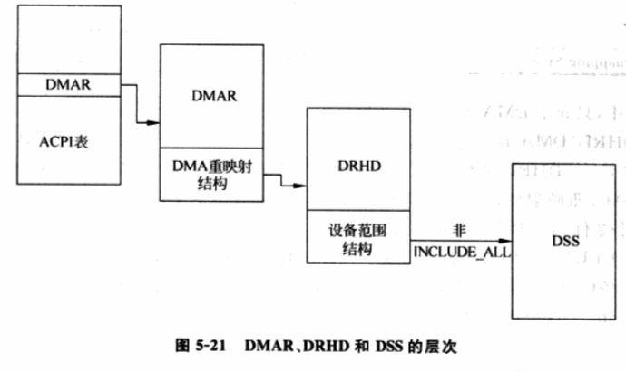

<!-- @import "[TOC]" {cmd="toc" depthFrom=1 depthTo=6 orderedList=false} -->

<!-- code_chunk_output -->

- [1. 概述](#1-概述)
  - [1.1. I/O 虚拟化的指标](#11-io-虚拟化的指标)
    - [1.1.1. 高性能的挑战](#111-高性能的挑战)
    - [1.1.2. 通用性的挑战](#112-通用性的挑战)
  - [1.2. 问题的解决](#12-问题的解决)
- [2. VT-d 技术](#2-vt-d-技术)
  - [2.1. DMA 重映射](#21-dma-重映射)
    - [2.1.1. VT-d 中的 PCI 总线架构](#211-vt-d-中的-pci-总线架构)
      - [2.1.1.1. BDF 标识 DMA 操作由哪个设备发起](#2111-bdf-标识-dma-操作由哪个设备发起)
      - [2.1.1.2. 根条目](#2112-根条目)
      - [2.1.1.3. 上下文条目](#2113-上下文条目)
    - [2.1.2. DMA 重映射过程](#212-dma-重映射过程)
  - [2.2. I/O 页表](#22-io-页表)
  - [2.3. VT-d 硬件缓存](#23-vt-d-硬件缓存)
  - [2.4. VT-d 硬件的探测](#24-vt-d-硬件的探测)
- [3. AMD IOMMU](#3-amd-iommu)

<!-- /code_chunk_output -->

# 1. 概述

**软件虚拟化**章节使用**软件**方式实现**I/O 虚拟化**, 目前流行的"**设备模拟**"和"**类虚拟化**"都有各自的优点, 以及与生俱来的缺点. **前者通用性强**, 但**性能不理想**; 后者**性能不错**, 却**不通用**.

Intel 的 **VT-d** 技术(Intel(R) Virtualization Technology for Directed I/O), 以帮助实现**通用性强**、**性能高**的**新型 I/O 虚拟化技术**.

## 1.1. I/O 虚拟化的指标

介绍 VT-d 之前, 先量化评价**I/O 虚拟化的两个指标** -- **性能**和**通用性**.

* **性能**, 越接近**无虚拟环境的 I/O 性**能越好;

* **通用性**: 主要和**完全虚拟化**挂钩, 使用的**I/O 虚拟化**技术对**客户机 OS 越透明**(客户机 OS 感知不到 I/O 虚拟化技术), 通用性越强.

VT-d 如何实现这两个指标呢?

- **高性能**, 最直接方法就是让**客户机直接使用真实的硬件设备**, 这样**客户机的 I/O 路径**几乎和**无虚拟化的 I/O 路径相同**;
- **通用性**, 就得用**全虚拟化方法**, 让**客户机 OS** 能使用**自带驱动**发现设备！！！、操作设备！！！.

### 1.1.1. 高性能的挑战

实现这些目标面临的挑战.

对于**高性能**, **客户机直接操作设备**的挑战:

1) 如何让**客户机直接**访问**设备真实的 I/O 地址空间**(包括**MMIO**和**端口 IO**)

2) 如何让**设备的 DMA 操作直接访问到客户机的内存空间**? 设备不关心系统中运行的是虚拟机还是真实 OS, 它只用**驱动**给提供的**物理地址做 DMA**.

### 1.1.2. 通用性的挑战

**通用性**面临的问题和1) 类似, 要有一种方法将**设备的 I/O 地址空间！！！**告诉给**客户机 OS！！！**, 并让**驱动！！！**能够利用**这些地址！！！**访问到**真实的 I/O 地址空间！！！**.

## 1.2. 问题的解决

对于第一个问题, **只需一种机制**就能够把**设备的 I/O 地址空间**告诉给**客户机操作系统**, 并让**驱动**通过这**些地址**访问到**设备真实的 I/O 地址空间**. **VT-x！！！**已经能够解决**第一个问题**, 可以允许**客户机直接访问物理的 I/O 空间！！！**.

**VT-d** 让**第二个问题**解决成为可能, 它提供了**DMA 重映射技术！！！**, 帮助 VMM 的实现者达成目标.

# 2. VT-d 技术

VT-d 通过在**北桥(MCH**)引入**DMA 重映射硬件**, 以提供 **设备重映射！！！** 和 **设备直接分配！！！** 的功能.

在**启用 VT-d**的平台上, **设备的所有 DMA 传输！！！**都会被**DMA 重映射硬件截获！！！**. 根据**设备对应的 I/O 页表！！！**, **硬件**可以对**DMA 中的地址进行转换！！！**, 使设备**只能访问到规定的内存！！！**.

使用 VT-d 后, 设备访问内存的架构如图 5-16 所示.

图 5-16

- (a)是**没有 VT-d**的平台, 此时**设备的 DMA**能够访问**整个物理内存**.

- (b)是**启用 VT-d**的情况, 此时, 设备**只能访问指定的物理内存**. 这和**使用页表**将进程的**线性地址空间**映射到**指定物理内存区域**的思想一样, 不过对象换成了设备.

注意: (b)中的**DMA Remapping Hardware 硬件**的位置和作用, 它会**捕获设备的 DMA 操作**

注: 不仅仅是**DMA 重映射**, Intel VT-d 为虚拟机监控器提供了几个重要的能力: **I/O 设备分配**、**DMA 重定向**、**中断重定向**、**中断投递**等.

对应的 AMD 是 IOMMU 技术

下面介绍 VT-d 中核心的**DMA 重映射技术**以及**如何探测 DMA 重映射硬件**, **设备分配**内容在下一节介绍. `VT-d` 完整的论述参考"**Intel(R) Virtualization Technology for Directed I/O Architecture Specification**".

## 2.1. DMA 重映射

最主要的难题是**DMA 问题**.

**设备**对系统中运行的软件一无所知, 在**进行 DMA**时, **设备唯一！！！** 做的是**向(从)驱动程序告知的"物理地址"复制(读取)数据**.

内存虚拟化中可知, **虚拟机环境**下**客户机使用的是 GPA**, 则**客户机！！！** 的**驱动直接操作设备时也是用 GPA！！！**.

而**设备进行 DMA**, 需要使用 **MPA！！！**, 如何在 DMA 时**将 GPA 转换成 MPA**成了关键问题. 通常, **无法通过软件方法截获 DMA 操作**, `VT-d`提供的 DMA 重映射就是为了解决这个问题.

> MPA = HPA

### 2.1.1. VT-d 中的 PCI 总线架构

首先, 我们介绍 VT-d 中 PCI 总线架构.

**VT-d**提供了**三种数据结构**来描述**PCI 架构**, 分别是**设备标识符(BDF**)、**根条目(Root Entry**)和**上下文条目(Context Entry**).

#### 2.1.1.1. BDF 标识 DMA 操作由哪个设备发起

BDF(设备标识符)可以看做是**设备**在**PCI 总线**上的**地址**, 通过**BDF！！！**可索引到**任何一条总线上的任何一设备！！！**.

同样, **DMA 的总线传输！！！** 中包含一个 **BDF** 以 **标识该 DMA 传输是由哪个设备发起！！！** 的.

BDF 结构:

- 8 位的 **Bus** 字段代表设备所在的**总线号**, 故系统中**最多有 256 条总线**;
- Device 字段表示**设备号**, 代表 Bus 所表示**总线上的某个设备**;
- Function 字段表示**功能号**, 标识**具体设备上的某个功能单元**, 我们称为**逻辑设备**.

在**VT-d**中, **标识 DMA 操作发起者！！！**的结构称为**源标识符(Source Identifier！！！**).

对于**PCI 总线！！！**, **VT-d！！！** 使用 **BDF！！！** 作为**源标识符！！！**, 在下面的内容中提到的 BDF 均代表源标识符. 其格式在第 2 章给出, 也可参考"Intel(R) Virtualization Technology for Directed I/O Architecture Specification"的 3.2.1 获取详细内容.

#### 2.1.1.2. 根条目

用于**描述 PCI 总线**, **每条总线！！！对应一个根条目！！！**.

由于 PCI 架构支持**最多 256 条总线**, 故最多可以有**256 个根条目！！！**.

这些根条目一起构成一张表, 称为**根条目表(Root Entry Table**).  有了根条目表, 系统中**每一条总线都会被描述到！！！**.

根条目结构:

主要字段如下.

- P: 存在位. 为 0 条目无效, 来自**该条目所代表总线**的**所有 DMA 传输被屏蔽！！！**. 为 1 代表该条目有效.
- **CTP(Context Table Pointer, 上下文表指针**): 指向**上下文条目表**.

#### 2.1.1.3. 上下文条目

用于描述**某个具体的 PCI 设备！！！**, 这里的 PCI 设备指**逻辑设备**.

**一条 PCI 总线**上最多有**256 个设备**, 故有**256 个上下文条目**, 它们一起组成上下文条目表(Context Entry Table).

通过**上下文条目表**, 可描述**某条 PCI 总线上所有设备！！！**. 图 5-18 是上下文条目的结构.

上下文条目的结构:

主要字段如下.

- P: 存在位. 为 0 时条目无效, 来自该条目所代表设备的所有 DMA 传输被屏蔽. 为 1 时, 表示条目有效.
- T: 类型, 表示 ASR 字段所指数据结构的类型. 目前, VT-d 中该字段为 0, 表示多级页表.
- **ASR(Address Space Root**, 地址空间根): 实际是一个指针, 指向 T 字段所代表的数据结构, 目前该字段指向一个**I/O 页表**(见后面).
- **DID(Domain ID, 域标识符**): VT-d 技术中 Domain 的具体含义参看`"Intel(R) Virtualization Technology for Directed I/O Architecture Specification"`的 `3.1`. 在此, 可理解为**本文中的客户机**, **DID**可看作用于**唯一标识该客户机的标识符！！！**, 例如 Guest ID.

其余字段具体解释参见"Intel(R) Virtualization Technology for Directed I/O Architecture Specification"的 3.2.3.

根条目表和上下文条目表一起构成图 5-19 所示的两级结构.

### 2.1.2. DMA 重映射过程

当 **DMA 重映射硬件捕获一个 DMA 传输！！！** 时,

1. 通过其中 BDF 的 **bus** 字段索引**根条目表**, 可以得到产生该 DMA 传输的**总线**对应的**根条目**.
2. 由根条目的 CTP 字段获得上下文条目, 用 BDF 中的 `{dev: func}` 索引该表, 可获得发起 DMA 传输的**设备**对应的**上下文条目**.
3. 从上下文条目的**ASR 字段**, 可寻址到**该设备**对应的**I/O 页表**, 此时, DMA 重映射硬件就可以做地址转换了.

通过这样的两级结构, **VT-d 技术**可覆盖平台上**所有的 PCI 设备**, 并对它们的 DMA 传输进行地址转换.

## 2.2. I/O 页表

I/O 页表是**DMA 重映射硬件**进行**地址转换**的**核心**.

它的思想和 CPU 中 paging 机制的页表类似, 与之不同是:
* CPU 通过 CR3 寄存器获得当前系统使用的页表的基地址
* VT-d 需要借助根条目和上下文条目获得**设备对应的 I/O 页表**.

VT-d 也使用**硬件查页表机制**, **整个地址转换**过程**对于设备、上层软件都是透明！！！** 的.  与 CPU 使用的页表相同,  I/O 页表也支持**几种粒度的页面大小**,  其中最典型的 4K 页面地址转换过程如图 5-20.

感觉上图有点问题, 查看 Intel 手册, 下面是 4K、2M、1G 页面的转换过程,  看得出来,  和 paging 机制页表类似

通过 I/O 页表中 GPA 到 MPA 的映射, DMA 重映射硬件可将 DMA 传输中的**GPA 转换成 MPA**, 从而使设备直接访问指定客户机的内存区域. 关于 I/O 页表详细信息参见 "Intel(R) Virtualization Technology for Directed I/O Architecture Specification" 的 3.3.1 节.

## 2.3. VT-d 硬件缓存

**VT-d**使用了大量缓存. 其中, 和地址转换相关的缓存被称为**IOTLB**, 它和 CPU 中的 TLB 功能一样. 此外, 对于上下文条目, **VT-d 硬件提供了上下文条目表(！！！不仅仅是内存??**). 当软件修改 I/O 页表、上下文条目表后, 要负责对这些缓存进行刷新.

VT-d 对两种缓存分别提供了三种粒度的刷新操作.

1) 全局刷新(Global Invalidation): 整个 IOTLB 或上下文条目表中所有条目无效.

2) 客户机粒度刷新(`Domain-Selective Invalidation`): IOTLB 中或上下文条目表中和指定客户机相关的地址条目或上下文条目无效

3) 局部刷新: 对于 IOTLB, 称为 `Domain vPage-Selective Invalidation`, 指定客户机某一地址范围内的页面映射条目无效. 对于上下文条目表, 称为 Device Selective Invalidation, 和某个指定设备相关的上下文条目无效.

硬件可以实现上述三种刷新操作的一种或多种. 对于系统软件而言, 它并不知道自己发起的刷新操作被硬件使用哪一种粒度的刷新操作完成. 具体参见"Intel(R) Virtualization Technology for Directed I/O Architecture Specification"的 3.2.3.1 和 3.3.1.3 节.

## 2.4. VT-d 硬件的探测

**系统 BIOS**负责**检测平台中的重映射硬件功能！！！**, 以及用于在主机系统地址空间中**定位**存储器映射的**重映射硬件寄存器！！！**.

和所有硬件一样, 在**使用 DMA 重映射硬件** 之前需要**对它进行探测！！！**. **VT-d**通过 **BIOS 的 ACPI 表！！！** 向上层软件汇报平台 DMA 重映射硬件的情况, 硬件由三个主要数据结构描述.

1) **DMAR(DMA Remapping Reporting**): 该结构汇报平台**VT-d 相关硬件**的**整体情况！！！**, 可以看作是一个总表.

其主要字段如表.

本文只介绍 DMA Remapping Structure 字段为 DHRD 的情况.

2) **DHRD(DMA Remapping Hardware Unit Definition**): 描述 DMA 重映射硬件, **一个 DHRD 结构！！！**对应**一个 DMA 重映射硬件！！！**.

典型实现是平台只有一个 DMA 重映射硬件并管辖所有设备, 但 VT-d 技术也支持一个平台多个 DMA 重映射硬件. DHRD 主要字段如表 5-10. 关于 INCLUDE\_ALL 和非 INCLUDE\_ALL 模式, 可以换一种方式理解. 前者表示该 DHRD 管辖所有设备(一个平台只有一个 DMA 重映射硬件的情况); 后者, 该 DHRD 只管辖 Device Scope 字段描述的设备.

Register Base Address 是这个 unit 硬件寄存器的基地址

3) **DSS(Device Scope Structure**): 描述**DHRD 所管辖的设备**. DHRD 的 Device Scope 指向的数组中的每个元素以 DSS 结构表示. 该结构可以代表两种类型的设备, 一种是 PCI 终端设备, 一种是 PCI 桥设备. 该结构有三个重要字段, 如表 5-11.

三种数据结构构成图 5-21 所示的层次

其中, **第一级** 是 **ACPI 表**, 从中获得 **DMAR**, 然后依据前面描述的各个结构的各字段, 可以解析出平台**每个 DMA 重映射硬件**的所有信息, 例如该硬件的寄存器地址、该硬件管辖的设备等.

详细信息参考"Intel(R) Virtualization Technology for Directed I/O Architecture Specification"

# 3. AMD IOMMU

AMD 的 IOMMU(输入/输出内存管理单元)技术提供了 I/O 虚拟化的解决方案, 管理对系统内存的设备访问. 它位于外围设备和主机之间, 可以把 DMA I/O 总线和 PC 系统主内存连接在一起, 将虚拟内存地址映射为物理内存地址, 并检查每个接入的适当权限. 图 2-17 是 IOMMU 技术的简单示意图.

AMD 的 IOMMU 设计提供 DMA 地址转换、对设备读取和写入的权限检查的功能. 有了 IOMMU, 客户机操作系统中一个未经修改的驱动程序可以直接访问它的目标设备, 从而避免通过 VMM 运行而产生的开销以及设备模拟的开销. 将地址转译与访问保护相结合, 是 IOMMU 的重要特色.

图 2-17 IOMMU 技术示意图:

IOMMU 为每个设备分配一个保护域. 保护域定义了 I/O 页的转译将被用于域中的每个设备, 并且明确指明每个 I/O 页的读取权限. 虚拟化环境下, VMM 可以指定所有的设备分配到相同保护域中的一个特定操作系统, 这将创建一系列为运行在客户机操作系统中运行所有的设备所使用的地址转译和访问限制.

IOMMU 将页转译缓存在一个 TLB 中, 进入 TLB 需要键入保护域和设备请求地址. 而保护域是缓存密钥的一部分, 故域中的所有设备共享 TLB 中的缓存地址.

IOMMU 决定一台设备属于哪个保护域, 然后使用这个域和设备请求地址进入 TLB. TLB 入口包含读写权限标记和用于转译的目标系统地址, 所以, 在登入缓存时会根据许可标记决定该缓存是否允许此次访问.

对于不在 TLB 中的地址, IOMMU 将会继续查看设备相关的 I/O 页表格. 与 TLB 入口类似, I/O 设备页表格的入口也包括连接到系统地址的许可信息.

因此, 所有的地址转译最终都是一次 TLB 或页表查看, 如果查看成功, 适当的权限标记会告诉 IOMMU 是否允许访问. VMM 通过控制 IOMMU 来查看地址的 I/O 页表格, 实现对应的系统页和系统设备的控制, 以及对每个域中每个页的读/写访问权限的控制.

IOMMU 通过允许 VMM 直接将真实的设备分配到客户机操作系统, 使 I/O 虚拟化更有效. VMM 通过控制 IOMMU, 可以创建 I/O 页表将系统物理地址映射到客户机物理地址, 为客户机操作系统创建一个保护域, 然后让客户机操作系统在此域中正常运转. 针对真实的设备编写的驱动程序可以继续作为客户机操作系统的一部分运行(客户机操作系统必须是未经修改的且对底层转译无感知).

AMD 的 IOMMU 避免了设备模拟, 取消了转译层, 而且允许本机驱动程序直接配合设备, 极大地降低了 I/O 设备虚拟化的开销.