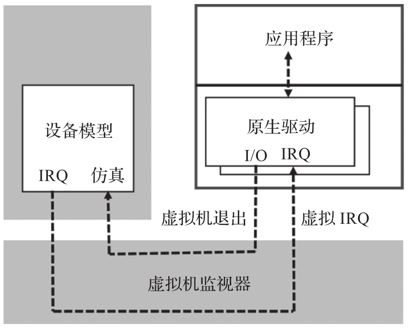

虚拟化技术在刚开始的时候, 虚拟机监视器开发商如 VMware 并不是操作系统供应商, VMM 开发商只能直接在客户机运行市面上现成的操作系统. 这些商业操作系统采用的设备驱动程序都是市面上已经有具体硬件实现的设备驱动程序, 如 NE2000 网卡驱动和 VGA 显卡驱动等. VMM 开发商通过在 VMM 层面模拟一个虚拟的 NE2000 网卡或者 VGA 显卡的方法, 来实现对客户机网络设备和现实设备的支持. 这种模拟方法就是全虚拟化的设备仿真(emulation), 其模型如图 3-12 所示.

全虚拟化情况下的设备仿真可以使 Hypervisor 很容易实现对各种现成的商业操作系统 (如 Windows) 的支持, 但是可能不是最高效的. 传统设备 (如 NE2000 和 VGA) 的设计是为了设备硬件本身以及当时的计算机平台设计优化的, 这些设计的接口并没有预测到虚拟化背景下的设备仿真需要, 因此也不是最优的, 甚至是很差的. 举例来说, NE2000 是 20 世纪 90 年代中后期的产品, 那时候的 PC 主频还只有几十兆赫, 那时一个 MMIO 的访问相对于缓存和内存访问虽然慢一些, 但是不像现在有这么大差距 (现在一个面向 Cache 的内存访问大概只需要十几个 CPU 周期, 面向内存的访问是几百个 CPU 周期, 但是一个 MMIO 访问需要几千个 CPU 周期)​.NE2000 的设计在处理一个网络包的时候, 需要访问多个 MMIO 寄存器. 这在当时的硬件上是没有问题的, 但是在 VMM 情况下成为一个巨大瓶颈, 因为 VMM 对一个 MMIO 访问的模拟一般需要几万甚至十几万个 CPU 周期. 由于全虚拟化的模拟中存在大量的端口 I/O(Port I/O,PIO) 以及 MMIO(Memory-Mapped I/O)的拦截模拟操作, 因此全虚拟化的设备仿真性能很差.

