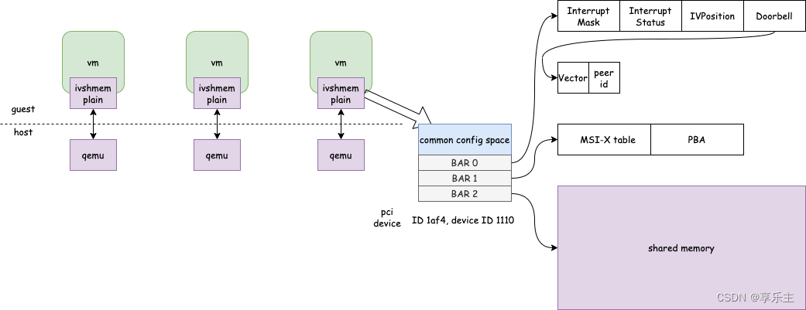

<!-- @import "[TOC]" {cmd="toc" depthFrom=1 depthTo=6 orderedList=false} -->

<!-- code_chunk_output -->

- [1. 概述](#1-概述)
- [2. 设备的 guest 接口](#2-设备的-guest-接口)
  - [2.1. PCI BARS](#21-pci-bars)
  - [2.2. PCI 设备寄存器](#22-pci-设备寄存器)
- [3. 中断服务](#3-中断服务)
  - [3.1. ivshmem server](#31-ivshmem-server)
  - [3.2. Client-Server 协议](#32-client-server-协议)
  - [3.3. Client-Client 协议](#33-client-client-协议)
- [4. 小结](#4-小结)

<!-- /code_chunk_output -->

# 1. 概述

https://www.qemu.org/docs/master/specs/ivshmem-spec.html

**ivshmem**(`Inter-VM shared memory device`)是 **QEMU** 提供的一种**宿主机与虚拟机**之间或**多个虚拟机**之间**共享内存**的**特殊设备**.

它有两种形式:

* `ivshmem-plain`: 简单的共享内存区域

* `ivshmem-doorbell`: 除了**共享内存**, 还能提供基于**中断**的通信机制

为了让所有 guest 都能够获取共享内存区域, QEMU 将其建模为 PCI 设备, 将所述的共享内存区域则以 PCI BAR 的形式暴露给 guest.

该**设备**可以直接使用 **host** 上的**共享内存对象**, 也可以从 `ivshmem server` 获取共享内存对象. 后面这个 case 中, 设备可以通过中断通知 peer, 也可以从 peer 接收中断.

qemu 中使用 ivshmem 见: https://www.qemu.org/docs/master/system/devices/ivshmem.html

# 2. 设备的 guest 接口

设备的

* vendor ID: 1af4

* device ID: 1110

* revision: 1. QEMU 2.6.0 之前, revision 是 0.

## 2.1. PCI BARS

BAR 是 PCI配置空间中从 0x10 到 0x24 的 6 个 register, 用来定义 PCI 需要的配置空间大小以及配置 PCI 设备**占用的地址空间**.

* x86 中地址空间分为 MEM 和 IO 两类, 因此 PCI 的 BAR 在 **bit0** 来表示该设备是映射到 memory 还是 IO, bar 的 bit0 是只读的,

* **bit1**: 保留位

* **bit2**: 0 表示 32 位地址空间, 1 表示 64 位地址空间

* **bit3** 表示 prefetchable 或 non-prefetchable

* 其余的 bit 用来表示设备需要占用的地址空间大小与设备起始地址.

ivshmem 设备支持 3 个 PCI BAR.

* **BAR0**: 用于表示设备的**寄存器信息**, **256 字节**的 MMIO 空间

* **BAR1**: 用于 `MSI-X table` 和 PBA(**仅仅**用于 `ivshmem-doorbell`)

* **BAR2**: 共享内存区域. BAR2 的大小通过命令行指定, 必须是 2 的次方.

两种方式来使用这个设备:

* 如果只需要**共享内存**部分, **BAR2** 就足够了. 这样就可以在 guest 中访问共享内存并使用;

* 如果需要基于**中断**实现额外通信, 则还额外需要 **BAR0** 和 **BAR1**. 你很可能希望编写一个内核驱动来处理中断. 显然, 需要对设备进行中断配置. 这可能需要编写**内核驱动**在**虚拟机内处理中断**, **宿主机**上 **QEMU** 进程在**启动前**需要**先启动** `ivshmem server`, 然后让 QEMU 进程连接到 server 的 unix socket

在 QEMU 2.6.0 **之前**, 如果设备配置了中断, 则 BAR2 刚开始可能是无效的. 只有在 ivshmem server 提供共享内存后, 它才能安全访问. 这些设备的 PCI revision 为 0, 而不是 1. 在**访问 BAR2 之前**, guest 应等待 **IVPosition** 寄存器(下面)变为**非负数**.

revision 0 的设备无法告知 guest 软件该设备是否配置了中断.

## 2.2. PCI 设备寄存器

Ivshmem 设备共有 4 种类型的寄存器. 寄存器在 **BAR0** 中:

```
Offset  Size  Access      On reset  Function
    0     4   read/write        0   Interrupt Mask
                                    bit 0: peer interrupt (rev 0)
                                           reserved       (rev 1)
                                    bit 1..31: reserved
    4     4   read/write        0   Interrupt Status
                                    bit 0: peer interrupt (rev 0)
                                           reserved       (rev 1)
                                    bit 1..31: reserved
    8     4   read-only   0 or ID   IVPosition
   12     4   write-only      N/A   Doorbell
                                    bit 0..15: vector
                                    bit 16..31: peer ID
   16   240   none            N/A   reserved
```

软件必须遵循 "Access" 列要求访问寄存器. 保留位在读取时应忽略, 在写入时禁止.

Mask寄存器:

与中断状态按位与, 如果非 0 则触发一个中断. 因此可以通过设置 mask 的第一bit为0来屏蔽中断.

Status寄存器:

当中断发生(pin 中断下 doorbell 被设置)时, 目前qemu驱动所实现的寄存器被设置为1. 由于status代码只会设1, 所以 mask 也只有第一个 bit 会有左右, 笔者理解可通过修改驱动代码实现status含义的多元化.


在 **revision** 是 **0** 的设备中, 当设备**没有** `MSI-X` 功能时, `Interrupt Status` 和 `Interrupt Mask` 寄存器一起控制 `legacy INTx` 中断: 两者**按位与**运算, **设备没有 MSI-X 功能**并且运算结果**非 0**时, 将断言 **INTx**(触发一个中断). 而对端收到中断请求时, `Interrupt Status` 的 **bit0** 变为 **1**. **读该寄存器**将**清零**.

IVPosition 寄存器: 只读. 如果设备**未配置中断**, 则为**零**. 否则, 它是设备的 ID(介于 0 和 65535 之间).

在 QEMU 2.6.0 之前, 在复位后的短时间内读寄存器可能返回 -1. 这些设备的 PCI revision 是 0, 而不是 1.

软件没有很好的方法来确定设备是否配置了中断. IVPosition 返回正数意味着配置了中断, 但零可能也意味着配置了中断.

**Doorbell 寄存器**: 通过写自己的 doorbell 可以向**其他 peer** 发送中断.

* 高 16 位是要接受中断的 peer 的 ID;

* 低 16 位是所触发的 中断向量.

一个指定 guest id 的 doorbell 在 mmio 区域的偏移等于:

```
guest_id * 32 + Doorbell
```

写入 doorbell 的语义取决于设备是使用 msi 还是 pin 的中断.

如果设备没有配置中断, 写操作会被忽略.

如果中断还没设置完成, 则忽略写入. 设备无法告知 guest 设置是否完成. 中断可能会在迁移时回归到此状态.

如果具有请求 ID 的 peer 还没连接, 或者连接的中断向量较少, 则忽略写入. 该设备无法告诉 guest 连接了哪些 peer, 或者连接了多少个中断向量.

此向量的 peer 中断会 pending. 软件无法清除挂起的位, 因此无法采用轮询操作模式.

如果 **peer** 是**没有 MSI-X 功能**的 **revision 0 设备**, 它的 `Interrupt Status`(中断状态)寄存器设置为 1. 这断言 INTx, 除非通过 `Interrupt Mask`(中断掩码)寄存器进行了屏蔽. 然后, 设备无法将中断向量传送到 guest.

对于多个 MSI-X 向量, 可以使用**不同的向量**来指示发生了**不同的事件**. 中断向量的语义留给应用进程.

# 3. 中断服务

配置中断时, peer 除了共享内存外, 还会共享 eventfd 对象. **共享的所有资源**由 `ivshmem server` **管理**.

## 3.1. ivshmem server

> 共享内存server是在host上运行的一个应用程序, 每启动一个vm, server会指派给vm一个id号, 并且将vm的id号和分配的eventfd文件描述符一起发给qemu进程. Id号在收发数据时用来标识vm, guests之间通过eventfd来通知中断. 每个guest都在与自己id所绑定的eventfd上侦听, 并且使用其它eventfd来向其它guest发送中断.

该 **server** 监听一个 UNIX domain socket.

对于每一个连接到该 server 的**新的 client**, **server** 会:

* 获取一个**新的 ID**,

* 创建一个**新 eventfd 文件描述符**用于**中断向量**,

* 发送该 ID 和 文件描述符给新的 client,

* 将新 client 的连接通知发送到其他 clients(这些 clients 包含用于发送中断的文件描述符),

* 将其他 clients 的连接通知发送到新 client

* 发送**中断设置消息**(这些消息包含用于接收中断的文件描述符)到新 client

第一个连接到 server 的 client 收到的 ID 是 0.

当一个 client 从 server 断开连接时, server 会向其他 clients 发送断开连接通知.

下一节将详细介绍该协议.

如果 server 没有向其连接的 clients 发送断开连接通知就停止了, 则 clients 可以选择继续. clients 可以正常通信, 但不会在断开连接时收到断开连接通知, 并且没有新 client 可以连接. client 无法连接到重新启动的 server. 设备无法告知 guest 关于 server 是否仍处于运行状态.

示例 server 代码位于 `contrib/ivshmem-server/` 中. 不得用于产品. 它假定所有 clients 都使用相同数量的中断向量.

一个独立 client 位于 `contrib/ivshmem-client/` 中. 它可用于调试.

## 3.2. Client-Server 协议

配置有中断的 ivshmem 设备连接到 ivshmem server. 本节详细介绍了两者之间的协议.

连接是单向的: server 向 client 发送消息. 每条消息由一个 8 字节的 little-endian 有符号数组成, 并且可以通过 SCM_RIGHTS 附带一个文件描述符. client 和 server 在出错时都会关闭连接.

注意: QEMU 目前不会在出现错误时立即关闭连接, 而仅在字符设备被销毁时关闭.

连接时, server 按顺序发送以下消息:

1) 协议版本号, 当前为 0. client 应在收到无法处理的版本时关闭连接.

2) client 的 ID. 这在此 server 的所有 clients 中是唯一的. ID 必须介于 0 和 65535 之间, 因为 Doorbell 寄存器仅为其提供 16 位.

3) 数字 -1, 附带**共享内存的文件描述符**.

4) 连接现有其他 client 的通知(如果有). 这是一个 peer ID(0 到 65535 之间的数字, 而不是 client 的 ID), 重复了 N 次. 每个重复都有一个文件描述符. 这些用于按顺序使用向量 0, .., N-1 中断具有该 ID 的 peer. 如果 client 配置为较少的向量, 则会关闭额外的文件描述符. 如果将其配置为更多, 则额外的向量将保持未连接状态.

5) 中断设置. 这是 client 自己的 ID, 重复了 N 次. 每个重复都伴随着一个文件描述符. 这些用于按顺序使用向量 0,..,N-1 接收来自对等体的中断. 如果客户端配置为较少的向量, 则会关闭额外的文档描述符. 如果将其配置为更多, 则额外的向量将保持未连接状态.

从这时起, server 将发送以下类型的消息:

6) 连接/断连 通知. 发送的是 peer ID.

* 如果还有伴随着一个文件描述符, 说明是 连接通知, 就像 4) 中那样.

* 否则, 就是断连通知.

已知 bug:

* 该协议在 QEMU 2.5 中发生了不兼容的更改. 以前, 消息是原生的 endian long, 并且没有 version 号.

* 该协议设计的很弱.

## 3.3. Client-Client 协议

配置了中断的 ivshmem 设备接收 eventfd 文件描述符, 用于中断 peers 并被 server 的对等体打断, 如上一节所述.

为了中断 peer, 设备将 8 字节整数 1 按本机字节顺序写入相应的文件描述符.

为了接收中断, 设备会读取和丢弃尽可能多的 8 字节整数.

# 4. 小结

ivshmem 规范定义了如何实现共享内存设备, 其核心原理基于 QEMU 的 **PCI 设备**模型, **前端**将 PCI 设备的 **BAR** 空间作为一个普通的**内存空间**, **后端**将**该 BAR** 空间**关联**的 **MR** 配置成**从共享内存文件中获得**, 从而实现**将 BAR 空间暴露**给**其它进程**的目标.

`ivshmem-plain` **设备**主要使用的是**共享内存**部分的功能, 这部分实现比较简单, ivshmem 规范中涉及内容不多, ivshmem 规范中大部分内容是讲解如何设计 PCI 的 BAR 寄存器实现**共享设备之间的中断通知**, 即 `ivshmem-doorbell` 设备.

对于 ivshmem 设备, 无论是 `ivshmem-plain` 设备还是 `ivshmem-doorbell` 设备, 其架构相同, 如下所示,

* `ivshmem-plain` 设备的实现只用到了 **BAR2**

* `ivshmem-doorbell` 除了 BAR2, 设备的实现还涉及 **BAR0** 和 **BAR1**.

