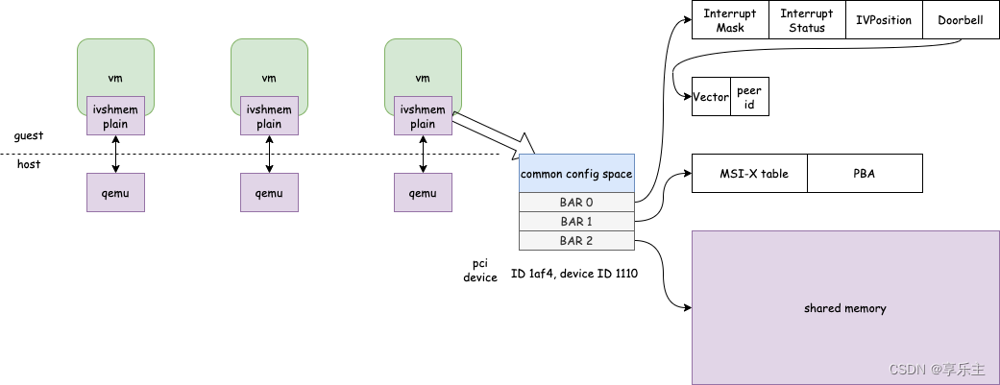
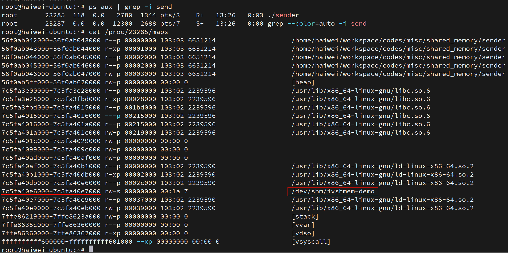
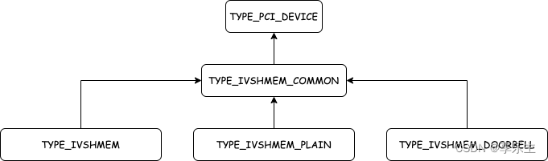

<!-- @import "[TOC]" {cmd="toc" depthFrom=1 depthTo=6 orderedList=false} -->

<!-- code_chunk_output -->

- [1. 架构](#1-架构)
- [2. 前言](#2-前言)
  - [2.1. 使用场景](#21-使用场景)
- [3. 基本原理](#3-基本原理)
- [4. 具体实现](#4-具体实现)
  - [4.1. 设备模型](#41-设备模型)
  - [4.2. 数据结构](#42-数据结构)
  - [4.3. 设备初始化](#43-设备初始化)
    - [4.3.1. 设备属性](#431-设备属性)
    - [4.3.2. 迁移字段](#432-迁移字段)
    - [4.3.3. 初始化](#433-初始化)
    - [4.3.4. BAR0 访问](#434-bar0-访问)
  - [4.4. 识别设备](#44-识别设备)

<!-- /code_chunk_output -->

# 1. 架构

对于 ivshmem 设备, 无论是 `ivshmem-plain` 设备还是 `ivshmem-doorbell` 设备, 其架构相同, 如下所示,

* `ivshmem-plain` 设备的实现只用到了 **BAR2**

* `ivshmem-doorbell` 设备的实现涉及 **BAR0** 和 **BAR1**.



# 2. 前言

ivshmem-plain 设备是 Qemu 提供的一种特殊设备, 通过这个设备, 可以实现**虚拟机内存**和**主机**上其它进程**内存共享**, **应用程序**可以利用**此设备**实现**虚拟机内部**和**主机上进程间**的高效**数据传输**.

## 2.1. 使用场景

通常,

* **虚拟机内部**的进程作为**生产者**, 往共享内存中**写入**数据;

* **主机侧**进程作为**消费者**, 从共享内存中**读取**数据.

这种模式常常应用在虚拟化的**杀毒软件场景**, **虚拟机内部**的杀毒软件程序**搜集**虚拟机的行为**数据**放到**共享内存**, **后端**的杀毒软件**分析**虚拟机暴露的**数据**, 判断该虚拟机是否行为异常甚至中毒, 本文主要分析这类杀毒软件的工作基础 ivshmem-plain 设备.

# 3. 基本原理

linux 支持进程间共享内存, 通过**文件**的形式提供编程接口, 共享内存通常由一个进程打开共享内存的文件并写入内容, 作为生产者, 由另一个进程通过只读方式打开同样的内存文件并作为消费着读取. 我们通过简单测试程序了解共享内存的使用方式, 代码见 `shared_memory`

> 参考 `Linux\Memory\Shared Memory\0. 共享内存综述.md` 中的 `POSIX 共享内存`.

测试程序有两个, 一个作为生产者(sender)创建共享内存文件 /`dev/shm/ivshmem-demo`, 同时往内存文件中写入内容, 这里 sender 分别写入了三个整数 0、1、2. 一个作为消费者(receiver)通过**只读方式**打开共享内存文件 `/dev/shm/ivshmem-demo`, 读取该内存文件, 测试程序运行结果如下: 

```
# ./sender
sender mapped address: 0x7526e3246000
do cleanup

# ./receiver
receiver mapped address: 0x763353b26000
0
1
2
# ps aux | grep -i sender
root       23146  107  0.0   2780  1344 pts/3    R+   13:20   0:09 ./sender
# kill 23146
```

生产者打开共享内存文件, 可以看到, 进程空间分配的内存比实际映射的多, 为4k, 猜测共享内存的最小单位是一个内存页.



`shm_open` 函数就是在 `/dev/shm` 目录下建文件, 该目录挂载为 tmpfs, 至于 **tmpfs** 可以简单理解为**存储介质是内存**的一种文件系统, 更准确的理解可以参考官方文档 tmpfs.txt.

Qemu 的 `ivshmem-plain` 设备, 其本质也是利用 linux 提供的这一套共享内存机制, 实现虚拟机内存和主机上进程的内存共享. 实际上虚拟机内存在主机上进程看来就是 Qemu 分配创建的共享内存, 因此可以互相访问.

host 上可以通过将 tmpfs 挂载到 `/dev/shm`, 从而通过 `/dev/shm` 来提供共享内存作为 bar2 映射的共享内存体. 也可通过 `shm_open + ftruncate` 创建一个共享内存文件.

```
tmpfs on /dev/shm type tmpfs (rw,nosuid,nodev,inode64)
```

```cpp
// 新建一个
fd = shm_open(name, O_CREAT | O_EXCL | O_RDWR, 0600);
if (fd > 0)
    is_shm_creator = true;
// 已经存在
else if (fd < 0 && errno == EEXIST)
    // 打开已有的
    fd = shm_open(name, O_RDWR, 0600);

if (is_shm_creator) {
    // 新建, 就resize
    if (ftruncate(fd, size) < 0) {
    ...
} else {
    // 已有的, 判断size是不是符合
    if ((fstat(fd, &st) < 0) || st.st_size != size) {
        ...
    }
}
// 映射
addr = (void *)mmap(NULL, size, PROT_READ | PROT_WRITE,
        MAP_SHARED, fd, 0);
```

# 4. 具体实现

## 4.1. 设备模型

ivshmem 在**最初的设计**中, 实现了驱动为 ivshmem 设备, **既支持**普通的**共享内存设备**, **又支持**可通过中断实现 **doorbell** 的共享内存设备, 但实现逻辑耦合性高且不清晰, 因此根据功能不同, ivshmem **被拆分**成 `ivshmem-plain` 和 `ivshmem-doorbell` 两类设备, 原来的 ivshmem 设备作为遗留设备被建议废弃, 实现代码仍然**被保留**.

当前 Qemu 的 ivshmem 设备主要指 ivshmem-plain 设备和 ivshmem-doorbell 设备, 模型如下: 



## 4.2. 数据结构

**ivshmem 设备**的核心数据结构是 `IVShmemState`:

```cpp
// hw/misc/ivshmem.c

typedef struct IVShmemState IVShmemState;

struct IVShmemState {
    /*< private >*/
    PCIDevice parent_obj;
    /*< public >*/
    uint32_t features;

    /* exactly one of these two may be set */
    HostMemoryBackend *hostmem; /* with interrupts */
    CharBackend server_chr; /* without interrupts */

    /* registers */
    uint32_t intrmask;
    uint32_t intrstatus;
    int vm_id;

    /* BARs */
    MemoryRegion ivshmem_mmio;  /* BAR 0 (registers) */
    MemoryRegion *ivshmem_bar2; /* BAR 2 (shared memory) */
    MemoryRegion server_bar2;   /* used with server_chr */

    /* interrupt support */
    Peer *peers;
    int nb_peers;               /* space in @peers[] */
    uint32_t vectors;
    MSIVector *msi_vectors;
    uint64_t msg_buf;           /* buffer for receiving server messages */
    int msg_buffered_bytes;     /* #bytes in @msg_buf */

    /* migration stuff */
    OnOffAuto master;
    Error *migration_blocker;
};

// ivshmem规范中定义的PCI设备BAR0寄存器
/* registers for the Inter-VM shared memory device */
enum ivshmem_registers {
    INTRMASK = 0,
    INTRSTATUS = 4,
    IVPOSITION = 8,
    DOORBELL = 12,
};
```

* `features`: 存放可供用户配置的特性

* `hostmem`: `ivshmem-plain` 设备, 使用 **qemu 分配的内存**作为**共享内存**

* `server_chr`: `ivshmem-doorbell` 设备, 使用 **server 传入**的共享内存文件 fd 分配内存作为**共享内存**

* `vm_id`: 对于 `ivshmem-plain` 设备, 这个字段**没有使用**, 默认为 0. 对于 `ivshmem-doorbell` 设备, 使用该字段, 在共享设备的域中**标识自己的 ID**. 其它设备发送中断时通过指明 vm_id 字段表明中断要发送到的目的设备. vm_id 的范围是 `[0, 65535]`, `ivshmem-doorbell-server` 根据 client 连接顺序从 0 依次开始一次分配 ID 给 client, 角色为 master 的 client 必须是第一个连接 server 的 ivshmem-doorbell 设备, 因此 master ivshmem-doorbell 设备的 vm_id 是 0, 后续连接的 client 作为 peer 角色存在, master 设备支持迁移. 因此无论是 ivshmem-plain 还是 ivshmem-doorbell, vm_id 为 0 时都表明自己是 master 角色, 能够支持迁移.

* `ivshmem_mmio`: **BAR0** 寄存器对应的后端实现, MMIO 类型 MR

* `ivshmem_bar2`: ivshmem-plain 设备的共享内存由 qemu 进程即时分配; ivshmem-doorbell 设备的共享内存是 server 的 shm_fd

* `server_bar2`: `ivshmem-doorbell` 设备的共享内存由 server 进程打开共享设备文件, 通过 SCM_RIGHTS 传入打开共享设备文件的描述符, 客户端拿到后再分配内存, 如果是 `ivshmem-doorbell` 设备, ivshmem_bar2 会指向 server_bar2

* `peers` 和 `nb_peers`: 内存共享域中其余设备形成的数组.

* `master`: 只有 `master=on` 才支持迁移, 通过命令行参数 master 属性可以指定

* `migration_blocker`: 如果 `master=off`, 增加该 blocker

## 4.3. 设备初始化

```
object_add memory-backend-file,size=16M,mem-path=/dev/shm/shm1,share=true,id=shm1

device_add ivshmem-plain,memdev=shm1,bus=pci.0,addr=0x10,master=on
```

```cpp
// hw/misc/ivshmem.c
static void ivshmem_register_types(void)
{
    type_register_static(&ivshmem_common_info);
    type_register_static(&ivshmem_plain_info);
    type_register_static(&ivshmem_doorbell_info);
}

type_init(ivshmem_register_types)
```

```cpp
#define TYPE_IVSHMEM_PLAIN "ivshmem-plain"

static const TypeInfo ivshmem_plain_info = {
    // 类定义
    .name          = TYPE_IVSHMEM_PLAIN,
    // 父类
    .parent        = TYPE_IVSHMEM_COMMON,
    // 设备实例
    .instance_size = sizeof(IVShmemState),
    .class_init    = ivshmem_plain_class_init,
};
```

所有 `ivshmem-plain` 设备都属于 `ivshmem-plain` 类, 类初始化函数如下:

```cpp
static void ivshmem_plain_class_init(ObjectClass *klass, void *data)
{
    DeviceClass *dc = DEVICE_CLASS(klass);
    PCIDeviceClass *k = PCI_DEVICE_CLASS(klass);

    /* 设备创建时的初始化函数 */
    k->realize = ivshmem_plain_realize;
    /* 设备属性 */
    device_class_set_props(dc, ivshmem_plain_properties);
    /* 定义迁移设备状态时需要迁移IVShmemState的字段 */
    dc->vmsd = &ivshmem_plain_vmsd;
}
```

### 4.3.1. 设备属性

`ivshmem_plain_properties` 描述了设备的属性.

```cpp
static Property ivshmem_plain_properties[] = {
    /* master属性指定设备角色, 默认为peer角色 */
    DEFINE_PROP_ON_OFF_AUTO("master", IVShmemState, master, ON_OFF_AUTO_OFF),
    /* 共享内存设备基于linux shared memory实现, 这里的memdev指向主机memory-backend-file对象
     * 最终指向memory-backend-file对象关联的具体共享内存文件文件
     */
    DEFINE_PROP_LINK("memdev", IVShmemState, hostmem, TYPE_MEMORY_BACKEND,
                     HostMemoryBackend *),
    DEFINE_PROP_END_OF_LIST(),
};
```

除此之外, `ivshmem-plain` 设备的**父类**是 `ivshmem-common` 设备, **父类**的**父类**是 pci 设备, 因此 `ivshmem-plain` 还具有 **pci 设备的所有属性**: 

### 4.3.2. 迁移字段

`ivshmem_plain_vmsd` 描述 IVShmemState 数据结构的**哪些字段需要迁移**, 在目的端加载设备时保证值相同.

```cpp
static const VMStateDescription ivshmem_plain_vmsd = {
    .name = TYPE_IVSHMEM_PLAIN,
    .version_id = 0,
    .minimum_version_id = 0,
    .pre_load = ivshmem_pre_load,
    .post_load = ivshmem_post_load,
    .fields = (VMStateField[]) {
        /* 迁移pci设备相关字段 */
        VMSTATE_PCI_DEVICE(parent_obj, IVShmemState),
        /* 迁移intrstatus字段, 保证目的端设备加载后中断状态相同 */
        VMSTATE_UINT32(intrstatus, IVShmemState),
        /* 迁移intrmask字段, 保证目的端设备使能的中断和源端相同 */
        VMSTATE_UINT32(intrmask, IVShmemState),
        VMSTATE_END_OF_LIST()
    },
};
```

### 4.3.3. 初始化

`ivshmem_plain_realize` 实现 `ivshmem-plain` 设备的**核心逻辑**: 

```cpp
static void ivshmem_plain_realize(PCIDevice *dev, Error **errp)
{
    IVShmemState *s = IVSHMEM_COMMON(dev);

    /* 检查ivshmem-plain设备是否指定了memdev内存对象 */
    if (!s->hostmem) {
        error_setg(errp, "You must specify a 'memdev'");
        return;
    } else if (host_memory_backend_is_mapped(s->hostmem)) {
        /* 如果内存对象被标记为已使用, 报错 */
        error_setg(errp, "can't use already busy memdev: %s",
                   object_get_canonical_path_component(OBJECT(s->hostmem)));
        return;
    }
    /* ivshmem-plain设备核心逻辑和ivshmem-common设备相同 */
    ivshmem_common_realize(dev, errp);
}
```

`ivshmem_common_realize` 对设备做初始化, 对于 `ivshmem-plain` 设备, 主要就是 BAR0 和 BAR2 的模拟(BAR1 只有 ivshmem-doorbell 设备才会用到)

* **BAR0** 是 **MMIO 类型**的 MR. 函数主要是注册 MMIO 的**回调钩子函数**;

* **BAR2** 是 **RAM 类型**的 MR, 针对 BAR0. 函数主要确保获取设备对应的 MR 信息并注册 BAR.

```cpp
static void ivshmem_common_realize(PCIDevice *dev, Error **errp)
{
    ERRP_GUARD();
    IVShmemState *s = IVSHMEM_COMMON(dev);
    Error *err = NULL;
    uint8_t *pci_conf;

    /* IRQFD requires MSI */
    // irqfd 必须有 MSI, 即 doorbell 设备
    // plain设备这里不涉及
    if (ivshmem_has_feature(s, IVSHMEM_IOEVENTFD) &&
        !ivshmem_has_feature(s, IVSHMEM_MSI)) {
        error_setg(errp, "ioeventfd/irqfd requires MSI");
        return;
    }

    /* 配置ivshmem pci配置空间的命令寄存器 */
    pci_conf = dev->config;
    // 第一.
    pci_conf[PCI_COMMAND] = PCI_COMMAND_IO | PCI_COMMAND_MEMORY;
    // BAR0 的模拟, 理论上 plain 设备不需要这个啊
    // 第二. 0x100, 256字节
    memory_region_init_io(&s->ivshmem_mmio, OBJECT(s), &ivshmem_mmio_ops, s,
                          "ivshmem-mmio", IVSHMEM_REG_BAR_SIZE);
    // 第三.
    // bit 0 是 0, memory request
    // bit 2:1 是 00, 32 bit
    // bit 3 是 0, non-prefetch
    pci_register_bar(dev, 0, PCI_BASE_ADDRESS_SPACE_MEMORY,
                     &s->ivshmem_mmio);
    // 第四. plain设备
    // mem-path=/dev/shm/shm1
    if (s->hostmem != NULL) {
        IVSHMEM_DPRINTF("using hostmem\n");
        // BAR2 的模拟
        // 第五.
        s->ivshmem_bar2 = host_memory_backend_get_memory(s->hostmem);
        // 第六.
        host_memory_backend_set_mapped(s->hostmem, true);
    // doorbell 设备
    } else {
        ......
    }
    // 第七.
    if (s->master == ON_OFF_AUTO_AUTO) {
        s->master = s->vm_id == 0 ? ON_OFF_AUTO_ON : ON_OFF_AUTO_OFF;
    }
    // 第八.
    if (!ivshmem_is_master(s)) {
        error_setg(&s->migration_blocker,
                   "Migration is disabled when using feature 'peer mode' in device 'ivshmem'");
        if (migrate_add_blocker(&s->migration_blocker, errp) < 0) {
            return;
        }
    }
    // 第九.
    vmstate_register_ram(s->ivshmem_bar2, DEVICE(s));
    // 第十.
    // bit 0 是 0, memory request
    // bit 2:1 是 10, 64 bit
    // bit 3 是 1, prefetchable
    pci_register_bar(PCI_DEVICE(s), 2,
                     PCI_BASE_ADDRESS_SPACE_MEMORY |
                     PCI_BASE_ADDRESS_MEM_PREFETCH |
                     PCI_BASE_ADDRESS_MEM_TYPE_64,
                     s->ivshmem_bar2);
}
```

第一. 设置 ivshmem 设备可以支持 **IO 访问**和**内存映射访问**.

* IO 访问的 pci 设备, 可以通过 io 指令读写 BAR 空间

* 内存映射访问的 pci 设备, 可以通过 MMIO 将 BAR 空间映射到内存上, 可以像读写内存一样访问这类空间

第二. **BAR0 的模拟**. MMIO memory **初始化**, 注册 IO **回调函数**用以响应 guest 对 **BAR0** 寄存器的**读写请求**. ivshmem 设备 BAR0 大小是 256 字节.

第三. 将 MR 注册为 BAR0.

第四. 如果共享内存是 `ivshmem-plain` 设备, memdev 参数必须指定, 此处 hostmem 必不为 NULL.

第五. 获取 **backend** 的 MR 作为**共享内存**的 **MR**.

第六. 标记该 memdev object 已经被使用, 防止其它 `ivshmem-plain` 设备使用.

第七. master 有三个属性 `on/off/auto`, 如果命令行配置为 auto 则由 Qemu 判断对于 `ivshmem-plain` 设备, vm_id 默认为 0, 因此角色默认为 master 对于 `ivshmem-doorbell` 设备, 第一个连接 server 分配得到的 ID 是 0, 作为 master.

第八. 如果 ivshmem 设备不是 master, 增加迁移 blocker, 禁止配置该设备的虚拟机迁移.

第九. ivshmem 设备的 BAR2 是**普通内存**, 对于普通内存通常通过 `memory_region_init_ram` 初始化 MR. 这里由于是**共享内存**, MR 已经**通过 memdev 对象初始化完成**, 因此只需要再标记下该 MR 关联的 RAMBlock 可以迁移并设置 idstr 即可. 标记 RAMBlock 可迁移的本质是帮助 `ram_save_iterate` 在遍历 `ram_list.blockss` 时判断该 RAMBlock 是否可以迁移.

第十. 将 MR 注册为 `ivshmem-plain` 设备的 **BAR2**.

### 4.3.4. BAR0 访问

对于 **BAR0**, **guest** 通过 **MMIO** 方式访问时, **后端**触发对应的 IO 回调函数, 回调函数在 `ivshmem_mmio_ops` 中注册, 如下: 

```cpp
static const MemoryRegionOps ivshmem_mmio_ops = {
    /* guest读bar0的回调函数 */
    .read = ivshmem_io_read,
    /* guest写bar0的回调函数 */
    .write = ivshmem_io_write,
    .endianness = DEVICE_LITTLE_ENDIAN,
    .impl = {
        .min_access_size = 4,
        .max_access_size = 4,
    },
};

/* 根据guest读的地址, 返回IVShmemState中对应的字段
 * 即intrmask、intrstatus、vm_id三个字段
 */
static uint64_t ivshmem_io_read(void *opaque, hwaddr addr,
                                unsigned size)
{

    IVShmemState *s = opaque;
    uint32_t ret;

    switch (addr)
    {
        case INTRMASK:
            ret = ivshmem_IntrMask_read(s);
            break;

        case INTRSTATUS:
            // 返回原有值, 并 clear 为 0
            ret = ivshmem_IntrStatus_read(s);
            break;

        case IVPOSITION:
            ret = s->vm_id;
            break;

        default:
            IVSHMEM_DPRINTF("why are we reading " HWADDR_FMT_plx "\n", addr);
            ret = 0;
    }

    return ret;
}

/* 根据guest的写地址, 如果是写intrmask、intrstatus两个寄存器
 * 则表明是中断本虚拟机, 则设置对应的寄存器值并注入中断
 * 如果是写doorbell集群起, 表明是中断共享内存的其它虚拟机
 * 通过写eventfd通知
 */
static void ivshmem_io_write(void *opaque, hwaddr addr,
                             uint64_t val, unsigned size)
{
    IVShmemState *s = opaque;

    uint16_t dest = val >> 16;
    uint16_t vector = val & 0xff;

    addr &= 0xfc;

    IVSHMEM_DPRINTF("writing to addr " HWADDR_FMT_plx "\n", addr);
    switch (addr)
    {
        case INTRMASK:
            ivshmem_IntrMask_write(s, val);
            break;

        case INTRSTATUS:
            ivshmem_IntrStatus_write(s, val);
            break;

        case DOORBELL:
            /* check that dest VM ID is reasonable */
            // 检查目标 vm id
            if (dest >= s->nb_peers) {
                IVSHMEM_DPRINTF("Invalid destination VM ID (%d)\n", dest);
                break;
            }

            /* check doorbell range */
            if (vector < s->peers[dest].nb_eventfds) {
                IVSHMEM_DPRINTF("Notifying VM %d on vector %d\n", dest, vector);
                /* 向vm_id为dest的设备发送一个vector中断向量
                  * ivshmem-doorbell设备注册了ivshmem_vector_notify handler
                  * 用于处理evenfd上的读写事件
                  */
                event_notifier_set(&s->peers[dest].eventfds[vector]);
            } else {
                /* 向其它设备注入了一个没有注册的无效中断向量, 报错 */
                IVSHMEM_DPRINTF("Invalid destination vector %d on VM %d\n",
                                vector, dest);
            }
            break;
        default:
            IVSHMEM_DPRINTF("Unhandled write " HWADDR_FMT_plx "\n", addr);
    }
}
```

## 4.4. 识别设备

主机上添加 ivshmem 设备后, **虚拟机**应用如何找到相应的 ivshmem 设备呢?

Linux 的 `/sys/bus/pci/devices/` 目录会列出所有的PCI设备, ivshmem 设备也会包含在其中. PCI 设备都存在 vendor 号和 device 两个标识, vendor 表示厂商, device 表示厂商内的设备类型. ivshmem 设备的 **vendor** 号为 **0x1af4**, **device** 号为 **0x1110**, PCI 设备的 vendor 和 device 号可在这里进行查询.

虚拟机中应用可通过遍历该目录下的具体设备, 通过读取 vendor 和 device 文件来识别 ivshmem 设备.

但如果有两种应用都需要使用一个独立的 ivshmem 设备, 虚拟机应用如何识别出应该使用哪个 ivshmem 设备呢?

因为每个 PCI 设备都可以由 BDF(Bus, Device, Function)来唯一标识, 简单做法可以为每个应用**预留好固定 BDF 地址**. BDF地址中, BUS 占用 8 位, Device 占用 5 位, Function 占用 3 位. 比如, 预留总线 pci0 的最后两个设备地址 `0000:00:1e.0` 和 `0000:00:1f.0`.

有时候**无法预留**, 不同虚拟机上的 ivshmem 地址可能不同. 这种情况可以通过与**宿主机**上的应用**约定好**相应的**固定内容**做为 **signature** 写入**共享内存头部**, 虚拟机应用读取共享内存头部的 signature 信息来识别相应设备.

通过 monitor 机制, 动态添加 ivshmem 设备.

```
-chardev socket,id=montest,server=on,wait=off,path=/tmp/mon_test -mon chardev=montest,mode=readline
```

```
# nc -U /tmp/mon_test
QEMU 8.2.91 monitor - type 'help' for more information
(qemu)

object_add memory-backend-file,size=16M,mem-path=/dev/shm/shm1,share=true,id=shm1

device_add ivshmem-plain,memdev=shm1,bus=pci.0,addr=0x10,master=on

object_add memory-backend-file,size=8M,share=true,mem-path=/dev/shm/shm2,id=shm2

device_add ivshmem-plain,memdev=shm2,bus=pci.0,addr=0x11,master=on
```

虚拟机中查看 PCI 设备, 增加了两个:

```
# lspci
00:10.0 RAM memory: Red Hat, Inc. Inter-VM shared memory (rev 01)
00:11.0 RAM memory: Red Hat, Inc. Inter-VM shared memory (rev 01)

# ll /sys/bus/pci/devices/
lrwxrwxrwx 1 root root 0 May 20 14:02 0000:00:10.0 -> ../../../devices/pci0000:00/0000:00:10.0/
lrwxrwxrwx 1 root root 0 May 20 14:04 0000:00:11.0 -> ../../../devices/pci0000:00/0000:00:11.0/
```

分别查看两个 ivshmem 设备目录下 vendor 和 device 文件的内容, 可以看到 vendor 都是 0x1af4, device 都是 0x1110:

```
# cat /sys/bus/pci/devices/0000\:00\:10.0/vendor
0x1af4
# cat /sys/bus/pci/devices/0000\:00\:10.0/device
0x1110

# cat /sys/bus/pci/devices/0000\:00\:11.0/vendor
0x1af4
# cat /sys/bus/pci/devices/0000\:00\:11.0/device
0x1110
```

ivshmem 设备的共享内存以设备目录下的 resource2 文件存在, 虚拟机应用可以通过 mmap 调用来读写该内存区域. 查看两个 ivshmem 共享内存的大小,可以看到 `0000:00:10.0` 的大小为 **16M**, `0000:00:11.0` 的大小为 **8M**:

```
# ll /sys/bus/pci/devices/0000\:00\:10.0/resource2 -h
-rw------- 1 root root 16M May 20 14:14 /sys/bus/pci/devices/0000:00:10.0/resource2

# ll /sys/bus/pci/devices/0000\:00\:11.0/resource2 -h
-rw------- 1 root root 8.0M May 20 14:14 /sys/bus/pci/devices/0000:00:11.0/resource2
```

在**宿主机**上分别在两个共享内存区域中写入 8 字节(**含字符串换行符**)的不同标识信息:

```
echo "SIGN_01" > /dev/shm/shm1
echo "SIGN_02" > /dev/shm/shm2
```

在**虚拟机内部**编写一个简单的程序来读出第一个 ivshmem 设备的前 8 字节, C 语言代码如下:

```cpp
#include <stdio.h>
#include <stdlib.h>
#include <unistd.h>
#include <fcntl.h>
#include <sys/mman.h>
#include <assert.h>

#define SHM_SIZE  (16 * 1024 * 1024)

int main(int argc, char **argv) {
    char *p;
    int fd;
    int i;

    fd = open("/sys/bus/pci/devices/0000:00:10.0/resource2", O_RDWR);
    assert(fd != -1);

    p = mmap(0, SHM_SIZE, PROT_READ | PROT_WRITE, MAP_SHARED, fd, 0);
    assert(p != NULL);

    for (i = 0; i < 8; i++) {
        printf("%c", p[i]);
    }

    munmap(p, SHM_SIZE);
    close(fd);

    return 0;
}
```

在虚拟机上编译执行, 可以看到宿主机上写入的标识信息.

```
# ./ivshmem
SIGN_01
```

在真实的生产应用中, 对于共享内存的使用不会这么简单, 而是要构造相当复杂的数据结构. 比如, 可以在共享内存中构造基于偏移量的**环形队列**结构, 用于**双向的信息发送**.

