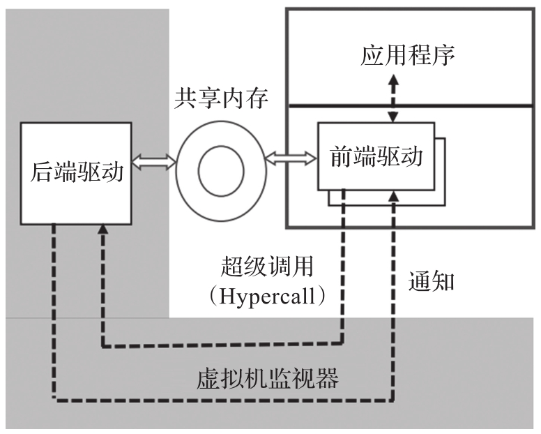

仿真设备不需要对客户机做任何改动, 客户机运行已有设备的驱动程序, 而 VMM 通过对客户机的 I/O(含 PIO 和 MMIO)访问的陷入和模拟 (trap-and-emulate), 使客户机感觉犹如运行在真实的原生系统中. 图 3-12 显示了仿真设备的工作原理. 仿真设备引入了大量的虚拟机陷入和模拟事件, 因此性能是最差的, 为了提高设备模拟的性能产生了半虚拟化(Paravirtualization) 的设备模型.

VMM 设计人员从 VMM 的特点出发, 发挥 VMM 的长处, 如快速共享内存访问速度, 避开 VMM 的短处, 如过长的 MMIO 模拟开销, 开始重新设计专门应用在 VMM 情况下的虚拟设备接口以便获得较高的性能. 虚拟设备 I/O(virtio)就是在这样的背景下产生的, 其概念最早在 Austin 举办的第一届 KVM 会议上提出, 与会者确定了基于 PCIe 总线的设计思路(相对于 Xen 和 Hyper-V 基于自己专有的虚拟总线)​. 半虚拟化设备模型首先基于 VMM 定义设备接口, 如虚拟 MMIO 寄存器和用于描述 I/O 请求的虚拟环, 然后在这个接口的基础上同时开发运行在客户机中的前端设备驱动程序和运行在 VMM 上的后端设备仿真程序. 与全虚拟化设备仿真相比, 半虚拟化设备模型大大减少了客户机对 MMIO 的访问次数, 节省了 VMM 的虚拟化开销, 大幅提高了 I/O 虚拟化的性能. 其工作模型如下图所示.

