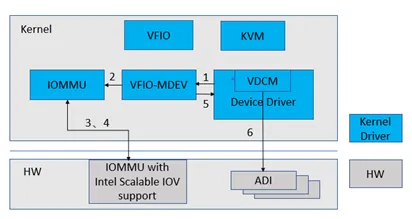
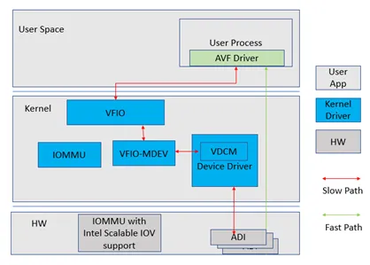

# 简介

Intel® Scalable I/O Virtualization(Intel Scalable IOV)是针对下一代 CPU 服务器平台的虚拟化解决方案, 是一种硬件辅助的 I/O 设备直通技术. 它采用了现有的 PCI Express 功能结构, 实现了高性能和更灵活的 I/O 设备共享的架构.

## 系统平台支持

系统平台方面, Intel VT-d 3.0 添加了对 Intel Scalable IOV 的支持. IOMMU 提供 DMA 重映射技术, 把不同设备提供的 IOVA 地址转换成物理地址, 用于设备 DMA.

Intel IOMMU 实现基于 PASID 粒度的地址转换. 平台 IOMMU 支持基于每个设备 DMA 的 PASID 查找不同的页表, 保证 ADI 之间的隔离.

## 硬件设备功能

Intel Scalable IOV 基于 PASID(Process Address Space ID)实现设备隔离. 使用 PASID 可以实现比 VF 更细粒度的隔离和更轻量的资源分配. 硬件 PCIe 设备需要使能 PASID TLP 前缀, 在其 PCIe 数据包的 TLP Prefix 部分添加 PASID 值. 通过 PASID 值以及 requester ID(即 BDF 号), 可以确定数据包所属的进程地址空间 ID.

Intel Scalable IOV 支持的最小硬件资源为 ADI(Assignable Device Interface). ADI 可以由不同的设备资源组成, 比如有固定数量 RX/TX 队列的虚拟网卡.

在对设备进行初始化和枚举时需要知道设备是否支持 Scalable IOV. Intel 定义了 DVSEC 域用于发现和配置支持 Scalable IOV 技术的设备.

## 优势和适用场景

Intel Scalable IOV 的资源更轻量, 因此同一个设备上可以支持更多的虚拟设备. 如 Intel E810 网卡, 可以支持的 VF 数量为 256 个, 而基于 PASID 可以支持 700 + 个 ADI. Intel Scalable IOV 支持虚拟设备按需, 动态创建. 因为 Intel Scalable IOV 占用的资源少, 因此启动时间更短, 也更易于热迁移. Intel Scalable IOV 更适用于大规模容器群.

# 深度剖析

## 整体架构

对于 Intel Scalable IOV 软件支持的框架如图 1 所示.

> VDCM 有不同的实现方式: 可以如图所示作为 host 或者 VMM 上的一个模块, 也可以是平台上独立于 host 和 VMM 的其他系统. 由于篇幅限制, 本文主要介绍 VDCM 在 host 和 VMM 上实现的情况.


VDCM(Virtual Device Composition Module)负责设备的管理和慢速路径的处理.

虚拟机和容器有两条路径访问硬件设备: intercepted path 和 direct path. 其中, intercepted path 路径负责配置资源, 管理设备, 通过 VDCM 软件模拟实现. VDCM 使用设备驱动提供的接口配置设备; direct path 通过映射底层的硬件设备, 提升硬件设备访问性能. 这种架构的好处在于: 一方面, 设备模型更简单灵活; 另一方面, 由 hypervisor 负责创建管理设备, 解决了 SR-IOV 中 hypervisor 无法记录和感知设备状态的问题.

VDEV(virtual device)作为共享物理设备和虚拟机的接口, 分配给虚拟机或者容器. VDEV 包含虚拟的 requester ID(即 BDF 号),CSR 和 BARs, 以及虚拟的 MSI-X 表. 使用 VDEV 时不需要提前创建好将来要用的所有实例, 在需要使用的时候创建就可以.

## 设备部分软件实现

本文介绍的软件实现依赖于 linux kernel 的 VFIO-MDEV(Mediated Device)[框架](https://docs.kernel.org/driver-api/vfio-mediated-device.html?highlight=mediated%20device), 在 linux 5.2-rc1 版本引入. VDCM(Virtual Device Composition Module)模块负责: 1)分配, 配置, 重置和释放 ADI, 2)配置 PASID.

下面介绍一下如何把 VDEV 和 PASID 绑定以及用户态程序访问 ADI 资源的两种方式.

## VDEV 和 PASID 绑定

如前文所述, Intel Scalable IOV 基于 PASID 实现设备隔离. 这一节介绍如何把 VDEV 和 PASID 绑定.

如下图所示, VDEV 绑定 PASID 的流程如下:



1) VDCM 通过 mdev_set_iommu_device() 接口把 VDEV 注册到 MDEV bus.

2) VFIO 把 MDEV 绑定到一个 IOMMU domain.

3) IOMMU 分配一个 PASID 并建立 IOMMU 页表——所有标记了该 PASID 的 DMA 请求都将使用这个 IOMMU domain 翻译.

4) 设备驱动通过 VFIO 的 mdev_get_iommu_domain() 接口和 IOMMU 的 iommu_aux_get_pasid() 接口获得 VDEV 所在的 IOMMU domain 和 VDEV 绑定的 PASID.

5) 把 PASID 值写入设备设备寄存器.

## ADI 资源访问

如下图所示, 用户态程序 (以 AVF 驱动为例) 有两种方式访问 ADI 资源. 一种是通过 VFIO 和 VDCM: 即图中的 slow path: VDCM 通过软件模拟 ADI 寄存器, 经由设备驱动访问和配置设备; 另一种是使用内存映射, 即图中的 fast path: 把 VDEV 映射到 user space, 建立 MMU 或者 EPT 页表, 实现 HVA(Host Virtual Address)或者 GPA(Guest Physical Address)到 HPA(Host Physical Address)的转换.



# 直通案例

## 在 VM 中使用 Intel E810 ADI 设备

本节介绍在虚拟机环境中使用基于 Intel E810 的 Intel Scalable IOV. 系统架构如下图场景 1 所示.


使用步骤如下:

1) 加载 MDEV 内核模块.

```
# modprobe mdev
```

2) 创建 MDEV. E810 网卡的 BDF 是 0000:16:00.0. 这个时候内核驱动中的 VDCM 模块分配 ADI 资源, 为 ADI 申请 PASID 并绑定到 IOMMU domain.

```
# echo "596661ba-b9f9-11ec-97ad-984fee0051ab" > \
/sys/class/mdev_bus/0000\:16\:00.0/mdev_supported_types/ice-vdcm/create
```

3) 启动 QEMU, 通过参数把 VDEV 传给虚拟机.


```
-device vfio-pci, \
sysfsdev=/sys/bus/mdev/devices/596661ba-b9f9-11ec-97ad-984fee0051ab/
```

4) 在 VM 中加载 AVF 驱动.

```
# insmod iavf.ko
```

对于没有映射到虚拟机的寄存器, AVF 驱动在访问时会产生缺页异常类型的 VM-Exit, 被 KVM 捕获后, QEMU 模拟该寄存器的读写, 调用 VFIO 和 VDCM; 对于映射到虚拟机的寄存器, 访问不会被 QEMU 模拟. QEMU 在启动的时候把 VDEV 的 BAR 映射到 QEMU 的进程地址空间. KVM 建立 EPT 页表后, 虚拟机在访问 VDEV 的寄存器时不会产生缺页异常.

Intel E810 的网卡中现已添加了对 Intel Scalable IOV 的支持, 相关代码在设备驱动 OOT 版本中发布.

## 在 DPDK 中使用 Intel E810 ADI 设备

本节介绍在 DPDK 中使用基于 Intel E810 的 Intel Scalable IOV. 系统架构如上图场景 2 所示, 在 DPDK 的 PCI 总线中支持了 MDEV 设备. PCI 总线在 probe 的时候加载 MDEV. 使用步骤如下:

1) 加载 MDEV 内核模块.

```
# modprobe mdev
```

2) 创建 MDEV——步骤 1 和 2 跟上一个案例在 VM 里使用 Intel E810 ADI 是一样的.

```
# echo "596661ba-b9f9-11ec-97ad-984fee0051ab" > \
/sys/class/mdev_bus/0000\:16\:00.0/mdev_supported_types/ice-vdcm/create
```

3) 启动 testpmd. PCI 总线驱动在 probe 发现 MDEV, 根据 MDEV 的 sysfs 路径查找 MDEV 设备并把 VDEV 的硬件寄存器地址映射到 DPDK 的虚拟地址空间.

```
# ./dpdk-testpmd -c 0xf -n 4 -m 512 -- -I –rxq=1 –rxq=1
```

4) DPDK 中 AVF 驱动访问虚拟寄存器地址时通过 VFIO 直接访问到 VDEV 的硬件寄存器.

DPDK 中英特尔 E810 网卡驱动也已支持 Intel Scalable IOV, 该功能可以在 customer release 中使用.