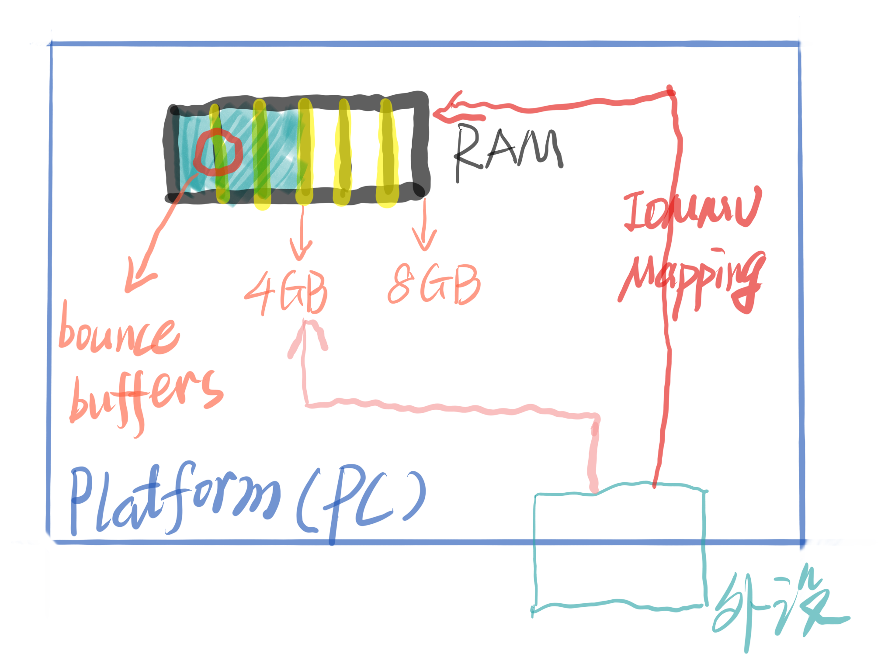
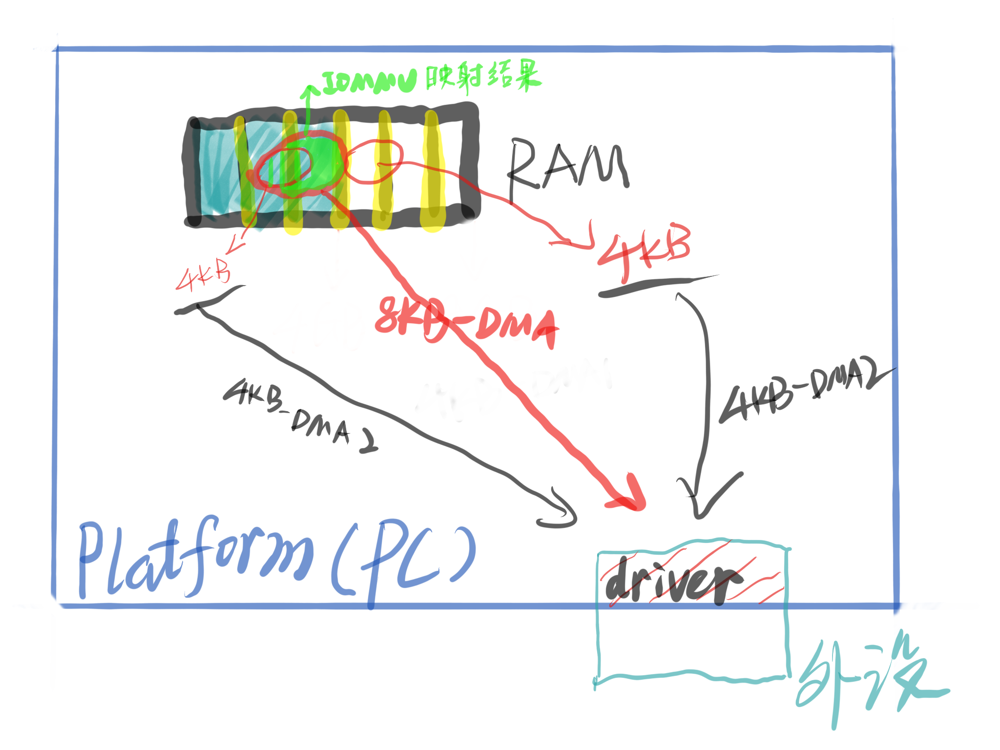
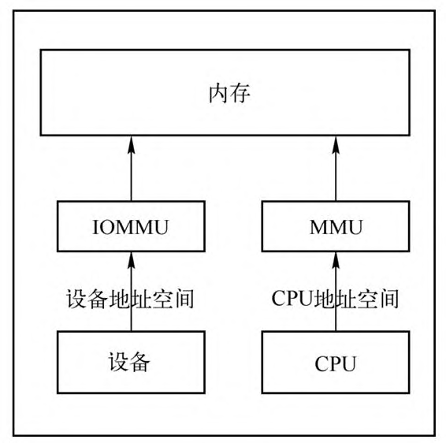

<!-- @import "[TOC]" {cmd="toc" depthFrom=1 depthTo=6 orderedList=false} -->

<!-- code_chunk_output -->

- [1. 虚拟化之前](#1-虚拟化之前)
  - [1.1. 避免 Bounce Buffers](#11-避免-bounce-buffers)
  - [1.2. 连续 DMA](#12-连续-dma)
- [2. 虚拟化](#2-虚拟化)
- [3. 核心功能](#3-核心功能)
- [4. reference](#4-reference)

<!-- /code_chunk_output -->

# 1. 虚拟化之前

在虚拟化普及之前, IOMMU 主要提供 2 种功能:

* **避免** `bounce buffers` 的功能;
* 创建**连续 DMA 操作**功能.

## 1.1. 避免 Bounce Buffers

如果**外设**的**寻址空间小于平台**(如 PC)的寻址空间, 例如外设只支持寻址 4GB 空间, 但是 PC 支持寻址 8GB, 如果 PC 中的**驱动程序**分配了 4GB 以上的空间给设备, 那么设备将无法对该空间执行 DMA 操作.

解决该问题的一种思路就是利用 bounce buffers. Bounce buffers 是**处于较低内存**中的**缓冲区空间**, **外设**可以在其中进行**临时的 DMA 操作**, 操作完成后, 将**结果复制**到**驱动程序分配**的**高地址**内存缓冲区中.

但是这种方法会导致效率降低, 因为多了一步复制操作, 当数据量比较大时, 会明显降低数据处理效率.

**IOMMU 为外设提供 IOVA 空间**, **驱动程序**可以通过访问 **IOVA** 来**访问设备空间**, **避免**了 `bounce buffers` 的使用, 提高了数据处理效率.

## 1.2. 连续 DMA

当**驱动**程序使用**多个 buffers** 时, **IOMMU** 可以将这**多个 buffer** 映射成**连续的地址**, 这样方便操作.

例如之前需要对 2 个 4KB 大小的 buffer 进行 2 个 4KB 大小的 DMA 操作, 现在只需要进行 1 个 8KB 大小的 DMA 操作, 提高了效率.

# 2. 虚拟化

这两个功能对于 host 上的高性能 I/O 仍然很重要, 但是从**虚拟化角度**来看, 主要是现代 IOMMU 的隔离功能.

* 在 `PCI-Express` **之前**, **不可能**进行**大规模的隔离**, 因为**常规 PCI 不会使用请求设备的 ID**(请求者 ID)来**标记 transaction**.  `PCI-X` 包含某种程度的请求者 ID, 但是互连规则使支持的隔离性不完整.

* 使用 **PCIe**, **每个设备**都使用该设备唯一的请求者 ID(PCI 总线/设备/功能编号, **BDF**)来标记事务, 该**请求者 ID** 用于引用该设备的**唯一 IOVA 表**.

从 "从**共享的 IOVA 空间**卸载无法访问的内存并**整合内存**", 到 "**每个设备**都拥有**一个 IOVA 空间**", **不仅**可以将其用于这些功能(卸载无法访问的内存并整合内存), 还可以限制来自设备的 DMA 访问.

为了**分配给虚拟机**, 现在**只需要**将 **IOVA** 放在 Host 分配给 **VM 使用**的**物理空间**内, 该设备就可以在 Guest 地址空间中透明地执行 DMA.

`IOMMU_GROUP`: IOMMU group 是用来描述**从 IOMMU 的角度**来看**可以隔离的最小设备集**.

这样做的**第一步**是**每个设备**必须关联到**唯一的 IOVA 空间**. 也就是说, 如果**多个设备**使用**相同的 IOVA 空间**作为别名, 则 **IOMMU** **无法区分**它们. 这就是典型的 x86 PC 将**所有常规 PCI 设备分组在一起**的原因, 所有**这些设备的别名**为**同一 PCIe 至 PCI 桥接器**. 旧式 KVM 设备分配将允许用户独立分配这些设备给 guest, 但是肯定会配置失败. VFIO 由 IOMMU group 控制, 因此可以防止违反 IOMMU 粒度这一最基本要求的配置.

# 3. 核心功能

Intel `VT-d` 虚拟化方案主要目的是解决 IO 虚拟化中的**安全**和**性能**问题, 这其中最为核心的技术就是 **DMA Remapping** 和 **Interrupt Remapping**.

* **DMA Remapping** 通过 **IOMMU 页表** 方式将 **直通设备对内存的访问** 限制到特定的 **domain** 中, 在提高 IO 性能的同时完成了 **pass-through 直通设备**的 **隔离**, 保证了直通设备 **DMA 的安全性**.

* **Interrupt Remapping** 提供 **IO 设备**的**中断重映射**和**路由**功能, 来达到**中断隔离**和**中断迁移**的目的, 提升了虚拟化环境下 **pass-through 直通设备**的**中断处理效率**.

IOMMU 的基本原理如图:

# 4. reference

https://www.cnblogs.com/haiyonghao/p/14440760.html (done)