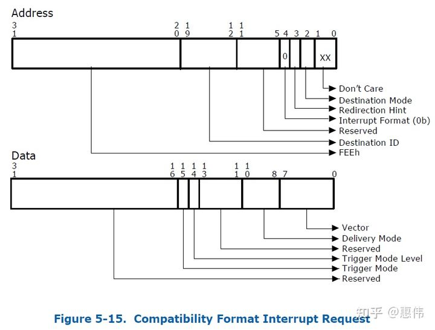
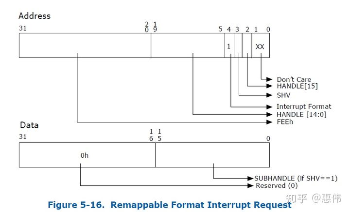
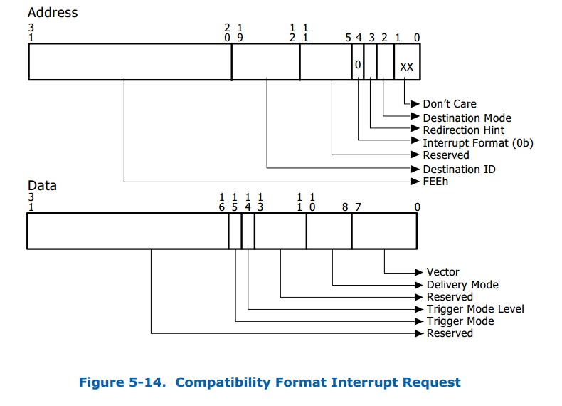
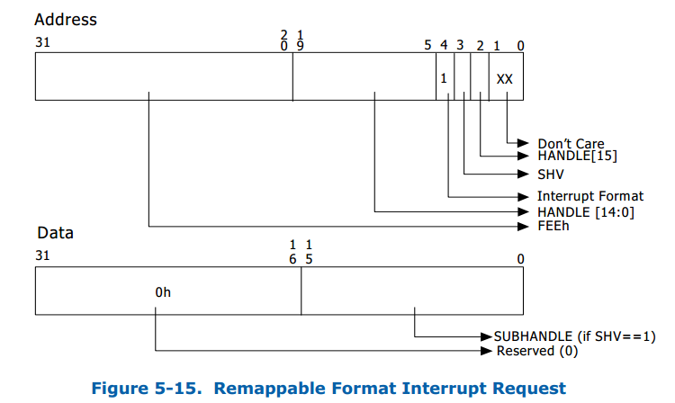
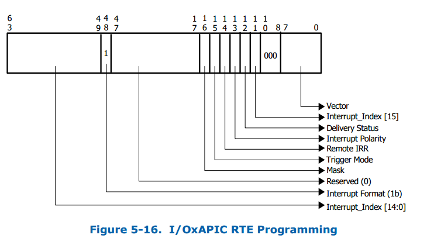
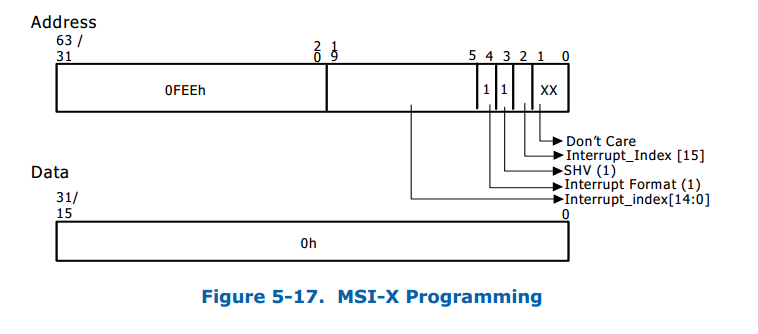
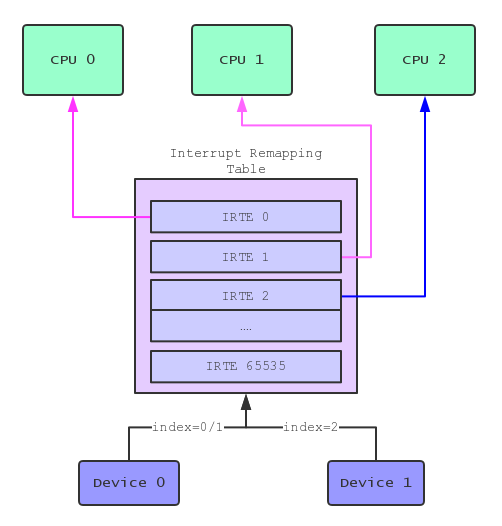
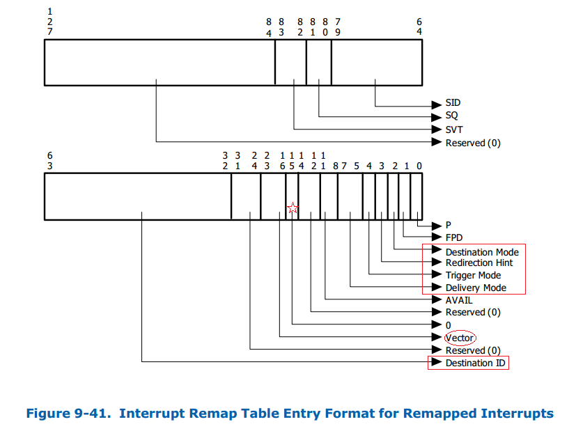

<!-- @import "[TOC]" {cmd="toc" depthFrom=1 depthTo=6 orderedList=false} -->

<!-- code_chunk_output -->

- [1. MSI](#1-msi)
- [2. no interrupt remapping](#2-no-interrupt-remapping)
- [3. interrupt remapping](#3-interrupt-remapping)
- [4. Interrupt Remapping 简介](#4-interrupt-remapping-简介)
  - [4.1. 整体过程](#41-整体过程)
  - [4.2. Compatibility format](#42-compatibility-format)
  - [4.3. Remapping format](#43-remapping-format)
  - [4.4. IRT(E)](#44-irte)
- [5. 中断源](#5-中断源)
  - [5.1. IO APIC](#51-io-apic)
  - [5.2. MSI/MSI-X](#52-msimsi-x)
- [6. 中断处理](#6-中断处理)
- [7. 附: Remapping 格式中断重映射表项的格式](#7-附-remapping-格式中断重映射表项的格式)
- [8. reference](#8-reference)

<!-- /code_chunk_output -->

# 1. MSI

在 Intel 架构上, 是通过 **DMA 写**物理地址 `0x0FEE_XXXX` 来产生 **MSI 中断**, PCI config space 中有 MSI Address 和 Data 寄存器, 驱动配置这两个寄存器, Address 寄存器中有 Destination ID, 表示 Local APIC ID, Address 寄存器所有字段组合起来就是 x0FEE_XXXX, Data 寄存器有 vector 号, 表示中断号.



如果 request-without-PASID, 不进行 DMA remapping, 并且目的地址是 `0x0FEE_xxxxh` 就是中断. 如果 request-with-PASID, DMA 转换后地址是 `0x0FEE_xxxxh` 就报错. 如果 request-with-PASID, 转换前的地址是 `0x0FEE_xxxxh` 正常转换, 但如果转换模式是 passthrough 就报错.

# 2. no interrupt remapping

物理中断一般情况下不能直接投递到虚拟机中, 只能先到物理机上, 物理机再通过 event inject 机制把中断投递到虚拟机中. 那么 vt-d 物理中断先由哪个物理 CPU 处理呢?当然最好是虚拟机运行在哪个物理 CPU, 物理中断就由那个物理 CPU 处理, 物理中断来了, 虚拟机正好由于 external interrupt exiting 出来, 物理 CPU 处理物理中断, 然后重新进入虚拟机时正好把中断注入. 假如物理中断到了其它物理 CPU, 接收到外部中断的物理 CPU 需要给虚拟机所在的物理 CPU 发送一个 IPI 中断, 把虚拟机 exit 出来, 再进入虚拟机进行中断注入. KVM 要拦截 guest 对 passthrough pci 设备 MSI addr 和 data 寄存器的读写, 然后 host 分配一个 p_vector, 外设中断来了, VMM 把 p_vector 转换成 v_vector, 再把 v_vector 注入给虚拟机.

# 3. interrupt remapping

MSI Address 和 Data 中不再包含 destination id 和 vector, 换成 handle 和 subhandle.



https://www.owalle.com/2021/11/01/iommu-code/


在 Intel 架构上, **MSI 中断**是通过 **DMA 写一段地址**完成的, 任何 DMA 的发起者都能够写任意数据, 这就会导致虚拟机内部的攻击者能够让外设产生不属于它的中断. 所以, VT-d 技术中的另一个要解决的问题是中断重定向, 设备产生的中断会经过中断重定向器来判断中断是否合法以及是否重定向到虚拟机内部.

# 4. Interrupt Remapping 简介

原理也是通过 IOMMU 对所有的中断请求做一个重定向, 从而将直通设备内中断正确地分派到虚拟机.

**Interrupt Remapping** 提供 **IO 设备**的**中断重映射**和**路由**功能, 来达到**中断隔离**和**中断迁移**的目的, 提升了虚拟化环境下 **pass-through 直通设备**的**中断处理效率**.

## 4.1. 整体过程

Interrupt Remapping 的出现改变了 x86 体系结构上的中断投递方式, **外部中断源**发出的**中断请求格式**发生了较大的改变, 这些**中断请求**会先被**中断重映射硬件**截获后再通过**查询中断重映射表**的方式**最终投递到目标 CPU** 上.

这些**外部设备中断源**则包括了**中断控制器** (I/O APICs) 以及 `MSI/MSIX` 兼容设备 `PCI/PCIe` **设备**等.

Interrupt Remapping 是需要硬件来支持的, 这里的硬件应该主要是指的 **IOMMU** (尽管 intel 手册并没有直接说明), Interrupt Remapping 的 Capability 是通过 **Extended Capability Register** 来报告的.

## 4.2. Compatibility format

在**没有使能** Interrupt Remapping 的情况下, **设备中断请求格式**称之为 `Compatibility format`, 其结构主要包含一个 32bit 的 Address 和一个 32bit 的 Data 字段:

* **Address** 字段包含了中断要投递的**目标 CPU 的 APIC ID 信息**

* **Data** 字段主要包含了要投递的 **vecotr 号和投递方式**.

结构如下图:



其中 Address 的 `bit 4` 为 Interrupt Format 位, 用来标志这个 Request 是 `Compatibility format` (`bit 4=0`) 还是 `Remapping format` (`bit 4=1`).

## 4.3. Remapping format

在**开启**了 Interrupt Remapping 之后, **设备的中断请求格式**称之为 `Remapping format`, 其结构同样由一个 32 bit 的 Address 和一个 32 bit 的 Data 字段构成.

但与 Compatibility format 不同的是此时 Adress 字段不再包含目标 CPU 的 APIC ID 信息而是提供了一个 **16 bit** 的 **HANDLE 索引**, 并且 Address 的 bit 4 为 "1" 表示 Request 为 Remapping format. 同时 bit 3 是一个标识位 (SHV), 用来标志 Request 是否包含了 **SubHandle**, 当该位置位时表示 Data 字段的低 16bit 为 SubHandle 索引.

Remapping format 的中断请求格式如下图:



## 4.4. IRT(E)

在 Interrupt Remapping 模式下, 硬件查询**系统软件**在**内存**中预设的**中断重映射表** (`Interrupt Remapping Table`, IRT) 来投递中断.

中断重映射表由**中断重映射表项** (`Interrupt Remapping Table Entry`, IRTE) 构成, 每个 IRTE 占用 **128bit** (具体格式介绍见文末), **中断重映射表的基地址**存放在 **Interrupt Remapping Table Address Register** (IRTAR) 中.

硬件通过下面的方式去计算中断的 **interrupt_index**:

```cpp
if (address.SHV == 0) {
    interrupt_index = address.handle;
} else {
    interrupt_index = (address.handle + data.subhandle);
}
```

**中断重映射硬件**通过 `interrupt_index` 去**重映射表**中**索引对应的 IRTE**, 中断重映射**硬件**可以**缓存**那些经常使用的 IRTE 以提升性能. (注: 由于 handle 为 16bit, 故每个 IRT 包含 65536 个 IRTE, 占用 1MB 内存空间)

# 5. 中断源

针对**不同的中断源**, 需要采用**不同的方式**来投递 Remapping 格式的中断.

这里是最初中断源产生中断请求, 下面讲到中断重映射硬件会拦截判断请求.

## 5.1. IO APIC

对 `I/O APIC` 而言, 其 Remapping 格式中断投递格式如下图, 需要按图中的格式来**发起** Remapping **中断请求**, 这就要求**软件**修改 "**中断重定向表项**"(`Interrupt Redirection Table Entry`, RTE), 读者可以参考 [wiki](https://wiki.osdev.org/IOAPIC) 对比下 RTE 相比于 Compatibility 格式有哪些不同.



值得注意的是 `bit 48` 这里需要设置为 "1" 用来标志此 RTE 为 **Remapping format**, 并且 RTE 的 `bit 10:8` 固定为 000b (即**没有 SubHandle**). 而且 **vector 字段**必须和 **IRTE** 的 **vector** 字段相同!

## 5.2. MSI/MSI-X

对于 `MSI/MSI-X` 而言, 其 Remapping 格式中断投递格式如下图.



值得注意的是在 Remapping 格式下 MSI 中断支持 multiple vector (大于 32 个中断向量), 但**软件必须连续分配 N 个连续的 IRTE** 并且 interrupt_index 对应 HANDLE 号必须为 N 个连续的 IRTE 的首个. 同样 bit 4 必须为 "1" 用来表示中断请求为 Remapping 格式. Data 位全部设置为 "0".

# 6. 中断处理

**中断重映射的硬件**处理步骤如下:

* **硬件**识别到**物理地址** `0xFEEx_xxxx` 范围内的 DWORD 写请求时, 将该请求认定为**中断请求**;
* 当 Interrupt Remapping **没有使能**时, 所有的中断都按照 **Compatibility format** 来处理;
* 当 Intgrrupt Remapping **被使能**时, 中断请求处理流程如下:
  * 如果来的中断请求为 `Compatibility format`:
    * 先检测 IRTA 寄存器的 EIME 位, 如果该位为 "1" 那么 Compatibility format 的中断被 blocked, 否则 Compatibility format 中断请求都按照 **pass-through 方式处理** (传统方式).
  * 如果来的中断请求为 `Remapping format`:
    * 先检测 reserved fileds 是否为 0, 如果检查失败那么中断请求被 blocked. 接着硬件按照上面提到的**算法**计算出 **interrupt_index** 并检测其是否合法, 如果该 interrupt_index 合法那么根据 interrupt_index **索引中断重映射表**找到对应的 **IRTE**, 然后检测 IRTE 中的 **Present** 位, 如果 Preset 位为 0 那么中断请求被 blocked, 如果 Present 位为 1, **硬件**校验 IRTE 其他 field 合法后按照 IRTE 的约定**产生一条中断请求**.

**中断重映射的软件**处理步骤如下:

* 分配一个 IRTE 并且按照 IRTE 的格式要求填好 IRTE 的每个属性;
* 按照 Remapping format 的要求**对中断源进行编程**, 在合适的时候**触发**一个 Remapping format 格式的**中断请求**.



# 7. 附: Remapping 格式中断重映射表项的格式

Interrupt Remapping 格式的中断重映射表项的格式为 (下篇会介绍 Interrupt Posting 格式的中断重映射表项):



其中比较关键的中断描述信息为:

* Present 域 (P): 0b 表示此 IRTE 还没有被分配到任何的中断源, 索引到此 IRTE 的 Remapping 中断将被 blocked 掉, 1b 表示此 IRTE 是有效的, 已经被分配到某个设备.
* Destination Mode 域 (DM): 0b 表示 Destination ID 域为 Physical APIC-ID, 1b 表示 Destination ID 域是 Logical APIC-ID.
* IRTE Mode 域 (IM): 0b 表示此中断请求是一个 Remapped Interrupt 中断请求, 1b 表示此中断请求是一个 Posted Interrupt 中断请求.
* Vector 域 (V): 共 8 个 Byte 表示了此 Remapped Interrupt 中断请求的 vector 号 (Remapped Interrupt).
* Destination ID 域 (DST): 表示此中断请求的目标 CPU, 根据当前 Host 中断方式不同具有不同的格式. xAPIC Mode (Cluster) 为 `bit [40: 47]`, xAPIC Mode (Flat) 和 xAPIC Mode (Physical) 为 `bit [47: 40]`, x2APIC Mode (Cluster) 和 x2APIC Mode (Physical) 为 `bit [31: 0]`.
* SID, SQ, SVT 则联合起来表示了中断请求的设备 PCI/PCI-e request-id 信息.

# 8. reference

https://luohao-brian.gitbooks.io/interrupt-virtualization/content/vt-d-interrupt-remapping-fen-xi.html


