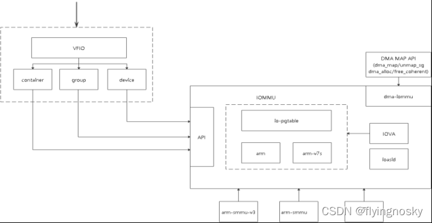
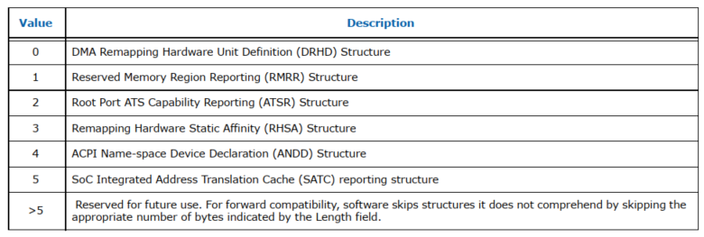
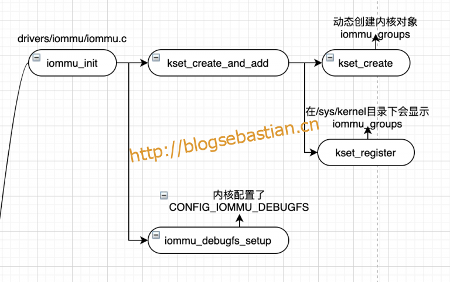

<!-- @import "[TOC]" {cmd="toc" depthFrom=1 depthTo=6 orderedList=false} -->

<!-- code_chunk_output -->

- [1. 架构](#1-架构)
- [2. IOMMU](#2-iommu)
- [相关配置](#相关配置)
  - [enable vt-d](#enable-vt-d)
  - [intel_iommu=on](#intel_iommuon)
  - [iommu=pt](#iommupt)
- [IOMMU 初始化](#iommu-初始化)
  - [BIOS](#bios)
- [DMAR ACPI Table 结构](#dmar-acpi-table-结构)
  - [DMA Remapping Reporting Structure](#dma-remapping-reporting-structure)
  - [Remapping Structure Types](#remapping-structure-types)
  - [DRHD(DMA Remapping Hardware Unit Definition)表](#drhddma-remapping-hardware-unit-definition 表)
  - [](#)
- [3. IOMMU 驱动初始化](#3-iommu-驱动初始化)
- [4. 设备分组](#4-设备分组)
- [5. IOMMU 的作用和效果](#5-iommu-的作用和效果)
- [6. reference](#6-reference)

<!-- /code_chunk_output -->

# 1. 架构

IOMMU 驱动所处的位置位于 DMA 驱动之上, 其上又封装了一层 VFIO 驱动框架, 便于用户空间编写设备驱动直接调用底层的 api 操作设备.

```
                   +-------------+
                   | QEMU/CROSVM |
                   +-------------+
                          |
        .-----------------|--------------.
........|.................|..............|..........
        |                 |              |
 +---------------+  +-----------+  +-----------+
 | container API |  | group API |  | device API |
 +---------------+  +-----------+  +-----------+
        |                 |              |
        '-----------------|--------------'
                          |
                          v
                   +-------------+
                   | VFIO driver |
                   +-------------+
                          |
                          v
                .---------'---------.
                |                   |
                v                   v
         +-------------+     +--------------+
         | SMMU driver |     | IOMMU driver |
         +-------------+     +--------------+
	        |                   |
                '-------------------'
                          |
                          v
                    +------------+
                    | DMA driver |
                    +------------+
                          |
     .--------------------'--------------------.
     |             |             |             |
     v             v             v             v
+----------+  +----------+  +----------+  +----------+
|  Device  |  |  Device  |  |  Device  |  |  Device  |
+----------+  +----------+  +----------+  +----------+
```



IOMMU 框架可分为如下层次:

1. DMA-MAP 层: 提供对其他驱动 DMA MAP/UNMAP 的 API 接口;
2. IOVA 层: 提供 IOVA 的分配与释放, 并提供 RCACHE 缓存机制;
3. IO 页表层: 提供对 IO 设备页表的操作;
4. SMMU 驱动层: 提供 SMMU 驱动初始化,提供 IOMMU 对应的回调函数;
5. 其它 API 接口: 可提供对 VFIO 等 API 接口;

# 2. IOMMU

类同于 MMU, 对 DMA 做地址翻译, 用来解决 DMA 的安全性问题. DMA API 同时还肩负起了**设置 IOMMU** 的职责.

```cpp
dma_ops = &intel_dma_ops;
i40e_alloc_mapped_page
  └─dma_map_page
      └─intel_map_page
          └─__intel_map_single
              ├─if(iommu_no_mapping) return paddr;
              ├─intel_alloc_iova
              └─domain_pfn_mapping
```

内核用 IOMMU 的好处, **限制了设备 DMA 可写的范围**, 设备不能随便从物理内存读写了.

其实 IOMMU 更大的用处在于**用户态驱动**, 如 DPDK 和 qemu, 用于 **qemu passthrough** 能更好的理解 IOMMU 的作用. **guest** 发起 **DMA** 时设置的地址是 `guest_phy_addr`, qemu 拿到 **guest DMA 的内存段开始地址** `guest_dma_phy_addr_start` 转换成自己的 `host_dma_virt_addr`, 然后把两个地址和 DMA 段的长度 len 通知 vfio 建立 map, vfio 找从 `host_dma_phy_addr` 开始的 len 长度的连续物理内存, host_dma_virt_addr 映射到 `host_dma_phy_addr`, 然后 pin 住, 让 qemu 的虚拟地址始终有物理内存对应并且对应到固定物理内存. vfio 再给 iommu 建立表项, 如果 DMA 要和 `guest_phy_addr` 交换数据, 就和 `host_dma_phy_addr` 交换数据, iommu 中有个 iova, 其实这个 iova 在这儿就是 `guest_phy_addr`. dpdk 中有–iova, 相比较于 qemu 这儿就是小菜一碟.

kvm device passthrough 老方法

```cpp
kvm_iommu_map_pages
  └─iommu_map
      └─intel_iommu_map(domain->ops->map)
          └─domain_pfn_mapping
```

qemu 用 vfio 实现 device passthrough 新方法

```cpp
vfio_iommu_type1_ioctl
  └─vfio_dma_do_map
      └─vfio_pin_map_dma
          └─vfio_iommu_map
              └─iommu_map
                  └─intel_iommu_map(domain->ops->map)
                     └─domain_pfn_mapping
```

下面我们将对其原理进行分析, 主要参考资料是 Intel VT-d SPEC Chapter 3.


# 相关配置

BIOS 中 enable vt-d, 内核参数配置 intel_iommu=on iommu=pt

## enable vt-d

意思很明确, BIOS 收集 IOMMU 硬件相关的信息以及它和 PCI 设备连接关系的信息, 通过 ACPI 的表上报给操作系统.

## intel_iommu=on

用 intel_iommu 驱动来驱动 IOMMU 硬件单元, IOMMU 硬件有 intel/amd/arm 的等, 我们一般用 intel 的硬件, 当然用 intel 的 iommu 驱动了.

## iommu=pt

我们先看内核中关于这个配置的注释

```
/*
 * This variable becomes 1 if iommu=pt is passed on the kernel command line.
 * If this variable is 1, IOMMU implementations do no DMA translation for
 * devices and allow every device to access to whole physical memory. This is
 * useful if a user wants to use an IOMMU only for KVM device assignment to
 * guests and not for driver dma translation.
 */
```

光看注释理解还不太深刻, 下面分析一下代码加深理解.

早期 kvm pci passthrough 的实现, qemu 用到的参数是 `-device pci-assign,host=01:00.0`, kvm 最终调用了 iommu 的代码 domain_pfn_mapping.

```cpp
kvm_iommu_map_pages
  └─iommu_map
      └─intel_iommu_map(domain->ops->map)
          └─domain_pfn_mapping
```

kvm 也用了 vfio-pci, qemu 参数 `-device vfio-pci,host=b1:00.0`, 最终也调用了 iommu 的代码 domain_pfn_mapping.

```cpp
vfio_iommu_type1_ioctl
  └─vfio_dma_do_map
      └─vfio_pin_map_dma
          └─vfio_iommu_map
              └─iommu_map
                  └─intel_iommu_map(domain->ops->map)
                     └─domain_pfn_mapping
```

我们再看内核 i40e 的代码, 它也调用到了 domain_pfn_mapping.

```cpp
i40e_alloc_mapped_page
  └─dma_map_page
      └─intel_map_page
          └─__intel_map_single
              ├─if(iommu_no_mapping) return paddr;
              ├─intel_alloc_iova
              └─domain_pfn_mapping
```

发现 `kvm/vfio/i40e` 都调用到了函数 `domain_pfn_mapping`, 相比于 kvm 和 vfio, i40e 多了一个 if 判断, 条件是函数 `iommu_no_mapping` 的返回值.

```cpp
/* Check if the dev needs to go through non-identity map and unmap process.*/
static int iommu_no_mapping(struct device *dev)
{
	int found;

	if (iommu_dummy(dev))
		return 1;

	if (!iommu_identity_mapping)
		return 0;

	found = identity_mapping(dev);
	if (found) {
		if (iommu_should_identity_map(dev, 0))
			return 1;
		else {
			/*
			 * 32 bit DMA is removed from si_domain and fall back
			 * to non-identity mapping.
			 */
			dmar_remove_one_dev_info(si_domain, dev);
			pr_info("32bit %s uses non-identity mapping\n",
				dev_name(dev));
			return 0;
		}
	} else {
		/*
		 * In case of a detached 64 bit DMA device from vm, the device
		 * is put into si_domain for identity mapping.
		 */
		if (iommu_should_identity_map(dev, 0)) {
			int ret;
			ret = domain_add_dev_info(si_domain, dev);
			if (!ret) {
				pr_info("64bit %s uses identity mapping\n",
					dev_name(dev));
				return 1;
			}
		}
	}

	return 0;
}
```

再回头看 iommu 初始化的代码

```cpp
static int __init init_dmars(void)
{
	if (iommu_pass_through)
		iommu_identity_mapping |= IDENTMAP_ALL;
	if (iommu_identity_mapping) {
		ret = si_domain_init(hw_pass_through);
		if (ret)
			goto free_iommu;
	}

	if (iommu_identity_mapping) {
		ret = iommu_prepare_static_identity_mapping(hw_pass_through);
		if (ret) {
			pr_crit("Failed to setup IOMMU pass-through\n");
			goto free_iommu;
		}
	}
}
```

总结起来就是

配置了 `iommu=pt` 就 identity mapping

```cpp
if hw_pass_through==0
   hardware identity mapping
else
   software identity mapping
```

说明配置了 `iommu=pt` 上面的函数 `iommu_no_mapping` 返回 1, 那么 i40e 驱动就直接 return paddr, 并不会真正调用到 domain_pfn_mapping, 直接用了物理地址少了一次映射性能当然会高一些.


# IOMMU 初始化

## BIOS

BIOS 收集 IOMMU 相关的信息, 通过 ACPI 中的特定表组织数据, 放置在内存中, 等操作系统接管硬件后, 它会加载驱动, 驱动再详细解析 ACPI 表中的信息.

首先是 DMA Remapping Reporting Structure, 它后面紧跟下表这些结构.




```cpp
IOMMU_INIT_POST(detect_intel_iommu);

int __init detect_intel_iommu(void)
{
	struct dmar_res_callback validate_drhd_cb = {
		.cb[ACPI_DMAR_TYPE_HARDWARE_UNIT] = &dmar_validate_one_drhd,
		.ignore_unhandled = true,
	};
	......

    down_write(&dmar_global_lock);
    ret = dmar_table_detect();
	......

    if (!ret) {
        x86_init.iommu.iommu_init = intel_iommu_init;
        x86_platform.iommu_shutdown = intel_iommu_shutdown;
    }

    if (dmar_tbl) {
        acpi_put_table(dmar_tbl);
        dmar_tbl = NULL;
    }
    up_write(&dmar_global_lock);

    return ret ? ret : 1;
}
```

内核启动后从 **ACPI** 中获取 **DMAR table**, 解析 ACPI 表中两项: `DRHD, DMA Engine Reporting Structure` 和 `RMRR, Reserved memory Region Reporting Structure`. 调用 `detect_intel_iommu`, 它只检测了类型为 `ACPI_DMAR_TYPE_HARDWARE_UNIT` 的数据, 也就是 **IOMMU 硬件单元**, 还尝试读了 IOMMU 硬件的 capability 和 extended capability, 如果都成功给 `iommu_init` 赋值 `intel_iommu_init`.

```cpp
struct acpi_table_header * __initdata dmar_tbl;
static acpi_size dmar_tbl_size;
start_kernel
  └─mm_init
      └─mem_init
          └─detect_intel_iommu
              ├─dmar_table_detect
              ├─dmar_walk_dmar_table (解析 ACPI 表中两项 DRHD 和 RMRR)
              ├─pci_request_acs
              └─x86_init.iommu.iommu_init = intel_iommu_init
```

`intel_iommu_init` 横空出世, 那就得看什么地方调用到它. `detect_intel_iommu` 执行时还没有 memory allocator, 所以干的活很简单, 但 `intel_iommu_init` 执行时 memory allocator 已经形成, 所以 `intel_iommu_init` 就大量分配内存建立 iommu 的数据结构, 主要是 `struct dmar_drhd_unit` 和 `struct intel_iommu`.

```cpp
struct list_head dmar_drhd_units;
static LIST_HEAD(dmar_rmrr_units);
pci_iommu_init (arch/ia64/kernel/pci-dma.c or arch/x86/kernel/pci-dma.c)
  └─x86_init.iommu.iommu_init (drivers/iommu/intel/iommu.c)
      ├─iommu_init_mempool (drivers/iommu/intel/iommu.c)
      ├─dmar_table_init (drivers/iommu/intel/dmar.c) (dmesg 打印类似信息: ACPI DMAR:DRHD (flags: 0x00000000)base: 0x00000000fed90000)
      |   └─parse_dmar_table (drivers/iommu/intel/dmar.c)
      |       ├─dmar_table_detect
      |       └─dmar_walk_dmar_table
      |           └─dmar_walk_remapping_entries
      |               ├─dmar_parse_one_drhd
      |               |   ├─dmar_find_dmaru
      |               |   ├─dmar_alloc_dev_scope//分配好多空内存
      |               |   ├─alloc_iommu
      |               |   ├─map_iommu
      |               |   └─dmar_register_drhd_unit
      |               ├─dmar_parse_one_rmrr (drivers/iommu/intel/iommu.c)
      |               ├─dmar_parse_one_atsr (drivers/iommu/intel/iommu.c)
      |               ├─dmar_parse_one_rhsa (drivers/iommu/intel/dmar.c)
      |               └─dmar_parse_one_andd (drivers/iommu/intel/dmar.c)
      ├─dmar_dev_scope_init (drivers/iommu/intel/dmar.c)
      |   ├─dmar_acpi_dev_scope_init (drivers/iommu/intel/dmar.c)
      |   |     └─for(dev_scope_num in acpi table)
      |   |           ├─acpi_bus_get_device (drivers/acpi/scan.c)
      |   |           └─dmar_acpi_insert_dev_scope  (drivers/iommu/intel/dmar.c)   //给上面注释中指的内存空间中写 dev/bus
      |   └─for_each_pci_dev(dev) (drivers/iommu/intel/dmar.c) //把非 acpi 上报的 dev 上搞到 iommu 中来
      |       ├─dmar_alloc_pci_notify_info (drivers/iommu/intel/dmar.c)
      |       ├─dmar_pci_bus_add_dev (drivers/iommu/intel/dmar.c)
      |       |   ├─for_each_drhd_unit//找到 dev 的 hrhd 然后加入
      |       |   |    └─dmar_insert_dev_scope (drivers/iommu/intel/dmar.c)
      |       |   ├─dmar_iommu_notify_scope_dev (drivers/iommu/intel/iommu.c)
      |       |   └─intel_irq_remap_add_device (drivers/iommu/intel/irq_remapping.c)
      |       └─dmar_free_pci_notify_info (drivers/iommu/intel/dmar.c)
      ├─init_no_remapping_devices (drivers/iommu/intel/iommu.c) (Most GFX drivers don't call standard PCI DMA APIs to allocate DMA buffer,Such drivers will be broken with IOMMU enabled.)
      |   ├─for_each_drhd_unit (include/linux/dmar.h)
      |   |   └─for_each_active_dev_scope (include/linux/dmar.h)
      |   ├─for_each_active_drhd_unit (include/linux/dmar.h)
      |   |   └─for_each_active_dev_scope (include/linux/dmar.h)
      ├─init_dmars (drivers/iommu/intel/iommu.c)
      |   ├─for_each_iommu (include/linux/dmar.h)
      |   |   ├─intel_iommu_init_qi (mmu/intel/iommu.c) //软件给硬件通过这块内存提交任务, 硬件清自己的 iotlb 缓存
      |   |   |   └─dmar_enable_qi (drivers/iommu/intel/dmar.c)
      |   |   |       └─__dmar_enable_qi (drivers/iommu/intel/dmar.c) //写硬件寄存器
      |   |   ├─iommu_init_domains (iommu/intel/iommu.c) //分配了很多 struct dmar_domain
      |   |   └─iommu_alloc_root_entry (iommu/intel/iommu.c)
      |   ├─for_each_active_iommu (include/linux/dmar.h)
      |   |   ├─iommu_flush_write_buffer (drivers/iommu/intel/iommu.c)
      |   |   └─iommu_set_root_entry (drivers/iommu/intel/iommu.c) //写硬件寄存器
      |   ├─si_domain_init (drivers/iommu/intel/iommu.c)
      |   |   ├─alloc_domain(DOMAIN_FLAG_STATIC_IDENTITY)  (drivers/iommu/intel/iommu.c) //额外创建一个 domain
      |   |   ├─for_each_online_node (include/linux/nodemask.h) //在这个 domain 中 dma 地址和物理地址一一对应
      |   |   |   └─for_each_mem_pfn_range (include/linux/memblock.h)
      |   |   |       └─iommu_domain_identity_map (drivers/iommu/intel/iommu.c)
      |   |   |           └─__domain_mapping  (drivers/iommu/intel/iommu.c)
      |   |   └─for_each_rmrr_units (drivers/iommu/intel/iommu.c)//rmrr 内存在这个 domain 中一一对应
      |   |      └─for_each_active_dev_scope (include/linux/dmar.h)
      |   |           └─iommu_domain_identity_map (drivers/iommu/intel/iommu.c)
      |   └─for_each_iommu (include/linux/dmar.h)
      |       ├─iommu_flush_write_buffer (drivers/iommu/intel/iommu.c)
      |       └─dmar_set_interrupt (drivers/iommu/intel/dmar.c) //iommu 硬件自己的中断
      |           ├─dmar_alloc_hwirq (arch/x86/kernel/apic/msi.c or arch/ia64/kernel/msi_ia64.c)
      |           └─request_irq(irq, dmar_fault) (include/linux/interrupt.h)
      ├─bus_set_iommu (drivers/iommu/iommu.c)
      |   └─iommu_bus_init (drivers/iommu/iommu.c)
      |       ├─bus_iommu_probe (drivers/iommu/iommu.c) //处理 bus 上的设备
      |       |   ├─bus_for_each_dev (drivers/base/bus.c) //给 dev 分配 group,
      |       |   |   └─probe_iommu_group (drivers/iommu/iommu.c)
      |       |   |        └─__iommu_probe_device (drivers/iommu/iommu.c)
      |       |   |             ├─intel_iommu_probe_device (drivers/iommu/intel/iommu.c)
      |       |   |             └─iommu_group_get_for_dev (drivers/iommu/iommu.c)
      |       |   |                   └─pci_device_group (drivers/iommu/iommu.c) //真正决定 group 的函数
      |       |   └─list_for_each_entry_safe (include/linux/list.h)
      |       |        ├─probe_alloc_default_domain (drivers/iommu/iommu.c) //给内核管理的 dev 分配 default domain
      |       |        ├─iommu_group_create_direct_mappings (drivers/iommu/iommu.c) //对系统保留区分建立 mapping, 如 dev 和 ioapic 的关系
      |       |        |   └─__iommu_group_for_each_dev (drivers/iommu/iommu.c)
      |       |        |       └─iommu_create_device_direct_mappings (drivers/iommu/iommu.c)
      |       |        |           ├─list_for_each_entry (include/linux/list.h)
      |       |        |           |   ├─iommu_iova_to_phys (drivers/iommu/iommu.c)
      |       |        |           |   └─iommu_map (drivers/iommu/iommu.c)
      |       |        |           └─iommu_flush_iotlb_all (include/linux/iommu.h)
      |       |        ├─__iommu_group_dma_attach (drivers/iommu/iommu.c)
      |       |        |   └─__iommu_group_for_each_dev (drivers/iommu/iommu.c)
      |       |        |       └─iommu_group_do_dma_attach (drivers/iommu/iommu.c)
      |       |        |           └─__iommu_attach_device (domain->ops->attach_dev(domain, dev)) (drivers/iommu/iommu.c)
      |       |        |               └─intel_iommu_attach_device (intel_iommu_attach_device)
      |       |        |                   └─domain_add_dev_info ("drivers/iommu/intel/iommu.c")
      |       |        |                       └─dmar_insert_one_dev_info (drivers/iommu/intel/iommu.c)
      |       |        |                           └─dmar_insert_one_dev_info (drivers/iommu/intel/iommu.c)
      |       |        |                               ├─intel_pasid_alloc_table (drivers/iommu/intel/pasid.c)
      |       |        |                               ├─intel_pasid_setup_pass_through (drivers/iommu/intel/pasid.c)
      |       |        |                               ├─domain_setup_first_level (drivers/iommu/intel/iommu.c)
      |       |        |                               └─intel_pasid_setup_second_level (drivers/iommu/intel/pasid.c)
      |       |        └─__iommu_group_dma_finalize (drivers/iommu/iommu.c)
      |       |              └─__iommu_group_for_each_dev (drivers/iommu/iommu.c)
      |       |                  └─iommu_group_do_probe_finalize (drivers/iommu/iommu.c)
      |       |                      └─intel_iommu_probe_finalize (domain->ops->probe_finalize(dev)) (drivers/iommu/intel/iommu.c)
      |       |                          └─iommu_setup_dma_ops (drivers/iommu/intel/iommu.c)
      |       |                              └─iommu_dma_init_domain (drivers/iommu/dma-iommu.c) //给 dev 分配 iova 并且 flush 到硬件上
      |       └─bus_register_notifier(iommu_bus_notifier) (drivers/iommu/intel/dmar.c) //用于处理 hotplug 的设备
      ├─for_each_active_iommu (include/linux/dmar.h)
      |   ├─iommu_device_sysfs_add (drivers/iommu/iommu-sysfs.c)
      |   |   ├─device_initialize (drivers/base/core.c)
      |   |   ├─kobject_set_name_vargs (lib/kobject.c)
      |   |   ├─device_add (drivers/base/core.c)
      |   |   └─dev_set_drvdata (dev_set_drvdata)
      |   └─iommu_device_register (drivers/iommu/iommu.c)
      └─for_each_iommu  (include/linux/dmar.h)
              └─iommu_enable_translation (drivers/iommu/intel/iommu.c)
```

# DMAR ACPI Table 结构

在系统上电的时候, BIOS/UEFI 负责检测并初始化 DMAR(即 VT-d 硬件), 为其分配相应的物理地址, 并且以 ACPI 表中的 DMAR(DMA Remapping Reporting)表的形式告知 VT-d 硬件的存在.
DMAR 的格式如下所示, 先是标准的 APCI 表的表头, 然后是 Host Address Width 表示该系统中支持的物理地址宽度; 标志字节 Flag 表示 VT-d 硬件支持的一些功能, 最后是 Remapping Structures, 即一堆有组织的结构体用来描述 VT-d 硬件的功能.

## DMA Remapping Reporting Structure


## Remapping Structure Types

每个 Remapping Structure 的开始部分包含 type 和 length 两个字段. 其中, type 表示 DMA-remapping structure 的类型, 而 length 表示该 structure 的长度. 下表定义了 type 的可能值:


## DRHD(DMA Remapping Hardware Unit Definition)表

一个 DMAR 结构体用于唯一定义系统中存在的一个 VT-d 重定向硬件. 其结构体如下所示:


##


# 3. IOMMU 驱动初始化

内核在启动的时候就会**初始化好设备的信息**, 给**设备**分配相应的 **iommu group**, 其过程如下.

系统启动的时候会执行 `iommu_init` 函数进行内核对象 iommu 的初始化. 主要是调用了 `kset_create_and_add` 函数创建了 `iommu_groups` 对象. 在 `/sys/kernel` 目录下会出现 `iommu_groups` 目录.

可以使用内核调试方法, 在 `iommu_init` 函数处打断点, 查看系统对 iommu 初始化的过程.



注意需要内核打开相应的配置开关才能使得 IOMMU 功能生效.

<table style="width:100%">
<caption>内核配置选项</caption>
  <tr>
    <th>体系结构</th>
    <th>配置项</th>
  </tr>
  <tr>
    <td>armv1/v2</td>
    <td>CONFIG_ARM_SMMU</td>
  </tr>
  <tr>
    <td>armv3</td>
    <td>CONFIG_ARM_SMMU_V3</td>
  </tr>
  <tr>
    <td>intel x86</td>
    <td>CONFIG_INTEL_IOMMU</td>
  </tr>
  <tr>
    <td>amd x86</td>
    <td>CONFIG_AMD_IOMMU</td>
  </tr>
</table>

# 4. 设备分组


# 5. IOMMU 的作用和效果

iommu 实现了类似 MMU 的功能, 主要是做地址翻译. 其主要通过底层的 DMA api 来实现设备地址空间的映射. 其最终效果类似于下图:

```
               CPU                  CPU                  Bus
             Virtual              Physical             Address
             Address              Address               Space
              Space                Space

            +-------+             +------+             +------+
            |       |             |MMIO  |   Offset    |      |
            |       |  Virtual    |Space |   applied   |      |
          C +-------+ --------> B +------+ ----------> +------+ A
            |       |  mapping    |      |   by host   |      |
  +-----+   |       |             |      |   bridge    |      |   +--------+
  |     |   |       |             +------+             |      |   |        |
  | CPU |   |       |             | RAM  |             |      |   | Device |
  |     |   |       |             |      |             |      |   |        |
  +-----+   +-------+             +------+             +------+   +--------+
            |       |  Virtual    |Buffer|   Mapping   |      |
          X +-------+ --------> Y +------+ <---------- +------+ Z
            |       |  mapping    | RAM  |   by IOMMU
            |       |             |      |
            |       |             |      |
            +-------+             +------+
```

这里存在三种地址, 虚拟地址空间, 物理地址空间, 总线地址空间. 从 CPU 的视角看到的是虚拟机地址空间, 如我们调用 `kmalloc`,`vmalloc` 分配的都是**虚拟地址空间**. 然后通过 **MMU** 转换成 ram 或寄存器中的**物理地址**. 如 `C->B` 的过程. 物理地址可以在 `/proc/iomem` 中查看.

IO 设备通常使用的是总线地址, 在一些系统上, 总线地址就等于物理地址. 但是通常有 iommu 和南桥的设备则会做总线地址到物理地址之间的映射.

如上图 A->C 未进行 DMA 的过程, 内核首先扫到 IO 设备和他们的 MMIO 空间以及将设备挂到系统上的 host bridge 信息. 假如设备有一个 BAR, 内核从 BAR 中读取总线地址 A, 然后转换成物理地址 B. 物理地址 B 可以在 `/proc/iomem` 中查看到. 当驱动挂载到设备上时, 调用 `ioremap( )` 将物理地址 B 转换成虚拟地址 C. 之后就可以通过读写 C 的地址来访问到最终的设备寄存器 A 的地址.

如上图 `X->Y`, `Z->Y` 使用 DMA 的过程, 驱动首先使用 kmalloc 或类似接口分配一块缓存空间即地址 X, 内存管理系统会将 X 映射到 ram 中的物理地址 Y. 设备本身不能使用类似的方式映射到同一块物理地址空间, 因为 DMA 没有使用 MMU 内存管理系统. 在一些系统上, 设备可以直接 DMA 到物理地址 Y, 但是通常有 IOMMU 硬件的系统会 DMA 设备到地址 Z, 然后通过 IOMMU 转换到物理地址 Y. 这是因为调用 DMA API 的时候, 驱动将**虚拟地址**X 传给类似 `dma_map_single( )` 的接口后, 会建立起必须的 IOMMU 映射关系, 然后返回 DMA 需要映射的地址 Z. 驱动然后通知设备做 DMA 映射到地址 Z, 最后 IOMMU 映射地址 Z 到 ram 中的缓存地址 Y.

从上面的两个例子中客户看出, IOMMU 硬件的存在会加速地址的转换速度, 从 X->Y 是通过 CPU 完成的, 而 Z->Y 则是通过 IOMMU 硬件完成. 同时能够做到安全, IOMMU 会校验 Y->Z 地址的合法性, 避免了直接 DMA 到 Y 可能带来的安全问题.


# 6. reference

https://www.kernel.org/doc/Documentation/DMA-API-HOWTO.txt

https://www.blogsebastian.cn/?p=116

https://www.owalle.com/2021/11/01/iommu-code/ (IOMMU 代码分析)

