<!-- @import "[TOC]" {cmd="toc" depthFrom=1 depthTo=6 orderedList=false} -->

<!-- code_chunk_output -->

- [1. 简介](#1-简介)
  - [1.1. 设备直通](#11-设备直通)
  - [1.2. VFIO 基本思想](#12-vfio-基本思想)
    - [1.2.1. 物理资源分解](#121-物理资源分解)
    - [1.2.2. 资源聚合](#122-资源聚合)
  - [1.3. 虚拟化难题](#13-虚拟化难题)
  - [1.4. IOMMU 的引入](#14-iommu-的引入)
  - [1.5. 功能和实现](#15-功能和实现)
    - [1.5.1. 用户态驱动开发](#151-用户态驱动开发)
    - [1.5.2. 设备透传](#152-设备透传)
- [2. 核心概念](#2-核心概念)
  - [2.1. Device](#21-device)
  - [2.2. Group](#22-group)
  - [2.3. Container](#23-container)
  - [2.4. 之间的关系](#24-之间的关系)
- [3. VFIO 框架简介](#3-vfio-框架简介)
  - [3.1. vfio interface](#31-vfio-interface)
  - [3.2. vfio_iommu 和 vfio_pci](#32-vfio_iommu-和-vfio_pci)
  - [3.3. iommu driver 和 pci_bus driver](#33-iommu-driver-和-pci_bus-driver)
  - [3.4. 示例](#34-示例)
- [4. VFIO 使用](#4-vfio-使用)
  - [4.1. 操作设备](#41-操作设备)
  - [4.2. 配置 IOMMU](#42-配置-iommu)
- [5. 用户态驱动使用](#5-用户态驱动使用)
- [6. 设备透传分析](#6-设备透传分析)
  - [6.1. 虚拟机地址映射](#61-虚拟机地址映射)
  - [6.2. 设备透传实现](#62-设备透传实现)
- [7. VFIO 中的技术关键点](#7-vfio-中的技术关键点)
- [8. reference](#8-reference)

<!-- /code_chunk_output -->

# 1. 简介

## 1.1. 设备直通

**设备直通**就是将物理设备直接挂到虚拟机, 虚拟机通过直接与设备交互来获得较好的性能.

**传统的透传设备**到虚拟机的方法为 **PCI passthrough**, 这种老的设备直通方式需要 **KVM 完成大量的工作**, 如与 IOMMU 交互, 注册中断处理函数等. 显然这种方法会让 KVM 过多地与设备打交道, 扮演一个设备驱动的角色, 这种方案不够通用灵活, 所以后来有了 VFIO(Virtual Function I/O).

VFIO 是一个**用户态驱动框架**, 它利用**硬件层面的 I/O 虚拟化技术**, 如 Intel 的 `VT-d` 和 AMD 的 `AMD-Vi`, 将设备直通给虚拟机.

* Native 上, **设备驱动**与**设备**进行**交互**需要访问设备的很多资源, 如 PCI 设备的**配置空间**, **BAR** 地址空间, 设备**中断**等, 所有这些资源都是在**内核态**进行分配和访问的;

* 虚拟化环境下, 把设备直通给虚拟机之后, **QEMU** 需要**接管所有虚拟机对设备资源的访问**.

## 1.2. VFIO 基本思想

> 下面两个图均来自 Alex Williamson 在 KVM Forum 2016 上的演讲 `An Introduction to PCI Device Assignment with VFIO`(附件有).

VFIO 的基本思想包括两个部分:

### 1.2.1. 物理资源分解

第一个是**将物理设备的各种资源分解**, 并将**获取这些资源的接口**向上**导出**到**用户空间**, 如下图所示, **QEMU** 等应用层软件可以利用这些接口**获取硬件的所有资源**, 包括设备的配置空间, BAR 空间和中断.

**VFIO 抽象物理设备**:

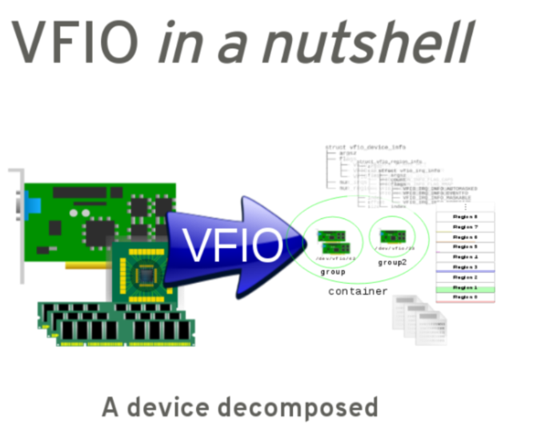

### 1.2.2. 资源聚合

VFIO 思想的第二部分就是**聚合**, 也就是将**从硬件设备得到的各种资源聚合起来**, 对虚拟化**展示一个完整的设备接口**, 这种聚合是**在用户空间完成**的, 聚合的思想如下图所示.

**图 VFIO 组装成一个虚拟设备**:

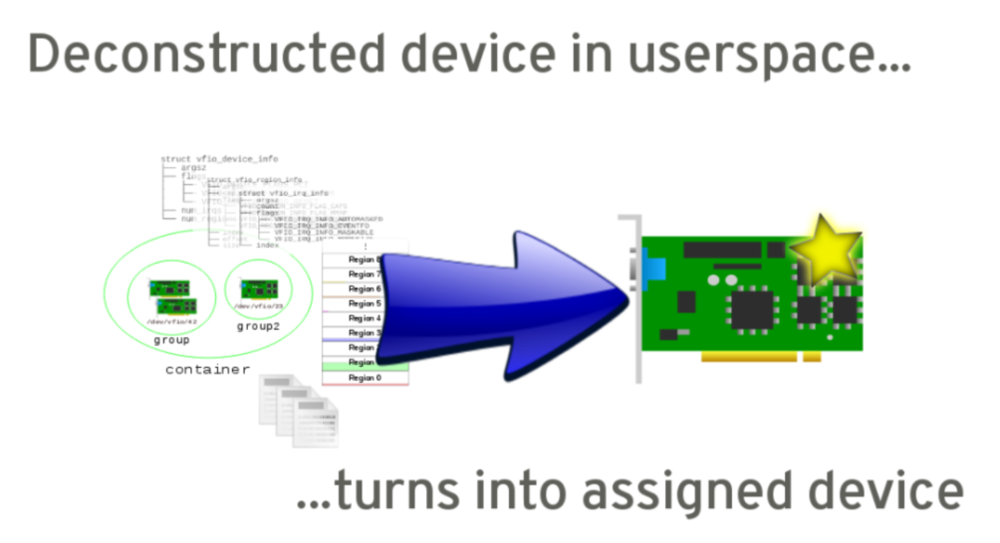

以 QEMU 为例, 它从硬件设备分解各种资源之后, 会重新聚合成一个虚拟设备挂到虚拟机上, QEMU 还会调用 KVM 的接口将这些资源与虚拟机联系起来, 使得虚拟机内部完全对 VFIO 的存在无感知, 虚拟机内部的操作系统能够透明地与直通设备进行交互, 也能够正常处理直通设备的中断请求.

## 1.3. 虚拟化难题

在**非虚拟化环境**中, 大部分情况下都是通过**设备驱动访问硬件外设**的:

* **对于设备**来说, 其**访问的内存地址空间**可以是**整个机器**的;

* **外设的中断**也统一纳入**操作系统的中断处理框架**.

但是在**虚拟化环境**下, 当把设备直通给虚拟机之后, 有两个难点需要解决:

* 一个是**设备 DMA 使用的地址**;

* 另一个是由于**虚拟机内部**在指定设备 **DMA 地址**的时候能够**随意指定地址**, 所以需要有一种机制来对设备的 DMA 地址访问进行**隔离**.

在 Intel 架构上, **MSI 中断**是通过 **DMA 写一段地址**完成的, 任何 DMA 的发起者都能够写任意数据, 这就会导致虚拟机内部的**攻击者**能够**让外设产生不属于它的中断**. 所以, VT-d 技术中的另一个要解决的问题是**中断重定向**, **设备产生的中断**会经过中断重定向器来判断中断是否合法以及是否重定向到虚拟机内部.

## 1.4. IOMMU 的引入

类似于 MMU 把 CPU 访问的虚拟机地址转换为物理地址, VT-d 技术中的 **DMA 重映射器**和**中断重映射**模块叫作 IOMMU, IOMMU 的基本原理如图 7-50 所示.

图 IOMMU 基本原理:

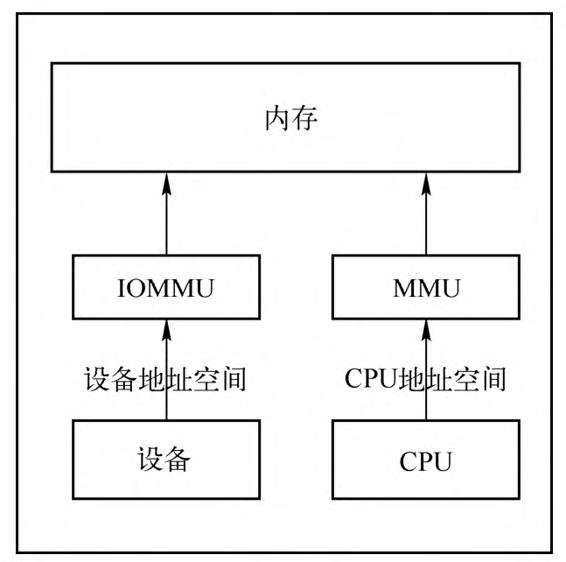

DMA Remapping 和 Interrupt Remapping 见前面内容.

IOMMU 对来自设备 (客户机) 的 DMA 请求的地址进行重新影射, 使 VMM 不用介入每一个 DMA 操作本身. 下图展示了 Intel 公司的 IOMMU 体系结构, AMD 公司的 IOMMU 体系结构基本类似. 在 IOMMU 中, 每一个设备可以被一个唯一的设备地址标识, 即 32 位的 BDF (Bus, Device, Function) 号码.

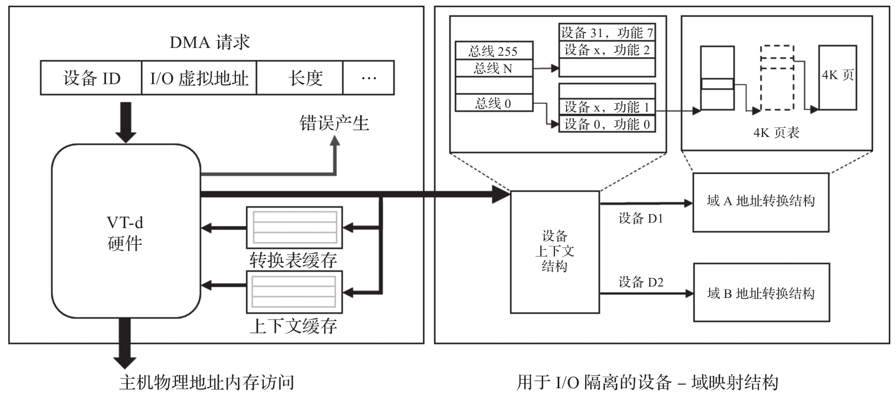

## 1.5. 功能和实现

VFIO 充分利用了 `VT-d`/`AMD-Vi` 技术提供的 IOMMU `DMA Remapping` 和 `Interrupt Remapping` 特性, 在保证直通设备的 DMA 安全性同时可以达到接近物理设备的 I/O 的性能.

一套**用户态驱动框架**, 它提供了两个基本服务:

* 向用户态提供**访问硬件设备的接口**;

* 向用户态提供**配置 IOMMU 的接口**.

VFIO 利用 IOMMU 硬件特性, 可以**屏蔽物理地址对上层的可见性**.

* 可以用来**开发用户态驱动**;

* 在虚拟化情景下, 也可以**在用户态实现设备透传**.

通过 VFIO 访问硬件并无新意, VFIO 可贵之处在于第一次向用户态开放了 IOMMU 接口, 能完全**在用户态配置 IOMMU**, 将 DMA 地址空间映射进而限制在进程虚拟地址空间之内. 这对高性能用户态驱动以及在用户态实现 device passthrough 意义重大.

VFIO 由**平台无关的接口层**与**平台相关的实现层**组成.

* **接口层**将服务抽象为 IOCTL 命令, 规化操作流程, 定义通用数据结构, 与用户态交互. 实现层完成承诺的服务. 据此, 可在用户态实现支持 DMA 操作的高性能驱动. 在虚拟化场景中, 亦可借此完全在用户态实现 device passthrough.

* **实现层**又分为**设备实现层**与 **IOMMU 实现层**.

  * 当前 VFIO 仅支持 PCI 设备.

  * IOMMU 实现层则有 x86 与 PowerPC 其它种类硬件及 IOMMU 的支持.

**VFIO 设备实现层**与 **Linux 设备模型**紧密相连. 当前, VFIO 中仅有针对 PCI 的设备实现层(实现在 **vfio-pci** 模块中). **设备实现层**的作用与普通设备驱动的作用类似. 普通设备驱动向上穿过若干抽象层, 最终以 Linux 里广为人知的抽象设备(网络设备, 块设备等等)展现于世. **VFIO 设备实现层**在 `/dev/vfio/` 目录下为设备所属的 **IOMMU group 生成相关文件**, 继而将设备暴露出来. 两者起点相同, 最终呈现给用户态不同的接口. 欲使设备置于 VFIO 管辖之下, 需将其与旧驱动解除绑定, 由 **VFIO 设备实现层接管**. 用户态能感知到的, 是一个设备的消失(如 eth0), 及 `/dev/vfio/N` **文件的诞生**(其中 N 为设备所在 IOMMU group 的序号). 由于 IOMMU group 内的设备相互影响, 只有组内全部设备被 VFIO 管理时, 方能经 VFIO 配置此 IOMMU group.

**把设备归于 IOMMU group 的策略由平台决定**. 在 PowerNV 平台, 一个 IOMMU group 与一个 PE 对应. PowerPC 平台不支持将多个 IOMMU group 作为更大的 IOMMU 操作单元, 故而 container 只是 IOMMU group 的简单包装而已. 对 container 进行的 IOMMU 操作最终会被路由至底层的 **IOMMU 实现层**, 这实际上是将用户态与内核里的 IOMMU 驱动接连了起来.

### 1.5.1. 用户态驱动开发

**VFIO** 是一套完整的**用户态驱动**(userspace driver)**方案**, 因为它可以安全地把**设备 I/O**, **中断**, **DMA** 等能力呈现给用户空间.

**用户态进程**可以直接使用 **VFIO 驱动**直接访问硬件, 并且由于整个过程是在 IOMMU 的保护下进行因此十分安全, 而且**非特权用户**也是可以**直接使用**, 从而可以在**用户空间**完成**设备驱动的框架**.

### 1.5.2. 设备透传

为了达到最高的 IO 性能, 虚拟机就需要 VFIO 这种设备直通方式, 因为它具有低延时, 高带宽的特点, 并且 guest 也能够直接使用设备的原生驱动. 这些优异的特点得益于 VFIO 对 `VT-d`/`AMD-Vi` 所提供的 DMA Remapping 和 Interrupt Remapping 机制的应用:

* 使用 **DMA Remapping** 为 **每个 Domain** 建立独立的 `IOMMU Page Table`, 将直通设备的 DMA 访问限制在 **Domain 的地址空间之内**, 从而保证了用户态 DMA 的安全性.

* 使用 `Interrupt Remapping` 来完成**中断重映射**和 `Interrupt Posting` 来达到 **中断隔离** 和 **中断直接投递** 的目的.

# 2. 核心概念

在了解 VFIO 之前需要了解 3 个基本概念: device, group, container, 它们在逻辑上的关系如图所示.

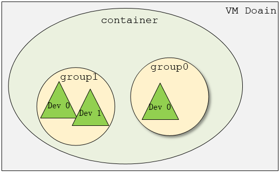

## 2.1. Device

**Device** 指的是我们要操作的**硬件设备**, 不过这里的 "设备" 需要从 **IOMMU 拓扑**的角度去理解.

  * 如果该设备是**硬件拓扑上一个独立的设备**, 那么它**自己就构成一个 iommu group**.

  * 如果这里是一个 **multi-function 设备**, 那么它和其他的 function **一起组成**一个 **iommu group**.

因为**多个 function 设备在物理硬件上就是互联的**, 他们可以**互相访问对方的数据**, 所以必须放到一个 group 里隔离起来.

>
>也就是说一个 group 就是 BDF 中的 BD 相同的 device 集合
>
> 值得一提的是, 对于**支持 PCIe ACS 特性**的硬件设备, 我们可以认为他们在物理上是互相隔离的.

```
# tree /sys/kernel/iommu_groups/
/sys/kernel/iommu_groups/
├── 0
│   ├── devices
│   │   └── 0000: 00: 00.0 -> ../. ./. ./. ./devices/pci0000: 00/0000: 00: 00.0
│   ├── reserved_regions
│   └── type
......
├── 11
│   ├── devices
│   │   ├── 0000: 00: 0d.0 -> ../. ./. ./. ./devices/pci0000: 00/0000: 00: 0d.0
│   │   ├── 0000: 00: 0d.2 -> ../. ./. ./. ./devices/pci0000: 00/0000: 00: 0d.2
│   │   └── 0000: 00: 0d.3 -> ../. ./. ./. ./devices/pci0000: 00/0000: 00: 0d.3
│   ├── reserved_regions
│   └── type

# lspci
00: 0d.0 USB controller: Intel Corporation Device 9a13 (rev 01)
00: 0d.2 USB controller: Intel Corporation Device 9a1b (rev 01)
00: 0d.3 USB controller: Intel Corporation Device 9a1d (rev 01)
......
```

## 2.2. Group

**Group** 是 **IOMMU** 能够进行 **DMA 隔离的最小硬件单元**, 一个 group 内可能只有一个 device, 也可能有**多个 device**, 这取决于**物理平台**上**硬件的 IOMMU 拓扑结构**.

设备直通的时候一个 group 里面的设备必须都直通给一个虚拟机.

> 不能够让一个 group 里的多个 device 分别从属于 2 个不同的 VM, 也不允许部分 device 在 host 上而另一部分被分配到 guest 里, 因为这样一个 guest 中的 device 可以利用 DMA 攻击获取另外一个 guest 里的数据, 就无法做到物理上的 DMA 隔离.
>
> 另外, **VFIO 中的 group** 和 **iommu group** 可以认为是同一个概念.

## 2.3. Container

* **Container** 是一个**和地址空间相关联**的概念. 对于虚机, 理解为**一个 VM Domain 的物理内存空间**; 对于用户态驱动, Container 可以是多个 Group 的集合

> DMA Isolation 是以 Domain 为单位进行隔离的. **每个 VM 的地址空间称为一个 Domain**.

## 2.4. 之间的关系

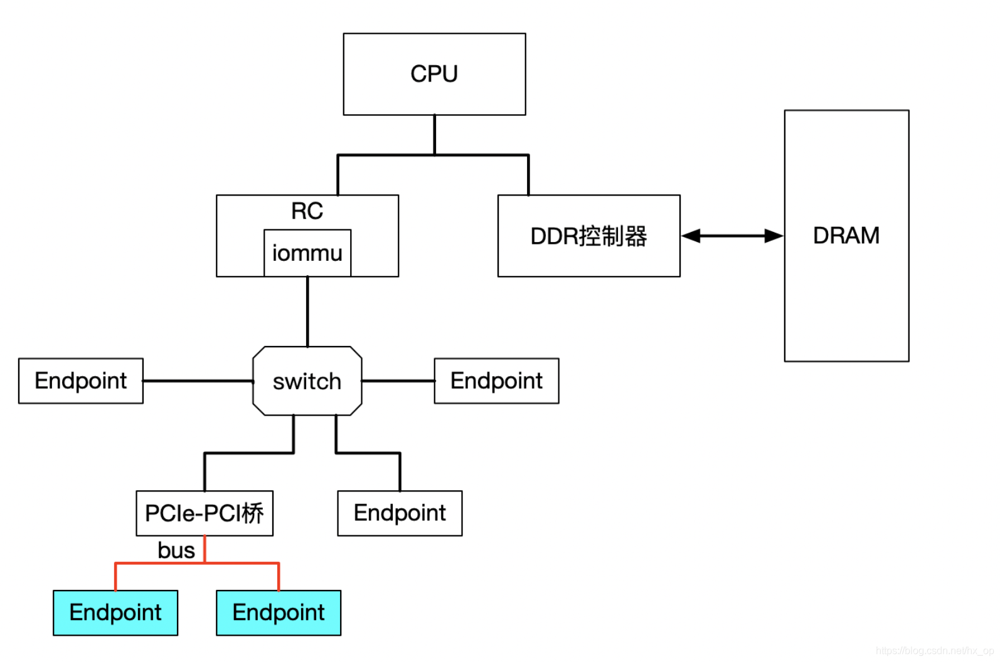

上图中 PCIe-PCI 桥下的两个设备, 在发送 DMA 请求时,  **PCIe-PCI 桥**会为下面两个设备生成 **Source Identifier**, 其中 **Bus** 域为**红色总线号 bus**, **device** 和 **func** 域为 **0**. 这样的话, PCIe-PCI 桥下的两个设备会找到**同一个 Context Entry** 和**同一份页表**, 所以这两个设备不能分别给两个虚机使用, 这两个设备就属于一个 Group.

从上图可以看出:

1. 一个或**多个 device** 从属于**某个 group**
2. 而一个或**多个 group** 又从属于**一个 container**, 这些 group 共享页表信息.

如果要**将一个 device 直通给 VM**, 那么先要找到**这个设备从属的 iommu group**, 然后将**整个 group** 加入到 **container** 中即可.

# 3. VFIO 框架简介

整个 VFIO 框架设计十分简洁清晰, 可以用下面的一幅图描述:

```
+-------------------------------------------+
|                                           |
|             VFIO Interface                |
|                                           |
+---------------------+---------------------+
|                     |                     |
|     vfio_iommu      |      vfio_pci       |
|                     |                     |
+---------------------+---------------------+
|                     |                     |
|    iommu driver     |    pci_bus driver   |
|                     |                     |
+---------------------+---------------------+
```

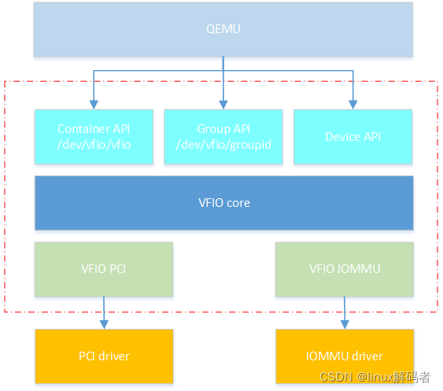

其中:

(1) **vfio interface** 作为接口层, 用于向应用层导出接口,QEMU 等用户程序可以通过相应的 ioctl 与 VFIO 进行交互;

(2) **vfio_iommu** 是对底层 **iommu driver** 的封装, 通过调用 iommu driver 接口, 用来**向上提供 IOMMU 的功能**, 比如 **DMA Remapping** 和 **Interrupt Remapping**;

(3) **iommu driver** 是物理硬件 IOMMU 的驱动实现, 如 Intel 和 ADM 的 IOMMU;

(4) **vfio_pci** 是对设备驱动的封装, 用于向用户进程**提供访问设备驱动的功能**, 如配置空间和 BAR 空间;

(5) **pci_bus driver** 是物理 PCI 设备的驱动程序.

## 3.1. vfio interface

最上层的是 `VFIO Interface`, 它负责**向用户态**提供**统一访问的接口**, 用户态通过约定的 **ioctl** 来设置和调用 VFIO 的各种能力.

VFIO 代码(QEMU 部分)主要有三个结构体:

* VFIO Device, 表示 VFIO 设备;
* VFIO Group, 表示 Group, 一个 Group 可以包含多个设备;
* VFIO Contianer, 表示整个地址空间.

QEMU 分别通过**这三个结构体的文件描述符 fd** 访问内核中的信息:

* **Container 文件描述符**: 打开 `/dev/vfio/vfio` 字符设备可得

    * 将 group 与 container 关联, 同时 container 会与 iommu_driver 联系起来, 这样通过 container 可以进行 IOMMU 相关的操作

* **IOMMU group 文件描述符**: 打开 `/dev/vfio/groupid` 文件可得(详见后文)

  * 可以获取 group 状态或对 group 进行设置

* **Device 文件描述符**: 向 IOMMU group 文件描述符发起相关 ioctl 可得

    * 可以获取到访问到设备的资源(配置空间, BAR 空间, 中断)

逻辑上来说, IOMMU group 是 IOMMU 操作的最小对象. 某些 **IOMMU 硬件支持**将若干 IOMMU group 组成更大的单元. VFIO 据此做出 **container** 的概念, 可容纳**多个 IOMMU group**, 打开 `/dev/vfio` 文件即新建一个空的 container. 在 VFIO 中, container 是 IOMMU 操作的最小对象.

与 KVM 一样, 用户态 QEMU 通过 IOCTL 与 VFIO 交互.

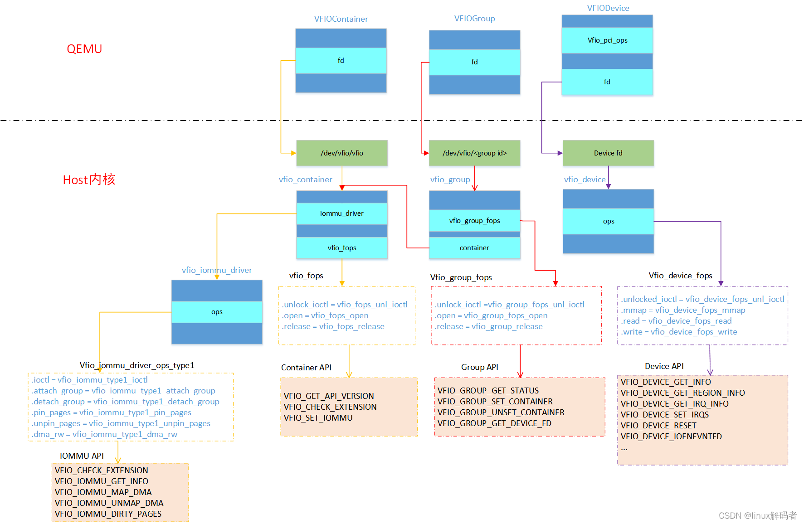

上图可以看到, 通过 Container API, 可以调用 container API 和 IOMMU API.

内核态中也存在三个结构体 vfio_device, vfio_group 和 vfio_container 分别与上述三个 QEMU 中三个结构体对应.

## 3.2. vfio_iommu 和 vfio_pci

中间层分别是 `vfio_iommu` 和 `vfio_pci`

* **vfio_iommu** 是 VFIO **对 iommu 层的统一封装**主要用来实现 **DMAP Remapping** 的功能, 即**管理 IOMMU 页表**的能力.

```cpp
// drivers/vfio/vfio_iommu_type1.c
static const struct vfio_iommu_driver_ops vfio_iommu_driver_ops_type1 = {
        ......
        .release                = vfio_iommu_type1_release,
        .ioctl                  = vfio_iommu_type1_ioctl,
        .pin_pages              = vfio_iommu_type1_pin_pages,
        .dma_rw                 = vfio_iommu_type1_dma_rw,
        ......
}

static int __init vfio_iommu_type1_init(void)
{
        return vfio_register_iommu_driver(&vfio_iommu_driver_ops_type1);
}
module_init(vfio_iommu_type1_init);
```

* **vfio_pci** 是 VFIO **对 pci 设备驱动的统一封装**, 它和**用户态进程**一起配合完成**设备访问直接访问**, 具体包括 **PCI 配置空间模拟**, **PCI Bar 空间重定向**, **Interrupt Remapping** 等.

```cpp
// drivers/vfio/pci/vfio_pci.c
static const struct vfio_device_ops vfio_pci_ops = {
        .name           = "vfio-pci",
        .open_device    = vfio_pci_open_device,
        .close_device   = vfio_pci_core_close_device,
        .ioctl          = vfio_pci_core_ioctl,
        .read           = vfio_pci_core_read,
        .write          = vfio_pci_core_write,
        .mmap           = vfio_pci_core_mmap,
        .request        = vfio_pci_core_request,
        .match          = vfio_pci_core_match,
};
```

```
  │ Symbol: VFIO_PCI [=m]                                                                                        │
  │ Type  : tristate                                                                                             │
  │ Defined at drivers/vfio/pci/Kconfig:2                                                                        │
  │   Prompt: VFIO support for PCI devices                                                                       │
  │   Depends on: VFIO [=y] && PCI [=y] && EVENTFD [=y] && MMU [=y]                                              │
  │   Location:                                                                                                  │
  │     -> Device Drivers                                                                                        │
  │ (1)   -> VFIO Non-Privileged userspace driver framework (VFIO [=y])                                          │
  │ Selects: VFIO_VIRQFD [=m] && IRQ_BYPASS_MANAGER [=m]

  │ Symbol: PCIE_BUS_DEFAULT [=y]                                                                                │
  │ Type  : bool                                                                                                 │
  │ Defined at drivers/pci/Kconfig:218                                                                           │
  │   Prompt: Default                                                                                            │
  │   Depends on: <choice> && PCI [=y]                                                                           │
  │   Location:                                                                                                  │
  │     -> Device Drivers                                                                                        │
  │       -> PCI support (PCI [=y])                                                                              │
  │ (1)     -> PCI Express hierarchy optimization setting (<choice> [=y])
```

## 3.3. iommu driver 和 pci_bus driver

最下面的一层则是**硬件驱动调用层**

* **iommu driver** 是与**硬件平台相关的实现**, 例如它可能是 `intel iommu driver` 或 `amd iommu driver` 或者 `ppc iommu driver`

```cpp
// drivers/iommu/intel/iommu.c
const struct iommu_ops intel_iommu_ops = {
        .capable                = intel_iommu_capable,
        .domain_alloc           = intel_iommu_domain_alloc,
        .domain_free            = intel_iommu_domain_free,
        ......
}
```

* **vfio_pci** 会调用到 host 上的 **pci_bus driver** 来实现**设备的注册和反注册**等操作.

```cpp
// drivers/pci/bus.c

```

## 3.4. 示例

1. `vfio_iommu_driver` -> `iommu driver` -> `intel iommu driver`

* `"drivers/vfio/vfio_iommu_type1.c"` -> `"drivers/iommu/iommu.c"` -> `"drivers/iommu/intel/iommu.c"`

* `release()` -> `vfio_iommu_type1_release()` -> `vfio_release_domain()` -> `iommu_domain_free()` -> `domain->ops->domain_free(domain)` -> `intel_iommu_domain_free()`

2.

`"drivers/pci/pci-driver.c"` -> `drivers/pci/bus.c`

`vfio_pci_probe()` -> `vfio_pci_core_register_device()`

`vfio_pci_bus_notifier()`

`pci_device_probe()` ->

# 4. VFIO 使用

关于使用 VFIO 可以参考内核文档: [vfio.txt](https://www.kernel.org/doc/Documentation/vfio.txt)

要使用 VFIO, 需先将设备与原驱动拨离, 并与 VFIO 绑定.

## 4.1. 操作设备

用 VFIO 访问设备的步骤:

1. 打开设备所在 IOMMU group 在 `/dev/vfio/groupid` 目录下的文件

2. 使用 `VFIO_GROUP_GET_DEVICE_FD` **得到**表示**设备的文件描述符**(参数为设备名称,一个典型的 PCI 设备名形如 `0000:03.00.01`)

3. 对设备进行 `read`/`write`/`mmap` 等操作

## 4.2. 配置 IOMMU

用 VFIO 配置 IOMMU 的步骤:

1. 打开 `/dev/vfio/vfio`, 得到 container 文件描述符

2. 用 `VFIO_SET_IOMMU` **绑定一种 IOMMU 实现层**

3. 打开 `/dev/vfio/groupid`, 得到 IOMMU group 文件描述符

4. 用 `VFIO_GROUP_SET_CONTAINER` 将 IOMMU group 加入 container

5. 用 `VFIO_IOMMU_MAP_DMA` 将此 IOMMU group 的 DMA 地址映射至进程虚拟地址空间

# 5. 用户态驱动使用

这里先以简单的用户态驱动为例, 在设备透传小节中, 再分析如何利用 vfio 实现透传.

Documentation/driver-api/vfio.rst

假设想要使用设备 `0000:06:0d.0`

加载 VFIO 模块

```
modprobe vfio-pci
```

获取 PCI 设备 0000:06:0d.0 的 group_id (PCI 命名的规则是 `domain:bus:slot.func`), 这个是由内核生成的.

```
$ readlink /sys/bus/pci/devices/0000:06:0d.0/iommu_group
../../../../kernel/iommu_groups/26
```

该设备在 iommu group 26 中. 这个设备在 pci bus, 所以可以使用 vfio-pci 管理这个 group

解绑 PCI 设备, 然后创建一个 container ID

```
$ lspci -n -s 0000:06:0d.0
06:0d.0 0401: 1102:0002 (rev 08)

# echo 0000:06:0d.0 > /sys/bus/pci/devices/0000:06:0d.0/driver/unbind

# echo 1102 0002 > /sys/bus/pci/drivers/vfio-pci/new_id
```

然后寻找其他同属于一个 group 的设备

```
$ ls -l /sys/bus/pci/devices/0000:06:0d.0/iommu_group/devices
total 0
lrwxrwxrwx. 1 root root 0 Apr 23 16:13 0000:00:1e.0 ->
    ../../../../devices/pci0000:00/0000:00:1e.0
lrwxrwxrwx. 1 root root 0 Apr 23 16:13 0000:06:0d.0 ->
    ../../../../devices/pci0000:00/0000:00:1e.0/0000:06:0d.0
lrwxrwxrwx. 1 root root 0 Apr 23 16:13 0000:06:0d.1 ->
    ../../../../devices/pci0000:00/0000:00:1e.0/0000:06:0d.1
```

**PCI 桥** `0000:00:1e.0` 后面挂了两个设备, 一个是刚才加进去的 0000:06:0d.0, 还有一个是 0000:06:0d.1, 通过上面的步奏加进去就可以.

最后一步是让用户有权限使用这个 group.

```
# chown user:user /dev/vfio/26
```

下面就是一个样例, 从用户态使用 VFIO, 整个的使用方式是通过 ioctl 来获取中断相关信息, 以及注册中断处理函数, 然后也是通过 ioctl 来获取 region 信息, 然后调用相应的 mmap 函数, 让 CPU 可以访问内存.

```cpp
int container, group, device, i;
struct vfio_group_status group_status =
                { .argsz = sizeof(group_status) };
struct vfio_iommu_type1_info iommu_info = { .argsz = sizeof(iommu_info) };
struct vfio_iommu_type1_dma_map dma_map = { .argsz = sizeof(dma_map) };
struct vfio_device_info device_info = { .argsz = sizeof(device_info) };

/* Create a new container */
container = open("/dev/vfio/vfio", O_RDWR);

/* Unknown API version */
if (ioctl(container, VFIO_GET_API_VERSION) != VFIO_API_VERSION)

/* Doesn't support the IOMMU driver we want. */
if (!ioctl(container, VFIO_CHECK_EXTENSION, VFIO_TYPE1_IOMMU))

/* Open the group */
group = open("/dev/vfio/26", O_RDWR);

/* Test the group is viable and available */
ioctl(group, VFIO_GROUP_GET_STATUS, &group_status);

/* Group is not viable (ie, not all devices bound for vfio) */
if (!(group_status.flags & VFIO_GROUP_FLAGS_VIABLE))

/* Add the group to the container */
ioctl(group, VFIO_GROUP_SET_CONTAINER, &container);

/* Enable the IOMMU model we want */
// type 1 open | attatch
ioctl(container, VFIO_SET_IOMMU, VFIO_TYPE1_IOMMU);

/* Get addition IOMMU info */
ioctl(container, VFIO_IOMMU_GET_INFO, &iommu_info);

/* Allocate some space and setup a DMA mapping */
//倒数第二个参数的 0 是什么意思? 一般不是文件描述符吗 fd=open(...)??
dma_map.vaddr = mmap(0, 1024 * 1024, PROT_READ | PROT_WRITE,
                    MAP_PRIVATE | MAP_ANONYMOUS, 0, 0);
dma_map.size = 1024 * 1024;
/* 1MB starting at 0x0 from device view */
dma_map.iova = 0;
dma_map.flags = VFIO_DMA_MAP_FLAG_READ | VFIO_DMA_MAP_FLAG_WRITE;
//把 iova 地址映射到 vaddr 对应的物理地址
ioctl(container, VFIO_IOMMU_MAP_DMA, &dma_map);

/* Get a file descriptor for the device */
device = ioctl(group, VFIO_GROUP_GET_DEVICE_FD, "0000:06:0d.0");

/* Test and setup the device */
ioctl(device, VFIO_DEVICE_GET_INFO, &device_info);
```

对于 dev 下 Group 就是按照上一节介绍的 Group 划分规则产生的, **上述代码**描述了**如何使用 VFIO 实现映射**.

对于 Group 和 Container 的相关操作这里不做过多解释, 主要关注如何完成映射, 下图解释具体工作流程.

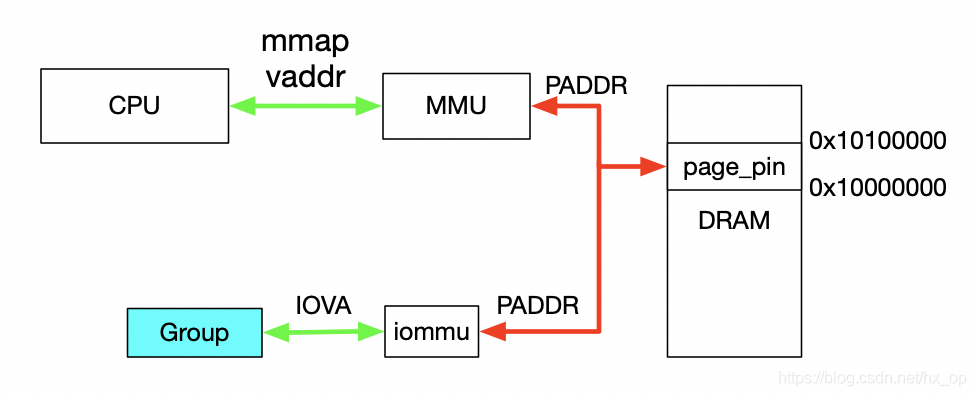

1. 首先, 利用 **mmap** 映射出 1MB 字节的**虚拟空间**, 因为**物理地址对于用户态不可见**, 只能通过虚拟地址访问物理空间;

2. 然后执行 ioctl 的 `VFIO_IOMMU_MAP_DMA` 命令, 传入参数主要包含 **vaddr** 及 **iova**, 其中**iova** 代表的是**设备发起 DMA 请求时要访问的地址**, 也就是 IOMMU 映射前的地址; vaddr 就是 mmap 的地址.

3. `VFIO_IOMMU_MAP_DMA` 命令会为**虚拟地址 vaddr** 找到**物理页**并 **pin** 住(因为**设备 DMA 是异步的**, 随时可能发生, 物理页面不能交换出去), 然后找到 Group 对应的 `Contex Entry`, 建立**页表项**, 页表项能够将 **iova 地址**映射成上面 pin 住的物理页对应的**物理地址**上去, 这样对用户态程序完全屏蔽了物理地址, 实现了**用户空间驱动**. IOVA 地址的 `0(0x100000)` 对应 DRAM 地址 `0x10000000(0x10100000)`, size 为 `1024 * 1024`.

一句话概述, `VFIO_IOMMU_MAP_DMA` 这个命令就是将 iova 通过 IOMMU 映射到 vaddr 对应的物理地址上去.

# 6. 设备透传分析

设备透传就是由虚机直接接管设备, 虚机可以直接访问 MMIO 空间, VMM 配置好 IOMMU 之后, 设备 DMA 读写请求也无需 VMM 借入.

需要注意的是**设备的配置空间没有透传**, 因为 VMM 已经配置好了 BAR 空间, 如果将这部分空间也透传给虚机, **虚机会对 BAR 空间再次配置**, 会导致设备无法正常工作.

## 6.1. 虚拟机地址映射

在介绍透传之前, 先看下虚机的 GPA 与 HVA 和 HPA 的关系, 以及虚机是如何访问到真实的物理地址的, 过程如下图.

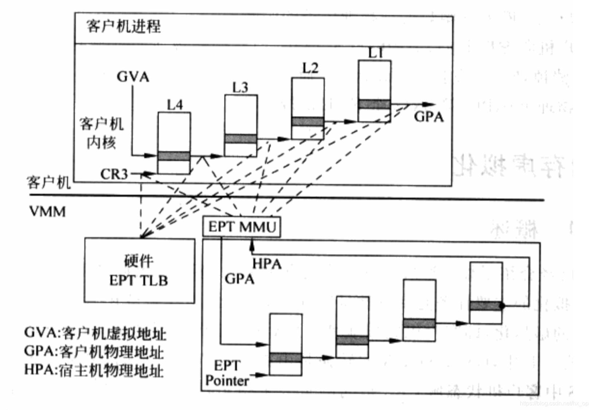

一旦页表建立好后, **整个映射过程都是硬件自动完成的**, 对于上图有如下几点说明:

* 对于**虚机内**的页表, 完成 GVA 到 GPA 的映射, 虽然整个过程都是**硬件自动完成**, 但有一点要注意下, 在**虚机**的中各级**页表**也是存储在 **HPA** 中的, 而 CR3 及各级页表中装的地址都是 GPA, 所以在**访问页表**时也需要借助 **EPT**, 上图中以虚线表示这个过程

* 利用虚机页表完成 GVA 到 GPA 的映射后, 此时借助 EPT 实现 GPA 到 HPA 的映射, 这里没有什么特殊的, 就是一层层页表映射

* 看完上图, 有没有发现少了点啥, 是不是**没有 HVA**. 单从上图整个虚机寻址的映射过程来看, 是不需要 HVA 借助的, 硬件会自动完成 `GVA->GPA->HPA` 映射, 那么 **HVA 有什么用呢?** 这里从下面两方面来分析:

  * Qemu **利用 iotcl 控制 KVM 实现 EPT 的映射**, 映射的过程中必然要**先申请物理页面**. Qemu 是应用程序, **唯一可见**的只是 **HVA**, 这时候又**需要借助 mmap** 了, Qemu 会根据虚机的 ram 大小, 即 GPA 大小范围, 然后 mmap 出与之对应的大小, 即 **HVA**. 通过 `KVM_SET_USER_MEMORY_REGION` 命令控制 KVM, 与这个命令一起传入的参数主要包括两个值, `guest_phys_addr` 代表**虚机 GPA 地址起始**, `userspace_addr` 代表上面 **mmap 得到的首地址**(HVA). 传入进去后, KVM 就会为当前虚机 GPA 建立 EPT 映射表实现 `GPA->HPA`, 同时会为 VMM 建立 `HVA->HPA` 映射.

  * 当 `vm_exit` 发生时, VMM 需要对异常进行处理, 异常发生时 VMM 能够获取到 **GPA**, 有时 VMM 需要访问虚机 **GPA 对应的 HPA**, VMM 的映射和虚机的映射方式不同, 是通过 VMM 完成 `HVA->HPA`, 且只能通过 HVA 才能访问 HPA, 这就需要 VMM 将 GPA 及 HVA 的对应关系维护起来, 这个关系是 Qemu 维护的, 这里先不管 Qemu 的具体实现(后面会有专门文档介绍), 当前只需要知道给定一个虚机的 GPA, 虚机就能获取到 GPA 对应的 HVA. 下图描述 VMM 与 VM 的地址映射关系.

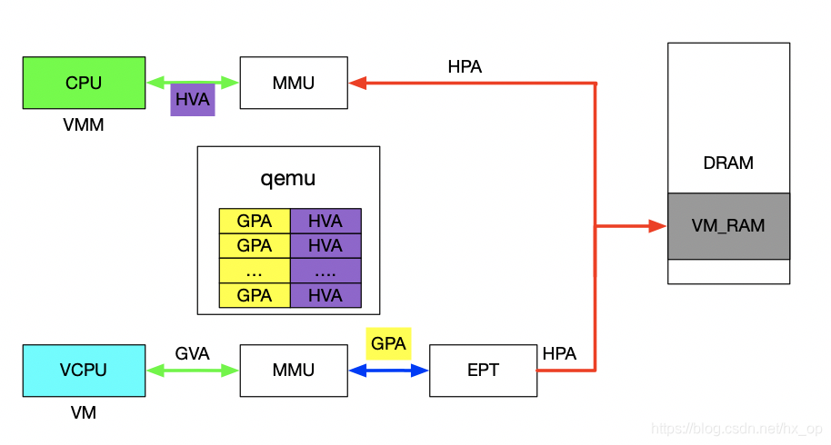

## 6.2. 设备透传实现

在前面介绍 VFIO 的使用实例时, 核心思想就是 **IOVA** 经过 IOMMU 映射出的**物理地址**与 HVA 经过 MMU 映射出的物理地址是同一个. 对于设备透传的情况, 先上图, 然后看图说话.

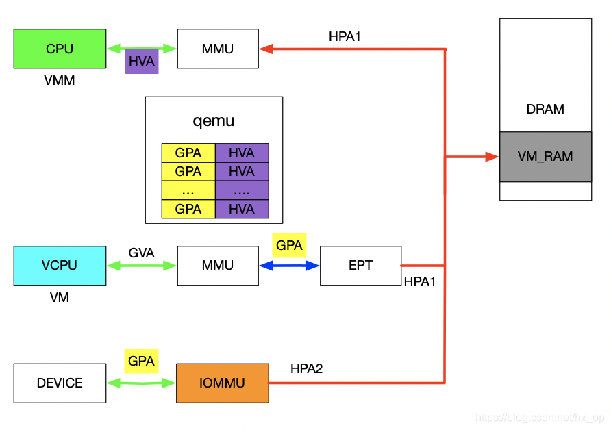

先来分析一下设备的 DMA 透传的工作流程, 一旦设备透传给了虚机, 虚机在配置设备 DMA 时直接使用 GPA. 此时 GPA 经由 EPT 会映射成 HPA1, GPA 经由 IOMMU 映射的地址为 HPA2, 此时的 HPA1 和 HPA2 必须相等, 设备的透传才有意义. 下面介绍在配置 IOMMU 时如何保证 HPA1 和 HPA2 相等, 在 VFIO 章节讲到了 `VFIO_IOMMU_MAP_DMA` 这个命令就是将 iova 通过 IOMMU 映射到 vaddr 对应的物理地址上去. 对于 IOMMU 来讲, 此时的 GPA 就是 iova, 我们知道 GPA 经由 EPT 会映射为 HPA1, 对于 VMM 来讲, 这个 HPA1 对应的虚机地址为 HVA, 那样的话在传入 `VFIO_IOMMU_MAP_DMA` 命令时讲 hva 作为 vaddr, IOMMU 就会将 GPA 映射为 HVA 对应的物理地址即 HPA1, 即 HPA1 和 HPA2 相等. 上述流程帮助理清整个映射关系, 实际映射 IOMMU 的操作很简单, 前面提到了 qemu 维护了 GPA 和 HVA 的关系, 在映射 IOMMU 的时候也可以派上用场. 注: IOMMU 的映射在虚机启动时就已经建立好了, 映射要涵盖整个 GPA 地址范围, 同时虚机的 HPA 对应的物理页都不会交换出去(设备 DMA 交换是异步的).

# 7. VFIO 中的技术关键点

除了 DMA Remapping 这一关键点之外, 在虚拟化场景下 VFIO 还需要解决下面一些关键问题, 需要进行探讨:

1. VFIO 对完备的设备访问支持: 其中包括 MMIO, `I/O Port`, PCI 配置空间, PCI BAR 空间;

2. VFIO 中高效的设备中断机制, 其中包括 `MSI/MSI-X`, Interrupt Remapping, 以及 Posted Interrupt 等;

3. VFIO 对直通设备热插拔支持.

# 8. reference

http://element-ui.cn/news/show-44900.html (done)