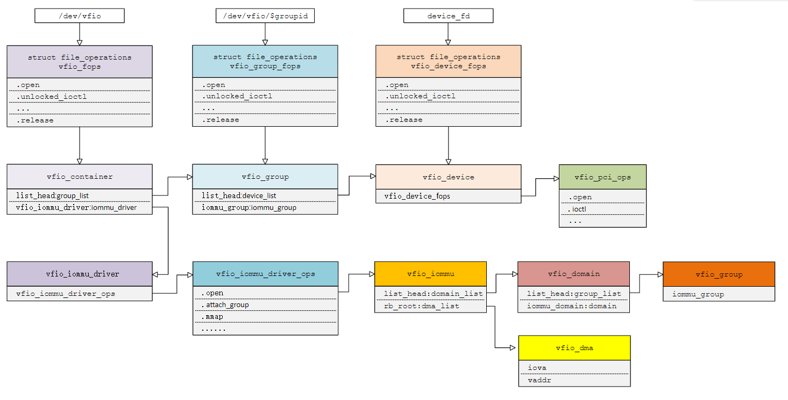
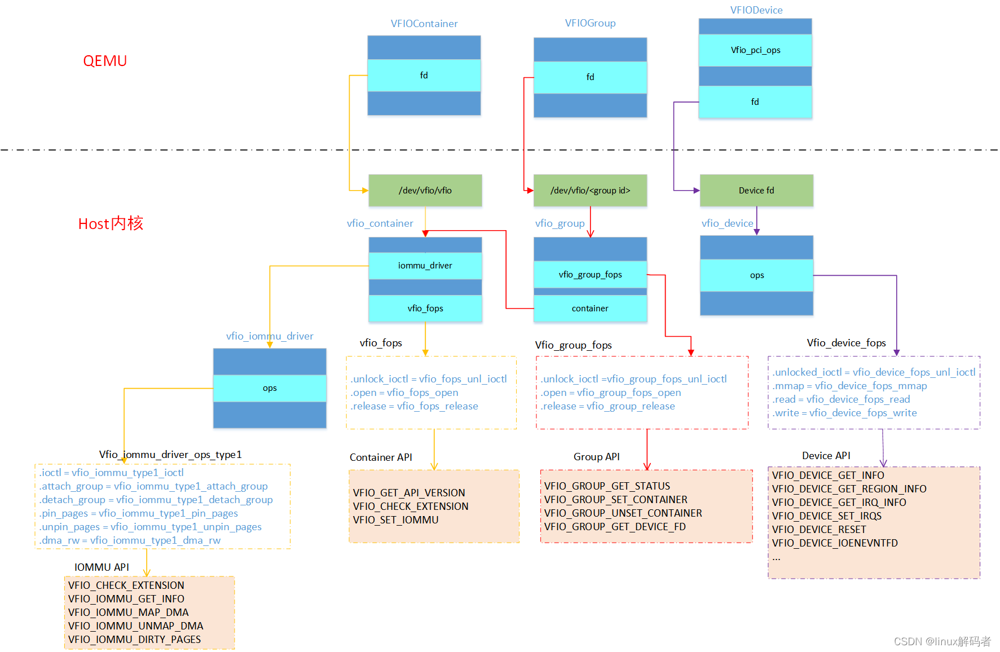

<!-- @import "[TOC]" {cmd="toc" depthFrom=1 depthTo=6 orderedList=false} -->

<!-- code_chunk_output -->

- [1. 概述](#1-概述)
  - [1.1. /dev/vfio/vfio](#11-devvfiovfio)
  - [1.2. /dev/vfio/$GROUP](#12-devvfiogroup)
  - [1.3. vfio-pci 驱动](#13-vfio-pci-驱动)
- [2. vfio_group](#2-vfio_group)
  - [2.1. 创建相关](#21-创建相关)
    - [2.1.1. 全局变量 vfio](#211-全局变量-vfio)
    - [2.1.2. vfio group 结构体](#212-vfio-group-结构体)
    - [2.1.3. vfio device 结构体](#213-vfio-device-结构体)
    - [2.1.4. 创建 vfio group](#214-创建-vfio-group)
  - [2.2. group 的 API](#22-group-的-api)
    - [2.2.1. VFIO_GROUP_GET_STATUS](#221-vfio_group_get_status)
    - [2.2.2. VFIO_GROUP_SET_CONTAINER](#222-vfio_group_set_container)
    - [2.2.3. VFIO_GROUP_UNSET_CONTAINER](#223-vfio_group_unset_container)
    - [2.2.4. VFIO_GROUP_GET_DEVICE_FD](#224-vfio_group_get_device_fd)
  - [2.3. device 的 API](#23-device-的-api)
- [3. vfio_container](#3-vfio_container)
  - [3.1. container 的 API](#31-container-的-api)
  - [3.2. iommu driver 的 API](#32-iommu-driver-的-api)
    - [3.2.1. 外部接口](#321-外部接口)
    - [3.2.2. 内部接口](#322-内部接口)
    - [3.2.3. 数据结构](#323-数据结构)
    - [3.2.4. Operations](#324-operations)
- [4. device](#4-device)
- [5. vfio_iommu_driver](#5-vfio_iommu_driver)
- [6. 小结](#6-小结)
- [7. reference](#7-reference)

<!-- /code_chunk_output -->

# 1. 概述

Linux 内核设备驱动充分利用了 "一切皆文件" 的思想, VFIO 驱动也不例外, VFIO 中为了方便操作 **device**, **group**, **container** 等对象, 将它们和对应的设备文件进行绑定.

VFIO 提供了**两个字符设备文件**作为提供给用户程序的**入口点**, 分别是 `/dev/vfio/vfio` 和 `/dev/vfio/$GROUP`; 此外还在 **sysfs** 中添加了**一些文件**.

## 1.1. /dev/vfio/vfio

首先看 `/dev/vfio/vfio`, 它是一个 misc device, 在 **vfio 模块的初始化**函数 `vfio_init` 中注册:

```
# ll /dev/vfio/vfio
crw-rw-rw- 1 root root 10, 196 9 月   8 02: 37 /dev/vfio/vfio
```

```cpp
// drivers/vfio/vfio_main.c
static struct miscdevice vfio_dev = {
	.minor = VFIO_MINOR,
	.name = "vfio",
	.fops = &vfio_fops,
	.nodename = "vfio/vfio",
	.mode = S_IRUGO | S_IWUGO,
};

static int __init vfio_init(void)
{
    int ret;
    /* ... */
    ret = misc_register(&vfio_dev);
    /* ... */
}
```

每次打开 `/dev/vfio/vfio` 文件, 都会**新创建**一个对应的 container 即 `struct vfio_container`

```cpp
// qemu
s->container = open("/dev/vfio/vfio", O_RDWR);

// drivers/vfio/vfio_main.c
struct vfio_container {
	struct kref			kref;
    // vfio group 链表
	struct list_head		group_list;
	struct rw_semaphore		group_lock;
    // 关联的 iommu_driver, 通过 container 可以进行 IOMMU 相关的操作
	struct vfio_iommu_driver	*iommu_driver;
    // iommu driver 的相关数据
	void				*iommu_data;
	bool				noiommu;
};
```

我们可以将 vfio group 加入到 container 中, container 维护了一个 vfio group(`struct vfio_group`)的链表 `group_list`.

**container 的作用!!!**就是通过其 `iommu_driver` 字段**为加入的所有 group 提供 IOMMU 的服务**:

```cpp
struct vfio_iommu_driver {
	const struct vfio_iommu_driver_ops	*ops;
	struct list_head			vfio_next;
};
```

noiommu 用于表示该 container 是否用于存放 `no-iommu` 的 Group(一个 container 不能同时存放到 `no-iommu Group` 和普通 Group). no-iommu Group 即背后没有 IOMMU 但仍然强行建立的 vfio group, 这个高级特性(`CONFIG_VFIO_NOIOMMU`)通常不建议开启, 我们忽略相关的代码即可.

## 1.2. /dev/vfio/$GROUP

`/dev/vfio/$GROUP` 文件显然对应着 vfio group, 它的由来要更复杂一些, 我们看 `vfio_init` 的一段代码来理解:

```cpp
#define MINORBITS	20
#define MINORMASK	((1U << MINORBITS) - 1)

// drivers/vfio/vfio_main.c
static int __init vfio_init(void)
{
    ......
    /* /dev/vfio/$GROUP */
	vfio.class = class_create(THIS_MODULE, "vfio");
	if (IS_ERR(vfio.class)) {
		ret = PTR_ERR(vfio.class);
		goto err_class;
	}

	vfio.class->devnode = vfio_devnode;

	ret = alloc_chrdev_region(&vfio.group_devt, 0, MINORMASK + 1, "vfio");
	if (ret)
		goto err_alloc_chrdev;

    cdev_init(&vfio.group_cdev, &vfio_group_fops);
    ret = cdev_add(&vfio.group_cdev, vfio.group_devt, MINORMASK + 1);
    if (ret)
        goto err_cdev_add;
    ......
}
```

其中 `vfio_devnode` 函数的定义如下:

```cpp
/*
 * Module/class support
 */
static char *vfio_devnode(struct device *dev, umode_t *mode)
{
	return kasprintf(GFP_KERNEL, "vfio/%s", dev_name(dev));
}
```

这里为 vfio group 字符设备动态分配了一整个 Major(即包含该 Major 下的所有 Minor)的设备号**并注册了 cdev**, 一旦创建一个带 devt 的 Device, 并挂在 `vfio class`(`/sys/class/vfio`)下, 就会创建一个 `/dev/vfio/$GROUP` 字符设备文件.

## 1.3. vfio-pci 驱动

VFIO 分为 **VFIO 核心模块**和 **VFIO 驱动模块**, **vfio group** 是由 **VFIO 驱动模块创建**的, 最常用的是 `vfio-pci` 驱动.

VFIO 驱动是以**设备驱动**的形式实现, 它们会注册一个 Driver, 并在其 **probe 函数**中调用 `vfio_add_group_dev`, 并最终会调用 `device_create` 为 **vfio group** 创建一个 **Device**(从而也创建了 `/dev/vfio/$GROUP` **设备文件**):

```cpp
    /* vfio_add_group_dev --> vfio_create_group */
    dev = device_create(vfio.class, NULL,
            MKDEV(MAJOR(vfio.group_devt), minor),
            group, "%s%d", group->noiommu ? "noiommu-" : "",
            iommu_group_id(iommu_group));
```

> vfio group 表现出来也是一个设备.

至于上面说的 **sysfs** 文件, 也是由 **VFIO 驱动**创建的, 因为它本身就是一个(虚拟)设备驱动, 自然可以创建 sysfs 目录与属性.

# 2. vfio_group

> 以下均以 vfio-pci 为例进行分析, 对于其他 VFIO 驱动也有参考价值

当我们把一个设备直通给虚拟机时, 首先要做的就是将这个设备从 host 上进行解绑, 即**解除 host 上此设备的驱动**, 然后**将设备驱动绑定**为 "`vfio-pci`".

在完成绑定后会新增一个 `/dev/vfio/$groupid` 的文件, 其中 `$groupid` 为此 PCI 设备的 **iommu group id**, 这个 id 号是在操作系统**加载 iommu driver** 时遍历扫描 host 上的 PCI 设备的时候就已经**分配好的**, 可以使用 `readlink -f /sys/bus/pci/devices/$bdf/iommu_group` 来查询.

```
# ll /dev/vfio/
total 0
drwxr-xr-x  2 root root       80 9 月   8 02: 47 ./
drwxr-xr-x 18 root root     4580 9 月   8 02: 47 ../
crw-------  1 root root 244,   0 9 月   8 02: 47 21
crw-rw-rw-  1 root root  10, 196 9 月   8 02: 37 vfio

# ll /sys/bus/pci/devices/0000\: 01\: 00.0/iommu_group
lrwxrwxrwx 1 root root 0 9 月   8 02: 37 /sys/bus/pci/devices/0000: 01: 00.0/iommu_group -> ../. ./. ./. ./kernel/iommu_groups/21/

# readlink -f /sys/bus/pci/devices/0000\: 01\: 00.0/iommu_group
/sys/kernel/iommu_groups/21
```

`/dev/vfio/$groupid` 这个文件的句柄被关联到 **vfio_group** 上, **用户态进程**打开这个文件就可以**管理这个 iommu group 里的设备**.

## 2.1. 创建相关

先从 vfio group 的创建开始.

对于 `vfio-pci`, 在 `vfio_pci_probe` 中完成的:

```cpp
// drivers/vfio/pci/vfio_pci.c
static int vfio_pci_probe(struct pci_dev *pdev, const struct pci_device_id *id)
{
    // 这是 vfio pci device
    struct vfio_pci_device *vdev;
    struct iommu_group *group;
    int ret;

    ......

    // 创建 vfio group
    // &pdev->dev: dev, pdev 是当前在 probe 的 pci device, 不是 vfio group 本身的 vfio device
    // &vfio_pci_ops: ops, vfio
    // vdev: device_data,
    ret = vfio_add_group_dev(&pdev->dev, &vfio_pci_ops, vdev);

    ......

    return ret;
}
```

这里创建了一个 `vfio_pci_device` 对象 **vdev**, 并使用 VFIO Core 提供的 `vfio_add_group_dev` **创建**了一个 **vfio group**.

下面详细分析 `vfio_add_group_dev` 创建的数据结构.

### 2.1.1. 全局变量 vfio

首先, VFIO Core 有一个**全局变量 vfio**:

```cpp
static struct vfio {
    struct class            *class;
    struct list_head        iommu_drivers_list;
    struct mutex            iommu_drivers_lock;
    struct list_head        group_list;
    struct idr              group_idr;
    struct mutex            group_lock;
    struct cdev             group_cdev;
    dev_t                   group_devt;
    wait_queue_head_t       release_q;
} vfio;
```

其中 `group_list` 是**所有 vfio group** 构成的链表, `group_idr` 是由 vfio group 的 Minor 号构成的一棵 **Radix Tree**.

### 2.1.2. vfio group 结构体

再来看 vfio group, **每个 vfio group** 都和**一个 IOMMU Group 相对应**的:

```cpp
struct vfio_group {
    struct kref                     kref;
    int                             minor;
    atomic_t                        container_users;
    struct iommu_group              *iommu_group;
    struct vfio_container           *container;
    struct list_head                device_list; // 当前 group 下的 vfio device 链表
    struct mutex                    device_lock;
    struct device                   *dev;   // group 自己对应的 device
    struct notifier_block           nb;
    struct list_head                vfio_next;
    struct list_head                container_next;
    struct list_head                unbound_list;
    struct mutex                    unbound_lock;
    atomic_t                        opened;
    wait_queue_head_t               container_q;
    bool                            noiommu;
    struct kvm                      *kvm;
    struct blocking_notifier_head   notifier;
};
```

> 一个 IOMMU Group 代表**一组设备**, 在硬件上无法区分它们的 ID(例如它们都在 `PCIe-PCI Bridge` 后面), 因此只能共用一张 IOMMU 页表.

vfio group 的 **dev** 会指向 `/dev/vfio/$GROUP` 对应的 **Device**, 和 `vfio_add_group_dev` 传入的 Device **无关**.

> 传入的 Device(即 `vfio_device->dev`) 是当前在 probe 的 pci device

由于 vfio group 和 IOMMU Group 是一一对应关系, **一个 Group** 下可以有**多个 vfio device**, vfio group 通过 `device_list` **链表**引用这些 vfio device.

### 2.1.3. vfio device 结构体

vfio device 的定义如下:

```cpp
struct vfio_device {
    struct kref                     kref;
    struct device                   *dev;
    const struct vfio_device_ops    *ops;
    struct vfio_group               *group;
    struct list_head                group_next;
    void                            *device_data;
};
```

### 2.1.4. 创建 vfio group

下面分析 `vfio_add_group_dev(dev, ops, device_data)` 函数, 该函数的目的实际上是**创建一个 vfio device**, 并**加入相应的 vfio group**:

第一步, 通过 dev(即 vfio device 背后的设备)获得 IOMMU Group

> 当前正在 probe 的 device

```cpp
iommu_group = iommu_group_get(dev);
if (!iommu_group)
    return -EINVAL;
```

第二步, 在**全局变量 vfio** 的 **vfio group 链表**中寻找匹配的 Group, 若找不到则创建一个新的, 并令其 `iommu_group` 指向上面获得的 IOMMU Group. 创建 vfio group 在 `vfio_create_group` 中完成, 其中这段代码值得注意:

```cpp
group->nb.notifier_call = vfio_iommu_group_notifier;

/*
 * blocking notifiers acquire a rwsem around registering and hold
 * it around callback.  Therefore, need to register outside of
 * vfio.group_lock to avoid A-B/B-A contention.  Our callback won't
 * do anything unless it can find the group in vfio.group_list, so
 * no harm in registering early.
 */
ret = iommu_group_register_notifier(iommu_group, &group->nb);
if (ret) {
    kfree(group);
    return ERR_PTR(ret);
}
```

这里**向内核的 IOMMU 层注册了回调**, 当 **IOMMU Group** 上发生一些事件时, 会**通知 VFIO 层**执行 `vfio_iommu_group_notifier`.

最后一步, 创建 vfio group 自己对应的 **vfio device**. 我们首先调用 `vfio_group_get_device(group, dev)`, 如果发现 vfio group 下已有对应的 vfio device 则返回 `-EBUSY`. 然后调用 `vfio_group_create_device(group, dev, ops, device_data)`:

```cpp
static
struct vfio_device *vfio_group_create_device(struct vfio_group *group,
                                             struct device *dev,
                                             const struct vfio_device_ops *ops,
                                             void *device_data)
{
    struct vfio_device *device;

    device = kzalloc(sizeof(*device), GFP_KERNEL);
    if (!device)
        return ERR_PTR(-ENOMEM);

    kref_init(&device->kref);
    device->dev = dev;
    device->group = group;
    device->ops = ops;
    device->device_data = device_data; //
    dev_set_drvdata(dev, device);

    /* No need to get group_lock, caller has group reference */
    vfio_group_get(group);

    mutex_lock(&group->device_lock);
    list_add(&device->group_next, &group->device_list);
    mutex_unlock(&group->device_lock);

    return device;
}
```

我们向 `vfio_add_group_dev` 传入的 `pdev->dev` 被放入了 `vfio_device->dev`, `vfio_pci_ops` 被放入了 `vfio_device->ops`, vdev 则放入了 `vfio_device->device_data`.

?? vfio group 对应的 vfio device 结构体中的 dev 属性为什么指向当前在 probe 的设备

## 2.2. group 的 API

我们首先来看 `/dev/vfio/$GROUP` 提供的 API, 该文件只支持 ioctl 操作:

```cpp
static const struct file_operations vfio_group_fops = {
    .owner              = THIS_MODULE,
    .unlocked_ioctl     = vfio_group_fops_unl_ioctl,
    .compat_ioctl       = vfio_group_fops_compat_ioctl,
    .open               = vfio_group_fops_open,
    .release            = vfio_group_fops_release,
};
```

在 open 时, 会利用 Minor 号从 `vfio.group_idr` 中找到对应的 **VIFO Group**, 然后将文件的 `private_data` 设置为该 vfio group:

```cpp
group = vfio_group_get_from_minor(iminor(inode));
if (!group)
    return -ENODEV;

filep->private_data = group;
```

vfio group 只有 4 个 ioctl, 分别是:

* `VFIO_GROUP_GET_STATUS`, 参数 `&status`: 获取一个 `struct vfio_group_status` 表示 vfio group 的状态
* `VFIO_GROUP_SET_CONTAINER`, 参数 `fd`: 传入一个 fd 表示 VFIO container, 将 vfio group 加入该 container
* `VFIO_GROUP_UNSET_CONTAINER`: 将 vfio group **移出** container
* `VFIO_GROUP_GET_DEVICE_FD`, 参数 **str**: 传入一个字符串表示 vfio group 下的 Device, 获取该 Device 对应的 fd

### 2.2.1. VFIO_GROUP_GET_STATUS

实际上, `vfio_group_status` 只包含一个 flag, 为其定义了两个位 `VFIO_GROUP_FLAGS_VIABLE` 和 `VFIO_GROUP_FLAGS_CONTAINER_SET`, 后者显然表示 **vfio group 是否绑定到了某个 container**, Viable 的含义可参考 `vfio_dev_viable` 函数的注释:

```cpp
/*
 * A vfio group is viable for use by userspace if all devices are in
 * one of the following states:
 *  - driver-less
 *  - bound to a vfio driver
 *  - bound to a whitelisted driver
 *  - a PCI interconnect device
 *
 * We use two methods to determine whether a device is bound to a vfio
 * driver.  The first is to test whether the device exists in the vfio
 * group.  The second is to test if the device exists on the group
 * unbound_list, indicating it's in the middle of transitioning from
 * a vfio driver to driver-less.
 */
```

### 2.2.2. VFIO_GROUP_SET_CONTAINER

`VFIO_GROUP_SET_CONTAINER` 调用了 container 的 **iommu driver** 的 `attach_group` 方法, 来将 Group 加入 container:

```cpp
    driver = container->iommu_driver;
    if (driver) {
        ret = driver->ops->attach_group(container->iommu_data,
                        group->iommu_group);
        if (ret)
            goto unlock_out;
    }
```

### 2.2.3. VFIO_GROUP_UNSET_CONTAINER

类似地, `VFIO_GROUP_UNSET_CONTAINER` 调用了 iommu driver 的 `detach_group` 方法:

```cpp
driver = container->iommu_driver;
if (driver)
    driver->ops->detach_group(container->iommu_data,
                  group->iommu_group);
```

### 2.2.4. VFIO_GROUP_GET_DEVICE_FD

`VFIO_GROUP_GET_DEVICE_FD` 首先调用了 vfio device 的 open 方法:

```cpp
ret = device->ops->open(device->device_data);
if (ret) {
    vfio_device_put(device);
    return ret;
}
```

对于 `vfio-pci` 就是 `vfio_pci_open`, 该函数主要对传入的 `vfio_pci_device` 对象做了初始化, 初始化的过程依据了 vdev 背后的 pdev 的 Configuration Space.

随后, 为 vfio device 创建了一个 Anonymous Inode, 即不存在于任何目录下的游离于文件系统之外的孤儿 Inode, 并返回了其 fd:

```cpp
/*
 * We can't use anon_inode_getfd() because we need to modify
 * the f_mode flags directly to allow more than just ioctls
 */
ret = get_unused_fd_flags(O_CLOEXEC);
if (ret < 0) {
    device->ops->release(device->device_data);
    vfio_device_put(device);
    return ret;
}

filep = anon_inode_getfile("[vfio-device]", &vfio_device_fops,
               device, O_RDWR);
if (IS_ERR(filep)) {
    put_unused_fd(ret);
    ret = PTR_ERR(filep);
    device->ops->release(device->device_data);
    vfio_device_put(device);
    return ret;
}

/*
 * TODO: add an anon_inode interface to do this.
 * Appears to be missing by lack of need rather than
 * explicitly prevented.  Now there's need.
 */
filep->f_mode |= (FMODE_LSEEK | FMODE_PREAD | FMODE_PWRITE);

atomic_inc(&group->container_users);

fd_install(ret, filep);
```

## 2.3. device 的 API

上一节中的 `vfio_device_fops` 实际上只是 vfio device 的 ops 的一个 Wrapper, 它将对 **vfio device fd** 的 read, write, mmap 和 ioctl 代理给 `device->ops` 中的回调.

对于不同的 VFIO 驱动, **read**, **write**, **mmap** 的含义各有不同, 不过总的来说是**将 VFIO 设备文件**分为**若干个 Region**, 例如 **PIO Region**, **MMIO Region**, **PCI Configuration Space** 等, **每个 Region** 位于 VFIO 设备文件的**不同 offset** 并分别可以读写和映射. 另外, 每个 VFIO 设备还可以有**一个或多个 IRQ Space**, 用于提供**中断的模拟**. 下面看一下相关的 ioctl:

`VFIO_DEVICE_GET_INFO`, `&info`, 获取一个 `struct vfio_device_info`, 表明 vfio device 的信息:

```cpp
struct vfio_device_info {
    __u32   argsz;
    __u32   flags;
#define VFIO_DEVICE_FLAGS_RESET (1 << 0)    /* Device supports reset */
#define VFIO_DEVICE_FLAGS_PCI   (1 << 1)    /* vfio-pci device */
#define VFIO_DEVICE_FLAGS_PLATFORM (1 << 2) /* vfio-platform device */
#define VFIO_DEVICE_FLAGS_AMBA  (1 << 3)    /* vfio-amba device */
#define VFIO_DEVICE_FLAGS_CCW   (1 << 4)    /* vfio-ccw device */
#define VFIO_DEVICE_FLAGS_AP    (1 << 5)    /* vfio-ap device */
    __u32   num_regions;    /* Max region index + 1 */
    __u32   num_irqs;       /* Max IRQ index + 1 */
};
```

提供的信息包括 vfio device 由哪种驱动提供(`vfio-mdev`设备则模拟其中一种), 有几个 Region, 有几个 IRQ Space.

`VFIO_DEVICE_GET_REGION_INFO`, `&info`, 用于进一步查询 Region 的信息, 传入并返回一个 `struct vfio_region_info`(用户只填写 index):

```cpp
struct vfio_region_info {
    __u32   argsz;
    __u32   flags;
#define VFIO_REGION_INFO_FLAG_READ  (1 << 0) /* Region supports read */
#define VFIO_REGION_INFO_FLAG_WRITE (1 << 1) /* Region supports write */
#define VFIO_REGION_INFO_FLAG_MMAP  (1 << 2) /* Region supports mmap */
#define VFIO_REGION_INFO_FLAG_CAPS  (1 << 3) /* Info supports caps */
    __u32   index;      /* Region index */
    __u32   cap_offset; /* Offset within info struct of first cap */
    __u64   size;       /* Region size (bytes) */
    __u64   offset;     /* Region offset from start of device fd */
};
```

`VFIO_DEVICE_GET_IRQ_INFO`, `&info`, 用于查询 IRQ Space 的信息, 传入并返回一个 `struct vfio_irq_info`(用户只填写 index):

```cpp
struct vfio_irq_info {
    __u32   argsz;
    __u32   flags;
#define VFIO_IRQ_INFO_EVENTFD       (1 << 0)
#define VFIO_IRQ_INFO_MASKABLE      (1 << 1)
#define VFIO_IRQ_INFO_AUTOMASKED    (1 << 2)
#define VFIO_IRQ_INFO_NORESIZE      (1 << 3)
    __u32   index;      /* IRQ index */
    __u32   count;      /* Number of IRQs within this index */
};
```

count 表示这个 IRQ Space 中的 IRQ 数量, 例如某个 IRQ Space 代表 MSI-X 中断, 那么它最多可以有 2048 个 IRQ. EVENTFD flag 表示 IRQ Space 支持 eventfd 方式报告中断, MASKABLE flag 表示可以对其中的 IRQ 进行 mask 和 unmask 操作, AUTOMASKED 表示当 IRQ 上触发一次中断后, IRQ 会自动被 mask.

`VFIO_DEVICE_SET_IRQS`, `&irq_set`, 传入一个`struct vfio_irq_set` 用于配置中断:

```cpp
struct vfio_irq_set {
    __u32   argsz;
    __u32   flags;
#define VFIO_IRQ_SET_DATA_NONE      (1 << 0) /* Data not present */
#define VFIO_IRQ_SET_DATA_BOOL      (1 << 1) /* Data is bool (u8) */
#define VFIO_IRQ_SET_DATA_EVENTFD   (1 << 2) /* Data is eventfd (s32) */
#define VFIO_IRQ_SET_ACTION_MASK    (1 << 3) /* Mask interrupt */
#define VFIO_IRQ_SET_ACTION_UNMASK  (1 << 4) /* Unmask interrupt */
#define VFIO_IRQ_SET_ACTION_TRIGGER (1 << 5) /* Trigger interrupt */
    __u32   index;
    __u32   start;
    __u32   count;
    __u8    data[];
};
```

其中 index 表示选择第几个 IRQ Space, start 和 count 用于表示 subindex 的范围. 关于 flags 中 DATA 和 ACTION 的组合, 如下所示:

* `ACTION_MASK` 和 `ACTION_UNMASK` 分别表示屏蔽和启用选中的 IRQ

    * `DATA_NONE` 表示 `[start, start + count - 1]` 范围内的 IRQ 全部选中

    * `DATA_BOOL` 表示 `data[]` 为一个 bool 数组,其成员依次代表 start 到 `start + count - 1` 是否选中

* `ACTION_TRIGGER`

  * 首先需使用 `DATA_EVENTFD`, 通过 `data[]` 传入一个 eventfd 数组, 其成员注册为相应的 IRQ 的 Trigger(`-1` 代表相应的 IRQ 不设置 Trigger), 即当 vfio device 上产生一个中断时, 内核通过注册的 eventfd 通知用户程序.

    * 一旦注册过了 eventfd, 就可以用 `DATA_NONE` 或 `DATA_BOOL` 手动为选中的 IRQ 触发一个虚拟中断

VFIO_DEVICE_RESET, 重置 vfio device.

# 3. vfio_container

> **container 的作用!!!**就是通过其 `iommu_driver` **为加入的所有 group 提供 IOMMU 的服务**

vfio container 和 vfio group 不同.

* **vfio container** 只有一个入口点即 `/dev/vfio/vfio`, 每次打开该设备文件, 都将获得一个新的 vfio container 实例.

* **vfio group** 和 `/dev/vfio/$GROUP` **设备文件**绑定, 每个设备文件唯一对应**一个 vfio group**, 且**只能打开一次**, 试图第二次打开会返回 `-EBUSY`.

container fd 对应的 ioctl 接口如下:

```cpp
// drivers/vfio/container.c
static long vfio_fops_unl_ioctl(struct file *filep,
				unsigned int cmd, unsigned long arg)
{
	struct vfio_container *container = filep->private_data;
	struct vfio_iommu_driver *driver;
	void *data;
	long ret = -EINVAL;

	if (!container)
		return ret;

	switch (cmd) {
	case VFIO_GET_API_VERSION:
		ret = VFIO_API_VERSION;
		break;
	case VFIO_CHECK_EXTENSION:
		ret = vfio_ioctl_check_extension(container, arg);
		break;
	case VFIO_SET_IOMMU:
		ret = vfio_ioctl_set_iommu(container, arg);
		break;
	default:
		driver = container->iommu_driver;
		data = container->iommu_data;
        // 其他 ioctl 都是 iommu_driver 的
		if (driver) /* passthrough all unrecognized ioctls */
			ret = driver->ops->ioctl(data, cmd, arg);
	}

	return ret;
}
```

## 3.1. container 的 API

vfio container 本身具备的功能很小, 只有三个 ioctl:

* `VFIO_GET_API_VERSION`, 返回 VFIO_API_VERSION(目前版本号为 0)

* `VFIO_CHECK_EXTENSION`, 用来检测是否支持特定的扩展, 如支持哪种类型的 IOMMU

* `VFIO_SET_IOMMU`, 设置 **iommu driver** 的类型, 指定的 IOMMU 必须是通过 `VFIO_CHECK_EXTENSION` 确认驱动支持的. 在调用该 ioctl 前**必须至少挂载一个 vfio group**

    * IOMMU driver 本质上只有**两种类型**, 即 **Type1 IOMMU** 和 **sPAPR IOMMU**, 前者代表 x86,ARM 等架构上的 IOMMU, 后者代表 POWER 架构上的 IOMMU

    * **Type1 IOMMU**, 又细分为 `VFIO_TYPE1_IOMMU`, `VFIO_TYPE1v2_IOMMU` 和 `VFIO_TYPE1_NESTING_IOMMU`, 一般来说用 `VFIO_TYPE1v2_IOMMU` 即可

    * 所有的 type 都可以作为 `VFIO_CHECK_EXTENSION` 的**参数**, 检查内核是否支持该类型, 用户应该**先检查是否支持该类型**再设置 iommu driver

## 3.2. iommu driver 的 API

以 type1 iommu driver 说明

回顾 VFIO Container 的结构体定义, 除了 iommu driver 以外, 还有一个 **iommu_data**:

```cpp
struct vfio_container {
    struct kref                 kref;
    struct list_head            group_list;
    struct rw_semaphore         group_lock;
    struct vfio_iommu_driver    *iommu_driver;
    void                        *iommu_data;
    bool                        noiommu;
};
```

在 `VFIO_SET_IOMMU` 的**实现** `vfio_ioctl_set_iommu` 中, 通过调用 **iommu driver** 的 **open** 方法获得了 **IOMMU Data**:

```cpp
    data = driver->ops->open(arg);
    if (IS_ERR(data)) {
        ret = PTR_ERR(data);
        module_put(driver->ops->owner);
        continue;
    }
    /* ... */
    container->iommu_driver = driver;
    container->iommu_data = data;
```

在 Type1 iommu driver 中, 返回的 IOMMU Data 是一个 `struct vfio_iommu`(详下).

这一步完成后, 接着会对 **Container** 上已经挂载的 **VFIO Group** 调用 iommu driver 的 `attach_group` 方法:

```cpp
    list_for_each_entry(group, &container->group_list, container_next) {
        ret = driver->ops->attach_group(data, group->iommu_group);
        if (ret)
            goto unwind;
    }
```

### 3.2.1. 外部接口

vfio container 上的其余操作都会代理给其 iommu driver 执行, 包括 **read**, **write**, **mmap** 和上述三个 ioctl **以外的 ioctl**.

```cpp
/* vfio_fops_read */
driver = container->iommu_driver;
if (likely(driver && driver->ops->read))
    ret = driver->ops->read(container->iommu_data,
                buf, count, ppos);

/* vfio_fops_write */
driver = container->iommu_driver;
if (likely(driver && driver->ops->write))
    ret = driver->ops->write(container->iommu_data,
                 buf, count, ppos);

/* vfio_fops_mmap */
driver = container->iommu_driver;
if (likely(driver && driver->ops->mmap))
    ret = driver->ops->mmap(container->iommu_data, vma);

/* vfio_fops_unl_ioctl */
default:
    driver = container->iommu_driver;
    data = container->iommu_data;

    if (driver) /* passthrough all unrecognized ioctls */
        ret = driver->ops->ioctl(data, cmd, arg);
```

另外, `VFIO_CHECK_EXTENSION` 实际上也是代理给 **iommu driver** 执行的:

* 当 container **尚未指定 Driver** 时, 是**遍历**系统中的 iommu driver 依次调用 `VFIO_CHECK_EXTENSION`, 至少有一个返回 1 则最终返回 1, 否则返回 0;

* 当 container 指定了 Driver 时, 则对该 Driver 调用 `VFIO_CHECK_EXTENSION`.

对于我们关心的 Type 1 iommu driver, 其提供的重要的 ioctl 实际上有:

* `VFIO_IOMMU_GET_INFO`: 用来得到 IOMMU 的一些信息, 这个 ioctl 只针对 Type1 的 IOMMU.

* `VFIO_CHECK_EXTENSION`, 当前 iommu_driver 的检查

* `VFIO_IOMMU_MAP_DMA`: 用来指定**设备端**看到的 **IO 地址**到**进程的虚拟地址**之间的映射, **类似**于 KVM 中的 `KVM_SET_USER_MEMORY_REGION` 指定**虚拟机物理地址**到**进程虚拟地址**之间的映射.

会传入一个 `struct vfio_iommu_type1_dma_map`:

```cpp
struct vfio_iommu_type1_dma_map {
    __u32   argsz;
    __u32   flags;
#define VFIO_DMA_MAP_FLAG_READ (1 << 0)     /* readable from device */
#define VFIO_DMA_MAP_FLAG_WRITE (1 << 1)    /* writable from device */
    __u64   vaddr;                          /* Process virtual address */
    __u64   iova;                           /* IO virtual address */
    __u64   size;                           /* Size of mapping (bytes) */
};
```

* `VFIO_IOMMU_UNMAP_DMA`:

会传入一个 `struct vfio_iommu_type1_dma_unmap`, 成功 unmap 的内存的 size 会在 size 中返回(可能比传入的 size 小):

```cpp
struct vfio_iommu_type1_dma_unmap {
    __u32   argsz;
    __u32   flags;
    __u64   iova;               /* IO virtual address */
    __u64   size;               /* Size of mapping (bytes) */
};
```

这里设置的 DMA Remapping 是**针对整个 container**, 即**针对其中的所有 Group 的**, 下面我们将详细讨论这一点.

### 3.2.2. 内部接口

iommu driver 实际上只是一个接口, 用于提供若干回调, 与具体的实现解耦:

```cpp
struct vfio_iommu_driver {
    const struct vfio_iommu_driver_ops  *ops;
    struct list_head                    vfio_next;
};

/**
 * struct vfio_iommu_driver_ops - VFIO IOMMU driver callbacks
 */
struct vfio_iommu_driver_ops {
    char            *name;
    struct module   *owner;
    void            *(*open)(unsigned long arg);
    void            (*release)(void *iommu_data);
    ssize_t         (*read)(void *iommu_data, char __user *buf,
                            size_t count, loff_t *ppos);
    ssize_t         (*write)(void *iommu_data, const char __user *buf,
                             size_t count, loff_t *size);
    long            (*ioctl)(void *iommu_data, unsigned int cmd,
                             unsigned long arg);
    int             (*mmap)(void *iommu_data, struct vm_area_struct *vma);
    int	            (*attach_group)(void *iommu_data,
                                    struct iommu_group *group);
    void            (*detach_group)(void *iommu_data,
                                    struct iommu_group *group);
    int             (*pin_pages)(void *iommu_data, unsigned long *user_pfn,
                                 int npage, int prot,
                                 unsigned long *phys_pfn);
    int             (*unpin_pages)(void *iommu_data,
                                   unsigned long *user_pfn, int npage);
    int             (*register_notifier)(void *iommu_data,
                                         unsigned long *events,
                                         struct notifier_block *nb);
    int             (*unregister_notifier)(void *iommu_data,
                                           struct notifier_block *nb);
};
```

> 目前 **iommu driver** 均未实现 read, write, mmap 回调, 因此对 VFIO container 实际上不能进行 read, write 或 mmap 操作, 尽管不排除将来支持这些操作的可能.

在 Type 1 iommu driver 中, 实现了以下接口:

```cpp
static const struct vfio_iommu_driver_ops vfio_iommu_driver_ops_type1 = {
    .name                   = "vfio-iommu-type1",
    .owner                  = THIS_MODULE,
    .open                   = vfio_iommu_type1_open,
    .release                = vfio_iommu_type1_release,
    .ioctl                  = vfio_iommu_type1_ioctl,
    .attach_group           = vfio_iommu_type1_attach_group,
    .detach_group           = vfio_iommu_type1_detach_group,
    .pin_pages              = vfio_iommu_type1_pin_pages,
    .unpin_pages            = vfio_iommu_type1_unpin_pages,
    .register_notifier      = vfio_iommu_type1_register_notifier,
    .unregister_notifier    = vfio_iommu_type1_unregister_notifier,
};
```

### 3.2.3. 数据结构

在 `vfio_iommu_type1_open` 中, 创建了一个 `struct vfio_iommu`, 存放在 container 的 `iommu_data` 成员中:

```cpp
struct vfio_iommu {
    struct list_head    domain_list;
    struct vfio_domain  *external_domain; /* domain for external user */
    struct mutex        lock;
    struct rb_root      dma_list;
    struct blocking_notifier_head notifier;
    unsigned int        dma_avail;
    bool                v2;
    bool                nesting;
};
```

其中 `domain_list` 是 `struct vfio_domain` 构成的链表:

```cpp
struct vfio_domain {
    struct iommu_domain *domain;
    struct list_head    next;
    struct list_head    group_list;
    int                 prot;       /* IOMMU_CACHE */
    bool                fgsp;       /* Fine-grained super pages */
};
```

其中 `group_list` 又是 `struct vfio_group` 构成的链表(此 vfio group 非彼 vfio group, 前者定义在 `drivers/vfio/vfio_iommu_type1.c`, 后者定义在 `drivers/vfio/vfio.c`):

```cpp
struct vfio_group {
    struct iommu_group  *iommu_group;
    struct list_head    next;
};
```

这里, 一个 `struct vfio_group` 和一个 vfio group 相对应, 同时也对应于一个 IOMMU Group. 不同的 IOMMU Group 可以共享同一张 IOMMU 页表, 我们说这些 IOMMU Group 属于同一个 IOMMU Domain, 在这里 `struct vfio_domain` 就对应着 IOMMU Domain. 最后, **一个 container** 中可以容纳若干 IOMMU Domain, 即可以同时管理**多个 IOMMU 页表**. `external_domain` 是由 VFIO 驱动管理的外部 IOMMU Domain, 可以暂时忽略, 分析 vfio-mdev 时会详细解释.

> 这里忽略同一个 IOMMU Group 在不同进程中可以对应不同 IOMMU 页表的情况(例如 VT-d 以及 SMMU 都可以根据 PASID 选取不同页表), 这种场景在 Linux 5.1 rc6 尚未支持. Patchwork 上可以找到尚未 upstream 的 patch.

dma_list 则是由 struct vfio_dma 构成的一棵红黑树,其索引是 `[iova, iova + size]` 区间(`iommu driver` 保证这些区间不重叠):

```cpp
struct vfio_dma {
    struct rb_node      node;
    dma_addr_t          iova;       /* Device address */
    unsigned long       vaddr;      /* Process virtual addr */
    size_t              size;       /* Map size (bytes) */
    int                 prot;       /* IOMMU_READ/WRITE */
    bool                iommu_mapped;
    bool                lock_cap;   /* capable(CAP_IPC_LOCK) */
    struct task_struct  *task;
    struct rb_root      pfn_list;   /* Ex-user pinned pfn list */
};
```

每个 vfio_dma 都代表一小段内存映射, 而这些映射是作用于 container 下的所有 IOMMU Domain, 所有 IOMMU Group 的, 也就是说 container 下不同 IOMMU Domain 的页表内容是相同的. 不过这仍是有意义的, 因为可能加入 container 的不同 vfio group, 分别被不同的 IOMMU 管辖, 因此必须使用不同的 IOMMU Domain.

### 3.2.4. Operations

> 以下均不考虑 vfio-mdev 驱动的 vfio group 对 iommu driver 造成的影响, 对于 vfio-mdev 会在专门的文章讨论

我们首先考察 `vfio_iommu_type1_attach_group(vfio_iommu, iommu_group)`:

* 第一步, 检查 vfio_iommu 下是否已经有 IOMMU Group 了, 若已存在则立即返回 -EINVAL.

* 第二步, 从 IOMMU Group 可以得到其下面的 Device(struct device),若它们所属的 Bus 不同则立即返回-EINVAL,否则记录下它们共同的 Bus(记作 bus).

* 第三步, 调用 `iommu_domain_alloc(bus)` 创建一个 IOMMU Domain, 然后调用 `iommu_attach_group(iommu_domain, iommu_group)` 将 IOMMU Group 加入该 Domain.

* 第四步, 遍历 `vfio_iommu` 的 `domain_list` 链表, 查找可以容纳 `IOMMU Group` 的 Domain, 若找到则将 `IOMMU Group` 从上一步的 Domain 中去除, 加入到这一步的 Domain 中, 并直接返回:

```cpp
/*
 * Try to match an existing compatible domain.  We don't want to
 * preclude an IOMMU driver supporting multiple bus_types and being
 * able to include different bus_types in the same IOMMU domain, so
 * we test whether the domains use the same iommu_ops rather than
 * testing if they're on the same bus_type.
 */
list_for_each_entry(d, &iommu->domain_list, next) {
    if (d->domain->ops == domain->domain->ops &&
        d->prot == domain->prot) {
        iommu_detach_group(domain->domain, iommu_group);
        if (!iommu_attach_group(d->domain, iommu_group)) {
            list_add(&group->next, &d->group_list);
            iommu_domain_free(domain->domain);
            kfree(domain);
            mutex_unlock(&iommu->lock);
            return 0;
        }

        ret = iommu_attach_group(domain->domain, iommu_group);
        if (ret)
            goto out_domain;
    }
}
```

* 否则, 要在新建的 IOMMU Domain 上设置 DMA Mapping, 即调用 `vfio_iommu_replay(iommu, domain)` 重放所有 DMA Mapping 请求, 最后将新 Domain 加入 `vfio_iommu` 的 `domain_list` 中.

---

我们再来考察 `vfio_iommu_type1_register_notifier` 和 `vfio_iommu_type1_unregister_notifier`, 它们的实现很简单:

```cpp
static int vfio_iommu_type1_register_notifier(void *iommu_data,
                                              unsigned long *events,
                                              struct notifier_block *nb)
{
    struct vfio_iommu *iommu = iommu_data;

    /* clear known events */
    *events &= ~VFIO_IOMMU_NOTIFY_DMA_UNMAP;

    /* refuse to register if still events remaining */
    if (*events)
        return -EINVAL;

    return blocking_notifier_chain_register(&iommu->notifier, nb);
}

static int vfio_iommu_type1_unregister_notifier(void *iommu_data,
                                                struct notifier_block *nb)
{
    struct vfio_iommu *iommu = iommu_data;

    return blocking_notifier_chain_unregister(&iommu->notifier, nb);
}
```

那么 `iommu->notifier` 什么时候会被调用呢, 答案是仅在用户调用 `VFIO_IOMMU_UNMAP_DMA` 时:

```cpp
/* vfio_iommu_type1_ioctl --> vfio_dma_do_unmap */
blocking_notifier_call_chain(&iommu->notifier,
                VFIO_IOMMU_NOTIFY_DMA_UNMAP,
                &nb_unmap);
```

因此这里注册的 notifier 起的作用仅仅是在 DMA Unmap 的时候调用一个回调.

我们继续追溯 `vfio_iommu_type1_register_notifier` 的调用者, 发现时 `vfio_register_notifier`, 该函数还可以用来注册 Group Notifier(`struct vfio_group`(in "vfio.c")中的 notifer):

```cpp
switch (type) {
case VFIO_IOMMU_NOTIFY:
    ret = vfio_register_iommu_notifier(group, events, nb);
    break;
case VFIO_GROUP_NOTIFY:
    ret = vfio_register_group_notifier(group, events, nb);
    break;
default:
    ret = -EINVAL;
}
```

无独有偶, Group Notifier 实际上也只会在一个时刻被触发, 即 VFIO Group 和 KVM 绑定时:

```cpp
void vfio_group_set_kvm(struct vfio_group *group, struct kvm *kvm)
{
    group->kvm = kvm;
    blocking_notifier_call_chain(&group->notifier,
                                 VFIO_GROUP_NOTIFY_SET_KVM, kvm);
}
EXPORT_SYMBOL_GPL(vfio_group_set_kvm);
```

---

接下来看 `vfio_iommu_type1_ioctl`, 实际上我们只关心其中 `VFIO_IOMMU_MAP_DMA` 和 `VFIO_IOMMU_UNMAP_DMA` 的实现, 即 `vfio_dma_do_map` 和 `vfio_dma_do_unmap`.

在 `vfio_dma_do_map` 中, 首先是检查了 `DMA Mapping Request` 的 IOVA 是否和已有的 `vfio_dma` 重叠, 若重叠则直接返回 `-EEXIST`. 随后, 就是创建新的 `vfio_dma` 对象, 加入 `vfio_iommu` 的**红黑树**, 最后对其调用 `vfio_pin_map_dma` 建立 DMA Remapping.

用户请求的 **IOVA Region** 和对应的 **HVA Region** 虽然都是**连续的**, 但 HVA 对应的 **HPA 不一定是连续**的, 可能要进一步分成若干 HPA Region.

`vfio_pin_map_dma` 由一个**循环**构成, 循环内:

1. 每次先调用 `vfio_pin_pages_remote`, **pin 住**一段**连续的物理内存**;
2. 然后再调用 `vfio_iommu_map` 创建 **IOVA** 到 **HPA** 的 **DMA Remapping 映射**.

```cpp
while (size) {
    /* Pin a contiguous chunk of memory */
    npage = vfio_pin_pages_remote(dma, vaddr + dma->size,
                      size >> PAGE_SHIFT, &pfn, limit);
    if (npage <= 0) {
        WARN_ON(!npage);
        ret = (int)npage;
        break;
    }

    /* Map it! */
    ret = vfio_iommu_map(iommu, iova + dma->size, pfn, npage,
                 dma->prot);
    if (ret) {
        vfio_unpin_pages_remote(dma, iova + dma->size, pfn,
                    npage, true);
        break;
    }

    size -= npage << PAGE_SHIFT;
    dma->size += npage << PAGE_SHIFT;
}
```

`vfio_iommu_map` 的实现很简单, 对 Container 下的所有 IOMMU Domain 依次调用 `iommu_map` 设置映射即可:

```cpp
list_for_each_entry(d, &iommu->domain_list, next) {
    ret = iommu_map(d->domain, iova, (phys_addr_t)pfn << PAGE_SHIFT,
            npage << PAGE_SHIFT, prot | d->prot);
    if (ret)
        goto unwind;

    cond_resched();
}
```

`vfio_pin_pages_remote` 的实现则要复杂一些:

总的来说, 其逻辑是每次调用 `vaddr_get_pfn`, 就从一个 **vaddr**(**HVA**) 获得其**对应的物理页**的**页框号**(PFN), 在一个 for 循环内不断获取 PFN 直到 PFN 不连续为止, 将最后获得的不连续的 PFN 排除, 剩下的就是一段连续的物理地址, 可以交给 `vfio_iommu_map` 进行映射.

`vaddr_get_pfn` 内部通过 `get_user_pages` 实现从 HVA 得到并 pin 住 page(struct page), 然后从 page 就可以获得 PFN:

```cpp
down_read(&mm->mmap_sem);
if (mm == current->mm) {
    ret = get_user_pages_longterm(vaddr, 1, flags, page, vmas);
} else {
    ret = get_user_pages_remote(NULL, mm, vaddr, 1, flags, page,
                    vmas, NULL);
    /*
     * The lifetime of a vaddr_get_pfn() page pin is
     * userspace-controlled. In the fs-dax case this could
     * lead to indefinite stalls in filesystem operations.
     * Disallow attempts to pin fs-dax pages via this
     * interface.
     */
    if (ret > 0 && vma_is_fsdax(vmas[0])) {
        ret = -EOPNOTSUPP;
        put_page(page[0]);
    }
}
up_read(&mm->mmap_sem);

if (ret == 1) {
    *pfn = page_to_pfn(page[0]);
    return 0;
}
```

> `get_user_pages_*` 内部是通过 `try_get_page(page)` 将 struct page 的 `_refcount` 加一, 来实现所谓的 `「pin 住内存」`的效果的. 这样做的实际效果是:
>
>* 该物理页仍可以被换出
>* 该页不会被迁移, 即虚拟地址和物理地址的对应关系被锁定
>
>另一方面, mlock 系统调用的`「锁住内存」`, 其含义则是:
>
>* 内存不会被换出
>* 内存可以被迁移, 即虚拟地址不变, 物理地址改变

另一方面, `vfio_pin_pages_remote` 还会统计 pin 住的页的总数, 不过已经通过 `pin_pages` 回调 pin 住的(也就是重复被 pin 的)页不算在内:

```cpp
if (!rsvd && !vfio_find_vpfn(dma, iova)) {
    if (!dma->lock_cap &&
        current->mm->locked_vm + lock_acct + 1 > limit) {
        put_pfn(pfn, dma->prot);
        pr_warn("%s: RLIMIT_MEMLOCK (%ld) exceeded\n",
            __func__, limit << PAGE_SHIFT);
        ret = -ENOMEM;
        goto unpin_out;
    }
    lock_acct++;
}
```

pin 住的总页数统计在 `lock_acct` 中, 函数的结尾会调用 `vfio_lock_acct(dma, lock_acct, false)`, 为 DMA Map 的调用者的 `mm->locked_vm` 增加 `lock_acct(mm->locked_vm += lock_acct)`.

被重复 pin 的情况只有在 Container 先挂载了 `vfio-mdev` 驱动的 `VFIO Group`, 并被调用了 `pin_pages` 方法 pin 住了部分页, 然后再挂载普通 VFIO Group 时, 才会发生. 在挂载普通 VFIO Group 时, 如前文所述,会对新创建的 IOMMU Domain 调用 `vfio_iommu_replay`, 它也会调用到 `vfio_pin_pages_remote`, 此时不会将已经被 vfio-mdev pin 住的页计入统计.

>理论上 `mm->locked_vm` 是用来统计地址空间中有多少被 mlock 锁住的页的, 此处并未调用 mlock 或为 vma 设置 VM_LOCKED flag, 却增加了 locked_vm 的计数, 究竟起到什么作用尚不清楚.
>
>这段修改 `mm->locked_vm` 的代码在可追溯的最早版本, 即 Tom Lyon 的初版 PATCH 就已经出现, 并且当时也是使用的 `get_user_pages_fast` 来 pin 住内存, 故其最初的用意已不可考.

# 4. device

然而 VFIO 中并**没有**为**每个 device** 单独创建一个文件, 而是通过 `VFIO_GROUP_GET_DEVICE_FD` 来调用这个 group ioctl 来**获取 device 的句柄**, 然后再通过这个句柄来管理设备.

> VFIO_GROUP_GET_DEVICE_FD: vfio 从 group->device_list 中查找 device, 并通过匿名 node 和 fd 建立关系

# 5. vfio_iommu_driver

VFIO 框架中很重要的一部分是要完成 **DMA Remapping**, 即为 **Domain** 创建对应的 **IOMMU 页表**, 这个部分是由 `vfio_iommu_driver` 来完成的.

**vfio_container** 包含一个指针记录 **vfio_iommu_driver** 的信息, 在 x86 上 `vfio_iommu_driver` 的具体实现是由 **vfio_iommu_type1** 模块来完成的.

```cpp
struct vfio_container {
        struct kref                     kref;
        struct list_head                group_list;
        struct rw_semaphore             group_lock;
        struct vfio_iommu_driver        *iommu_driver;
        void                            *iommu_data;
        bool                            noiommu;
};
```

```
│ Symbol: VFIO_IOMMU_TYPE1 [=y]
│ Type  : tristate
│ Defined at drivers/vfio/Kconfig:2
│   Depends on: VFIO [=y]
│ Selected by [y]:
│   - VFIO [=y] && MMU [=y] && (X86 [=y] || S390 || ARM || ARM64)
```

**vfio_iommu_type1** 模块包含了 `vfio_iommu`, `vfio_domain`, `vfio_group`, `vfio_dma` 等关键数据结构.

```
// drivers/vfio/vfio_iommu_type1.c
vfio_iommu : struct
vfio_domain : struct
vfio_dma : struct
vfio_batch : struct
vfio_iommu_group : struct
vfio_iova : struct
vfio_pfn : struct
vfio_regions : struct
```

* **vfio_iommu** 可以认为是和 **container** 概念相对应的 iommu 数据结构, 在虚拟化场景下**每个虚拟机的物理地址空间**映射到一个 `vfio_iommu` 上.

* **vfio_group** 可以认为是和 **group** 概念对应的 iommu 数据结构, 它指向一个 `iommu_group` 对象, 记录了着 `iommu_group` 的信息.

* **vfio_domain** 这个概念尤其需要注意, 这里绝**不能**把它理解成**一个虚拟机 domain**, 它是一个与 **DRHD**(即 IOMMU 硬件)相关的概念, 它的出现就是**为了应对多 IOMMU 硬件的场景**, 我们知道在大规格服务器上可能会有**多个 IOMMU 硬件**, 不同的 IOMMU **硬件有可能存在差异**, 例如 IOMMU 0 支持 `IOMMU_CACHE`, 而 IOMMU 1 不支持 IOMMU_CACHE(当然这种情况少见, 大部分平台上硬件功能是具备一致性的), 这时候我们**不能**直接将分别**属于不同 IOMMU 硬件管理的设备**直接加入到**一个 container** 中, 因为它们的 IOMMU 页表 SNP bit 是不一致的. 因此, 一种合理的解决办法就是把**一个 container** 划分**多个 vfio_domain**, 当然在大多数情况下我们只需要一个 vfio_domain 就足够了. 处在**同一个 vfio_domain 中的设备共享 IOMMU 页表区域**, 不同的 vfio_domain 的页表属性又可以不一致, 这样我们就可以支持跨 IOMMU 硬件的设备直通的混合场景.

```
# ll /sys/class/iommu/
total 0
drwxr-xr-x  2 root root 0 Sep 19 09: 09 ./
drwxr-xr-x 76 root root 0 Sep 19 09: 09 ../
lrwxrwxrwx  1 root root 0 Sep 19 09: 09 dmar0 -> ../. ./devices/virtual/iommu/dmar0/
lrwxrwxrwx  1 root root 0 Sep 19 09: 09 dmar1 -> ../. ./devices/virtual/iommu/dmar1/
```

# 6. 小结

经过上面的介绍和分析, 我们可以把 VFIO 各个组件直接的关系用下图表示.





对这些的用户态代码可以看 qemu 或 kvmtool(更简单)


# 7. reference

https://tcbbd.moe/linux/qemu-kvm/vfio/ (done)


