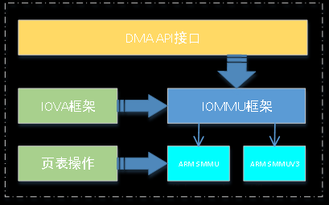

内核 DMA 框架用于将**内存物理地址 PA** 进行映射为**设备可访问**的 **IOVA**, 并**为驱动提供 API 可用接口**.

它包括 **IOVA 框架**(包括 IOVA 的分配和释放), **IOMMU 框架**(DMA MAP/UNMAP 过程), **页表操作**, **ARM SMMU 驱动**及**提供给驱动的 API 接口**.

* DMA API 接口: 为驱动提供 DMA 分配/释放接口, 包括**一致性 DMA**和**流式 DMA**;

* IOMMU 框架: 提供 DMA MAP/UNMAP 过程, 根据 DMA API 接口提供的参数, 分配/释放 IOVA, 并调用 ARM SMMU 驱动进行页表相关操作, 建立/销毁页表项;

* IOVA 框架: 提供 IOVA 的分配和释放, 同时提供 RCACHE 缓存机制;

* ARM SMMU 驱动: 负责与 SMMU 硬件的交互, 包括 SMMU 识别, 外设的识别等.

https://blog.csdn.net/flyingnosky/article/details/116767646