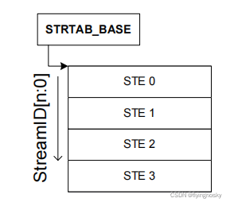
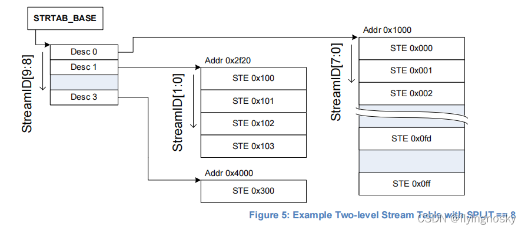
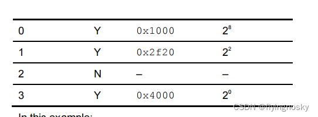
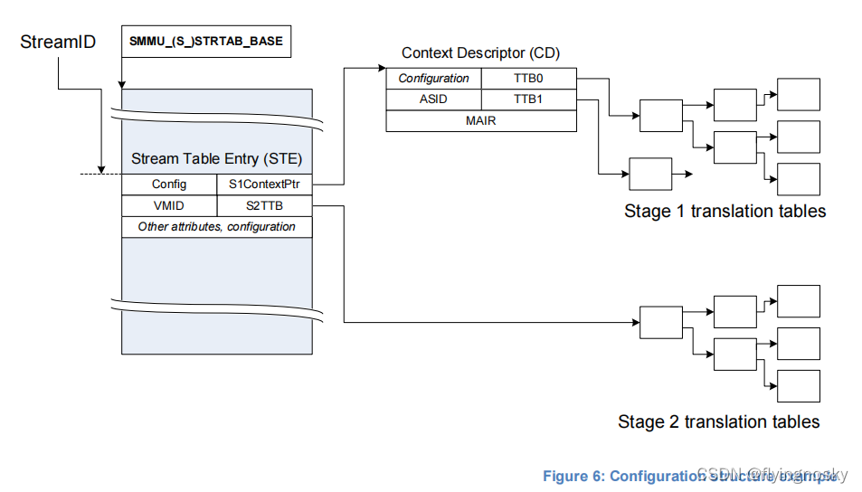
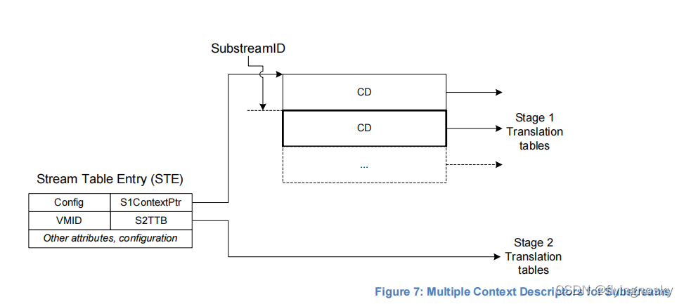
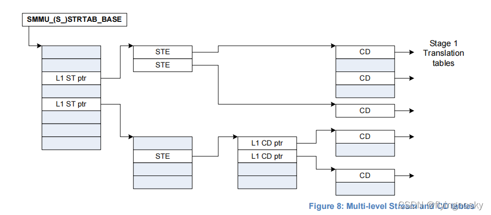
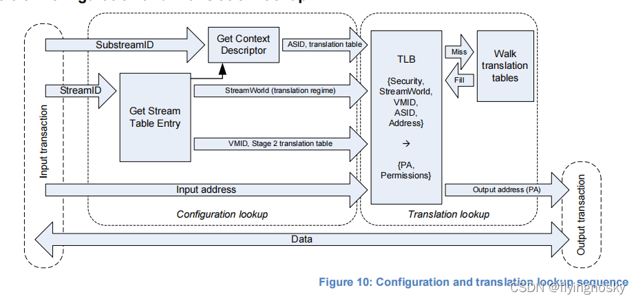

SMMU 使用内存中一组数据结构来放置转换数据.寄存器指向初始根结构 STE 的基地址.STE 包含 stage2 转换表基地址指针,同时也指向 stage1 的配置结构,该配置结构包含转换表基指针.CD 表示 stage1 转换,STE 表示 stage2 转换.

因此 SMMU 使用两组明确的结构:

1. 配置结构,用来将事务的 streamID 映射到转换表的基地址,配置以及转换表访问的上下文;
2. 转换表的结构,用来表示 stage1 和 stage2 的 VA 到 IPA 和 IPA 到 PA 的转换;

对于即将到来的事务的转换,首先找到事务的配置(通过 StreamID 来区分,可选择性的使用 SubstreamID),然后使用配置来找到转换的地址.

处理即将到来的事务的第一步是找到 STE,它告诉 SMMU 它需要的其他配置.

概念上,STE 描述一个 client 设备是在 stage1 或 stage2 或两个阶段.多个设备可以关联到一个虚拟机里,所以多个 STE 可以共享 stage2 的转换表.类似的,多个设备可能共享 stage1 配置,因此多个 STE 可以共享 CD.

1. Stream 表的查找

即将到来的事务的 StreamID 可以定位到 STE.Stream 表支持两种形式.形式是有 Stream 表的基地址寄存器设置的. StreamID 需要被检查,如果 StreamID 选择的 entry 超过配置表的内容或范围,事务会被终止,可以看 SMMU_STRTAB_BASE_CFG 和 C_BAD_STREAMID.当两个安全状态都支持时(SMMU_S_ID R1.SECURE_IMPL=1),事务使用 SEC_SID 标识事务,共安全和非安全的 SMMU 编程接口,看 3.10.1 章节.这决定了是安全或非安全 stream 表被使用.

1.1 线性 stream 表

线性 stream 表示一组连续的 StreamID 从 0 开始标识的 STE.大小可配置为 2~n.多个 STE size 可以达到 SMMU 硬件支持的最大 StreamID bit.所有的 SMMU 实现都支持线性 stream 表格式.

1.2 两级 stream 表

一个两级 stream 表结构提包括一个指向多个二级表的一级表,二级表包含一组线性的 STE.整个结构体的覆盖 StreamID 的范围可配置为 SMMU 支持的最大,但二级表不必全部填充,每个大小可能不一样.这样可以节约内存和避免要求为大的 streamID 空间分配大的连续物理内存.

第一级表由`StreamID[n:x]`标识,其中 n 表示 StreamID 最高 bit 位,x 表示 SMMU_STRTAB_BASE_CFG.SPLIT 指示的配置 split 指针.第二级表由`streamID[x-1:0]`标识,依赖于每个表的范围.

可通过 SMMU_IDR0.ST_LEVEL 域来决定第二级 Stream 表的格式.当支持第二级 Stream 表时,split 可取 6,8,10bit.实现可以只支持线性 Stream 表格式,或线性以及二级格式都支持.

支持超过 64StreamID 的 SMMU 必须支持二级 stream 表.

NOTE: 支持少于 64 StreamID 的实现也可以支持二级 stream 表,但通常不这样用因为用一个二级表就可以满足这种情况的所有 streams.

NOTE:规则意味着当线性 STREAM 表的最大 size 过大而不能放置入 4K 页时,实现需要支持二级表.

第一级描述符包含共 StreamID 相关的第二级表,每个描述符可以标识为无效.

图 3.2 描述了第一级表,split 设置为 8:

在这个例子中:

1. 表示了 StreamID 0~1023,虽然并不是所有的都有效;
2. 一组在 0x1000 的 STE(0~255)被配置(每个可单独使能相关的 StreamID);
3. 一组在 0x2f20 的 STE(256~259)被配置;
4. StreamID 512~767 无效;
5. StreamID 768 在 0X4000;

Split=8 的二级表可以减少连续内存的使用.若完全的 256 个 PCIE bus 都支持时,RID 或 SID 为 16 位.但是,通常每个物理链路有一个 PCIE bus,每个 PCIE bus 可能存在一个设备,在最坏的情况下有效的 StreamID 为 256 StreamID.

或者,split=6 提供了 64 个二级 STE,使每个二级表使用 4K 页.

STE 包含每个 stream 的配置:

1. 是否使能来之设备的流量;
2. 是否是 stage1 转换;
3. 是否是 stage2 转换
4. 哪个数据结构定位到 stage1 的转换表
若使用 stage1,STE 使用域 STE.S1ContextPtr 来指示内存中的一个或多个 CD 的地址.

CD 关联起 streamID 和 stage1 转换表基指针(转换 VA 到 IPA),基于 stream 的配置以及 ASID.若使用 SubStreamID,多个 CD 表示多个 stage1 的转换,每个 SubstreamID 指向一个.当 stage1 转换没有使能时 SubStreamID 指向的事务会被终止.

如果使用 stage2,STE 包含 stage2 转换表基指针(将 IPA 转换为 PA)和 VMID.如果多个设备都与某个特定的虚拟机相关,这意味着他们共享 stage2 转换表.多个 STE 可能都映射到同一个 stage2 转换表.

NOTE: ARM 期望当 hypervisor 软件存在时,hypervisor 管理 stream 表和 stage2 转换表.CD 和 stage1 的转换表由 guest OS 来管理.另外,hypervisor 可以充分使用 stage1 转换来实现自己的内部目的.当不使用 hypervisor 时,单个 OS 管理 stream 表和 CD.要了解更多,可查章节 3.6.

当事务带 SubstreamID 时,配置使能 substreams,SubstreamID 标识了选择 stage1 转换上下文的 CD.在这个配置中,若 substreamID 没有使用时,行为依赖于 STE.S1DSS 标志:

1. 当 STE.S1DISS=0b00,所有在事务需要携带 SubstreamID,缺少 SubstreamID 意味着错误.当事务不带 SubstreamID 会被 abort 并 event 会被记录.
2. 当 STE.S1DISS==0b01 时,事务不带 SubstreamID 可被接受且被看作它的配置是 stage1 bypass.仅当事务携带 SubstreamID 时才会使能 stage1 转换.
3. 当 STE.S1DISS=0B10 时,事务不带 SubstreamID 被接受且使用 substream=0 的 CD.在这个配置下,带 SubstreamID=0 的事务被 abort 且 event 被记录.

CD 和 STE 结构中的 ASID 和 VMID 用来 tag TLB 条目(这些条目是由 CD 和 STE 的配置来创建的).这些 tag 用来查找和区分不同 stream 的地址空间的转换,或匹配接收到 broadcast TLB 操作的无效化项.实现可能使用这些 tag 来有效的允许不同的 stream 共享不同的转换表.

图 6 给出了一个例子,配置中 StreamID 用来选择线性 Stream 表中的 STE.STE 指向 stage2 的转换表和一个 stage1 配置的单个 CD.然后 CD 指向 stage1 的转换表.

图 7 给出了一个配置中 STE 指向多个 CD.SubstreamID 用来选择 CD 中的一个并且 SubstreamID 决定一个事务使用哪个 stage1 转换.

图 8 给出了一个更复杂的情况,使用多级 stream 表.两个 STE 分别指向单个 CD,第三个 CD 指向多级 CD 表.使用多级,在不需要很大的连续物理表的情况下可以支持多个 streams 和 substream.

即将来的事务处理如下步骤:

(1)如果 SMMU 全局 disable(比如 SMMU_CR0.SMMUEN=0),事务会 pass through SMMU 且无任何地址修改.全局属性,如内存类型或共享型,被应用到 SMMU 的 SMMU_GBPA 寄存器.或者 SMMU_GBPA 寄存器可以被配置为 abort 所有的事务.

(2)若步骤(1)中的全局 bypass 没有使用时,

a. STE 被定位到;

b. STE 使能 stage2 事务,STE 包含 stage2 的转换表基地址;

c. STE 使能 stage1 事务,CD 被定位到.若 STE 使能 stage2 转换,从使用 stage2 转换表中的 IPA 空间取出 CD.否则从 PA 空间取出 CD.

(3)若配置有效,发起转换:

a. 若 stage1 被配置为转换,CD 包含转换表基地址.若 STE 的 stage2 被使能时要求进行 stage2 转换.否则 stage1 跳过转换,输入地址直接到 stage2;

b. 若 stage2 被配置为转换,STE 包含发起 nested walked 的 stage1 转换表(若使能),或 IPA 的正常 walk.否则,stage2 跳过转换,stage2 的输入地址被作为输出地址.

(4)具有有效的配置的事务在转换过程中没有 fault 时,会有输出的地址(内存属性).

NOTE: 上述时序描述了非安全 stream 的路径.若支持两个安全状态时,安全状态的事务也类似,除了 SMMU_S_CR0.SMMUEN 和 SMMU_S_GBPA 控制 bypass,stage2 不支持.

这些步骤要求实现能够缓存数据.章节 16.2 描述了配置和转换结构的缓存.

此外,event 可能发生在处理过程中的多个阶段,以此来阻止进一步处理.若事务不能找到有效的配置或者遇到不支持的类型,它将以 abort 终止,并 event 被记录.如果事务进展到转换阶段,fault 可能在转换的任一阶段产生.CD 和 STE 特有的配置用来决定事务是否终止或是否 stall,暂缓软件 fault 解决,看章节 3.12.

使用 VA 到 IPA 或 IPA 到 PA 来描述两个阶段转换.

NOTE: 一些涉及到 SMMU 输入的系统使用 BA.术语 VA 重点表示 SMMU 的输入,也可能与 PE 进程的虚拟地址空间一样.

若没有特别说明,转换表和他们的配置域与 ARMV80A PE 的转换系统一样.

若 SMMU 没有实现两个阶段的任一阶段,它会配置为固定 bypass 转换.还有其他的限制,比如,配置一个不存在的 stage 是无效的.SMMU 至少支持一个转换 stage.

3. 配置和转换的查找

图中 描述了配置查找和转换查找所涉及的相关概念.

        正如 3.3.2 中所描述的,传入的事务首先受配置查找的约束,而 SMMU 决定怎样开始进行事务的转换.这涉及到找到合适的 STE,如果有必要也需要 CD.

        配置的查找不依赖于输入的地址,它取决于:

SMMU 全局寄存器的配置;
传入事务的 StreamID;
传入事务的 SubstreamID(如果有应用)
        配置查找的结果是找到转换的 stream 或 substream 相关的配置,包括:

stage1 转换表的基指针,ASID,以及用于修改的转换表解析或 walk 的属性(比如转换粒度);
Stage2 转换表的基指针,VMID,以及用于修改的转换表解析或 walk 的属性;
stream 相关的属性,如 stream 相关的 streamworld(异常级别,转换区域).
        转换查找过程逻辑上与 PE 侧内存地址转换系统工作一样.输出给系统的是物理地址,它取决于:

输入地址;
StreamWorld(安全状态和异常级别),ASID 和 VMID(由前一级来提供)
        上图呈现在转换查找中被用到的 TLB.ARM 希望 SMMU 使用 TLB 来缓存转换而不是对每个事务都进行 TTW,但不是强制的.

        NOTE:为了清楚起见,图 3.7 没有呈现错误上报路径或从 stage2 转换获取 CD(这也需要访问 TLB 或 TTW).实现可以选择上述一些步骤的 flatten 或组合,但需要保持相同行为.

        缓存的事务与标明转换区域的 streamworld 相关联.Streamworld 相当于 PE 中的异常级别.

        事务的 streamworld 是由插入转换的配置决定的.缓存的转换的 streamworld 由 STE 的安全状态决定,STE.Config 域/STE.STEW 域/SMMU_CR2.E2H 或 SMMU_S_CR2.E2H 配置.可以查看章节 5.2 stream table entry 中的 STE.STRW 域.

        除了插入到 TLB 外,Streamworld 影响 TLB 的查找,TLB 无效化的不同类型的范围.SMMU 的实现不要求区分 EL2 和 EL2-E2H 的缓存转换.

        对于 TLB 无效化行为,查看章节 3.17 TLB tagging, VMIDs, ASIDs and participation in broadcast TLB maintenance.

每个转换与以下 streamworld 相关:

NS-EL1 在 PE 侧,等同于非安全的 EL1

NS-EL2 等同于非安全的 EL2(当 E2H 没有使用时,不带 ASID)

NS-EL2-E2H 等同于非安全的 EL2(当 E2H 使用时,带 ASID)

EL2 等同于非安全的 EL2((当 E2H 没有使用时,不带 ASID)
EL2-E2H 等同于安全的 EL2(当 E2H 使用时,带 ASID)
        Secure 等同于以下其一:1. 当运行在 AArch32 EL3 时,单个转换区域被安全 EL1 和安全 EL3 使用;2. 当运行在 AArch64 EL3 时,安全 EL1;区域要求 AISD,若支持安全 stage2,需要 VMID.

EL3 等同于 AArch64 EL1 和 EL3

        NOTE:在 SMMU 中 Streamworld 能够区分不同的转换区域,不同的转换区域与在不同异常级别的不同软件相关.比如,在安全 EL3 下对地址 0X1000 的转换与在非安全 EL2 下对地址 0x1000 的转化是不同的.通常,ARM 期望为 stream 配置的 streamworld,能够匹配软件控制 stream 或 device 的异常级别.

        术语"any-EL2"用来描述 NS-EL2 和 S-EL2 的共同行为.术语"any-EL2-E2H"用来描述 NS-EL2-E2H 和 S-EL2-E2H 的共同行为.

   在 ARMV8-A 的 MMU 也同样,若定义了独一无二的输入参数{streamworld, VMID,ASID,Address},那么转换也是唯一的.

比如,下列是唯一的且可以在转换缓存中存在:

带相同的地址,但不同的 ASID 的条目;
带相同的地址和 ASID,但不同的 VMID;
带相同的地址和 ASID,但不同的 streamworld;
架构上,由 streamID 和 substreamID 来区分,转换时不唯一的.这会引起两个结果?:

一组事务的输入参数{streamID, substreamID}的转换时不唯一的.两个 stream 可以被配置为相同的转换配置,从配置查找中生成的 ASID/VMID 可以区分一组共享的转换缓存条目;
多个 streamID/substreamID 配置可能导致相同的 ASID/VMID/streamworld 配置,这时它必须维护能够影响 TLB 查找的相同配置.比如,两个 stream,都配置为 stage1,NS-EL1 且 AISD=3,这两 stream 必须使用相同转换表基地址和转换粒度.
在本文档中,术语 TLB 用来表示转换缓存的概念,由 streamworld/VMID/ASID/VA 来标识.

SMMU 缓存维护命令分为两组:

配置缓存的维护,依赖于 streamID 和 substreamID;
转换缓存的维护,依赖于地址/ASID/VMID/streamworld;
第二组命令直接匹配可能在 PE 侧有效的广播 TLB 维护操作.

4 事务的属性:incoming,两阶段转换和 overrides

除了地址,size 和读写属性,传入的事务还可能带有其他属性,如访问类型(例如对于设备,WB-cached 普通内存),共性性(如 outer shareable),缓存分配提示,和权限相关的属性,指令/数据,特权和非特权,安全和非安全.部分属性用来检查访问决定转换表的页权限.在通过 SMMU,面对系统的一个事务也可能有一组属性,这些属性可能被 SMMU 影响.

输入属性如何影响系统中的输出属性(与转换表属性和其他配置),这在章节 13 中描述.

在概念上系统提供输入属性,或者以设备特定的方式定义事务的属性,或在事务输入到 SMMU 之前由互联以系统特有的方式设置.

作为概述:

(1)权限相关的属性(指令/数据,特权/非特权)和读写属性用来检查转换表的权限,也可能拒绝访问.输入到 SMMU 的权限相关的属性可能在执行权限检查之前被 per-device 的基础上覆盖,这通过 INSTCG,PRIVCFG 和 NSCFG STE 域.SMMU 输出这些属性.

NOTE: 若一个设备不能支持某种类型的 traffic,覆盖可能非常有用.

(2)其他属性(内存类型,共享性,缓存 hint)旨在对内存系统而不是对 SMMU 有效,比如,控制事务的缓存查找.输出到内存系统的属性是由用来转换输入地址的转换表描述符制定的属性的 function.SMMU 通过这个过程传输一个设备输入属性,因此设备可能影响最后的事务访问,且输入属性可能被设备的基础属性如 MTCFG/MEMATTR,SHCFG,ALLOCCFG STE 域覆盖.当 stage1 和 stage2 转换 bypass 时,被这些域修改的输入属性对输出的访问属性有用,但也可用与 stage2 的配置,设备 sttream 可能需要更精细的要求的访问行为,而不是虚拟的全局的 stage2 的转换表.

STE 属性和权限覆盖域(MTCFG/MEMATTR,ALLOCCFG,INSTCFG,PRIVCFG 和 NSCFG)允许传入的值被使用,对每个域,可选择特定被覆盖的值.如 INSTCFG 可以配置 stream 为 Always Data,而取代传入的 INST 属性.但在与设备紧密耦合或嵌入设备的 SMMU 实现中,传入的属性始终被认为是最合适的.当 SMMU 和设备保证传入的属性是正确的时,允许 SMMU 使用传入的值作为属性值.查看 SMMU_IDR1.ATTR_TYPES_OVR 和 SMMU_IDR1.ATTR_PERMS_OVR.对于 SMMU,它无法保证从 client 设备提供的属性一直正确,比如分离式 SMMU 设计,ARM 强烈建议支持传入属性的覆盖.

5 转换表描述符

ARMv8-A VMSA 定义 stage2 block 和页表描述符的 `bits[63:60]` 被 SMMU 保留使用.在 SMMUV3.1 和后面的版本,这些 bits 都被保留.

NOTE:当 PBHA bit 使能时,`bits[62:60]` 被 PBHA 机制影响.当 PBHA 不使能时,之前的定义被使用

https://blog.csdn.net/flyingnosky/article/details/122051399

https://blog.csdn.net/flyingnosky/article/details/122074660

https://blog.csdn.net/flyingnosky/article/details/122095697

https://blog.csdn.net/flyingnosky/article/details/122117310
