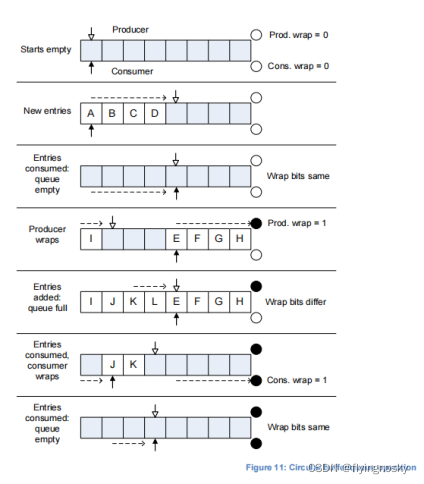

SMMU 所有的输入和输出队列都是内存中的环形 buffer.编程接口包括一个输入的 command 队列和一个输出的 event 队列(可选一个 PRI 队列).每个队列用于 producer-consumer 方式,一个输出队列包含 SMMU 产生和软件消耗的数据.输入队列包含软件产生的数据,SMMU 来消耗.

1. SMMU 环形队列

一个队列为 2^n 大小的 FIFO 环形,带一个基指针和两个 index 寄存器 PROD 和 CONS,表明队列中的生产者和消耗者的当前位置.对输入和输出情况,仅 SMMU 维护一个 index,软件维护另一个 index.

对于输入队列(command 队列),在向一个队列中插入一项时软件来更新 PROD index,SMMU 读取来决定新的项.每一个项被消耗 SMMU 更新 CONS index,软件读取来决定每一项被消耗,空间被消耗.输出队列正好相反.

PROD 表明由生产者下一个被写的位置的 Index,若队列非满.CONS 表明若队列非满,下一个被读的位置的 index.index 必须一致增加,当它超过队列的顶部时卷积到底部.

队列使用镜像环形 buffer 安排,它允许所有项同时有效(而不是在其他环形 buffer 中的 N-1 个有效项).每个 index 由一个 wrap 标志,下一个更高位临近 index 值包含 PROD 和 CONS.该位每次反转.由每个 index 的 owner,生产者或消费者,当 owner 更新 index 来反转该位.软件读取寄存器,增加或反转 index,写回 wrap 和 index 域.单个更新阻止 index 和 wrap 的非一致性.

(1)若两个 index 相等且 wrap 位相同时,队列为空,没有可消耗的内容;

(2)若两个 index 相等且 wrap 位不相等时,队列为满,不能在产生内容;

(3)若两个 Index 不相等或 wrap 位不相等时,消耗者消耗内容,增加 CONS index 直到队列为空(index 和 wrap 位都相等)

因此,当两个 index 表明同一个位置时,wrap 位区分空 buffer 和满 buffer 情况.

在初始化时,在使能队列前,控制 SMMU 的 agent 写队列 index.队列 index 必须被初始化位下列连续的状态:

(1) `PROD.WR=CONS.RD`且`PROD.WR_WRAP=CONS.RD_WRAP`,表示一个空队列;

NOTE: ARM 期望在正常初始化时为此状态.

(2) `PROD.WR=CONS.R`D 且`PROD.WR_WRAP!=CONS.RD_WRAP`,表示一个满队列;

(3) PROD.WR>CONS.RD 且 PROD.WR_WRAP=CONS.RD_WRAP,表示部分满队列;

(4) `PROD.WR<CONS.RD`且`PROD.WR_WRAP!=CONS.RD_WRAP`,表示部分满队列;

无论在初始化还是队列使能后控制 SMMU 的 agent 不能写队列 index 到下述不连续的状态:

(1) `PROD.WR>CONS.RD`且`PROD.WR_WRAP!=CONS.RD_WRAP`;

(2) `PROD.WR<CONS.RD`且`PROD.WR==CONS.RD_WRAP`;

若队列 index 被写到非连续的状态,下列不可预测的行为被允许:

(1) SMMU 对特定的队列消耗或生产,在队列中队列项在未知的位置;

(2) SMMU 对特定的队列不消耗或生产,队列项处于非连续的状态;

每个环形 buffer 大小为 2^n, 0<=n<=19.实现支持少于 19bit 的索引.每个 PROD 和 CONS 寄存器为 20bit,其中 19bit 用于索引加上 wrap bit.实际使用的 buffer 大小由软件决定,由 SMMU 实现定义的.wrap 位的位置取决于配置 index 大小.

NOTE: 比如,当一个队列被配置为 128 项,这意味着:

(1)队列 index 为 7bit;

(2)PROD.WR 和 CONS.RD 域为 7bit.队列索引为 PROD 和 CONS 的`[6:0]`位.

(3)PROD 和 CONS 寄存器的位`[7]`为 wrap 位,其中位`[19:8]`被忽略.

下图呈现了环形 buffer 的生命周期:

当生产或消耗 entry 时,软件必须只增加 index(除了当增加会导致 wrap).index 不能向后移动.SMMU 也需要保证,仅增加 index 或 wrap 它的 index 值.

每个实现的安全状态有一个命令队列.SMMU 命令从队列中被顺序消耗.

Event 队列可以并发的接受 evnts,比如从设备流量或配置错误造成的错误记录.在非安全侧,有一个全局 event 队列接受所有来自非安全 stream 和配置的事件.

当`SMMU_S_IDR1.SECURE_IMPL=1`时,也存在一个安全 event 队列接受所有来自安全 stream 和配置的事件.

2. 队列项可见语义

任何生产者(无论 SMMU 还是软件)必须保证如果消耗者可以看见更新 PROD 值,那么消耗者也可以看到所有新的队列项.对于 SMMU 输出队列(Event 队列和 PRI 队列),SMMU 写队列数据到内存中,当数据在内存共享域中变得可见,SMMU 允许更新的 PROD 值可见.这是新队列项对消耗者可见的第一步.

消耗者只能通过观察更新的 PROD 索引来观察队列中新的有效项在存在.如果消耗者读取一个超出 PROD 最后索引的队列项,这个项中保含的数据未知.

NOTE: 中断顺序规则也存在.SMMU 通过 PROD 使得队列的更新可见,在此时不会比发送队列中断更后.

NOTE: 在中断到来时,软件不能假定新的队列项存在,而不去首先读取 PROD 索引.比如,如果之前的中断 handler 处理掉所有的事件包括第二批,这里下一个中断 handler 将没有新的队列项处理.

3 Event 队列行为

SMMU 可能支持转换错误的配置行为,这使错误事务被 STALL,暂停然后恢复,或立即中止并放弃事件.

Event 被记录到 event 队列来回复配置错误或传入事件相关的转换错误.传入的事务会导致一系列错误或 fault,若 event 消耗得不够快,event 队列可能 overflow.若 event 队列满时,STALL 错误导致的 event 不会被丢弃,但当 event 队列消耗 event 项且下一个空闲时可以被记录.若 event 队列满时,其他类型的 event 被丢弃.

NOTE: ARM 期望可能被丢弃的 event 用于 debug.后面章节将根据 overflow 作准确的队列行为.

ARM 期望系统软件从 event 队列消耗 event 项来避免在正常情况下 overflow.

在本文档的所有情况下,当一个 event 被记录时,若在 event 队列中对一个新的项有空闲时且队列可写时,event 将被记录.队列可写且使能时,没有全局 error 标志和不会 overflow.没有报告的 event 用来回复 STALL 事务(比如当没有 STALL 域,或 STALL=0),若没有记录被允许丢弃.当 event 队列可写,STALL event 不会被丢弃并被记录.软件必须消耗来自队列的 event 来释放空间,否则 pending STALL event 不会被记录.STALL event 不同于其他 event.队列以相同环形顺序被填充,这种 event 不再存在,不会被消耗.

当多个 pending event 同时往 event 队列写时,ARM 建议一个实现不会优先 non-stall event 超过 stall=1 event.

若 event 产生来回复中止事务,在事务回复返回到 client 之前 event 可见.可查看 CMD_SYNC,它强制与中止的事务的 event 可见.

NOTE: 这意味着产生的 event 以回复中止的事务并作为 SMMU event 可以被看到,在事务中止被报告给 client 设备之间.

4 写"commit"记录 event

event 记录产生被抽象为以下步骤:

1. 触发 event 产生,比如一个转换错误;
2. 在 SMMU 内部产生 event 记录;
3. 决定可能写一个新队列项;
4. 最后 event 记录被提交且写到 event 队列项;
5. 在 event 队列里 event 记录可见:
-记录数据位置的更新对要求的 shareability domain 可见;
-PROD.WR 索引被更新新的记录给软件.在队列的语义上,记录不可见直到写 index 被更新覆盖新的项.
第 4 点表示 event 将被写入到队列且变成可见.直到 commit,event 写可能不会发生(比如,若队列满且软件不消耗任何 event 项,event 写将不会 commit).

若后续 write 不遭遇外部的 abort,被 commit 在 event 写在队列中被可见.

STALL event 记录的写必须 commit 直到队列项可写(队列使能且不满).若不可写,STALL 记录被 buffer 直到队列可写.

5 event 合并

允许实现合并多个 event 记录.当多个相同的 event 产生时,这可能会产生,当单独 event 不能应用增加的可用信息,这可用来减少 event 队列的 event 记录.

当以下所有条件满足时 event 可以被合并:

1. event 类型和所有域都相同,除了明确表明的域;
2. 若存在,STALL 域为 0.STALL 错误记录不再被记录.

实现不再要求合并任何 event,但不再要求支持 STE.MEV 标志来使能或继承 event 的合并.

NOTE: 为调试目的,可通过 STE.MEV 标志 disable event 的合并.

软件实现(比如 SMMU 的虚拟模拟)不要求满足 STE.MEV.在 guest 要求合并被 disable 后, hypervisor 可能造成 event 被合并.

https://blog.csdn.net/flyingnosky/article/details/122397888

https://blog.csdn.net/flyingnosky/article/details/122483835

