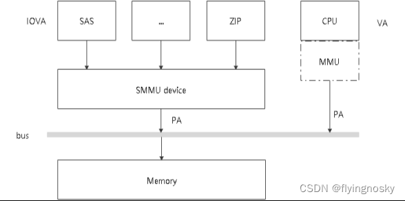
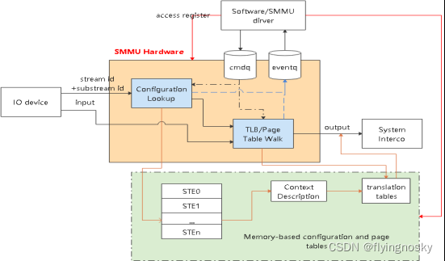

结合 SMMU 架构手册,计划分多次对 IOMMU/SMMUV3 代码进行简要的分析.

在分析代码之前,仍需要对 IOMMU 及 SMMUV3 软硬件架构作简要介绍,其实在之前的博文中有作介绍,在这里重新梳理一下.

# 1. SMMU 的作用和位置

SMMU 为 System Memory Management Unit,它的功能与 MMU 功能类似,将 IO 设备的 DMA 地址请求(IOVA)转化为系统总线地址(PA),实现地址映射,属性转换,权限检查等功能,实现不同设备的 DMA 地址空间隔离.

如果不使能 SMMU,IOVA=PA,对于 PA 是由伙伴系统分配,最大连续地址为 4M(4K 系统上),但使能 SMMU 后分配的是 IOVA,完全可以分配.

# 2. SMMU 软硬件交互介绍

1. SMMU 处于 IO 设备和总线之间,负责将设备的输入 IOVA 转化为系统总线的物理地址 PA;
2. SMMU 硬件包含 configuration lookup/TLB/Page Table Walk 以及 cmdq/eventq 等部分,其中 configuration lookup 部分查找 stream id 所对应的配置(ste/cd), 最终指向 page table 基地址等;
3. SMMU 通过 configuration lookup 找到设备的配置及页表基地址等,然后查询 TLB 中是否存在输入地址 input 的映射,如果 TLB 命中,直接返回输出 PA;若 TLB 没有命中,PTW 模块逐级查询页表,找到页表中的映射,输出 PA;
4. 软件/SMMU 驱动通过 CMDQ/EVENTQ 进行交互,驱动通过 CMDQ 发送命令给 SMMU 硬件(如 TLBI/SYNC 等);SMMU 硬件通过 EVENTQ 通知驱动有事件需要处理(如设备缺页等)
5. 软件/驱动建立和维护内存中的配置和页表

# 3. IOMMU 软件架构介绍

IOMMU 软件框架如下图所示:

IOMMU 框架可分为如下层次:

1. DMA-MAP 层:提供对其他驱动 DMA MAP/UNMAP 的 API 接口;
2. IOVA 层:提供 IOVA 的分配与释放,并提供 RCACHE 缓存机制;
3. IO 页表层:提供对 IO 设备页表的操作;
4. SMMU 驱动层:提供 SMMU 驱动初始化,提供 IOMMU 对应的回调函数;
5. 其它 API 接口:可提供对 VFIO 等 API 接口;

本节中基本为原来介绍过的内容,但是理解后续代码的基础,因此在这里作简要的介绍.

https://blog.csdn.net/flyingnosky/article/details/122420548