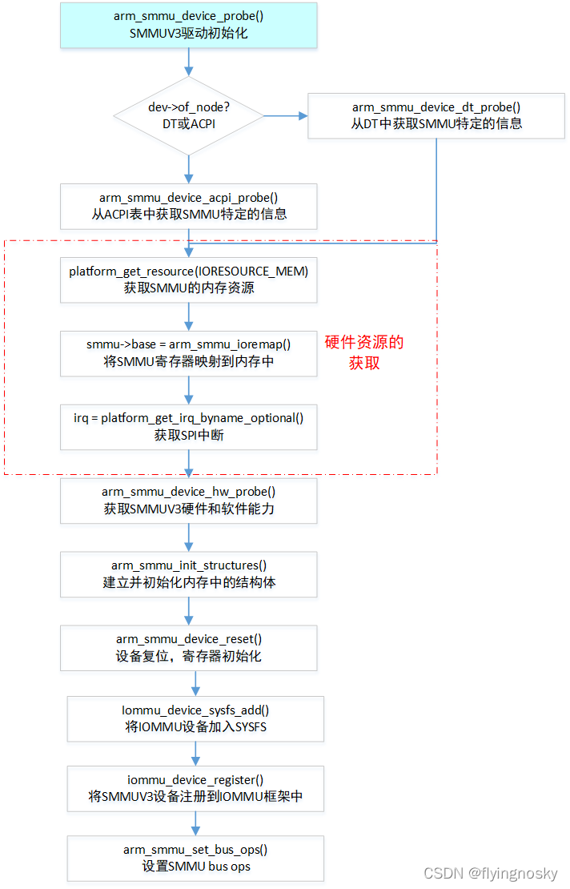
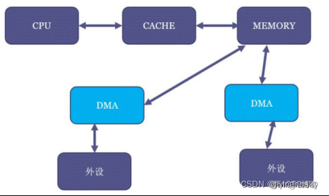
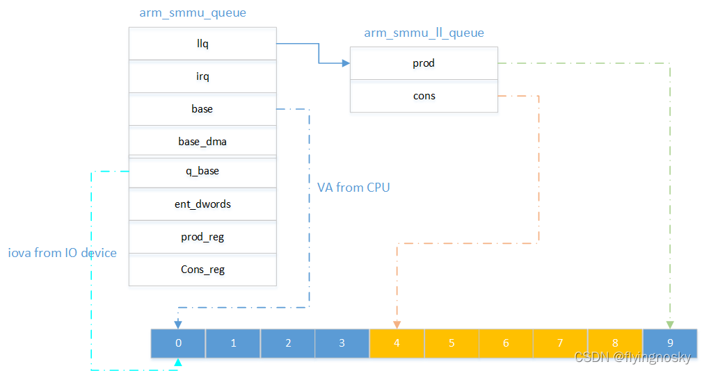
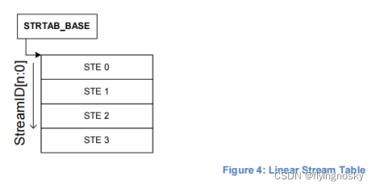
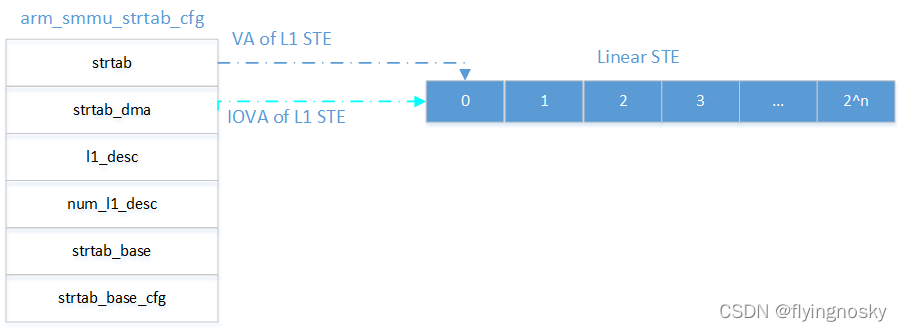
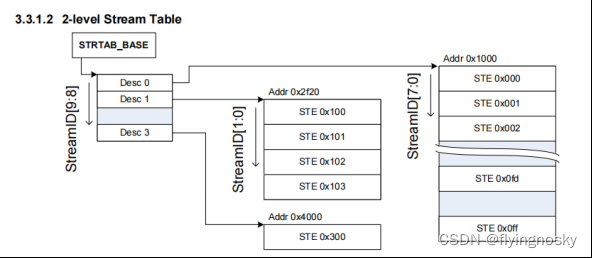
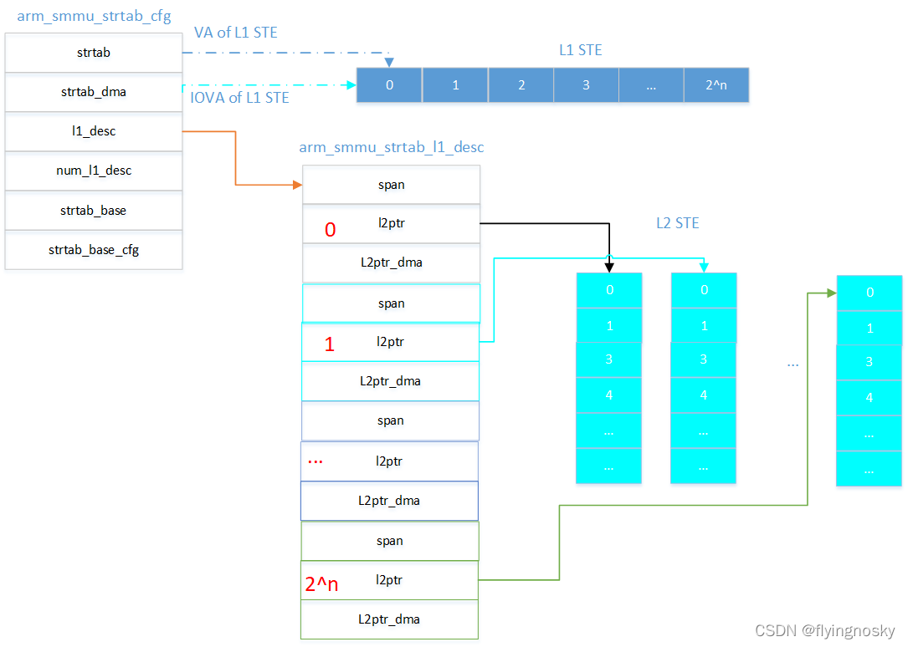
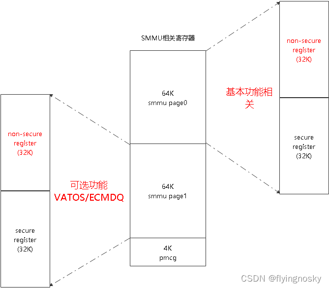

当 SMMU 设备生成 platform device 后,加载 SMMUV3 驱动会触发 SMMUV3 驱动的 probe 函数 arm_smmu_device_probe(),该函数进行 SMMUV3 驱动初始化.

总体上 SMMUV3 驱动初始化流程如下图所示:

它总体上分为以下几个部分:

# 1. 从 ACPI 或 DT 表中获取 SMMU 硬件的信息

使用函数 arm_smmu_device_acpi_probe()从 ACPI 表中(SMMUV3 IORT)获取 SMMUV3 结点信息;使用函数 arm_smmu_device_dt_probe()从 DT 表中获取 SMMUV3 结点信息.

这里仅对 ACPI 方式作介绍.

结构体 acpi_iort_smmu_v3 获得到的内容即为 SMMUV3 IORT 表的内容.这里不作重复介绍.

其中 arm_smmu_get_option()对 CAVIUM_CN99XX 和 HISILICON_HI161X 作 workaround.同时检查 IORT 表中是否设置 COHACC_OVERRIDE 标志,若设置则使能 COHERENCY 特性.

这里简单对硬件 SMMU 的 COHERENCY 特性作介绍.

借用网上的一张图作描述:CPU 与内存交互数据时,为提高性能,一般会有 CACHE 作缓存,当对内存进行写时,会先写到 CACHE 中,再根据 CACHE 类型作 WRITE THROUGH 或 WRITEBACK;当对内存进行读时,会先从 CACHE 中读取;而 IO 设备与内存中,是通过 DMA 进行交互,没有类似 CACHE 的东西.

这样就存在问题:当对内存进行读时,可能内存中的数据并不是最新的,这时需要软件或硬件将 CACHE 中的数据同步到内存中;当对内存进行写时,可能内存中的数据与 CACHE 中数据不一致,这时需要软件或硬件将 CACHE 中的数据无效化,这样才能保证数据的一致性.而在这个过程中在读时将 CACHE 数据同步到内存中,在写时将 CACHE 中的数据无效化的操作由硬件来做,即硬件支持 COHERENCY 即一致性,否则需要软件来做.

# 2. SMMUV3 硬件资源的获取

这里 SMMUV3 驱动获取 SMMU 的硬件资源,包括内存资源,中断资源.

驱动获取内存资源,并对内存资源作 IO 映射,获取到 SMMU 的寄存器,驱动与 SMMU 可以通过寄存器进行软硬件交互.

这里中断资源为 IORT 表中的 SPI 中断,这里是可选的,若支持 MSI,不需要在 IORT 表中指定 SPI 中断,若不支持 MSI,从 IORT 表中获取 SPI 中断号.

# 3. SMMUV3 硬件及软件能力的获取

在函数 arm_smmu_device_hw_probe()通过读取 SMMU 寄存器获取 SMMU 的硬件能力和软件能力.这里列出特性以及简单描述.

<table style="width:100%">
<caption>Description</caption>
  <tr>
    <th>
    特性
    </th>
    <th>
    描述
    </th>
  </tr>
  <tr>
    <td>
    ARM_SMMU_FEAT_2_LVL_STRTAB
    </td>
    <td>
    支持二级 STE
    </td>
  </tr>
  <tr>
    <td>
    ARM_SMMU_FEAT_2_LVL_CDTAB
    </td>
    <td>
    支持二级 CD
    </td>
  </tr>
  <tr>
    <td>
    ARM_SMMU_FEAT_TT_LE
    </td>
    <td>
    支持转换表小端
    </td>
  </tr>
  <tr>
    <td>
    ARM_SMMU_FEAT_TT_BE
    </td>
    <td>
    支持转换表大端
    </td>
  </tr>
  <tr>
    <td>
    ARM_SMMU_FEAT_PRI
    </td>
    <td>
    支持 PRI 页请求(PCIE)
    </td>
  </tr>
  <tr>
    <td>
    ARM_SMMU_FEAT_ATS
    </td>
    <td>
    支持 ATS 地址转换服务(PCIE)
    </td>
  </tr>
  <tr>
    <td>
    ARM_SMMU_FEAT_MSI
    </td>
    <td>
    支持 MSI 中断
    </td>
  </tr>
  <tr>
    <td>
    ARM_SMMU_FEAT_SEV
    </td>
    <td>
    当队列由满到非满时触发 WFE 唤醒事件
    </td>
  </tr>
  <tr>
    <td>
    ARM_SMMU_FEAT_HYP
    </td>
    <td>
    支持 hypervisor stage1
    </td>
  </tr>
  <tr>
    <td>
    ARM_SMMU_FEAT_E2H
    </td>
    <td>
    支持 host OS 运行在 EL2
    </td>
  </tr>
  <tr>
    <td>
    ARM_SMMU_FEAT_STALLS
    </td>
    <td>
    支持 STALL 模式
    </td>
  </tr>
  <tr>
    <td>
    ARM_SMMU_FEAT_STALL_FORCE
    </td>
    <td>
    强制支持 STALL 模式
    </td>
  </tr>
  <tr>
    <td>
    ARM_SMMU_FEAT_TRANS_S1
    </td>
    <td>
    支持 stage1 转换
    </td>
  </tr>
  <tr>
    <td>
    ARM_SMMU_FEAT_TRANS_S2
    </td>
    <td>
    支持 stage2 转换
    </td>
  </tr>
  <tr>
    <td>
    ARM_SMMU_FEAT_RANGE_INV
    </td>
    <td>
    支持范围的无效化
    </td>
  </tr>
  <tr>
    <td>
    ARM_SMMU_FEAT_VAX
    </td>
    <td>
    支持虚拟地址扩展
    </td>
  </tr>
  <tr>
    <td>
    ARM_SMMU_FEAT_SVA
    </td>
    <td>
    支持 SVA,软件特性
    </td>
  </tr>
</table>

除了上述 SMMU 软硬件能力外,还会根据寄存器的内容设置 SMMU 输入地址大小 ias,asid/vmid/sid/ssid 的位数,command 队列/event 队列的大小,支持的页表大小,输出地址大小 oas.这里不对特性展开介绍,待后面讲到此特性在做详细介绍.

# 4. 建立并初始化内存中 SMMU 相关的结构体

函数 arm_smmu_init_structure()对内存中的结构包括 command 队列/event 队列/PRI 队列和 STE 结构建立并初始化.若不支持,就没必要做初始化.

## 4.1. SMMU 环形队列

SMMU 的 command 队列作为输入队列,软件填写命令到 command 队列,SMMU 从环形队列中读取命令并执行命令.Command 队列主要用于 TLB 无效化命令,预取命令以及 ATS 和 PRI 相关命令的发送.

SMMU 的 event 队列作为输出队列,SMMU 填写 event 到 event 队列,软件从 event 队列中读取 event 并作响应.Event 队列主要用于转换过程中的 error 和 fault 的上报.

SMMU 的 PRI 队列暂不介绍

SMMU 环形队列的初始化由函数 arm_smmu_init_structure()完成.

其中,结构体 arm_smmu_queue 中 irq 为若支持 SPI 中断时命令完成的 SPI 中断号;base 为队列所对应 entry 的基地址的虚拟地址;base_dma 为队列所对应 entry 的基地址的 IOVA 地址;q_base 为队列的基地址的 IOVA 地址(最终赋值给 SMMU 寄存器);ent_dwords 为每个 entry 的大小; prod_reg 为 PROD 寄存器地址;cons_reg 为 CONS 寄存器地址.结构体 arm_smmu_ll_queue 表示当前队列中的指向的 prod 和 cons index.

如上例中,分配了 10 个项的队列,其中项 4~8 表示在使用的,其中 cons 表示消费者在项 4,而 prod 表示生产者在项 9.

函数 arm_smmu_init_one_queue()用于建立如上结构,并将 llq.prod 和 llq.cons 为 0.

## 4.2. STE

STE 为 Stream Table Entry,用于描述 stream(设备)的配置信息.它分为线性 STE 和二级 STE.

### 4.2.1. 线性 STE
线性 STE 为一组连续的 STE,由 StreamID=0 开始,大小 2^n 大小.但每个 STE 大小为 60byte,当 STE 数目比较多时,需要分配的连续内存比较大,对于连续内存不够的系统,可能分配比较困难,因此又定义了二级 STE,可以节省分配连续内存的大小.

线性 STE 的初始化由函数 arm_smmu_init_strtab_linear()完成.它通过 dmam_alloc_coherent()分配包含多个 STE 的连续内存,返回的 VA 地址(cfg->strtab)给 CPU 使用,返回的 IOVA 地址(cfg->strtab_base)给 SMMU 使用.对每个 STE 通过函数 arm_smmu_write_strtab_ent()进行 STE 初始化,这里暂不介绍,在 IO 设备识别时再对其作详细介绍,这里仅作少许域的介绍.

### 4.2.2. 二级 STE

二级 STE 如下图所示,第一级 STE 并不指向真实的 STE,而是指向第二级 STE,第二级 STE 指向真实的 STE 且为线性的 STE.第一级 STE 的索引由 StreamID[n: SPT]决定,其中 SPT 由 SMMU_STRTAB_BASE_CFG.SPLIT 决定.第二级 STE 的最大数目由 `StreamID[SPT:0]` 决定.

二级 STE 的初始化由函数 arm_smmu_init_strtab_2lvl()执行,但并不会作二级 STE 全作初始化,该函数仅对二级 STE 的第一级 STE 的初始化,其第二级 STE 的初始化在 IO 设备被加入时由函数 arm_smmu_init_l2_strtab()完成.

# 复位 SMMU 设备

通过函数 arm_smmu_device_reset()复位 SMMU 设备, 此过程主要是设置 SMMU 相关寄存器, 对 SMMU 初始化操作. 在进行寄存器描述之前, 对 SMMU 相关的寄存器布局做简单介绍.

## SMMU 相关寄存器布局
SMMU 相关寄存器布局如下图所示:

(1) SMMU 寄存器分为三部分: page0, page1, pmcg 寄存器;

page0 寄存器定义基本功能相关; page1 定义可选功能 VATOS/ECMDQ 等; pmcg 寄存器定义 PMCG 模块寄存器;

(2)page0 和 page1 也分为非安全和安全部分, 各 32K 大小;

其中是否定义 page1 是由 page0 中的寄存器决定的;

(3)PMCG 寄存器是放在 page0 中的实现自定义的区域, 还是如上图中放其他位置, 是实现定义的;

## 复位相关的操作

复位过程其实就是根据支持的特性, 进行寄存器的配置, 配置过程如下:

(1)检查 ARM_SMMU_CR0 是否设置 SMMUEN, 让设置表明已经使能过 SMMU, 设置 GBPA_ABORT 复位, 否则下一步;

(2)清 ARM_SMMU_CR0ACK 寄存器 disable SMMU 设备;

(3)设置队列和表内存的属性 ARM_SMMU_CR1(设置为 inner shareablity 和 writeback)

(4)设置 ARM_SMMU_CR2, 使能 PTM 和 E2H;

(5) 将 STE 相关的 cfg.strtab_base 和 cfg.strtab_base_cfg 赋值给寄存器(告诉 SMMU 设备 STE 表地址和配置);

(6)使能 SMMUEN;

(7)发送 CMDQ_P_CFGI_ALL 命令无效化缓存中的配置(无效化操作后续专门章节介绍);

(8)发送 CMDQ_OP_TLBI_EL2_ALL&CMDQ_OP_TLBI_NSNH_ALL 无效化 TLB 项;

(9)设置 event 队列的内存地址/PROD/CONS, 并使能 CR0_EVTQEN;

(10)设置 PRI 队列的内存地址/PROD/CONS, 并使能 CR0_PRIQEN;

(11)根据 ATS 支持情况, 设置 CR0_ATSCHK;

(12)通过函数 arm_smmu_setup_irqs()设置中断相关:

disable IRQs; 若支持 SPI, 注册中断处理函数, 否则支持 MSI, 分配 MSI 中断, 并注册写 message 函数; 注册 evtq 的中断处理函数, 注册 gerror 的中断处理函数; ARM_SMMU_IRQ_CTLRACK 使能中断;

(13)根据 bypass 和 disable_bypass 设置, 设置 GBPA_ABORT;

# 注册 IOMMU 设备

函数 iommu_device_sysfs_add()将 smmu->iommu 注册到 sysfs 文件系统中;

函数 iommu_device_register()将 iommu 设备添加到 iommu_device_list 链表中, 并将 iommu->ops = arm_smmu_ops;

函数 arm_smmu_set_bus_ops()将 arm_smmu_ops 设置                      pci_bus_type / amba_bustype / platform_bus_type;

其中 arm_smmu_ops 是 IOMMU 框架调用底层 SMMU 的接口, 在后续代码讲解中会对各接口做介绍.

至此 SMMU 设备的初始化过程完成, 后面会讲解 IO 设备是如何跟 SMMU 设备关联起来的.

https://blog.csdn.net/flyingnosky/article/details/122463386

https://blog.csdn.net/flyingnosky/article/details/122481517