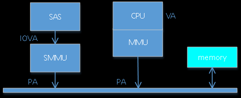
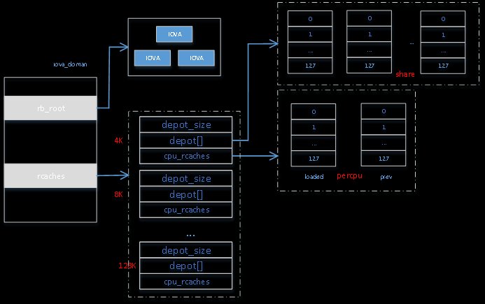

# RCACHE 框架介绍

对于**设备**, 其访问的地址称为 **IOVA**(也称 **DMA 地址**), 经过 **SMMU 转换**才是物理地址 PA.

IOVA 的生成和释放是影响性能的重要一环. 在进行一次转换时, 首先会**分配 IOVA**, 然后将 IOVA 及对应的 PA 进行映射, 这样 **CPU 侧**想要操作 PA 对应的数据时使用 **VA**, 而**设备**若访问对应的 PA 的数据时使用 **IOVA**; 在设备不需要使用数据时, 取消 IOVA 和 PA 对应的映射.

* IOVA 的真正**分配**是通过在 **SLAB** 中**分配结构体** `[]`, 并在 IOVA 所在范围里找到一个对齐于 `2^n * 4K` 大小的范围, 并**加入**到 IOVA 的**红黑树** RB TREE 中;

* IOVA 的真正**释放**是将该 IOVA 从 IOVA 的红黑树 RB TREE 中取出, 并释放对应的结构体.

可以看到, 既需要在红黑树中频繁的查找/添加/删除, 又需要不断的进行 SLAB 分配和释放. 为了提升性能, 采用 **RCACHE 机制**进行 IOVA 的分配和释放.

RCACHE 机制如下:

* 在申请**分配 IOVA** 时, 首先从 RCACHE 中查找对应的大小的 IOVA, 若存在, 直接返回使用; 若不存在, 才真正去分配 IOVA, 并将其放入 RB TREE 中;

* 在**释放 IOVA** 时, 首先尝试在 RCACHE 中查找是否存在对应大小 IOVA 的空闲位置, 若存在, 将要释放的 IOVA 放于 RCACHE 中缓存, 若不存在, 才去真正释放, 同时将 IOVA 从 RB TREE 中删除.

IOVA 的范围由函数 `iommu_dma_init_domain()`(`"drivers/iommu/dma-iommu.c"`) 决定, 可通过 **ACPI 指定**, 但不能为 0, 默认在 48 BIT 系统中为 `[1 2^48-1]`.

intel, amd 和 virtio iommu 都是 `[0 ~ U64_MAX]`.

# RCACHE 相关的结构体

与 RCACHE 相关的结构体如下图所示:

# IOVA 分配和释放

IOVA 的分配如下所示:

1. 若 IOVA 的大小超过 128K, 需要真正分配 IOVA, 走步骤(3), 否则走步骤 (2);
2. 根据 IOVA 的大小找到对应的 RCACHE 结点, 首先检查 **percpu** 中 `loaded` 链是否存在可用的 IOVA 缓存, 若存在返回使用, 否则检查 prev 链是否存在可用的 IOVA 缓存, 若存在返回使用, 并交换 `loaded` 链和 prev 链, 否则(`loaded` 链和 `prev` 链都为空)检查 `depot[]` 是否存在空闲, 若存在, 将 `depot[]` 与 `loaded` 交换, 并从中取空闲 IOVA 项, 否则(`loaded`/`prev`/`depot` 都为空)走步骤 (3) 真正分配 IOVA;
3. 从 SLAB 中分配 IOVA, 在 RB TREE 中查找合适的位置, 赋值给 IOVA, 并将其插入到 RB TREE 中;

IOVA 的释放如下所示:

1. 若需要释放的 IOVA 超过 128K, 需要真正释放 IOVA, 走步骤(3), 否则走步骤(2);
2. 根据 IOVA 的大小找到对应的 RCACHE 结点, 首先检查 percpu 中 loaded 链是否已满, 若未满则将其放对应的缓存中, 否则检查 percpu 中的 prev 链是否已满, 若未满则放到对应链中缓存中, 否则(loaded 和 prev 链已满)检查共享缓存 `depot[]`是否已满, 若未满则放到`depot[]`中, 否则(`loaded`/`prev`/`depot` 都满)分配新的 iova magazine, 将原来的 loaded 释放, 将新的 iova magazine 赋给 loaded, 从 loaded 找到空闲位置放置缓存;
3. 在 RB TREE 中找到对应的 IOVA, 将其从 RB TREE 中删除, 并释放 IOVA;

# IOVA 框架存在问题

当前 IOVA 框架存在问题如下:

1. 最大 IOVA 大小为 128K, 超过此大小就会真正分配和释放;
2. 在缓存满时, 会持续分配/释放 IOVA, 刷新缓存机制不完善;
3. 当缓存满时, RB TREE 过大, 导致对 RB TREE 的操作比较花时间;

https://blog.csdn.net/flyingnosky/article/details/116771018