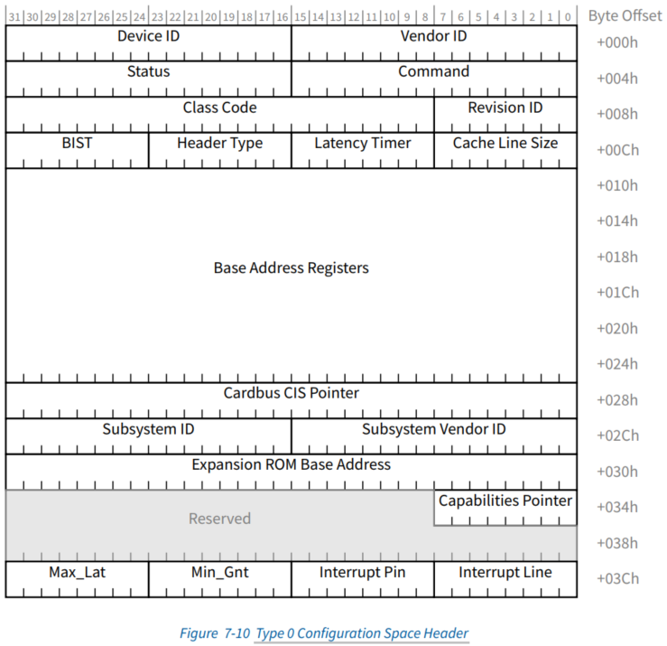
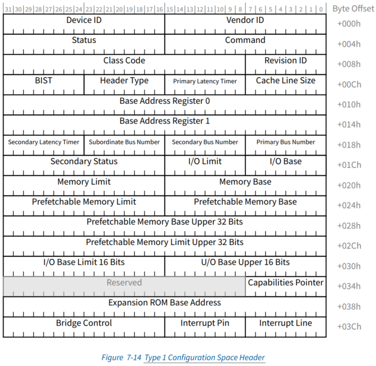

在 passthrough 两种 PCI 设备时候, 针对 configuration space header 来说



对于 type 0 设备:

* 仅仅 **command 寄存器**(`0x4 ~ 0x5`) 和 **status 寄存器**(`0x6 ~ 0x7`) 这两个, guest 可以直接读**物理寄存器**, 其他的只能访问虚拟寄存器; 并且对于一个 VF 设备, 读 command 寄存器无论如何会置位 MSE(Memory Space Enable)

* 仅仅 **command 寄存器**(`0x4 ~ 0x5`), **status 寄存器**(`0x6 ~ 0x7`), **interrupt Line 寄存器**(`0x3c`) 和 **Base Address 寄存器**(`0x10 - 0x27`) 这些, guest 是可写的(写到物理寄存器或者虚拟寄存器), 其他的寄存器 guest **不可写**. 其中

  * 只有 **command 寄存器** 和 **status 寄存器** 是可以直接写到**物理寄存器**;

  * **Base Address 寄存器** 和 **interrupt Line 寄存器** 只能写到**虚拟寄存器**.

* 在 reset 之前(比如 S3 suspend 时候) 需要 hypervisor store 保存 **Base Address 寄存器**(`0x10 ~ 0x27`), 然后 reset 以后(比如 S3 resume 时候), guest 会写 command 寄存器, 如果其中 (PCIM_CMD_PORTEN | PCIM_CMD_MEMEN), 就需要 hypervisor restore 恢复 Base Address 寄存器



对于 type 1 设备:

* **command 寄存器**(`0x4 ~ 0x5`), **status 寄存器**(`0x6 ~ 0x7`), **从 Primary Bus Number 寄存器 到 I/O Base Limit 16 Bits 寄存器**(`0x18 ~ 0x33`) 这些, guest 可以直接读 物理寄存器, 其他的只能访问虚拟寄存器; 并且对于一个 VF 设备, 读 command 寄存器无论如何会置位 MSE(Memory Space Enable)

* **command 寄存器**(`0x4 ~ 0x5`), **status 寄存器**(`0x6 ~ 0x7`), **interrupt Line 寄存器**(`0x3c`), **Base Address 寄存器**(`0x10 ~ 0x17`) 和 **Secondary Status 寄存器**(`0x1e ~ 0x1f`) 这些, guest 是可写的(写到物理寄存器或者虚拟寄存器), 其他的寄存器 guest **不可写**. 其中:

  * 只有 **command 寄存器**, **status 寄存器** 和 **Secondary Status 寄存器** 是可以直接写到**物理寄存器**;

  * **Base Address 寄存器** 和 **interrupt Line 寄存器** 只能写到**虚拟寄存器**.

* 在 reset 之前(比如 S3 suspend 时候) hypervisor 需要 store 保存 **Base Address 寄存器**(`0x10 ~ 0x17`) 以及**从 Primary Bus Number 寄存器 到 I/O Base Limit 16 Bits 寄存器**(`0x18 ~ 0x33`, 除了 Secondary Latency Timer 是 read-only 并且为 0, 除了 Secondary Status 是可读可写的), 然后 reset 以后(比如 S3 resume 时候), guest 会写 command 寄存器, 如果其中:

  * (PCIM_CMD_PORTEN | PCIM_CMD_MEMEN), 就需要 hypervisor restore 恢复 Base Address 寄存器, I/O Base (0x1c) 寄存器, I/O Limit (0x1d) 寄存器 和 从 Memory Base 寄存器到 I/O Base Limit 16 Bits 寄存器
  * (PCIM_CMD_BUSEN), 就需要 hypervisor restore 恢复 Primary Bus Number 寄存器, Secondary Bus Number 寄存器以及 Subordinate Bus Number 寄存器.


从实现上来讲:


具体实现类似:

```cpp
// 读 cfg
static int32_t read_pt_dev_cfg(struct pci_vdev *vdev, uint32_t offset,
		uint32_t bytes, uint32_t *val)
{
	int32_t ret = 0;

    // 0x0 < offset < 0x40, 即 configuration space header(配置空间 header), 有 64 字节空间
	if (cfg_header_access(offset)) {
		ret = read_cfg_header(vdev, offset, bytes, val);
    // 访问 msi capability
	} else if (msicap_access(vdev, offset)) {
		*val = pci_vdev_read_vcfg(vdev, offset, bytes);
    // 访问 msix capability
	} else if (msixcap_access(vdev, offset)) {
		read_pt_vmsix_cap_reg(vdev, offset, bytes, val);
    // 访问 sriov capability
	} else if (sriovcap_access(vdev, offset)) {
		read_sriov_cap_reg(vdev, offset, bytes, val);
	} else {
		if ((offset == vdev->pdev->sriov.pre_pos) && (vdev->pdev->sriov.hide_sriov)) {
			*val = pci_vdev_read_vcfg(vdev, offset, bytes);
		} else if (!is_quirk_ptdev(vdev)) {
			/* passthru to physical device */
			*val = pci_pdev_read_cfg(vdev->pdev->bdf, offset, bytes);
			if ((vdev->pdev->bdf.value == CONFIG_IGD_SBDF) && (offset == PCIR_ASLS_CTL)) {
				*val = pci_vdev_read_vcfg(vdev, offset, bytes);
			}
		} else {
			ret = -ENODEV;
		}
	}

	return ret;
}

// 写 cfg
static int32_t write_pt_dev_cfg(struct pci_vdev *vdev, uint32_t offset,
		uint32_t bytes, uint32_t val)
{
	int32_t ret = 0;

	if (cfg_header_access(offset)) {
		ret = write_cfg_header(vdev, offset, bytes, val);
	} else if (msicap_access(vdev, offset)) {
		write_vmsi_cap_reg(vdev, offset, bytes, val);
	} else if (msixcap_access(vdev, offset)) {
		if (vdev->msix.is_vmsix_on_msi) {
			write_vmsix_cap_reg_on_msi(vdev, offset, bytes, val);
		} else {
			write_pt_vmsix_cap_reg(vdev, offset, bytes, val);
		}
	} else if (sriovcap_access(vdev, offset)) {
		write_sriov_cap_reg(vdev, offset, bytes, val);
	} else {
		if (offset != vdev->pdev->sriov.pre_pos) {
			if (!is_quirk_ptdev(vdev)) {
				if ((vdev->pdev->bdf.value != CONFIG_IGD_SBDF) || (offset != PCIR_ASLS_CTL)) {
					/* passthru to physical device */
					pci_pdev_write_cfg(vdev->pdev->bdf, offset, bytes, val);
				}
			} else {
				ret = -ENODEV;
			}
		}
	}

	return ret;
}
```

```cpp
struct cfg_header_perm {
	/* For each 4-byte register defined in PCI config space header,
	 * there is one bit dedicated for it in pt_mask and ro_mask.
	 * For example, bit 0 for CFG Vendor ID and Device ID register,
	 * Bit 1 for CFG register Command and Status register, and so on.
	 *
	 * For each mask, only low 16-bits takes effect.
	 *
	 * If bit x is set the pt_mask, it indicates that the corresponding 4 Bytes register
	 * for bit x is pass through to guest. Otherwise, it's virtualized.
	 *
	 * If bit x is set the ro_mask, it indicates that the corresponding 4 Bytes register
	 * for bit x is read-only. Otherwise, it's writable.
	 */
	/* For type 0 device */
	uint32_t type0_pt_mask;
	uint32_t type0_ro_mask;
	/* For type 1 device */
	uint32_t type1_pt_mask;
	uint32_t type1_ro_mask;
};

static const struct cfg_header_perm cfg_hdr_perm = {
	/* Only Command (0x04-0x05) and Status (0x06-0x07) Registers are pass through */
	.type0_pt_mask = 0x0002U,
	/* Command (0x04-0x05) and Status (0x06-0x07) Registers and
	 * Base Address Registers (0x10-0x27) are writable */
	.type0_ro_mask = (uint16_t)~0x03f2U,
	/* Command (0x04-0x05) and Status (0x06-0x07) Registers and
	 * from Primary Bus Number to I/O Base Limit 16 Bits (0x18-0x33)
	 * are pass through
	 */
	.type1_pt_mask = 0x1fc2U,
	/* Command (0x04-0x05) and Status (0x06-0x07) Registers and
	 * Base Address Registers (0x10-0x17) and
	 * Secondary Status (0x1e-0x1f) are writable
	 * Note: should handle I/O Base (0x1c) specially
	 */
	.type1_ro_mask = (uint16_t)~0xb2U,
};

#define PCI_CFG_HEADER_LENGTH 0x40U
#define PCIR_BIOS	      0x30U

/*
 * @pre offset + bytes < PCI_CFG_HEADER_LENGTH
 */
static int32_t read_cfg_header(const struct pci_vdev *vdev,
		uint32_t offset, uint32_t bytes, uint32_t *val)
{
	int32_t ret = 0;
	uint32_t pt_mask;

	if ((offset == PCIR_BIOS) && is_quirk_ptdev(vdev)) {
		/* the access of PCIR_BIOS is emulated for quirk_ptdev */
		ret = -ENODEV;
	} else if (vbar_access(vdev, offset)) {
		/* bar access must be 4 bytes and offset must also be 4 bytes aligned */
		if ((bytes == 4U) && ((offset & 0x3U) == 0U)) {
			*val = pci_vdev_read_vcfg(vdev, offset, bytes);
		} else {
			*val = ~0U;
		}
	} else {
		if (is_bridge(vdev->pdev)) {
			pt_mask = cfg_hdr_perm.type1_pt_mask;
		} else {
			pt_mask = cfg_hdr_perm.type0_pt_mask;
		}

		if (bitmap32_test(((uint16_t)offset) >> 2U, &pt_mask)) {
			*val = pci_pdev_read_cfg(vdev->pdev->bdf, offset, bytes);

			/* MSE(Memory Space Enable) bit always be set for an assigned VF */
			if ((vdev->phyfun != NULL) && (offset == PCIR_COMMAND) &&
					(vdev->vpci != vdev->phyfun->vpci)) {
				*val |= PCIM_CMD_MEMEN;
			}
		} else {
			*val = pci_vdev_read_vcfg(vdev, offset, bytes);
		}
	}
	return ret;
}

/*
 * @pre offset + bytes < PCI_CFG_HEADER_LENGTH
 */
static int32_t write_cfg_header(struct pci_vdev *vdev,
		uint32_t offset, uint32_t bytes, uint32_t val)
{
	bool dev_is_bridge = is_bridge(vdev->pdev);
	int32_t ret = 0;
	uint32_t pt_mask, ro_mask;

	if ((offset == PCIR_BIOS) && is_quirk_ptdev(vdev)) {
		/* the access of PCIR_BIOS is emulated for quirk_ptdev */
		ret = -ENODEV;
	} else if (vbar_access(vdev, offset)) {
		/* bar write access must be 4 bytes and offset must also be 4 bytes aligned */
		if ((bytes == 4U) && ((offset & 0x3U) == 0U)) {
			vdev_pt_write_vbar(vdev, pci_bar_index(offset), val);
		}
	} else {
		if (offset == PCIR_COMMAND) {
#define PCIM_SPACE_EN (PCIM_CMD_PORTEN | PCIM_CMD_MEMEN)
			uint16_t phys_cmd = (uint16_t)pci_pdev_read_cfg(vdev->pdev->bdf, PCIR_COMMAND, 2U);

			if (((phys_cmd & PCIM_SPACE_EN) == 0U) && ((val & PCIM_SPACE_EN) != 0U)) {
				/* check whether need to restore BAR because some kind of reset */
				if (pdev_need_bar_restore(vdev->pdev)) {
					pdev_restore_bar(vdev->pdev);
				}

				/* check whether need to restore bridge mem/IO related registers because some kind of reset */
				if (dev_is_bridge) {
					vdev_bridge_pt_restore_space(vdev);
				}
			}
			/* check whether need to restore Primary/Secondary/Subordinate Bus Number registers because some kind of reset */
			if (dev_is_bridge && ((phys_cmd & PCIM_CMD_BUSEN) == 0U) && ((val & PCIM_CMD_BUSEN) != 0U)) {
				vdev_bridge_pt_restore_bus(vdev);
			}
		}

		if (dev_is_bridge) {
			ro_mask = cfg_hdr_perm.type1_ro_mask;
			pt_mask = cfg_hdr_perm.type1_pt_mask;
		} else {
			ro_mask = cfg_hdr_perm.type0_ro_mask;
			pt_mask = cfg_hdr_perm.type0_pt_mask;
		}

		if (!bitmap32_test(((uint16_t)offset) >> 2U, &ro_mask)) {
			if (bitmap32_test(((uint16_t)offset) >> 2U, &pt_mask)) {
				/* I/O Base (0x1c) and I/O Limit (0x1d) are read-only */
				if (!((offset == PCIR_IO_BASE) && (bytes <= 2)) && (offset != PCIR_IO_LIMIT)) {
					uint32_t value = val;
					if ((offset == PCIR_IO_BASE) && (bytes == 4U)) {
						uint16_t phys_val = (uint16_t)pci_pdev_read_cfg(vdev->pdev->bdf, offset, 2U);
						value = (val & PCIR_SECSTATUS_LINE_MASK) | phys_val;
					}
					pci_pdev_write_cfg(vdev->pdev->bdf, offset, bytes, value);
				}
			} else {
				pci_vdev_write_vcfg(vdev, offset, bytes, val);
			}
		}

		/* According to PCIe Spec, for a RW register bits, If the optional feature
		 * that is associated with the bits is not implemented, the bits are permitted
		 * to be hardwired to 0b. However Zephyr would use INTx Line Register as writable
		 * even this PCI device has no INTx, so emulate INTx Line Register as writable.
		 */
		if (offset == PCIR_INTERRUPT_LINE) {
			pci_vdev_write_vcfg(vdev, offset, bytes, (val & 0xfU));
		}

	}
	return ret;
}
```